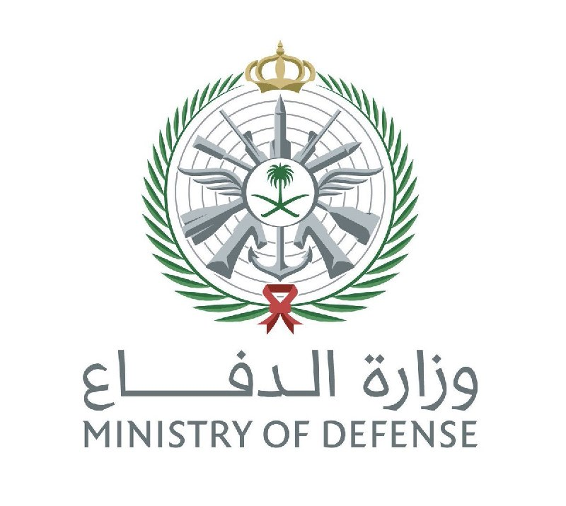
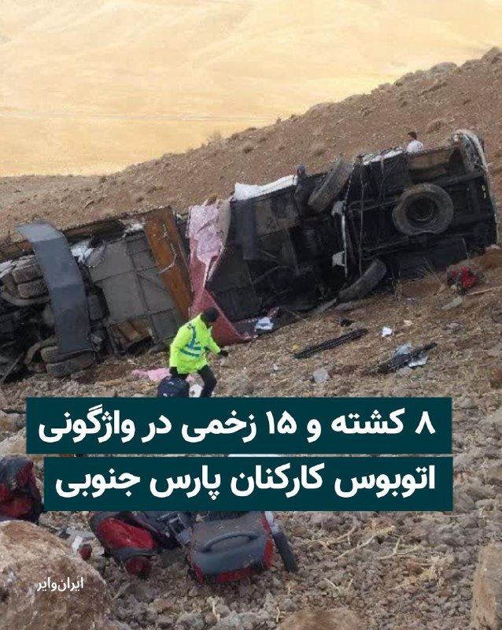
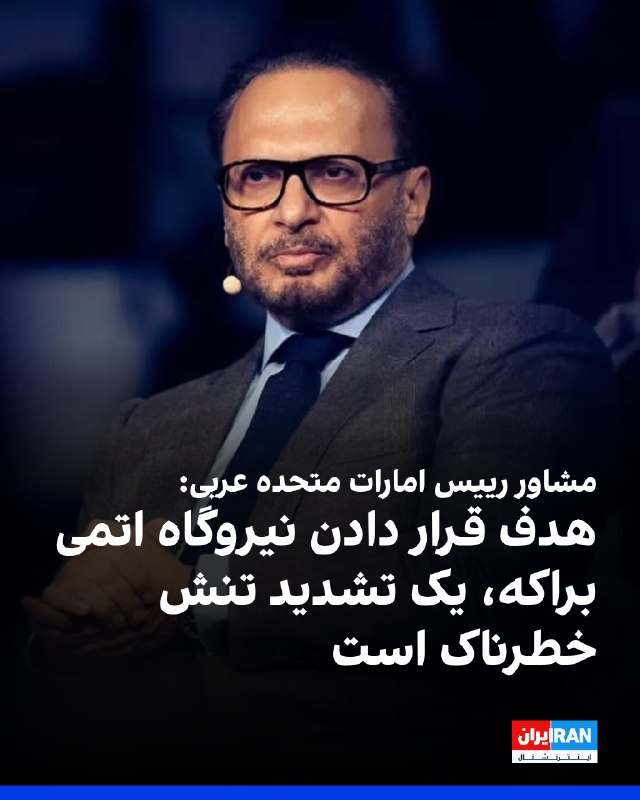
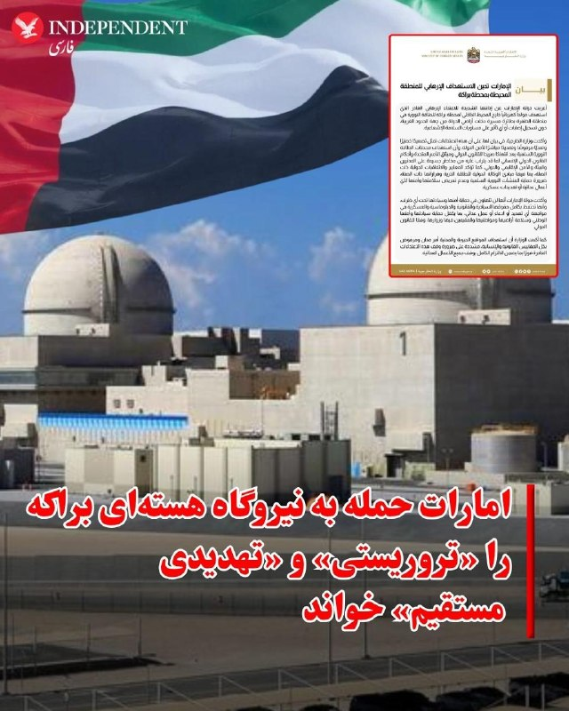
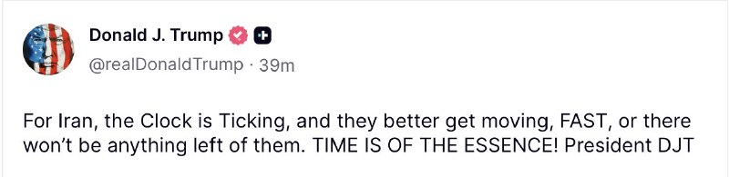
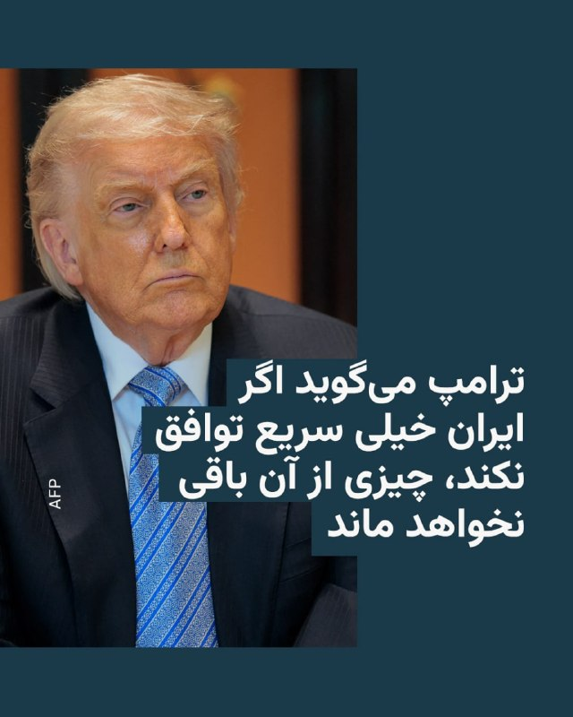
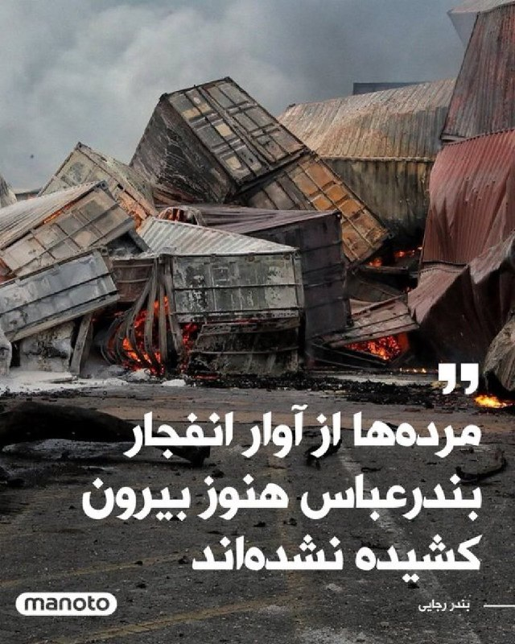

# خواننده تلگرام

<!-- TOP_NAV START -->

<a href="https://github.com/gitpod-test3753/aio-downloader/blob/main/telegram/content/archive_1.md" style="display:inline-block; padding:6px 12px; margin:0 4px; background-color:#2ea44f; color:white; text-decoration:none; border-radius:4px; font-weight:bold;">صفحه بعد</a>

<!-- TOP_NAV END -->

<!-- MSG START -->

---
📅 بروزرسانی: 1405/02/28 00:34
---

## VahidOOnLine — post 240702

  <a href="telegram/content/VahidOOnLine_240702_1779051863.mp4" target="_blank">🎬 Download video</a>

‌
وزارت دفاع عربستان سعودی اعلام کرد سه پهپاد که صبح یکشنبه از حریم هوایی عراق وارد فضای این کشور شده بودند، رهگیری و منهدم شدند.

عربستان در بیانیه‌ای تاکید کرد حق پاسخ‌گویی را برای خود محفوظ می‌داند و برای مقابله با هرگونه تعرض به حاکمیت و امنیت خود، اقدامات عملیاتی لازم را انجام خواهد داد.
‌🏁 🇬🇧 ManotoTV

🤖 @VahidOOnLine

## VahidOOnLine — post 240701

  

♦️ترکی المالکی، سخنگوی رسمی وزارت دفاع عربستان سعودی، یکشنبه ۲۷ اردیبهشت‌ماه اعلام کرد سه پهپاد پس از ورود به حریم هوایی این کشور از سمت حریم هوایی عراق رهگیری و منهدم شدند.

سرلشکر ترکی المالکی تاکید کرد وزارت دفاع عربستان سعودی حق پاسخ‌گویی را در زمان و مکان مناسب برای خود محفوظ می‌داند و تمامی اقدامات عملیاتی لازم را برای مقابله با هرگونه تلاش جهت نقض حاکمیت، امنیت و سلامت شهروندان و ساکنان این کشور انجام خواهد داد.

وزارت دفاع عربستان سعودی افزود این کشور برای مقابله با هرگونه تلاش جهت نقض حاکمیت و امنیت خود، اقدامات عملیاتی لازم را اتخاذ خواهد کرد.
‌🇸🇦 Indypersian

🤖 @VahidOOnLine

## VahidOOnLine — post 240700

  

عربستان سعودی اعلام کرد روز یک‌شنبه سه پهپاد را که از حریم هوایی عراق وارد شده بودند، رهگیری کرده است.

وزارت دفاع عربستان سعودی تأکید کرد این کشور برای مقابله با هرگونه تلاش برای نقض حاکمیت و امنیت خود، اقدامات عملیاتی لازم را انجام خواهد داد و حق پاسخ‌گویی را «در زمان و مکان مناسب» برای خود محفوظ می‌داند.
‌🏁 🇬🇧 IranintlTV

🤖 @VahidOOnLine

## VahidOOnLine — post 240699

  

♦️رسانه‌های جمهوری اسلامی، یکشنبه ۲۷ اردیبهشت‌ماه گزارش دادند که عباس عراقچی، وزیر خارجه جمهوری اسلامی، و ژان نوئل بارو، وزیر خارجه فرانسه، در یک گفتگوی تلفنی درباره موضوعات دوجانبه، آخرین تحولات منطقه‌ای و روندهای جاری دیپلماتیک رایزنی و تبادل نظر کردند.

بر اساس این گزارش‌ها، دو طرف در این تماس تلفنی درباره تحولات منطقه و روندهای دیپلماتیک جاری گفتگو کردند، اما جزئیات بیشتری از محورهای این رایزنی منتشر نشده است.
‌🇸🇦 Indypersian

🤖 @VahidOOnLine

## VahidOOnLine — post 240698

  

سخنگوی فرماندهی مرکزی آمریکا در گفت‌وگو با العربیه اعلام کرد جمهوری اسلامی تهدیدی آشکار برای امنیت جهانی و ثبات منطقه‌ای است و توانایی آن در شلیک موشک و پهپاد به‌شدت کاهش یافته است. او افزود آمریکا همراه با متحدانش برای تقویت سامانه‌های پدافند هوایی همکاری کرده است.

سخنگوی سنتکام گفت جمهوری اسلامی در طول جنگ موشک‌های خود را از مناطق پرجمعیت پرتاب کرده است.

او همچنین تاکید کرد آمریکا تمام تلاش‌های جمهوری اسلامی برای ورود و خروج تجهیزات را زیر نظر دارد و با اعمال محاصره دریایی، با استفاده تهران از تنگه هرمز به‌عنوان ابزار تهدید آزادی کشتیرانی مقابله می‌کند. به گفته او، انتقال تسلیحات به متحدان جمهوری اسلامی متوقف شده و نیروهای آمریکا برای هرگونه طرح اضطراری آمادگی کامل دارند.
‌🏁 🇬🇧 IranintlTV

🤖 @VahidOOnLine

## VahidOOnLine — post 240697

  <a href="telegram/content/VahidOOnLine_240697_1779051865.mp4" target="_blank">🎬 Download video</a>

♦️مسعود پزشکیان، رئیس‌جمهوری ایران، روز یکشنبه در دیدار با محسن نقوی، وزیر کشور پاکستان، از نقش اسلام‌آباد در تثبیت آتش‌بس قدردانی کرد و ابراز امیدواری کرد تلاش‌های پاکستان به تقویت صلح و ثبات در منطقه کمک کند.

پزشکیان در این دیدار تاکید کرد ایران خواهان روابطی صمیمانه و پایدار با کشورهای اسلامی منطقه است و اتحاد کشورهای اسلامی می‌تواند زمینه مداخله قدرت‌های فرامنطقه‌ای را کاهش دهد.

به گزارش ایرنا، محسن نقوی نیز گفت ایران و پاکستان اکنون بیش از گذشته به یکدیگر نزدیک شده‌اند و روابط برادرانه دو کشور باید بیش از پیش گسترش یابد.

این دیدار در حالی انجام شد که پاکستان در هفته‌های اخیر در روند تلاش‌های دیپلماتیک و میانجی‌گری منطقه‌ای برای کاهش تنش‌ها و تثبیت آتش‌بس نقش فعالی ایفا کرده است.
‌🇸🇦 Indypersian

🤖 @VahidOOnLine

## WithYashar — post 11520

هم اکنون گزارش CNN: ترامپ تیم امنیت ملی ارشد خود را برای بحث در مورد ایران فراخواند
@withyashar

## WithYashar — post 11519

پست ترامپ از تیر اندازی به پرچم در تلویزیون ایران فیک است !( این کار انجام شده ولی ترامپ چنین پستی منتشر نکرده ! اکانت فیک ترامپ در X منشع این خبر است

## WithYashar — post 11518

  <a href="telegram/content/WithYashar_11518_1779051865.mp4" target="_blank">🎬 Download video</a>

مارکو روبیو:

دلیل توقف پروژه آزادی به درخواست پاکستان بود. پاکستانی‌ها گفتند: «اگر شما پروژه آزادی را متوقف کنید، فکر می‌کنیم می‌توانیم به توافق برسیم.»

ما پیش رفتیم و موافقت کردیم که آن را متوقف کنیم.
@withyashar

## WithYashar — post 11517

ادعای فارس : ترامپ با آزادسازی دارایی‌های بلوکه شده مخالفت کرد!
@withyashar

## WithYashar — post 11516

صدای پدافند در اهواز
@withyashar

## mwarmonitor — post 9228

🇸🇦«وزارت دفاع عربستان سعودی مدعی شد که ۳ فروند پهپاد را رهگیری کرده است.» @mwarmonitor

## mwarmonitor — post 9227

🇸🇦«وزارت دفاع عربستان سعودی مدعی شد که ۳ فروند پهپاد را رهگیری کرده است.»

@mwarmonitor

## FoxNewsTwitter — post 341861

  

Fox News (Twitter/X)

BREAKING: Two Navy EA18-G jets collided in midair while performing an aerial demonstration for the Mountain Home Air Force Base Gunfighter Skies Air Show on Sunday, the U.S. Navy confirmed to Fox News Digital. All four air crew successfully ejected. (Photo: Michael Katz)

## FoxNewsTwitter — post 341860

  <a href="telegram/content/FoxNewsTwitter_341860_1779051867.mp4" target="_blank">🎬 Download video</a>

Fox News (Twitter/X)

Marco Rubio draws a direct line between Christianity and the founding of America during a speech at the “Rededicate 250” prayer event in Washington, D.C.

Before the Christian West, Rubio says, most civilizations viewed history as an endless cycle “only to end up back where it began.”

“But our faith calls us outwards into the limitless darkness of the unknown,” he says. "It tells us to go forth and preach the gospel to the world as a witness unto all nations unto the ends of the Earth."

"From that command, came America."

## pm_afshaa — post 90927

  <a href="telegram/content/pm_afshaa_90927_1779051869.webm" target="_blank">🎬 Download video</a>

🔴سی‌ان‌ان به نقل از یک منبع آگاه:
ترامپ روز شنبه با اعضای ارشد تیم امنیت ملی آمریکا درباره مسیر جنگ با ایران جلسه برگزار کرده.

جی‌دی ونس، مارکو روبیو، رئیس سیا و استیو ویتکاف هم در این نشست حضور داشتن؛ جلسه‌ای که ساعاتی پس از بازگشت ترامپ از سفر چین برگزار شد.

💧 Rainbet.com the #1 Non-KYC Crypto Casino & Sportsbook @rainbetcom

😁 @Pm_Afshaa

## pm_afshaa — post 90926

  <a href="telegram/content/pm_afshaa_90926_1779051869.webm" target="_blank">🎬 Download video</a>

🔴مارکو روبیو، وزیر خارجه آمریکا:
دلیل توقف «پروژه آزادی»، این بود که پاکستان چنین درخواستی کرد. پاکستانی‌ها گفتن: «اگر شما پروژه آزادی رو متوقف کنید، فکر می‌کنیم بتونیم به یک توافق برسیم.»
ما موافقت کردیم و متوقف کردیم.

💧 Rainbet.com the #1 Non-KYC Crypto Casino & Sportsbook @rainbetcom

😁 @Pm_Afshaa

## pm_afshaa — post 90925

عربستان سعودی: امشب 3 پهپاد پرتاب‌شده از عراق رو رهگیری کردیم.

💧 Rainbet.com the #1 Non-KYC Crypto Casino & Sportsbook @rainbetcom

😁 @Pm_Afshaa

## pm_afshaa — post 90924

  <a href="telegram/content/pm_afshaa_90924_1779051870.webm" target="_blank">🎬 Download video</a>

🔴سی‌ان‌ان: ترامپ تیم امنیت ملی ارشد خود را برای بحث در مورد ایران فراخواند.

💧 Rainbet.com the #1 Non-KYC Crypto Casino & Sportsbook @rainbetcom

😁 @Pm_Afshaa

## pm_afshaa — post 90922

  <a href="telegram/content/pm_afshaa_90922_1779051870.mp4" target="_blank">🎬 Download video</a>

امشب تو پخش زنده شبکه افق، نتانیاهو و ترامپ توسط مجری صداوسیما ترور شدن.

💧 Rainbet.com the #1 Non-KYC Crypto Casino & Sportsbook @rainbetcom

😁 @Pm_Afshaa

## pm_afshaa — post 90921

  <a href="telegram/content/pm_afshaa_90921_1779051871.webm" target="_blank">🎬 Download video</a>

🔴کانال 12 اسرائیل: احتمال لغو تمامی پروازها از آمریکا به اسرائیل تا سال 2027.

💧 Rainbet.com the #1 Non-KYC Crypto Casino & Sportsbook @rainbetcom

😁 @Pm_Afshaa

## VahidOnline — post 75524

  

پست ترامپ: بای‌بای "قایق‌های تندرو"
realDonaldTrump

📡 @VahidOnline

## VahidOnline — post 75523

  

ترکی المالکی، سخنگوی رسمی وزارت دفاع عربستان سعودی، یکشنبه ۲۷ اردیبهشت‌ماه اعلام کرد سه پهپاد پس از ورود به حریم هوایی این کشور از سمت حریم هوایی عراق رهگیری و منهدم شدند.

سرلشکر ترکی المالکی تاکید کرد وزارت دفاع عربستان سعودی حق پاسخ‌گویی را در زمان و مکان مناسب برای خود محفوظ می‌داند و تمامی اقدامات عملیاتی لازم را برای مقابله با هرگونه تلاش جهت نقض حاکمیت، امنیت و سلامت شهروندان و ساکنان این کشور انجام خواهد داد.

وزارت دفاع عربستان سعودی افزود این کشور برای مقابله با هرگونه تلاش جهت نقض حاکمیت و امنیت خود، اقدامات عملیاتی لازم را اتخاذ خواهد کرد.
@VahidOOnLine

📡 @VahidOnline

## IranIntlTV — post 337687

  

عربستان سعودی اعلام کرد روز یک‌شنبه سه پهپاد را که از حریم هوایی عراق وارد شده بودند، رهگیری کرده است.

وزارت دفاع عربستان سعودی تأکید کرد این کشور برای مقابله با هرگونه تلاش برای نقض حاکمیت و امنیت خود، اقدامات عملیاتی لازم را انجام خواهد داد و حق پاسخ‌گویی را «در زمان و مکان مناسب» برای خود محفوظ می‌داند.
https://iranintl.com/202605177517

## IranIntlTV — post 337686

تلگراف: شرکت مرتبط با جمهوری اسلامی از طریق ویزای کار، افراد را به بریتانیا منتقل کرده است

روزنامه تلگراف در گزارشی تحقیقی خبر داد یک شرکت رسانه‌ای مستقر در لندن مرتبط با نهادهای وابسته به جمهوری اسلامی، از مجوز حمایت مالی ویزای نیروی «کار ماهر» برای انتقال برخی افراد به بریتانیا استفاده کرده است.

به گزارش تلگراف، شرکت «راد مدیا ورلد» (RAD Media World) که در شمال غرب لندن ثبت شده، با نهادهایی از جمله پرس‌تی‌وی، رسانه دولتی جمهوری اسلامی، و هیسپان تی‌وی، شبکه اسپانیایی‌زبان وابسته به حکومت ایران، ارتباط دارد و از طریق حمایت مالی از ویزای نیروی کار ماهر، افرادی را به‌طور قانونی وارد بریتانیا کرده است.

هشدار کارشناسان: خطر ایجاد «درِ باز» برای فعالیت‌های جمهوری اسلامی
به نوشته تلگراف، کارشناسان اطلاعاتی هشدار داده‌اند که چنین سازوکاری ممکن است به «دری باز» برای ورود افرادی تبدیل شود که احتمال دارد به نمایندگی از جمهوری اسلامی فعالیت‌های اطلاعاتی یا خصمانه انجام دهند.

این هشدارها پس از افزایش سطح تهدید تروریستی در بریتانیا به سطح «شدید» و در پی موجی از حملات علیه یهودیان، کنیسه‌ها و موسسات خیریه مطرح شده است.

جاناتان هکت، افسر سابق اطلاعاتی آمریکا و متخصص عملیات پنهانی ایران، به تلگراف گفته است جمهوری اسلامی از رویکرد نسبتا سهل‌گیرانه بریتانیا سوءاستفاده می‌کند و بخشی از فعالیت‌های خود را از طریق نهادهای رسانه‌ای و فرهنگی پیش می‌برد.

او گفت: «این سازمان‌ها می‌توانند پوششی برای ورود ماموران اطلاعاتی ایران به بریتانیا فراهم کنند؛ افرادی که ممکن است برای نظارت، شناسایی، انتقال مخفیانه پول یا دیگر فعالیت‌های پنهانی وارد شوند.»

او همچنین گفت: «اهداف جمهوری اسلامی در بریتانیا شامل جامعه یهودیان و مخالفان ایرانی هستند و وجود چنین نهادهایی می‌تواند امکان اجرای این اهداف را فراهم کند.»

درخواست برای لغو مجوز حمایت مالی از ویزا
تلگراف گزارش می‌دهد از وزارت کشور بریتانیا خواسته شده مجوز موسسه راد برای حمایت مالی از ویزا لغو شده و بررسی جامعی درباره سیاست‌های صدور ویزا آغاز شود.

دیوید تیلور، نماینده حزب کارگر در پارلمان بریتانیا، گفته است: «حق حمایت مالی این شرکت از ویزا باید فورا لغو شود و این شرکت باید بلافاصله تحت تحقیق قرار گیرد.»

او همچنین خواستار بررسی فوری افرادی شده که با حمایت این شرکت موفق به دریافت ویزا شده‌اند.

ارتباط با پرس‌تی‌وی، هیسپان تی‌وی و استودیوهای تولید در لندن
به نوشته تلگراف، شرکت راد مدیا ورلد با «راونور فارم استودیوز» (Ravenor Farm Studios)، استودیویی در غرب لندن، نیز ارتباط دارد؛ جایی که برنامه «Palestine Declassified» متعلق به پرس‌تی‌وی فیلم‌برداری شده بود.

تلگراف می‌گوید هنگام بازدید از محل شرکت در هفته جاری، با یک واحد خالی در شهرک صنعتی مواجه شده که تحت حفاظت یک شرکت امنیتی حرفه‌ای بوده است؛ شرکتی که گفته هدف حضورش جلوگیری از استقرار افراد بی‌خانمان یا مسافران در آن محل بوده است.

ماه گذشته، این استودیو نامه‌ای از دولت بریتانیا دریافت کرده که در آن به احتمال اقدام حقوقی بر اساس قانون امنیت ملی اشاره شده بود.

بر اساس اسناد ثبت شرکت‌ها، سید مهدی میرطالب تنها مدیر فعلی راد مدیا وورد و حمید خیرالدین مدیر پیشین آن بوده‌اند. هر دو پیش‌تر با شرکت منحل‌شده UK Press TV Ltd و همچنین هیسپان تی‌وی همکاری داشته‌اند.

اسناد رسمی همچنین نشان می‌دهد یکی از مالکان ثبت‌شده راونور فارم استودیوز، شرکت «لندن برادکاستینگ‌پارتنرز» (London Broadcasting Partners Limited) است که سید مهدی میرطالب تنها مدیر آن محسوب می‌شود.

تلگراف می‌گوید آدرس ثبت‌شده راد مدیا ورلد در ومبلی لندن، با شرکت‌های مرتبط از جمله لندن‌برادکاستینگ‌ پارتنرز و هیسپان تی‌وی مشترک است.

واکنش متهمان و دولت بریتانیا
سید مهدی میرطالب، مدیر فعلی شرکت لندن برادکاستینگ‌پارتنرز، اتهامات مطرح‌شده را «مزخرفات توطئه‌محور» خوانده است. پرس‌تی‌وی و هیسپان تی‌وی از اظهارنظر درباره گزارش خودداری کرده‌اند.

در مقابل، سخنگوی وزارت کشور بریتانیا به تلگراف گفته است: «ما تهدید ناشی از ایران را بسیار جدی می‌گیریم و حفاظت از منافع و جان شهروندان بریتانیا اولویت نخست ماست.»

او افزود دولت بریتانیا تاکنون سپاه پاسداران و بیش از ۵۵۰ فرد و نهاد ایرانی را تحریم کرده و در هفته‌های آینده قوانین جدیدی برای مقابله با فعالیت‌های خصمانه دولت‌های خارجی و نیروهای نیابتی آن‌ها تصویب خواهد شد.

به نوشته تلگراف، جزئیات ارتباطات راد مدیا ورلد با نهادهای مرتبط با حکومت ایران در قالب پرونده‌ای به واحد مقابله با تروریسم پلیس لندن و وزارت کشور بریتانیا ارائه شده است.
 
🔗متن کامل گزارش را اینجا بخوانید
@iranintltv

## IranIntlTV — post 337685

  

سخنگوی فرماندهی مرکزی آمریکا در گفت‌وگو با العربیه اعلام کرد جمهوری اسلامی تهدیدی آشکار برای امنیت جهانی و ثبات منطقه‌ای است و توانایی آن در شلیک موشک و پهپاد به‌شدت کاهش یافته است. او افزود آمریکا همراه با متحدانش برای تقویت سامانه‌های پدافند هوایی همکاری کرده است.

سخنگوی سنتکام گفت جمهوری اسلامی در طول جنگ موشک‌های خود را از مناطق پرجمعیت پرتاب کرده است.

او همچنین تاکید کرد آمریکا تمام تلاش‌های جمهوری اسلامی برای ورود و خروج تجهیزات را زیر نظر دارد و با اعمال محاصره دریایی، با استفاده تهران از تنگه هرمز به‌عنوان ابزار تهدید آزادی کشتیرانی مقابله می‌کند. به گفته او، انتقال تسلیحات به متحدان جمهوری اسلامی متوقف شده و نیروهای آمریکا برای هرگونه طرح اضطراری آمادگی کامل دارند.
https://iranintl.com/202605178642

## Shin_Persian — post 6054

Shin ✓ @hey_itsmyturn
Sun, 17 May 2026 20:37:53 UTC

Jet activity over Nineveh, #Iraq 🇮🇶

فارسی

فعالیت جت‌ها بر فراز نینوا، #عراق 🇮🇶

𝕏 · @shin_persian

## Shin_Persian — post 6053

  

Shin ✓ @hey_itsmyturn Sun, 17 May 2026 20:04:04 UTC Major General Turki Al-Malki, spokesperson for the Ministry of Defense, announced that on the morning of Sunday, May 17, 2026, 3 drones were intercepted and destroyed after entering the KSA's airspace from…

## Shin_Persian — post 6052

Shin ✓ @hey_itsmyturn
Sun, 17 May 2026 20:04:04 UTC

Major General Turki Al-Malki, spokesperson for the Ministry of Defense, announced that on the morning of Sunday, May 17, 2026, 3 drones were intercepted and destroyed after entering the KSA's airspace from Iraqi territory.

Al-Malki affirmed that the "Ministry of Defense reserves the right to respond at the appropriate time and place, and will take and implement all necessary operational measures to counter any attempted aggression against the Kingdom's sovereignty, security, and the safety of its citizens and residents."

#KSA 🇸🇦

فارسی

سرلشکر ترکی المالکی، سخنگوی وزارت دفاع، اعلام کرد که در صبح روز یکشنبه ۱۷ مه ۲۰۲۶، ۳ فروند پهپاد پس از ورود به حریم هوایی پادشاهی عربستان سعودی (KSA) از خاک عراق، رهگیری و منهدم شدند.

المالکی تأکید کرد که «وزارت دفاع حق پاسخگویی در زمان و مکان مناسب را برای خود محفوظ می‌دارد و تمامی اقدامات عملیاتی لازم را برای مقابله با هرگونه تلاش جهت تجاوز به حاکمیت، امنیت پادشاهی و سلامت شهروندان و مقیمان آن، اتخاذ و اجرا خواهد کرد.»

#KSA 🇸🇦

𝕏 · @shin_persian

## ManotoTV — post 105579

  <a href="telegram/content/ManotoTV_105579_1779051873.mp4" target="_blank">🎬 Download video</a>

‌
وزارت دفاع عربستان سعودی اعلام کرد سه پهپاد که صبح یکشنبه از حریم هوایی عراق وارد فضای این کشور شده بودند، رهگیری و منهدم شدند.

عربستان در بیانیه‌ای تاکید کرد حق پاسخ‌گویی را برای خود محفوظ می‌داند و برای مقابله با هرگونه تعرض به حاکمیت و امنیت خود، اقدامات عملیاتی لازم را انجام خواهد داد.

## ManotoTV — post 105578

  <a href="telegram/content/ManotoTV_105578_1779051873.mp4" target="_blank">🎬 Download video</a>

‌
«صدای فاطمه سپهری باشیم» ـ گزارشگر

## FarsiVOA — post 218008

⚡️افزایش زن‌کشی و خشونت؛ هشدار فعالان حقوق زن درباره وضعیت زنان در افغانستان و ایران
@FarsiVOA

## FarsiVOA — post 218007

⚡️انتصاب قالیباف در امور چین؛ پیام درون‌حاکمیتی یا سیگنال به پکن؟
@FarsiVOA

## FarsiVOA — post 218006

  

⚡️وزارت دفاع عربستان اعلام کرد که صبح یکشنبه سه پهپاد پس از ورود به حریم هوایی پادشاهی از سمت آسمان عراق رهگیری و منهدم شدند. سخنگوی وزارت دفاع عربستان گفت این کشور حق پاسخ‌گویی در زمان و مکان مناسب را برای خود محفوظ می‌داند.
@FarsiVOA

## FarsiVOA — post 218005

  <a href="telegram/content/FarsiVOA_218005_1779051875.mp4" target="_blank">🎬 Download video</a>

⚡️دونالد ترامپ، روز یکشنبه ساعاتی پس از هشدارش به جمهوری اسلامی که «زمان به سرعت رو به پایان است» سه ویدیو در تروت‌سوشال منتشر کرد که اظهاراتش را در مورد سادگی دفع حملات پهپادی جمهوری اسلامی توسط نیروی دریایی آمریکا به تصویر کشیده‌اند.
@FarsiVOA

## FarsiVOA — post 218004

🔺رئیس مجلس نمایندگان آمریکا: روشن نیست قدرت در ایران دست چه کسی است؛ «آیت‌الله جدید» علنی دیده نشده است

▪️مایک جانسون، رئیس مجلس نمایندگان آمریکا، روز یکشنبه ۲۷ اردیبهشت در گفت‌وگو با برنامه «فاکس نیوز ساندی» اعلام کرد دولت دونالد ترامپ، رئیس جمهوری ایالات متحده، با تمرکز بر بازگشایی تنگه هرمز و افزایش فشار بر رژیم ایران، تلاش می‌کند ثبات اقتصادی و امنیتی را بازگرداند و قیمت‌های انرژی را کاهش دهد.

⬇️ بیشتر بخوانید:
https://ir.voanews.com/a/fox-news-sunday-mike-johnson-shannon-bream-interview/8150948.html
@FarsiVOA

## FarsiVOA — post 218003

  <a href="telegram/content/FarsiVOA_218003_1779051875.mp4" target="_blank">🎬 Download video</a>

⚡️گزارش نرگس صبا از آتش‌افروزی‌های سپاه پس از آتش‌بس تاکنون در برنامه تفسیر خبر
@FarsiVOA

## FarsiVOA — post 218002

⚡️از تنگه هرمز تا کابل‌های ارتباطی گسترش دامنه تهدیدهای جمهوری اسلامی؛ گفت‌وگو با فرزانه روستایی
@FarsiVOA

## Persian_Trend_Official — post 14364

https://youtube.com/live/2KsilHSCq4o?feature=share

## Persian_Trend_Official — post 14361

  <a href="telegram/content/Persian_Trend_Official_14361_1779051875.webm" target="_blank">🎬 Download video</a>

🎬 Video

## Persian_Trend_Official — post 14357

  <a href="telegram/content/Persian_Trend_Official_14357_1779051876.mp4" target="_blank">🎬 Download video</a>

خبرهایی درباره انهدام یک پهپاد آمریکایی در یمن /فارس نیوز

🔹برخی رسانه‌ها با انتشار تصاویری، از انهدام یک فروند پهپاد MQ9 ارتش آمریکا در آسمان استان مارب به دست نیروهای مسلح یمن خبر می‌دهند‌.

🔸نیروهای مسلح یمن هنوز بیانیه‌ای در این باره صادر نکرده است.

☆Phantom☆

📌 @persian_trend_official
پرشین ترند | متفاوت‌ترین کانال نظامی

## RadioFarda — post 157294

  <a href="https://t.me/radiofarda/157294" target="_blank">📎 Download file</a>

📻بشنوید: خبرهای ساعت ۲۱ با رادیوفردا، ۲۷ اردیبهشت ۱۴۰۵‌

@RadioFarda

## RadioFarda — post 157293

🔸بزرگ‌ترین حمله اوکراین به منطقه مسکو در بیش از یک سال گذشته که در روز یکشنبه ۲۷ اردیبهشت انجام شد، سه کشته به جا گذاشت. همچنین گفته می‌شود یک نفر دیگر نیز در منطقه بلگورود، هم‌مرز با اوکراین، جان باخته است.

🔸وزارت دفاع روسیه اعلام کرد که از شب گذشته تاکنون بیش از هزار پهپاد در دست‌کم ۱۲ منطقه این کشور سرنگون شده‌اند.

🔸آندری وروبیوف، فرماندار منطقه مسکو، این تلفات را تأیید کرد و افزود که تیم‌های امدادی همچنان در حال جست‌وجو برای یافتن دست‌کم یک نفر دیگر در زیر آوار هستند. به گفته او، چندین برج مسکونی و تأسیسات زیربنایی در این حملات آسیب دیده‌اند.

🔸این حمله تنها دو روز پس از آن رخ داد که یک موشک روسی به یک مجتمع مسکونی در کی‌یف، پایتخت اوکراین، اصابت کرد و ۲۴ نفر، از جمله سه کودک، را کشت؛ حمله‌ای که یکی از سنگین‌ترین موج‌های حملات کرملین علیه این شهر در سال جاری توصیف شده است.

🔸ولودیمیر زلنسکی، رئیس‌جمهور اوکراین، در پیامی در شبکه ایکس حملات پهپادی کی‌یف را تأیید کرد و نوشت: «پاسخ‌های ما به ادامه جنگ از سوی روسیه و حملاتش به شهرها و جوامع ما کاملاً موجه است.»

@RadioFarda

## IranianMinds — post 20303

  

🔴 پست ترامپ :

@IranianMinds

## IranianMinds — post 20300

🔴 پست های جدید ترامپ :

@IranianMinds

## IranianMinds — post 20299

  

🔴 آکسیوس :

ترامپ گفته هنوز باور دارد ایران خواهان توافق است، اما هشدار داده که تهران باید خیلی سریع پیشنهادی قوی‌تر ارائه کند وگرنه با اقدام نظامی سخت‌ تری از سوی آمریکا مواجه خواهد شد!

@IranianMinds

## IranianMinds — post 20298

  <a href="telegram/content/IranianMinds_20298_1779051878.mp4" target="_blank">🎬 Download video</a>

🔴دو جنگنده نیروی دریایی آمریکا در جریان نمایشی هوایی به هم برخورد کردن، خلبان‌ها با موفقیت اجکت کردن و هر ۴ نفرشون سالم هستن.

@IranianMinds

## IranianMinds — post 20297

🔴علی قلهکی، از اعضای تیم مذاکره‌کننده در پاکستان:

وزیر کشور پاکستان هم آمده است که بگوید یا توافق کنید، یا جنگ می‌شود.

@IranianMinds

## BBCPersian — post 281329

  <a href="https://t.me/bbcpersian/281329" target="_blank">📎 Download file</a>

🔻 پادکست برنامه شصت دقیقه یکشنبه ۲۷ اردیبهشت ۱۴۰۵

این نسخه رادیویی برنامه شصت دقیقه تلویزیون فارسی بی‌بی‌سی است که هرشب بعد از پخش، با حجم کم از اپلیکیشن‌های پادگیر و صفحه تلگرام بی‌بی‌سی فارسی در دسترس است.

با هشتگ BBCPersianRadio# با ما در ارتباط باشید.

@BBCPersian

## BBCPersian — post 281328

  

‌ ‌ ‌
وزارت خارجه عربستان سعودی در بیانیه‌ای حملات پهپادی امروز به امارات متحده عربی را محکوم کرد.

در حمله‌ای که امروز به نیروگاه هسته‌ای براکه امارات شد، آتش‌سوزی در بخش‌هایی از آن رخ داد.

در این بیانیه عربستان سعودی آمده است که این کشور به «قوی‌ترین» شکل ممکن حمله پهپادی به کشور امارات متحده عربی را محکوم می‌کند.

پیشتر امارات متحده عربی حمله پهپادی را «یک اقدام تروریستی بی‌دلیل» خواند که باعث تشدید تنش در منطقه می‌شود.

وزارت خارجه امارات در بیانیه‌ای «به شدیدترین لحن» این حمله را محکوم کرد و «حق دیپلماتیک و نظامی خود را برای پاسخ به هرگونه تهدید، ادعا یا دشمنی» را محفوظ دانست.

https://bbc.in/4wqBf3o
📷 Emre Caylak/Bloomberg via Getty Images
@BBCPersian

## Dirty_Kids — post 389641

بهزاد فراهانى حرومزاده يه دختر چهل كيلويی بود، به اسم نيكا شاكرمى كه اندازه كل تير و طايفت جیگر داشت.

@Dirty_Kids 👻

## Dirty_Kids — post 389640

  <a href="telegram/content/Dirty_Kids_389640_1779051881.mp4" target="_blank">🎬 Download video</a>

با همین ریخت و قیافه و تیپ گفت؛
دخترای هااات طرفدار فلسطینن

فرض محال که محال نیست
اصن بر فرض محال باشن، مگه همه مثل شما بی‌وطن‌ها دنبال کمر به پایین‌ن که ملاک‌شون این باشه مسیرشونو عوض کنن!

@Dirty_Kids 👻

## manototv — post 105579

  <a href="telegram/content/manototv_105579_1779051882.mp4" target="_blank">🎬 Download video</a>

‌
وزارت دفاع عربستان سعودی اعلام کرد سه پهپاد که صبح یکشنبه از حریم هوایی عراق وارد فضای این کشور شده بودند، رهگیری و منهدم شدند.

عربستان در بیانیه‌ای تاکید کرد حق پاسخ‌گویی را برای خود محفوظ می‌داند و برای مقابله با هرگونه تعرض به حاکمیت و امنیت خود، اقدامات عملیاتی لازم را انجام خواهد داد.

## manototv — post 105578

  <a href="telegram/content/manototv_105578_1779051882.mp4" target="_blank">🎬 Download video</a>

‌
«صدای فاطمه سپهری باشیم» ـ گزارشگر

## alonews — post 120703

  <a href="telegram/content/alonews_120703_1779051884.webm" target="_blank">🎬 Download video</a>

👈ترامپ یهو ۸تا پست گذاشت

✅ @AloNews خبر جنگ

## alonews — post 120702

  <a href="telegram/content/alonews_120702_1779051884.webm" target="_blank">🎬 Download video</a>

👈رسایی:
اون دسته از مسئولینی که دلسوز کشور هستن در معرض ترور قرار دارن و نباید از موبایل استفاده کنن

🔴مجری:
پس چرا شما از موبایل استفاده میکنید؟

🔴رسایی:
😐

✅ @AloNews خبر جنگ

## alonews — post 120701

  <a href="telegram/content/alonews_120701_1779051884.webm" target="_blank">🎬 Download video</a>

👈سی‌ان‌ان: ترامپ به طور فزاینده‌ای نسبت به نحوه مدیریت مذاکرات دیپلماتیک از سوی تهران بی‌صبر شده و همچنان از تداوم بسته بودن تنگه هرمز و تأثیر آن بر قیمت جهانی نفت کلافه است. 
✅ @AloNews خبر جنگ

## alonews — post 120700

  <a href="telegram/content/alonews_120700_1779051884.webm" target="_blank">🎬 Download video</a>

👈سی‌ان‌ان: منبعی آگاه گفت که دونالد ترامپ روز شنبه با اعضای ارشد تیم امنیت ملی خود دیدار کرد تا درباره مسیر پیشِ روی جنگ با ایران گفتگو کند. 
🔴این جلسه یک روز قبل از آن برگزار شد که ترامپ ادعا کرد تهران «بهتر است سریع حرکت کند، وگرنه چیزی از آنها باقی نخواهد…

## alonews — post 120699

  <a href="telegram/content/alonews_120699_1779051884.webm" target="_blank">🎬 Download video</a>

👈سی‌ان‌ان: منبعی آگاه گفت که دونالد ترامپ روز شنبه با اعضای ارشد تیم امنیت ملی خود دیدار کرد تا درباره مسیر پیشِ روی جنگ با ایران گفتگو کند.

🔴این جلسه یک روز قبل از آن برگزار شد که ترامپ ادعا کرد تهران «بهتر است سریع حرکت کند، وگرنه چیزی از آنها باقی نخواهد ماند».

🔴به گفته این منبع، معاون رئیس‌جمهور، جی‌دی ونس، وزیر خارجه، مارکو روبیو، رئیس سیا، جان رتکلیف، و استیو ویتکاف، فرستاده ویژه، همگی در این نشست در باشگاه گلف ترامپ در ویرجینیا حضور داشتند.

🔴این جلسه تنها ساعاتی پس از بازگشت ترامپ از سفر به چین، کشوری با روابط نزدیک با ایران، برگزار شد.

✅ @AloNews خبر جنگ

## alonews — post 120697

  <a href="telegram/content/alonews_120697_1779051884.mp4" target="_blank">🎬 Download video</a>

👈ترامپ و نتانیاهو ترور شدن
‼️

🔴امشب تو پخش زنده شبکه افق، نتانیاهو و ترامپ توسط صدا و سیما ترور شدن.

✅ @AloNews خبر جنگ

## alonews — post 120696

  <a href="telegram/content/alonews_120696_1779051885.mp4" target="_blank">🎬 Download video</a>

🔴علیه فراموشی: نیزارهای ماهشهر، در 25 آبان 98، 500 نفر توسط، عوامل سرکوب جمهوری اسلامی قتل عام شدند.

🤔جوان مملکت جونش رو جلوی دوشکا گذاشته، بعد بهزاد فراهانی (پدر گلشیفته فراهانی) که با دیدگاه چپی داره، میگه ما بیضه اش رو داشتیم شاه رو سرنگون کردیم، شما هم اگه دارین انجام بدین.

✅@AloNews

## alonews — post 120695

  <a href="telegram/content/alonews_120695_1779051886.mp4" target="_blank">🎬 Download video</a>

👈رضا پهلوی در مورد مشروعیت خود:
این برای هیچ دولت خارجی نیست که تعیین کند چه کسی باید جایگزین باشد.

🔴باید مردم ایران تصمیم بگیرند‌‌

✅ @AloNews خبر جنگ

## alonews — post 120694

  <a href="telegram/content/alonews_120694_1779051887.webm" target="_blank">🎬 Download video</a>

👈رضا پهلوی: در ده سال اول حکومت من در ایران آزاد؛ بیش از یک تریلیون دلار منفعت اقتصادی به آمریکا می رسد

✅ @AloNews خبر جنگ

## alonews — post 120693

  <a href="telegram/content/alonews_120693_1779051888.webm" target="_blank">🎬 Download video</a>

👈مارکو روبیو، وزیرخارجه امریکا: دلیل توقف «پروژه آزادی»، این بود که پاکستان چنین درخواستی کرد. پاکستانی‌ها گفتند: «اگر شما پروژه آزادی را متوقف کنید، فکر می‌کنیم بتوانیم به یک توافق برسیم.»

🔴ما موافقت کردیم و آن را متوقف کردیم.

✅ @AloNews خبر جنگ

## alonews — post 120692

  <a href="telegram/content/alonews_120692_1779051888.webm" target="_blank">🎬 Download video</a>

👈هم اکنون گزارش CNN:
ترامپ تیم امنیت ملی ارشد خود را برای بحث در مورد ایران فراخواند

✅ @AloNews خبر جنگ

## alonews — post 120691

  <a href="telegram/content/alonews_120691_1779051888.mp4" target="_blank">🎬 Download video</a>

👈پست جدید ترامپ

✅ @AloNews خبر جنگ

---
📅 بروزرسانی: 1405/02/27 23:26
---

## VahidOOnLine — post 240695

  

احمدرضا رادان، فرمانده نیروی انتظامی، اعلام کرد که این نیرو ۶ هزار و ۵۰۰ نفر شهروند را از ابتدای جنگ بازداشت کرده است.

رادان این افراد را «وطن‌فروشان و جواسیس» نامید؛ اتهام‌هایی که وکلای دادگستری و نهادهای حقوق بشری می‌گویند جمهوری اسلامی برای سرکوب مردم از آنها استفاده می‌کند.

‌فرمانده فراجا همچنین گفت که بازداشت‌ها در ارتباط با اعتراضات دی ماه همچنان ادامه دارد.
‌🏁 🇬🇧 IranintlTV

🤖 @VahidOOnLine

## VahidOOnLine — post 240694

  <a href="telegram/content/VahidOOnLine_240694_1779047803.mp4" target="_blank">🎬 Download video</a>

♦️هزاران کاتولیک روز یکشنبه در تپه‌های جنگلی شمال لهستان در یکی از منحصربه‌فردترین آیین‌های مذهبی این کشور شرکت کردند؛ مراسمی سالانه که در آن شرکت‌کنندگان آثار مذهبی مقدس را هنگام حرکت، حمل و حتی با حرکات موزون و آیینی به نمایش می‌گذارند.
به گزارش رویترز، این آثار مذهبی که «فرترون» نام دارند، تصاویری از قدیسان، شهدا و صحنه‌هایی از کتاب مقدس را در خود جای داده‌اند و وزن برخی از آنها به حدود ۱۲۰ کیلوگرم می‌رسد.
این سنت که به «رقص فرترون» یا «تعظیم فرترون‌ها» معروف است، ریشه‌ای دیرینه در شمال لهستان دارد و یکی از بخش‌های اصلی زیارت سالانه در محوطه مذهبی کالواریای ویهرووو به شمار می‌رود.
زائران برخی از این آثار را کیلومترها بر دوش می‌کشند و پیاده از شهرهای مختلف منطقه به محل برگزاری مراسم می‌روند.
برای بسیاری از زائران، از جمله افراد سالمند، این مراسم چندروزه یکی از مهم‌ترین رویدادهای مذهبی و فرهنگی سال به شمار می‌رود.
‌🇸🇦 Indypersian

🤖 @VahidOOnLine

## VahidOOnLine — post 240693

  <a href="telegram/content/VahidOOnLine_240693_1779047805.mp4" target="_blank">🎬 Download video</a>

♦️عبدالله حاجی‌صادقی، نماینده مجتبی خامنه‌ای در سپاه پاسداران، روز یکشنبه در گفتگو با رسانه‌های داخلی اعلام کرد مذاکرات با آمریکا «تحت اشراف کامل مسئولان عالی‌رتبه» و با تایید «رهبری» در حال انجام است.
حاجی‌صادقی افزود: «رهبری شجاع، بصیر، حکیم، مسلط و با قدرت فرماندهی داریم که مردم را به زیبایی رهبری می‌کند.»
‌🇸🇦 Indypersian

🤖 @VahidOOnLine

## VahidOOnLine — post 240692

  <a href="telegram/content/VahidOOnLine_240692_1779047806.mp4" target="_blank">🎬 Download video</a>

♦️شبکه خبری العربیه، روز یکشنبه تصاویری از کمک‌رسانی یدک‌کش‌های عربستان سعودی به دریانوردان و شناورهای گرفتار در آب‌های خلیج فارس را منتشر کرد.
به گزارش العربیه، یدک‌کش‌های عربستان سعودی، با ارائه پشتیبانی فنی، لجستیکی و خدمات تعمیر و نگهداری، کشتی‌های متوقف شده در آب‌های جنوبی ایران را امدادرسانی می‌کنند.
تامین نیازهای سوختی کشتی‌ها و همچنین ارائه کمک‌های بشردوستانه، از جمله انتقال دریانوردانی که نیازمند دریافت خدمات درمانی هستند یا قصد بازگشت به کشورهایشان را دارند، از دیگر اقدامات این یدک‌کش‌های سعودی توصیف شده است.
‌🇸🇦 Indypersian

🤖 @VahidOOnLine

## VahidOOnLine — post 240691

  

محمدرضا عارف، معاون اول پزشکیان، گفت: «تسهیل ازدواج جوانان بخشی از راهبردهای نظام است.»
او افزود: «موضوع جوانان، ازدواج و فرزندآوری در برنامه پنج‌ساله دولت لحاظ شده و با توجه به روند خوبی که در کشور حاکم است و پیروزی‌هایی که به دست می‌آوریم، در تلاشیم مشکلات اقتصادی را کاهش دهیم.»
‌🏁 🇬🇧 IranintlTV

🤖 @VahidOOnLine

## VahidOOnLine — post 240690

  <a href="telegram/content/VahidOOnLine_240690_1779047808.mp4" target="_blank">🎬 Download video</a>

روز شنبه ۲۶ اردیبهشت، جمعی از ایرانیان ساکنِ ونکوور کانادا، در حمایت از مردم ایران و شاهزاده رضا پهلوی تجمع برگزار کردند. شرکت‌کنندگان «خواستار تغییر رژیم ایران» و «اقدام فوری» در حمایت از مردم ایران شدند.
‌🏁 🇬🇧 IranintlTV

🤖 @VahidOOnLine

## VahidOOnLine — post 240689

  

انور قرقاش مشاور دیپلماتیک رییس امارات متحده عربی در شبکه اجتماعی ایکس نوشت: «هدف قرار دادن تروریستی نیروگاه هسته‌ای پاک براکه، چه از سوی عامل اصلی و چه از طریق یکی از عوامل نیابتی آن، یک تشدید تنش خطرناک و صحنه‌ای تاریک است که تمامی قوانین و عرف‌های بین‌المللی را نقض می‌کند، در حالی که بی‌توجهی جنایتکارانه‌ به جان غیرنظامیان در امارات متحده عربی و پیرامون آن است.»

قرقاش ادامه داد: «این تشدید تنش ممنوع، بار دیگر ماهیت چالش‌هایی را که منطقه در مواجهه با نیروهای شر، هرج‌ومرج و خرابکاری با آنها روبه‌رو است، تایید می‌کند.»

او افزود: «هیچ‌کس نخواهد توانست بازوی امارات را بپیچاند، و هیچ‌کس موفق نخواهد شد چشم‌انداز، موفقیت و پیام الهام‌بخش آن به مردم منطقه در زمینه امنیت، ثبات، توسعه و شکوفایی را تضعیف کند.»
‌🏁 🇬🇧 IranintlTV

🤖 @VahidOOnLine

## VahidOOnLine — post 240688

  

‌🇸🇦 Indypersian

🤖 @VahidOOnLine

## WithYashar — post 11515

کاخ سفید: ترامپ و رئیس جمهور چین به توافق رسیدند که ایران نباید به سلاح هسته‌ای دست یابد و توافق کردند هیچ کشوری نباید برای تنگه هرمز عوارض دریافت کند
@withyashar

## WithYashar — post 11514

اکانت رسمی اسرائیل به فارسی: شایدم اصلا چیزی ( جنازه خامنه ای) برای دفن کردن باقی نمونده...
@withyashar

## mwarmonitor — post 9225

  <a href="telegram/content/mwarmonitor_9225_1779047811.mp4" target="_blank">🎬 Download video</a>

🔴«دو فروند هواپیمای EA-18G «گرولر» هنگام اجرای یک نمایش هوایی در نمایشگاه هوایی GunFighter Skies 2026 دچار برخورد در هوا شدند.»

@mwarmonitor

## pm_afshaa — post 90920

  <a href="telegram/content/pm_afshaa_90920_1779047812.webm" target="_blank">🎬 Download video</a>

🔴محسن رضایی:
هرکسی که ضد جمهوری اسلامیه و باهاش مشکل داره، ضد ایران هم هست.

💧 Rainbet.com the #1 Non-KYC Crypto Casino & Sportsbook @rainbetcom

😁 @Pm_Afshaa

## pm_afshaa — post 90918

  <a href="telegram/content/pm_afshaa_90918_1779047812.webm" target="_blank">🎬 Download video</a>

🔴عارف، معاون اول پزشکیان:
با توجه به روند خوبی که در کشور حاکمه و پیروزی‌هایی که به دست میاریم، در تلاشیم مشکلات اقتصادی رو کاهش بدیم.

💧 Rainbet.com the #1 Non-KYC Crypto Casino & Sportsbook @rainbetcom

😁 @Pm_Afshaa

## pm_afshaa — post 90917

  <a href="telegram/content/pm_afshaa_90917_1779047813.webm" target="_blank">🎬 Download video</a>

🔴محسن رضایی:
آمریکا یا شرایط ما رو میپذیره یا با موشک‌های ما مورد استقبال قرار خواهد گرفت.

💧 Rainbet.com the #1 Non-KYC Crypto Casino & Sportsbook @rainbetcom

😁 @Pm_Afshaa

## pm_afshaa — post 90916

  <a href="telegram/content/pm_afshaa_90916_1779047813.webm" target="_blank">🎬 Download video</a>

🔴ترامپ در گفت‌وگو با شبکه 14 اسرائیل:
مقام‌های جمهوری اسلامی باید از من بترسن و مراقب باشن.

💧 Rainbet.com the #1 Non-KYC Crypto Casino & Sportsbook @rainbetcom

😁 @Pm_Afshaa

## DEJradio — post 4685

🔸 خبر ۲۱
یکشنبه ۲۷ اردیبهشت ۱۴۰۵

#خبر۲۱
@DEJradio

## VahidOnline — post 75522

  

صبح روز یکشنبه ۲۷ اردیبهشت ۱۴۰۵ یک دستگاه اتوبوس در محور عسلویه به کنگان، پس از پلیس راه سیراف، واژگون شد و جان هشت نفر از کارکنان مجتمع گاز پارس جنوبی را گرفت. پانزده نفر دیگر نیز در جریان این حادثه مجروح و به بیمارستان منتقل شدند.
@VahidHeadline

📡 @VahidOnline

## kianmeli1 — post 87455

  <a href="telegram/content/kianmeli1_87455_1779047815.mp4" target="_blank">🎬 Download video</a>

🔴محسن رضایی: محاصرهٔ دریایی آمریکا را می‌شکنیم

صبر ما حدی دارد و نیروهای مسلح درحال آماده‌کردن خودش است.
https://t.me/kianmeli1

## kianmeli1 — post 87454

  

🔴ترامپ به کانال ۱۳ گفت:

"من فکر می‌کنم ایرانی‌ها باید از آنچه در حال حاضر در حال وقوع است بترسند."
https://t.me/kianmeli1

## IranIntlTV — post 337684

  

احمدرضا رادان، فرمانده نیروی انتظامی، اعلام کرد که این نیرو ۶ هزار و ۵۰۰ نفر شهروند را از ابتدای جنگ بازداشت کرده است.

رادان این افراد را «وطن‌فروشان و جواسیس» نامید؛ اتهام‌هایی که وکلای دادگستری و نهادهای حقوق بشری می‌گویند جمهوری اسلامی برای سرکوب مردم از آنها استفاده می‌کند.

‌فرمانده فراجا همچنین گفت که بازداشت‌ها در ارتباط با اعتراضات دی ماه همچنان ادامه دارد.
https://iranintl.com/202605176516

## IranIntlTV — post 337683

  <a href="telegram/content/IranIntlTV_337683_1779047818.mp4" target="_blank">🎬 Download video</a>

اورشلیم پست از احتمال تشدید حملات جمهوری اسلامی به امارات متحده عربی گزارش داده است.

همزمان با توصیف آتش‌بس به‌عنوان وضعیتی شکننده، نگرانی‌ها درباره حملات جمهوری اسلامی احتمال از سرگیری جنگ را افزایش داده است.

گفت‌وگو با جمشید برزگر، روزنامه‌نگار و تحلیل‌گر سیاسی
@iranintltv

## IranIntlTV — post 337682

  <a href="https://t.me/IranintlTV/337682" target="_blank">📎 Download file</a>

🎧نسخه صوتی چشم‌انداز: اهداف اصلی آمریکا و اسرائیل در حمله دوباره به ایران
@iranintlTV

## IranIntlTV — post 337681

  <a href="telegram/content/IranIntlTV_337681_1779047820.mp4" target="_blank">🎬 Download video</a>

مسعود پزشکیان، رییس دولت در جمهوری اسلامی، دسترسی باکیفیت به خدمات دیجیتال را حق مردم دانست و گفت دولت او برای برقرار ماندن ارتباطات، به‌صورت شبانه‌روزی تلاش می‌کند.

گفت‌وگو با مهدی صارمی‌فر، روزنامه‌نگار علم و تکنولوژی
@iranintltv

## IranIntlTV — post 337680

  

محمدرضا عارف، معاون اول پزشکیان، گفت: «تسهیل ازدواج جوانان بخشی از راهبردهای نظام است.»
او افزود: «موضوع جوانان، ازدواج و فرزندآوری در برنامه پنج‌ساله دولت لحاظ شده و با توجه به روند خوبی که در کشور حاکم است و پیروزی‌هایی که به دست می‌آوریم، در تلاشیم مشکلات اقتصادی را کاهش دهیم.»
https://iranintl.com/202605172551

## IranIntlTV — post 337679

  <a href="telegram/content/IranIntlTV_337679_1779047822.mp4" target="_blank">🎬 Download video</a>

روز شنبه ۲۶ اردیبهشت، جمعی از ایرانیان ساکنِ ونکوور کانادا، در حمایت از مردم ایران و شاهزاده رضا پهلوی تجمع برگزار کردند. شرکت‌کنندگان «خواستار تغییر رژیم ایران» و «اقدام فوری» در حمایت از مردم ایران شدند.

## IranIntlTV — post 337678

  <a href="telegram/content/IranIntlTV_337678_1779047824.mp4" target="_blank">🎬 Download video</a>

چشم‌انداز با مهدی مهدوی‌آزاد: اهداف اصلی آمریکا و اسرائیل در حمله دوباره به ایران

نسخه کامل این قسمت را در یوتیوب ایران‌اینترنشنال تماشا کنید:
https://youtu.be/6u1N8mDDOMA
@iranintltv

## IranIntlTV — post 337677

  

انور قرقاش مشاور دیپلماتیک رییس امارات متحده عربی در شبکه اجتماعی ایکس نوشت: «هدف قرار دادن تروریستی نیروگاه هسته‌ای پاک براکه، چه از سوی عامل اصلی و چه از طریق یکی از عوامل نیابتی آن، یک تشدید تنش خطرناک و صحنه‌ای تاریک است که تمامی قوانین و عرف‌های بین‌المللی را نقض می‌کند، در حالی که بی‌توجهی جنایتکارانه‌ به جان غیرنظامیان در امارات متحده عربی و پیرامون آن است.»

قرقاش ادامه داد: «این تشدید تنش ممنوع، بار دیگر ماهیت چالش‌هایی را که منطقه در مواجهه با نیروهای شر، هرج‌ومرج و خرابکاری با آنها روبه‌رو است، تایید می‌کند.»

او افزود: «هیچ‌کس نخواهد توانست بازوی امارات را بپیچاند، و هیچ‌کس موفق نخواهد شد چشم‌انداز، موفقیت و پیام الهام‌بخش آن به مردم منطقه در زمینه امنیت، ثبات، توسعه و شکوفایی را تضعیف کند.»
https://iranintl.com/202605172450

## Shin_Persian — post 6051

Shin ✓ @hey_itsmyturn
Sun, 17 May 2026 19:38:19 UTC

IAF Jet activity over Dara'a, #Syria 🇸🇾

فارسی

فعالیت جنگنده‌های نیروی هوایی اسرائیل (IAF) بر فراز درعا، #Syria 🇸🇾

𝕏 · @shin_persian

## FarsiVOA — post 218001

  <a href="telegram/content/FarsiVOA_218001_1779047826.mp4" target="_blank">🎬 Download video</a>

⚡️محمد قائدی در برنامه تفسیر خبر: جمهوری اسلامی می‌کوشد پرونده جنگ را به پرونده بازسازی پیوند بزند
@FarsiVOA

## FarsiVOA — post 218000

⚡️فروپاشی قدرت خرید در ایران؛ گرانی، بیکاری کمبود دارو و مسکن و سقوط طبقه متوسط
@FarsiVOA

## FarsiVOA — post 217999

  <a href="telegram/content/FarsiVOA_217999_1779047826.mp4" target="_blank">🎬 Download video</a>

⚡️محسن سازگارا در برنامه تفسیر خبر: اسرائیل مترصد آغاز دوباره جنگ با جمهوری اسلامی است
@FarsiVOA

## FarsiVOA — post 217998

⚡️پرزیدنت ترامپ خطاب بە جمهوری اسلامی: اگر زود دست بە کار نشوید چیزی از شما باقی نمی‌ماند
@FarsiVOA

## FarsiVOA — post 217997

  <a href="telegram/content/FarsiVOA_217997_1779047827.mp4" target="_blank">🎬 Download video</a>

⚡️دامون محمدی در برنامه تفسیر خبر: شرایط جنگی توجیه کننده بسیاری از معضلات حکومت ایران است
@FarsiVOA

## FarsiVOA — post 217996

⚡️در برنامه تفسیر خبر امروز، مهدی آقازمانی با کارشناسان مهمان، درباره حملە پهپادی بە نیروگاە اتمی ابوظبی، ادامە حملات بە اقلیم کردستان عراق، تلاش برای باجگیری و اختلال در اینترنت جهانی از طریق کابلهایی کە از زیر آبهای خلیج فارس میگذرد و ادامە محاصرە دریایی بنادر جنوبی گفتگو می‌کند
@FarsiVOA

## DW_Farsi — post 124810

🔶 نیویورک‌تایمز: اسرائیل دو پایگاه مخفی در خاک عراق ساخته است

بر اساس گزارش "نیویورک تایمز" اسرائیل دو پایگاه نظامی مخفی در خاک عراق برای پشتیبانی از عملیات‌های خود علیه ایران ایجاد کرده است.

به گفته مقام‌های عراقی، در جریان تلاش برای حفظ محرمانه بودن این پایگاه‌ها، یک سرباز و یک غیرنظامی کشته شده‌اند.

این گزارش می‌گوید یکی از این پایگاه‌ها در اواخر سال ۲۰۲۴ در غرب عراق ساخته شده و پایگاه دیگری نیز در سال جاری میلادی ایجاد شده است.

هدف از احداث این پایگاه‌ها کاهش زمان پرواز برای حملات به ایران، پشتیبانی لجستیکی، استقرار نیروهای ویژه و آماده‌سازی عملیات امداد در صورت سرنگونی احتمالی جنگنده‌های اسرائیلی عنوان شده است.

روزنامه وال‌استریت ژورنال، در گزارشی که شنبه ۹ مه (۱۹ اردیبهشت) منتشر شد، به نقل از منابع آگاه، از جمله مقام‌های آمریکایی نوشته بود اسرائیل پیش از آغاز جنگ با ایران در نهم اسفند ۱۴۰۴، یک پایگاه نظامی مخفی در بیابان غربی عراق ساخته بود. حالا خبر از دومین پایگاه اسرائیل در خاک عراق منتشر شده است.

در ادامه گزارش نیویورک تایمز آمده است که در جریان یکی از این حوادث، یک چوپان عراقی پس از مشاهده یکی از پایگاه‌ها توسط یک بالگرد اسرائیلی کشته شده و یک سرباز عراقی نیز در جریان اعزام یک تیم شناسایی جان خود را از دست داده است.

مقام‌های عراقی این اقدامات را نقض آشکار حاکمیت ملی خود توصیف کرده‌اند.

به نوشته نیویورک‌تایمز، واشنگتن عراق را متقاعد کرده بود برای محافظت از هواپیماهای آمریکایی، سامانه‌های راداری خود را خاموش کند.

ارتش اسرائیل درباره این گزارش‌ اظهار نظر نکرده است. عراق و اسرائیل روابط دیپلماتیک ندارند.
@dw_farsi

## Persian_Trend_Official — post 14355

تا دقایقی دیگه نسخه هاست داخلی آپلود خواهد شد و لطفا اگر امکانش رو دارید نسخه صوتی رو از طریق همین اپ های پادکست بشنوید. در مصرف حجم بین تلگرام و اپ های پادکست هیچ تفاوتی نیست.
از توجه شما به این موضوع متشکرم
الیاس فرخ

## Persian_Trend_Official — post 14354

نسخه صوتی لایو امشب رو از لینک های زیر بشنوید :

https://open.spotify.com/episode/0WrkfsVN8KUvGUSSHYT887?si=sYOmvpJERuCureVC0TULQQ

https://castbox.fm/vi/946274710

## Persian_Trend_Official — post 14353

  <a href="telegram/content/Persian_Trend_Official_14353_1779047828.mp4" target="_blank">🎬 Download video</a>

دو فروند هواپیمای نیروی دریایی ایالات متحده EA-18G Growler (گونه‌ای از F/A-18) در حین اجرای نمایشی در نمایش هوایی Gunfighter Skies در پایگاه نیروی هوایی Mountain Home در آیداهو با یکدیگر در هوا برخورد کردند.
چهار خدمه با «چهار چتر نجات سالم» موفق به خروج اضطراری شدند.
هواپیماهای برخورد کرده امروز متعلق به تیم نمایشی Growler Demo بودند که از اسکادران VAQ-129 «Vikings» تشکیل شده
این اسکادران همان تیم آموزشی اصلی نیروی دریایی برای خلبانان EA-18G است.

یکی از همین هواگان VAQ-129 قبلاً هم در یک برخورد هوایی دیگر در سال ۲۰۱۷ در پایگاه NAS Fallon آسیب دیده بود و بیش از ۲۰۰۰ ساعت کار تعمیراتی نیاز داشت تا دوباره آماده پرواز شود.

☆Phantom☆

📌 @persian_trend_official
پرشین ترند | متفاوت‌ترین کانال نظامی

## Persian_Trend_Official — post 14352

  <a href="telegram/content/Persian_Trend_Official_14352_1779047829.webm" target="_blank">🎬 Download video</a>

ترامپ قرار است سه‌شنبه با ارشدترین مقامات امنیتی در اتاق وضعیت دیدار کند — Axios دستور جلسه: گزینه‌های نظامی علیه ایران ☆Phantom☆ 📌 @persian_trend_official پرشین ترند | متفاوت‌ترین کانال نظامی

## Persian_Trend_Official — post 14351

  

ترامپ قرار است سه‌شنبه با ارشدترین مقامات امنیتی در اتاق وضعیت دیدار کند — Axios

دستور جلسه: گزینه‌های نظامی علیه ایران

☆Phantom☆

📌 @persian_trend_official
پرشین ترند | متفاوت‌ترین کانال نظامی

## IranianMinds — post 20296

🔴چندتا زن بی‌حجاب که در تجمعات شبانه شرکت کرده بودند، از طرف دادگاه اصفهان ابلاغیه گرفتند و جریمه شدند.

@IranianMinds

## IranianMinds — post 20295

🔴 عارف، معاون اول پزشکیان:

با توجه به روند خوبی که در کشور حاکمه و پیروزی‌هایی که به دست میاریم، در تلاشیم مشکلات اقتصادی رو کاهش بدیم.

@IranianMinds

## BBCPersian — post 281327

🔻کشته شدن چندین نفر در لبنان و غزه در حملات هوایی

🔻وزارت بهداشت لبنان می‌گوید که در اثر حملات هوایی روز یکشنبه اسرائیل به مناطقی در جنوب این کشور پنج نفر از جمله دو کودک کشته شدند. در این حملات تعدادی هم مجروح شدند.

گزارش‌ها و تصاویر حاکی از بلند شدن دود سیاه رنگ از محل‌هایی است که هدف قرار گرفته است.

از غزه هم گزارش شده که مقامات بهداشتی می‌گویند که پنج نفر در حملات اسرائیل به این باریکه کشته شدند. بر اساس این گزارش سه نفر در حمله هوایی به یک آشپزخانه عمومی در نزدیکی بیمارستان الاقصی در مرکز غزه کشته شدند.

تحلیلگران می‌گویند که اسرائیل از زمان آتش‌بس با ایران،‌ طی هفته‌های اخیر حملات خود را به غزه افزایش داده است.

ارتش اسرائیل درباره حملات اخیر در لبنان و غزه اظهارنظری نکرده است.

https://bbc.in/4dhWi0J
@BBCPersian

## BBCPersian — post 281323

  <a href="telegram/content/BBCPersian_281323_1779047830.mp4" target="_blank">🎬 Download video</a>

🔻آخرین خبرهای مهم روز یکشنبه ۲۷ اردیبهشت ۱۴۰۵
@BBCPersian

## Dirty_Kids — post 389639

  <a href="telegram/content/Dirty_Kids_389639_1779047832.mp4" target="_blank">🎬 Download video</a>

این خسته نشد از عن خوردن؟

اگه وقتت‌رو میذاشتی بجای گوه خوردن رو شغلت الان بجای دوتا آهنگ کسشر چهارتا آهنگ کسسر داشتتی

عن‌آقا آخه به تو نمیرسه حتی اسم اینارو بیاری چه برسه گوه‌شونو بخوری

@Dirty_Kids 👻

## Dirty_Kids — post 389638

  

🔴 اکانت رسمی اسرائیل به فارسی: شایدم اصلا چیزی از جنازه‌ی خامنه ای برای دفن کردن باقی نمونده...

@Dirty_Kids 👻

## Dirty_Kids — post 389637

  <a href="telegram/content/Dirty_Kids_389637_1779047834.mp4" target="_blank">🎬 Download video</a>

انتقاد شدید آیسان از امین فردین

این امین فردین مگه سیاسی شده؟! پسر اینا هنوز منقرض نشدن...

ناموسا کسی که داداشی پویان مختاری و ساشا سبحانی بوده‌رو هنوز دنبال میکنن برید واشقانی رو دنبال کنید اون اقلا صادقانه میگه خارکسده هستش
+ کلا اکیپ اینا همه صادراتی بودن جیب ملت زدن! (دنیا، میلاد حاتمی، پویان مختاری، امین فردین، ساشا، نیلی و...)

@Dirty_Kids 👻

## Hranews — post 113003

در روزهای اخیر، تصاویری از آموزش‌های نظامی و استفاده از سلاح برای شهروندان در شهرهای مختلف منتشر شده است. این آموزش‌ها بدون تفکیک سن و از جمله برای #کودکان برگزار می‌شود؛ موضوعی که مغایر با تعهدات بین‌المللی ایران در حوزه حقوق کودک است.

مجموعه فعالان حقوق بشر در ایران، در تاریخ ۲۱ فروردین سال جاری، با انتشار بیانیه‌ای هشدار داده بود که آتش‌بس به‌تنهایی نمی‌تواند از کودکان حفاظت کند. این نهاد، به‌کارگیری کودکان در فعالیت‌ها و آموزش‌های نظامی را نقض جدی حقوق کودک و در مواردی مصداق جنایت جنگی دانسته بود.

متن کامل این بیانیه را در ادامه بخوانید

↘️
@hranews_bot تماس ✉️ - @Hranews کانال هرانا 🆑

## Hranews — post 113002

گزارشی از بازداشت و پخش اعترافات اجباری یک زن در قشم

❗️
❗️
❗️
❗️
❗️– سازمان اطلاعات سپاه پاسداران از #بازداشت یک زن در قشم با اتهاماتی همچون «تهیه عکس و فیلم از محل انفجارها و همکاری با دشمن» خبر داد. ویدیویی از اعترافات اجباری این شهروند نیز منتشر شده که شرایط ضبط آن مشخص نیست.

ادامه مطلب

↘️
@hranews_bot تماس ✉️ - @Hranews کانال هرانا 🆑

## Hranews — post 113001

دستکم ۵ تجمع اعتراضی برگزار شد

❗️
❗️
❗️
❗️
❗️– امروز یکشنبه ۲۷ اردیبهشت‌ماه، گروهی از بازنشستگان تامین اجتماعی در شهرهای تهران، تبریز، رشت و شوش تجمعات اعتراضی برگزار کردند. همچنین جمعی از #کارگران شرکت پتروشیمی پتروناد بندر امام نیز برای دومین روز متوالی، دست به #تجمع_اعتراضی زدند.

ادامه مطلب

↘️
@hranews_bot تماس ✉️ - @Hranews کانال هرانا 🆑

## alonews — post 120680

  <a href="telegram/content/alonews_120680_1779047836.mp4" target="_blank">🎬 Download video</a>

👈کلش ریپورت، رسانه ترک: برخورد دو جنگنده آمریکایی به یکدیگر

🔴دو جنگنده اف/ای ۱۸ نیروی دریایی ایالات متحده در جریان یک نمایش هوایی در ایالت آیداهو، در هوا با یکدیگر برخورد کردند.

🔴هر چهار خلبان موفق به خروج اضطراری شدند، اما هر دو جنگنده سقوط کرده و منفجر شدند.

✅ @AloNews خبر جنگ

## alonews — post 120679

  <a href="telegram/content/alonews_120679_1779047837.webm" target="_blank">🎬 Download video</a>

👈ایندیپندنت: ایران می‌تواند پس از شکست عملیات «خشم حماسی» آمریکا در از بین بردن موشک‌هایش، ماه‌ها به جنگ با آمریکا ادامه دهد

✅ @AloNews خبر جنگ

## alonews — post 120678

  <a href="telegram/content/alonews_120678_1779047837.webm" target="_blank">🎬 Download video</a>

👈پرواز جنگنده‌های اسرائیلی در آسمان درعا سوریه

✅ @AloNews خبر جنگ

## alonews — post 120677

  <a href="telegram/content/alonews_120677_1779047838.webm" target="_blank">🎬 Download video</a>

👈علی قلهکی: وزیر کشور پاکستان هم آمده بگه یا توافق کنید (با شرایط فعلی یعنی تسلیم) یا جنگ می‌شود!

✅ @AloNews خبر جنگ

## alonews — post 120676

  <a href="telegram/content/alonews_120676_1779047838.webm" target="_blank">🎬 Download video</a>

🔴فوری/پرواز جنگنده‌های اسرائیلی در آسمان درعا سوریه 
🚨 @AkhbareFouri

## alonews — post 120673

  <a href="telegram/content/alonews_120673_1779047838.mp4" target="_blank">🎬 Download video</a>

👈 حمله‌های شدیدِ ارتش اسرائیل به جنوب لبنان

✅ @AloNews خبر جنگ

## alonews — post 120671

  <a href="telegram/content/alonews_120671_1779047840.webm" target="_blank">🎬 Download video</a>

👈فیلد مارشال: ابوظبی به عربستان تعلق دارد؛ امارات ابوظبی را به عربستان تحویل دهد!

✅ @AloNews خبر جنگ

## alonews — post 120670

  <a href="telegram/content/alonews_120670_1779047840.webm" target="_blank">🎬 Download video</a>

👈تانکر ترکرز: در روزهای اخیر، سه نفتکش خالی از محموله که تحریمهای آمریکا شامل حال آنهاست، از خط محاصره نیروی دریایی ایالات متحده عبور کرده و وارد محدوده مورد نظر شدند.

🔴یکی از آنها سامانه AIS خود را برای مدت کوتاهی خاموش کرده بود.

🔴دیگری پرچم روسیه را برافراشته است.

🔴سومی نیز در امتداد خط ساحلی عمان حرکت کرد.

🔴این سه کشتی در مجموع ظرفیت حمل ۱.۹ میلیون بشکه نفت ایران را دارند.

✅ @AloNews خبر جنگ

## alonews — post 120669

  <a href="telegram/content/alonews_120669_1779047840.webm" target="_blank">🎬 Download video</a>

👈فیلد مارشال ،محسن رضایی : مقاومت ایران تغییرات ژئوپلیتیکی جهان رو سرعت داده 
🔴 اتحادهای آمریکا رو ضعیف کرده و باعث تقویت روسیه و چین شده 
🔴 جمهوری اسلامی الان تو موقعیت راهبردی جدیدی قرار داره 
✅ @AloNews خبر جنگ

## alonews — post 120668

  <a href="telegram/content/alonews_120668_1779047840.mp4" target="_blank">🎬 Download video</a>

سیمپسون‌ها چیه ما خودمون قهوه‌تلخ‌ داریم

[@AloTweet]

## alonews — post 120667

  <a href="telegram/content/alonews_120667_1779047842.webm" target="_blank">🎬 Download video</a>

👈فارس: ترامپ با آزادسازی دارایی‌های بلوکه شده مخالفت کرد!

✅ @AloNews خبر جنگ

## alonews — post 120666

  <a href="telegram/content/alonews_120666_1779047842.webm" target="_blank">🎬 Download video</a>

👈فیلد مارشال ،محسن رضایی : مقاومت ایران تغییرات ژئوپلیتیکی جهان رو سرعت داده

🔴 اتحادهای آمریکا رو ضعیف کرده و باعث تقویت روسیه و چین شده

🔴 جمهوری اسلامی الان تو موقعیت راهبردی جدیدی قرار داره

✅ @AloNews خبر جنگ

## alonews — post 120665

  <a href="telegram/content/alonews_120665_1779047842.webm" target="_blank">🎬 Download video</a>

👈وال استریت ژورنال: ایران یک کشتی پشتیبانی متعلق به یک شرکت امنیتی چین را در نزدیکی تنگه هرمز توقیف کرد.

🔴این اقدام به نظر می‌رسد نشانه‌ای باشد مبنی بر اینکه ایران حتی برای کشتی‌هایی که از طرف چین حرکت می‌کنند، اجازه حفاظت مسلحانه نمی‌دهد.

✅ @AloNews خبر جنگ

---
📅 بروزرسانی: 1405/02/27 22:10
---

## VahidOOnLine — post 240687

  

وزارت خارجه عربستان سعودی حمله پهپادی به نیروگاه هسته‌ای براکه در امارات متحده عربی را محکوم کرد.

همزمان وزارت خارجه بحرین اعلام کرد که این کشور حمله «تروریستی» به نیروگاه هسته‌ای براکه را به‌شدت محکوم می‌کند و بر همبستگی کشورش با امارات متحده عربی تاکید کرد.
‌🏁 🇬🇧 IranintlTV

🤖 @VahidOOnLine

## VahidOOnLine — post 240686

  <a href="telegram/content/VahidOOnLine_240686_1779043205.mp4" target="_blank">🎬 Download video</a>

«صدای فاطمه سپهری باشیم» ـ گزارشگر
‌🏁 🇬🇧 ManotoTV

🤖 @VahidOOnLine

## VahidOOnLine — post 240685

  <a href="telegram/content/VahidOOnLine_240685_1779043206.mp4" target="_blank">🎬 Download video</a>

باراک راوید، خبرنگار آکسیوس گزارش داد دو مقام آمریکایی اعلام کردند دونالد ترامپ قرار است روز سه‌شنبه نشستی در اتاق وضعیت کاخ سفید با تیم ارشد امنیت ملی خود برگزار کند تا گزینه‌های اقدام نظامی را بررسی کند.
‌🏁 🇬🇧 ManotoTV

🤖 @VahidOOnLine

## VahidOOnLine — post 240684

  

♦️دونالد ترامپ، رئیس‌جمهوری آمریکا، عصر یکشنبه ۲۷ اردیبهشت ماه،‌ در گفتگو با اکسیوس گفت همچنان معتقد است ایران به دنبال توافق است و او در انتظار دریافت پیشنهاد تازه‌ای از سوی تهران است؛ پیشنهادی که به گفته او امیدوار است «بهتر از پیشنهاد قبلی» باشد.
ترامپ گفت: «ما خواهان توافق هستیم. آنها هنوز در جایگاهی که ما می‌خواهیم نیستند. یا باید به آن نقطه برسند یا ضربه سختی خواهند خورد و آنها چنین چیزی را نمی‌خواهند.»
او همچنین به تهران هشدار داد: «اگر پیشنهاد بهتری ارائه نکنند، آمریکا ایران را بسیار شدیدتر از قبل هدف قرار خواهد داد.» ترامپ در پایان تاکید کرد: «ساعت در حال تیک‌تاک است؛ بهتر است خیلی سریع حرکت کنند، وگرنه چیزی برایشان باقی نخواهد ماند.»
آکسیوس پیشتر به نقل از دو مقام آمریکایی گزارش کرد ترامپ قرار است روز سه‌شنبه با تیم ارشد امنیت ملی خود در اتاق وضعیت کاخ سفید جلسه‌ای برای بررسی گزینه‌های اقدام نظامی علیه ایران برگزار کند.
‌🇸🇦 Indypersian

🤖 @VahidOOnLine

## VahidOOnLine — post 240683

  

عبدالله حاجی‌صادقی، نماینده مجتبی خامنه‌ای در سپاه پاسداران، گفت: مذاکرات ما تحت اشراف مسئولان و با تایید «رهبری» پیش می‌رود. او با تاکید بر اینکه «اتحاد مقدس از هر چیزی مهم‌تر است»، افزود نباید اجازه داد این اتحاد آسیب ببیند.

حاجی‌صادقی همچنین گفت: «رهبری شجاع، بصیر، حکیم، مسلط و با قدرت فرماندهی داریم که مردم را به زیبایی رهبری می‌کند.»
‌🏁 🇬🇧 IranintlTV

🤖 @VahidOOnLine

## VahidOOnLine — post 240682

  <a href="telegram/content/VahidOOnLine_240682_1779043208.mp4" target="_blank">🎬 Download video</a>

‌
بارسلون | اسپانیا؛ گردهمایی ایرانیان ـ گزارشگر ۲۷ اردیبهشت
‌🏁 🇬🇧 ManotoTV

🤖 @VahidOOnLine

## VahidOOnLine — post 240679

  <a href="telegram/content/VahidOOnLine_240679_1779043210.mp4" target="_blank">🎬 Download video</a>

‌
گوگوش، خواننده سرشناس ایرانی، با انتشار تصاویری در صفحه اینستاگرام خود اعلام کرد «نشان افتخار جزیره الیس» را دریافت کرده است؛ نشانی که به افرادی اهدا می‌شود که در جامعه آمریکا تاثیرگذار بوده‌اند و در عین حال هویت و ریشه‌های فرهنگی خود را حفظ کرده‌اند.

او در پیام خود نوشت: «خواستم از این فرصت استفاده کنم تا نام ایران و مردم شریف ایران را یادآوری کنم.»

گوگوش همچنین این نشان را به مردم ایران تقدیم کرد و نوشت: «این نشان را با عشق و احترام به مردم ایران تقدیم می‌کنم؛ به مردمی که سال‌ها با رنج، صبوری، امید و سربلندی زندگی کرده‌اند و با وجود همه سختی‌ها، همچنان ایستاده‌اند.»

این خواننده پیشکسوت در ادامه برای ایران و جهان آرزوی «صلح، آرامش و روزهایی روشن‌تر» کرد و در پایان به سخنی از سعدی اشاره کرد.
‌🏁 🇬🇧 ManotoTV

🤖 @VahidOOnLine

## VahidOOnLine — post 240676

  

دونالد ترامپ در گفت‌وگو با شبکه ۱۳ اسرائیل پس از تهدید دوباره جمهوری اسلامی گفت: «فکر می‌کنم مقام‌های تهران باید از من بترسند و مراقب باشند.»

او همچنین در گفت‌وگو با کانال ۱۲ اسرائیل گفت همچنان معتقد است ایران خواهان دستیابی به توافق است و انتظار دارد تهران در روزهای آینده پیشنهاد تازه‌ای ارائه کند.
ترامپ از تعیین ضرب‌الاجل برای مذاکرات خودداری کرد، اما هشدار داد در صورت برآورده نشدن خواسته‌های آمریکا درباره برنامه هسته‌ای ایران، اقدام نظامی شدیدتری در پیش خواهد بود.
‌🏁 🇬🇧 IranintlTV

🤖 @VahidOOnLine

## VahidOOnLine — post 240675

  <a href="telegram/content/VahidOOnLine_240675_1779043211.mp4" target="_blank">🎬 Download video</a>

ویدیوی دریافتی نشان می‌دهد روز شنبه ۲۶ اردیبهشت، جمعی از ایرانیان ساکن شهر رجاینا در ساسکاچوانِ کانادا، همراه با اجرای پرفورمنسی علیه اعدام‌های جمهوری اسلامی و قطعی اینترنت در ایران، تجمع اعتراضی برگزار کردند.
‌🏁 🇬🇧 IranintlTV

🤖 @VahidOOnLine

## VahidOOnLine — post 240674

  

♦️دونالد ترامپ، رئیس‌جمهوری آمریکا، عصر یکشنبه در گفتگویی تلفنی با اکسیوس بار دیگر به ایران هشدار داد و گفت: «زمان برای ایران در حال گذر است.» او افزود اگر جمهوری اسلامی پیشنهاد بهتری برای توافق ارائه نکند، «بسیار شدیدتر هدف حمله قرار خواهد گرفت.»
به گزارش آکسیوس، ترامپ این اظهارات را در شرایطی مطرح کرده که مقام‌های آمریکایی می‌گویند او همچنان خواهان دستیابی به توافقی برای پایان دادن به جنگ است، اما مخالفت ایران با بخش قابل توجهی از خواسته‌های واشنگتن و خودداری از ارائه امتیازهای معنادار در برنامه هسته‌ای، گزینه نظامی را بار دیگر روی میز قرار داده است.
دو مقام آمریکایی  به اکسیوس گفته‌اند ترامپ قرار است برای بررسی گزینه‌های نظامی علیه ایران، روز سه‌شنبه با تیم ارشد امنیت ملی خود نشستی در اتاق وضعیت کاخ سفید برگزار کند.
‌🇸🇦 Indypersian

🤖 @VahidOOnLine

## VahidOOnLine — post 240673

  

♦️وزارت امور خارجه امارات متحده عربی، روز یکشنبه در بیانیه‌ای حمله پهپادی به محوطه اطراف نیروگاه انرژی هسته‌ای براکه در منطقه الظفره را به‌شدت محکوم و آن را یک «حمله تروریستی و خائنانه» توصیف کرد.

در این بیانیه آمده است یک پهپاد که از سمت مرزهای غربی وارد حریم هوایی امارات شده بود، یک ژنراتور برق را در خارج از محدوده داخلی نیروگاه هدف قرار داده است. مقام‌های اماراتی اعلام کردند این حادثه هیچ تلفات جانی یا تأثیری بر سطح ایمنی پرتویی نیروگاه بر جای نگذاشته است.

وزارت خارجه امارات این حمله را «تنش‌زایی خطرناک»، اقدامی غیرقابل قبول و «تهدیدی مستقیم برای امنیت کشور» توصیف کرد و تاکید کرد هدف قرار دادن نیروگاه‌های هسته‌ای صلح‌آمیز، نقض آشکار قوانین بین‌المللی، منشور سازمان ملل و حقوق بین‌الملل بشردوستانه است.
در این بیانیه همچنین با اشاره به اصول و قطعنامه‌های آژانس بین‌المللی انرژی اتمی، بر ضرورت حفاظت از تاسیسات هسته‌ای صلح‌آمیز و مصون ماندن آنها از تهدیدهای نظامی تاکید شده است.
‌🇸🇦 Indypersian

🤖 @VahidOOnLine

## VahidOOnLine — post 240672

  <a href="telegram/content/VahidOOnLine_240672_1779043213.mp4" target="_blank">🎬 Download video</a>

انور قرقاش، مشاور رئیس‌ دولت امارات، حمله به نیروگاه هسته‌ای این کشور را «اقدامی تروریستی» توصیف کرد و گفت این حمله «چه از سوی عامل اصلی و چه از طریق یکی از نیروهای نیابتی‌اش» یک «تشدید خطرناک» و نقض قوانین و عرف‌های بین‌المللی است.

قرقاش در پیامی در ایکس نوشت این حمله «با بی‌اعتنایی مجرمانه به جان غیرنظامیان در امارات و مناطق اطراف آن» انجام شده است.

او افزود: «هیچ‌کس نمی‌تواند امارات را تحت فشار قرار دهد و در تضعیف چشم‌انداز، موفقیت و پیام الهام‌بخش آن برای امنیت، ثبات، توسعه و رفاه در منطقه موفق نخواهد شد.»

امارات تاکنون مسئول این حمله را معرفی نکرده است. وزارت دفاع امارات پیش‌تر اعلام کرده بود پهپادها از «مرز غربی» وارد این کشور شده‌اند.
‌🏁 🇬🇧 ManotoTV

🤖 @VahidOOnLine

## VahidOOnLine — post 240671

سخنرانی پدر جاویدنام سام افشاری در گردهمایی مونیخ - گزارشگر ۲۶ اردیبهشت
‌🏁 🇬🇧 ManotoTV

🤖 @VahidOOnLine

## VahidOOnLine — post 240670

  

ابراهیم رضایی سخنگوی کمیسیون امنیت ملی مجلس، گفت: «آمریکا یا باید شرایط جمهوری اسلامی را بپذیرد و تسلیم دیپلمات‌های ما شود و یا اینکه از موضع قدرت با او مذاکره می‌کنیم و باید تسلیم موشک‌های ما شود.»
او افزود: «تاریخ تنگه هرمز را باید به قبل و بعد از کشته‌شدن علی خامنه‌ای تقسیم کرد.»
‌🏁 🇬🇧 IranintlTV

🤖 @VahidOOnLine

## WithYashar — post 11513

  <a href="telegram/content/WithYashar_11513_1779043214.mp4" target="_blank">🎬 Download video</a>

@withyashar

## WithYashar — post 11511

ترامپ: ما می‌خواهیم توافق کنیم. آن‌ها جایی که ما می‌خواهیم نیستند؛ باید به آن نقطه برسند، وگرنه ضربه سختی خواهند خورد، و آنها این را نمی‌خواهند
@withyashar

## WithYashar — post 11510

## WithYashar — post 11509

یاشار فک میکنم عرزشی ها هم منبع معتبر خبریشون تویی 😂 با این حجم ری اکشن هاشون

## WithYashar — post 11508

یاشار فک میکنم عرزشی ها هم منبع معتبر خبریشون تویی 😂 با این حجم ری اکشن هاشون

## WithYashar — post 11507

رسانه‌های اسرائیلی به نقل از منابعی گزارش دادند حملات به ایران پس از چراغ سبز ترامپ به‌صورت مشترک با آمریکا انجام خواهد شد و بانک اهداف در ایران شامل زیرساخت‌های انرژی است.
@withyashar

## WithYashar — post 11506

آکسیوس به نقل از دو مقام آمریکایی:
انتظار میره ترامپ روز سه‌شنبه جلسه‌ای در اتاق وضعیت با تیم ارشد امنیت ملی خود برگزار کنه تا گزینه‌های اقدام نظامی علیه ایران رو بررسی کنه.
@withyashar

## WithYashar — post 11505

ترامپ: زمان برای ایران در حال اتمام است بهتر است خیلی سریع اقدام کنند، وگرنه چیزی از آن‌ها باقی نخواهد ماند. وقت بسیار حیاتی است! @withyashar

## WithYashar — post 11503

  <a href="telegram/content/WithYashar_11503_1779043215.mp4" target="_blank">🎬 Download video</a>

شعر امشب 😬
@withyashar

## WithYashar — post 11502

مقامات آمریکایی به اکسیوس گفتند: مذاکرات با ایران به بن‌بست رسیده است
@withyashar

## mwarmonitor — post 9223

🔴ترامپ به ایران هشدار داد: زمان برای حملات سخت‌تر آمریکا رو به پایان است

📝نویسنده: باراک راوید

🔰 هم‌زمان با افزایش تنش‌ها میان آمریکا و ایران بر سر کشتیرانی در خلیج فارس و امور دیپلماتیک. دونالد ترامپ، رئیس‌جمهور آمریکا، در یک تماس تلفنی به «آکسیوس» گفت که «زمان برای ایران رو به پایان است» و هشدار داد اگر حکومت ایران پیشنهاد بهتری برای توافق ارائه ندهد، «با ضربات بسیار سخت‌تری مواجه خواهد شد.»

🔸چرا این موضوع اهمیت دارد؟
مقامات آمریکایی می‌گویند ترامپ خواهان توافقی برای پایان دادن به جنگ است، اما رد بسیاری از خواسته‌های او از سوی ایران و امتناع این کشور از دادن امتیازات معنادار در برنامه هسته‌ای خود، گزینه نظامی را دوباره روی میز قرار داده است.
به گفته دو مقام آمریکایی، انتظار می‌رود ترامپ روز سه‌شنبه با تیم امنیت ملی خود در «اتاق وضعیت» (Situation Room) کاخ سفید تشکیل جلسه دهد تا گزینه‌های نظامی را بررسی کنند.
ترامپ روز یکشنبه در مورد وضعیت ایران با بنیامین نتانیاهو، نخست‌وزیر اسرائیل، تلفنی گفتگو کرد.
پشت صحنه
یک منبع آگاه اعلام کرد که ترامپ روز شنبه با اعضای تیم امنیت ملی خود در باشگاه گلف خود در ویرجینیا دیدار کرد تا درباره ایران گفتگو کند.
حاضران در این جلسه: جی‌دی ونس (معاون رئیس‌جمهور)، استیو ویتکوف (فرستاده کاخ سفید)، مارکو روبیو (وزیر امور خارجه) و جان راتکلیف (رئیس سی‌آی‌ای).

🔹آخرین وضعیت (میدانی و دیپلماتیک)
وزیر کشور پاکستان روزهای شنبه و یکشنبه برای گفتگو با مقامات ارشد ایرانی درباره توافق پایان دادن به جنگ، به تهران سفر کرد. پاکستان به عنوان میانجی رسمی میان آمریکا و ایران عمل می‌کند.
🔹محمد بن عبدالرحمن آل ثانی، نخست‌وزیر قطر که او نیز نقش میانجی را بر عهده دارد، روز یکشنبه با همتای پاکستانی خود و همچنین وزیر امور خارجه ایران گفتگو کرد.

📌ترامپ به آکسیوس گفت که همچنان فکر می‌کند ایران خواهان توافق است و افزود منتظر پیشنهاد به‌روزشده ایران است؛ پیشنهادی که او ابراز امیدواری کرد از آخرین طرح ارائه‌شده در چند روز پیش، بهتر باشد.

اظهارات ترامپ
ترامپ گفت:
«ما می‌خواهیم توافق کنیم. آن‌ها (ایرانی‌ها) در جایگاهی که ما می‌خواهیم نیستند. آن‌ها باید به آن نقطه برسند، در غیر این صورت ضربه سختی خواهند خورد و خودشان هم این را نمی‌خواهند.»
او تاکید کرد که اگر ایران پیشنهاد بهتری ارائه ندهد، آمریکا «بسیار سخت‌تر از گذشته» به ایران ضربه خواهد زد.
ترامپ در پایان خاطرنشان کرد:
«زمان رو به پایان است. بهتر است سریع‌تر حرکت کنند، در غیر این صورت چیزی برایشان باقی نخواهد ماند.»

@mwarmonitor

## mwarmonitor — post 9221

🇮🇷🇺🇸مقام‌های آمریکایی: مذاکرات با ایران به بن‌بست رسیده است.

@mwarmonitor

## mwarmonitor — post 9220

🔴شبکه کان اسرائیل به نقل از یک مقام گزارش داد: ایالات متحده و اسرائیل سطح آماده‌باش خود را برای احتمال ازسرگیری درگیری با ایران افزایش داده‌اند.

@mwarmonitor

## mwarmonitor — post 9219

🔴در روزهای اخیر، سه نفتکشِ خالی از محموله که تحت تحریم‌های آمریکا هستند، از خط محاصره نیروی دریایی آمریکا عبور کرده و وارد محدوده شده‌اند.

🔸یکی از آن‌ها برای مدت کوتاهی سیستم موقعیت‌یاب (AIS) را خاموش کرده بود.

🔸دیگری با پرچم روسیه حرکت می‌کرد.

🔸سومی در امتداد ساحل عمان حرکت کرده است.

🔹این سه نفتکش در مجموع می‌توانند حدود ۱.۹ میلیون بشکه نفت ایران را جابه‌جا کنند. چنین رخدادهایی به تهران زمان بیشتری در میز مذاکرات می‌دهد، در حالی که جهان در انتظار تأمین بیشتر انرژی و کودهای شیمیایی از این منطقه است. TANKER TRACKER

@mwarmonitor

## mwarmonitor — post 9218

🚨به گفته دو مقام آمریکایی به آکسیوس، انتظار می‌رود دونالد ترامپ روز سه‌شنبه یک جلسه در «اتاق وضعیت» با تیم ارشد امنیت ملی خود برگزار کند تا درباره گزینه‌های اقدام نظامی گفت‌وگو کند.

@mwarmonitor

## FoxNewsTwitter — post 341856

Fox News (Twitter/X)

Crowds gather on the National Mall for "Rededicate 250," an all-day event celebrating America’s upcoming 250th anniversary with prayer, worship music and speeches focused on faith, unity and the nation’s Christian values.

## FoxNewsTwitter — post 341855

  <a href="telegram/content/FoxNewsTwitter_341855_1779043217.mp4" target="_blank">🎬 Download video</a>

Fox News (Twitter/X)

NEW: Defense Secretary @PeteHegseth delivers a faith-focused message during the “Rededicate 250” prayer gathering on the National Mall in Washington, D.C.

## FoxNewsTwitter — post 341854

  

Fox News (Twitter/X)

BREAKING: President Trump issued a stark warning to Iran, saying “the clock is ticking” and urging the country to “get moving, FAST, or there won’t be anything left of them.”

## pm_afshaa — post 90915

🔴 ترامپ: ما میخوایم توافق کنیم، آنها جایی که ما میخوایم نیستن؛ باید به آن نقطه برسن، وگرنه ضربه سختی خواهند خورد، و آنها این رو نمیخوان!

💧 Rainbet.com the #1 Non-KYC Crypto Casino & Sportsbook @rainbetcom

😁 @Pm_Afshaa

## pm_afshaa — post 90914

  <a href="telegram/content/pm_afshaa_90914_1779043219.webm" target="_blank">🎬 Download video</a>

🔴شبکه کان اسرائیل: آمریکا و اسرائیل سطح آماده‌باش خود را برای احتمال ازسرگیری درگیری با ایران افزایش داده‌ان.

💧 Rainbet.com the #1 Non-KYC Crypto Casino & Sportsbook @rainbetcom

😁 @Pm_Afshaa

## DEJradio — post 4684

  <a href="telegram/content/DEJradio_4684_1779043220.webm" target="_blank">🎬 Download video</a>

🔸
🔺 شبکه خبری «فاکس نیوز»، روز یکشنبه ۲۷ اردیبهشت ماه در گزارشی اعلام کرد، دونالد ترامپ که به تازگی از سفر چین بازگشته است، در حال بررسی از سرگیری اقدام نظامی علیه ایران است و روز یکشنبه با بنیامین نتانیاهو، نخست وزیر اسرائیل گفتگو خواهد کرد.
نتانیاهو صبح یکشنبه با اعلام آنکه «مانند هر چند روز یکبار» با ترامپ تماس خواهد گرفت، گفت: «مطمئنا بخش‌هایی از سفر او به چین و شاید موارد دیگر را خواهم شنید. احتمالات زیادی وجود دارد و ما برای هر سناریویی آماده‌ایم.»
تماس تلفنی با نتانیاهو در حالی صورت می‌گیرد که فاکس نیوز با استناد به ارزیابی‌های اطلاعاتی منطقه‌ای درباره ایران گزارش داد که ممکن است به دلیل ناامیدی ترامپ از تهران و «رد درخواست او برای دست کشیدن از آرمان‌های تسلیحات هسته‌ای»، حملات نظامی از سر گرفته شود.
دو مقام اطلاعاتی منطقه‌ای به فاکس نیوز گفتند: «ارزیابی غالب در داخل ایران این است که رئیس جمهوری ترامپ ممکن است به شروع مجدد اقدام نظامی متوسل شود و تهران اکنون عمدا راهبرد «فریب و تأخیر» را دنبال می‌کند، با این امید که خرید زمان، هرگونه بازگشت احتمالی به جنگ را پیچیده کند.»
به گزارش فاکس نیوز، تهران تصور می‌کند می‌تواند تحولات را به تاخیر بیندازد و بحران را حداقل برای دو هفته دیگر تمدید کند، به طوری که وضعیت برای ترامپ برای شروع مجدد کمپین نظامی، چه از نظر سیاسی و چه از نظر عملیاتی، دشوارتر شود.
این منابع به فاکس گفتند مقامات ایرانی به جام جهانی و دویست و پنجاهمین سالگرد تأسیس آمریکا به‌عنوان عواملی نگاه می‌کنند که می‌تواند در محاسبات زمانی به سود تهران عمل کند.

#جنگ #جمهوری_اسلامی
@DEJradio

## DEJradio — post 4683

  <a href="telegram/content/DEJradio_4683_1779043220.mp4" target="_blank">🎬 Download video</a>

🚨
🔸 ‏نقش محوری شاهزاده رضا پهلوی برای گذار از جمهوری اسلامی؛ چه مسیری طی شد؟

در ماه‌های اخیر بسیاری از گروه‌های سیاسی و اجتماعی مختلف با شاهزاده رضا پهلوی دیدار کرده‌اند که از افزایش فزاینده اجماع بر سر شاهزاده به عنوان رهبر دوران گذار خبر می‌دهد.
مهرداد بزرگ، کنشگر سیاسی پادشاهی‌خواه، در گفت‌وگو با «دژ» توضیح می‌دهد برای رسیدن به جایگاهی که شاهزاده رضا پهلوی هم‌اکنون در آن قرار گرفته، چه مسیری طی شد؟ و نقش تیم او چه بوده است؟

#شاهزاده_رضا_پهلوی #گذار
@DEJradio

## DEJradio — post 4682

  <a href="telegram/content/DEJradio_4682_1779043222.mp4" target="_blank">🎬 Download video</a>

🚨
🔸 مستند؛
پرویز فتاح، تکنوکرات سپاهی و مطلوب علی خامنه‌ای

#موشعلی #IRGCterrorists
@DEJradio

## IranIntlTV — post 337676

  

وزارت خارجه عربستان سعودی حمله پهپادی به نیروگاه هسته‌ای براکه در امارات متحده عربی را محکوم کرد.

همزمان وزارت خارجه بحرین اعلام کرد که این کشور حمله «تروریستی» به نیروگاه هسته‌ای براکه را به‌شدت محکوم می‌کند و بر همبستگی کشورش با امارات متحده عربی تاکید کرد.
https://iranintl.com/202605174803

## IranIntlTV — post 337675

  <a href="https://t.me/IranintlTV/337675" target="_blank">📎 Download file</a>

🎧نسخه صوتی تیتراول با نیوشا صارمی: تماس نتانیاهو و ترامپ درباره ایران؛ تشدید تنش‌ها با حمله پهپادی به امارات
@iranintlTV

## IranIntlTV — post 337673

  <a href="telegram/content/IranIntlTV_337673_1779043225.mp4" target="_blank">🎬 Download video</a>

مهدی مهدوی‌آزاد در برنامه «چشم‌انداز» گفت: «در شرایط فعلی، کسی در تهران به‌دنبال صلح نیست و ظاهراً صلح و امتیاز دادن و گرفتن را نوعی ضعف و ضدارزش می‌دانند.»

او افزود: «برنامه هسته‌ای که به‌خاطر آن دو بار کشور وارد جنگ شد، خسارت‌های سنگینی به ایران وارد کرده و بخش بزرگی از تاسیسات و توان مرتبط با آن نابود شده است. با این حال، دوباره بحث‌ها به همان نقطه اول برگشته؛ انگار دوباره به نقطه صفر و مرحله‌ای سخت بازگشته‌ایم.»
@iranintltv

## IranIntlTV — post 337672

  

عبدالله حاجی‌صادقی، نماینده مجتبی خامنه‌ای در سپاه پاسداران، گفت: مذاکرات ما تحت اشراف مسئولان و با تایید «رهبری» پیش می‌رود. او با تاکید بر اینکه «اتحاد مقدس از هر چیزی مهم‌تر است»، افزود نباید اجازه داد این اتحاد آسیب ببیند.

حاجی‌صادقی همچنین گفت: «رهبری شجاع، بصیر، حکیم، مسلط و با قدرت فرماندهی داریم که مردم را به زیبایی رهبری می‌کند.»
https://iranintl.com/202605173538

## IranIntlTV — post 337671

  <a href="https://t.me/IranintlTV/337671" target="_blank">📎 Download file</a>

🎧نسخه صوتی اخبار شبانگاهی | یکشنبه ۲۷ اردیبهشت
@iranintlTV

## IranIntlTV — post 337670

  

دونالد ترامپ در گفت‌وگو با شبکه ۱۳ اسرائیل پس از تهدید دوباره جمهوری اسلامی گفت: «فکر می‌کنم مقام‌های تهران باید از من بترسند و مراقب باشند.»

او همچنین در گفت‌وگو با کانال ۱۲ اسرائیل گفت همچنان معتقد است ایران خواهان دستیابی به توافق است و انتظار دارد تهران در روزهای آینده پیشنهاد تازه‌ای ارائه کند.
ترامپ از تعیین ضرب‌الاجل برای مذاکرات خودداری کرد، اما هشدار داد در صورت برآورده نشدن خواسته‌های آمریکا درباره برنامه هسته‌ای ایران، اقدام نظامی شدیدتری در پیش خواهد بود.
https://iranintl.com/202605174881

## IranIntlTV — post 337669

  

دونالد ترامپ در گفت‌وگو با شبکه ۱۳ اسرائیل پس از تهدید دوباره جمهوری اسلامی گفت: «فکر می‌کنم مقام‌های تهران باید از من بترسند و مراقب باشند.»

او همچنین در گفت‌وگو با کانال ۱۲ اسرائیل گفت همچنان معتقد است ایران خواهان دستیابی به توافق است و انتظار دارد تهران در روزهای آینده پیشنهاد تازه‌ای ارائه کند.
ترامپ از تعیین ضرب‌الاجل برای مذاکرات خودداری کرد، اما هشدار داد در صورت برآورده نشدن خواسته‌های آمریکا درباره برنامه هسته‌ای ایران، اقدام نظامی شدیدتری در پیش خواهد بود.
https://iranintl.com/202605174881

## IranIntlTV — post 337668

  

دونالد ترامپ در گفت‌وگو با شبکه ۱۳ اسرائیل پس از تهدید دوباره جمهوری اسلامی گفت: «فکر می‌کنم مقام‌های تهران باید از من بترسند و مراقب باشند.»

او همچنین در گفت‌وگو با کانال ۱۲ اسرائیل گفت همچنان معتقد است ایران خواهان دستیابی به توافق است و انتظار دارد تهران در روزهای آینده پیشنهاد تازه‌ای ارائه کند.
ترامپ از تعیین ضرب‌الاجل برای مذاکرات خودداری کرد، اما هشدار داد در صورت برآورده نشدن خواسته‌های آمریکا درباره برنامه هسته‌ای ایران، اقدام نظامی شدیدتری در پیش خواهد بود.
https://iranintl.com/202605174881

## IranIntlTV — post 337667

  <a href="telegram/content/IranIntlTV_337667_1779043229.mp4" target="_blank">🎬 Download video</a>

ویدیوی دریافتی نشان می‌دهد روز شنبه ۲۶ اردیبهشت، جمعی از ایرانیان ساکن شهر رجاینا در ساسکاچوانِ کانادا، همراه با اجرای پرفورمنسی علیه اعدام‌های جمهوری اسلامی و قطعی اینترنت در ایران، تجمع اعتراضی برگزار کردند.

## IranIntlTV — post 337666

قطعی اینترنت در ایران به روز هفتاد و نهم رسیده است و دشواری‌های فراوانی برای میلیون‌ها ایرانی ایجاد کرده. گزارش‌های مختلفی از این مشکلات برای گروه‌های مختلف، از جمله افراد معلول منتشر شده است.

گفت‌وگو با رقیه رضایی، روزنامه‌نگار
@iranintltv

## IranIntlTV — post 337665

  <a href="telegram/content/IranIntlTV_337665_1779043231.mp4" target="_blank">🎬 Download video</a>

کانال ۱۳ اسرائیل گزارش داد این کشور در آماده‌باش کامل قرار دارد. بنابر طرح‌های تدوین‌شده، اهداف حملات احتمالی شامل زیرساخت‌های حکومتی، تاسیسات انرژی، نیروگاه‌ها و همچنین تلاش برای هدف قرار دادن مقام‌های ارشد ایران خواهد بود.

گفت‌وگو با فرزین ندیمی، پژوهشگر امور دفاعی و امنیتی
@iranintltv

## IranIntlTV — post 337664

  

ابراهیم رضایی سخنگوی کمیسیون امنیت ملی مجلس، گفت: «آمریکا یا باید شرایط جمهوری اسلامی را بپذیرد و تسلیم دیپلمات‌های ما شود و یا اینکه از موضع قدرت با او مذاکره می‌کنیم و باید تسلیم موشک‌های ما شود.»
او افزود: «تاریخ تنگه هرمز را باید به قبل و بعد از کشته‌شدن علی خامنه‌ای تقسیم کرد.»
https://iranintl.com/202605179775

## Shin_Persian — post 6050

📦 mhrv-rs v1.9.29 released

• Fix the v1.9.28 Code.gs JSON parse regression (PR #1265, #1245, #1253, #1261)

Files (Android APKs, Windows, macOS, Linux, OpenWRT) on the files channel:

👉 v1.9.29 — all files with SHA-256

Channel:
https://t.me/mhrv_rs
or: https://t.me/+R1OyoHX2boA1ZDgx

#v1929

## ManotoTV — post 105577

  <a href="telegram/content/ManotoTV_105577_1779043233.mp4" target="_blank">🎬 Download video</a>

«صدای فاطمه سپهری باشیم» ـ گزارشگر

## ManotoTV — post 105576

  <a href="telegram/content/ManotoTV_105576_1779043235.mp4" target="_blank">🎬 Download video</a>

باراک راوید، خبرنگار آکسیوس گزارش داد دو مقام آمریکایی اعلام کردند دونالد ترامپ قرار است روز سه‌شنبه نشستی در اتاق وضعیت کاخ سفید با تیم ارشد امنیت ملی خود برگزار کند تا گزینه‌های اقدام نظامی را بررسی کند.

## ManotoTV — post 105575

  <a href="telegram/content/ManotoTV_105575_1779043235.mp4" target="_blank">🎬 Download video</a>

‌
بارسلون | اسپانیا؛ گردهمایی ایرانیان ـ گزارشگر ۲۷ اردیبهشت

## ManotoTV — post 105572

  <a href="telegram/content/ManotoTV_105572_1779043237.mp4" target="_blank">🎬 Download video</a>

‌
گوگوش، خواننده سرشناس ایرانی، با انتشار تصاویری در صفحه اینستاگرام خود اعلام کرد «نشان افتخار جزیره الیس» را دریافت کرده است؛ نشانی که به افرادی اهدا می‌شود که در جامعه آمریکا تاثیرگذار بوده‌اند و در عین حال هویت و ریشه‌های فرهنگی خود را حفظ کرده‌اند.

او در پیام خود نوشت: «خواستم از این فرصت استفاده کنم تا نام ایران و مردم شریف ایران را یادآوری کنم.»

گوگوش همچنین این نشان را به مردم ایران تقدیم کرد و نوشت: «این نشان را با عشق و احترام به مردم ایران تقدیم می‌کنم؛ به مردمی که سال‌ها با رنج، صبوری، امید و سربلندی زندگی کرده‌اند و با وجود همه سختی‌ها، همچنان ایستاده‌اند.»

این خواننده پیشکسوت در ادامه برای ایران و جهان آرزوی «صلح، آرامش و روزهایی روشن‌تر» کرد و در پایان به سخنی از سعدی اشاره کرد.

## ManotoTV — post 105571

  <a href="telegram/content/ManotoTV_105571_1779043238.mp4" target="_blank">🎬 Download video</a>

انور قرقاش، مشاور رئیس‌ دولت امارات، حمله به نیروگاه هسته‌ای این کشور را «اقدامی تروریستی» توصیف کرد و گفت این حمله «چه از سوی عامل اصلی و چه از طریق یکی از نیروهای نیابتی‌اش» یک «تشدید خطرناک» و نقض قوانین و عرف‌های بین‌المللی است.

قرقاش در پیامی در ایکس نوشت این حمله «با بی‌اعتنایی مجرمانه به جان غیرنظامیان در امارات و مناطق اطراف آن» انجام شده است.

او افزود: «هیچ‌کس نمی‌تواند امارات را تحت فشار قرار دهد و در تضعیف چشم‌انداز، موفقیت و پیام الهام‌بخش آن برای امنیت، ثبات، توسعه و رفاه در منطقه موفق نخواهد شد.»

امارات تاکنون مسئول این حمله را معرفی نکرده است. وزارت دفاع امارات پیش‌تر اعلام کرده بود پهپادها از «مرز غربی» وارد این کشور شده‌اند.

## ManotoTV — post 105570

سخنرانی پدر جاویدنام سام افشاری در گردهمایی مونیخ - گزارشگر ۲۶ اردیبهشت

## FarsiVOA — post 217995

  <a href="telegram/content/FarsiVOA_217995_1779043238.mp4" target="_blank">🎬 Download video</a>

همزمان با قطع گسترده اینترنت و تشدید فضای امنیتی در ایران، رادان، فرمانده کل نیروی انتظامی جمهوری اسلامی، مدعی شد از آغاز جنگ تاکنون شش هزار و پانصد نفر را بازداشت کرده‌اند. رادان همچنین درباره روند بازداشت معترضان دی ماه ۱۴۰۴ گفت: «رهایشان نکردیم و همچنان داریم دستگیر می‌کنیم.»

در ادامه بازداشت و سرکوب شهروندان، قوه قضاییه صدور و اجرای احکام سنگین مانند اعدام را برای معترضان دی و زندانیان سیاسی سرعت بخشیده است.

پیشتر محسنی‌اژه‌ای از عواملش در قوه قضائیه خواست برخورد با معترضان را شدت بخشند و به صدور و اجرای احکام اعدام مخالفان جمهوری اسلامی سرعت بدهند.

## FarsiVOA — post 217994

بعضی نیروهای کُرد با یادآوری اعدام قاضی محمد در دوران پهلوی و نقدهایی به منشور جرج‌تاون هنوز از حضورعبدالله مهتدی در این ائتلاف دلخور‌اند. دبیر کل حزب کومله کردستان ایران درعمق میدان به این نقدها پاسخ می‌‌دهد

## DW_Farsi — post 124809

🔶 ترامپ: ایران باید سریع اقدام کند وگرنه چیزی از آن باقی نمی‌ماند

دونالد ترامپ، رئیس‌جمهور آمریکا روز یکشنبه ۱۷ مه (۲۷ ادریبهشت) هشدار داد اگر ایران به‌سرعت با ایالات متحده به توافق صلح نرسد، "چیزی از آن باقی نخواهد ماند".

ترامپ در شبکه اجتماعی "تروث سوشال" نوشت: «برای ایران، زمان در حال پایان است و آن‌ها بهتر است خیلی سریع اقدام کنند وگرنه چیزی از آن‌ها باقی نخواهد ماند.»

رئیس جمهور آمریکا همچنین در پایان پیام خود تاکید کرد: «زمان حیاتی است!»

هشدار ترامپ به ایران ساعاتی پس از تهدیدهای ابوالفضل شکارچی سخنگوی ارشد نیرو‌های مسلح داده شد.

این مقام نظامی جمهوری اسلامی گفته است: «رئیس‌جمهور مستاصل آمریکا باید بداند در صورت عملی شدن تهدید‌ها و تجاوز مجدد به ایران اسلامی، دارایی‌ها و ارتش مضمحل آن کشور با سناریو‌های جدید، هجومی، غافلگیرکننده و طوفانی روبه‌رو خواهند شد و در باتلاق خودساخته‌ای که نتیجه سیاست‌های ماجراجویانه همان رئیس‌جمهور است، فرو خواهند رفت.»

دونالد ترامپ علیرغم این تهدیدها در مصاحبه با کانال ۱۲ اسرائیل گفته همچنان معتقد است ایران به دستیابی به توافق علاقمند است و انتظار دارد تهران در روزهای آینده یک پیشنهاد به‌روزشده ارائه کند.

او در عین حال تهدید کرده است در صورتی که ایران خواسته‌های آمریکا درباره برنامه هسته‌ای را برآورده نکند، با اقدام نظامی شدیدتری مواجه خواهد شد. ترامپ همچنین گفته است: «ما می‌خواهیم به توافق برسیم، اما ایرانی‌ها اکنون در نقطه‌ای که ما می‌خواهیم نیستند.»

بر اساس گزارش کانال ۱۲ اسرائیل، ترامپ همچنین تماس تلفنی خود با بنیامین نتانیاهو، نخست‌وزیر اسرائیل را مثبت ارزیابی کرده و گفته این تماس بر جنگ با ایران متمرکز بوده است.

تلاش‌ها برای کشاندن آمریکا و ایران به میز مذاکره از سوی پاکستان نیز ادامه دارد. در همین چارچوب، محسن نقوی، وزیر کشور پاکستان به تهران سفر کرد و با مسعود پزشکیان، رئیس‌جمهور ایران دیدار کرد.
@dw_farsi

## DW_Farsi — post 124808

🔶 امارات: حق پاسخ به حملات تروریستی علیه تاسیسات اتمی خود را داریم

مقام‌های امارات متحده عربی اعلام کردند در حال بررسی منشا حمله پهپادی به نزدیکی تاسیسات هسته‌ای براکه هستند و حق پاسخ به چنین "حملات تروریستی" را برای خود محفوظ می‌دانند.

امارات روز یکشنبه ۱۷ ماه مه (۲۷ اردیبهشت) اعلام کرد یک حمله پهپادی به آتش‌سوزی در نزدیکی نیروگاه هسته‌ای براکه در منطقه الظفره ابوظبی منجر شده است. این پهپاد به یک ژنراتور برق در خارج از محدوده داخلی نیروگاه اصابت کرده اما سطح ایمنی تشعشعات هسته‌ای تحت تاثیر قرار نگرفته و هیچ موردی از آسیب‌دیدگی گزارش نشده است.

آژانس بین‌المللی انرژی اتمی نیز اعلام کرد وضعیت را به‌دقت دنبال می‌کند و خواستار "حداکثر خویشتن‌داری نظامی" در نزدیکی تاسیسات هسته‌ای شده است.

وزارت دفاع امارات هم اعلام کرده است دو پهپاد دیگر در جریان این حادثه "با موفقیت مهار شده‌اند". وزارت دفاع امارات بدون ارائه جزئیات بیشتر گفته است که این پهپادها از "مرز غربی" شلیک شده‌اند.

خبرگزاری رویترز در یک گزارش که روز یکشنبه ۲۷ اردیبهشت (۱۷ مه) منتشر شد نوشته ایران در اوایل ماه جاری حملات خود را به امارات شدت بخشیده است.

رویترز ضمن اشاره به بن‌بست دیپلماتیک میان ایران و آمریکا و درخواست‌های طرفین در مذاکرات از قول ابوالفضل شکارچی سخنگوی ارشد نیرو‌های مسلح نوشته در صورت عملی شدن تهدیدهای آمریکا، این کشور با "سناریوهای جدید هجومی، طوفانی و غافلگیرکننده" روبه‌رو خواهد شد و آمریکا در "باتلاق‌های خودساخته" فرو خواهد رفت.
@dw_farsi

## DW_Farsi — post 124807

  <a href="telegram/content/DW_Farsi_124807_1779043241.mp4" target="_blank">🎬 Download video</a>

🎥 شش کشته و ۲۰ مصدوم در سانحه اتوبوس در عسلویه
اتوبوس کارکنان مجتمع گاز پارس جنوبی واژگون شد

واژگونی یک اتوبوس حامل کارکنان مجتمع گاز پارس جنوبی در محور عسلویه به سیراف، جان شش نفر را گرفت و ۲۰ نفر دیگر را مصدوم کرد؛ حال یکی از مجروحان وخیم اعلام شده است.
این حادثه صبح یکشنبه ۲۷ اردیبهشت‌ماه در مسیر عسلویه به کرمانشاه رخ داد؛ زمانی که اتوبوس حامل کارکنان مجتمع گاز پارس جنوبی واژگون شد. سخنگوی این مجتمع اعلام کرد شش نفر از کارکنان جان باخته‌اند و ۲۰ نفر دیگر نیز مصدوم شده‌اند. به گفته او، آمار قربانیان و مجروحان قطعی است و حال یکی از مصدومان وخیم گزارش شده است.
@dw_farsi

## Persian_Trend_Official — post 14350

https://youtube.com/live/2KsilHSCq4o?feature=share

## Persian_Trend_Official — post 14349

حدود ساعت 22 به وقت تهران عزیز لایو امشب رو آغاز میکنیم

## Persian_Trend_Official — post 14347

دونالد ترامپ: زمان برای جمهوری اسلامی رو به پایان است.
 
دونالد ترامپ، رئیس‌جمهور اِیالات متحده، شامگاه یکشنبه، ۲۷ اردیبهشت‌ماه با انتشار پیامی در شبکه‌ی اجتماعی خود از این خبر داد که ساعت برای جمهوری اسلامی در حال تیک‌تاک است. رئیس‌جمهور آمریکا به رژیم توصیه کرد بهتر است سریع‌تر حرکت کنند، در غیر این صورت چیزی برای آنها باقی نخواهد ماند.
دونالد ترامپ این پیام را دقایقی پس از آن منتشر کرد که رسانه‌های اسرائیلی و آمریکایی از گفت‌وگوی او با بنیامین نتانیاهو، نخست‌وزیر اسرائیل خبر دادند.
تایمز اسرائیل شامگاه یکشنبه گزارش داد بنیامین نتانیاهو، عصر روز یکشنبه و دقایقی پیش از برگزاری یک نشست محدود امنیتی در شامگاه یکشنبه، با دونالد ترامپ، درباره جنگ علیه جمهوری اسلامی گفتگو کرده است.
 

☆Phantom☆

📌 @persian_trend_official
پرشین ترند | متفاوت‌ترین کانال نظامی

## Persian_Trend_Official — post 14346

  <a href="telegram/content/Persian_Trend_Official_14346_1779043242.webm" target="_blank">🎬 Download video</a>

ساعاتی پیش کانال Fighter Bomber رسانه غیررسمی اما معتبر هوانوردی روسیه تصویری از تست پروازی نسخه دوکابین سوخو-۵۷ منتشر کرد. Su-57D؟ Su-57UB؟ Su-57ED؟ هنوز کسی نمی‌داند و این ابهام در مرحله آزمایش اولیه طبیعی است.

Su-57UB = گزینه اول
روسیه برای نسخه‌های دوکابین آموزشی-رزمی سنت تاریخی با پسوند UB دارد؛ مثل سوخو-۲۷UB و میگ-۲۹UB — الگویی شناخته‌شده که مشتریان صادراتی آن را می‌شناسند.

Su-57D = گزینه دوم
پسوند D در روسی به نسخه‌های تخصصی اشاره دارد. اگر مسکو بخواهد نقش رزمی مستقل این پلتفرم را برجسته کند، این گزینه منطقی‌تر می‌شود.

Su-57ED = آخرین گزینه
ترکیب غیرمعمول حروف و اشاره به نسخه صادراتی، این را ضعیف‌ترین گزینه برای نام رسمی داخلی می‌کند.

☆Phantom☆

📌 @persian_trend_official
پرشین ترند | متفاوت‌ترین کانال نظامی

## RadioFarda — post 157292

  

🔸دونالد ترامپ، رئیس‌جمهور آمریکا، روز سه‌شنبه تهدید کرد ایران وقت زیادی ندارد و اگر به‌سرعت برای رسیدن به توافق با ایالات متحده اقدام نکند، چیزی از آن باقی نخواهد ماند.

🔸او در پیام کوتاهی در شبکه اجتماعی خود، تروث سوشال، نوشت: «برای ایران، ساعت در حال تیک‌تاک کردن است و بهتر است خیلی سریع اقدام کنند، وگرنه چیزی از آنها باقی نخواهد ماند. زمان حیاتی است!»

🔸این موضع‌گیری در حالی انجام شده که وب‌سایت اکسیوس ساعتی قبل به نقل از یک مقام اسرائیلی خبر داد رئیس‌جمهور ایالات متحده روز یکشنبه در تماسی تلفنی با بنیامین نتانیاهو، نخست‌وزیر اسرائیل، درباره ایران گفت‌وگو کرده است.

🔸آقای ترامپ بعد از سفر به چین نیز تأکید کرده بود که تهران باید با واشینگتن به توافق برسد. او گفته بود: «من قرار نیست خیلی بیشتر صبر کنم. آن‌ها باید توافق کنند.»

🔸این در حالی است که او هفته گذشته آخرین پاسخ ایران به طرح پیشنهادی آمریکا را «کاملا غیر قابل قبول» خوانده و رد کرده بود.

@RadioFarda

## IranianMinds — post 20294

🔴 منابع اسرائیلی:

با چراغ سبز ترامپ، انتظار می‌رود اسرائیل و ایالات متحده به طور مشترک به ایران حمله کنند.

@IranianMinds

## IranianMinds — post 20293

🔴 رئیس‌جمهور ترامپ به Axios گفت که هنوز معتقد است ایران خواهان توافق است و اعلام کرد که در انتظار پیشنهادی تجدیدنظر شده از سوی ایران است که امیدوار است بهتر از پیشنهاد قبلی باشد که چند روز پیش ارائه شده بود. او از تعیین مهلت مشخصی برای مذاکرات خودداری کرد.

- هروقت ترامپ اینو گفت روز بعدش حمله کرد

@IranianMinds

## IranianMinds — post 20292

🔴 رضایی، سخنگوی کمیسیون امنیت ملی: آمریکا شرایط ایران را بپذیرد یا منتظر پاسخ موشکی باشد! @IranianMinds

## IranianMinds — post 20291

🔴 رضایی، سخنگوی کمیسیون امنیت ملی:

آمریکا شرایط ایران را بپذیرد یا منتظر پاسخ موشکی باشد!

@IranianMinds

## IranianMinds — post 20290

  <a href="telegram/content/IranianMinds_20290_1779043244.mp4" target="_blank">🎬 Download video</a>

🔴 مجری: آیا ارزش از دست دادن انتخابات میان دوره‌ای را دارد اگر نتیجه یک ایران غیر هسته‌ای باشد؟

سناتور گراهام: ارزش از دست دادن شغلم رو هم داره؛ اگر مجبور بودم کارم رو رها کنم تا مطمئن شم ایران هرگز سلاح هسته‌ای نخواهد داشت، این کار رو می‌کردم.‌‌

@IranianMinds

## IranianMinds — post 20289

✅ (فقط ۲۰۰ هزار تومن)🥺 🌱 قیمت اقتصادی + پشتیبانی حرفه‌ای 🚀 سریع و پایدار، بدون قطعی 🦋پشتیبانی واقعی، همیشه در دسترس ربات ما🌴 📩 @dayaconfigbot کانال ما🌳 📩 @dayavpn

## IranianMinds — post 20288

  

✅ (فقط ۲۰۰ هزار تومن)🥺

🌱 قیمت اقتصادی + پشتیبانی حرفه‌ای

🚀 سریع و پایدار، بدون قطعی
🦋پشتیبانی واقعی، همیشه در دسترس

ربات ما🌴
📩 @dayaconfigbot

کانال ما🌳
📩 @dayavpn

## IranianMinds — post 20287

  

انفجاری که قبل جنگ در بندر شهید رجایی بندرعباس رخ داد بسیار مهیب و پر از کشته! شما یه سرچ ساده تو اکانت‌های کوله پشتی بکن مطلقا هیچ اشاره‌ای به این تراژدی نداشتن!
شماها فقط پروژه گیر هستین! نه داغدار کودکان مدرسه میناب و نه دلسوز ایران و مردمش!

@IranianMinds

## IranianMinds — post 20286

🔴ترامپ به کانال ۱۳ اسرائیل:

ایران باید از من بترسد.

@IranianMinds

## BBCPersian — post 281322

🔻خبرنگار اکسیوس به نقل از دو مقام آمریکایی: ترامپ روز سه‌شنبه درباره گزینه اقدام نظامی جلسه خواهد داشت

🔻باراک راوید، خبرنگار اکسیوس به نقل از دو مقام آمریکایی گزارش داد که انتظار می‌رود دونالد ترامپ روز سه‌شنبه جلسه‌ای در «اتاق وضعیت» کاخ سفید با تیم ارشد امنیت ملی خود برگزار کند تا گزینه‌های اقدام نظامی را مورد بررسی قرار دهد.

اتاق وضعیت از اتاق جلسات کاخ سفید است که مجهز به امکانات ارتباط مستقیم رئیس‌جمهور آمریکا با فرماندهی نیروهای این کشور در سراسر جهان است.

این ساعتی پس از آن است که آقای ترامپ در شبکه اجتماعی خود بار دیگر تهدید کرد که فرصت برای ایران در حال تمام شدن است و اگر سریع برای توافق صلح اقدامی نکند،‌ «چیزی برایش باقی نمی‌ماند.»

باراک راوید در شبکه ایکس نوشت که آقای ترامپ به او گفت: ‌‌‌‌‌‌‌‌‌«ما می‌خواهیم به توافق برسیم. آنها در نقطه‌ای که ما می‌خواهیم نیستند. باید به این نقطه برسند وگرنه به شدت ضربه خواهند خورد و آنها این را نمی‌خواهند.»

بنیامین نتانیاهو،‌ نخست وزیر اسرائیل پیشتر گفته بود قرار است امروز،‌ با دونالد ترامپ تلفنی گفت‌وگو کنند.
https://bbc.in/4nT41Gh
@BBCPersian

## BBCPersian — post 281320

  <a href="https://t.me/bbcpersian/281320" target="_blank">📎 Download file</a>

📻🎙️پادکست برنامه جام جهان‌نما یکشنبه ۲۷ اردیبهشت ۱۴۰۵

در برنامه رادیویی جام‌جهان‌نمای امروز می‌شنوید؛

گمانه‌زنی و التهاب درباره ازسرگیری جنگ آمریکا و اسرائیل با ایران؛ ترامپ در شبکه‌های اجتماعی از آرامش پیش از طوفان گفت، همزمان تهران گفته برای هر نوع واکنش غافل‌گیرانه آماده است.

حمله پهپادی به محوطه نیروگاه هسته‌ای امارات متحده عربی؛ این کشور گفته آتش‌سوزی مهار شده ولی هنوز منشا حمله مشخص نیست. ایران در واکنش گفته این حمله «توطئه دشمن» است.

هم‌زمان، قالیباف، رئیس مجلس، نماینده ویژه جمهوری اسلامی در امور چین هم شد. از کارشناس مسائل ایران می‌پرسیم آیا تغییر معناداری است؟

و در «گپ روز» امشب می‌شنوید:
فهرست بازیکنان دعوت‌شده به تیم ملی فوتبال ایران برای جام جهانی اعلام شد. مقام‌های ارشد فدراسیون فوتبال ایران و فیفا هم در استانبول دیدار کرده‌‌اند.
از خبرنگار ورزشی‌مان می‌پرسیم این فهرست، چندمرده حلاج است؟ شرط و شروط ایران برای شرکت در جام جهانی چه شد؟

این برنامه رادیویی را می‌توانید هر شب ساعت ۲۰ به وقت ایران، روی موج متوسط ۷۰۲ کیلوهرتز و موج کوتاه ۹۴۶۵ کیلوهرتز بشنوید.

@BBCPersian

## Dirty_Kids — post 389636

  

🔴 هر چی بگم از طنز ماجرا کم نمیشه؛ توی اصفهان برای زنای بی حجابی که رفتن خایمالی و توی تجمعات شبانه حضور داشتن، احضاریه دادگاه ارسال شده :))

@Dirty_Kids 👻

## Dirty_Kids — post 389635

  <a href="telegram/content/Dirty_Kids_389635_1779043248.mp4" target="_blank">🎬 Download video</a>

ویدئو وایرال شده از پرستو‌های حکومت؛
بی‌حجاب‌ها اومدن صف اول و چادری‌ها پشت سرشونن..

@Dirty_Kids 👻

## Dirty_Kids — post 389634

  <a href="telegram/content/Dirty_Kids_389634_1779043249.webm" target="_blank">🎬 Download video</a>

🔴ترامپ:
برای ایران، ساعت در حال تیک‌تاک کردنه و بهتره خیلی سریع دست‌به‌کار بشن؛

وگرنه چیزی ازشون باقی نمی‌مونه، زمان کاملاً حیاتی و تعیین‌کننده‌ست! 
⏳

@Dirty_Kids 👻

## Hranews — post 113000

  

سمیرا رضوانی‌فر و آرزو دهقان از زندان وکیل‌آباد مشهد آزاد شدند

❗️
❗️
❗️
❗️
❗️ – آرزو دهقان و سمیرا (فاطمه) رضوانی‌فر، که در جریان اعتراضات دی‌ماه ۱۴۰۴ و همچنین تحولات امنیتی همزمان با جنگ بازداشت شده بودند، با قرار کفالت از زندان وکیل‌آباد مشهد آزاد شدند.

به گزارش خبرگزاری هرانا، ارگان خبری مجموعه فعالان حقوق بشر در ایران، آرزو دهقان و سمیرا (فاطمه) رضوانی‌فر آزاد شدند.

آزادی خانم رضوانی‌فر امروز یکشنبه ۲۷ اردیبهشت ماه و آزادی خانم دهقان، روز گذشته، با قرار کفالت از زندان وکیل آباد مشهد صورت گرفته است.
#آرزو_دهقان #سمیرا_رضوانی‌فر #فاطمه_رضوانی‌فر

ادامه مطلب

↘️ @hranews_bot تماس ✉️ -  @Hranews  کانال هرانا 🆑

## Hranews — post 112999

فرمانده کل انتظامی؛ از آغاز جنگ بیش از ۶,۵۰۰ نفر بازداشت شدند

❗️
❗️
❗️
❗️
❗️ – فرمانده کل انتظامی کشور اعلام کرد که از آغاز #جنگ تاکنون بیش از شش هزار و ۵۰۰ نفر با اتهاماتی از جمله «جاسوسی» در کشور بازداشت شدند.

ادامه مطلب

↘️ @hranews_bot تماس ✉️ -  @Hranews  کانال هرانا 🆑

## Hranews — post 112998

گزارشی از بلاتکلیفی و اخراج کارگران در ۲ واحد مختلف

❗️
❗️
❗️
❗️
❗️ – ۱۳۸ تن از #کارگران شرکت ملی مس از زیر مجموعه‌های هلدینگ ایمیدرو، توسط کارفرما از محل کار خود اخراج شدند. همچنین، جمعی از کارگران شرکتی فرودگاه «بین‌المللی امام خمینی» از توقف فعالیت برخی از شرکت‌های پیمانکاری فرودگاه و بیکاری کارگران این واحدها خبر دادند.

ادامه مطلب

↘️ @hranews_bot تماس ✉️ -  @Hranews  کانال هرانا 🆑

## Hranews — post 112997

مصدومیت ۱۵ کارگر، آتش‌نشان و نیروی امدادی در سایه فقدان ایمنی کار

❗️
❗️
❗️
❗️
❗️ – در سایه فقدان ایمنی محیط و شرایط نامناسب کار، ۱۵ #کارگر از جمله ۱۳ آتش‌نشان و نیروی امدادی در شهرستان‌های مراغه و مریوان طی حوادثی حین انجام کار مصدوم شدند.

ادامه مطلب

↘️ @hranews_bot تماس ✉️ -  @Hranews  کانال هرانا 🆑

## manototv — post 105577

  <a href="telegram/content/manototv_105577_1779043250.mp4" target="_blank">🎬 Download video</a>

«صدای فاطمه سپهری باشیم» ـ گزارشگر

## manototv — post 105576

  <a href="telegram/content/manototv_105576_1779043251.mp4" target="_blank">🎬 Download video</a>

باراک راوید، خبرنگار آکسیوس گزارش داد دو مقام آمریکایی اعلام کردند دونالد ترامپ قرار است روز سه‌شنبه نشستی در اتاق وضعیت کاخ سفید با تیم ارشد امنیت ملی خود برگزار کند تا گزینه‌های اقدام نظامی را بررسی کند.

## manototv — post 105575

  <a href="telegram/content/manototv_105575_1779043252.mp4" target="_blank">🎬 Download video</a>

‌
بارسلون | اسپانیا؛ گردهمایی ایرانیان ـ گزارشگر ۲۷ اردیبهشت

## manototv — post 105572

  <a href="telegram/content/manototv_105572_1779043253.mp4" target="_blank">🎬 Download video</a>

‌
گوگوش، خواننده سرشناس ایرانی، با انتشار تصاویری در صفحه اینستاگرام خود اعلام کرد «نشان افتخار جزیره الیس» را دریافت کرده است؛ نشانی که به افرادی اهدا می‌شود که در جامعه آمریکا تاثیرگذار بوده‌اند و در عین حال هویت و ریشه‌های فرهنگی خود را حفظ کرده‌اند.

او در پیام خود نوشت: «خواستم از این فرصت استفاده کنم تا نام ایران و مردم شریف ایران را یادآوری کنم.»

گوگوش همچنین این نشان را به مردم ایران تقدیم کرد و نوشت: «این نشان را با عشق و احترام به مردم ایران تقدیم می‌کنم؛ به مردمی که سال‌ها با رنج، صبوری، امید و سربلندی زندگی کرده‌اند و با وجود همه سختی‌ها، همچنان ایستاده‌اند.»

این خواننده پیشکسوت در ادامه برای ایران و جهان آرزوی «صلح، آرامش و روزهایی روشن‌تر» کرد و در پایان به سخنی از سعدی اشاره کرد.

## manototv — post 105571

  <a href="telegram/content/manototv_105571_1779043254.mp4" target="_blank">🎬 Download video</a>

انور قرقاش، مشاور رئیس‌ دولت امارات، حمله به نیروگاه هسته‌ای این کشور را «اقدامی تروریستی» توصیف کرد و گفت این حمله «چه از سوی عامل اصلی و چه از طریق یکی از نیروهای نیابتی‌اش» یک «تشدید خطرناک» و نقض قوانین و عرف‌های بین‌المللی است.

قرقاش در پیامی در ایکس نوشت این حمله «با بی‌اعتنایی مجرمانه به جان غیرنظامیان در امارات و مناطق اطراف آن» انجام شده است.

او افزود: «هیچ‌کس نمی‌تواند امارات را تحت فشار قرار دهد و در تضعیف چشم‌انداز، موفقیت و پیام الهام‌بخش آن برای امنیت، ثبات، توسعه و رفاه در منطقه موفق نخواهد شد.»

امارات تاکنون مسئول این حمله را معرفی نکرده است. وزارت دفاع امارات پیش‌تر اعلام کرده بود پهپادها از «مرز غربی» وارد این کشور شده‌اند.

## manototv — post 105570

سخنرانی پدر جاویدنام سام افشاری در گردهمایی مونیخ - گزارشگر ۲۶ اردیبهشت

## alonews — post 120664

  <a href="telegram/content/alonews_120664_1779043254.webm" target="_blank">🎬 Download video</a>

👈واکنش وزیر صمت به افزایش قیمت خودرو: با افزایش تولید و واردات خودرو آرامش به بازار برمی‌گردد

✅ @AloNews خبر جنگ

## alonews — post 120663

  <a href="telegram/content/alonews_120663_1779043255.webm" target="_blank">🎬 Download video</a>

👈رضایی، سخنگوی کمیسیون امنیت ملی:
آمریکا شرایط ایران را بپذیرد یا منتظر پاسخ موشکی باشد!

✅ @AloNews خبر جنگ

## alonews — post 120662

  <a href="telegram/content/alonews_120662_1779043255.webm" target="_blank">🎬 Download video</a>

👈 اکسیوس به نقل از ترامپ : ما می‌خوایم توافق کنیم، ولی اونا هنوز اونجایی که ما می‌خوایم نرسیدن 
🔴 یا باید کوتاه بیان، یا حسابی ضربه می‌خورن و خودشونم اینو نمی‌خوان 
✅ @AloNews خبر جنگ

## alonews — post 120661

  <a href="telegram/content/alonews_120661_1779043255.webm" target="_blank">🎬 Download video</a>

👈 اکسیوس به نقل از ترامپ : ما می‌خوایم توافق کنیم، ولی اونا هنوز اونجایی که ما می‌خوایم نرسیدن

🔴 یا باید کوتاه بیان، یا حسابی ضربه می‌خورن و خودشونم اینو نمی‌خوان

✅ @AloNews خبر جنگ

## alonews — post 120660

  <a href="telegram/content/alonews_120660_1779043255.webm" target="_blank">🎬 Download video</a>

👈رئیس اتحادیه فرآورده‌های لبنی: حذف ارز ترجیحی باعث حذف لبنیات از سفره خانوار شده است

✅ @AloNews خبر جنگ

## alonews — post 120659

  <a href="telegram/content/alonews_120659_1779043256.webm" target="_blank">🎬 Download video</a>

👈ادعای آکسیوس به نقل از منابع خبری در دولت آمریکا: نشست روز گذشته تیم امنیت ملی آمریکا با حضور ونس، ویتکوف، روبیو و رئیس سازمان سیا برگزار شد.

✅ @AloNews خبر جنگ

## alonews — post 120658

  <a href="telegram/content/alonews_120658_1779043256.webm" target="_blank">🎬 Download video</a>

👈کان نیوز: هرگونه حمله آینده علیه ایران که به تأیید ترامپ برسد، به‌صورت مشترک توسط نیروهای آمریکا و اسرائیل انجام خواهد شد.

✅ @AloNews خبر جنگ

## alonews — post 120657

  <a href="telegram/content/alonews_120657_1779043256.webm" target="_blank">🎬 Download video</a>

👈ادعای کانال ۱۵عبری به نقل از مقامات اسرائیلی: پهپادهایی که امروز نیروگاه هسته‌ای ابوظبی را هدف قرار داده بودند، به سوی تأسیسات برق در رآکتور هدایت می‌شدند و هدف، ارسال یک پیام بوده است.

🔴 در امارات، هنوز مشخص نشده است که چه کسی این پهپادها را پرتاب کرده است: ایرانی‌ها یا حوثی‌ها

✅ @AloNews خبر جنگ

## alonews — post 120656

  <a href="telegram/content/alonews_120656_1779043256.webm" target="_blank">🎬 Download video</a>

👈وزیر امور خارجه کوبا برونو رودریگز پاریا: کوبا کشوری صلح‌طلب است، اما اگر به طور نظامی مورد حمله قرار گیرد، حق دفاع مشروع خود را تا آخرین پیامدها با حمایت گسترده مردمش اعمال خواهد کرد

✅ @AloNews خبر جنگ

## alonews — post 120655

  <a href="telegram/content/alonews_120655_1779043256.webm" target="_blank">🎬 Download video</a>

👈آکسیوس به نقل از مقام‌های آمریکایی گزارش داد مذاکرات با ایران به بن‌بست رسیده، اما ترامپ همچنان خواهان توافق با تهران است و در صورت رد خواسته‌هایش، گزینه نظامی را ترجیح می‌دهد

✅ @AloNews خبر جنگ

## alonews — post 120654

  <a href="telegram/content/alonews_120654_1779043257.webm" target="_blank">🎬 Download video</a>

👈بیانیه قطر: از تلاش های دیپلماتیک پاکستان برای رسیدن به توافقی جامع حمایت میکنیم

✅ @AloNews خبر جنگ

<!-- MSG END -->

<!-- NAV START -->

<a href="https://github.com/gitpod-test3753/aio-downloader/blob/main/telegram/content/archive_1.md" style="display:inline-block; padding:6px 12px; margin:0 4px; background-color:#2ea44f; color:white; text-decoration:none; border-radius:4px; font-weight:bold;">صفحه بعد</a>

<!-- NAV END -->
