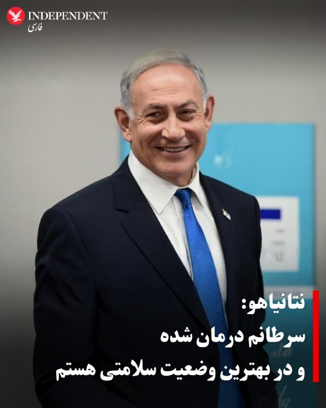
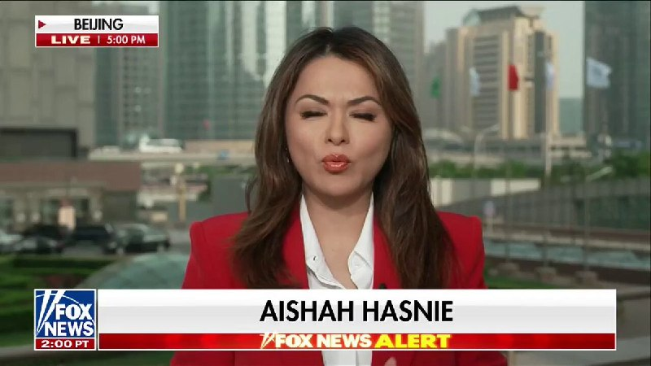
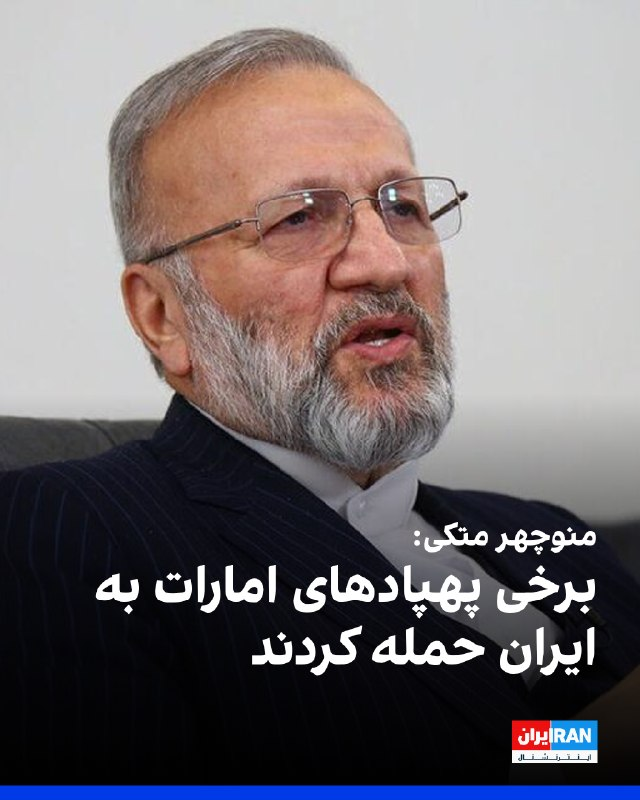
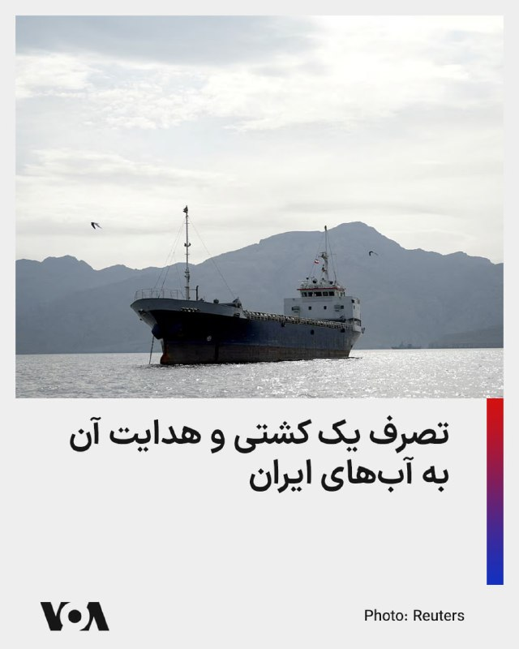
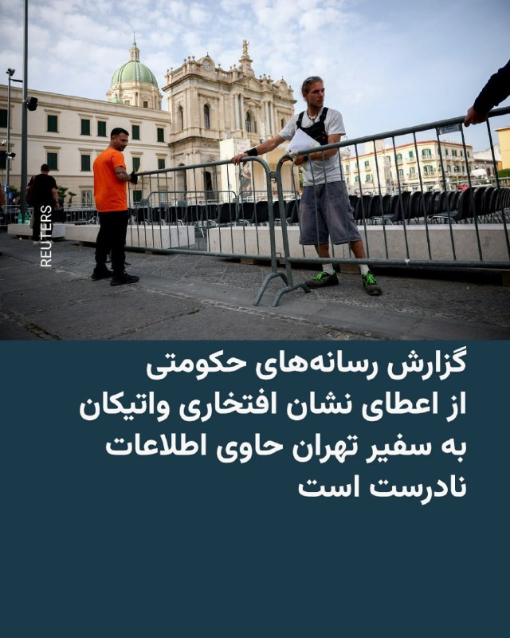

# خواننده تلگرام

<!-- TOP_NAV START -->

<a href="https://github.com/gitpod-test3753/aio-downloader/blob/main/telegram/content/archive_1.md" style="display:inline-block; padding:6px 12px; margin:0 4px; background-color:#2ea44f; color:white; text-decoration:none; border-radius:4px; font-weight:bold;">صفحه بعد</a>

<!-- TOP_NAV END -->

<!-- MSG START -->

---
📅 بروزرسانی: 1405/02/24 13:33
---

## VahidOOnLine — post 240079

  

♦️عباس عراقچی، وزیر امور خارجه جمهوری اسلامی روز پنجشنبه ۲۴ اردیبهشت و در زمان حضور در اجلاس وزرای امور خارجه بریکس، امارات را به مشارکت فعال در جنگ آمریکا و اسرائیل علیه ایران متهم کرد.

براساس پیامی که در کانال تلگرام عباس عراقچی منتشر شده، وزیر امور خارجه جمهوری اسلامی در واکنش به آنچه «ادعاهای امارات در اجلاس بریکس» نوشت: حتی ائتلاف با اسرائیل هم از شما محافظت نکرد.

در پیام عراقچی آمده است: «من در سخنرانی‌ خود نام امارات متحده عربی را ذکر نکردم، به خاطر حفظ وحدت و ترجیح دادم به آن اشاره نکنم. اما در واقع باید بگویم که امارات مستقیما در اقدام تجاوزکارانه علیه کشور من دخیل بود. زمانی که این تجاوز آغاز شد، آنها حتی از محکوم کردن آن خودداری کردند.
آنها اجازه دادند از سرزمین‌شان برای شلیک توپخانه و تجهیزات علیه ما استفاده شود.»

عراقچی با اشاره به اعلام خبر دولت اسرائیل درباره سفر «مخفیانه» بنیامین نتانیاهو به امارات در دوران جنگ نوشت: «همین دیروز فاش شد که نتانیاهو در زمان جنگ به امارات و ابوظبی سفر کرده بود. همچنین آشکار شد که آنها در این حملات مشارکت داشته‌اند و شاید حتی مستقیما علیه ما اقدام کرده باشند. بنابراین امارات شریک فعال این تجاوز است و هیچ تردیدی در این باره وجود ندارد.»
‌🇸🇦 Indypersian

🤖 @VahidOOnLine

## VahidOOnLine — post 240078

  

♦️فیفا اعلام کرد مدونا، شکیرا و گروه کره‌ای بی‌تی‌اس در نخستین اجرای بین دو نیمه فینال جام جهانی فوتبال، روز ۲۸ تیر در ورزشگاه مت‌لایف نیوجرسی روی صحنه خواهند رفت.
به گزارش خبرگزاری فرانسه، کریس مارتین، خواننده گروه کلدپلی، مدیریت هنری این برنامه را برعهده دارد. برنامه‌ای که برای نخستین بار در تاریخ فینال جام جهانی برگزار می‌شود و همزمان نگرانی‌هایی را درباره طولانی شدن زمان استراحت بین دو نیمه ایجاد کرده است.
جام جهانی ۲۰۲۶ با حضور ۴۸ تیم از ۲۱ خرداد تا ۲۸ تیر ۱۴۰۵ به میزبانی مشترک آمریکا، کانادا و مکزیک برگزار می‌شود و بزرگ‌ترین دوره تاریخ این رقابت‌ها خواهد بود.
جیانی اینفانتینو، رئیس فیفا، پیش‌تر اعلام کرده بود فینال جام جهانی ۲۰۲۶ برای نخستین بار شاهد اجرای موسیقی بین دو نیمه خواهد بود، اما در آن زمان جزئیاتی درباره اجراکنندگان یا مدت زمان برنامه ارائه نکرده بود.
رئیس فیفا روز پنجشنبه، در اینستاگرام نوشت: «این یک لحظه تاریخی برای جام جهانی فوتبال و نمایشی درخور بزرگ‌ترین رویداد ورزشی جهان خواهد بود.»
در فینال جام جهانی باشگاه‌های فیفا که سال گذشته در همین ورزشگاه برگزار شده بود، کنسرت بین دو نیمه باعث شد زمان استراحت از ۱۵ دقیقه استاندارد فراتر برود.
اینفانتینو همچنین اعلام کرد فیفا قصد دارد در آخر هفته پایانی جام جهانی، میدان تایمز نیویورک را نیز به مرکز برنامه‌های ویژه این رقابت‌ها تبدیل کند.
فیفا اعلام کرد کنسرت بین دو نیمه در حمایت از «صندوق آموزش شهروند جهانی فیفا» برگزار می‌شود، طرحی که هدف آن جمع‌آوری ۱۰۰ میلیون دلار برای حمایت از کودکان در سراسر جهان است.

شکیرا غیر از این برنامه، با همکاری خواننده نیجریه‌ای، برنا بوی، ترانه «دای دای» را برای جام‌جهانی فوتبال ۲۰۲۶ آماده کرده است.
‌🇸🇦 Indypersian

🤖 @VahidOOnLine

## VahidOOnLine — post 240077

  <a href="telegram/content/VahidOOnLine_240077_1778753024.mp4" target="_blank">🎬 Download video</a>

بر اساس گزارش‌های منتشرشده در شبکه‌های اجتماعی، خاطره خدادادی، دانشجوی رشته دندانپزشکی در بلاروس، پس از اظهار نظر درباره مسائل ایران در یک کانال تلگرامی، با دخالت سفارت جمهوری اسلامی بازداشت و به ۱۴ روز زندان محکوم شده است.
به گفته نزدیکان او، قرار بود دهم اردیبهشت آزاد شود، اما همچنان در بازداشت به‌سر می‌برد و وضعیت تحصیل و اقامتش نامشخص است. همچنین گزارش شده که او در مدت بازداشت از دسترسی به وکیل و تماس با دوستانش محروم بوده است.
‌🏁 🇬🇧 ManotoTV

🤖 @VahidOOnLine

## VahidOOnLine — post 240076

  

♦️ارتش اسرائیل روز پنجشنبه ۲۴ اردیبهشت اعلام کرد پس از سقوط یک پهپاد انفجاری حزب‌الله در نزدیکی مرز اسرائیل و لبنان، سه غیرنظامی اسرائیلی زخمی و به بیمارستان منتقل شدند.

این خبر در حالی اعلام می‌شود که آتش‌بس میان اسرائیل و حزب‌الله که سه هفته گذشته اعلام شد، عملا اجرا نمی‌شود.
‌🇸🇦 Indypersian

🤖 @VahidOOnLine

## VahidOOnLine — post 240075

  

♦️کاخ سفید، روز پنجشنبه ۲۴ اردیبهشت ماه، با انتشار بیانیه‌ای درباره دیدار دونالد ترامپ و شی جین‌پینگ اعلام کرد دو طرف درباره جنگ ایران، امنیت تنگه هرمز و گسترش همکاری‌های اقتصادی میان آمریکا و چین گفتگو کردند.
بر اساس بیانیه کاخ سفید، دو طرف درباره راه‌های تقویت همکاری اقتصادی میان دو کشور، از جمله گسترش دسترسی شرکت‌های آمریکایی به بازار چین و افزایش سرمایه‌گذاری چین در صنایع آمریکا گفتگو کردند. تعدادی از مدیران بزرگ‌ترین شرکت‌های آمریکایی نیز در بخشی از این نشست حضور داشتند.
کاخ سفید همچنین اعلام کرد واشنگتن و پکن توافق دارند که تنگه هرمز باید برای تضمین جریان آزاد انرژی باز بماند.
در این بیانیه آمده است شی جین‌پینگ مخالفت چین با «نظامی‌سازی تنگه هرمز» و هرگونه تلاش برای دریافت عوارض از کشتی‌ها را اعلام کرده و همچنین نسبت به خرید بیشتر نفت آمریکا برای کاهش وابستگی چین به تنگه هرمز در آینده ابراز علاقه کرده است.
در بیانیه کاخ سفید آمده است آمریکا و چین توافق دارند که «ایران هرگز نباید به سلاح هسته‌ای دست پیدا کند.»
برخلاف روایت منتشرشده از سوی پکن، در بیانیه کاخ سفید اشاره‌ای به موضوع تایوان نشده است.
‌🇸🇦 Indypersian

🤖 @VahidOOnLine

## VahidOOnLine — post 240074

  

⭕️نتانیاهو: سرطانم درمان شده و در بهترین وضعیت سلامتی هستم

♦️بنیامین نتانیاهو، نخست‌وزیر اسرائیل، در جلسه دادگاه رسیدگی به پرونده‌های مرتبط با افترا در تل‌آویو گفت وضعیت جسمی‌اش «خوب، حتی عالی» است و تاکید کرد که در «بالاترین سطح سلامت» قرار دارد.

او این اظهارات را در جریان رسیدگی به شکایت افترا علیه دو روزنامه‌نگار و یک فعال سیاسی مطرح کرد؛ افرادی که مدعی شده بودند نتانیاهو در سال ۲۰۲۴ به بیماری‌های جدی مبتلا بوده است.

نتانیاهو گفت هرگز به سرطان لوزالمعده مبتلا نبوده و اگر چنین ادعایی درست بود، «تا حالا مرده بود». او توضیح داد که در دسامبر ۲۰۲۴ به‌دلیل بزرگی پروستات تحت عمل جراحی قرار گرفت و در اواخر سال ۲۰۲۵ ابتلا به سرطان پروستات در او تشخیص داده شد.
به گفته نتانیاهو، او در ژانویه و فوریه ۲۰۲۶ پنج جلسه پرتودرمانی انجام داد و این درمان‌ها سرطان را به‌طور کامل از بین برده‌اند. این نخستین بار است که او جدول زمانی دقیق ابتلا و درمان سرطان خود را علنی می‌کند.

با این حال، رسانه‌های عبری‌زبان نوشته‌اند این روایت تا حدی با اظهارات پزشک معالج او، پروفسور آرون پوپوتزر، تفاوت دارد؛ پزشکی که در پایان آوریل گفته بود پرتودرمانی نتانیاهو حدود دو ماه و نیم پیش آغاز شده بود، یعنی حدود هفته دوم فوریه.
نتانیاهو همچنین گفت دستگاه ضربان‌ساز قلبی که در سال ۲۰۲۳ برای او کار گذاشته شد، تاکنون هرگز فعال نشده است. او تاکید کرد وضعیت جسمی‌اش رو به بهبود بوده و بنا بر همه شاخص‌ها، نه در حد متوسط یا خوب، بلکه در «۱۰ درصد بالای مقیاس سلامت» قرار دارد.
‌🇸🇦 Indypersian

🤖 @VahidOOnLine

## VahidOOnLine — post 240073

  <a href="telegram/content/VahidOOnLine_240073_1778753028.mp4" target="_blank">🎬 Download video</a>

رسانه‌های داخلی ایران گزارش دادند زمین‌لرزه‌ای به بزرگی ۵ ریشتر منطقه بردسیر در استان کرمان را لرزاند.
بر اساس این گزارش‌ها، کانون زلزله در عمق ۸ کیلومتری زمین و در نزدیکی روستای کمال‌آباد از توابع شهرستان بردسیر بوده است. هلال‌احمر اعلام کرد دو تیم ارزیاب برای بررسی وضعیت به منطقه اعزام شده‌اند.
‌🏁 🇬🇧 ManotoTV

🤖 @VahidOOnLine

## VahidOOnLine — post 240072

  

♦️ساعت ۱۱:۱۷ دقیقه روز پنجشنبه ۲۴ اردیبهشت ماه، زمین لرزه‌ای به بزرگی پنج و در عمق هشت کیلومتری زمین، شهرستان بردسیر در کرمان را لرزاند.
به گفته رسانه‌های رسمی ایران، هنوز از خسارات احتمالی این زلزله گزارشی منتشر نشده است.
‌🇸🇦 Indypersian

🤖 @VahidOOnLine

## VahidOOnLine — post 240071

  <a href="telegram/content/VahidOOnLine_240071_1778753030.mp4" target="_blank">🎬 Download video</a>

گروه ناظر اینترنتی نت‌بلاکس اعلام کرد قطعی اینترنت در ایران امروز وارد هفتادوششمین روز خود شده و از مرز ۱۸۰۰ ساعت گذشته است.
نت‌بلاکس می‌گوید این محدودیت‌ها بر پایه دسترسی گزینشی و طبقاتی اعمال شده؛ به‌طوری که گروه‌های خاص به اینترنت دسترسی دارند، اما بخش بزرگی از شهروندان همچنان با محدودیت و اختلال گسترده مواجه‌اند
‌🏁 🇬🇧 ManotoTV

🤖 @VahidOOnLine

## VahidOOnLine — post 240070

  

منوچهر متکی، نماینده مجلس و وزیر خارجه پیشین جمهوری اسلامی، گفت برخی از پهپادهایی که به ایران حمله کردند متعلق به امارات متحده عربی بوده است. او تاکید کرد که «حجت بر تمام کشورهای منطقه تمام شده است.»

متکی گفت: «برخی از پهپادهایی که به ایران زده می‌شد پهپادهای امارات متحده عربی بود و قابل کتمان نیست. این اطلاعات نزد ما است.»

متکی با اشاره به روابط جمهوری اسلامی با کشورهای منطقه گفت: «یک مسئله‌ای داریم که در ۴۷ سال گذشته تحت تاثیر دیگران، کشورهای منطقه روابط صادقانه و خوبی با ما نداشتند. اما ما حسن همسایگی را رعایت کردیم.»
‌🏁 🇬🇧 IranintlTV

🤖 @VahidOOnLine

## VahidOOnLine — post 240069

  

زمین‌لرزه‌ای به بزرگی ۵ منطقه بردسیر در استان کرمان را لرزاند. این زمین‌لرزه در عمق ۸ کیلومتری زمین رخ داد. جزییات بیشتری درباره خسارات احتمالی یا تلفات این زمین‌لرزه منتشر نشده است.
‌🏁 🇬🇧 IranintlTV

🤖 @VahidOOnLine

## VahidOOnLine — post 240068

  <a href="telegram/content/VahidOOnLine_240068_1778753032.mp4" target="_blank">🎬 Download video</a>

سازمان دریانوردی تجاری بریتانیا اعلام کرد یک کشتی در سواحل امارات و در نزدیکی تنگه هرمز دچار حادثه شده است.
بر اساس این گزارش، افرادی «غیرمجاز» کنترل این کشتی را در دست گرفته‌اند و شناور اکنون به‌سمت آب‌های سرزمینی ایران در حرکت است. این نهاد دریایی بریتانیا اعلام کرد کشتی در فاصله ۳۸ مایلی سواحل فجیره قرار داشته است.
‌🏁 🇬🇧 ManotoTV

🤖 @VahidOOnLine

## VahidOOnLine — post 240067

  <a href="telegram/content/VahidOOnLine_240067_1778753033.mp4" target="_blank">🎬 Download video</a>

⭕️عراقچی: تنگه هرمز برای همه کشتی‌های تجاری باز است اما باید با نیروی دریایی ما همکاری کنند

♦️عباس عراقچی، وزیر امور خارجه جمهوری اسلامی روز پنجشنبه ۲۴ اردیبهشت در حاشیه نشست وزرای خارجه کشورهای عضو بریکس گفت: «جمهوری اسلامی ایران هیچ مانعی در تنگه هرمز ایجاد نکرده و این گذرگاه دریایی همچنان برای کشتی‌های تجاری باز است.»

عراقچی حمله و محاصره دریایی آمریکا را عامل بروز مشکل در تنگه هرمز توصیف کرد و گفت: «تنگه هرمز برای همه کشتی‌های تجاری باز است و کشتی‌های تجاری باید برای عبور از تنگه با نیروهای دریایی جمهوری اسلامی ایران همکاری کنند.»

تنگه هرمز یکی از مهم‌ترین مسیرهای انتقال انرژی جهان به شمار می‌رود و تنش‌های اخیر میان آمریکا و اسرائیل با جمهوری اسلامی ایران، نگرانی‌ها درباره امنیت کشتیرانی و صادرات انرژی را افزایش داده است.
‌🇸🇦 Indypersian

🤖 @VahidOOnLine

## VahidOOnLine — post 240066

  

♦️سانائه تاکایچی، نخست‌ وزیر ژاپن پنجشنبه ۲۴ اردیبهشت با انتشار بیانیه‌ای اعلام کرد یک کشتی ژاپنی که در خلیج فارس متوقف شده بود، با موفقیت از تنگه هرمز عبور کرده و اکنون در مسیر بازگشت به ژاپن است.

به گفته تاکایچی، چهار خدمه ژاپنی در این کشتی حضور دارند.
تاکایچی با اشاره به عبور یک کشتی دیگر مرتبط با ژاپن در نهم اردیبهشت ماه، عبور اخیر را «تحولی مثبت» به‌ویژه از منظر حفاظت از شهروندان ژاپنی توصیف کرد.

نخست‌وزیر ژاپن یادآور شد، برای عبور این کشتی با مسعود پزشکیان «رایزنی مستقیم» داشته و وزیر خارجه و سفارت این کشور در تهران نیز هماهنگی‌های دیپلماتیک انجام داده‌اند.

به گفته او، با خروج این کشتی، تعداد کشتی‌های مرتبط با ژاپن که همچنان در خلیج فارس باقی مانده‌اند به ۳۹ عدد رسیده است و در یکی از آن‌ها سه خدمه ژاپنی حضور دارند.

تاکایچی در این پیام با یادآوری «فشار شدید» بر خدمه کشتی‌ها و نگرانی خانواده‌های آنان، از کارکنان دریایی و شرکت‌های کشتیرانی قدردانی کرد.

او تاکید کرد دولت ژاپن به تلاش‌های دیپلماتیک برای عبور هرچه سریع‌تر همه کشتی‌ها، از جمله کشتی‌های مرتبط با ژاپن، از تنگه هرمز ادامه خواهد داد.
‌🇸🇦 Indypersian

🤖 @VahidOOnLine

## VahidOOnLine — post 240065

  

عباس عراقچی، وزیر خارجه جمهوری اسلامی، گفت زمان آن رسیده است که «رفتار سلطه‌گرانه آمریکا به زباله‌دان تاریخ سپرده شود». او تاکید کرد هیچ‌گونه راه‌حل نظامی برای موضوعات مربوط به ایران وجود ندارد.

عراقچی گفت: «زمان آن رسیده که رفتار سلطه‌گرانه آمریکا را به زباله‌دان تاریخ بسپاریم.» او افزود: «هیچ‌گونه راه‌حل نظامی برای هر موضوعی که به ایران مربوط باشد، وجود ندارد. ما هرگز در برابر هیچ فشار یا تهدیدی سر خم نمی‌کنیم.»

وزیر خارجه جمهوری اسلامی همچنین اظهار داشت: «هرچند نیروهای مسلح ما آماده‌اند پاسخی کوبنده و ویرانگر به متجاوزان خارجی بدهند، اما مردم ما صلح‌طلب بوده و خواهان جنگ نیستند.»

او در ادامه از کشورهای عضو بریکس و دیگر اعضای جامعه بین‌المللی خواست آنچه را نقض حقوق بین‌الملل از سوی ایالات متحده و اسرائیل خواند، به‌صراحت محکوم کنند.
‌🏁 🇬🇧 IranintlTV

🤖 @VahidOOnLine

## WithYashar — post 11195

اتاق جنگ با یاشار : جابجای‌های غول آسا دو شماره یک «AirForce1» هواپیمای ویژه ریاست جمهوری و «B1 »بمب افکن اسطورهی آمریکا و خبر ویژه از داخل ایران https://www.instagram.com/reel/DYQCr39RJ4i/?igsh=MThycjJiYWZmbnJ3dA== کارای اداریش رو انجام بدید تا بعدش بریم…

## WithYashar — post 11194

آکسیوس به نقل از مقامات اسرائیلی:

در پی احتمال تصمیم ترامپ برای از سرگیری جنگ، در اسرائیل حالت آماده‌باش حداکثری در طول تعطیلات آخر هفته برقرار خواهد شد.
@withyashar

## WithYashar — post 11193

یک مقام کاخ سفید به فاکس‌نیوز:

رئیس‌جمهور چین علاقه‌مند است نفت بیشتری از آمریکا خریداری کند تا وابستگی کشورش به تنگه هرمز را کاهش دهد.
@withyashar

## WithYashar — post 11192

جان بولتون: مذاکره با ایران برای یک توافق هسته‌ای هدر دادن اکسیژن است.

این افراد دهه‌ها پیش تصمیم استراتژیکی برای دستیابی به سلاح‌های هسته‌ای گرفتند و در این ۴۷ سال هیچ مدرکی وجود ندارد که نشان دهد آن‌ها این هدف را رها کرده‌اند.
@withyashar

## WithYashar — post 11191

  <a href="telegram/content/WithYashar_11191_1778753038.mp4" target="_blank">🎬 Download video</a>

ترامپ بعد از ۵۰ سال، اولین رئیس‌ جمهوری شد که به معبد آسمان چین رفت
@withyashar

## WithYashar — post 11190

کاخ سفید : ترامپ و شی توافق کردن که تنگه هرمز باید باز بمونه
@withyashar

## WithYashar — post 11189

  <a href="telegram/content/WithYashar_11189_1778753041.mp4" target="_blank">🎬 Download video</a>

فاکس نیوز با حیرت : داداش بزرگه نگات میکنه ، لبخند بزنید شما با دوربین ها رصد میشوید
خبرنگار فاکس‌نیوز گزارش داد که خودروی آن‌ها در چین تنها دو دقیقه در محدوده «توقف ممنوع» پکن ایستاد و بلافاصله پیامک جریمه ۴۰ دلاری برای راننده صادر شد. به گفته او، در این کشور دوربین‌های نظارتی همه‌جا فعال هستند و تخلفات رانندگی در لحظه ثبت و اعمال می‌شود.
@withyashar

## WithYashar — post 11188

هند: حمله به یک کشتی ما در نزدیکی
سواحل عمان غیرقابل قبول است

یک کشتی هندی توسط افراد ناشناس دزدیده شده و به سمت ایران اسکورت میشود
@withyashar

## WithYashar — post 11187

بر اساس داده ها , شرکت تتر مبلغ 344 میلیون دلار USDT مرتبط با بانک مرکزی ایران رو فریز کرده و دلیلش هم بخاطر دور زدن تحریم‌ها بوده که شرکت آرکهام کیف پول‌های مرتبط رو شناسایی کرده
@withyashar

## WithYashar — post 11186

تسنیم: کیفرخواست زیباکلام و مدیرمسئول خبرگزاری آنا صادر شد ممنوعیت زیباکلام از انجام هرگونه فعالیت رسانه‌ای به مدت سه ماه صادر شده
@withyashar

## WithYashar — post 11185

  

دقایقی پیش زمین‌لرزه‌ای بسیار شدید ۵ ریشتری در عمق ۸ کیلومتری بردسیر کرمان را لرزاند
@withyashar

## WithYashar — post 11184

نتانیاهو در دادگاه حظور پیدا کرد و گفت: «فیک نیوزها گفتند من به بیماری لاعلاجی مبتلا هستم - این یک صنعت دروغگویی تمام‌عیار است»
@withyashar

## WithYashar — post 11183

تاج : در جریان آهنگی که معین برای تیم ملی در جام جهنی ۲۰۲۶ می خواند هستیم @withyashar

## WithYashar — post 11182

اتاق جنگ با شما : زمین لرزه خیلی شدید کرمان یک دقیقه پیش
@withyashar

## WithYashar — post 11181

  <a href="telegram/content/WithYashar_11181_1778753045.mp4" target="_blank">🎬 Download video</a>

تصویربرداری عجیب یا اسکن ۳۶۰ ایلان ماسک از موقعیت با گوشی خودش
@withyashar

## WithYashar — post 11180

  <a href="telegram/content/WithYashar_11180_1778753048.mp4" target="_blank">🎬 Download video</a>

صحنه ای زیبا در چین که کودکان به ترامپ و شی خوشامد میگویند
@withyashar

## mwarmonitor — post 9066

🔴نقل‌قول جنجالی ترامپ؛ بن‌بست او در برابر ایران و تورم

📝نویسندگان: دیو لاولر، باراک راوید AXIOS

🔰جمله اخیر رئیس‌جمهور ترامپ مبنی بر اینکه در زمان تصمیم‌گیری درباره اقدامات بعدی در قبال ایران، «به وضعیت مالی آمریکایی‌ها فکر نمی‌کنم»، ناخواسته نشان‌دهنده بن‌بست اساسی اوست: چگونه می‌توان بدون آشفته کردن بازارها و جهش قیمت نفت، بر ایران فشار آورد؟

چرا این موضوع مهم است؟
ترامپ در حال حاضر راه حل مشخصی ندارد که بتواند تمایل خود برای پایان دادن به جنگ (طبق شروط خودش) را با نیاز به مهار تورم و پررونق نگه داشتن بازار سهام در یک سال انتخاباتی، همسو کند.
تحلیل پشت پرده
منظور واقعی ترامپ: به نظر می‌رسد منظور او در اظهارات روز سه‌شنبه این بوده که نگرانی‌های اقتصادی داخلی، او را از برداشتن گام‌های لازم برای جلوگیری از دستیابی ایران به سلاح هسته‌ای باز نخواهد داشت.
فرصت‌طلبی دموکرات‌ها: قطعا این ظرافت کلامی در تبلیغات انتخاباتی دموکرات‌ها گم خواهد شد و آن‌ها از این جمله برای حمله به او استفاده خواهند کرد.
دیدگاه مشاوران: یکی از مشاوران ترامپ به آکسیوس گفت: «رئیس‌جمهور می‌توانست کلمات بهتری انتخاب کند، اما واقعیت فکر او همین است.» مشاور دوم نیز تایید کرد که مشکل اینجاست که «ایران زمان بیشتری در اختیار دارد و آن‌ها روی تقویم سیاسی ما حساب باز کرده‌اند.»
نقطه اصطکاک
مقامات ایرانی به وضوح نشان داده‌اند که معتقدند زمان به نفع آن‌هاست و ترامپ نسبت به افزایش قیمت نفت و نوسانات بازار بسیار حساس است.
داده‌های اقتصادی: آمارهای اخیر که نشان‌دهنده جهش تورم ناشی از قیمت بنزین است، به جایگاه ترامپ آسیب می‌زند؛ به‌ویژه که نظرسنجی‌ها نشان می‌دهد رای‌دهندگان، رئیس‌جمهور و جمهوری‌خواهان را مقصر می‌دانند.
چالش انتخاباتی: نظرسنجی‌های حزب جمهوری‌خواه تایید می‌کنند که افزایش قیمت بنزین، تبلیغ دستاوردهایی مانند «کاهش مالیات» را دشوارتر می‌کند. با این حال، مشاوران ترامپ اصرار دارند که او در مورد «ایرانِ بدون سلاح هسته‌ای» جدی است و ملاحظات سیاسی را کنار گذاشته است.
تصویر کلی
ترامپ از زمان برقراری آتش‌بس در ۶ هفته پیش، نشان داده که به دنبال توافق است و تمایلی به ازسرگیری جنگ ندارد.
شکست مذاکرات: مذاکره‌کنندگان او فکر می‌کردند هفته گذشته به یک توافق مقدماتی با تهران نزدیک شده‌اند، اما پیشنهاد متقابل ایران، خواسته‌های هسته‌ای کلیدی ترامپ را نادیده گرفت.
تهدید به تشدید تنش: ترامپ موضع ایران را غیرقابل قبول خواند و تهدید کرد که ایران بهای سنگینی برای این انعطاف‌ناپذیری خواهد پرداخت. تیم او اکنون در حال بررسی گزینه‌های نظامی برای شکستن بن‌بست هستند، هرچند از خطرات تشدید آشفتگی اقتصادی آگاهند.
آنچه در پشت صحنه می‌گذرد
مقامات آمریکایی انتظار ندارند ترامپ در طول سفرش به چین اقدام دراماتیکی انجام دهد، اما معتقدند بلافاصله پس از آن، حرکت بعدی خود را انجام خواهد داد. گزینه‌های روی میز عبارتند از:
عملیات «آزادی» (Project Freedom): تلاش نیروی دریایی برای شکستن بن‌بست در تنگه هرمز.
حملات هوایی: راه‌اندازی کمپین بمباران جدید با تمرکز بر زیرساخت‌های ایران.
وضعیت اسرائیل: مقامات اسرائیلی می‌گویند در آخر هفته در حالت آماده‌باش کامل خواهند بود تا در صورت تصمیم ترامپ برای ازسرگیری جنگ، هماهنگی‌های لازم را انجام دهند.
خلاصه وضعیت
برخی مقامات معتقدند محاصره آمریکا در حال فشار آوردن به ایران است و ممکن است بدون درگیری نظامی هم باعث تسلیم شدن این کشور شود. با این حال، با توجه به موضع اخیر ایران، امیدها به توافق کمرنگ شده و انتظارات برای بازگشت درگیری‌ها افزایش یافته است.

📌نکته نهایی: ترامپ می‌گوید در صورت اتخاذ چنین تصمیمی، «حتی ذره‌ای» به مسائل مالی آمریکایی‌ها فکر نخواهد کرد. او با این کار، یک محتوای آماده برای تبلیغات تهاجمی دموکرات‌ها به آن‌ها هدیه داده است.

@mwarmonitor

## mwarmonitor — post 9065

🇬🇧وزیر دفاع بریتانیا ؛ حملات پهپادی شوکه‌کننده روسیه به اوکراین طی ۲۴ ساعت گذشته.

🔸من دستور داده‌ام که تحویل سامانه‌های پدافند هوایی و مقابله با پهپاد از سوی بریتانیا با حداکثر سرعت ممکن تسریع شود.

🔸ما در برابر تجاوز ولادیمیر پوتین در کنار اوکراین ایستاده‌ایم.
افکار و همدردی ما با خانواده‌های اوکراینی است.

@mwarmonitor

## mwarmonitor — post 9064

🟥شرکتUKMTO گزارشی از یک حادثه در ۳۸ مایل دریایی (38NM) شمال شرقی فجیره، امارات متحده عربی دریافت کرده است.
🔸افسر امنیتی شرکت (CSO) گزارش داده است که کشتی در زمان لنگر انداختن توسط افراد غیرمجاز تصرف شده و اکنون به سمت آب‌های سرزمینی ایران در حرکت است.

@mwarmonitor

## mwarmonitor — post 9063

🔴 پس از دیدار دونالد ترامپ و شی جین‌پینگ، یک مقام کاخ سفید اعلام کرد که چین و ایالات متحده آمریکا توافق دارند که ایران هرگز نباید به سلاح هسته‌ای دست یابد و تنگه هرمز باید باز بماند. i24 news

@mwarmonitor

## FoxNewsTwitter — post 341702

  

Fox News (Twitter/X)

BREAKING: Brand new details released about President Trump’s bilateral meeting with Chinese President Xi.

The White House says China is interested in buying more American oil while also agreeing with the U.S. that Iran can never have a nuclear weapon.

Meanwhile, the Chinese government says Trump was told that Taiwan is the most important issue on the table for the communist country — and warns the future of U.S.-China ties depends on how it’s handled.

When it comes to Iran, President Trump says he doesn’t need Xi’s help with ending the conflict.

U.S. CEOs are also making pitches for expanded business ties during the ongoing meeting.
@aishahhasnie with the latest.

## pm_afshaa — post 90722

  <a href="telegram/content/pm_afshaa_90722_1778753052.webm" target="_blank">🎬 Download video</a>

🔴یک مقام کاخ سفید به فاکس‌نیوز:
رئیس‌جمهور چین علاقه‌منده نفت بیشتری از آمریکا خریداری کنه تا وابستگی کشورش به تنگه هرمز رو کاهش بده.

💧 Rainbet.com the #1 Non-KYC Crypto Casino & Sportsbook @rainbetcom

😁 @Pm_Afshaa

## pm_afshaa — post 90721

  <a href="telegram/content/pm_afshaa_90721_1778753053.mp4" target="_blank">🎬 Download video</a>

ترامپ و شی موقع دست دادن سعی داشتن دستِ طرف مقابل رو سمت خودشون بکشن که همچین صحنه‌ای خلق شد :

💧 Rainbet.com the #1 Non-KYC Crypto Casino & Sportsbook @rainbetcom

😁 @Pm_Afshaa

## pm_afshaa — post 90720

  <a href="telegram/content/pm_afshaa_90720_1778753055.webm" target="_blank">🎬 Download video</a>

🔴ترامپ در دیدار با شی‌جین‌ پینگ: روابط آمریکا و چین بهتر از زمان دیگری خواهد شد.

شی هم ابراز امیدواری کرد سال 2026 نقطه‌عطفی در روابط چین و آمریکا باشه.

💧 Rainbet.com the #1 Non-KYC Crypto Casino & Sportsbook @rainbetcom

😁 @Pm_Afshaa

## pm_afshaa — post 90719

  <a href="telegram/content/pm_afshaa_90719_1778753056.webm" target="_blank">🎬 Download video</a>

🔴شی جین‌پینگ در دیدار با دونالد ترامپ:
همواره باور داشتم منافع مشترک چین و آمریکا بیشتر از اختلافاتشونه.

💧 Rainbet.com the #1 Non-KYC Crypto Casino & Sportsbook @rainbetcom

😁 @Pm_Afshaa

## pm_afshaa — post 90718

  <a href="telegram/content/pm_afshaa_90718_1778753057.webm" target="_blank">🎬 Download video</a>

🔴مدیر سرویس اطلاعات خارجی روسیه:
هیچ نشانه‌ای از پایان درگیری نظامی بر سر ایران وجود نداره و نمیشه موج جدیدی از تشدید تنش رو رد کرد.

💧 Rainbet.com the #1 Non-KYC Crypto Casino & Sportsbook @rainbetcom

😁 @Pm_Afshaa

## pm_afshaa — post 90717

  <a href="telegram/content/pm_afshaa_90717_1778753057.webm" target="_blank">🎬 Download video</a>

🔴مقامات اسرائیلی به آکسیوس:
ما در طول تعطیلات آخر هفته، وضعیت آماده‌باش رو به بالاترین سطح میبریم؛ چون احتمال میدیم ترامپ تصمیم بگیره جنگ رو از سر بگیره.

💧 Rainbet.com the #1 Non-KYC Crypto Casino & Sportsbook @rainbetcom

😁 @Pm_Afshaa

## pm_afshaa — post 90716

  <a href="telegram/content/pm_afshaa_90716_1778753058.webm" target="_blank">🎬 Download video</a>

🔴آکسیوس به نقل از مقامات آمریکایی:
محاصره‌ آمریکا بدجوری داره به ایران فشار میاره و ممکنه مجبورشون کنه که بدون نیاز به درگیری نظامی، تسلیم بشن.

💧 Rainbet.com the #1 Non-KYC Crypto Casino & Sportsbook @rainbetcom

😁 @Pm_Afshaa

## pm_afshaa — post 90715

🔴کاخ سفید: روسای جمهور آمریکا و چین درباره تقویت همکاری اقتصادی گفت‌وگو کردن

💧 Rainbet.com the #1 Non-KYC Crypto Casino & Sportsbook @rainbetcom

😁 @Pm_Afshaa

## pm_afshaa — post 90714

🔴سازمان تجارت دریایی بریتانیا اعلام کرد: قایق های تندرو سپاه یک کشتی را که خارج از تنگه هرمز لنگر انداخته بود را تهدید به هدف قرار دادن و سپس توقیف کردند و اکنون در حال بردن آن به سوی بنادر ایران هستن

💧 Rainbet.com the #1 Non-KYC Crypto Casino & Sportsbook @rainbetcom

😁 @Pm_Afshaa

## pm_afshaa — post 90713

🔴کاخ سفید : ترامپ و شی توافق کردن که تنگه هرمز باید باز بمونه

💧 Rainbet.com the #1 Non-KYC Crypto Casino & Sportsbook @rainbetcom

😁 @Pm_Afshaa

## iaghapour — post 2608

🔻سوپراپلیکیشن ایتا اعلام کرد امکان ارسال فایل تا حجم ۲۰ مگابایت مجدداً برای همه کاربران فراهم شده است!

کاش تلگرام بیاد از شما یاد بگیره :)

🆔 @iaghapour

## DEJradio — post 4628

  <a href="telegram/content/DEJradio_4628_1778753059.mp4" target="_blank">🎬 Download video</a>

🤡
🔺 لمپن‌های مدافع جمهوری؛ موتورساز هتاک در جنوب شهر تهران

#تهران #جمهوری
@DEJradio

## DEJradio — post 4627

  <a href="telegram/content/DEJradio_4627_1778753062.webm" target="_blank">🎬 Download video</a>

🚨
⭕️ مایک والتز، سفیر ایالات متحده در سازمان ملل، ضمن اشاره به حمایت ۱۱۳ کشور از پیش‌نویس قطعنامه شورای امنیت در محکومیت اقدامات جمهوری اسلامی، تصریح کرد تهران به دلیل اقدامات غیرقانونی خود، از جمله مین‌گذاری و اعمال عوارض بر کشتیرانی در تنگه هرمز، «منزوی» شده است.

آقای والتز در شبکه اجتماعی ایکس نوشت که کشورهایی از جمله هند، ژاپن و کره جنوبی از این ابتکار حمایت کرده‌اند.

#تنگه_هرمز
@DEJradio

## DEJradio — post 4626

  <a href="telegram/content/DEJradio_4626_1778753063.webm" target="_blank">🎬 Download video</a>

🚨
⭕️ کشتی دزدی سـ.ـپاه پاسداران در تنگه هرمز

نیروهای سـ.ـپاه یک کشتی تجاری را از آب‌های امارات دزدیدند و به آب‌های ایران آوردند.

این کشتی تجاری که نزدیک آب‌های الفجیره امارات لنگر انداخته بود، بامداد ۲۴ اردیبهشت، توسط شبه‌نظامیان نقاب‌پوش دزدیده و به آب‌های سرزمینی جمهوری اسلامی هدایت شد.

سازمان دریانوردی تجاری بریتانیا اعلام کرد یک کشتی در سواحل امارات و در نزدیکی تنگه هرمز دچار حادثه شده است.

بر اساس این گزارش، افرادی «غیرمجاز» کنترل این کشتی را در دست گرفته‌اند و شناور اکنون به‌سمت آب‌های سرزمینی ایران در حرکت است.

برخی منابع نیز گزارش دادند که یکی از کشتی‌ها بعد از اصابت یک پرتابه دچار انفجار شد.

#تنگه_هرمز #IRGCterrorists
@DEJradio

## DEJradio — post 4625

  <a href="telegram/content/DEJradio_4625_1778753063.mp4" target="_blank">🎬 Download video</a>

🚨
🔸 مشاهدات و گزارش‌های میدانی نشان می‌دهد نیروهای مسلح جمهوری اسلامی برای مقابله با عملیات زمینی احتمالی آمریکا و اسرائیل در خاک ایران، به‌ویژه در اطراف تهران و اصفهان، آماده می‌شوند.

#جنگ #حملات_هدفمند #عملیات_زمینی
@DEJradio

## DEJradio — post 4624

  <a href="telegram/content/DEJradio_4624_1778753066.webm" target="_blank">🎬 Download video</a>

🔺📌 دیدگاه؛
چین دیوار حايل تأمین مالی نیروهای مسلح و سازمان سرکوب جمهوری اسلامی

دونالد ترامپ و شی جین‌پینگ روسای جمهوری آمریکا و چین، در پکن دیدار کردند. مراسم استقبال با بالاترین سطح تشریفات همراه بود و ترامپ گفت که فوق‌العاده بود و کمتر چنین استقبالی دیده‌ام. در این سفر شماری از مدیران ارشد شرکت‌های بزرگ آمریکایی، از جمله NVIDIA، Tesla، Apple، Meta، Boeing و JPMorgan Chase، ترامپ را همراهی می‌کنند.

آمریکا امیدوار است چین به عنوان اصلی‌ترین خریدار نفت ایران، فشار به جمهوری اسلامی را افزایش دهد تا تنگه هرمز را باز کند اما فرای این آمریکا می‌خواهد که چین حمایت از جمهوری اسلامی را متوقف کند.
در جریان درگیری‌های خلیج فارس، یک کشتی چینی آسیب دید. طی جنگ ۴۰ روزه و پس از آن نیروهای مسلح جمهوری اسلامی به عربستان سعودی و امارات دو شریک اقتصادی چین در خاورمیانه موشک و پهپاد پرتاب کردند.
بخشی از فشارهای آمریکا به جمهوری اسلامی از کانال شورای امنیت است. اگر قطعنامه‌های آمریکا علیه جمهوری اسلامی توسط چین و روسیه وتو نشود، برنده این میدان آمریکا خواهد بود اما یک تحلیل محرمانه اطلاعاتی ایالات متحده توضیح می‌دهد که چگونه چین از جنگ ایران برای به حداکثر رساندن برتری خود نسبت به آمریکا در حوزه‌های نظامی، اقتصادی، دیپلماتیک و سایر زمینه‌ها بهره‌برداری می‌کند.

چین بزرگترین خریدار نفت ایران است، به طور متوسط روزانه حدود ۱.۳۸ میلیون بشکه نفت خریداری می‌کند که بیش از ۸۰ درصد صادرات دریایی ایران را تشکیل می‌دهد، و همچنین یک شریک تجاری و زیرساختی مهم است.
قطع حمایت چین از رژیم ایران، تأمین مالی نیروهای مسلح جمهوری اسلامی و سازمان سرکوب را مختل می‌کند، زیرا بخش عمده‌ای از پول حاصل از فروش نفت سرازیر پایدار نگه داشتن ساختار نظامی و امنیتی جمهوری اسلامی می‌شود.
ده‌ها شرکت واسطه نفت ایران را به چین منتقل می‌کنند و پول آن را از کانال‌های مختلف صرف تامین مالی سـ.ـپاه و نیابتی‌ها می‌کنند. چین همچنین تامین کننده تجهیزات و قطعات موشک و پهپاد و تجهیزات جاسوسی است.

#چین #ترامپ
@DEJradio

## DEJradio — post 4623

  <a href="telegram/content/DEJradio_4623_1778753067.mp4" target="_blank">🎬 Download video</a>

🛩️
🔥 در واکنش به حملات جمهوری اسلامی به تاسیسات نفتی امارات، نیروی هوایی این کشور تأسیسات نفتی جزیره لاوان را هدف قرار داد. در اثر این حمله مخازن و لوله‌ها آسیب دید و نفت به دریا نشت کرد. اکنون سواحل جزیره مارو (شیدور) در استان هرمزگان آلوده به نفت شده است.

این جزیره کوچک غیرمسکونی زیستگاه انواع پرندگان و خزندگان است. اما نفت سراسر سواحل این جزایر را پوشانده و فاجعه زیست‌محیطی شدیدی را دقیقا در فصل لانه‌گزینی و تخم‌گذاری لاک‌پشت‌های پوزه عقابی و پرندگان مهاجر ایجاد کرده است.

#امارات #جزیره_لاوان
@DEJradio

## mamlekate — post 103525

📝 آغاز دیدار شی و ترامپ در سایه جنگ ایران

رهبران چین و آمریکا گفت‌وگوهای رسمی خود را آغاز کردند. مسائل تجاری، تنش چین و تایوان و همچنین جنگ ایران از موضوعات محوری دیدار شی و ترامپ خواهد بود. واشنگتن به نقش فعالانه‌تر پکن در حل بحران تنگه هرمز امیدوار است.

شماری از شخصیت‌های تجاری برجسته آمریکا از جمله ایلان ماسک،‌ مدیرعامل شرکت تسلا، تیم کوک، مدیرعامل اپل و جنسن هوانگ، مدیر اجرایی انویدیا، دونالد ترامپ را در این سفر همراهی می‌کنند.

📝 ترامپ به شی: روابط آمریکا با چین «بهتر از همیشه» خواهد بود

📝 شی در دیدار با ترامپ: مسئله تایوان «مهم‌ترین» موضوع است و در صورت سوء‌مدیریت می‌تواند «وضعیتی بسیار خطرناک» ایجاد کند

@mamlekate

## kianmeli1 — post 87393

  <a href="telegram/content/kianmeli1_87393_1778753070.mp4" target="_blank">🎬 Download video</a>

🔴جان بولتون: مذاکره بر سر توافق هسته‌ای با ایران اتلاف اکسیژن است.

این افراد دهه‌ها پیش تصمیمی استراتژیک برای دستیابی به سلاح‌های هسته‌ای گرفتند.
در ۴۷ سال گذشته حتی یک مدرک هم وجود ندارد که نشان دهد آنها از این هدف دست کشیده‌اند
https://t.me/kianmeli1

## IranIntlTV — post 337140

  <a href="telegram/content/IranIntlTV_337140_1778753073.mp4" target="_blank">🎬 Download video</a>

اظهارات و گزارش‌های رسمی چین و آمریکا حاکی است دونالد ترامپ و شی جین‌پینگ، رهبران دو کشور، در دیدار کلیدی خود در پکن درباره ایران گفت‌وگو کرده‌اند.

توماج طاهباز، خبرنگار ایران‌اینترنشنال، گزارش می‌دهد
@iranintltv

## IranIntlTV — post 337139

  <a href="telegram/content/IranIntlTV_337139_1778753075.mp4" target="_blank">🎬 Download video</a>

کاخ سفید اعلام کرد در جریان سفر دونالد ترامپ و دیدار او با شی‌ جین‌پینگ در پکن، روسای جمهور آمریکا و چین بر ممنوعیت دستیابی جمهوری اسلامی به سلاح هسته‌ای توافق کردند.
گفت‌وگو با عطا محامد، کارشناس روابط بین‌الملل
@iranintltv

## IranIntlTV — post 337138

در این قسمت چرتکه، محمد ماشینچیان سناریوهای مختلف قدرت خرید را تا پایان سال ۱۴۰۵ بررسی کرده و تاثیر نوسان نرخ دلار بر معیشت خانوارها را توضیح می‌دهد.
هنگام بررسی قدرت خرید حداقل دستمزد از ۱۳۹۴ تا ۱۴۰۵ در می‌یابیم که از ۹۷ به این سو، حتی وقتی قدرت خرید کارگر در ابتدای سال، حدود ۱۳۰ دلار بوده، مثل ۱۴۰۱ و ۱۴۰۴، در نتیجه تورم و بالا رفتن دلار، قدرت خرید تا پایان سال، به زیر ۱۰۰ دلار رسیده است.

تماشای نسخه کامل «چرتکه» در یوتیوب:
https://youtu.be/1W2RoMvSqPQ
@iranintltv

## IranIntlTV — post 337137

  

🔻مهدی تاج، رییس فدراسیون فوتبال، پنج‌شنبه ۲۴ اردیبهشت، در حاشیه اهدای جام قهرمانی فوتسال زنان به استقلال گفت: «فردا یا پس‌فردا در ترکیه جلسه سرنوشت‌سازی با فیفا داریم، چون باید به ما گارانتی بدهند. مساله ویزا حل نشده و هنوز هیچ ویزایی ندادند. منتظریم ببینیم رفتار طرف مقابل چیست.»

🔹فدراسیون فوتبال در فاصله کمتر از یک ماه تا آغاز جام‌جهانی با بحران ویزا و چالش مالی دست‌به‌گریبان است. امیر قلعه‌نویی هنوز نمی‌داند کدام بازیکن ویزا خواهد گرفت و کدام بازیکن را در آمریکا در اختیار خواهد داشت.

🔹احتمال دارد برای برخی اعضای کاروان ایران به دلیل سوابق فعالیت یا ارتباط با سپاه پاسداران، ویزا صادر نشود.
@iranintltvsport

## IranIntlTV — post 337136

  <a href="telegram/content/IranIntlTV_337136_1778753078.mp4" target="_blank">🎬 Download video</a>

شهروندان با ارسال پیام‌های متعدد به ایران‌اینترنشنال از افزایش بیکاری، دشواری پیدا کردن شغل در شهرهای مختلف و مشکلات معیشتی ناشی از آن در ایران خبر دادند.
@iranintltv

## IranIntlTV — post 337135

  <a href="telegram/content/IranIntlTV_337135_1778753081.mp4" target="_blank">🎬 Download video</a>

دفتر نخست‌وزیری اسرائیل چهارشنبه گزارش داد بنیامین نتانیاهو، نخست‌وزیر اسرائیل، در جریان عملیات «غرش شیران» به‌صورت محرمانه به امارات سفر کرده است. به گفته مقام‌های اسرائیلی، این سفر به گشایشی تاریخی در روابط دو طرف منجر شده است. وزارت خارجه امارات گزارش‌ها درباره این سفر را تکذیب کرده است.

ارزیابی محمدجواد اکبرین، عضو تحریریه ایران‌اینترنشنال
@iranintltv

## IranIntlTV — post 337134

  <a href="telegram/content/IranIntlTV_337134_1778753084.mp4" target="_blank">🎬 Download video</a>

سازمان عملیات تجارت دریایی بریتانیا اعلام کرد یک کشتی که در ۷۰ کیلومتری شمال شرقی بندر فجیره لنگر انداخته بود، توقیف شده و اکنون به سمت آب‌های ایران در حرکت است.
جزییات بیشتر با مرتضی کاظمیان، عضو تحریریه ایران‌اینترنشنال
@iranintltv

## IranIntlTV — post 337133

  <a href="telegram/content/IranIntlTV_337133_1778753087.mp4" target="_blank">🎬 Download video</a>

شی جین‌پینگ، رهبر چین، در دیدار با دونالد ترامپ، رییس‌جمهوری ایالات متحده، گفت همواره باور داشته که «چین و آمریکا منافع مشترک بیشتری نسبت به اختلافاتشان دارند». او همچنین بر اهمیت ثبات روابط پکن و واشینگتن برای دو کشور و جهان تاکید کرد.
@iranintltv

## IranIntlTV — post 337132

  <a href="telegram/content/IranIntlTV_337132_1778753089.mp4" target="_blank">🎬 Download video</a>

مراسم بدرقه تیم فوتبال ایران برای حضور در جام جهانی ۲۰۲۶، در حضور حامیان حکومت برگزار و همزمان از پیراهن جدید این تیم رونمایی شد.
گفت‌وگو با مزدک میرزایی، عضو تحریریه ایران‌اینترنشنال
@iranintltv

## IranIntlTV — post 337131

  

منوچهر متکی، نماینده مجلس و وزیر خارجه پیشین جمهوری اسلامی، گفت برخی از پهپادهایی که به ایران حمله کردند متعلق به امارات متحده عربی بوده است. او تاکید کرد که «حجت بر تمام کشورهای منطقه تمام شده است.»

متکی گفت: «برخی از پهپادهایی که به ایران زده می‌شد پهپادهای امارات متحده عربی بود و قابل کتمان نیست. این اطلاعات نزد ما است.»

متکی با اشاره به روابط جمهوری اسلامی با کشورهای منطقه گفت: «یک مسئله‌ای داریم که در ۴۷ سال گذشته تحت تاثیر دیگران، کشورهای منطقه روابط صادقانه و خوبی با ما نداشتند. اما ما حسن همسایگی را رعایت کردیم.»
https://iranintl.com/202605141340

## IranIntlTV — post 337130

  

زمین‌لرزه‌ای به بزرگی ۵ منطقه بردسیر در استان کرمان را لرزاند. این زمین‌لرزه در عمق ۸ کیلومتری زمین رخ داد. جزییات بیشتری درباره خسارات احتمالی یا تلفات این زمین‌لرزه منتشر نشده است.
https://iranintl.com/202605149083

## IranIntlTV — post 337129

  

🔻امیرمهدی علوی، سخنگوی فدراسیون فوتبال، درباره آخرین وضعیت صدور ویزا برای کاروان اعزامی ایران به جام‌جهانی گفت: «کارهای اداری ویزا را در امارات انجام دادیم و حالا منتظر پاسخ هستیم. با این حال، در صورت صادر نشدن ویزا برای برخی بازیکنان، اعضای کادر فنی گزینه‌های مختلفی دارند و بازیکنان جایگزین پیش‌بینی شده‌اند.»

🔹او همچنین به جلسه رییس فدراسیون فوتبال با مقامات فیفا اشاره کرد و گفت: «در ۴۸ ساعت آینده جلسه رییس فدراسیون با مقامات فیفا در ترکیه برگزار می‌شود و درباره ۱۰ مورد از خواسته‌های ما صحبت خواهیم کرد که نخستین مورد آن، بحث صدور ویزا است.»

🔹در فاصله کمتر از یک ماه تا آغاز جام‌جهانی، تیم ایران همچنان درگیر دریافت ویزای آمریکا است و این موضوع به بحرانی برای کادر فنی تبدیل شده است. احتمال دارد برای برخی اعضای کاروان ایران به دلیل سوابق فعالیت یا ارتباط با سپاه پاسداران، ویزا صادر نشود.
@iranintltvsport

## IranIntlTV — post 337128

  <a href="telegram/content/IranIntlTV_337128_1778753093.mp4" target="_blank">🎬 Download video</a>

وضعیت بحرانی دارو، به‌ویژه گرانی و کمبود داروهای خاص در ایران، تشدید شده است. ایلنا، خبرگزاری کار ایران، گزارش داد کمبود برخی داروهای سرطان و افزایش شدید قیمت آن‌ها، روند درمان بیماران مبتلا به سرطان را با مشکلات جدی روبه‌رو کرده است.

گفت‌وگو با بابک خطی، پزشک و متخصص کودکان
@iranintltv

## IranIntlTV — post 337127

  <a href="telegram/content/IranIntlTV_337127_1778753096.mp4" target="_blank">🎬 Download video</a>

شی جین‌پینگ، رهبر چین، پنج‌شنبه پس از نشست کلیدی خود با دونالد ترامپ، رییس‌جمهوری آمریکا، از «بازتعریف» روابط دوجانبه سخن گفت. او افزود دو طرف توافق کرده‌اند ایجاد یک رابطه سازنده و از نظر راهبردی باثبات، جهت‌گیری روابط دوجانبه را در سه سال آینده و فراتر از آن مشخص خواهد کرد. منابع رسمی دولت چین همچنین اعلام کردند شی و ترامپ «در مورد خا‌ورمیانه هم تبادل نظر کرده‌اند».

توماج طاهباز، خبرنگار ایران‌اینترنشنال، گزارش می‌دهد
@iranintltv

## IranIntlTV — post 337126

  

عباس عراقچی، وزیر خارجه جمهوری اسلامی، گفت زمان آن رسیده است که «رفتار سلطه‌گرانه آمریکا به زباله‌دان تاریخ سپرده شود». او تاکید کرد هیچ‌گونه راه‌حل نظامی برای موضوعات مربوط به ایران وجود ندارد.

عراقچی گفت: «زمان آن رسیده که رفتار سلطه‌گرانه آمریکا را به زباله‌دان تاریخ بسپاریم.» او افزود: «هیچ‌گونه راه‌حل نظامی برای هر موضوعی که به ایران مربوط باشد، وجود ندارد. ما هرگز در برابر هیچ فشار یا تهدیدی سر خم نمی‌کنیم.»

وزیر خارجه جمهوری اسلامی همچنین اظهار داشت: «هرچند نیروهای مسلح ما آماده‌اند پاسخی کوبنده و ویرانگر به متجاوزان خارجی بدهند، اما مردم ما صلح‌طلب بوده و خواهان جنگ نیستند.»

او در ادامه از کشورهای عضو بریکس و دیگر اعضای جامعه بین‌المللی خواست آنچه را نقض حقوق بین‌الملل از سوی ایالات متحده و اسرائیل خواند، به‌صراحت محکوم کنند.
https://iranintl.com/202605149950

## ManotoTV — post 105435

  <a href="telegram/content/ManotoTV_105435_1778753099.mp4" target="_blank">🎬 Download video</a>

بر اساس گزارش‌های منتشرشده در شبکه‌های اجتماعی، خاطره خدادادی، دانشجوی رشته دندانپزشکی در بلاروس، پس از اظهار نظر درباره مسائل ایران در یک کانال تلگرامی، با دخالت سفارت جمهوری اسلامی بازداشت و به ۱۴ روز زندان محکوم شده است.
به گفته نزدیکان او، قرار بود دهم اردیبهشت آزاد شود، اما همچنان در بازداشت به‌سر می‌برد و وضعیت تحصیل و اقامتش نامشخص است. همچنین گزارش شده که او در مدت بازداشت از دسترسی به وکیل و تماس با دوستانش محروم بوده است.

## ManotoTV — post 105434

  <a href="telegram/content/ManotoTV_105434_1778753100.mp4" target="_blank">🎬 Download video</a>

رسانه‌های داخلی ایران گزارش دادند زمین‌لرزه‌ای به بزرگی ۵ ریشتر منطقه بردسیر در استان کرمان را لرزاند.
بر اساس این گزارش‌ها، کانون زلزله در عمق ۸ کیلومتری زمین و در نزدیکی روستای کمال‌آباد از توابع شهرستان بردسیر بوده است. هلال‌احمر اعلام کرد دو تیم ارزیاب برای بررسی وضعیت به منطقه اعزام شده‌اند.

## ManotoTV — post 105433

  <a href="telegram/content/ManotoTV_105433_1778753101.mp4" target="_blank">🎬 Download video</a>

گروه ناظر اینترنتی نت‌بلاکس اعلام کرد قطعی اینترنت در ایران امروز وارد هفتادوششمین روز خود شده و از مرز ۱۸۰۰ ساعت گذشته است.
نت‌بلاکس می‌گوید این محدودیت‌ها بر پایه دسترسی گزینشی و طبقاتی اعمال شده؛ به‌طوری که گروه‌های خاص به اینترنت دسترسی دارند، اما بخش بزرگی از شهروندان همچنان با محدودیت و اختلال گسترده مواجه‌اند

## ManotoTV — post 105432

  <a href="telegram/content/ManotoTV_105432_1778753102.mp4" target="_blank">🎬 Download video</a>

سازمان دریانوردی تجاری بریتانیا اعلام کرد یک کشتی در سواحل امارات و در نزدیکی تنگه هرمز دچار حادثه شده است.
بر اساس این گزارش، افرادی «غیرمجاز» کنترل این کشتی را در دست گرفته‌اند و شناور اکنون به‌سمت آب‌های سرزمینی ایران در حرکت است. این نهاد دریایی بریتانیا اعلام کرد کشتی در فاصله ۳۸ مایلی سواحل فجیره قرار داشته است.

## FarsiVOA — post 217707

🔺کاخ سفید: ترامپ و شی درباره ضرورت باز بودن تنگه هرمز توافق کردند

▪️کاخ سفید اعلام کرد که رهبران آمریکا و چین در دیدار خود درباره ضرورت باز بودن تنگه هرمز که از سوی نیروهای حکومت ایران عملاً مسدود شده، توافق کردند.

▪️پیشتر مارکو روبیو، وزیر امور خارجه آمریکا، در مسیر سفر به چین در همراهی با رئیس‌جمهور آمریکا، درباره تلاش‌ها برای وادار کردن چین به برخورد با جمهوری اسلامی ایران در ارتباط با اقداماتش در خلیج فارس توضیح داد.

▪️در بیانیه کاخ سفید همچنین آمده است که ترامپ و شی همچنین درباره ادامه پیشرفت در توقف ورود مواد شیمیایی پیش‌ساز فنتانیل به ایالات متحده، و همچنین افزایش خرید محصولات کشاورزی آمریکا توسط چین گفت‌وگو کردند.

⬇️ بیشتر بخوانید:
https://ir.voanews.com/a/8149919.html

## FarsiVOA — post 217706

  

سازمان عملیات تجارت دریایی بریتانیا از تصرف یک کشتی در دریای عمان خبر داد. بر اساس این گزارش یک کشتی لنگر انداخته در ۳۸ مایل دریایی شمال شرق بندر فجیره امارات توسط افراد غیرمجاز تصرف شده و اکنون به سمت آب‌های سرزمینی ایران در حرکت است.
@FarsiVOA

## FarsiVOA — post 217705

🔺تلاش اسرائیل برای افزایش بردِ جنگنده‌ها بدون نیاز به سوخت‌رسانی

▪️وزارت دفاع اسرائیل اعلام کرد که قراردادی را با یکی از زیرمجموعه‌های شرکت دفاعی البیت برای توسعه «قابلیت بردِ افزایش‌یافته» جنگنده اف-۳۵آی امضا کرده است.

▪️این قرارداد شامل «توسعه و یکپارچه‌سازی مخازن سوخت خارجی» بر اساس طرحی است که شرکت سایکلون پیش‌تر برای جنگنده اف-۱۶ توسعه داده است.

▪️وزارت دفاع اسرائیل در بیانیه‌ای نوشت که این قابلیت جدید انتظار می‌رود «برد عملیاتی هواپیما را افزایش دهد، وابستگی به سوخت‌رسانی هوایی را کاهش دهد و انعطاف‌پذیری عملیاتی را در مأموریت‌های دوربرد تقویت کند.»

▪️اسرائیل اکنون ۴۸ فروند اف‌-۳۵آی در اختیار دارد؛ در حالی که سفارش اولیه این کشور ۵۰ فروند بود.

⬇️ بیشتر بخوانید:
https://ir.voanews.com/a/8149918.html

## FarsiVOA — post 217704

  

مؤسسه اقتصاد انرژی و تحلیل مالی می‌گوید آمریکا در سه ماهه ابتدایی امسال سهمی ۲۹ درصدی در تأمین گاز مایع اتحادیه اروپا داشته و در مجموع طی پنج سال گذشته، صادرات ال‌ان‌جی آمریکا به این اتحادیه چهار برابر شده است.

انتظار می‌رود آمریکا در سال جاری جایگاه نروژ به عنوان بزرگترین تأمین‌کننده کل گاز اروپا (گاز طبیعی و مایع) را بگیرد.

این گزارش می‌افزاید با توجه به تحریم‌های روسیه و هدف قرار گرفتن بخشی از تأسیسات گاز مایع قطر توسط جمهوری اسلامی، احتمالاً سهم آمریکا در واردات ال‌ان‌جی اتحادیه اروپا تا سال ۲۰۲۸ به حدود ۸۰ درصد برسد. هم‌اکنون سهم آمریکا در واردات ال‌ان‌جی آلمان، کرواسی و بریتانیا بالای ۸۰ درصد است.
@FarsiVOA

## FarsiVOA — post 217703

🔺سئول: بعید است کسی جز حکومت ایران پشت حمله به کشتی کره جنوبی باشد

▪️یک مقام ارشد کره جنوبی اعلام کرد احتمال این‌که نهادی غیر از حکومت ایران مسئول حمله به یک کشتی باری کره‌جنوبی در نزدیکی تنگه هرمز بوده باشد، پایین است.

▪️این مقام ارشد روز پنج‌شنبه ۲۴ اردیبهشت به خبرنگاران گفت که کره‌جنوبی در حال بررسی اطلاعاتی است که آمریکا درباره حمله ۴ مه علیه کشتی «نامو» متعلق به شرکت کشتیرانی کره‌جنوبی اچ‌ام‌ام به اشتراک گذاشته است.

▪️در جریان این حمله کشتی دچار آتش‌سوزی شد و خسارتی به بخش پایینی بدنه کشتی وارد آمد.

▪️جمهوری اسلامی پیش‌تر مسئولیت این حمله را که شامل برخوردی شدید به بدنه کشتی بود، رد کرده است.

⬇️ بیشتر بخوانید:
https://ir.voanews.com/a/8149917.html

## FarsiVOA — post 217702

  

در اقدامی در سرکوب شهروندان منتقد و نقض حقوق مدنی ایرانیان، دستگاه قضایی جمهوری اسلامی از توقیف اموال ۴۷ شهروند در استان همدان با ادعای «خیانت به وطن» و «همکاری با دشمن» خبر داد.

دادگستری استان همدان، روز ۱۶ اردیبهشت، تعداد این شهروندان را ۴۰ نفر عنوان کرده بود و به نظر می‌رسد در همین مدت کوتاه، اموال هفت شهروند دیگر نیز توقیف شده است.

دستگاه قضایی جمهوری اسلامی اعلام کرد که ۴۱ نفر از این شهروندان هم‌اکنون ساکن خارج کشور هستند.

روز چهارشنبه ۲۳ اردیبهشت، نیز رئیس کل دادگستری هرمزگان از توقیف اموال ۲۴ نفر از ایرانیان خارج از کشور خبر داده بود. اقدامی که رئیس قوه قضائیه از آن دفاع کرده و مدعی است دستگاه قضایی مأمور شده تا اموال «همکاران و همراهان دشمن» را شناسایی، توقیف و مصادره کند.
@FarsiVOA

## FarsiVOA — post 217701

🔺جمهوری اسلامی محمد عباسی یکی دیگر از معترضان دی ماه را اعدام کرده است

▪️جمهوری اسلامی محمد عباسی، از بازدشت‌شدگان اعتراضات دی ماه ۱۴۰۴ را که به قتل یکی از عوامل حکومت در ملارد متهم شده بود، اعدام کرد.

▪️دستگاه قضایی مدعی است که شاهین دهقانی، از نیروهای انتظامی ۱۷ دی ماه ۱۴۰۴ و در شهرستان ملارد کشته شده، و این قتل را به محمد عباسی و دخترش منتسب می‌کند، اما تصاویر پخش شده در دادگاه دخالت محمد و فاطمه عباسی، را اثبات نمی‌کند.

▪️فاطمه عباسی، در همین پرونده به ۲۵ سال زندان محکوم شده است.

▪️جمهوری اسلامی از آغاز جنگ با آمریکا و اسرائیل، دستکم ۳۳ تن را به بهانه حضور در اعتراضات، عضویت در گروه‌های مخالف یا «همکاری با دشمن»، اعدام کرده است.

⬇️ بیشتر بخوانید:
https://ir.voanews.com/a/8149915.html

## DW_Farsi — post 124678

  

🔶 "قمار احمقانه"؛ واکنش عراقچی به خبر سفر نتانیاهو به امارات

عباس عراقچی در واکنش به علنی شدن خبر سفر نخست‌وزیر اسرائیل به امارات متحده عربی گفت: «نتانیاهو اکنون به‌صورت علنی آنچه را که نهادهای امنیتی ایران مدت‌ها قبل به رهبری ما منتقل کرده بودند، افشا کرده است.»

وزیر خارجه جمهوری اسلامی در این باره که چرا تهران علیرغم اطلاع از این مسئله، تا کنون اقدام به افشای آن نکرده است، چیزی نگفت.

عراقچی در پست شدید‌الحن خود که در شبکه ایکس (توئیتر سابق) منتشر کرد، "دشمنی با ایران" را "قماری احمقانه" خواند و افزود: «همکاری و همدستی با اسرائیل در این مسیر، غیرقابل بخشش است. کسانی که در همدستی با اسرائیل برای ایجاد تفرقه نقش دارند، باید پاسخگو باشند.»

دفتر بنیامین نتانیاهو چهارشنبه ۱۳ مه (۲۳ اردیبهشت) اعلام کرده بود، نخست وزیر اسرائیل در جریان جنگ ایران به‌طور محرمانه به امارات سفر کرده و با محمد بن زاید، رئیس امارات، دیدار داشته است. به گفته دفتر نتانیاهو این سفر به "یک دستاورد تاریخی" در روابط دو طرف منجر شده است.

در این میان اما وزارت امور خارجه امارات متحده با انتشار بیانیه‌ای اعلام کرده است که این کشور "گزارش‌های منتشرشده درباره سفر نخست‌وزير اسرائيل يا استقبال از يک هيات نظامی اسرائيلی را تکذيب می‌کند".

این وزارتخانه تأکید کرد که روابط امارات و اسرائیل "علنی و بر پایه پیمان ابراهیم" است و از این رو "تمامی سفرها و دیدارهای رسمی به شکل شفاف اعلام شده و انجام می‌گیرند".

پیش از انتشار خبر مربوط به سفر نتانیاهو به امارات، نشریه وال استریت ژورنال در گزارشی نوشته بود دیوید بارنیا، رئیس موساد، نیز دست‌کم دو بار در ماه‌های مارس و آوریل به امارات سفر کرد تا درباره روند جنگ با ایران و هماهنگی‌های امنیتی با مقام‌های این کشور گفت‌وگو کند.

@dw_farsi

## DW_Farsi — post 124677

  

🔶 عبور دومین نفتکش ژاپنی از تنگه هرمز

داده‌های ردیابی از شرکت ال‌اس‌ای‌جی (LSEG) که تردد کشتی‌ها را رهگیری می‌کند، پنجشنبه ۱۴ مه (۲۴ اردیبهشت) نشان داد که یک نفت‌کش ژاپنی از تنگه هرمز  عبور کرده است. این نفت‌کش متعلق به "انیوس" (Eneos)، بزرگترین شرکت نفت و انرژی ژاپن بوده و تحت پرچم پاناما در حرکت است.

این دومین بار است که یک کشتی متعلق به شرکت‌های ژاپنی از آغاز جنگ آمریکا و اسرائیل علیه جمهوری اسلامی و انسداد تنگه هرمز به این سو، موفق به عبور از این آبراه حیاتی شده است. پیش از آغاز جنگ ایران، ژاپن حدود ۹۵ درصد از نفت خود را از کشورهای حوزه حلیج فارس وارد می‌کرد.

می‌یاتا توموهیده، مدیر عامل شرکت انیوس روز پنجشنبه به خبرنگاران گفت که این نفت‌کش به‌طور امن تنگه هرمز را پشت سر گذاشته و به احتمال قوی اواخر ماه مه یا اوایل ماه ژوئن به ژاپن خواهد رسید. این نفت‌کش حامل ۱.۲ میلیون بشکه نفت خام کویت و ۷۰۰ هزار بشکه نفت امارات متحده عربی است که بنا بر داده شرکت رهگیری "کپلر" در اواخر ماه فوریه بارگیری شده و قرار بوده که سوم ژوئن به ژاپن برسد.

ژاپن از زمان بروز جنگ در اواخر ماه فوریه تلاش‌های دیپلماتیک خود را تقویت کرد و در عین حال به دنبال بدیل‌هایی برای جایگزین کردن محموله‌های تحویل‌داده‌نشده بوده است. دولت ژاپن در عین حال یارانه‌های درخورتوجهی را برای پایین نگه داشتن بهای بنزین در بازارهای داخلی تخصیص داده است.

وزارت خارجه ژاپن با انتشار بیانیه‌ای اعلام کرد که دولت این کشور در ارتباط با عبور این نفت‌کش از تنگه هرمز، با جمهوری اسلامی در تماس مسقتیم بوده است. سانائه تاکایچی، نخست‌وزیر ژاپن نیز ماه آوریل در تماسی تلفنی با مسعود پزشکیان، رئیس جمهور ایران گفت‌وگو کرد.

این وزارتخانه در بیانیه خود تأکید کرد، توکیو به تلاش‌های دیپلماتیک و هماهنگی‌ ادامه خواهد داد تا ۳۹ کشتی مرتبط با این کشور را از آب‌های خلیج فارس خارج کند.
نخستین کشتی ژاپنی که موفق به عبور از تنگه هرمز شده بود، نفت‌کش "ایدمیتسو مارو" (Idemitsu Maru)، متعلق به یک شرکت وابسته به کمپانی نفتی ایدمیتسو کوسان بود. این کشتی حامل نفت عربستان سعودی، اواخر ماه آوریل از تنگه هرمز گذر کرده بود.

@dw_farsi

## DW_Farsi — post 124676

🔶 عربستان ناوگان عظیم کامیون‌ها را جایگزین تنگه هرمز کرده است

پس از حمله آمریکا و اسرائیل به ایران، مدیرعامل شرکت بزرگ دولتی "معادن" در عربستان به سرعت وارد عمل شد. این شرکت که دفتر مرکزی آن در ریاض است، عمدتا در معادن خود طلا، بوکسیت، مس، مواد معدنی صنعتی و فسفات استخراج می‌کند. عربستان به‌طور معمول، این مواد خام را از طریق بنادر خلیج فارس صادر کرده و از راه تنگه هرمز  به سراسر جهان منتقل می‌کند. اما در شرایط کنونی این مسیر از آغاز جنگ ایران،تا کنون مسدود شده است.

بر اساس گزارشی از روزنامه وال‌استریت ژورنال، شرکت "معادن" تنها ظرف دو هفته توانسته انتقال کود شیمیایی را از سراسر عربستان به سواحل دریای سرخ سازماندهی کند. برای این کار هزاران کامیون به‌کار گرفته شده‌اند که از آن زمان تقریباً به‌صورت شبانه‌روزی در حال فعالیت هستند.

این روزنامه به نقل از مدیرعامل شرکت می‌نویسد: «تعداد کامیون‌ها نخست از ۶۰۰ به ۱۶۰۰ رسید و بعد بالغ بر ۲۰۰۰ کامیون شد. اما حالا ۳۵۰۰ کامیون بین خلیج فارس و دریای سرخ در رفت‌وآمد هستند.» هدف این است که عقب‌ماندگی صادرات عربستان تا پایان ماه مه جبران شود.

@dw_farsi

## DW_Farsi — post 124675

  

🔶 محمد عباسی، از بازداشت‌شدگان اعتراضات دی‌ماه، اعدام شد

به گزارش خبرگزاری میزان، وابسته قوه قضائیه جمهوری اسلامی، حکم اعدام محمد عباسی که از بازداشت‌شدگان اعتراضات دی ماه ۱۴۰۴ بود، به اجرا در آمد.
قوه قضائیه او را به "قتل" یک نظامی در جریان اعتراضات متهم کرده و از اعمال "قصاص" سخن گفته است. طبق اعلام این نهاد، اجرای حکم اعدام محمد عباسی با تایید نهایی دیوان عالی جمهوری اسلامی و به تقاضای اولیاء دم انجام شده است.

دیوان عالی همچنین حکم ۲۵ سال حبس فاطمه عباسی، دختر محمد عباسی را که در بند زنان زندان اوین در حبس به سر می‌برد، تایید کرد.

محمد عباسی اواخر دی ماه سال گذشته به اتهام "مشارکت در کشتن" یک مأمور حکومتی در ملارد بازداشت و از سوی دادگاه انقلاب به ریاست ابوالقاسم صلواتی به اعدام محکوم شده بود. این حکم هفتم اردیبهشت ماه سال جاری در شعبه ۳۹ دیوان عالی کشور تأیید شد.

هرانا، ارگان خبری مجموعه فعالان حقوق بشر ایران به نقل از یک منبع آگاه نزدیک به خانواده این زندانی سیاسی گزارش داد: «مسئولان زندان قزلحصار کرج از خانواده محمد عباسی خواستند که برای ملاقات با وی به زندان مراجعه کنند. اما پس از حضور خانواده در زندان، این امکان از نزدیکان او سلب شد. پس از خروج خانواده عباسی از زندان، آنها در تماسی تلفنی از اجرای حکم اعدام محمد عباسی مطلع شدند.»

به نوشته هرانا ابهامات و شبهات متعددی درباره روند رسیدگی و محتوای پرونده محمد عباسی و دخترش فاطمه وجود داشته، اما وکلای مستقل به دلیل محرومیت از دسترسی به پرونده امکان بررسی و پیگیری موثر آن را نداشته‌اند.

@dw_farsi

## Persian_Trend_Official — post 14112

  <a href="telegram/content/Persian_Trend_Official_14112_1778753107.mp4" target="_blank">🎬 Download video</a>

🔴 عراقچی: این آمریکا است که تنگه هرمز را بسته، نه ایران

💢عباس عراقچی، وزیر خارجه جمهوری اسلامی ، اعلام کرد تهران تنگه هرمز را نبسته و این آمریکا است که با اقدامات خود محاصره ایجاد کرده است.

💢او گفت:

▪️ از نگاه جمهوری اسلامی ، تنگه هرمز برای تمامی کشتی‌های تجاری باز است

▪️ کشتی‌ها باید با نیروهای دریایی حمهوری اسلامی همکاری و هماهنگی داشته باشند

▪️ جمهوری اسلامی هیچ مانعی در مسیر عبور کشتی‌ها ایجاد نکرده است

▪️ آنچه اکنون در منطقه رخ می‌دهد، ناشی از محاصره و اقدامات آمریکا است

🫆:Tony

📌 @persian_trend_official
پرشین ترند | متفاوت‌ترین کانال نظامی

## Persian_Trend_Official — post 14111

  <a href="telegram/content/Persian_Trend_Official_14111_1778753110.mp4" target="_blank">🎬 Download video</a>

🔴ویدیویی از انفجار شناور کلاس سلیمانی نیرو دریایی سپاه در جنگ اخیر

🫆:Tony

📌 @persian_trend_official
پرشین ترند | متفاوت‌ترین کانال نظامی

## Persian_Trend_Official — post 14110

  <a href="telegram/content/Persian_Trend_Official_14110_1778753112.webm" target="_blank">🎬 Download video</a>

‼️🏦 یک مقام کاخ سفید:

✅ رئیس جمهور ترامپ و همتای چینی او بر سر لزوم باز نگه داشتن تنگه هرمز توافق کردند.
✅ ترامپ و همتای چینی‌اش توافق کردند که ایران نمی‌تواند سلاح هسته‌ای داشته باشد.

📝 Nick

📌 @persian_trend_official
پرشین ترند | متفاوت‌ترین کانال نظامی

## Persian_Trend_Official — post 14109

  <a href="telegram/content/Persian_Trend_Official_14109_1778753112.webm" target="_blank">🎬 Download video</a>

⭕️ سوپراپلیکیشن ایتا اعلام کرد امکان ارسال فایل تا حجم ۲۰ مگابایت مجدداً برای همه کاربران فراهم شده است!

کاش تلگرام بیاد از شما یاد بگیره 🤯

📝 Nick

📌 @persian_trend_official
پرشین ترند | متفاوت‌ترین کانال نظامی

## Persian_Trend_Official — post 14108

  <a href="telegram/content/Persian_Trend_Official_14108_1778753113.webm" target="_blank">🎬 Download video</a>

💢زلزله ای در کرمان رخ داده است 🫆:Tony 📌 @persian_trend_official پرشین ترند | متفاوت‌ترین کانال نظامی

## Persian_Trend_Official — post 14107

💢زلزله ای در کرمان رخ داده است

🫆:Tony

📌 @persian_trend_official
پرشین ترند | متفاوت‌ترین کانال نظامی

## Persian_Trend_Official — post 14106

  

🔴 روسیه یکی از سنگین‌ترین حملات خود را علیه اوکراین انجام داد

💢گزارش‌ها حاکی است روسیه طی ۲۴ ساعت گذشته یکی از بزرگ‌ترین حملات هوایی خود از آغاز جنگ را علیه اوکراین انجام داده است.

💢بر اساس اطلاعات منتشرشده:

▪️ بیش از ۱۴۰۰ پهپاد در این حمله استفاده شده است
▪️ همچنین بیش از ۵۰ موشک به‌سمت اهداف مختلف شلیک شده‌اند
▪️ موج نخست حملات مناطق غربی اوکراین را هدف قرار داد
▪️ سپس حملات به سمت کی‌یف گسترش یافت

🫆:Tony

📌 @persian_trend_official
پرشین ترند | متفاوت‌ترین کانال نظامی

## Persian_Trend_Official — post 14105

  <a href="telegram/content/Persian_Trend_Official_14105_1778753115.mp4" target="_blank">🎬 Download video</a>

⭕️ اتوبوس تیم ملی فوتبال رو با شعار مرگ بر آمریکا بدرقه کردن تا بره آمریکا...

پ.ن: چی بگم والا...

📝 Nick

📌 @persian_trend_official
پرشین ترند | متفاوت‌ترین کانال نظامی

## Persian_Trend_Official — post 14104

  

🔴 گزارش‌ها از توقیف یک شناور در نزدیکی فجیره توسط ایران

💢برخی گزارش‌ها حاکی است یک فروند شناور در فاصله حدود ۳۸ مایل دریایی از بندر فجیره امارات توسط نیروهای ایرانی توقیف شده و در حال حرکت به‌سمت آب‌های سرزمینی ایران است.

🫆:Tony

📌 @persian_trend_official
پرشین ترند | متفاوت‌ترین کانال نظامی

## Persian_Trend_Official — post 14103

⭕️ وزیر آموزش‌ و پرورش:

امتحانات نهایی ۲ هفته بعد از عادی شدن شرایط و پایان جنگ برگزار خواهند شد. ضمن اینکه در استان‌ها تصمیم‌گیری دربارۀ نحوۀ برگزاری امتحانات برعهدۀ استانداران خواهد بود.

پ.ن: دانش آموزان عزیز دعا کنید ماجرا مثل صدام عراق نشه که امتحانات‌تون یه 11 سالی‌ طول خواهد کشید. 🗿😂

📝 Nick

📌 @persian_trend_official
پرشین ترند | متفاوت‌ترین کانال نظامی

## Persian_Trend_Official — post 14102

گزارش صداوسیما از احسان افرشته و روایت عجیب از جاسوسی ! 📌 @persian_trend_official پرشین ترند | متفاوت‌ترین کانال نظامی

## RadioFarda — post 157164

  

🔸رسانه‌های حکومتی ایران مدعی شدند که پاپ لئون چهاردهم «بالاترین نشان افتخاری دیپلماتیک واتیکان» را به سفیر جمهوری اسلامی ایران نزد سریر مقدس اعطا کرده است.

🔸رسانه‌های حکومتی ایران در گزارش‌ یکسان خود همچنین ادعا کردند که اعطای این نشان «بی‌ارتباط با تلاش‌های سفارت جمهوری اسلامی ایران در واتیکان برای تبیین پیام صلح، عدالت و مخالفت با جنگ‌افروزی نیست».

🔸بر اساس گزارش رسمی واتیکان، این نشان که از درجات نشان «پیوس نهم» به شمار می‌رود، به‌صورت هم‌زمان به ۱۳ سفیر دارای اعتبار نزد واتیکان اعطا شده و یک رویهٔ معمول دیپلماتیک برای سفیرانی است که بیش از دو سال در واتیکان خدمت کرده‌اند.

🔸واتیکان همچنین تصریح کرده که این نشان را شخص پاپ اعطا نکرده، بلکه مراسم توسط پائولو رودلی، از مقام‌های دبیرخانهٔ دولت واتیکان، برگزار شده است.

🔸این در حالی است که رسانه‌های جمهوری اسلامی ایران روز ۲۲ اردیبهشت تصویری از دیدار محمدحسین مختاری، سفیر جمهوری اسلامی ایران، با پاپ لئون چهاردهم در واتیکان را هم در کنار گزارش خود منتشر کرده بودند.

@RadioFarda

## RadioFarda — post 157163

زیان بیشتر زنان در ایران از قطعی اینترنت؛ چون «بازار کار موازی» در حال فروپاشی است

🔸جمهوری اسلامی آخرین دور جدید قطع اینترنت را در ۹ اسفند ۱۴۰۴، همزمان با حملات آمریکا و اسرائیل به ایران، اعمال کرد.

🔸اگرچه واشینگتن و تهران در ۱۹ فروردین به آتش‌بسی شکننده دست یافتند، اما دسترسی به اینترنت هنوز برقرار نشده و شهروندان بیش از دو ماه است در تاریکی دیجیتال به سر می‌برند. تنها کسانی که توان پرداخت هزینه ابزارهای گران ضد فیلترینگ را دارند، همراه با افرادی که دسترسی مورد تأیید حکومت دارند، می‌توانند آنلاین شوند.

🔸زهرا بهروزآذر، معاون رئیس‌جمهور در امور زنان و خانواده، در ماه فروردین گفته بود که قطع اینترنت مشاغل «غیررسمی» زنان را به‌شدت محدود کرده است.

🔸او افزود که حدود یک‌سوم درخواست‌های بیمه بیکاری ثبت‌شده طی ۴۰ روز گذشته متعلق به زنان بوده است.

🔸مقام‌های جمهوری اسلامی می‌گویند نرخ مشارکت اقتصادی زنان در ایران ۱۸ درصد است. اما بسیاری از زنان کسب‌وکارهای کوچک آنلاین راه‌اندازی کرده یا در آن‌ها مشغول به کار بودند.

🔸بسیاری از آن‌ها درآمد خود را از دست داده‌اند، از جمله زنانی که کسب‌وکار اینترنتی داشتند یا در فروش آنلاین کار می‌کردند.

🔸 گزارش کامل را در وب‌سایت رادیو فردا می‌توانید بخوانید.

@RadioFarda

@RadioFarda

## RadioFarda — post 157162

شی جین‌پینگ در نشست با ترامپ: همکاری ما به نفع هر دو طرف و تقابل ما به ضرر هر دو است

🔸شی جین‌پینگ، رئیس جمهور چین، دیدار خود با دونالد ترامپ را با تأکید بر همکاری و مشارکت آغاز کرد: «وقتی ما همکاری می‌کنیم، هر دو طرف منتفع می‌شوند، و وقتی روبه‌روی هم قرار می‌گیریم، هر دو طرف ضرر می‌کنند.»

🔸این سرآغاز دیداری دو ساعته بود که شی با دونالد ترامپ صبح روز پنج‌شنبه، ۲۴ اردیبهشت، به وقت محلی در «تالار بزرگ خلق» در پایتخت چین داشت.

🔸شی جین‌پینگ همچنین تأکید کرد که اکنون مسئله مهم این است که آیا چین و آمریکا می‌توانند «پیشگام پارادایم جدیدی از مناسبات کشورهای بزرگ» باشند یا خیر.

🔸در پاسخ به سخنان رئیس‌جمهور چین، رئیس‌جمهور آمریکا نیز گفت: «شما رهبر بزرگی هستید، گاهی بعضی‌ها خوش‌شان نمی‌آید من این را بگویم، ولی من حرفم را می‌زنم.»

🔸گزارش کامل را در وب‌سایت رادیو فردا می‌توانید بخوانید.

@RadioFarda

## RadioFarda — post 157161

🔸انتشار تصاویری از رژه پادشاهی‌خواهان که لباس‌هایی با آرم ساواک به تن داشتند، در شهر رگنسبورگ آلمان با واکنش‌های زیادی همراه شده است.

🔸این افراد خود را «گروه مردمی ساواک» معرفی می‌کنند و خواهان «شناسایی عوامل جمهوری اسلامی و اپوزیسیون‌های جعلی و نفوذی» هستند.

🔸این اقدام با واکنش‌های زیادی در شبکه‌های اجتماعی همراه شده است. برخی کاربران آن را « سفید‌سازی» و «بازگشت به نمادهای سرکوب» و برخی خواستار «برخورد قانونی دولت آلمان» با این گونه اقدامات شده‌اند.

🔸برخی کاربران نیز این گونه اقدامات را مشابه عملکرد جمهوری اسلامی دانسته‌اند.

🔸ساواک، سازمان اطلاعات و امنیت کشور در ایران بود که طی چند دهه مسئولیت شناسایی، بازداشت، شکنجه و سرکوب مخالفان سیاسی حکومت پهلوی را بر عهد داشت.

@RadioFarda

## IranianMinds — post 20115

  

💔

@IranianMinds

## IranianMinds — post 20114

  <a href="telegram/content/IranianMinds_20114_1778753120.mp4" target="_blank">🎬 Download video</a>

🔴 وزیر دارایی اسرائیل:

فکر می‌کنم در همین دوره، عملا داریم ایده تشکیل کشور فلسطین را کاملا از بین میبریم.

@IranianMinds

## IranianMinds — post 20113

  <a href="telegram/content/IranianMinds_20113_1778753122.mp4" target="_blank">🎬 Download video</a>

🔴 جان بولتون:

مذاکره برای توافق هسته ‌ای با ایران، هدر دادن وقته.

این ‌ها دهه ‌ها پیش تصمیم راهبردی ‌شان را برای رسیدن به سلاح هسته‌ای گرفته‌اند.

در این ۴۷ سال اخیر حتی یک مدرک هم وجود نداشته که نشان بدهد از این هدف ساخت سلاح هسته ای عقب کشیده‌ اند.

@IranianMinds

## IranianMinds — post 20112

  <a href="telegram/content/IranianMinds_20112_1778753126.mp4" target="_blank">🎬 Download video</a>

🔴 نتانیاهو:

همون ‌طور که یه متفکری یه بار فکر کنم تو روسیه بود بهم گفت اسرائیل یه ابرقدرت کوچیکه، ولی بازم ابرقدرته.

ما قراره به یه ابرقدرت بزرگ و جهانی تبدیل بشیم.

@IranianMinds

## IranianMinds — post 20111

🔴 مهدی تاج رئیس فدراسیون فوتبال : معین قراره برای تیم ملی یه آهنگ بخونه ! @IranianMinds

## IranianMinds — post 20110

  

🔴 سازمان تجارت دریایی بریتانیا گزارش داد که یک حادثه در فاصله ۳۸ مایل دریایی شمال‌شرق فجیره در امارات رخ داده است.

گزارش‌ها حاکی است که یک کشتی لنگر گرفته توسط افراد غیرمجاز مورد بازدید قرار گرفته و اکنون به سمت آب‌های سرزمینی ایران در حرکت است.

@IranianMinds

## IranianMinds — post 20109

  

😤دنبال یه سایت شرط بندی بین المللی بودی که به ایرانیا خدمات بده؟!
⛔

👍دربی بت همون انتخاب  100%

💎ویژگی های سایت جهانی Derby Bet:

⬅️امکان شارژ امن با کارت بانکی

⬅️واریز اول دوبل شارژ می شوید(بونوس۱۰۰٪)

⬅️پر اپشن ترین سایت فعال در ایران

⬅️تسویه حساب کمتر از 5 دقیقه

⬅️برگشت بخشی از باخت به صورت هفتگی

🚨کد هدیه ثبت نام:GG007

⚠️برای دانلود اپلکیشن کلیک کنید
👉
re24

🔔کانال دربی بت :

🪙https://t.me/+aCbq7yy8QY80NzQ0

## BBCPersian — post 281019

🔻مرکز تجارت دریایی بریتانیا: یک کشتی در نزدیکی امارات تصرف شده و به سمت ایران در حرکت است

یک کشتی در نزدیکی سواحل امارات متحده عربی و حوالی تنگه هرمز «به تصرف افراد ناشناس درآمده و اکنون در حال حرکت به سمت آب‌های سرزمینی ایران است.»

مرکز تجارت دریایی بریتانیا روز پنج‌شنبه با اعلام این خبر گفت که این کشتی در فاصله حدود ۷۰ کیلومتری شمال‌شرقی فجیره به «تصرف افراد ناشناس درآمده است.»

تنگه هرمز، به عنوان حیاتی‌ترین گذرگاه انرژی جهان، یک محور مهم اختلافات ایران و آمریکاست.

پس از جنگ آمریکا و اسرائیل علیه ایران، تهرن این تنگه را مسدود کرد و آمریکا هم از ۱۳ آوریل (۲۴ فروردین) یک محاصره دریایی را بر تمام بنادر و سواحل جنوبی ایران اجرا کرده است، به‌طوری که هیچ کشتی اجازه حرکت از مبدا و به مقصد بنادر ایرانی را ندارد.

حدود ۲۰ درصد از نفت و گاز طبیعی مایع جهان از این آبراه حیاتی منتقل می‌شود که مسدود شدن آن باعث افزایش شدید قیمت‌ها در سطح جهان شده است.
https://bbc.in/4fkRCIA
@BBCPersian

## BBCPersian — post 281018

  

عباس عراقچی، وزیر خارجه ایران برای شرکت در نشست وزیران امور خارجه بریکس به هند سفر کرده است. جنگ ایران و بحران سوخت مرتبط با آن، بر گفت‌وگوهای این نشست دو روزه سایه انداخته است.

هند میزبان این نشست نسبت به «نوسان قابل توجه» در وضعیت بین‌المللی هشدار داد و گفت درگیری‌ها باعث بی‌ثباتی اقتصادی و ناامنی انرژی شده‌اند.

سوبرامانیام جایشانکار، وزیر امور خارجه هند، در سخنرانی افتتاحیه خود گفت: «ما در زمانی با نوسان قابل توجه در روابط بین‌الملل گرد هم آمده‌ایم.»

آقای جایشانکار افزود: «درگیری‌های جاری، نااطمینانی‌های اقتصادی و چالش‌ها در تجارت، فناوری و اقلیم، در حال شکل دادن به چشم‌انداز جهانی هستند.»

او گفت: «انتظار فزاینده‌ای، به‌ویژه از سوی اقتصادهای نوظهور و کشورهای در حال توسعه، وجود دارد که بریکس نقش سازنده و تثبیت‌کننده‌ای ایفا کند.»

بریکس نام گروهی به رهبری برخی از کشورهایی است که اقتصادی نوظهور در جهان دارند. برزیل، روسیه، هند، چین و آفریقای جنوبی اعضای اصلی بریکس هستند. نام بریکس از حروف اول نام کشورهای عضو به زبان انگلیسی گرفته شده است.

📷EPA/Shutterstock
https://bbc.in/4fkRCIA
@BBCPersian

## BBCPersian — post 281009

‌
دختر کیم جونگ‌اون بیشتر از همیشه با لباس‌هایی از برندهای لوکس طراحان غربی در عکس‌ها ظاهر می‌شود، برندهایی که در کره شمالی به دلیل «ضدسوسیالیستی» بودن ممنوع‌اند.

اما لباس‌های کیم جو ئه، از لباس‌های چرمی و مدل موی «خروسی» گرفته تا حتی پیراهن با آستین توری، بیش از آنکه نشانه سرکشی نوجوانانه باشد، نشان می‌دهد او برای جانشینی مقام رهبر عالی کره شمالی آماده می‌شود.

او برای نخستین بار در ۹ سالگی، در نوامبر ۲۰۲۲، در حالی که کنار پدرش در برابر یک موشک بالستیک قاره‌پیمای عظیم قدم می‌زد، به شکل رسمی دیده شد. اما همان زمان هم با موهای بسته از پشت، شلوار مشکی و کاپشن سفید پفی، ظاهری حساب‌شده داشت.

از آن زمان، مدل موی او هرچه بیشتر آراسته و شیک شده و پوشش او نیز به‌تدریج ظریف‌تر، مجلل‌تر و پخته‌تر جلوه می‌کند.

اکنون گزارش‌ها حاکی است که برخی می‌خواهند از سبک شیک و آراسته جو آئه الگوبرداری کنند.

مطلب را از لینک ⬇️ در سایت بی‌بی‌سی فارسی بخوانید.
https://bbc.in/3Pfgjf9

📸GettyImages/ News1/ Reuters/ EPA/Shutterstock/ LightRocket via Getty Images/ AFP via Getty Images

@BBCPersian

## idfinfarsi — post 11578

  

🔵اورشلیم، شهر ادیان و پایتخت ابدی اسرائیل. در روز اورشلیم، ما اتحاد شهری را جشن می‌گیریم که گذشته‌ای کهن و آینده‌ای امیدوار را به هم پیوند می‌دهد. سال نو مبارک، برای اورشلیم و ساکنانش.

## Dirty_Kids — post 389424

  

لاشیا فهمیدن ما عرقو با دوغ میخوریم

@Dirty_Kids 👻

## Dirty_Kids — post 389423

  

عکس پروفایل معلمای ادبیات

@Dirty_Kids 👻

## Dirty_Kids — post 389422

جدی پیک می تر از این جنده های حجابی تو دانشگاه وجود نداره، یارو سال اول کارشناسی کامپیوتره بعد استیکر زده رو لپ تاپش LEAVE ME ALONE IM CODING، بیا برو کیرم تو کدت شد

@Dirty_Kids 👻

## Dirty_Kids — post 389421

  <a href="telegram/content/Dirty_Kids_389421_1778753133.mp4" target="_blank">🎬 Download video</a>

پلیس شریف دانمارک vs طرفداران تروریسم جهانی

@Dirty_Kids 👻

## Hranews — post 112941

دادستان مشهد دستور توقیف اموال یک شهروند خارج از کشور را صادر کرد

❗️
❗️
❗️
❗️
❗️– دادستان مشهد از صدور دستور شناسایی و #توقیف_اموال یک شهروند ساکن خارج از کشور خبر داد. به گفته وی، این اقدام به‌دلیل فعالیت علیه نظام از سوی این فرد صورت گرفته است.

ادامه مطلب
↘️
@hranews_bot تماس ✉️ - @Hranews کانال هرانا 🆑

## Hranews — post 112940

  

بر اساس آخرین داده‌های نت‌ بلاکس، قطع اینترنت در ایران پس از گذشت ۱۸۰۰ ساعت، وارد هفتادوششمین روز خود شده است. این نهاد ناظر بر وضعیت دسترسی به اینترنت در جهان اعلام کرد که محدودیت‌های اعمال‌ شده بر پایه نوعی ساختار طبقاتی دنبال می‌شود؛ به‌گونه‌ای که تنها گروهی محدود به #اینترنت دسترسی دارند و عموم شهروندان همچنان در خاموشی دیجیتال به‌سر می‌برند. نت‌ بلاکس این وضعیت را مشابه همان ساختار تبعیض‌آمیزی توصیف کرده که مقام‌های جمهوری اسلامی مدعی مخالفت با آن هستند.

↘️
@hranews_bot تماس ✉️ - @Hranews کانال هرانا 🆑

## Hranews — post 112939

کیفرخواست پرونده صادق زیباکلام و مدیرمسئول خبرگزاری آنا صادر شد

❗️
❗️
❗️
❗️
❗️– مرکز رسانه قوه قضاییه از صدور کیفرخواست علیه صادق زیباکلام و مدیرمسئول خبرگزاری آنا خبر داد. همچنین بر اساس تصمیم قضایی، آقای زیباکلام به مدت سه ماه از هرگونه فعالیت رسانه‌ای و تولید محتوا در شبکه‌های اجتماعی منع شده است.

#صادق_زیباکلام

ادامه مطلب

↘️
@hranews_bot تماس ✉️ - @Hranews کانال هرانا 🆑

## manototv — post 105435

  <a href="telegram/content/manototv_105435_1778753137.mp4" target="_blank">🎬 Download video</a>

بر اساس گزارش‌های منتشرشده در شبکه‌های اجتماعی، خاطره خدادادی، دانشجوی رشته دندانپزشکی در بلاروس، پس از اظهار نظر درباره مسائل ایران در یک کانال تلگرامی، با دخالت سفارت جمهوری اسلامی بازداشت و به ۱۴ روز زندان محکوم شده است.
به گفته نزدیکان او، قرار بود دهم اردیبهشت آزاد شود، اما همچنان در بازداشت به‌سر می‌برد و وضعیت تحصیل و اقامتش نامشخص است. همچنین گزارش شده که او در مدت بازداشت از دسترسی به وکیل و تماس با دوستانش محروم بوده است.

## manototv — post 105434

  <a href="telegram/content/manototv_105434_1778753137.mp4" target="_blank">🎬 Download video</a>

رسانه‌های داخلی ایران گزارش دادند زمین‌لرزه‌ای به بزرگی ۵ ریشتر منطقه بردسیر در استان کرمان را لرزاند.
بر اساس این گزارش‌ها، کانون زلزله در عمق ۸ کیلومتری زمین و در نزدیکی روستای کمال‌آباد از توابع شهرستان بردسیر بوده است. هلال‌احمر اعلام کرد دو تیم ارزیاب برای بررسی وضعیت به منطقه اعزام شده‌اند.

## manototv — post 105433

  <a href="telegram/content/manototv_105433_1778753138.mp4" target="_blank">🎬 Download video</a>

گروه ناظر اینترنتی نت‌بلاکس اعلام کرد قطعی اینترنت در ایران امروز وارد هفتادوششمین روز خود شده و از مرز ۱۸۰۰ ساعت گذشته است.
نت‌بلاکس می‌گوید این محدودیت‌ها بر پایه دسترسی گزینشی و طبقاتی اعمال شده؛ به‌طوری که گروه‌های خاص به اینترنت دسترسی دارند، اما بخش بزرگی از شهروندان همچنان با محدودیت و اختلال گسترده مواجه‌اند

## manototv — post 105432

  <a href="telegram/content/manototv_105432_1778753139.mp4" target="_blank">🎬 Download video</a>

سازمان دریانوردی تجاری بریتانیا اعلام کرد یک کشتی در سواحل امارات و در نزدیکی تنگه هرمز دچار حادثه شده است.
بر اساس این گزارش، افرادی «غیرمجاز» کنترل این کشتی را در دست گرفته‌اند و شناور اکنون به‌سمت آب‌های سرزمینی ایران در حرکت است. این نهاد دریایی بریتانیا اعلام کرد کشتی در فاصله ۳۸ مایلی سواحل فجیره قرار داشته است.

## alonews — post 119901

  <a href="telegram/content/alonews_119901_1778753140.webm" target="_blank">🎬 Download video</a>

👈پاسخ عراقچی به ادعاهای امارات در اجلاس بریکس: ائتلاف شما با اسرائیلی‌ها نیز از شما محافظت نکرد و در سیاست خود در قبال ایران بازنگری کنید.

🔴من در سخنرانی‌ خود نام امارات متحده عربی را ذکر نکردم، به خاطر حفظ وحدت و ترجیح دادم به آن اشاره نکنم. اما در واقع باید بگویم که امارات مستقیماً در اقدام تجاوزکارانه علیه کشور من دخیل بود. زمانی که این تجاوز آغاز شد، آنها حتی از محکوم کردن آن خودداری کردند.

🔴آنها اجازه دادند از سرزمین‌شان برای شلیک توپخانه و تجهیزات علیه ما استفاده شود.

🔴همین دیروز فاش شد که نتانیاهو در زمان جنگ به امارات و ابوظبی سفر کرده بود. همچنین آشکار شد که آنها در این حملات مشارکت داشته‌اند و شاید حتی مستقیماً علیه ما اقدام کرده باشند. بنابراین امارات شریک فعال این تجاوز است و هیچ تردیدی در این باره وجود ندارد.

✅ @AloNews خبر جنگ

## alonews — post 119900

  <a href="telegram/content/alonews_119900_1778753140.webm" target="_blank">🎬 Download video</a>

👈 قیمت طلا با دیدار ترامپ و شی جین‌پینگ صعود کرد/ افت نقره و عقب‌نشینی سایر فلزات گرانبها

✅ @AloNews خبر جنگ

## alonews — post 119899

  <a href="telegram/content/alonews_119899_1778753141.webm" target="_blank">🎬 Download video</a>

👈دیدار عراقچی با نخست وزیر هند

✅ @AloNews خبر جنگ

## alonews — post 119898

  <a href="telegram/content/alonews_119898_1778753141.webm" target="_blank">🎬 Download video</a>

👈یدیعوت آحارانوت به نقل از یک منبع نظامی: سربازان در لبنان با زره و کلاه ایمنی در حال رفت و آمد هستند و نمی‌دانند چه زمانی ممکن است پهپادها به آنها حمله کنند.

✅ @AloNews خبر جنگ

## alonews — post 119897

  <a href="telegram/content/alonews_119897_1778753141.webm" target="_blank">🎬 Download video</a>

👈مدیر سرویس اطلاعات خارجی روسیه: هیچ نشانه ای از پایان درگیری نظامی بر سر ایران وجود ندارد و نمی توان موج جدیدی از تشدید تنش را رد کرد

✅ @AloNews خبر جنگ

## alonews — post 119896

  <a href="telegram/content/alonews_119896_1778753142.webm" target="_blank">🎬 Download video</a>

👈آکسیوس به نقل از مقامات اسرائیلی: ما در انتظار تصمیم ترامپ برای از سرگیری جنگ، سطح هشدار را در آخر هفته به بالاترین حد خود افزایش خواهیم داد. 
✅ @AloNews خبر جنگ

## alonews — post 119895

  <a href="telegram/content/alonews_119895_1778753142.mp4" target="_blank">🎬 Download video</a>

👈جان بولتون: مذاکره بر سر توافق هسته‌ای با ایران اتلاف اکسیژن است.

🔴این افراد دهه‌ها پیش تصمیمی استراتژیک برای دستیابی به سلاح‌های هسته‌ای گرفتند.

🔴در ۴۷ سال گذشته حتی یک مدرک هم وجود ندارد که نشان دهد آنها از این هدف دست کشیده‌اند

✅ @AloNews خبر جنگ

## alonews — post 119894

  <a href="telegram/content/alonews_119894_1778753145.webm" target="_blank">🎬 Download video</a>

👈بلومبرگ: ۴ روز است که از خارک بارگیری نفت نمی‌شود و اسکله‌های نفتی کاملاً خالی است

✅ @AloNews خبر جنگ

## alonews — post 119893

  <a href="telegram/content/alonews_119893_1778753145.webm" target="_blank">🎬 Download video</a>

👈آکسیوس به نقل از مقامات اسرائیلی: ما در انتظار تصمیم ترامپ برای از سرگیری جنگ، سطح هشدار را در آخر هفته به بالاترین حد خود افزایش خواهیم داد.

✅ @AloNews خبر جنگ

## alonews — post 119892

  <a href="telegram/content/alonews_119892_1778753145.mp4" target="_blank">🎬 Download video</a>

👈میگ -۲۹ اوکراین یه پهپاد روسی گرن -۲ رو زد و منهدم کرد

✅ @AloNews خبر جنگ

## alonews — post 119891

  <a href="telegram/content/alonews_119891_1778753147.mp4" target="_blank">🎬 Download video</a>

👈عراقچی: ما تنگه هرمز را نبسته‌ایم، آمریکا بسته!

🔴از نظر ما، تنگه هرمز برای تمامی کشتی‌های تجاری باز است، اما آن‌ها باید با نیروهای دریایی ما همکاری کنند.

🔴ما هیچ مانعی در تنگه هرمز ایجاد نکرده‌ایم؛ این آمریکاست که محاصره ایجاد کرده است

✅ @AloNews خبر جنگ

## alonews — post 119890

  <a href="telegram/content/alonews_119890_1778753149.webm" target="_blank">🎬 Download video</a>

👈سی‌ان‌ان: کاخ سفید می‌گوید ایران بر مذاکرات «خوب» ترامپ و شی جین پینگ سایه افکنده است

🔴کاخ سفید روز اول مذاکرات پرمخاطره بین دونالد ترامپ، رئیس جمهور آمریکا و شی جین پینگ، رهبر چین را مثبت ارزیابی کرد و از متن مذاکرات مشخص است که ایران یکی از موضوعات کلیدی این گفتگو بوده است.

🔴ایران روابط نزدیکی با چین دارد که بزرگترین مصرف کننده نفت ایران است. انتظار می‌رفت ترامپ، شی جین پینگ را برای اعمال فشار بر ایران جهت بازگشایی تنگه هرمز، یک گذرگاه حیاتی نفت، تحت فشار قرار دهد.

🔴یک مقام کاخ سفید گفت: «دو طرف توافق کردند که تنگه هرمز باید برای حمایت از جریان آزاد انرژی باز بماند.»

🔴این مقام رسمی به طور مشخص نگفت که آیا شی جین پینگ با گسترش مشارکت چین در کمک به پایان دادن به این درگیری موافقت کرده است یا خیر

✅ @AloNews خبر جنگ

## alonews — post 119889

  <a href="telegram/content/alonews_119889_1778753150.webm" target="_blank">🎬 Download video</a>

👈دقایقی پیش زمین‌لرزه‌ای ۵ ریشتری در عمق ۸ کیلومتری بردسیر کرمان را لرزاند 
✅ @AloNews خبر جنگ

## alonews — post 119888

  <a href="telegram/content/alonews_119888_1778753150.webm" target="_blank">🎬 Download video</a>

👈خبرگزاری فرانسه: چین قول می‌دهد درها را به روی شرکت‌ها بازتر کند

🔴شی جین پینگ، رئیس جمهور چین، در دیدار با رهبران تجاری آمریکا، با تأکید بر تمایل پکن برای تقویت همکاری اقتصادی و تجاری با ایالات متحده، تأیید کرد که درهای چین «حتی گسترده‌تر» به روی جهان باز خواهد شد

✅ @AloNews خبر جنگ

## alonews — post 119887

  <a href="telegram/content/alonews_119887_1778753150.mp4" target="_blank">🎬 Download video</a>

👈ترامپ بعد از ۵۰ سال اولین رئیس‌ جمهوری شد که رفت معبد آسمونِ چین

✅ @AloNews خبر جنگ

## alonews — post 119886

  <a href="telegram/content/alonews_119886_1778753153.mp4" target="_blank">🎬 Download video</a>

👈نحوه دست دادن رئیس جمهور چین و آمریکا مورد توجه رسانه ها قرار گرفته است

🔴 شی جی پینگ در جای خود ثابت ایستاده تا ترامپ به سمت او بیاید

✅ @AloNews خبر جنگ

## alonews — post 119885

  <a href="telegram/content/alonews_119885_1778753155.webm" target="_blank">🎬 Download video</a>

👈عراقچی: باید برای همگان روشن شده باشد که ایران شکست ناپذیر است / برای دفاع از آزادی و سرزمین خود آماده‌ایم

✅ @AloNews خبر جنگ

## alonews — post 119884

  <a href="telegram/content/alonews_119884_1778753155.webm" target="_blank">🎬 Download video</a>

👈کاخ سفید : ایران هیچ‌وقت نباید به سلاح هسته‌ای برسه

✅ @AloNews خبر جنگ

## alonews — post 119883

  <a href="telegram/content/alonews_119883_1778753155.webm" target="_blank">🎬 Download video</a>

👈کاخ سفید: شی به ترامپ تأکید کرد که چین با نظامی شدن تنگه هرمز مخالف است

✅ @AloNews خبر جنگ

## alonews — post 119882

  <a href="telegram/content/alonews_119882_1778753156.webm" target="_blank">🎬 Download video</a>

👈کاخ سفید: روسای جمهور آمریکا و چین درباره تقویت همکاری اقتصادی گفت‌وگو کردند.

🔴ترامپ و شی درباره تسهیل دسترسی شرکت‌های آمریکایی به بازارهای چین بحث کردند

✅ @AloNews خبر جنگ

<!-- MSG END -->

<!-- NAV START -->

<a href="https://github.com/gitpod-test3753/aio-downloader/blob/main/telegram/content/archive_1.md" style="display:inline-block; padding:6px 12px; margin:0 4px; background-color:#2ea44f; color:white; text-decoration:none; border-radius:4px; font-weight:bold;">صفحه بعد</a>

<!-- NAV END -->
