# خواننده تلگرام

<!-- TOP_NAV START -->

<a href="https://github.com/gitpod-test3753/aio-downloader/blob/main/telegram/content/archive_1.md" style="display:inline-block; padding:6px 12px; margin:0 4px; background-color:#2ea44f; color:white; text-decoration:none; border-radius:4px; font-weight:bold;">صفحه بعد</a>

<!-- TOP_NAV END -->

<!-- MSG START -->

---
📅 بروزرسانی: 1405/02/27 18:43
---

## VahidOOnLine — post 240644

  <a href="telegram/content/VahidOOnLine_240644_1779030800.mp4" target="_blank">🎬 Download video</a>

♦️در ادامه برنامه‌های هفتادونهمین دوره جشنواره فیلم کن، روز یکشنبه ۲۷ اردیبهشت، پگاه آهنگرانی به همراه مادرش، منیژه حکمت، کارگردان و تهیه‌کننده باسابقه، و سایر عوامل بین‌المللی مستند «تمرین‌هایی برای یک انقلاب»، مقابل دوربین عکاسان رسانه‌های جهان رفتند. حضور مشترک این مادر و دختر سینماگر ایرانی، توجه رسانه‌های فرانسوی را به خود جلب کرد.
این فیلم که به عنوان محصول مشترک فرانسه و آلمان و با حمایت نهادهای فرهنگی اروپایی ساخته شده، در بخش «نمایش‌های ویژه» به نمایش درآمد. مستند از طریق پنج پرتره از چهره‌های کلیدی طبقه روشنفکر و مبارز، نشان می‌دهد که چگونه مفهوم «مقاومت» از نسل‌های پیشین به جنبش‌های اخیر منتقل شده است.
به گزارش رسانه‌های معتبر سینمایی، منتقدان این اثر را یکی از سیاسی‌ترین و در عین حال شخصی‌ترین مستندهای امسال توصیف کرده‌اند که با ترکیب هوشمندانه آرشیوهای خانگی ممنوعه و تصاویر اعتراضات خیابانی، نوعی «سند تاریخی ملموس» از ایستادگی جامعه ایران خلق کرده است.
‌🇸🇦 Indypersian

🤖 @VahidOOnLine

## VahidOOnLine — post 240643

  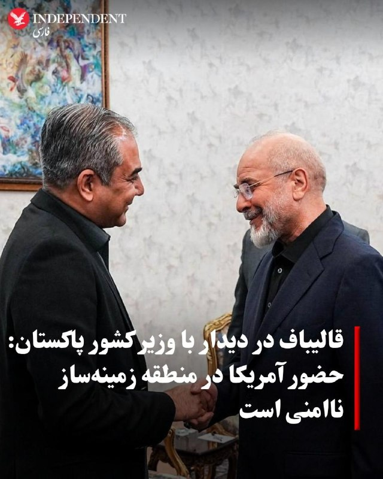

♦️محمدباقر قالیباف، رئیس مجلس شورای اسلامی، روز یکشنبه ۲۷ اردیبهشت با محسن نقوی، وزیر کشور پاکستان دیدار کرد.

به گزارش رسانه‌های داخلی ایران، قالیباف در این دیدار گفت برخی دولت‌های منطقه تصور می‌کردند حضور آمریکا برای آنها امنیت به همراه دارد، اما «حوادث اخیر نشان داد این حضور نه تنها امنیت‌زا نیست بلکه زمینه ناامنی را هم فراهم می‌کند.»

رئیس مجلس شورای اسلامی همچنین بر اهمیت همکاری و روابط میان کشورهای منطقه تاکید کرد.

به گزارش فارس، محسن نقوی، وزیر کشور پاکستان نیز در این دیدار با اشاره به مذاکرات اسلام‌آباد خطاب به قالیباف گفت: «شاهد ایستادگی شما در مذاکرات اسلام‌آباد بر منافع ملی ایران و در عین حال تلاش برای حل و فصل مشکلات بودیم.»

نقوی در جریان سفر دو روزه پیش‌بینی نشده به تهران، با مقام‌های مختلف جمهوری اسلامی، از جمله وزیر کشور، رئیس جمهوری و رئیس مجلس ایران دیدار کرد.
‌🇸🇦 Indypersian

🤖 @VahidOOnLine

## VahidOOnLine — post 240642

  

مستند کوتاه «هنر مقاومت» به تهیه‌کنندگی ایران اینترنشنال و کارگردانی مهران عباسیان در فستیوال فیلم خانه سینمای سوئد موفق به دریافت جایزه بهترین مستند کوتاه و بهترین کارگردانی شد.
این فیلم داستان دو هنرمند ایرانی را روایت می‌کند که هنر را به زبان اعتراض، امید و مقاومت در برابر محدودیت‌ها تبدیل کرده‌اند.
‌🏁 🇬🇧 IranintlTV

🤖 @VahidOOnLine

## VahidOOnLine — post 240641

  <a href="telegram/content/VahidOOnLine_240641_1779030802.mp4" target="_blank">🎬 Download video</a>

‌
پراگ | چک؛ گردهمایی ایرانیان ـ گزارشگر شنبه ۲۶ اردیبهشت
‌🏁 🇬🇧 ManotoTV

🤖 @VahidOOnLine

## VahidOOnLine — post 240640

  <a href="telegram/content/VahidOOnLine_240640_1779030804.mp4" target="_blank">🎬 Download video</a>

وزارت دفاع امارات متحده عربی اعلام کرد سه پهپاد از مرزهای غربی وارد این کشور شدند که دو فروند رهگیری شد و پهپاد سوم به یک ژنراتور خارج از محدوده داخلی نیروگاه هسته‌ای براکه در منطقه الظفره برخورد کرد و باعث آتش‌سوزی شد.

وزارت دفاع امارات اعلام کرد تحقیقات برای مشخص شدن منبع این حملات ادامه دارد و نتایج آن بعداً اعلام خواهد شد.
‌🏁 🇬🇧 ManotoTV

🤖 @VahidOOnLine

## VahidOOnLine — post 240639

  <a href="telegram/content/VahidOOnLine_240639_1779030805.mp4" target="_blank">🎬 Download video</a>

‌
«من صدای فاطمه سپهری هستم» ـ گزارشگر
‌🏁 🇬🇧 ManotoTV

🤖 @VahidOOnLine

## VahidOOnLine — post 240638

  <a href="telegram/content/VahidOOnLine_240638_1779030806.mp4" target="_blank">🎬 Download video</a>

تجمع ایرانیان ساکن بروکسل، یکشنبه ۲۷ اردیبهشت
‌🏁 🇬🇧 ManotoTV

🤖 @VahidOOnLine

## VahidOOnLine — post 240637

  

♦️وزارت دفاع امارات متحده عربی در بیانیه‌ای اعلام کرد سامانه‌های پدافند هوایی این کشور روز یکشنبه ۲۷ اردیبهشت ماه سه پهپاد را که از سمت مرزهای غربی وارد حریم امارات شده بودند، رهگیری کردند.

بر اساس این بیانیه، دو پهپاد با موفقیت رهگیری و منهدم شدند، اما پهپاد سوم به یک ژنراتور برق در خارج از محدوده داخلی نیروگاه هسته‌ای براکه در منطقه الظفره برخورد کرد.

وزارت دفاع امارات اعلام کرد تحقیقات برای شناسایی منشا این حملات آغاز شده و جزئیات بیشتر پس از تکمیل بررسی‌ها منتشر خواهد شد.

این وزارتخانه همچنین تاکید کرد نیروهای مسلح امارات در آمادگی کامل قرار دارند و با هرگونه اقدام علیه امنیت کشور «قاطعانه» برخورد خواهند کرد؛ اقدامی که به گفته مقام‌های اماراتی با هدف حفظ حاکمیت، امنیت، ثبات و منافع ملی این کشور انجام می‌شود.
‌🇸🇦 Indypersian

🤖 @VahidOOnLine

## VahidOOnLine — post 240636

  

♦️روزنامه نیویورک‌تایمز روز یکشنبه ۲۷ اردیبهشت منتشر در گزارشی فاش کرد ارتش اسرائیل در جریان تقابل نظامی اخیر با جمهوری اسلامی ایران، دو پایگاه نظامی مخفی در عمق خاک عراق ایجاد و از آنها برای پشتیبانی عملیات خود استفاده کرده است.
پیش‌تر وال‌استریت ژورنال گزارش داده بود اسرائیل یک پایگاه مخفی را در بیابان‌های غرب عراق برای استفاده در جنگی که از فوریه آغاز شده بود، ایجاد کرده است. اما اکنون مقام‌های عراقی در گفت‌وگو با نیویورک‌تایمز جزئیات تازه‌ای ارائه کرده و از وجود پایگاه مخفی دومی نیز خبر داده‌اند.
نیویورک‌تایمز به نقل از یک مقام منطقه‌ای گزارش داد ساخت پایگاه نخست در اواخر سال ۲۰۲۴ آغاز شد و این مرکز مشخصا برای پشتیبانی از حمله ژوئن ۲۰۲۵ اسرائیل به ایران مورد استفاده قرار گرفت. به نوشته این روزنامه، این پایگاه اکنون غیرفعال است. با این حال، پایگاه دوم برای مدیریت عملیات‌های مرتبط با جنگ اخیر ایجاد شده، اما موقعیت دقیق و وضعیت کنونی آن همچنان مشخص نیست.
بر اساس این گزارش، اسرائیل این پایگاه‌ها را با دو هدف اصلی ایجاد کرده است: کاهش زمان پرواز جنگنده‌ها برای انجام حملات در عمق خاک ایران و ایجاد یک مرکز عملیاتی پیشرفته برای پشتیبانی از نیروی هوایی. نیویورک‌تایمز نوشت این پایگاه‌ها همچنین محل استقرار نیروهای ویژه و تیم‌های امداد و نجات اسرائیلی بوده‌اند تا در صورت سقوط احتمالی جنگنده‌ها، عملیات نجات خلبانان را اجرا کنند.
این روزنامه همچنین گزارش داد واشنگتن دست‌کم از وجود یکی از این پایگاه‌های مخفی در خاک عراق اطلاع داشته است.
به نوشته نیویورک‌تایمز، حضور این پایگاه‌ها پس از آن مورد توجه قرار گرفت که برخی ساکنان محلی متوجه تحرکات مشکوک شدند. در همین ارتباط، چوپانی محلی به نام «عوض الشمری» پس از برخورد تصادفی با یکی از این مراکز، هدف هلیکوپترها قرار گرفت و کشته شد.
این گزارش می‌افزاید اطلاعات ارائه‌شده از الشمری پیش از مرگ، ارتش عراق را به اعزام یک تیم شناسایی به منطقه واداشت. با این حال، این گروه با آتش نیروهای اسرائیلی روبه‌رو شد؛ درگیری‌ای که به کشته و زخمی شدن سه سرباز عراقی و عقب‌نشینی آنها انجامید.
‌🇸🇦 Indypersian

🤖 @VahidOOnLine

## VahidOOnLine — post 240635

  

فرماندهی مرکزی ایالات متحده، سنتکام، اعلام کرد از زمان آغاز محاصره دریایی بنادر و سواحل جنوبی ایران، ۸۱ کشتی تجاری مجبور به تغییر مسیر شده‌اند و چهار شناور دیگر نیز پس از هدف قرار گرفتن، از کار افتاده‌اند تا اجرای این محاصره تضمین شود.
‌🏁 🇬🇧 IranintlTV

🤖 @VahidOOnLine

## VahidOOnLine — post 240634

  

ارتش اسرائیل اعلام کرد بها برود، از فرماندهان ستاد عملیات حماس، در حمله هوایی کشته شده است.
به گفته ارتش، او در هفته‌های اخیر در برنامه‌ریزی حملات علیه نیروهای اسرائیلی و غیرنظامیان نقش داشته و تهدیدی فوری محسوب می‌شده است.
ارتش اسرائیل تأکید کرد این حمله با مهمات دقیق انجام شده و نیروهای فرماندهی جنوبی مطابق آتش‌بس مستقر هستند.
‌🏁 🇬🇧 IranintlTV

🤖 @VahidOOnLine

## VahidOOnLine — post 240633

  

♦️روزنامه نیویورک‌تایمز روز یکشنبه ۲۷ اردیبهشت منتشر در گزارشی فاش کرد ارتش اسرائیل در جریان تقابل نظامی اخیر با جمهوری اسلامی ایران، دو پایگاه نظامی مخفی در عمق خاک عراق ایجاد و از آنها برای پشتیبانی عملیات خود استفاده کرده است.
پیش‌تر وال‌استریت ژورنال گزارش داده بود اسرائیل یک پایگاه مخفی را در بیابان‌های غرب عراق برای استفاده در جنگی که از فوریه آغاز شده بود، ایجاد کرده است. اما اکنون مقام‌های عراقی در گفت‌وگو با نیویورک‌تایمز جزئیات تازه‌ای ارائه کرده و از وجود پایگاه مخفی دومی نیز خبر داده‌اند.
نیویورک‌تایمز به نقل از یک مقام منطقه‌ای گزارش داد ساخت پایگاه نخست در اواخر سال ۲۰۲۴ آغاز شد و این مرکز مشخصا برای پشتیبانی از حمله ژوئن ۲۰۲۵ اسرائیل به ایران مورد استفاده قرار گرفت. به نوشته این روزنامه، این پایگاه اکنون غیرفعال است. با این حال، پایگاه دوم برای مدیریت عملیات‌های مرتبط با جنگ اخیر ایجاد شده، اما موقعیت دقیق و وضعیت کنونی آن همچنان مشخص نیست.
بر اساس این گزارش، اسرائیل این پایگاه‌ها را با دو هدف اصلی ایجاد کرده است: کاهش زمان پرواز جنگنده‌ها برای انجام حملات در عمق خاک ایران و ایجاد یک مرکز عملیاتی پیشرفته برای پشتیبانی از نیروی هوایی. نیویورک‌تایمز نوشت این پایگاه‌ها همچنین محل استقرار نیروهای ویژه و تیم‌های امداد و نجات اسرائیلی بوده‌اند تا در صورت سقوط احتمالی جنگنده‌ها، عملیات نجات خلبانان را اجرا کنند.
این روزنامه همچنین گزارش داد واشنگتن دست‌کم از وجود یکی از این پایگاه‌های مخفی در خاک عراق اطلاع داشته است.
به نوشته نیویورک‌تایمز، حضور این پایگاه‌ها پس از آن مورد توجه قرار گرفت که برخی ساکنان محلی متوجه تحرکات مشکوک شدند. در همین ارتباط، چوپانی محلی به نام «عوض الشمری» پس از برخورد تصادفی با یکی از این مراکز، هدف هلیکوپترها قرار گرفت و کشته شد.
این گزارش می‌افزاید اطلاعات ارائه‌شده از الشمری پیش از مرگ، ارتش عراق را به اعزام یک تیم شناسایی به منطقه واداشت. با این حال، این گروه با آتش نیروهای اسرائیلی روبه‌رو شد؛ درگیری‌ای که به کشته و زخمی شدن سه سرباز عراقی و عقب‌نشینی آنها انجامید.
‌🇸🇦 Indypersian

🤖 @VahidOOnLine

## VahidOOnLine — post 240632

  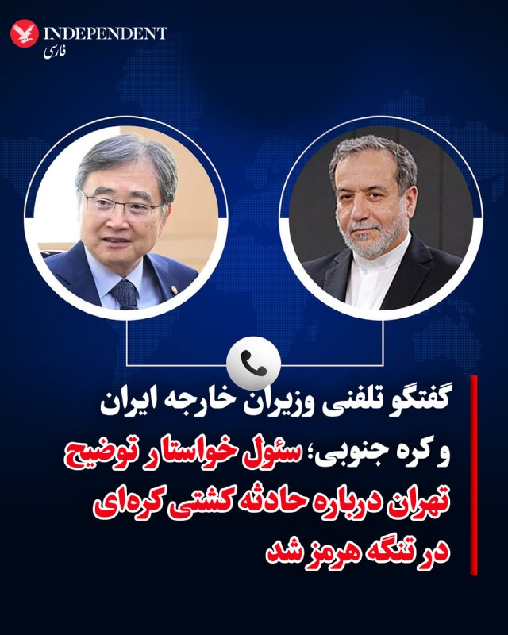

♦️وزارت امور خارجه کره جنوبی اعلام کرد چو هیون، وزیر امور خارجه این کشور، روز یکشنبه در تماس تلفنی با عباس عراقچی، وزیر امور خارجه جمهوری اسلامی ایران، درباره آخرین تحولات منطقه‌ای، امنیت کشتی‌های کره‌ای و آزادی دریانوردی در تنگه هرمز گفتگو کرده است.
بر اساس اعلام وزارت خارجه کره جنوبی، وزیر خارجه این کشور در این تماس خواستار رفع ابهام و توضیح تهران درباره هدف قرار گرفتن یک کشتی کره‌ای در تنگه هرمز شده است.
 وزارت امور خارجه جمهوری اسلامی ایران نیز اعلام کرد چو هیون و عراقچی در این گفتگوی تلفنی درباره آخرین تحولات منطقه رایزنی کرده‌اند.
وزارت خارجه کره‌جنوبی روز یکشنبه اعلام کرده بود که کشتی باری متعلق به این کشور که روز ۱۴ اردیبهشت در تنگه هرمز دچار حادثه شده بود، هدف حمله «هواگردهای ناشناس» قرار گرفته است. مقام‌های امنیتی این کشور می‌گویند بررسی‌های سئول نشان می‌دهد که به احتمال بسیار زیاد جمهوری اسلامی ایران مسئول حمله به کشتی باری این کشور در تنگه هرمز بوده است.
‌🇸🇦 Indypersian

🤖 @VahidOOnLine

## WithYashar — post 11484

کیهان لندن : آماده باشید که احتمالا آمریکا و اسرائیل به زودی حمله می‌کنن
@withyashat

## WithYashar — post 11483

حریق در یک ساختمان تجاری در خیابان جمهوری تهران

سخنگوی سازمان آتش‌نشان:

ساعت ۱۷:۱۴ دقیقه یک مورد حادثه آتش سوزی در یک ساختمان تجاری به آدرس خیابان جمهوری بعد از خیابان شیخ هادی به سامانه ۱۲۵ اعلام می‌شود.
@withyashar

## WithYashar — post 11482

  <a href="https://t.me/withyashar/11482" target="_blank">📎 Download file</a>

🌐 instagram.com/yashar

🌐 t.me/withyashar

## WithYashar — post 11481

  <a href="telegram/content/WithYashar_11481_1779030811.mp4" target="_blank">🎬 Download video</a>

🎬 Video

## WithYashar — post 11480

نمیدونم چطوری اطلاعات بدردبخور رو‌انتقال بدم نمیدونم اجازه میدی به وقتش واسه خودت بفرستم و تو یه کاری بکنی؟

## WithYashar — post 11479

نمیدونم چطوری اطلاعات بدردبخور رو‌انتقال بدم
نمیدونم اجازه میدی به وقتش واسه خودت بفرستم و تو یه کاری بکنی؟

## mwarmonitor — post 9212

  

هدف قرار دادن نیروگاه هسته‌ای براکه

## mwarmonitor — post 9211

مجری (کریستن ولکر):
سناتور، شما من رو به سوال بعدی‌ام هدایت کردید؛ چون بر اساس یک نظرسنجی جدید، ۷۰ درصد از آمریکایی‌ها می‌گن پرزیدنت ترامپ عملکرد بدی در زمینه اقتصاد داشته؛ موضوعی که همون‌طور که می‌دونید، اولویت شماره یک رای‌دهنده‌هاست. لپ کلام، آیا ارزشش رو داره که میان‌دوره‌ای‌ها رو از دست بدید، در صورتی که نتیجه‌اش یک ایرانِ بدون سلاح هسته‌ای باشه؟
سناتور لیندسی گراهام:
این ارزشش رو داره که من شغلم رو از دست بدم. اگر مجبور بودم شغلم رو فدا کنم تا مطمئن بشم ایران هرگز به سلاح هسته‌ای دست پیدا نمی‌کنه، این کار رو می‌کردم.
مجری:
و آیا حاضر بودید مجلس نمایندگان و سنا رو هم فدا کنید؟
سناتور لیندسی گراهام:
من از نظر سیاسی [حاضر بودم فداکاری کنم]. مهم‌ترین کاری که می‌تونم در شغلی که به من سپرده شده انجام بدم، محافظت از مردم آمریکاست. حالا شما مجبور نیستید با من موافق باشید، اما من ۲۰ ساله که همین رویکرد رو دارم. من معتقدم نازی‌های مذهبی در ایران، اگر سلاح هسته‌ای داشتند ازش استفاده می‌کردند. اون‌ها تلاش کردند که بهش برسن، اون‌ها تقلب کردند. اوباما و بایدن وقتی نوبت به مهار ایران رسید، مثل یک شوخی بودند.
ترامپ کاری رو انجام می‌ده که مردم باید مدت‌ها پیش انجام می‌دادند. اما خبر خوب اینه: وقتی ایران رو سر جایش بنشونید، قیمت بنزین پایین میاد. وقتی ایران رو سر جایش بنشونید، صلح بین عربستان و اسرائیل ممکن می‌شه. مزایای برخورد با ایران فوق‌العاده زیاده، اما باید باهاش مقابله کرد...

@mwarmonitor

## mwarmonitor — post 9210

  <a href="telegram/content/mwarmonitor_9210_1779030813.mp4" target="_blank">🎬 Download video</a>

🎬 Video

## mwarmonitor — post 9209

مجری:
«ببینید.»
دونالد ترامپ:
«من به وضعیت مالی آمریکایی‌ها فکر نمی‌کنم، به هیچ‌کس دیگه‌ای هم فکر نمی‌کنم. من فقط به یک چیز فکر می‌کنم: ما نباید اجازه بدیم ایران به سلاح هسته‌ای دست پیدا کنه. همین و بس.»
مجری:
«آیا شما با رئیس‌جمهور موافقید که نباید وضعیت مالی آمریکایی‌ها رو هنگام برخورد با ایران در نظر بگیره؟»
سناتور لیندسی گراهام:
«این لحظهٔ "چرچیل" اوست. وقتی چرچیل به قدرت رسید، وعدهٔ خون، عرق، رنج و سختی داد تا زمانی که با نازی‌ها مقابله کنیم؛ نازی‌هایی که یک تهدید وجودی برای سبک زندگی بریتانیا بودن. و اگه هیتلر کنترل سیاره رو به دست می‌گرفت، این تاریک‌ترین دوران بشریت می‌شد.»
«من باور دارم که ایران سلاح هسته‌ای می‌خواد و ازش استفاده هم خواهد کرد. پرزیدنت ترامپ هم همین باور رو داره. اون‌ها از این سلاح به عنوان بخشی از دستور کار مذهبی خودشون استفاده می‌کنن؛ حکومت یهود (اسرائیل) رو نابود می‌کنن و در نهایت ما رو هم به گروگان می‌گیرن. بنابراین مخاطب او، رژیم ایرانه.»
«آیا من نگران قیمت بنزین هستم؟ بله. اما حق با پرزیدنت ترامپه؛ بزرگ‌ترین تهدید برای ثبات جهان، یک ایران مجهز به سلاح هسته‌ای هست و هر هزینه‌ای که مجبور باشیم بپردازیم، پرداخت خواهیم کرد. چرچیل چی گفت؟ گفت: "هر هزینه‌ای که برای شکست دادن هیتلر مجبور باشیم بپردازیم، پرداخت خواهیم کرد." در مورد ایران هم همین‌طوره.»
«خبر خوب اینه که ما الان در محدودهٔ ۱۰ یاردی (مراحل پایانی) هستیم. فکر می‌کنم اگه به فعالیت‌های نظامی برگردیم و اون‌ها رو بیشتر تضعیف کنیم، می‌تونیم این قضیه رو خیلی زود تموم کنیم.»

@mwarmonitor

## mwarmonitor — post 9208

  <a href="telegram/content/mwarmonitor_9208_1779030815.mp4" target="_blank">🎬 Download video</a>

🎬 Video

## mwarmonitor — post 9207

🔸سناتور لیندسی گراهام: من فکر می‌کنم... فکر می‌کنم که حفظ «وضعیت موجود» داره به همه‌مون آسیب می‌زنه. هر چقدر این تنگه طولانی‌تر بسته بمونه، هر چقدر بیشتر تلاش کنیم تا به توافقی برسیم که هیچ‌وقت اتفاق نمی‌افته، ایران قوی‌تر می‌شه. بنابراین... بر اساس تحلیل من، هیچ نشانه‌ای وجود نداره که ثابت کنه افرادی که الان در راس کار هستن، از نظر اهداف رژیم—یعنی ترور کردن جهان، نابودی اسرائیل و اقدام علیه ما—کوچک‌ترین تفاوتی با بقیه داشته باشن. پس قدم بعدی چیه؟ شما اون‌ها رو بیشتر تضعیف می‌کنید. کاری که رئیس‌جمهور ترامپ انجام داده، از نظر نظامی فوق‌العاده بوده، اما هنوز هم اهداف بیشتری برای هدف قرار دادن وجود داره و کارهایی هست که می‌تونیم برای ضربه زدن به ساختار... زیرساخت‌های انرژی اون‌ها انجام بدیم، چون این بخش، نقطه ضعف بزرگ اون‌هاست. اگر قرار باشه دوباره به این تقابل برگردید، من بخش انرژی رو در صدر لیست قرار می‌دم.
🔹​مجری: پس شما خواستار حمله به زیرساخت‌های انرژی (آن‌ها) هستید؟
🔸​سناتور لیندسی گراهام: من... بله، من خواستار ضربه زدن به این رژیم هستم. اگر همون کارهای همیشگی رو انجام بدید، همون نتایج همیشگی رو هم می‌گیرید. بیشتر بهشون ضربه بزنید؛ شاید اگر به اندازه کافی بهشون ضربه بزنید، تن به توافق بدن. اما در حال حاضر، فکر می‌کنم اون‌ها دارن تلاش می‌کنن زمان بخرن تا ما خسته بشیم، فکر می‌کنم دارن بازی درمیارن و به قول رئیس‌جمهور، من فکر می‌کنم اون‌ها دیوانه‌اند.

@mwarmonitor

## mwarmonitor — post 9206

  <a href="telegram/content/mwarmonitor_9206_1779030817.mp4" target="_blank">🎬 Download video</a>

🎬 Video

## mwarmonitor — post 9205

  

🇺🇸«یک ملوان نیروی دریایی آمریکا هنگام عبور از دریای عرب، بر روی پل فرماندهی ناو USS Tripoli (LHA-7) در حال نگهبانی است. گروه آماده‌به‌رزمی آبی‌–خاکی تریپولی در حال اجرای محاصره دریایی آمریکا علیه ایران است. تا تاریخ ۱۷ مه، نیروهای آمریکایی مسیر ۸۱ کشتی تجاری را تغییر داده و برای اطمینان از رعایت این محاصره، ۴ کشتی را از کار انداخته‌اند.»

@mwarmonitor

## mwarmonitor — post 9204

🔴اختصاصی اکسیوس: آمریکا تهدید پهپادهای تهاجمی کوبا را زیر نظر دارد 📝نویسنده: مارک کاپوتو 🔰بر اساس اطلاعات طبقه‌بندی‌شده‌ای که با اکسیوس به اشتراک گذاشته شده است، کوبا بیش از ۳۰۰ پهپاد نظامی خریداری کرده و اخیراً گفتگوهایی را درباره برنامه‌ریزی برای استفاده…

## mwarmonitor — post 9203

🇦🇪پدافند هوایی امارات متحده عربی با ۳ پهپاد برخورد کرده است.

🔴وزارت دفاع اعلام کرد که در تاریخ ۱۷ مه ۲۰۲۶، پدافند هوایی امارات با ۳ پهپاد که از سمت مرزهای غربی وارد کشور شده بودند مقابله کرده است. طبق این گزارش، دو فروند از آن‌ها با موفقیت رهگیری و منهدم شدند و سومی به یک مولد برق در خارج از محدوده داخلی نیروگاه هسته‌ای براکه در منطقه ظفره اصابت کرده است.

🔸این وزارتخانه افزود که تحقیقات برای شناسایی منبع این حملات ادامه دارد و پس از تکمیل بررسی‌ها، جزئیات بیشتری منتشر خواهد شد.

🔸همچنین تأکید شد که وزارت دفاع در بالاترین سطح آمادگی قرار دارد و با هرگونه تهدید با قاطعیت برخورد خواهد کرد تا امنیت، حاکمیت و ثبات کشور حفظ شود و از منافع و زیرساخت‌های ملی محافظت شود.

@mwarmonitor

## mwarmonitor — post 9202

  <a href="telegram/content/mwarmonitor_9202_1779030819.mp4" target="_blank">🎬 Download video</a>

✈️🚨پل هوایی عظیم نیروی هوایی آمریکا به خاورمیانه امروز هیچ نشانه‌ای از کاهش یا توقف ندارد.

@mwarmonitor

## FoxNewsTwitter — post 341843

  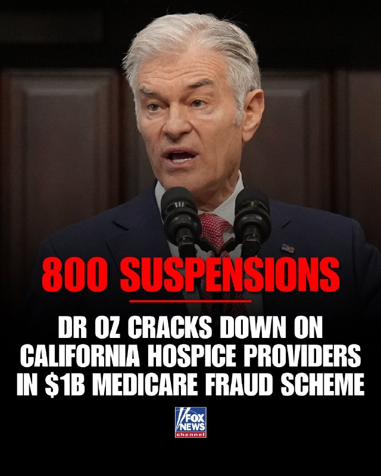

Fox News (Twitter/X)

Dr. Mehmet Oz says federal officials have suspended 800 hospice and home health providers in California after uncovering what the Trump administration describes as a massive Medicare fraud scheme tied to foreign-linked criminal networks.

"These bad people — if they’re willing to steal your money, they will happily steal your health."

## FoxNewsTwitter — post 341842

  

Fox News (Twitter/X)

WATCH LIVE: Thousands gather on National Mall for 'Rededicate 250' https://twitter.com/i/broadcasts/1AxRnavembZxl

## FoxNewsTwitter — post 341841

  

Fox News (Twitter/X)

NEW: President Trump turns up the heat against Rep. Thomas Massie, calling the Kentucky lawmaker "the Worst Republican Congressman in History."

The president's latest call to action comes ahead of the state's primary elections on Tuesday.

## FoxNewsTwitter — post 341837

Fox News (Twitter/X)

END OF AN ERA: Ronda Rousey's rousing return to the ring ended quickly, after the legendary fighter took down opponent Gina Carano in just 17 seconds in front of a packed, stunned crowd — wrapping up her historic MMA career.

Rousey claims she's done fighting for good and is embracing being a mom to her two kids, and that she's ready to expand her family again.

## pm_afshaa — post 90906

🔴کیهان: آماده باشید که احتمالا آمریکا و اسرائیل به زودی حمله می‌کنن

💧 Rainbet.com the #1 Non-KYC Crypto Casino & Sportsbook @rainbetcom

😁 @Pm_Afshaa

## pm_afshaa — post 90905

  <a href="telegram/content/pm_afshaa_90905_1779030823.mp4" target="_blank">🎬 Download video</a>

🔴امروز جلسه دادگاه ساعدی نیا، مدیر کافه زنجیره‌ای معروف ساعدی نیا به دلیل حمایت از اعتراضات دی برگزار شد.

ساعدی نیا: من بلاتکلیف بودم تا اینکه استوری گذاشتم و مغازه رو تعطیل کردم، بعدش از ترس استوری رو پاک کردم و موبایلمو خاموش کردم، من هیچکسو به حضور در اعتراضات ترغیب نکردم. منظور من از فروپاشی، فروپاشی اقتصادی بود و نه خیزش علیه نظام. من هیچکدوم از کارکنانم رو برای حضور در اعتراضات مجبور نکردم، از کاری که کردم پشیمونم و از دادگاه می‌خوام فرصت جبران بهم بده.
قاضی: شما با فراخوانی که دادی کلی جوون رو به اعتراضات کشوندین و ضربه زیادی به این نظام زدی، چطوری میخوای جبران کنی؟

💧Rainbet.com the #1 Non-KYC Crypto Casino & Sportsbook @rainbetcom

😁 @Pm_Afshaa

## pm_afshaa — post 90904

  <a href="telegram/content/pm_afshaa_90904_1779030823.webm" target="_blank">🎬 Download video</a>

🔴خبرگزاری فارس: جزئیاتی از درخواست‌های آمریکا از ایران در مذاکرات؛ 5 شرط اصلی واشنگتن به این شرح اعلام شده : عدم پرداخت هرگونه غرامت و خسارت از سوی آمریکا خروج و تحویل ۴۰۰ کیلوگرم اورانیوم از ایران به آمریکا فعال ماندن تنها یک مجموعه از تأسیسات هسته‌ای…

## kianmeli1 — post 87452

  

‏🔴وزیر خارجه امارات متحده عربی پس از حمله پهپادی به نیروگاه هسته‌ای این کشور، تلفنی با مدیرکل آژانس بین‌المللی انرژی اتمی گفت‌وگو کرده است. وزیر خارجه امارات متحده عربی تاکید کرد که ابوظبی حق کامل دارد به چنین «حملات تروریستی» پاسخ دهد
https://t.me/kianmeli1

## kianmeli1 — post 87451

  

🔴اکسیوس-کوبا بیش از ۳۰۰ پهپاد از روسیه و ایران خریداری کرده و بنا به گزارش‌ها، در حال بررسی هدف قرار دادن خلیج گوانتانامو، کشتی‌های نیروی دریایی ایالات متحده و کی وست است
https://t.me/kianmeli1

## kianmeli1 — post 87450

  <a href="telegram/content/kianmeli1_87450_1779030825.mp4" target="_blank">🎬 Download video</a>

🔴آتش سوزی وسیع در مسکو پس از حملات پهپادی اوکراین
https://t.me/kianmeli1

## IranIntlTV — post 337642

  <a href="telegram/content/IranIntlTV_337642_1779030826.mp4" target="_blank">🎬 Download video</a>

پگاه آهنگرانی، بازیگر و فیلمساز ایرانی، شنبه ۲۶ اردیبهشت برای نمایش فیلم تازه خود «تمرین‌هایی برای یک انقلاب» در جشنواره کن حاضر شد. او این فیلم را به مادرانی تقدیم کرد که فرزندانشان را در مسیر مبارزه برای آزادی از دست داده‌اند. آهنگرانی که همراه عوامل فیلم روی صحنه رفت، گفت خوشحال است که این اثر توانسته بخشی از مبارزه مردم برای آزادی و دموکراسی را به تصویر بکشد و افزود مردم این روزها با قطعی اینترنت، خبرهای روزانه اعدام‌ها توسط جمهوری اسلامی و سایه جنگ روبه‌رو هستند.
@iranintltv

## IranIntlTV — post 337641

  

مستند کوتاه «هنر مقاومت» به تهیه‌کنندگی ایران اینترنشنال و کارگردانی مهران عباسیان در فستیوال فیلم خانه سینمای سوئد موفق به دریافت جایزه بهترین مستند کوتاه و بهترین کارگردانی شد.
این فیلم داستان دو هنرمند ایرانی را روایت می‌کند که هنر را به زبان اعتراض، امید و مقاومت در برابر محدودیت‌ها تبدیل کرده‌اند.
https://iranintl.com/202605174127

## IranIntlTV — post 337640

  <a href="telegram/content/IranIntlTV_337640_1779030829.mp4" target="_blank">🎬 Download video</a>

یک شهروند با ارسال پیامی به ایران‌اینترنشنال می‌گوید مدرس آنلاین زبان انگلیسی است و دو ماهی می‌شود که نتوانسته یک کلاس برگزار کند.

## IranIntlTV — post 337639

  <a href="telegram/content/IranIntlTV_337639_1779030830.mp4" target="_blank">🎬 Download video</a>

پس از ۱۲ هفته خاموشی اینترنت در ایران، حالا دسترسی به اینترنت برای برخی شهروندان به کالایی گران و لوکس تبدیل شده است.

مهدی بیگی، عضو تحریریه ایران‌اینترنشنال، در برنامه پیوست بازار سیاه «اینترنت پرو» را بررسی کرده است
@iranintltv

## IranIntlTV — post 337638

  <a href="telegram/content/IranIntlTV_337638_1779030832.mp4" target="_blank">🎬 Download video</a>

رکود تورمی سنگین در اقتصاد ایران، موجب تشدید بحران در صنایع مختلف شده است. روزنامه جهان صنعت در گزارشی از انباشت ۸۰ تا ۱۲۰ هزار خودروی ناقص و بدهی سنگین شرکت سایپا به قطعه‌سازان خبر داد.

گفت‌وگو با مهتاب قلی‌زاده، روزنامه‌نگار اقتصادی
@iranintltv

## IranIntlTV — post 337637

  

فرماندهی مرکزی ایالات متحده، سنتکام، اعلام کرد از زمان آغاز محاصره دریایی بنادر و سواحل جنوبی ایران، ۸۱ کشتی تجاری مجبور به تغییر مسیر شده‌اند و چهار شناور دیگر نیز پس از هدف قرار گرفتن، از کار افتاده‌اند تا اجرای این محاصره تضمین شود.
https://iranintl.com/202605177479

## IranIntlTV — post 337636

  <a href="telegram/content/IranIntlTV_337636_1779030835.mp4" target="_blank">🎬 Download video</a>

سرخط خبرهای یکشنبه ۲۷ اردیبهشت
@iranintltv

## IranIntlTV — post 337634

  

ارتش اسرائیل اعلام کرد بها برود، از فرماندهان ستاد عملیات حماس، در حمله هوایی کشته شده است.
به گفته ارتش، او در هفته‌های اخیر در برنامه‌ریزی حملات علیه نیروهای اسرائیلی و غیرنظامیان نقش داشته و تهدیدی فوری محسوب می‌شده است.
ارتش اسرائیل تأکید کرد این حمله با مهمات دقیق انجام شده و نیروهای فرماندهی جنوبی مطابق آتش‌بس مستقر هستند.
https://iranintl.com/202605178370

## IranIntlTV — post 337633

  <a href="telegram/content/IranIntlTV_337633_1779030836.mp4" target="_blank">🎬 Download video</a>

مهدی تاج، رییس فدراسیون فوتبال، وعده داد تیم فوتبال ایران با پرواز مستقیم ایران‌ایر برای جام جهانی راهی آمریکا خواهد شد. رسانه فوتبال ۳۶۰ در واکنش به این اظهارات، با اشاره به قرار داشتن ایران‌ایر در فهرست تحریم‌های آمریکا و اروپا، امکان تحقق چنین وعده‌ای را زیر سوال برد.

گفت‌وگو با محمد تقوی، عضو تحریریه ایران‌اینترنشنال
@iranintltv

## IranIntlTV — post 337632

  <a href="telegram/content/IranIntlTV_337632_1779030838.mp4" target="_blank">🎬 Download video</a>

دونالد ترامپ، رییس‌جمهوری ایالات متحده، گفت اگر جمهوری اسلامی توافق نکند، روزگار بسیار بدی خواهد داشت. همزمان رسانه‌های ایران اعلام کردند جمهوری اسلامی پاسخ خود به آمریکا را به میانجی پاکستانی ارائه داده است.

گفت‌وگو با شایان سمیعی، کارشناس امنیت ملی
@iranintltv

## IranIntlTV — post 337631

  <a href="telegram/content/IranIntlTV_337631_1779030840.mp4" target="_blank">🎬 Download video</a>

گروهی از فعالان و حامیان مردم ایران، تجمعی اعتراضی روی پل پر تردد فرانسیس اسکات‌کی در واشینگتن برگزار کردند. هدف این برنامه، جلب توجه افکار عمومی به وضعیت زندانیان سیاسی، مخالفت با اعدام‌ها و حمایت از آزادی اینترنت در ایران است.

گزارش اردوان روزبه، خبرنگار ایران‌اینترنشنال
@iranintltv

## ManotoTV — post 105559

  <a href="telegram/content/ManotoTV_105559_1779030842.mp4" target="_blank">🎬 Download video</a>

‌
پراگ | چک؛ گردهمایی ایرانیان ـ گزارشگر شنبه ۲۶ اردیبهشت

## ManotoTV — post 105558

  <a href="telegram/content/ManotoTV_105558_1779030843.mp4" target="_blank">🎬 Download video</a>

وزارت دفاع امارات متحده عربی اعلام کرد سه پهپاد از مرزهای غربی وارد این کشور شدند که دو فروند رهگیری شد و پهپاد سوم به یک ژنراتور خارج از محدوده داخلی نیروگاه هسته‌ای براکه در منطقه الظفره برخورد کرد و باعث آتش‌سوزی شد.

وزارت دفاع امارات اعلام کرد تحقیقات برای مشخص شدن منبع این حملات ادامه دارد و نتایج آن بعداً اعلام خواهد شد.

## ManotoTV — post 105557

  <a href="telegram/content/ManotoTV_105557_1779030844.mp4" target="_blank">🎬 Download video</a>

‌
«من صدای فاطمه سپهری هستم» ـ گزارشگر

## ManotoTV — post 105556

  <a href="telegram/content/ManotoTV_105556_1779030845.mp4" target="_blank">🎬 Download video</a>

تجمع ایرانیان ساکن بروکسل، یکشنبه ۲۷ اردیبهشت

## FarsiVOA — post 217982

عبدالله مهتدی، دبیر کل حزب کومله کردستان ایران درعمق میدان: نیروهای خود را با وعده و وعید به کشتارگاه روانه نخواهیم کرد و مردم را بدون پشتیبانی به قیامی که با حمام خون می‌انجامد تشویق نمی‌کنیم

## FarsiVOA — post 217981

  <a href="telegram/content/FarsiVOA_217981_1779030846.mp4" target="_blank">🎬 Download video</a>

هادی احمدی، سخنگوی «انجمن داروسازان ایران» اعلام کرد در جنگ اسرائیل و آمریکا با جمهوری اسلامی، ۲۵ واحد داروسازی دچار مشکل شدند و در این بین «توفیق دارو از بین رفت و دوباره باید ساخته شود.» به گفته او «انستیتو پاستور» نیز که مورد هدف حملات هوایی قرار گرفته بود «در حال بازسازی است.»

پیشتر ارتش اسرائیل، اعلام کرده بود «توفیق دارو» که در ۱۱ فروردین در وردآورد هدف قرار گرفته شد، یکی از تأمین‌کنندگان اصلی مواد شیمیایی برای سازمان (سپند) بود که «مسئول توسعه سلاح‌های شیمیایی» جمهوری اسلامی به شمار می‌آید.

سازمان پژوهش و نوآوری دفاعی (سپند) زیرمجموعه وزارت دفاع و پشتیبانی نیروهای مسلح جمهوری اسلامی است، که دو مدیر وقت و سابق آن در نخستین روز از عملیات نظامی در ایران، در جلسه شورای دفاع به همراه علی خامنه‌ای کشته شدند.

## FarsiVOA — post 217977

ستاد فرماندهی مرکزی ایالات متحده، سنتکام با انتشار تصاویری از آماده‌سازی هواپیمای سوخت‌رسان کی‌سی-۱۳۵ اعلام کرد که این هواپیماها با سوخت‌رسانی هوایی، برد عملیاتی جنگنده‌ها و دیگر تجهیزات نظامی آمریکا را در سراسر خاورمیانه افزایش می‌دهند.

سنتکام جزئیات بیشتری درباره محل استقرار یا ماموریت این هواپیماها منتشر نکرده است. این اقدام همزمان با بالا بودن تنش‌ها در منطقه انجام می‌شود.

@FarsiVOA

## FarsiVOA — post 217976

  

فرماندهی مرکزی ایالات متحده، سنتکام، تصویری از یک ملوان آمریکایی بر روی ناو آبی‌خاکی «یو‌اس‌اس تریپولی» در دریای عرب منتشر کرد.

به گفته سنتکام، تا ۲۷ اردیبهشت، نیروهای آمریکایی مسیر ۸۱ کشتی تجاری را تغییر داده و چهار شناور را برای اطمینان از اجرای این اقدامات از کار انداخته‌اند.

@FarsiVOA

## FarsiVOA — post 217975

نت‌بلاکس، نهاد ناظر بر اختلالات اینترنت، اعلام کرد داده‌های شبکه نشان می‌دهد خاموشی اینترنت در ایران همچنان ادامه دارد و وارد روز هفتادونهم، در هفته دوازدهم، شده است.

به این ترتیب، شهروندان عادی در ایران بیش از ۱۸۷۰ ساعت است که از دسترسی عادی به اینترنت جهانی محروم مانده‌اند؛ وضعیتی که منتقدان آن را نوعی حصر دیجیتال می‌دانند.

به گفته نت‌بلاکس، این اقدام گسترده سانسور دیجیتال، ماهیت مشارکت مدنی در ایران را تغییر داده است. این نهاد می‌گوید کنترل اطلاعات باعث شده افکار عمومی، به جای مشارکت فعال در تحولات کشور، به «ناظرانی» محدود در سرنوشت خود تبدیل شوند.

این هشدار فقط درباره قطع اتصال نیست؛ درباره تغییر جایگاه شهروند در فضای عمومی است. وقتی دسترسی به اینترنت جهانی محدود می‌شود، مردم کمتر می‌توانند خبر بگیرند، مستند کنند، روایت بسازند، اعتراض کنند، کسب‌وکار کنند یا در تصمیم‌های عمومی اثر بگذارند.

گزارش کامل را در وب‌سایت صدای آمریکا بخوانید.

@FarsiVOA

## FarsiVOA — post 217974

  <a href="telegram/content/FarsiVOA_217974_1779030848.mp4" target="_blank">🎬 Download video</a>

عبدالله مهتدی، دبیر کل حزب کومله کردستان ایران در گفت‌وگو با عمق میدان: «کردها خود را یک ملت می‌دانند و اگر شرایط زندگی مشترک در ایران برای آنها غیرممکن شود حق دارند به این نتیجه برسند که در چارچوب این مملکت نمی‌شود سعادت خود را حفظ کرد»

## FarsiVOA — post 217973

  <a href="telegram/content/FarsiVOA_217973_1779030849.mp4" target="_blank">🎬 Download video</a>

گروهی از بازنشستگان تامین اجتماعی در شوش روز یکشنبه، ۲۷ اردیبهشت ۱۴۰۵، با شعار «عدالت، معیشت، منزلت، حق مسلم ماست» در اعتراض به شرایط دشوار معیشتی، مقابل این سازمان تجمع کردند.

## DW_Farsi — post 124802

🔶 هشدار امنیتی درباره سناریوی پیروزی AfD در زاکسن-آنهالت آلمان

به گزارش روزنامه "هندلزبلات"، با توجه به نتایج بالای حزب آلترناتیو برای آلمان (AfD) در نظرسنجی‌های ایالت زاکسن-آنهالت، چندین وزیر امور داخلی ایالت‌های آلمان، خواستار اتخاذ تدابیری برای احتمال مشارکت این حزب در دولت شده‌اند.

به نوشته این روزنامه، گئورگ مایر، وزیر امور داخلی ایالت تورینگن، در تلاش است تا این موضوع را در دستور کار کنفرانس وزیران امور داخلی ایالت‌های آلمان که اواسط ماه ژوئن در هامبورگ برگزار می‌شود، قرار دهد.

این سیاستمدار حزب سوسیال دموکرات به "هندلزبلات" گفت: «باید فوراً در مورد خطراتی که تصاحب احتمالی دولت ایالتی توسط حزب آلترناتیو برای آلمان در زاکسن-آنهالت برای معماری امنیتی کشور ایجاد می‌کند و چگونگی مقابله با آن، گفت‌وگو کنیم.»

گئورگ مایر گفت: «حزب آلترناتیو برای آلمان به دلیل ارتباطات متعددش با دولت‌های اقتدارگرا و شبکه‌سازی با سازمان‌های حاشیه‌ای راست افراطی، تهدیدی برای امنیت داخلی و خارجی جمهوری فدرال آلمان به شمار می‌رود. نباید اجازه داد اطلاعات محرمانه نهادهای امنیتی ما به روسیه یا به محافل راست افراطی درز کند.»
@dw_farsi

## DW_Farsi — post 124801

  

🔶 نت‌بلاکس: قطع اینترنت در ایران به ۷۹ روز رسید

نت‌بلاکس، نهاد بین‌المللی ناظر بر وضعیت اینترنت در جهان، یکشنبه ۱۷ مه (۲۷ اردیبهشت) در تازه‌ترین به‌روزرسانی خود اعلام کرد، ایران در سال ۲۰۲۶ یکی از طولانی‌ترین دوره‌های قطع اینترنت را تجربه کرده است.

بر اساس داده‌های منتشرشده از سوی نت‌بلاکس در شبکه اجتماعی "ایکس" قطع اینترنت در ایران اکنون وارد هفته دوازدهم شده و ۷۹ روز ادامه داشته است.

این نهاد ناظر بر وضعیت دسترسی به اینترنت در جهان اعلام کرده است که این نوع خاموشی گسترده اینترنت شکل مشارکت مدنی در ایران را دگرگون کرده و کنترل جریان اطلاعات، شهروندان را به "تماشاگرانی در کشور خود" تبدیل کرده است.

علاوه بر آن قطع اینترنت به‌شدت بر معیشت، کسب‌وکار و اشتغال مردم تاثیر گذاشته است.

سرکوب اعتراضات مردمی در ایران همواره با خاموشی اینترنت همراه بوده است اما در هیچ برهه‌ای طولانی شدن خاموشی دیجیتال تا این حد گزارش نشده بود.
@dw_farsi

## DW_Farsi — post 124800

🔶 از سانسور تا چوبه‌دار؛ حکومت ایران با نویسندگان چه می‌کند؟

🔻گزارشی از آتفه چهارمحالیان

میدان سرکوب حکومت‌های تمامیت‌خواه فقط خیابان نیست؛ آن‌ها کلمات، هنر و فرهنگ مستقل را تهدیدی علیه مشروعیت و بقای خود می‌دانند. جمهوری اسلامی، دهه‌هاست مشغول ساختن زندان برای آثار و پدیدآورندگان است. از تصفیه دانشگاه‌ها در انقلاب فرهنگی و تأسیس وزارت فرهنگ و ارشاد اسلامی و شورای عالی انقلاب فرهنگی تا قتل‌های زنجیره‌ای نویسندگان، توقیف روزنامه‌ها، کتاب‌ها، آوازها و فیلم‌ها، ممنوع‌الکاری، ممنوع‌الخروجی و تحمیل مرگ در زندان؛ تلاشی مداوم برای انقیاد بیان و کنترل ذهن جمعی جامعه ایران.

در روزهای اخیر تأیید دوباره حکم اعدام پیمان فرح‌آور، شاعر و ترانه‌سرا، در شعبه ۳۹ دیوان عالی کشور، این روند را وارد مرحله‌ای عریان‌تر کرده است؛ نبردی که در آن متن تا پای چوبه‌دار تحت تعقیب است. به گفته نزدیکان فرح‌آور، اتهام‌های "بغی" و "محاربه" در این پرونده به ترانه‌ها و فعالیت‌های اجتماعی و کنشگرانه او گره خورده است.

پرونده‌های یوسف انصاری و علی اسدالهی، دو عضو کانون نویسندگان ایران، همچنان در جریان است. انصاری، داستان‌نویس، در مراسم سالگرد بکتاش آبتین (شاعر و فیلم‌ساز جان سپرده در اثر محرومیت درمانی در زندان) بازداشت شد و ماه‌هاست زیر فشار امنیتی و قضایی قرار دارد. اسدالهی، شاعر نیز پس از یورش مأموران امنیتی به خانه‌اش و بازداشت همراه با ضرب‌وشتم، با قرار وثیقه آزاد شده و در انتظار حکم دادگاه است. این در حالی است که به دلیل بیش از دو ماه قطعی اینترنت، از وضعیت بسیاری از نویسندگان و هنرمندانی که در جریان وقایع دی‌ماه و پس از آن بازداشت یا احضار شده‌اند، خبری در دست نیست.
@dw_farsi

## DW_Farsi — post 124799

🔶 مدیر کافه‌های زنجیره‌ای "ساعدی‌نیا" در قم دادگاهی شد

جلسه رسیدگی به اتهامات صادق ساعدی‌نیا، مدیرعامل "شرکت صنعت غذایی" و مدیر "کافه‌های زنجیره‌ای ساعدی‌نیا" روز یکشنبه ۲۷ اردیبهشت (۱۷ مه) در دادگاه انقلاب قم برگزار شد.

رسانه‌های وابسته به سپاه پاسداران با انتشار تصاویری از جریان دادگاه نوشتند که او یکی از متهمان پرونده موسوم به "کودتای آمریکایی-صهیونیستی دی‌ماه ۱۴۰۴" است.

درباره جزئیات این پرونده توضیح بیشتری ارائه نشده است.

دی‌ماه ۱۴۰۴ یکی از خونبارترین ماه‌ها در تاریخ ۴۷ ساله جمهوری اسلامی به شمار می‌رود. در جریان اعتراضات سراسری و گسترده تنها در روزهای ۱۷ د ۱۸ این ماه، به گفته نهادهای حقوق بشری، هزاران معترض توسط نیروهای امنیتی کشته شدند.

به گزارش ایسنا، ساعدی‌نیا در جلسه دادگاه در دفاع از خود گفت: «در آن زمان ما را تهدید می‌کردند که چرا تعطیل نمی‌کنید؟ در دایرکت هجمه و فشار روی ما بود.»

او همچنین اظهار کرد که در آن مقطع "بلاتکلیف" بوده و پس از انتشار استوری درباره تعطیلی، سه ساعت بعد آن را حذف کرده و "از ترس" تلفن همراهش را خاموش کرده است.

ساعدی‌نیا همچنین گفته هیچ‌یک از کارکنان خود را برای شرکت در اعتراضات ترغیب نکرده است. او افزود از کرده خود "پشیمان" است و از دادگاه می‌خواهد فرصتی برای جبران به او داده شود.

محمد ساعدی‌نیا، مدیر و مالک مجموعه کافه‌های "ساعدی نیا" است که به تولید و فروش سوهان قم مشهور است. او در اولین روزهای اعتراضات دی ماه گفت که برای حمایت، به اعتصاب بازاریان می‌پیوندد.

در شرایط کنونی، جمهوری اسلامی از ابزارهای اداری، قضایی و رسانه‌ای برای خاموش کردن صدای منتقدان استفاده می‌کند.

به گفته بسیاری از نهادها و منابع مستقل حقوق بشری، بازداشت‌شدگان در ایران اغلب از دسترسی به وکیل مستقل و روند دادرسی شفاف و عادلانه محروم هستند و برخی از آنان تحت فشارهای روحی و جسمی وادار به اعتراف می‌شوند.
@dw_farsi

## Persian_Trend_Official — post 14336

  

🔴 نیویورک‌تایمز: اسرائیل دو پایگاه مخفی در بیابان عراق اداره کرده است

💢روزنامه نیویورک‌تایمز مدعی شد اسرائیل طی بیش از یک سال گذشته به‌صورت متناوب دو پایگاه مخفی در بیابان‌های عراق را اداره کرده است.

بر اساس این گزارش:

▪️ برنامه‌ریزی این پایگاه‌ها از اواخر سال ۲۰۲۴ آغاز شده بود
▪️ هدف از ایجاد آن‌ها پشتیبانی از عملیات علیه ایران عنوان شده است
▪️ این پایگاه‌ها به‌صورت محرمانه مورد استفاده قرار می‌گرفتند

نیویورک‌تایمز همچنین مدعی شد:

▪️ آمریکا از ارتش عراق خواسته بود سامانه‌های راداری خود را غیرفعال کند
▪️ هدف از این اقدام جلوگیری از شناسایی حضور اسرائیل در خاک عراق بوده است

💢تاکنون بغداد، واشینگتن و تل‌آویو واکنش رسمی به این ادعاها نشان نداده‌اند.

🫆:Tony

📌 @persian_trend_official
پرشین ترند | متفاوت‌ترین کانال نظامی

## Persian_Trend_Official — post 14335

  <a href="telegram/content/Persian_Trend_Official_14335_1779030853.mp4" target="_blank">🎬 Download video</a>

🔴تصادف‌ زنجیره‌ای در جاده انار - یزد ۲ کشته و ۱۰ مصدوم برجا گذاشت

💢اورژانس شهرستان انار استان کرمان اعلام کرد که یک تصادف زنجیره‌ای امروز(یکشنبه) در جاده انار کرمان یزد پس از شرایط نامساعد جوی و توفان شن، ۲ کشته و ۱۰ مصدوم برجای گذاشت و یک تریلر هم در آتش سوخت.

🫆:Tony

📌 @persian_trend_official
پرشین ترند | متفاوت‌ترین کانال نظامی

## Persian_Trend_Official — post 14334

  

🔴ولی الله بیاتی نماینده مجلس:

💢در صورت اشغال شدن یکی از جزایر خود، کشور امارات را اشغال خواهیم کرد

🫆:Tony

📌 @persian_trend_official
پرشین ترند | متفاوت‌ترین کانال نظامی

## Persian_Trend_Official — post 14333

💢 آکسیوس: ایالات متحده نسبت به تهدید پهپادهای نظامی از سوی کوبا هشدار داده است

🔹طبق گزارش‌ آکسیوس، کوبا بیش از ۳۰۰ پهپاد نظامی به‌دست آورده و بحث‌هایی را درباره برنامه‌هایی برای حمله به پایگاه نظامی آمریکا در خلیج گوانتانامو و ناوهای نظامی این کشور آغاز کرده است.

🫆:Tony

📌 @persian_trend_official
پرشین ترند | متفاوت‌ترین کانال نظامی

## Persian_Trend_Official — post 14332

https://youtu.be/8YQ1YcLyw6E

## Persian_Trend_Official — post 14331

کانال رسمی پرشین ترند pinned «https://youtu.be/8YQ1YcLyw6E»

## Persian_Trend_Official — post 14330

💢گویا بیانیه وزارت دفاع امارات در مورد حمله پهپادی مربوط به انفجار در نیروگاه هسته ای براکه هستش و منابع عربی به اشتباه حمله دیگری را گزارش داده اند

## Persian_Trend_Official — post 14329

https://youtu.be/8YQ1YcLyw6E

## Persian_Trend_Official — post 14327

🔴 وزارت دفاع امارات: هدف حمله ۳ پهپاد قرار گرفتیم وزارت دفاع امارات اعلام کرد این کشور هدف حمله سه پهپاد قرار گرفته است. ▪️ به گفته منابع عربی پهپادها از سمت مرزهای غربی وارد حریم امارات شده‌اند 🫆:Tony 📌 @persian_trend_official پرشین ترند | متفاوت‌ترین…

## RadioFarda — post 157290

وزیر کشور پاکستان با پزشکیان و قالیباف دیدار کرد

🔸رسانه‌های ایران خبر دادند که وزیر کشور پاکستان که برای دیداری اعلام‌نشده وارد تهران شده بود، روز یکشنبه با رئیس‌جمهور و رئیس مجلس ایران دیدار کرده است.

🔸پیش‌تر اعلام شده بود که محسن نقوی روز شنبه وارد تهران شده و با همتای ایرانی خود درباره «ازسرگیری مذاکرات» میان ایران و آمریکا گفت‌وگو کرده است.

🔸به گزارش رسانه‌های نزدیک به حکومت ایران، وزیر کشور پاکستان به مدت «۹۰ دقیقه» با مسعود پزشکیان، رئیس‌جمهور ایران دیدار و گفت‌‌وگو کرد.

🔸پزشکیان در این دیدار مدعی شد آمریکا و اسرائیل قصد داشتند «عناصر تروریستی مسلح از مناطق شمال‌غرب و جنوب‌شرق» را وارد ایران کنند، اما کشورهای همسایه ایران اجازه استفاده از «قلمرو» خود را ندادند.

🔸او گفت که از دولت‌های پاکستان، افغانستان و عراق به این دلیل که «اجازه ندادند از خاک آنان علیه جمهوری اسلامی ایران اقدامی صورت گیرد» تشکر می‌کند.

🔸محسن نقوی، وزیر کشور پاکستان، همچنین با محمدباقر قالیباف، رئیس مجلس شورای اسلامی، دیدار کرد.

🔸قالیباف در مذاکرات حضوری با ایالات متحده که بعد از برقراری آتش‌بس در اسلام‌آباد، پایتخت پاکستان، برگزار شد، رئیس هیئت نمایندگی ایران بود.

🔸از جزئیات دیدار وزیر پاکستانی با مذاکره‌کننده ارشد ایران در مذاکرات با آمریکا جزئیاتی منتشر نشده است.

@RadioFarda

## IranianMinds — post 20281

  <a href="telegram/content/IranianMinds_20281_1779030855.mp4" target="_blank">🎬 Download video</a>

🔴 صحبتای پارسا تاجیک، یکی از مهندسین برنامه ایکس ( توییتر ) ، در مورد تغییر پرچم ایران به پرچم شیر و خورشید تو ایکس:

هرسال خیلیا درخواست این کارو میکردن حتی از سال 2014 هم مطرح بود این قضیه و دوباره امسال ایده‌ش رو دادم ولی باید ایلان ماسک تایید میکرد.
بعد از چند روز حدود 48 ساعت اینترنت قطع شد [داخل ایران] و من به ایلان ماسک گفتم این برخلاف آزادیه و اونم یکم فکرکرد و اوکی رو داد و بعد از یه هفته این تغییر اجرا شد.
تا وقتی ما هستیم کسی قرار نیست پرچم شیروخورشید رو عوض‌کنه.

@IranianMinds

## IranianMinds — post 20280

  <a href="telegram/content/IranianMinds_20280_1779030857.webm" target="_blank">🎬 Download video</a>

🎉 ۵۰۰٬۰۰۰ تومان رایگان-بونوس ویژه ثبت‌نام

🔥 با هر ثبت نام 
🅰️
🅰️
🅰️ هزار تومن جایزه بگیرید

⬅️ شرط‌بندی کنید و بونوس را به موجودی واقعی تبدیل کنید

🔥 وقتشه بازی رو یه جور دیگه ببینی
⚽️  پوشش کامل مسابقات ورزشی 

📊  پیش‌بینی با بهترین ضرایب 

⚡️  تجربه سریع و حرفه‌ای

😀 پرداخت مستقیم و سریع بدون واسطه، بدون دردسر، واریز و برداشت در سریع‌ترین زمان ممکن 

😀 کانال تلگرام: 

🔴 @winro_io  

😀 هدیه خود را با ثبت نام در سایت دریافت کنید: 

🔴 Winro.io
G27
سایت اصلی در روزهای آینده بازگشایی خواهد شد 
✅

## IranianMinds — post 20279

  

🔴 تا چند سال پيش با ٣٠ ميليون تومان مي تونستيم ماشين بخريم حالا يه سه چرخه براي نوزاد

@IranianMinds

## BBCPersian — post 281304

🔻امارات: تحقیقات برای یافتن منبع حمله پهپادی به نزدیکی نیروگاه هسته‌ای در جریان است

🔻وزارت دفاع امارات متحده عربی گفت که در حال تحقیق برای تعیین منبع حمله پهپادی امروز به نزدیکی نیروگاه هسته‌ای براکه است.

وزارت دفاع امارات گفت که با دو پهپاد «با موفقیت» مقابله کرده است اما پهپاد سوم به یک ژنراتور در نزدیکی نیروگاه برخورد کرده است.

این وزارتخانه بدون ارائه جزئیات بیشتر گفت این پهپادها از «مرز غربی» شلیک شده‌اند.

این حمله به آتش‌ گرفتن ژنراتور انجامید اما دفتر رسانه‌ای دولت ابوظبی گفت که آتش‌ کنترل شده و آسیبی به نیروگاه وارد نشده است.

آژانس بین‌المللی انرژی اتمی هم تایید کرد که سطح تشعشعات در اطراف این نیروگاه عادی است.

در جریان جنگ اخیر آمریکا و اسرائیل علیه ایران ، اصابت حداقل چهار پرتابه به نزدیکی نیروگاه هسته‌ای بوشهر به آژانس گزارش شد.

https://bbc.in/4dPpAnq
@BBCPersian

## BBCPersian — post 281303

  <a href="telegram/content/BBCPersian_281303_1779030857.mp4" target="_blank">🎬 Download video</a>

🔻یکی از مخاطبان بی‌بی‌سی در ویدیویی از افزایش دو برابری قیمت داروهایش نسبت به سال ۱۴۰۴ گلایه می‌‌کند. به گفته او، در حالی که حقوقش ۹ میلیون تومان است، مجبور است سه میلیون تومان دارو بخرد.

ایرنا در گزارشی درباره وضعیت داروها، کمبودهای حاضر را حاصل «کمبود نقدینگی و فقدان تامین ارز» در سال گذشته عنوان کرده است.

بنابر گزارش خبرگزاری دولت ایران، ناهماهنگی بین وزارت بهداشت و بیمه‌ها برای اعلام افزایش قیمت داروها به بیمه‌های پایه، یکی از دلایل فشار اقتصادی به بیماران است که موجب شده سهم بیمه از قیمت قبلی پرداخت شود و مابه‌التفاوت قیمت جدید و قدیم به عهده بیمار باشد.

اگر تجربه و مشاهده‌ای از جهش قیمت دارو و یا کمبود آن دارید، با هشتگ #دارو برای ما بفرستیدبه:
آی‌مسج و واتس‌اپ: ۰۰۴۴۷۳۴۲۰۳۲۱۱۳
پیامگیر تلگرام:t.me/bbcshoma
پیامگیر تلفنی: ۰۰۴۴۳۳۰۱۲۳۰۲۱۰

@BBCPersian
https://bbc.in/4fqq1FV

## BBCPersian — post 281302

  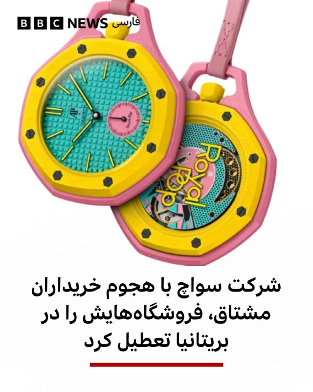

🔻با هجوم مردم برای خرید یک ساعت جدید و تولید محدود، شرکت سواچ ناچار شد فروشگاه‌هایش را در سراسر بریتانیا تعطیل کند.

صدها نفر مشتاق خرید یک ساعت جدید با تولید محدود، بیرون شعب فروشگاه سواچ صف کشیده بودند.

این شرکت سوئیسی اعلام کرد که «به دلیل ملاحظات ایمنی برای مشتریان و کارکنان خود» فروشگاه‌های خود را در لندن باز نخواهد کرد.

شعب این فروشگاه‌ در شهرهای بیرمنگام، کاردیف، گلاسکو، لیورپول، منچستر و شفیلد نیز همچنان بسته خواهند ماند.

این شرکت قرار بود ساعت جیبی جدید «رویال پاپ» خود را با همکاری شرکت اودمر پیگه در هشت مدل با قیمت تقریبی ۴۵۰ دلار عرضه کند.

اودمر پیگه، شرکتی است که به ساخت ساعت و جواهرات قیمتی شهرت دارد.

با بسته شدن فروشگاه‌ها، سواچ در حال حاضر این ساعت را به صورت آنلاین می‌فروشد.

در بازارهای آنلاین دیگر این ساعت تا قیمت بیش از ۲۱ هزار دلار برای فروش گذاشته است.

📷Swatch
https://bbc.in/3PM4VaH

@BBCPersian

## Hranews — post 112994

  

حبیب مهری توسط دادگاه انقلاب تبریز به حبس محکوم شد

❗️
❗️
❗️
❗️
❗️ – حبیب مهری، شهروند ساکن تبریز توسط شعبه اول دادگاه انقلاب این شهرستان به شش ماه #حبس محکوم شده است.

به گزارش خبرگزاری هرانا، ارگان خبری مجموعه فعالان حقوق بشر در ایران، حبیب مهری به حبس محکوم شد.

شعبه اول دادگاه انقلاب تبریز، آقای مهری را از بابت اتهام تبلیغ علیه نظام به شش ماه حبس تعزیری محکوم کرده است.

ادامه مطلب

#حبیب_مهری

↘️
@hranews_bot تماس ✉️ -  @Hranews  کانال هرانا 🆑

## Hranews — post 112993

املاک مهدی نصیری و چند تن دیگر در قم توقیف شد

❗️
❗️
❗️
❗️
❗️ – رئیس کل دادگستری استان قم از #توقیف_املاک مهدی نصیری، شهروند ساکن خارج از کشور و چند تن دیگر خبر داد. وی این افراد را متهم به «همکاری با دشمن» دانسته است.

ادامه مطلب

#مهدی_نصیری

↘️
@hranews_bot تماس ✉️ -  @Hranews  کانال هرانا 🆑

## manototv — post 105559

  <a href="telegram/content/manototv_105559_1779030860.mp4" target="_blank">🎬 Download video</a>

‌
پراگ | چک؛ گردهمایی ایرانیان ـ گزارشگر شنبه ۲۶ اردیبهشت

## manototv — post 105558

  <a href="telegram/content/manototv_105558_1779030861.mp4" target="_blank">🎬 Download video</a>

وزارت دفاع امارات متحده عربی اعلام کرد سه پهپاد از مرزهای غربی وارد این کشور شدند که دو فروند رهگیری شد و پهپاد سوم به یک ژنراتور خارج از محدوده داخلی نیروگاه هسته‌ای براکه در منطقه الظفره برخورد کرد و باعث آتش‌سوزی شد.

وزارت دفاع امارات اعلام کرد تحقیقات برای مشخص شدن منبع این حملات ادامه دارد و نتایج آن بعداً اعلام خواهد شد.

## manototv — post 105557

  <a href="telegram/content/manototv_105557_1779030862.mp4" target="_blank">🎬 Download video</a>

‌
«من صدای فاطمه سپهری هستم» ـ گزارشگر

## manototv — post 105556

  <a href="telegram/content/manototv_105556_1779030863.mp4" target="_blank">🎬 Download video</a>

تجمع ایرانیان ساکن بروکسل، یکشنبه ۲۷ اردیبهشت

## alonews — post 120627

  <a href="telegram/content/alonews_120627_1779030865.mp4" target="_blank">🎬 Download video</a>

👈سناتور گراهام درباره ایران:

بر اساس تحلیل من، هیچ چیزی نشان نمی‌دهد که افرادی که اکنون در قدرت هستند با قبل متفاوت باشند — آنها هنوز هم می‌خواهند جهان را ترور کنند، اسرائیل را نابود کنند و به ما حمله کنند.

پس شما باید آنها را بیشتر تضعیف کنید. کاری که رئیس‌جمهور ترامپ انجام داده از نظر نظامی شگفت‌انگیز بوده است. زیرساخت‌های انرژی نقطه ضعف آنهاست. وقتی به مبارزه برمی‌گردیم، انرژی را در صدر فهرست قرار می‌دهم.

من خواستار آسیب رساندن به این رژیم هستم. بیشتر به آنها آسیب بزنید، شاید آنها معامله‌ای انجام دهند. اما در حال حاضر فکر می‌کنم آنها سعی دارند این وضعیت را تحمل کنند و بازی می‌کنند.

✅ @AloNews خبر جنگ

## alonews — post 120626

  <a href="telegram/content/alonews_120626_1779030866.webm" target="_blank">🎬 Download video</a>

👈خبرنگارای کاخ سفید رو صدا زدن که برن تو محوطه جنوبی کاخ سفید واسه یه "رویداد نامعلوم"

✅ @AloNews خبر جنگ

## alonews — post 120625

  <a href="telegram/content/alonews_120625_1779030867.webm" target="_blank">🎬 Download video</a>

👈بنرهایی که سپاه تو ساحل تنگه هرمز نصب کرده.

✅ @AloNews خبر جنگ

## alonews — post 120624

  <a href="telegram/content/alonews_120624_1779030867.mp4" target="_blank">🎬 Download video</a>

👈جلسه دادگاه ساعدی نیا، مدیر کافه زنجیره ای معروف ساعدی نیا به دلیل حمایت از اعتراضات دی برگزار شد.

ساعدی نیا: من بلاتکلیف بودم تا اینکه استوری گذاشتم و مغازه رو تعطیل کردم، بعدش از ترس استوری رو پاک کردم و موبایلمو خاموش کردم، من هیچکسو به حضور در اعتراضات ترغیب نکردم.
منظور من از فروپاشی، فروپاشی اقتصادی بود و نه خیزش علیه نظام. من هیچکدوم از کارکنانم رو برای حضور در اعتراضات مجبور نکردم، از کاری که کردم پشیمونم و از دادگاه می‌خوام فرصت جبران بهم بده.
قاضی: شما با فراخوانی که دادی کلی جوون رو به اعتراضات کشوندین و ضربه زیادی به این نظام زدی، چطوری میخوای جبران کنی؟

✅ @AloNews خبر جنگ

## alonews — post 120623

  <a href="telegram/content/alonews_120623_1779030867.webm" target="_blank">🎬 Download video</a>

👈رئیس مجلس نمایندگان آمریکا:
عملیات «خشم حماسی» به پایان رسیده است و آمریکا در صدد اجرای پروژه‌ای برای بازگشایی مجدد تنگه هرمز است.

✅ @AloNews خبر جنگ

## alonews — post 120622

  

🏆
🇮🇷شانس قهرمانی ایران در جام‌جهانی چقدر است؟

سایت گل با انتشار پوستری درصد شانس قهرمانی کشورهای حاضر در جام‌جهانی را مشخص کرد.

@AloSport

## alonews — post 120621

  <a href="telegram/content/alonews_120621_1779030868.webm" target="_blank">🎬 Download video</a>

🔴فووووووووووووووووووری

## alonews — post 120620

🔴فووووووووووووووووووری

## alonews — post 120619

  <a href="telegram/content/alonews_120619_1779030868.webm" target="_blank">🎬 Download video</a>

👈سنتکام: تا امروز ۸۱کشتی تجاری را برگرداندیم و ۴کشتی را توقیف کردیم

✅ @AloNews خبر جنگ

## alonews — post 120618

  <a href="telegram/content/alonews_120618_1779030869.webm" target="_blank">🎬 Download video</a>

👈یک هواپیمای ویژه C-40 Clipper نیروی دریایی ایالات متحده که از یونان حرکت کرده بود

🔴دقایقی پیش در پایگاه هوایی شاهزاده سلطان در عربستان سعودی فرود آمده است

🔴هواپیما حامل چندین ژنرال ارشد ارتش آمریکا می‌باشد.

✅ @AloNews خبر جنگ

## alonews — post 120617

  <a href="telegram/content/alonews_120617_1779030869.mp4" target="_blank">🎬 Download video</a>

👈حملات هوایی گسترده اسرائیل به شوکین در جنوب لبنان

✅ @AloNews خبر جنگ

## alonews — post 120616

  <a href="telegram/content/alonews_120616_1779030870.webm" target="_blank">🎬 Download video</a>

👈وزارت دفاع امارات: یکی از پهپادها به یک ژنراتور در خارج از محدوده داخلی نیروگاه هسته ای باراکه در الدفرا برخورد کرد‌‌

🔴تحقیقات برای اطلاع از منبع حملات در حال انجام است و پس از پایان تحقیقات اطلاع رسانی خواهد شد‌‌

✅ @AloNews خبر جنگ

---
📅 بروزرسانی: 1405/02/27 17:32
---

## VahidOOnLine — post 240631

  

♦️شبکه خبری فاکس نیوز، روز یکشنبه ۲۷ اردیبهشت ماه در گزارشی اعلام کرد، دونالد ترامپ، رئیس جمهور آمریکا که به تازگی از سفر چین بازگشته است، در حال بررسی از سرگیری اقدام نظامی علیه ایران است و روز یکشنبه با بنیامین نتانیاهو، نخست وزیر اسرائیل گفتگو خواهد کرد.
نتانیاهو صبح یکشنبه با اعلام آنکه «مانند هر چند روز یکبار» با ترامپ تماس خواهد گرفت، گفت: «مطمئنا بخش‌هایی از سفر او به چین و شاید موارد دیگر را خواهم شنید. احتمالات زیادی وجود دارد و ما برای هر سناریویی آماده‌ایم.»
تماس تلفنی با نتانیاهو در حالی صورت می‌گیرد که فاکس نیوز با استناد به ارزیابی‌های اطلاعاتی منطقه‌ای درباره ایران گزارش داد که ممکن است به دلیل ناامیدی ترامپ از تهران و «رد درخواست او برای دست کشیدن از آرمان‌های تسلیحات هسته‌ای»، حملات نظامی از سر گرفته شود.
دو مقام اطلاعاتی منطقه‌ای به فاکس نیوز گفتند: «ارزیابی غالب در داخل ایران این است که رئیس جمهوری ترامپ ممکن است به شروع مجدد اقدام نظامی متوسل شود و تهران اکنون عمدا راهبرد «فریب و تأخیر» را دنبال می‌کند، با این امید که خرید زمان، هرگونه بازگشت احتمالی به جنگ را پیچیده کند.»
‌🇸🇦 Indypersian

🤖 @VahidOOnLine

## VahidOOnLine — post 240630

  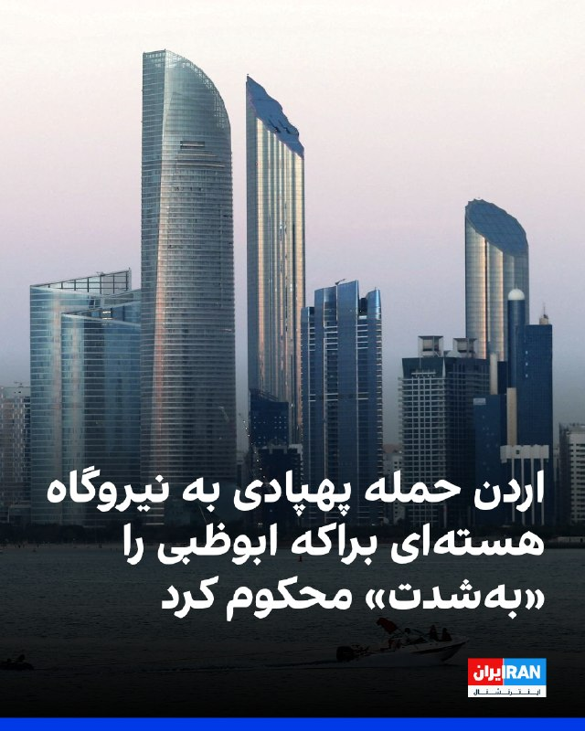

اردن حمله پهپادی به ابوظبی را که به وقوع آتش‌سوزی در خارج از محدوده داخلی نیروگاه هسته‌ای براکه منجر شد، به‌شدت محکوم کرد و آن را نقض آشکار حاکمیت امارات متحده عربی، تهدیدی علیه امنیت و ثبات این کشور و نیز نقض صریح قوانین بین‌المللی و منشور سازمان ملل متحد دانست.

وزارت خارجه اردن در بیانیه‌ای با اعلام همبستگی کامل با امارات متحده عربی تاکید کرد که اَمان در کنار ابوظبی و تمامی اقداماتی که برای حفظ امنیت، حاکمیت و سلامت شهروندان و ساکنان خود انجام دهد، خواهد ایستاد.
‌🏁 🇬🇧 IranintlTV

🤖 @VahidOOnLine

## VahidOOnLine — post 240629

  

♦️مسعود پزشکیان، رئیس‌جمهوری ایران، روز یکشنبه در دیدار با محسن نقوی، وزیر کشور پاکستان، از نقش اسلام‌آباد در تثبیت آتش‌بس قدردانی و ابراز امیدواری کرد تلاش‌های پاکستان به تقویت صلح و ثبات در منطقه کمک کند.
رئیس‌جمهوری ایران در این دیدار تاکید کرد «ایران خواهان روابطی صمیمانه و پایدار با کشورهای اسلامی منطقه است» و افزود اتحاد کشورهای اسلامی می‌تواند زمینه «مداخله قدرت‌های فرامنطقه‌ای» را کاهش دهد.
به گزارش خبرگزاری ایرنا، محسن نقوی، وزیر کشور پاکستان، نیز با اشاره به روابط تهران و اسلام‌آباد گفت ایران و پاکستان اکنون بیش از گذشته به یکدیگر نزدیک شده‌اند و روابط برادرانه دو کشور باید بیش از پیش گسترش یابد.
این دیدار در شرایطی انجام شده که پاکستان در هفته‌های اخیر در روند تلاش‌های دیپلماتیک و میانجی‌گری منطقه‌ای برای کاهش تنش‌ها و تثبیت آتش‌بس نقش فعالی ایفا کرده است.
‌🇸🇦 Indypersian

🤖 @VahidOOnLine

## VahidOOnLine — post 240628

  

اکسیوس گزارش داد که کوبا بیش از ۳۰۰ پهپاد نظامی خریداری کرده و اخیرا نیز گفت‌وگو درباره استفاده از آنها برای حمله به پایگاه آمریکا در خلیج گوانتانامو، شناورهای نظامی آمریکا و احتمالا شهر کی‌وست در ایالت فلوریدا، در حدود ۱۴۵ کیلومتری شمال هاوانا، را آغاز کرده است.

یک مقام ارشد آمریکایی به اکسیوس گفت این اطلاعات که می‌تواند دلیلی برای اقدام نظامی آمریکا شود، نشان می‌دهد دولت ترامپ تا چه اندازه کوبا را، به دلیل تحولات جنگ پهپادی و حضور مستشاران نظامی جمهوری اسلامی در هاوانا، تهدید تلقی می‌کند.

این مقام آمریکایی گفت: «وقتی به این نوع فناوری‌ها که تا این اندازه نزدیک هستند فکر می‌کنیم، و همچنین به طیفی از بازیگران خطرناک از گروه‌های تروریستی گرفته تا کارتل‌های مواد مخدر، مستشاران جمهوری اسلامی و روس‌ها، موضوع نگران‌کننده می‌شود.»
‌🏁 🇬🇧 IranintlTV

🤖 @VahidOOnLine

## VahidOOnLine — post 240627

روایت شما از بحران اقتصادی در آتش‌بس- یکشنبه ۲۷ اردیبهشت‌ماه🗣

🔹واقعا دیگه هیچ امیدی ندارم. سه ماهه به‌خاطر قطعی اینترنت بیکار موندیم. پهنای باند این‌قدر کمه که نه فیلترشکن جواب داده و نه اینترنت‌پرو.

🔹من مدرس آنلاین زبان بودم. الان دو ماه گذشته و حتی یک کلاس هم نتونستم برگزار کنم. از پس‌اندازم فقط دو میلیون تومان مونده و نمی‌تونم کار هم پیدا کنم.

🔹منم مثل خیلی از هم‌وطنان بیکار شدم و برای ادامه زندگی، با قسط و قرض یه کامیون خریدم. اما سوخت کامیون خیلی کمه و ناچارم یک لیتر گازوئیل رو ۵۰ تا ۷۵ هزار تومان بخرم که اصلاً مقرون‌به‌صرفه نیست. از یه طرف از بیکاری دارم دیوونه میشم و از طرف دیگه شرمنده زن و بچه شدم.

🔹اسنپ سوار شدم، کنارم روپوش پزشکی و چند تا کتاب دیدم. راننده جوان گفت که دانشجو هست و اوقات بین کلاس و بیمارستان اسنپ کار می‌کند.

🔹دلم می‌خواد خون گریه کنم. سه ماه هست که بیکارم. پانزده روز دیگه باید خونه ۵۰ متری استیجاری‌ رو تحویل بدم، در حالی که اجاره و ودیعه سر به فلک کشیده و من فقط صد میلیون تومان پول ودیعه بیشتر ندارم.

🔹من و همسرم تریدر هستیم و اول زندگی مشترکمونه. از جنگ ۱۲ روزه تا الان همش از جیب، اجاره و هزینه‌هامون رو دادیم. اما دیگه نمی‌دونیم باید چکار کنیم. امیدوارم این همه سختی و مشکلات نتیجه‌اش برگشت پهلوی باشه.

🔹۱۰ تیکه فیله‌مرغ، ۴ تیکه بوقلمون و یک شانه تخم‌مرغ شد شش میلیون و ۳۰۰ هزار تومان. واقعا باورنکردنیه.

🔹 دانشجو علوم پزشکی تهران هستم. متاسفانه هیچ دسترسی به اینترنت آزاد و بین‌الملل برای دانشجویان در نظر گرفته نشده. مقالات، پروژه‌ها و پایان‌نامه‌های ما به‌خاطر نداشتن دسترسی به چیزی که حق طبیعی هر انسانی است، ناتمام مونده.
‌🏁 🇬🇧 IranintlTV

🤖 @VahidOOnLine

## VahidOOnLine — post 240626

♦️حمیدرضا حاجی‌بابایی، نایب رئیس مجلس شورای اسلامی در برنامه‌ای تلویزیونی کشورهای منطقه را تهدید کرد در صورت وارد شدن آسیب به زیرساخت‌ها یا صادرات نفت ایران، تهران کاری می‌کند که مدت قابل توجهی هیچ کشور دنیا به نفت منطقه دسترسی نداشته باشد.

او گفت: «اگر قرار باشد به نفت ما آسیب برسد، ما کاری می‌کنیم که دیگر آمریکا حداقل تا یک مدت قابل‌توجهی از این منطقه نفتی گیرش نیاید، یعنی دنیا نفتی گیرش نیاید. من یک نکته می‌خواهم بگویم، آمریکا مخصوصا ترامپ، امکان ندارد کاری را که بتواند انجام دهد و به نفع‌شان باشد، انجام ندهد. اگر کسی غیر از این فکر کند، یا ساده‌لوح است یا ممکن است اشکال در نوع فکر کردنش باشد.»
این تهدیدها در حالی مطرح می‌شود که جمهوری اسلامی در ماه‌های اخیر بارها تاسیسات نفتی در کشورهای منطقه را هدف حملات موشکی و پهپادی قرار داده است.
‌🇸🇦 Indypersian

🤖 @VahidOOnLine

## VahidOOnLine — post 240625

  <a href="telegram/content/VahidOOnLine_240625_1779026563.mp4" target="_blank">🎬 Download video</a>

راهپیمایی ایرانیان ساکن گوتنبرگ سوئد، یکشنبه ۲۷ اردیبهشت
‌🏁 🇬🇧 ManotoTV

🤖 @VahidOOnLine

## VahidOOnLine — post 240624

♦️تیم فوتبال زنان نائگوهیانگ اف‌سی کره شمالی روز یکشنبه برای حضور در مرحله نیمه‌نهایی لیگ قهرمانان زنان آسیا وارد کره جنوبی شد، سفری که نخستین حضور ورزشکاران کره شمالی در کره جنوبی طی هشت سال گذشته محسوب می‌شود.
هیات اعزامی این تیم شامل ۲۷ بازیکن و ۱۲ عضو کادر فنی است و پیش از دیدار روز چهارشنبه برابر تیم زنان سوون اف‌سی وارد کره جنوبی شده است. وزارت اتحاد کره جنوبی اعلام کرد این سفر بر اساس قوانین تبادل میان دو کره مجوز گرفته است و در صورت حذف تیم کره شمالی اعضای آن در اولین فرصت به کشورشان بازخواهند گشت.
به گزارش خبرگزاری یونهاپ کره جنوبی، استقبال عمومی از این مسابقه چشمگیر بوده و تمامی ۷ هزار و ۸۷ بلیت عرضه‌شده برای عموم در کمتر از یک روز به فروش رسیده است.
این سفر در حالی انجام می‌شود که روابط دو کره طی سال‌های اخیر با تنش‌های فزاینده همراه بوده است. پیونگ‌یانگ اخیرا کره جنوبی را «خصمانه‌ترین کشور» توصیف کرده و ایده اتحاد دو کره را رد کرده است. در مقابل، لی جائه‌میونگ، رئیس‌جمهوری کره جنوبی، خواهان بهبود روابط شده است.
‌🇸🇦 Indypersian

🤖 @VahidOOnLine

## VahidOOnLine — post 240623

  

♦️بنیامین نتانیاهو، نخست‌وزیر اسرائیل، روز یکشنبه در نشست هفتگی کابینه این کشور گفت شش سال پیش درباره تهدید پهپادها هشدار داده بود، اما اکنون با پیشرفت این فناوری و افزایش تهدیدها، اسرائیل در حال اجرای اقدامات تازه‌ای برای مقابله با آن است.

نتانیاهو گفت: «شش سال پیش در جلسه کابینه درباره تهدید پهپادها هشدار دادم.» او افزود در آن زمان این تهدید را بیشتر ابزاری برای ترور افراد می‌دانست، اما به گفته او تحولات سال‌های اخیر، به‌ویژه جنگ اوکراین، نشان داد پهپادها می‌توانند به عاملی تعیین‌کننده در میدان‌های نبرد تبدیل شوند.
نخست‌وزیر اسرائیل همچنین با اشاره به عملکرد نهادهای امنیتی این کشور گفت ارتش و وزارت دفاع طی سال‌های گذشته «صدها و شاید هزاران» تلاش برای حمله به نیروهای اسرائیلی با پهپادها و هواپیماهای بدون سرنشین را خنثی کرده‌اند.

او تاکید کرد: «آنها موفق شده‌اند و هر بار که تهدید جدیدی ایجاد می‌شود، آن را خنثی می‌کنند.»

نتانیاهو در ادامه از تشکیل یک تیم ویژه برای مقابله با تهدید پهپادهای فیبر نوری حزب‌الله خبر داد و گفت این گروه طی دو هفته گذشته سه نشست برگزار کرده است.
‌🇸🇦 Indypersian

🤖 @VahidOOnLine

## VahidOOnLine — post 240622

ولی‌الله بیاتی، عضو کمیسیون امور داخلی مجلس، به ایسنا گفت: «مذاکرات باید ادامه پیدا کند، اما در عین حال دست ما روی ماشه است و آمادگی کامل برای ادامه نبرد وجود دارد.»
بیاتی گفت: «وضعیت «نه صلح نه جنگ» خیلی از کارها را در کشور معطل نگه می دارد. این وضعیت آسیب زیادی وارد می‌کند.»
‌🏁 🇬🇧 IranintlTV

🤖 @VahidOOnLine

## VahidOOnLine — post 240621

  

♦️سفارت پاکستان در تهران اعلام کرد محسن نقوی، وزیر کشور پاکستان که روز گذشته وارد تهران شده بود، نزدیک به سه ساعت در نهاد ریاست‌جمهوری حضور داشته و با مسعود پزشکیان دیداری خصوصی برگزار کرده است.
به گقته سفارت پاکستان، این دیدار حدود ۹۰ دقیقه طول کشیده و اسکندر مومنی، وزیر کشور جمهوری اسلامی ایران و عباس عراقچی، وزیر امور خارجه نیز در این جلسه حضور داشتند.
محسن نقوی روز شنبه در سفری اعلام‌نشده وارد تهران شده بود و منابع خبری از احتمال گفتگوهای او با مقام‌های ایرانی درباره تحولات منطقه و مسائل دوجانبه خبر داده بودند.
‌🇸🇦 Indypersian

🤖 @VahidOOnLine

## VahidOOnLine — post 240620

  

♦️آژانس بین‌المللی انرژی اتمی (IAEA) روز یکشنبه ۲۷ اردیبهشت ماه، نسبت به حمله پهپادی در نزدیکی نیروگاه هسته‌ای براکه امارات متحده عربی که به وقوع آتش‌سوزی منجر شد، «نگرانی شدید» خود را ابراز کرد، اما اعلام کرد سطح تشعشعات در این منطقه همچنان در وضعیت عادی قرار دارد.
آژانس در پیامی در شبکه اجتماعی اکس اعلام کرد رافائل گروسی، مدیرکل این نهاد، درباره این حادثه ابراز نگرانی کرده و گفته است: «فعالیت‌های نظامی که ایمنی هسته‌ای را تهدید می‌کند، غیرقابل قبول است.»
آژانس بین‌المللی انرژی اتمی همچنین اعلام کرد مقام‌های امارات این نهاد را در جریان گذاشته‌اند که سطح تشعشعات در نیروگاه هسته‌ای براکه طبیعی است و هیچ موردی از مصدومیت گزارش نشده است.
دفتر رسانه‌ای ابوظبی روز یکشنبه اعلام کرد از آتش‌سوزی ناشی از حمله پهپادی به یک ژنراتور برق در خارج از محیط داخلی نیروگاه هسته‌ای براکه در منطقه الظفره خبر داد.
‌🇸🇦 Indypersian

🤖 @VahidOOnLine

## VahidOOnLine — post 240619

  

♦️اسماعیل بقایی، سخنگوی وزارت امور خارجه جمهوری اسلامی ایران، روز یکشنبه در پیامی در شبکه اجتماعی اکس، آمریکا و اسرائیل را متهم کرد که برای توجیه «جنگ انتخابی» و غیرقانونی، روایت «حفظ صلح و ثبات در بازارهای جهانی انرژی» را مطرح می‌کنند.

بقایی نوشت «سیاست‌های جنگ‌طلبانه و بی‌ملاحظه آمریکا و اسرائیل» روندهای دیپلماتیک را از بین برده است. بقایی آمریکا و اسرائیل را به تحمیل ناامنی در به مسیرهای حیاتی انرژی متهم کرد و مدعی شد واشنگتن و تل‌آویو ایران را به بی‌ثبات‌سازی متهم می‌کنند.

سخنگوی وزارت امور خارجه جمهوری اسلامی ایران این رویکرد را «الگوی همیشگی» آمریکا و اسرائیل توصیف کرد و نوشت: «آن‌ها بحران و جنگ ایجاد می‌کنند و سپس با شعار بازگرداندن ثبات و دفاع از صلح، مسیر تشدید تنش را در پیش می‌گیرند.»

او در پایان با نقل‌قولی تاریخی از کتاب آگریکولا اثر تاسیتوس (مورخ مشهور رومی) نوشت: «آن‌ها ویرانی می‌آفرینند و نامش را صلح می‌گذارند.»
‌🇸🇦 Indypersian

🤖 @VahidOOnLine

## VahidOOnLine — post 240618

  

♦️علیرضا یوسفی، ملی‌پوش دسته ۱۱۰+ کیلوگرم وزنه‌برداری ایران، در مسابقات قهرمانی آسیا در هند با ثبت عملکردی درخشان موفق شد رکورد دوضرب جهان را بشکند و سه مدال ارزشمند برای ایران به دست آورد.
یوسفی روز یکشنبه در شهر گاندی‌نگر هند، در رقابت با وزنه‌برداران مطرحی از کره‌جنوبی، بحرین، چین‌تایپه، ازبکستان و امارات روی تخته رفت و در پایان با کسب مدال طلای دوضرب، نقره مجموع و برنز یک‌ضرب، یکی از بهترین نتایج کاروان ایران را ثبت کرد.
این وزنه‌بردار ایرانی در حرکت سوم دوضرب موفق شد وزنه ۲۶۱ کیلوگرمی را مهار کند و ضمن کسب مدال طلا، رکورد جدید جهان را در این حرکت به نام خود ثبت کند. او پیش‌تر در حرکت دوم برای مهار همین وزنه ناموفق بود اما در سومین تلاش خود توانست این رکورد تاریخی را به ثبت برساند.
یوسفی در بخش یک‌ضرب ابتدا وزنه ۱۷۷ کیلوگرمی و سپس ۱۸۴ کیلوگرمی را با موفقیت بالای سر برد، اما در مهار وزنه ۱۸۹ کیلوگرمی ناکام ماند و به مدال برنز رسید.
او در دوضرب نیز ابتدا وزنه ۲۴۸ کیلوگرمی را مهار کرد و سپس در سومین حرکت، وزنه ۲۶۱ کیلوگرمی را بالای سر برد تا رکورد جهان را جابه‌جا کند.
‌🇸🇦 Indypersian

🤖 @VahidOOnLine

## VahidOOnLine — post 240617

  

♦️خبرگزاری فارس با انتشار متنی مدعی شد جزئیاتی از پاسخ آمریکا به پیشنهادهای ایران در جریان مذاکرات به دست آورده است؛ گزارشی که در آن از پنج شرط اصلی واشنگتن برای توافق با تهران سخن گفته شده است.
براساس شنیده‌های فارس، شروط اعلام‌شده از سوی آمریکا شامل موارد زیر است:
«عدم پرداخت هرگونه غرامت و خسارت از سوی آمریکا»، «خروج و تحویل ۴۰۰ کیلوگرم اورانیوم از ایران به آمریکا»، «فعال ماندن تنها یک مجموعه از تاسیسات هسته‌ای ایران»، «عدم پرداخت حتی ۲۵ درصد از دارایی‌های بلوکه‌شده ایران» و «منوط‌شدن توقف جنگ در همه ساحتها به انجام مذاکره».
این گزارش تاکید می‌کند که حتی در صورت تحقق این شروط از سوی ایران، تهدید «تجاوز» آمریکا و اسرائیل همچنان پابرجا خواهد بود.
به گفته فارس، در مقابل، ایران انجام هرگونه مذاکره را منوط به تحقق پنج پیش‌شرط اعتمادساز دانسته است: «پایان جنگ در همه جبهه‌ها به‌ویژه لبنان»، «رفع تحریم‌های ضدایرانی»، «آزادسازی پول‌های بلوکه‌شده ایران»، «جبران خسارات ناشی از جنگ» و «پذیرش حق حاکمیت ایران بر تنگه هرمز».
‌🇸🇦 Indypersian

🤖 @VahidOOnLine

## WithYashar — post 11478

شاهزاده رضا پهلوی : جمهوری اسلامی را نمی‌توان تغییر داد همانگونه که یک گرگ را نمیتوان تبدیل به میش کرد
@withyashar

## WithYashar — post 11477

  <a href="telegram/content/WithYashar_11477_1779026570.mp4" target="_blank">🎬 Download video</a>

صداوسیما: با اعلام مدیر کل آموزش و پرورش تهران؛ دانش آموزان پایه های هفتم تا دهم دیگه امتحان خرداد ندارن و با توجه به عملکرد علمی یکساله سنجیده میشن.
@withyashar

## WithYashar — post 11476

نیویورک‌تایمز: آمریکا به عراق دستور داده بود که طی دو عملیات داخل ایران، سیستم‌های راداری خود را خاموش کند و عراق این کار را انجام داد
@withyashar

## mwarmonitor — post 9201

کوبا از نظر ایالات متحده به عنوان «دولت حامی تروریسم» طبقه‌بندی می‌شود و به عنوان «سر مار» برای صادرات مارکسیسم انقلابی در سراسر آمریکای لاتین در نظر گرفته می‌شود.
یکی از متحدان سابق کوبا، یعنی نیکلاس مادورو در ونزوئلا، در جریان حمله ۳ ژانویه توسط ایالات متحده از قدرت برکنار شد. از زمان برکناری مادورو، ایالات متحده روند عادی‌سازی روابط با ونزوئلا را آغاز کرده و اطلاعات بیشتری درباره برنامه پهپادی کوبا به دست آورده است.
واقعیت‌سنجی (ارزیابی واقعیت)
با این حال، مقامات آمریکایی بر این باور نیستند که کوبا یک تهدید قریب‌الوقوع است یا به طور فعال برای حمله به منافع آمریکا برنامه‌ریزی می‌کند. اما اطلاعات ایالات متحده نشان می‌دهد که مقامات نظامی این جزیره در حال بحث درباره برنامه‌های جنگ پهپادی بوده‌اند تا در صورت بروز درگیری هم‌زمان با وخیم‌تر شدن روابط با آمریکا، از آن‌ها استفاده کنند.
کوبا توانایی بستن تنگه فلوریدا را به همان شیوه‌ای که ایران کشتیرانی در تنگه هرمز را به بن‌بست کشانده است، ندارد. مقامات آمریکایی همچنین معتقدند کوبا به اندازه بحران موشکی کوبا در سال ۱۹۶۲ یک تهدید نظامی بزرگ به شمار نمی‌رود.
این مقام ارشد آمریکایی در پایان گفت:
«هیچ‌کس نگران جت‌های جنگنده کوبا نیست؛ حتی مشخص نیست که آن‌ها یک جنگنده آماده به پرواز داشته باشند. اما شایان ذکر است که آن‌ها چقدر نزدیک هستند — فقط ۹۰ مایل. این واقعیتی نیست که ما با آن راحت باشیم.»

🔸یادداشت سردبیر: این گزارش اصلاح شده است تا مشخص شود کوبا در سال ۱۹۹۶ دو هواپیما (و نه یک هواپیما) را سرنگون کرده است.

@mwarmonitor

## mwarmonitor — post 9200

🔴اختصاصی اکسیوس: آمریکا تهدید پهپادهای تهاجمی کوبا را زیر نظر دارد

📝نویسنده: مارک کاپوتو

🔰بر اساس اطلاعات طبقه‌بندی‌شده‌ای که با اکسیوس به اشتراک گذاشته شده است، کوبا بیش از ۳۰۰ پهپاد نظامی خریداری کرده و اخیراً گفتگوهایی را درباره برنامه‌ریزی برای استفاده از آن‌ها جهت حمله به پایگاه آمریکا در خلیج گوانتانامو، کشتی‌های نظامی ایالات متحده و احتمالاً «کی‌ وست» در ایالت فلوریدا (در فاصله ۹۰ مایلی شمال هاوانا) آغاز کرده است.

چرا این موضوع اهمیت دارد؟
یک مقام ارشد آمریکایی اعلام کرد این اطلاعات مأموریتی — که می‌تواند به بهانه‌ای برای اقدام نظامی ایالات متحده تبدیل شود — نشان می‌دهد که دولت ترامپ تا چه حد کوبا را به دلیل پیشرفت‌ها در جنگ پهپادی و حضور مستشاران نظامی ایران در هاوانا، یک تهدید تلقی می‌کند.
این مقام مسئول گفت:
«وقتی به وجود این نوع فناوری‌ها در چنین فاصله نزدیکی فکر می‌کنیم، و حضور طیفی از بازیگران بد از گروه‌های تروریستی گرفته تا کارتل‌های مواد مخدر، ایرانی‌ها و روس‌ها را در نظر می‌گیریم، نگران‌کننده است. این یک تهدید در حال رشد است.»
محور اخبار
به گفته یک مقام سیا به اکسیوس، جان راتکلیف، رئیس سازمان اطلاعات مرکزی آمریکا (CIA)، روز پنجشنبه به کوبا سفر کرد و به طور صریح به مقامات این کشور درباره هرگونه اقدام خصمانه هشدار داد. او همچنین از آن‌ها خواست تا به حکومت توتالیتر خود پایان دهند تا تحریم‌های فلج‌کننده آمریکا برچیده شود.
این مقام سیا گفت: «مدیر راتکلیف به وضوح روشن کرد که کوبا دیگر نمی‌تواند به عنوان سکویی برای دشمنان جهت پیشبرد برنامه‌های خصمانه در نیم‌کره ما عمل کند. نیم‌کره غربی نمی‌تواند حیاط خلوت و زمین بازی دشمنان ما باشد.»
علاوه بر این، وزارت دادگستری آمریکا قصد دارد روز چهارشنبه کیفرخواستی را علیه رهبر دوفاکتو (عملی) کوبا، رائول کاسترو، علنی کند. او متهم است که در سال ۱۹۹۶ دستور سرنگونی دو هواپیمای متعلق به یک گروه امدادی مستقر در میامی به نام «برادران برای نجات» (Brothers to the Rescue) را صادر کرده است.
انتظار می‌رود تحریم‌های بیشتری علیه این کشور جزیره‌ای در هفته جاری اعلام شود. سخنگوی کوبا روز شنبه برای اظهار نظر در این باره در دسترس نبود.
نگاه نزدیک‌تر (بررسی جزئیات)
به گفته مقامات آمریکایی، کوبا از سال ۲۰۲۳ در حال تهیه پهپادهای تهاجمی با «قابلیت‌های متنوع» از روسیه و ایران بوده و آن‌ها را در مکان‌های استراتژیک در سراسر این جزیره پنهان کرده است.
این مقام ارشد آمریکایی با استناد به شنودهای اطلاعاتی افزود که مقامات کوبا ظرف یک ماه گذشته به دنبال دریافت پهپادها و تجهیزات نظامی بیشتری از روسیه بوده‌اند. این اطلاعات همچنین نشان می‌دهد که مقامات اطلاعاتی کوبا در تلاش هستند تا یاد بگیرند «ایران چگونه در برابر ما مقاومت کرده است.»
روسیه و چین دارای تأسیسات جاسوسی پیشرفته برای جمع‌آوری «اطلاعات سیگنالی» (شنود الکترونیک یا SIGINT) در کوبا هستند.
پیت هگست، وزیر دفاع آمریکا، روز سه‌شنبه در جریان یک جلسه استماع در کنگره به ماریو دیاز-بالارت، نماینده جمهوری‌خواه میامی گفت: «ما مدت‌هاست نگران این بوده‌ایم که استفاده یک دشمن خارجی از موقعیتی در این فاصله نزدیک به سواحل ما، بسیار چالش‌برانگیز و مشکل‌ساز است.»
هگست در پاسخ به دیاز-بالارت، نقش و همدستی کاسترو در صدور دستور سرنگونی هواپیماهای گروه «برادران برای نجات» را تأیید کرد.
تصویر کلی
نگرانی‌ها درباره حملات پهپادی به نیروهای آمریکایی به دلیل استفاده ایران از هواپیماهای بدون سرنشین در پاسخ به حملات آمریکا (که از ۲۸ فوریه آغاز شد) شدت یافته است.
پهپادهای ایران به پایگاه‌های آمریکایی در خاورمیانه آسیب رسانده، به بستن تنگه هرمز کمک کرده و در کنار حملات موشکی، کشورهای همسایه در خلیج فارس را تهدید کرده‌اند.
مقامات آمریکایی تخمین می‌زنند که تا ۵,۰۰۰ سرباز کوبایی برای روسیه در تهاجم به اوکراین جنگیده‌اند و برخی از آن‌ها رهبران نظامی این جزیره را از میزان اثربخشی جنگ پهپادی مطلع کرده‌اند. به برآورد مقامات آمریکایی، روسیه به ازای هر سرباز اعزام‌شده به اوکراین، حدود ۲۵,۰۰۰ دلار به دولت کوبا پرداخت کرده است.
این مقام ارشد گفت: «آن‌ها بخشی از چرخ‌گوشت پوتین هستند. آن‌ها در حال یادگیری تاکتیک‌های ایرانی هستند. این چیزی است که ما باید برای آن برنامه‌ریزی کنیم.»
نگاه کلان
رژیم کاسترو به دلیل تحریم‌های ایالات متحده و سوءمدیریت مالی رژیم مارکسیستی، اکنون بیش از هر زمان دیگری پس از به قدرت رسیدن در انقلاب ۱۹۵۹ (که آن را وارد درگیری با آمریکا کرد)، به سقوط نزدیک شده است.

## FoxNewsTwitter — post 341833

Fox News (Twitter/X)

END OF AN ERA: Ronda Rousey's rousing return to UFC ended quickly, after the legendary fighter took down opponent Gina Carano in just 17 seconds in front of a packed, stunned crowd — wrapping up her historic MMA career.

Rousey claims she's done fighting for good and is embracing being a mom to her two kids, and that she's ready to expand her family again.

## FoxNewsTwitter — post 341832

  <a href="telegram/content/FoxNewsTwitter_341832_1779026572.mp4" target="_blank">🎬 Download video</a>

Fox News (Twitter/X)

Democrats vow to fight back over the Supreme Court's rulings on redistricting, as thousands took to the streets to march in Alabama.

"We have seen this before, where some people in black robes try to deny or take away our rights," Sen. Cory Booker said.

## pm_afshaa — post 90902

  <a href="telegram/content/pm_afshaa_90902_1779026575.webm" target="_blank">🎬 Download video</a>

🗣تجربه‌ای متفاوت از اینترنت پرسرعت 
🔺 سرعت بالا و پایدار 
🔺 مناسب برای استفاده روزمره و حرفه‌ای 
🔺 پشتیبانی سریع و همیشگی 
🔺 ساب‌لینک برای مدیریت مصرف 
⏱ اعتبار یک‌ماهه 
🧑‍💻 کاربر نامحدود 
🚀 با زرین بدون محدودیت وصل باش 
🤖 بات هوشمند 
💎 رضایت مشتری 
👤 پشتیبانی 
📣…

## pm_afshaa — post 90901

  <a href="telegram/content/pm_afshaa_90901_1779026576.webm" target="_blank">🎬 Download video</a>

🗣تجربه‌ای متفاوت از اینترنت پرسرعت

🔺 سرعت بالا و پایدار

🔺 مناسب برای استفاده روزمره و حرفه‌ای

🔺 پشتیبانی سریع و همیشگی

🔺 ساب‌لینک برای مدیریت مصرف

⏱ اعتبار یک‌ماهه 
🧑‍💻 کاربر نامحدود

🚀 با زرین بدون محدودیت وصل باش

🤖 بات هوشمند

💎 رضایت مشتری

👤 پشتیبانی

📣 کانال

🫥 زرین وی پی ان
🎤Zarin VPN

## pm_afshaa — post 90900

  <a href="telegram/content/pm_afshaa_90900_1779026576.webm" target="_blank">🎬 Download video</a>

🔴اکسیوس: کوبا از سال 2023 پیش از 300 پهپاد نظامی به دست آورده که خیلیشون از روسیه و ایران هستن. الانم دارن بحث میکنن که شاید بخوان از اینا علیه پایگاه دریایی آمریکا در خلیج گوانتانامو و کشتی‌های نظامی آمریکا استفاده کنن.

💧 Rainbet.com the #1 Non-KYC Crypto Casino & Sportsbook @rainbetcom

😁 @Pm_Afshaa

## pm_afshaa — post 90899

  <a href="telegram/content/pm_afshaa_90899_1779026577.webm" target="_blank">🎬 Download video</a>

🔴حاجی‌بابایی، نایب‌رییس مجلس:
اگه تاسیسات نفت ما رو بزنن، نفت دوست و دشمن در منطقه رو میزنیم.

💧 Rainbet.com the #1 Non-KYC Crypto Casino & Sportsbook @rainbetcom

😁 @Pm_Afshaa

## iaghapour — post 2617

از هر 10 نفری که که تو اینستاگرام وصل هستن 8 تاش دختره, 2 تاش هم پسر کانفیگ فروش 🥸

## DEJradio — post 4680

  <a href="telegram/content/DEJradio_4680_1779026578.webm" target="_blank">🎬 Download video</a>

🔸
🔺 ناو هواپیمابر یواس‌اس جرالد فورد که پیش از آغاز جنگ با ایران به خاورمیانه اعزام شده بود، پس از ۳۲۶ روز ماموریت، روز شنبه به ایالات متحده بازگشته است. این طولانی‌ترین ماموریت یک گروه رزمی ناو هواپیمابر آمریکا از زمان جنگ ویتنام تاکنون بوده است.
پیت هگست، وزیر دفاع آمریکا در نورفک در ایالت ویرجینیا برای استقبال از بزرگ‌ترین ناو هواپیمابر جهان حضور داشت.
به گفته ارتش آمریکا، این ناو در جریان ماموریت خود در عملیات‌های آمریکا در منطقه کارائیب مشارکت داشت؛ جایی که نیروهای آمریکایی به قایق‌های مظنون به قاچاق مواد مخدر حمله و نفتکش‌های تحریم‌شده را توقیف کردند، همچنین نیکلاس مادورو، رهبر ونزوئلا، را بازداشت کردند.

#آمریکا
@DEJradio

## DEJradio — post 4679

  

🧨
🔥 مقام‌های ابوظبی می‌گویند آتش‌سوزی ناشی از حمله یک پهپاد به یک ژنراتور برق در بیرون محدوده نیروگاه هسته‌ای براکه کنترل شده و به این نیروگاه آسیبی وارد نشده است.
یروگاه هسته‌ای براکه در منطقه ظفره امارات اولین نیروگاه هسته‌ای در جهان عرب است و از چهار رآکتور تشکیل شده است.
سازمان فدرال مقررات هسته‌ای امارات نیز اعلام کرد این آتش‌سوزی تأثیری بر ایمنی نیروگاه، سطح ایمنی پرتویی یا آمادگی سامانه‌های اصلی نیروگاه نداشته و همه واحدها به‌طور عادی به فعالیت خود ادامه می‌دهند.

این حادثه در حالی گزارش می‌شود که تنش‌های منطقه‌ای و حملات پهپادی در خلیج فارس نگرانی‌ها درباره امنیت زیرساخت‌های انرژی و تأسیسات حساس را افزایش داده است.

#انفجار #ابوظبی
@DEJradio

## DEJradio — post 4678

  <a href="telegram/content/DEJradio_4678_1779026580.mp4" target="_blank">🎬 Download video</a>

🚨
🚨 یک دستگاه اتوبوس مسافری یکشنبه ۲۷ اردیبهشت ۱۴۰۵ در محور عسلویه به کنگان واژگون شد. در این حادثه دستکم لحظه ۷ نفر جان خود را از دست داده‌اند و ۱۷ نفر نیز به بیمارستان منتقل شده‌اند. حال یکی از مصدومان وخیم اعلام شده است.

#تصادف #عسلویه
@DEJradio

## DEJradio — post 4677

  

🔸
⭕️ برابر اخبار رسیده، مأموران جمهوری اسلامی در زندان‌ها بر سر لوازم شخصی بازداشت‌شدگان، زندانیان سیاسی و اعدامی‌های انقلاب ملی شیر و خورشید رقابت و در مواردی بر سر تصاحب آنها با هم جر و بحث می‌کنند.
منابع داخلی می‌گویند، اگر فرد بازداشتی از وضعیت مالی مناسبی برخوردار باشد و زندگی او روبراه باشد یا وسایل شخصی‌ ارزشمندی داشته باشد، برای تصاحب پرونده او میان مأموران رقابت و تلاش بیشتری صورت می‌گیرد.
منابع خبری به دژ می‌گویند وسایل زندانیان محکوم به اعدام بیش از دیگران مورد تصاحب قرار می‌گیرد؛ به‌گونه‌ای که برخی مأموران حتی پیش از اجرای حکم قتل حکومتی، در مقابل خود زندانی و پس از اجرای حکم نیز در برابر خانواده او، از این وسایل استفاده می‌کنند.
این منبع می‌گوید مأموران پرونده و زندانبان‌ها هر دو در این اقدامات غیرانسانی نقش دارند. در واقع اگر وسایل شخصی افراد بازداشتی توسط مأمور پرونده یا سازمان بازداشت‌کننده استفاده نشود، معمولاً مأموران زندان از آن‌ها استفاده می‌کنند.

*تصویر با استفاده هوش‌مصنوعی براساس مشاهدات بازسازی شده است.

#سرکوب #اعدام #جلاد
@DEJradio

## DEJradio — post 4676

  <a href="telegram/content/DEJradio_4676_1779026583.webm" target="_blank">🎬 Download video</a>

📷
🔺 بنر سـ.ـپاه در ساحل هرمز؛ ورود سربازان آمریکایی و سگ ممنوع
توهین‌های ناشی از استیصال بدون انکه در نظر بگیرند هنوز حتی جسد علی خامنه‌ای را تشییع نکردند.

#تنگه_هرمز #سپاه_تروریستی_پاسداران
@DEJradio

## VahidOnline — post 75514

محسن نقوی، وزیر کشور پاکستان، عصر امروز با محمدباقر قالیباف، رئیس مجلس ایران در تهران دیدار و گفت‌وگو کرد.

رسانه‌های ایرانی و پاکستانی گزارش داده‌‌اند که آقای نقوی برای از سرگیری مذاکرات به ایران سفر کرده است.

گفته شده او حامل پیام‌ آمریکاست و پاسخ ایران را هم دریافت خواهد کرد.

به گفته سفارت پاکستان در تهران، آقای نقوی دیروز پس از ورود به تهران «نزدیک به سه ساعت در نهاد ریاست جمهوری حضور داشت» و اسکندر مومنی، وزیر کشور، و عباس عراقچی، وزیر امور خارجه نیز «در جریان این دیدار در نهاد ریاست جمهوری حضور داشتند.»
علاوه بر این، محسن نقوی «دیداری خصوصی» با مسعود پزشکیان داشت که «حدود ۹۰ دقیقه به طول انجامید و با حضور وزیر کشور ایران همراه بود.»
@VahidHeadline

📡 @VahidOnline

## VahidOnline — post 75513

  

خبرگزاری فارس با انتشار متنی مدعی شد جزئیاتی از پاسخ آمریکا به پیشنهادهای ایران در جریان مذاکرات به دست آورده است؛ گزارشی که در آن از پنج شرط اصلی واشنگتن برای توافق با تهران سخن گفته شده است.

براساس شنیده‌های فارس، شروط اعلام‌شده از سوی آمریکا شامل موارد زیر است:

۱- عدم پرداخت هرگونه غرامت و خسارت از سوی آمریکا
۲- خروج و تحویل ۴۰۰ کیلوگرم اورانیوم از ایران به آمریکا
۳- فعال ماندن تنها یک مجموعه از تاسیسات هسته‌ای ایران
۴- عدم پرداخت حتی ۲۵ درصد از دارایی‌های بلوکه‌شده ایران
۵- منوط‌شدن توقف جنگ در همه ساحتها به انجام مذاکره

به گفته فارس، در مقابل، ایران انجام هرگونه مذاکره را منوط به تحقق پنج پیش‌شرط اعتمادساز دانسته است: «پایان جنگ در همه جبهه‌ها به‌ویژه لبنان»، «رفع تحریم‌های ضدایرانی»، «آزادسازی پول‌های بلوکه‌شده ایران»، «جبران خسارات ناشی از جنگ» و «پذیرش حق حاکمیت ایران بر تنگه هرمز».
@VahidOOnLine

📡 @VahidOnline

## VahidOnline — post 75512

  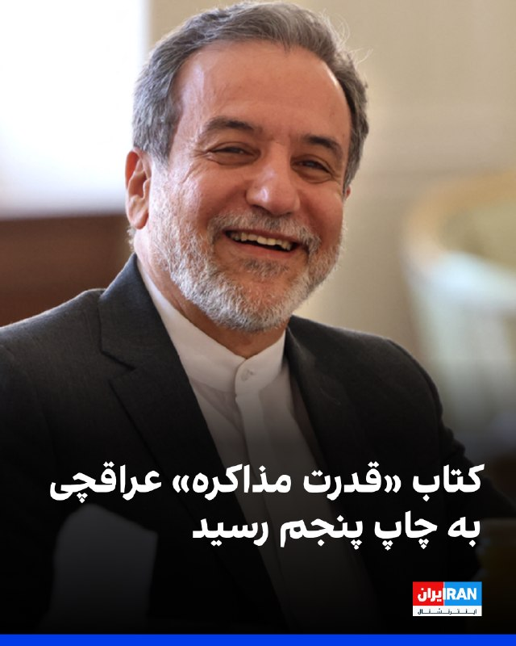

عباس عراقچی، وزیر امور خارجه جمهوری اسلامی، در کانال تلگرامی خود اعلام کرد که کتاب «قدرت مذاکره» او به چاپ پنجم رسیده و در چاپ جدید این کتاب، بخش جدیدی با عنوان «دیپلماسی زیر آتش» درباره روند «مذاکرات غیرمستقیم با آمریکا در جنگ ۱۲ روزه» به آن افزوده شده است.
@VahidOOnLine

📡 @VahidOnline

## VahidOnline — post 75511

  

اداره رسانه‌ای ابوظبی روز یک‌شنبه ۲۷ اردیبهشت در شبکه‌های اجتماعی از وقوع آتش‌سوزی در نیروگاه اتمی براکه در امارات متحده عربی خبر داد.

این آتش‌سوزی پس از حمله پهپادی به نیروگاه اتمی برکه در منطقه الظَفرَه آغاز شده، اما کشته و مجروح بر جا نگذاشته است.

بر اساس توضیح اداره رسانه‌ای ابوظبی، این حریق در ژنراتور برق خارج از محدوده پیرامون نیروگاه به راه افتاده و بر ایمنی سایت اثر منفی نداشته است.

در پی آغاز حمله مشترک آمریکا و اسرائیل به خاک ایران، امارات متحده عربی به بزرگ‌ترین هدف حملات تلافی‌جویانه سپاه پاسداران تبدیل شد.
@VahidHeadline

📡 @VahidOnline

## VahidOnline — post 75510

  

خبرگزاری فارس، نزدیک به سپاه پاسداران، روز یک‌شنبه ۲۷ اردیبهشت نوشت که محمدباقر قالیباف، رئیس مجلس شورای اسلامی و عضو سابق سپاه، به عنوان نماینده ویژه ایران در امور چین تعیین شده است.

این خبرگزاری امنیتی بدون هیچ توضیح دیگری تنها نوشته است:‌ «پیشتر علی لاریجانی و عبدالرضا رحمانی‌ فضلی چنین مسئولیتی را برعهده داشتند.»

🔸در این خبر نه توضیح داده شده که چه کسی یا چه نهادی قالیباف را به این سمت منصوب کرده است و نه برهه کنونی چه اهمیتی دارد که حکومت تصور کرده است به این نماینده ویژه نیاز دارد.

اعلام تعیین قالیباف به عنوان نماینده ویژه در امور چین دو روز پس از دیدار رسمی رئیس جمهور آمریکا از کشور چین رخ می‌دهد که در آن یکی از موضوعات گفت‌وگو ایران و تنگه هرمز بود.
کاخ سفید روز پنجشنبه ۲۴ اردیبهشت اعلام کرد دونالد ترامپ، رئیس‌جمهور آمریکا، و شی جین‌پینگ، رئیس‌جمهور چین، در دیدار خود درباره گسترش همکاری‌های اقتصادی، باز ماندن تنگه هرمز و جلوگیری از دستیابی ایران به سلاح هسته‌ای گفت‌وگو و توافق کردند.
@VahidHeadline

📡 @VahidOnline

## VahidOnline — post 75509

  

جلسه دادگاه صادق ساعدی‌نیا، مدیر کافه‌های زنجیره‌ای ساعدی‌نیا که در اعتراضات سراسری دی ماه گذشته به همراه پدرش، محمدعلی ساعدی‌نیا، بازداشت شده بود در دادگاه انقلاب قم برگزار شد.

کافه‌های ساعدی‌نیا از جمله کسب‌وکارهایی بود که در اعتراضات دی ماه پارسال که با اعتراض بازار به نابسامانی اقتصادی آغاز شد، مغازه‌هایشان را تعطیل کردند.

نماینده دادستان قم در این جلسه آقای ساعدی‌نیا را به «فعالیت تبلیغی یا رسانه‌ای برخلاف امنیت کشور»، «اقدام عملیاتی برای گروه‌های معاند نظام از طریق انتشار استوری و فعالیت مجازی و حضور در تجمعات غیرقانونی و تعطیل کردن کافه‌ها و مغازه‌های خود در کل کشور و تشویق تعدادی از کارکنانش در ارتکاب جرایم علیه امنیت کشور» متهم کرد.

به گفته نماینده دادستان و قاضی، موارد اتهامی بر مبنای اطلاعاتی است که از محتوای لوازم الکترونیکی ضبط شده از آقای ساعدی‌نیا و از جمله تصاویر و چت‌های او در واتساپ استخراج شده است.
نماینده دادستان گفت که آقای ساعدی‌نیا در واتساپ خود «برنامه‌ریزی برای تعطیلی کافه‌ها را همزمان با صدور فراخوان دشمن به مشورت گذاشته بود.»
قاضی به او گفت: «شما با فراخوانی که داده‌اید با اقداماتی که انجام داده‌اید، این تعداد جوان را به این مهلکه وارد کرده‌اید و نظام متحمل صدمات زیادی شده است. چطور می‌توانید جبران کنید؟»
@VahidHeadline
نماینده دادستان، مواردی از جمله فعالیت‌های ساعدی‌نیا در فضای مجازی، تهیه کلیپی از یکی از کارکنانش با نوشته «جاوید شاه» روی دست، ایجاد و مدیریت گروه واتساپی کارکنان کافه‌ها، انتشار پیام صوتی درباره خاموش کردن گوشی برای جلوگیری از ردیابی، حضور برخی کارکنان در اعتراضات و برنامه‌ریزی برای تعطیلی کافه‌ها و کارخانه‌ها همزمان با فراخوان‌های اعتراضی را از مصادیق اتهامات مطرح‌شده علیه او عنوان کرد.
@VahidOOnLine

📡 @VahidOnline

## IranIntlTV — post 337630

  <a href="telegram/content/IranIntlTV_337630_1779026587.mp4" target="_blank">🎬 Download video</a>

یک شهروند با ارسال پیامی به ایران‌اینترنشنال می‌گوید: «در بلوچستان هر ۲۰ لیتر بنزینِ آزاد، بین یک میلیون و ۳۰۰ هزار تومان تا یک میلیون و ۵۰۰ هزار تومان شده؛ یعنی حدودا لیتری ۶۰ تا ۷۰ هزار تومان.»

## IranIntlTV — post 337629

  

🔻در حالی که تیم فوتبال ایران در اردوهای پیشین مشغول بازی با خودش بود و قرار است در اردوی ترکیه به مصاف گامبیا برود، تیم ملی عراق، دیگر نماینده آسیا در جام جهانی، در آخرین اردوی آماده‌سازی خود مقابل تیم‌های ملی آندورا و اسپانیا بازی دوستانه برگزار خواهد کرد.

🔹نکته قابل توجه این است که فدراسیون فوتبال ایران پس از قرعه‌کشی جام جهانی مدعی شده بود برای برگزاری دیدارهای تدارکاتی با اسپانیا و پرتغال به توافق رسیده است، اما این بازی‌ها نهایی نشد و اکنون عراق به‌جای ایران با تیم ملی اسپانیا بازی خواهد کرد.

🔹تیم ملی ایران علاوه بر این‌که هیچ حریف درجه یک یا درجه دویی برای بازی تدارکاتی ندارد، هنوز برای هیچ‌یک از بازیکنان و اعضای تیم نیز ویزای آمریکا صادر نشده است.

🔹مهدی تاج، رئیس فدراسیون فوتبال ایران، روز گذشته پس از دیدار با رئیس فدراسیون فوتبال ترکیه، از برگزاری بازی تدارکاتی با تیم ملی ترکیه پس از جام جهانی خبر داد.

🔹جزییات بیشتر را در سایت بخوانید.

@iranintltvsport

## IranIntlTV — post 337626

  

اردن حمله پهپادی به ابوظبی را که به وقوع آتش‌سوزی در خارج از محدوده داخلی نیروگاه هسته‌ای براکه منجر شد، به‌شدت محکوم کرد و آن را نقض آشکار حاکمیت امارات متحده عربی، تهدیدی علیه امنیت و ثبات این کشور و نیز نقض صریح قوانین بین‌المللی و منشور سازمان ملل متحد دانست.

وزارت خارجه اردن در بیانیه‌ای با اعلام همبستگی کامل با امارات متحده عربی تاکید کرد که اَمان در کنار ابوظبی و تمامی اقداماتی که برای حفظ امنیت، حاکمیت و سلامت شهروندان و ساکنان خود انجام دهد، خواهد ایستاد.
https://iranintl.com/202605171312

## IranIntlTV — post 337625

  

اکسیوس گزارش داد که کوبا بیش از ۳۰۰ پهپاد نظامی خریداری کرده و اخیرا نیز گفت‌وگو درباره استفاده از آنها برای حمله به پایگاه آمریکا در خلیج گوانتانامو، شناورهای نظامی آمریکا و احتمالا شهر کی‌وست در ایالت فلوریدا، در حدود ۱۴۵ کیلومتری شمال هاوانا، را آغاز کرده است.

یک مقام ارشد آمریکایی به اکسیوس گفت این اطلاعات که می‌تواند دلیلی برای اقدام نظامی آمریکا شود، نشان می‌دهد دولت ترامپ تا چه اندازه کوبا را، به دلیل تحولات جنگ پهپادی و حضور مستشاران نظامی جمهوری اسلامی در هاوانا، تهدید تلقی می‌کند.

این مقام آمریکایی گفت: «وقتی به این نوع فناوری‌ها که تا این اندازه نزدیک هستند فکر می‌کنیم، و همچنین به طیفی از بازیگران خطرناک از گروه‌های تروریستی گرفته تا کارتل‌های مواد مخدر، مستشاران جمهوری اسلامی و روس‌ها، موضوع نگران‌کننده می‌شود.»
https://iranintl.com/202605176856

## IranIntlTV — post 337624

روایت شما از بحران اقتصادی در آتش‌بس- یکشنبه ۲۷ اردیبهشت‌ماه🗣

🔹واقعا دیگه هیچ امیدی ندارم. سه ماهه به‌خاطر قطعی اینترنت بیکار موندیم. پهنای باند این‌قدر کمه که نه فیلترشکن جواب داده و نه اینترنت‌پرو.

🔹من مدرس آنلاین زبان بودم. الان دو ماه گذشته و حتی یک کلاس هم نتونستم برگزار کنم. از پس‌اندازم فقط دو میلیون تومان مونده و نمی‌تونم کار هم پیدا کنم.

🔹منم مثل خیلی از هم‌وطنان بیکار شدم و برای ادامه زندگی، با قسط و قرض یه کامیون خریدم. اما سوخت کامیون خیلی کمه و ناچارم یک لیتر گازوئیل رو ۵۰ تا ۷۵ هزار تومان بخرم که اصلاً مقرون‌به‌صرفه نیست. از یه طرف از بیکاری دارم دیوونه میشم و از طرف دیگه شرمنده زن و بچه شدم.

🔹اسنپ سوار شدم، کنارم روپوش پزشکی و چند تا کتاب دیدم. راننده جوان گفت که دانشجو هست و اوقات بین کلاس و بیمارستان اسنپ کار می‌کند.

🔹دلم می‌خواد خون گریه کنم. سه ماه هست که بیکارم. پانزده روز دیگه باید خونه ۵۰ متری استیجاری‌ رو تحویل بدم، در حالی که اجاره و ودیعه سر به فلک کشیده و من فقط صد میلیون تومان پول ودیعه بیشتر ندارم.

🔹من و همسرم تریدر هستیم و اول زندگی مشترکمونه. از جنگ ۱۲ روزه تا الان همش از جیب، اجاره و هزینه‌هامون رو دادیم. اما دیگه نمی‌دونیم باید چکار کنیم. امیدوارم این همه سختی و مشکلات نتیجه‌اش برگشت پهلوی باشه.

🔹۱۰ تیکه فیله‌مرغ، ۴ تیکه بوقلمون و یک شانه تخم‌مرغ شد شش میلیون و ۳۰۰ هزار تومان. واقعا باورنکردنیه.

🔹 دانشجو علوم پزشکی تهران هستم. متاسفانه هیچ دسترسی به اینترنت آزاد و بین‌الملل برای دانشجویان در نظر گرفته نشده. مقالات، پروژه‌ها و پایان‌نامه‌های ما به‌خاطر نداشتن دسترسی به چیزی که حق طبیعی هر انسانی است، ناتمام مونده.

## IranIntlTV — post 337623

  <a href="telegram/content/IranIntlTV_337623_1779026592.mp4" target="_blank">🎬 Download video</a>

یک شهروند با ارسال پیامی به ایران‌اینترنشنال می‌گوید: «ساعت مرگ، زمانی است که همه‌چیز، از جمله انگیزه از بین می‌رود. برای من، این ساعت زمانی بود که مجبور شدم به خاطر شرایط تحمیل‌شده، شش نفر از ۱۴ نیروی کارم را تعدیل کنم.»

## IranIntlTV — post 337622

  <a href="telegram/content/IranIntlTV_337622_1779026594.mp4" target="_blank">🎬 Download video</a>

دفتر رسانه‌ای ابوظبی از حمله پهپادی به یک ژنراتور برق در محدوده داخلی نیروگاه هسته‌ای براکه در منطقه الظفره خبر داد. بر اساس این گزارش، این حمله پهپادی باعث آتش‌سوزی در نیروگاه هسته‌ای شده است.

گفت‌وگو با علی صدرزاده، تحلیل‌گر مسائل خاورمیانه
@iranintltv

## IranIntlTV — post 337621

  <a href="telegram/content/IranIntlTV_337621_1779026597.mp4" target="_blank">🎬 Download video</a>

جابر رجبی، تحلیل‌گر سیاسی، می‌گوید آمریکا مذاکرات را تنها برای خارج کردن اورانیوم غنی‌شده جمهوری اسلامی ادامه می‌دهد و همزمان تهران تصور می‌کند با طولانی کردن بحران در تنگه هرمز می‌تواند از واشینگتن امتیاز بگیرد. او هشدار داد این «توهم» در نهایت به اسرائیل کمک می‌کند تا سناریوی جنگ را پیش ببرد.
@iranintltv

## IranIntlTV — post 337620

  <a href="https://t.me/IranintlTV/337620" target="_blank">📎 Download file</a>

🎧نسخه صوتی اخبار نیمروزی | یکشنبه ۲۷ اردیبهشت
@iranintlTV

## IranIntlTV — post 337619

ولی‌الله بیاتی، عضو کمیسیون امور داخلی مجلس، به ایسنا گفت: «مذاکرات باید ادامه پیدا کند، اما در عین حال دست ما روی ماشه است و آمادگی کامل برای ادامه نبرد وجود دارد.»
بیاتی گفت: «وضعیت «نه صلح نه جنگ» خیلی از کارها را در کشور معطل نگه می دارد. این وضعیت آسیب زیادی وارد می‌کند.»
https://iranintl.com/202605179834

## IranIntlTV — post 337618

  <a href="telegram/content/IranIntlTV_337618_1779026601.mp4" target="_blank">🎬 Download video</a>

جاویدنامان انقلاب ملی ایرانیان
«محسن شریف‌کاظمی» در شامگاه ۱۸ دی‌ماه در فردیس کرج مورد اصابت گلوله جنگی نیروهای سرکوبگر جمهوری اسلامی قرار گرفت و جان سپرد. نامش در حافظه‌ی این سرزمین می‌ماند و یادش چراغ راه آزادی‌خواهان است.

@iranintltv

## ManotoTV — post 105555

  <a href="telegram/content/ManotoTV_105555_1779026603.mp4" target="_blank">🎬 Download video</a>

راهپیمایی ایرانیان ساکن گوتنبرگ سوئد، یکشنبه ۲۷ اردیبهشت

## FarsiVOA — post 217972

🔺دیدگاه | بازداشت محمدباقر السعدی، مهره اطلاعاتی کتائب حزب‌الله در عراق؛ ضربه‌ای دیگر به جمهوری اسلامی

▪️بازداشت محمد‌باقر سعد داوود السعدی، تبعه عراقی و عضو ارشد کتائب حزب‌الله، و اعلام خبر آغاز محاکمه او از سوی وزارت دادگستری ایالات متحده در روز جمعه ۲۵ اردیبهشت، در رابطه با اتهامات همکاری با سازمان‌های تروریستی تحت حمایت رژیم ایران و هدایت حملات علیه شهروندان و منافع ایالات متحده، بازتاب گسترده‌ای در منطقه و جهان داشته است.

⬇️ بیشتر بخوانید:

https://ir.voanews.com/a/opinion-arrest-of-kataib-hezbollah-figure-in-iraq-another-blow-to-iran-regime/8150715.html

## FarsiVOA — post 217971

  <a href="telegram/content/FarsiVOA_217971_1779026605.mp4" target="_blank">🎬 Download video</a>

رسانه‌های ایران از واژگونی یک اتوبوس در محدوده سیراف - عسلویه، استان بوشهر، در روز یکشنبه، ۲۷ اردیبهشت، خبر داده‌اند. این حادثه هشت کشته برجای گذاشت. فرمانده پلیس راه سیراف - عسلویه علت این واژگونی را «نقص فنی در سیستم ترمز» اعلام کرد و گفت سرنشینان مصدوم به بیمارستان‌های عسلویه و کنگان منتقل شدند.

هرانا، وب‌سایت مجموعه فعالان حقوق بشر، اعلام کرد این اتوبوس حامل کارکنان مجتمع گاز پارس جنوبی بود.

## FarsiVOA — post 217970

🔺آژانس درباره حمله پهپادی به نیروگاه هسته‌ای امارات: سطح تشعشعات عادی است

▪️آژانس بین‌المللی انرژی اتمی روز یکشنبه ۲۷ اردیبهشت اعلام کرد امارات متحده عربی به این نهاد اطلاع داده است که سطح تشعشعات در نیروگاه هسته‌ای «براکه» (برکت) همچنان در وضعیت عادی قرار دارد، و پس از حمله پهپادی که باعث آتش‌سوزی در یک ژنراتور برق بیرون از نیروگاه شد، هیچ مصدومی گزارش نشده است.

⬇️ بیشتر بخوانید:

https://ir.voanews.com/a/iaea-react-uae-barakah-nuclear-power-plant-drone-attack/8150884.html/?nocach=1

## FarsiVOA — post 217969

🔺هشدار اسرائیل به ساکنان چهار روستا در جنوب لبنان: فورا تخلیه کنید

▪️ارتش اسرائیل روز یکشنبه ۲۷ اردیبهشت هشداری فوری برای تخلیه چهار روستای ارزی، مروانیه، بابلیه، و بیساریه در جنوب لبنان صادر کرد.

⬇️ بیشتر بخوانید:

https://ir.voanews.com/a/evacuation-warning-israel-lebanon/8150885.html/?nocach=1

## FarsiVOA — post 217968

🔺دیدگاه | سینماگران ایرانی در جشنواره کن ۲۰۲۶؛ بودن یا نبودن در کنار مردم

▪️آیا دستور زبان می‌تواند کارکرد سیاسی پیدا کند؟ سؤال ساده‌ای‌ به چشم می‌آید که مثال‌هایش در جامعه ایرانی، عموماً مصرف بسیار ساده‌تری دارند. مصرفی که به ادعای «غیرسیاسی» بودن، آلوده است: طرز بیان هر دیدگاه، با تغییر آرایش کلمات در هر جمله، تغییر می‌کند. بر این اساس، می‌توان دیدگاهی درباره یک فاجعه ملی را طوری بیان کرد که صرفاً «درباره انسان‌ها» به نظر برسد و به عاملان فاجعه هیچ کاری نداشته باشد.

⬇️ بیشتر بخوانید:

https://ir.voanews.com/a/cannes-film-festival-iranian-filmmakers-asghar-farhadi-pegah-ahangarani/8150880.html/?nocach=1

## FarsiVOA — post 217964

ستاد فرماندهی مرکزی آمریکا، سنتکام، اعلام کرد دریاسالار کِرت رنشاو، فرمانده ناوگان پنجم، روز پنج‌شنبه ۲۵ اردیبهشت از ناو هواپیمابر «یو‌اس‌اس جرج اچ. دبلیو. بوش» در آب‌های منطقه بازدید کرد.

به گفته سنتکام، این ناو در پشتیبانی از عملیات محاصره دریایی علیه جمهوری اسلامی ایران در حال فعالیت است.

رنشاو در جریان این بازدید با ملوانان دیدار کرد و درباره اهمیت ماموریت آن‌ها سخن گفت.

@FarsiVOA

## DW_Farsi — post 124798

🎥 سردمدار شبکه قطارهای شبانه اروپا؛ اتریش چگونه از غول‌ها سبقت گرفت؟

در حالی که بیشتر کشورهای اروپا شبکه قطارهای شبانه خود را محدود کردند، یک کشور برعکس عمل کرد و به دارنده بزرگ‌ترین شبکه ریلی شبانه در قاره سبز تبدیل شد. چهار دلیل موفقیت این کشور را در این ویدیو ببینید.
@dw_farsi

## DW_Farsi — post 124797

  

🔶 "انتصاب قالیباف به عنوان نماینده ویژه ایران در امور چین"

رسانه‌های داخلی ایران روز یکشنبه ۲۷ اردیبهشت گزارش دادند که محمدباقر قالیباف به عنوان "نماینده ویژه جمهوری اسلامی ایران در امور چین" منصوب شده است.

خبرگزاری تسنیم، وابسته به سپاه پاسداران نیز در گزارشی نوشت این انتصاب "با پیشنهاد رئیس‌جمهور و تایید رهبر جمهوری اسلامی" انجام شده است. به نوشته این خبرگزاری، عبدالرضا رحمانی‌فضلی پیش‌تر به عنوان "نماینده رئیس‌جمهور در امور چین" فعالیت می‌کرد و علی لاریجانی نیز پیشتر "نماینده ویژه رهبر جمهوری اسلامی در امور چین" بود.

با این حال، جزئیات روشنی درباره حدود اختیارات، ساختار حقوقی یا ضرورت ادامه فعالیت چنین سمتی منتشر نشده است. مشخص نیست جمهوری اسلامی در شرایطی که وزارت خارجه و سفارت ایران در پکن مسئول رسمی روابط دوجانبه با چین هستند، چه نیازی به تعیین یک "نماینده ویژه" جداگانه در امور چین دارد.
@dw_farsi

## DW_Farsi — post 124796

🔶 جنگ ایران، چالشی برای دیپلماسی چندجانبه‌گرای هند

هند مدت‌ها به انجام کاری افتخار می‌کرد که تنها شمار اندکی از قدرت‌های بزرگ قادر به انجام آن بودند. این کشور از ایران نفت خرید، روابط دفاعی با اسرائیل برقرار کرد، مناسبات خود با آمریکا را گسترش داد و همزمان روابط اقتصادی با پادشاهی‌های حوزه خلیج فارس را توسعه بخشید، در حالی که همواره تأکید می‌کرد وارد بلوک‌بندی‌های منطقه‌ای یا ائتلاف‌های رسمی نخواهد شد.

اما جنگ آمریکا و اسرائیل علیه ایران، اکنون این فرمول را به مرز نهایی‌اش رسانده است. به نظر می‌رسد نارندرا مودی، نخست‌وزیر هند، نیز فشارها را احساس می‌کند. او از روز جمعه گذشته ۱۵ مه (۲۵ اردیبهشت) سفر هفت‌روزه دیپلماتیکی را آغاز کرد که شامل بازدید از امارات متحده عربی و چهار کشور اروپایی است.
@dw_farsi

## DW_Farsi — post 124795

🔶 مصادره اموال شهروندان منتقد توسط جمهوری اسلامی ادامه دارد

کاظم موسوی، رئیس کل دادگستری استان قم از توقیف سه واحد آپارتمان متعلق به مهدی نصیری، سردبیر اسبق روزنامه کیهان و فعال سیاسی کنونی و وابستگانش خبر داد.

به گفته مقام‌های قضایی، این اقدام با گزارش "اطلاعات سپاه" و در چارچوب پرونده‌ای با اتهاماتی از جمله "همکاری با رسانه‌های معاند"، "حمایت از حمله آمریکا و اسرائیل" و "تشویق به براندازی" انجام شده است.

دادگستری قم اعلام کرد این اموال با دستور قضایی توقیف شده و پرونده در حال رسیدگی است. مقام‌های قضایی همچنین تاکید کردند که روند شناسایی و توقیف دارایی‌های افراد متهم به همکاری با "دشمنان" ادامه خواهد داشت.

ناصر عتباتی، رئیس کل دادگستری آذربایجان غربی هم از صدور دستور توقیف اموال ۱۲۹ نفر از افراد مرتبط با "اقدامات ضدامنیتی" و همکاری با کشورهای متخاصم خبر داد.

ناصر عتباتی گفت این اقدام در راستای افزایش هزینه "اقدامات دشمن" و با هدف "تقویت امنیت کشور" انجام شده است.

این مقام قضایی توضیحی درباره چگونگی تاثیر مصادره اموال شهروندان منتقد بر "تقویت امنیت" ارائه نکرده است.

غلامحسین محسنی اژه‌ای، رئیس قوه قضاییه جمهوری اسلامی، اخیرا خواستار "تسریع در صدور احکام اعدام و مصادره اموال" شده بود.

مصادره گسترده اموال را می‌توان بخشی از سیاست راهبردی سرکوب صداهای منتقد و معترض دانست.
@dw_farsi

## Persian_Trend_Official — post 14326

🔴گزارش‌های اولیه از وقوع انفجار در امارات

💢منابع رسانه‌ای از شنیده‌شدن صدای چند انفجار در امارات خبر می‌دهند

🫆:Tony

📌 @persian_trend_official
پرشین ترند | متفاوت‌ترین کانال نظامی

## Persian_Trend_Official — post 14325

🔴 وزارت دفاع امارات: هدف حمله ۳ پهپاد قرار گرفتیم

وزارت دفاع امارات اعلام کرد این کشور هدف حمله سه پهپاد قرار گرفته است.

▪️ به گفته منابع عربی پهپادها از سمت مرزهای غربی وارد حریم امارات شده‌اند

🫆:Tony

📌 @persian_trend_official
پرشین ترند | متفاوت‌ترین کانال نظامی

## Persian_Trend_Official — post 14324

  

🔴اسرائیل یکی از فرماندهان حماس را ترور کرد

💢ارتش رژیم اسرائیل مدعی شد «بهاء بارود»، فرمانده اداره عملیات جنبش حماس را دیروز (شنبه) هدف قرار داده است.

🫆:Tony

📌 @persian_trend_official
پرشین ترند | متفاوت‌ترین کانال نظامی

## RadioFarda — post 157289

سازمان حقوق بشر ایران: «برخی از وکلای تسخیری» در تسریع صدور حکم اعدام برای معترضان دی‌ماه نقش دارند

🔸سازمان حقوق بشر ایران، مستقر در نروژ، می‌گوید بازداشت‌شدگان اعتراضات دی‌ماه گذشته دچار «محرومیت سیستماتیک» از دادرسی عادلانه شده‌اند و همچنین از نقش «برخی از وکلای تسخیری» در صدور احکام سنگین خبر داده است.

🔸این سازمان روز ۲۵ اردیبهشت در بیانیه‌ای اعلام کرد بر اساس اطلاعاتی که گردآوری کرده است، قوه قضائیه جمهوری اسلامی علاوه بر ایجاد مماتعت متهمان برای دسترسی به وکیل مستقل در مراحل مقدماتی، حتی تا پس از تأیید رسمی احکام در دیوان عالی کشور نیز از این دسترسی جلوگیری می‌کند.

🔸سازمان حقوق بشر ایران همچنین می‌گوید درباره پرونده‌های معترضان محکوم به اعدام مدارکی را رویت کرده‌ است که تأیید می‌کنند «برخی وکلای تسخیری تنها یک یا چند روز پس از صدور حکم، اقدام به ثبت تجدیدنظرخواهی‌های صوری می‌کنند».

🔸این سازمان در ادامه توضیح داده است: «در چنین مواردی، دیوان‌عالی کشور اغلب با سرعت قابل‌توجهی حکم اعدام را تأیید می‌کند و اجرای حکم بلافاصله پس‌از آن امکان‌پذیر می‌شود.»

🔸این در حالی است که طبق قوانین جمهوری اسلامی، متهمان پس از صدور حکم اعدام، مهلت قانونی ۲۰ روزه برای تجدیدنظرخواهی دارند.

@RadioFarda

## IranianMinds — post 20278

🔴 دو مقام اطلاعاتی منطقه به فاکس نیوز:

ارزیابی غالب در داخل ایران این است که پرزیدنت ترامپ ممکن است به از سرگیری اقدام نظامی متوسل شود و تهران اکنون عمداً استراتژی «فریب و تأخیر» را دنبال می‌کند با این امید که خرید زمان هرگونه بازگشت احتمالی به جنگ را پیچیده کند.

@IranianMinds

## IranianMinds — post 20277

🔴 فوری

الجزیره :

یورش اسرائیل به شهر باریش و دیین در جنوب لبنان

@IranianMinds

## IranianMinds — post 20276

حاجی‌بابایی، نایب‌رییس مجلس:

اگه تاسیسات نفت ما رو بزنن، نفت دوست و دشمن در منطقه رو میزنیم.

@IranianMinds

## IranianMinds — post 20275

  

🔴در حالی‌که اینترنت بین‌الملل ۷۹ روزه که در ایران قطع هست، پزشکیان این توییت رو زده:
روز جهانی ارتباطات مبارک😂😂😂

@IranianMinds

## BBCPersian — post 281301

  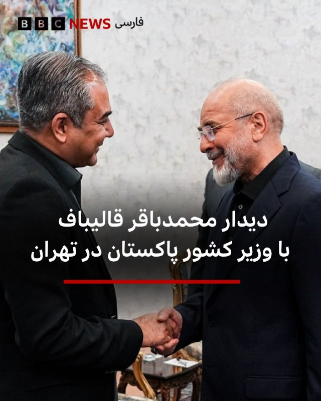

🔻محسن نقوی، وزیر کشور پاکستان، عصر امروز با محمدباقر قالیباف، رئیس مجلس ایران در تهران دیدار و گفت‌وگو کرد.

آقای قالیباف ریاست هیئت مذاکره کننده ایران در مذاکرات با آمریکا در پاکستان را بر عهده داشت.

پاکستان میانجی‌ کنونی ایران و آمریکاست.

رسانه‌های ایرانی و پاکستانی گزارش داده‌‌اند که آقای نقوی برای از سرگیری مذاکرات به ایران سفر کرده است.

گفته شده او حامل پیام‌ آمریکاست و پاسخ ایران را هم دریافت خواهد کرد.

به گفته سفارت پاکستان در تهران، آقای نقوی دیروز پس از ورود به تهران «نزدیک به سه ساعت در نهاد ریاست جمهوری حضور داشت» و اسکندر مومنی، وزیر کشور، و عباس عراقچی، وزیر امور خارجه نیز «در جریان این دیدار در نهاد ریاست جمهوری حضور داشتند.»

علاوه بر این، محسن نقوی «دیداری خصوصی» با مسعود پزشکیان داشت که «حدود ۹۰ دقیقه به طول انجامید و با حضور وزیر کشور ایران همراه بود.»

📷Mehr News
https://bbc.in/4uMNMMW

@BBCPersian

## BBCPersian — post 281300

  

‌🔻بهار صحرائیان، وکیل دادگستری و فعال حقوق بشر، صبح روز ۲۶ اردیبهشت هنگامی که برای دفاع از معترضان بازداشت‌شده در دادگاه انقلاب شیراز حاضر شده بود، بازداشت شده است.

یک منبع مطلع به بی‌بی‌سی گفت که خانم صحرائیان به زندان عادل‌آباد شیراز منتقل شده است.

بهار صحرائیان که عضو کانون وکلای استان فارس است، آبان ۱۴۰۱ هم بازداشت و مدتی در زندان بود که با حکم عفو آزاد شد.

این منبع مطلع گفت خانم صحرائیان پس از آزادی چند بار به اداره اطلاعات فراخوانده شد: «این وکیل دادگستری در حین انجام وظیفه حرفه‌ای و در فضای دادگاه صورت گرفته است سپس به دفتر کارش در شیراز برده شده و دفتر مورد تفتیش قرار گرفته و بعد از آن به بازداشتگاه منتقل شده است.»

بر اساس این گزارش، خانم صحرائیان صبح امروز، ۲۷ اردیبهشت به دادسرا منتقل شده و اتهامات «اجتماع و تبانی به قصد اقدام علیه امنیت ملی»، «فعالیت تبلیغی علیه نظام اسلامی» و «نشر اکاذیب» به او تفهیم شده است.

📷Handout
@BBCPersian

## BBCPersian — post 281299

  <a href="telegram/content/BBCPersian_281299_1779026611.mp4" target="_blank">🎬 Download video</a>

🔻سرخط خبرهای روز یکشنبه ۲۷ اردیبهشت ۱۴۰۵
@BBCPersian

## BBCPersian — post 281298

  

🔻جلسه دادگاه صادق ساعدی‌نیا، مدیر کافه‌های زنجیره‌ای ساعدی‌نیا که در اعتراضات سراسری دی ماه گذشته به همراه پدرش، محمدعلی ساعدی‌نیا بازداشت شد،‌ در دادگاه انقلاب قم برگزار شد.

کافه‌های ساعدی‌نیا از جمله کسب‌وکارهایی بود که در اعتراضات دی ماه پارسال که با اعتراض بازار به نابسامانی اقتصادی آغاز شد، مغازه‌هایشان را تعطیل کردند.

نماینده دادستان قم در این جلسه آقای ساعدی‌نیا را به «فعالیت تبلیغی یا رسانه‌ای برخلاف امنیت کشور»، «اقدام عملیاتی برای گروه‌های معاند نظام از طریق انتشار استوری و فعالیت مجازی و حضور در تجمعات غیرقانونی و تعطیل کردن کافه‌ها و مغازه‌های خود در کل کشور و تشویق تعدادی از کارکنانش در ارتکاب جرایم علیه امنیت کشور» متهم کرد.

به گفته نماینده دادستان و قاضی موارد اتهامی بر مبنای اطلاعاتی است که از محتوای لوازم الکترونیکی ضبط شده از آقای ساعدی‌نیا و از جمله تصاویر و چت‌های او در واتساپ استخراج شده است.

نماینده دادستان گفت که آقای ساعدی‌نیا در واتساپ خود «برنامه ریزی برای تعطیلی کافه‌ها را همزمان با صدور فراخوان دشمن به مشورت گذاشته بود.»

لینک خبر:
📷MIZAN
https://bbc.in/3PnkDsQ

@BBCPersian

## BBCPersian — post 281297

  

🔻مقام‌های ابوظبی می‌گویند آتش‌سوزی ناشی از حمله یک پهپاد به یک ژنراتور برق در بیرون محدوده نیروگاه هسته‌ای براکه کنترل شده است.

دفتر رسانه‌ای ابوظبی گفت در این حادثه کسی آسیب ندیده است و سطح ایمنی پرتوهای رادیواکتیو نیز تغییری نکرده است.

سازمان تنظیم مقررات هسته‌ای امارات هم با تایید این خبر اعلام کرد که نیروگاه به کار عادی خود ادامه می‌دهد.

نیروگاه هسته‌ای براکه در منطقه ظفره امارات اولین نیروگاه هسته‌ای در جهان عرب است و از چهار رآکتور تشکیل شده است.

در بیانیه‌های امارات اشاره‌ای به مسئول احتمالی حملات نشده است.

ایران امارات را در حملات آمریکا و اسرائیل شریک فعال می‌داند.

آژانس بین‌المللی انرژی اتمی از حمله پهپادی به نزدیکی نیروگاه هسته‌ای امارات به‌شدت ابراز نگرانی کرد.

این حمله به آتش‌سوزی در این نیروگاه انجامید اما دفتر رسانه‌ای دولت ابوظبی گفت که آتش‌سوزی کنترل شده و آسیبی به نیروگاه وارد نشده است.

آژانس بین‌المللی انرژی اتمی هم تایید کرد که سطح تشعشعات در اطراف این نیروگاه عادی است.

📸MOHAMEDBINZAYED
https://bbc.in/4wBBjNT
@BBCPersian

## idfinfarsi — post 11591

‼️برای رفع تهدید: نیروهای ارتش اسرائیل یک فرمانده در ستاد عملیات سازمان تروریستی حماس را که در پیشبرد طرح‌های تروریستی علیه نیروهای ما نقش داشت، به‌هلاکت رساندند.

نیروهای ارتش اسرائیل در فرماندهی جنوب، روز گذشته (شنبه) بها‌ء بارود، از فرماندهان ستاد عملیات شاخه نظامی سازمان تروریستی حماس را به‌هلاکت رساندند.

بارود در طول جنگ، و به‌ویژه در دوره اخیر، در برنامه‌ریزی و پیشبرد طرح‌های تروریستی متعددی از سوی سازمان تروریستی حماس علیه نیروهای ارتش اسرائیل در نوار غزه و شهروندان اسرائیل در کوتاه‌مدت نقش داشته است.

وی تهدیدی فوری برای نیروهای ارتش اسرائیل به شمار می‌رفت و در یک حمله دقیق هوایی به‌هلاکت رسید.

پیش از حمله، اقداماتی برای کاهش آسیب به غیرنظامیان انجام شد، از جمله استفاده از مهمات دقیق و دیدبانی‌های هوایی.

نیروهای ارتش اسرائیل در فرماندهی جنوب، مطابق با توافق، در منطقه مستقر هستند و به اقدام برای رفع هرگونه تهدید فوری ادامه خواهند داد.

## Dirty_Kids — post 389618

رژیم آخوندها اگر توانش را داشتند، اکسیژن را روی مردم ایران می بستند و به نیروهای خودی «اکسیژن پرو» می‌دادند.

@Dirty_Kids 👻

## Dirty_Kids — post 389617

‏به عنوان یه روانشناس می‌تونم بگم که، آدم‌ها معمولاً خشم‌شون رو سر کسانی که واقعاً مستحق اون هستن خالی نمی‌کنن، بلکه روی کسانی خالی می‌کنن که مطمئنن دوست‌شون دارن و در نهایت اون‌ها رو می‌بخشن.

@Dirty_Kids 👻

## Dirty_Kids — post 389616

‏از جمله [بذار تکلیف جنگ معلوم شه، بعد] حامله ام.

@Dirty_Kids 👻

## Dirty_Kids — post 389615

قبلا کس گاو برای خودش شخصیتی داشت، الان شده چند گیگ اینترنت و چند دقیقه ریلز دیدن تو اینستا

@Dirty_Kids 👻

## Dirty_Kids — post 389614

  <a href="telegram/content/Dirty_Kids_389614_1779026616.mp4" target="_blank">🎬 Download video</a>

حامی تروریسم دیروز وسط گهخوریش توسط پلیس شریف فرانکفورت بدرقه شد 😁

@Dirty_Kids 👻

## Dirty_Kids — post 389613

مَکرون دخترتو میگاد، جفتکتو به پهلوی میزنی.

@Dirty_Kids 👻

## Dirty_Kids — post 389612

بهزاد فراهانی، این کفتار پیرِ به بچه‌های ۱۷-۱۸ ساله که دست خالی می‌رن جلوی دوشکا:
«اگه بیضه دارید بیاید انقلاب کنید!»

تو که ۴۷ سال برای چهار تا نقش‌‌تخمی‌بیضه‌مالی آخوند رو کردی میدونی که‌‌ اگه محمدرضا شاه فقید فقط یک صدم جنایاتی که آخوندای عزیزت کردن رو کرده بود، حجم بیضه‌های تو و رفقات هم مشخص می‌شد

حروم‌زاده!

@Dirty_Kids 👻

## Dirty_Kids — post 389611

‏قذافی وقتی می‌خواسته زنش رو لوس کنه لیبی به لاباش می‌ذاشته.

@Dirty_Kids 👻

## Dirty_Kids — post 389610

  <a href="telegram/content/Dirty_Kids_389610_1779026619.mp4" target="_blank">🎬 Download video</a>

مرادویسی، تحلیلگر اینترنشنال:
آمریکا اگه جمهوری اسلامی رو سرنگون نکنه؛

روسیه با خودش میگه آمریکا حتی نتونست جمهوری‌اسلامی رو سرنگون کنه پس من اوکراین رو نابود میکنم وهمینطور علیه بقیه میرم جلو
چین هم با خودش میگه آمریکا نتونست جمهوری‌اسلامی رو سرنگون کنه پس منم تایوان رو نابود میکنم چون کاری از دست آمریکا برنمیاد
کره‌شمالی هم با خودش میگه آمریکا نتونست جمهوری‌اسلامی رو سرنگون کنه، پس منم میتونم با موشک به ژاپن و کره‌جنوبی حمله کنم و کاری از آمریکا برنمیاد.
و حتی مثل جمهوری‌اسلامی که تنگه هرمز رو نابود کرد منم میتونم تنگه کُره رو با موشک‌پراکنی ناامن کنم.
پس به این دلایل آمریکا مجبوره که جمهوری‌اسلامی رو سرنگون کنه.

+ خلاصش یعنی، هژمونی امریکا نابود میشه

@Dirty_Kids 👻

## Hranews — post 112992

بازداشت دو معترض با ادعای «مشارکت در قتل پلیس»؛ پیشتر محمد عباسی در این پرونده اعدام شده بود

❗️
❗️
❗️
❗️
❗️– فرمانده انتظامی ملارد از #بازداشت دو شهروند در ارتباط با اعتراضات سراسری ۱۴۰۴ خبر داد و مدعی شد که این افراد در قتل یک افسر پلیس نقش داشته‌اند. این در حالی است که اخیرا محمد عباسی در ارتباط با همین پرونده #اعدام شده بود.

ادامه مطلب

#محمد_عباسی

↘️
@hranews_bot تماس ✉️ -  @Hranews  کانال هرانا 🆑

## Hranews — post 112991

بهار صحرائیان، وکیل دادگستری در شیراز بازداشت و تفهیم اتهام شد

❗️
❗️
❗️
❗️
❗️ – بهار صحرائیان، وکیل دادگستری روز گذشته در شیراز #بازداشت شد و امروز یکشنبه ۲۷ اردیبهشت ماه، جلسه بازپرسی وی در دادسرای این شهرستان برگزار شد.

ادامه مطلب

#بهار_صحرائیان

↘️
@hranews_bot تماس ✉️ -  @Hranews  کانال هرانا 🆑

## Hranews — post 112990

  

نائب رئیس کانون بازنشستگان تامین اجتماعی شیراز، نسبت به وضعیت این سازمان هشدار داد و اعلام کرد که در صورت تداوم روند کنونی، تامین اجتماعی با خطر جدی ورشکستگی مواجه خواهد شد. وی در گفت‌وگو با خبرگزاری ایلنا، ضمن اشاره به افزایش شدید هزینه‌ها و کاهش منابع درآمدی، این وضعیت را ناشی از رشد تعهدات، کاهش بیمه‌پردازی و شرایط اقتصادی دانست.

ناصر مصطفوی، با انتقاد از وضعیت خدمات درمانی، اعلام کرد که با وجود الزام قانونی، طرح درمان رایگان برای کارگران و بازنشستگان به‌طور کامل اجرا نشده و همزمان تعرفه‌های درمانی بدون کنترل در حال افزایش است. به گفته وی، این شرایط فشار مضاعفی بر بازنشستگان وارد کرده و در کنار مشکلاتی مانند تاخیر در صدور احکام حقوقی و بلاتکلیفی پروژه‌های درمانی، نارضایتی گسترده‌ای در میان این گروه‌ها ایجاد کرده است.

↘️
@hranews_bot تماس ✉️ -  @Hranews  کانال هرانا 🆑

## Hranews — post 112989

  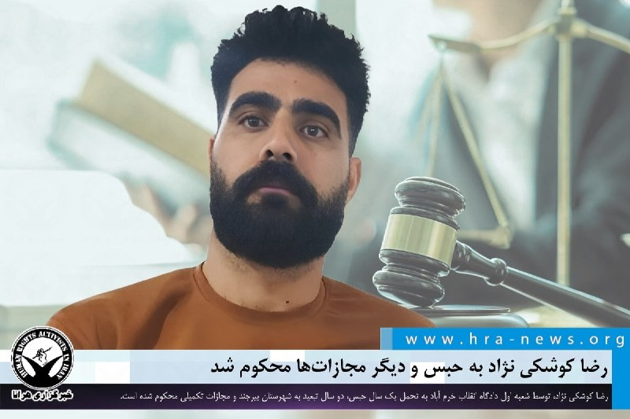

رضا کوشکی نژاد به حبس و دیگر مجازات‌ها محکوم شد

❗️
❗️
❗️
❗️
❗️ – رضا کوشکی نژاد، توسط شعبه اول دادگاه انقلاب خرم آباد به تحمل یک سال #حبس، دو سال #تبعید به شهرستان بیرجند و مجازات تکمیلی محکوم شده است.

به گزارش خبرگزاری هرانا، ارگان خبری مجموعه فعالان حقوق بشر در ایران، رضا کوشکی نژاد به حبس، تبعید و مجازات تکمیلی محکوم شد.

شعبه یک دادگاه انقلاب خرم آباد آقای کوشکی نژاد را از بابت اتهامات تبلیغ علیه نظام و انتشار عکس و تصاویر و مطالب خلاف عفت عمومی از طریق انتشار تصویر و تحریک مردم به برهم زدن امنیت جامعه در فضای مجازی، به یک سال حبس و دو سال تبعید به شهرستان بیرجند محکوم کرده است. همچنین او به عنوان مجازات‌ تکمیلی، به مطالعه و بررسی اسناد مربوط به سوابق ساواک و ارائه گزارش دستنویس به شعبه اجرای احکام خرم آباد محکوم شده است.

ادامه مطلب

#رضا_کوشکی_نژاد

↘️
@hranews_bot تماس ✉️ -  @Hranews  کانال هرانا 🆑

## manototv — post 105555

  <a href="telegram/content/manototv_105555_1779026622.mp4" target="_blank">🎬 Download video</a>

راهپیمایی ایرانیان ساکن گوتنبرگ سوئد، یکشنبه ۲۷ اردیبهشت

## alonews — post 120615

  <a href="telegram/content/alonews_120615_1779026624.webm" target="_blank">🎬 Download video</a>

👈صدای انفجار در امارات 
✅ @AloNews خبر جنگ

## alonews — post 120614

  <a href="telegram/content/alonews_120614_1779026625.webm" target="_blank">🎬 Download video</a>

👈صدای انفجار در امارات

✅ @AloNews خبر جنگ

## alonews — post 120613

  <a href="telegram/content/alonews_120613_1779026625.mp4" target="_blank">🎬 Download video</a>

👈نتانیاهو : تو این جنگ معلوم شد ایران اصلاً براش مهم نیست چیو بزنه
- نه اماکن مقدس اسلام براش مهمه، نه مسیحیت، نه حتی مکان‌های مقدس یهودیا. به اینجا موشک شلیک کرد و هم اماکن مقدس رو به خطر انداخت
- هم مردمو، برای همین الان داریم بودجه ویژه می‌ذاریم برای محافظت و تقویت دیوار ندبه و زیرساخت‌ها

✅ @AloNews خبر جنگ

## alonews — post 120612

  <a href="telegram/content/alonews_120612_1779026628.mp4" target="_blank">🎬 Download video</a>

👈نتانیاهو : قدرت اسرائیل الان توی میدان جنگ داره معلوم میشه
- هم به خاطر نسل جنگجوهای ما، هم مردمی که جلوی همه این چالش‌ها محکم ایستادن

✅ @AloNews خبر جنگ

## alonews — post 120611

  <a href="telegram/content/alonews_120611_1779026631.webm" target="_blank">🎬 Download video</a>

👈حاجی‌بابایی، نایب‌رییس مجلس:
اگه تاسیسات نفت ما رو بزنن، نفت دوست و دشمن در منطقه رو میزنیم.

✅ @AloNews خبر جنگ

## alonews — post 120609

این روزا تو ایران دوست اجاره ای از همه چیز پر طرفدار تر شده، شما میتونین یه نفرو به صورت ساعتی یا روزانه اجاره کنین و باهاش تولد، کافه، سینما، خرید و... برین.

خیلیا پارتی میگیرن و برای اینکه جلو اکسشون پز بدن، یه پسر خیلی خوشگل اجاره میکنن و همراه خودشون میبرن.
قیمت اجاره با توجه به ظاهر و... از ساعتی 300 هزار شروع و تا 1 میلیون ادامه داره.

[@AloTweet]

## alonews — post 120608

  <a href="telegram/content/alonews_120608_1779026632.webm" target="_blank">🎬 Download video</a>

👈آکسیوس با استناد به اطلاعات طبقه‌بندی‌شده: کوبا ۳۰۰ پهپاد، عمدتا از روسیه و ایران خریداری کرده و در حال بررسی استفاده از آنها علیه تأسیسات نظامی آمریکا در این جزیره یا مناطق اطراف آن است.

✅ @AloNews خبر جنگ

## alonews — post 120604

  <a href="telegram/content/alonews_120604_1779026632.mp4" target="_blank">🎬 Download video</a>

👈جنگنده‌های اسرائیلی حملات هوایی به ماروب، دیبین، البیصریه و صدیقین در جنوب لبنان انجام دادند.

✅ @AloNews خبر جنگ

## alonews — post 120603

  <a href="telegram/content/alonews_120603_1779026634.mp4" target="_blank">🎬 Download video</a>

🔴یکی از معماران بستن تنگه هرمز همین اکبر کوسه از جناح اصلاح طلبان بود.

🤔سگ زرد برادر شغاله، همگی دزد، تروریست و قاتل بودید و هستید.

✅@AloNews

## alonews — post 120602

  <a href="telegram/content/alonews_120602_1779026636.mp4" target="_blank">🎬 Download video</a>

👈جنوب لبنان پس از حمله اسرائیل

✅ @AloNews خبر جنگ

## alonews — post 120601

  <a href="telegram/content/alonews_120601_1779026638.webm" target="_blank">🎬 Download video</a>

👈حملات پهپادی اوکراینی فرودگاه بین‌المللی شرمتیوو در منطقه مسکو روسیه را هدف قرار داد.

🔴شرمتیوو شلوغ‌ترین فرودگاه روسیه است.

✅ @AloNews خبر جنگ

## alonews — post 120600

  <a href="telegram/content/alonews_120600_1779026638.webm" target="_blank">🎬 Download video</a>

👈بعد از ۷۹ روز قطع اینترنت بین‌ الملل، پزشکیان با «سیم‌کارت سفید» وارد پلتفرمی شد که خودشون فیلترش کردن و گفت وزارت ارتباطات برای اینترنت باکیفیت تلاش کرده.

✅ @AloNews خبر جنگ

## alonews — post 120599

  <a href="telegram/content/alonews_120599_1779026638.mp4" target="_blank">🎬 Download video</a>

👈سواحل دریاچه ارومیه

✅ @AloNews خبر جنگ

## alonews — post 120598

  <a href="telegram/content/alonews_120598_1779026641.mp4" target="_blank">🎬 Download video</a>

🔴که‌ «خانم کم حجاب» هم دخترمونه! تف به ته اون حلق روضه خونت کنن عرزشی بی غیرت.

✅@AloNews

## alonews — post 120597

  <a href="telegram/content/alonews_120597_1779026643.webm" target="_blank">🎬 Download video</a>

👈آکسیوس با استناد به اطلاعات طبقه‌بندی‌شده: کوبا ۳۰۰ پهپاد، عمدتا از روسیه و ایران خریداری کرده و در حال بررسی استفاده از آنها علیه تأسیسات نظامی آمریکا در این جزیره یا مناطق اطراف آن است.

✅ @AloNews خبر جنگ

## alonews — post 120596

  <a href="telegram/content/alonews_120596_1779026644.webm" target="_blank">🎬 Download video</a>

👈گفتگوی تلفنی وزرای خارجه ایران و کره جنوبی

🔴چو هیون وزیر امور خارجه وزیر امور خارجه جمهوری کره طی یک تماس تلفنی با عراقچی در خصوص آخرین تحولات منطقه ای گفتگو کرد.

✅ @AloNews خبر جنگ

---
📅 بروزرسانی: 1405/02/27 15:35
---

## VahidOOnLine — post 240616

ویدیوهای رسیده به ایران‌اینترنشنال نشان می‌دهد مراسم تولد ایلیا قدسی، جاویدنام ۱۷ ساله کشته‌شده در شامگاه ۱۸ دی، بر سر مزارش برگزار شده است. مادر این نوجوان جان‌باخته با سخنرانی در این مراسم خطاب به پسرش گفت: «تو قدم بزرگی برای ما برداشتی. راهت را ادامه خواهیم داد.»
‌🏁 🇬🇧 IranintlTV

🤖 @VahidOOnLine

## VahidOOnLine — post 240615

  <a href="telegram/content/VahidOOnLine_240615_1779019511.mp4" target="_blank">🎬 Download video</a>

تجمع ایرانیان لیسبون پرتغال مقابل کاخ ریاست‌جمهوری، یکشنبه ۲۷ اردیبهشت
‌🏁 🇬🇧 ManotoTV

🤖 @VahidOOnLine

## VahidOOnLine — post 240614

  

آژانس بین‌المللی انرژی اتمی اعلام کرد امارات متحده عربی به این نهاد اطلاع داده سطح پرتو در نیروگاه هسته‌ای براکه پس از حمله پهپادی به نزدیکی آن، در سطح عادی باقی مانده و هیچ مصدومی گزارش نشده است. دفتر رسانه‌ای ابوظبی روز یکشنبه از حمله پهپادی به این نیروگاه خبر داده بود.
‌🏁 🇬🇧 IranintlTV

🤖 @VahidOOnLine

## VahidOOnLine — post 240613

  

سازمان حقوق بشر ایران اعلام کرد دستگاه قضایی جمهوری اسلامی «فعالانه» از وکلای تسخیری برای تسهیل و تسریع سیستماتیک اعدام معترضان بازداشت‌شده بهره می‌گیرد. این سازمان افزود این وکلا با خودداری از برقراری ارتباط با خانواده متهمان آنان را از روند دادرسی بی‌اطلاع نگه می‌دارند.
به نوشته این سازمان، مستندات نشان می‌دهد وکلای تسخیری بلافاصله پس از صدور حکم، با ثبت درخواست تجدیدنظر، موکلان خود را از مهلت قانونی محروم می‌کنند و با ایجاد موانع عامدانه در مسیر دسترسی به وکلای مستقل، زمینه اجرای سریع احکام اعدام را فراهم می‌سازند.
این سازمان نوشت بازداشت‌شدگان اعتراضات بدون دفاع موثر می‌مانند؛ وکلای تسخیری اعترافات اجباری و ادعاهای شکنجه را به چالش نمی‌کشند و مدارک تبرئه‌کننده ارائه نمی‌دهند. در نتیجه دادگاه‌ها بر اساس شواهد بدون اعتراض حکم اعدام صادر و دیوان عالی کشور نیز احکام را بدون بررسی حقوقی واقعی تایید می‌کند.
این سازمان هشدار داد این اقدامات نقض سیستماتیک دادرسی عادلانه است و اعدام‌ها را براساس حقوق بین‌الملل در زمره اعدام‌های خودسرانه قرار می‌دهد.
‌🏁 🇬🇧 IranintlTV

🤖 @VahidOOnLine

## VahidOOnLine — post 240612

🗣روایت شما از زندگی در آتش‌بس- یکشنبه ۲۷ اردیبهشت‌ماه

🔹باورم نمیشه در قرن ۲۱، یک کشور نزدیک به ۳ ماهه بدون اینترنت مونده و برای هیچ سازمان بین‌المللی هم اهمیت نداره.

🔹دانش‌آموز هستم. نمی‌دانم باید امتحان‌ها رو چیکار کنم. یک اینترنت ملی داریم که اون هم کار نمی‌کند تا بتونیم درس بخونیم. یک دل‌خوشی داشتم، اون هم اینترنت بود که از ما گرفتن.

🔹دانشگاه آزاد بندرعباس برای خدماتی که ارائه نشده و کلاس‌هایی که نصفه‌ و نیمه تشکیل شده، شهریه کامل می‌گیرد.

🔹شورای‌عالی انقلاب فرهنگی هر روز یه حرفی می‌زنه. الان ما کلاس یازدهمی‌ها و کنکوری‌ها بلاتکلیف موندیم که امتحان نهایی چی می‌شه. جمهوری اسلامی علاوه بر اقتصاد و امنیت، فضای آموزش رو هم به نابودی کشونده.

🔹من یازدهم ریاضی‌ام، میگن از حواشی آموزشی فاصله بگیرید و تمرکزتون رو بگذارید روی درس. چطوری آخه وقتی کل کشور شده حاشیه؟ ما مثل بچه‌ شما در مدرسه‌ای با شهریه ۵۰۰ میلیون تومانی درس نمی‌خونیم.
‌🏁 🇬🇧 IranintlTV

🤖 @VahidOOnLine

## VahidOOnLine — post 240611

  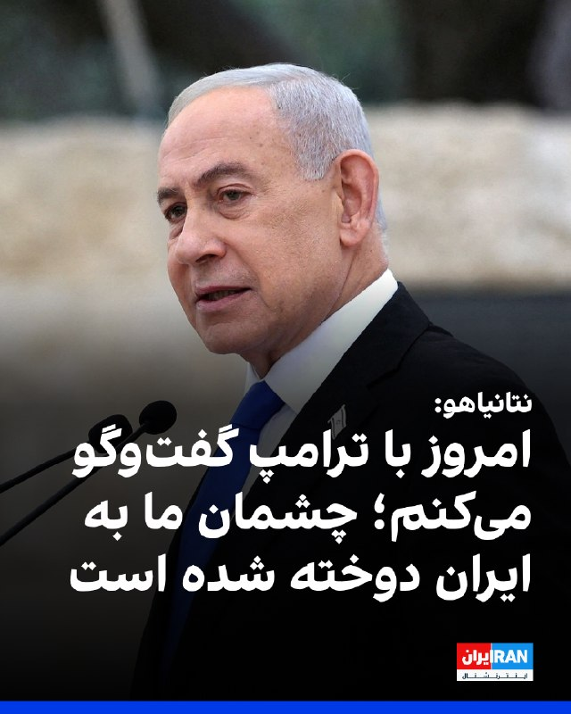

بنیامین نتانیاهو، نخست‌وزیر اسرائیل، گفت: «امروز با دوستمان، رییس‌جمهور ترامپ گفت‌وگو خواهم کرد. مطمئنا برداشت‌های او از سفرش به چین و شاید مسائل دیگر را خواهم شنید. قطعا احتمالات زیادی وجود دارد و ما برای هر سناریویی آماده‌ایم.» نتانیاهو افزود: «چشمان ما به ایران دوخته شده است.»
‌🏁 🇬🇧 IranintlTV

🤖 @VahidOOnLine

## VahidOOnLine — post 240610

  <a href="telegram/content/VahidOOnLine_240610_1779019514.mp4" target="_blank">🎬 Download video</a>

مقام‌های ابوظبی اعلام کردند در پی حمله پهپادی، یک ژنراتور برق خارج از محدوده داخلی نیروگاه هسته‌ای براکه در منطقه الظفره دچار آتش‌سوزی شد.

بر اساس این اعلام، حادثه آسیب جانی نداشت و هیچ اثری بر سطح ایمنی پرتوی نیروگاه برجای نگذاشت. مقام‌ها گفته‌اند همه اقدامات احتیاطی لازم انجام شده و جزئیات بیشتر در صورت دریافت اطلاعات تازه اعلام خواهد شد.

سازمان فدرال مقررات هسته‌ای امارات نیز تاکید کرد آتش‌سوزی بر ایمنی نیروگاه یا آمادگی سامانه‌های حیاتی آن اثری نداشته و همه واحدهای نیروگاه به‌طور عادی در حال فعالیت‌اند.
‌🏁 🇬🇧 ManotoTV

🤖 @VahidOOnLine

## VahidOOnLine — post 240609

  <a href="telegram/content/VahidOOnLine_240609_1779019514.mp4" target="_blank">🎬 Download video</a>

روزنامه بریتانیایی تلگراف گفته است برخی افراد نزدیک به دونالد ترامپ، رئیس‌جمهوری آمریکا، پیشنهاد کرده‌اند امارات متحده عربی جزیره لاوان در خلیج فارس را تصرف کند.

بر اساس این ادعا، یک مقام ارشد امنیتی پیشین در دولت ترامپ به تلگراف گفت هدف از چنین پیشنهادی، افزایش نقش امارات در رویارویی با ایران بدون اعزام نیروهای زمینی آمریکا است.

این گزارش پس از آن منتشر می‌شود که وال‌استریت ژورنال از حملات پنهانی امارات به اهدافی در ایران خبر داد. به گزارش رویترز به نقل از این روزنامه، یکی از این حملات در اوایل آوریل پالایشگاهی در جزیره لاوان را هدف قرار داده بود، ادعایی که امارات آن را علنا تایید نکرده است.
‌🏁 🇬🇧 ManotoTV

🤖 @VahidOOnLine

## VahidOOnLine — post 240608

  

♦️امارات متحده عربی می‌گوید ژنراتور نیروگاه هسته‌ای براکه هدف یک پهپاد قرار گرفته است اما هیچ آسیبی ندیده و سطح تشعشعات رادیواکتیو تغییری نکرده است.

دفتر رسانه‌ای ابوظبی روز یکشنبه اعلام کرد که مقامات اماراتی به آتش‌سوزی ناشی از حمله پهپادی به یک ژنراتور برق در خارج از محیط داخلی نیروگاه هسته‌ای براکه در منطقه الظفره واکنش نشان دادند.

بنابر اعلام مقام‌های اماراتی هیچ آسیبی گزارش نشده، سطح ایمنی رادیولوژیکی تحت تأثیر قرار نگرفته و سازمان فدرال تنظیم مقررات هسته‌ای تأیید می‌کند که سیستم‌های ضروری نیروگاه به طور عادی کار می‌کنند.

جزئیاتی در خصوص اینکه این پهپاد از کجا به سمت نیروگاه هسته‌ای امارات پرتاب شده منتشر نشده است.
‌🇸🇦 Indypersian

🤖 @VahidOOnLine

## VahidOOnLine — post 240607

  

خبرگزاری ایلنا گزارش داد که تعداد ۱۳۸ نفر از کارمندان و کارگران شرکت ملی مس از زیر مجموعه‌های هلدینگ ایمیدرو، سازمان توسعه و نوسازی معادن و صنایع معدنی ایران، تعدیل شده‌اند.

یکی از کارمندان اخراجی این شرکت به ایلنا گفت: «در ۲۴ اسفندماه ۱۴۰۴، تنها ۵ روز مانده به پایان سال، ۱۳۸ پرسنل متخصص با یک نامه و پیامک تحت عنوان «عدم تمدید قرارداد به دلیل نداشتن پروژه جدید» از کار بیکار شدند.»

کارمند دیگری گفته است: «تعدیل‌ها بدون استعلام از مسئولان فنی برای نگهداری یا عدم نگهداری نیروها صادر شده است. در واقع تقریبا تمام نیروهای با سابقه مجموعه اخراج شدند.»
‌🏁 🇬🇧 IranintlTV

🤖 @VahidOOnLine

## WithYashar — post 11475

نتانیاهو: امروز با رئیس‌جمهور ترامپ حرف میزنم،چشممون روی ایران بازه، برای هر موقعیتی آماده‌ایم.
@withyashar

## WithYashar — post 11474

  

خبرگزاری فارس: یه کشتی اسرائیلی تو خلیج فارس توقیف کردیم که خدمه‌ش عکس علی خامنه‌ای و مجتبی خامنه‌ای رو روی دیواراش نصب کرده بودن.
@withyashar

## WithYashar — post 11473

نتانیاهو: ما در غزه اکنون چیزی را در اختیار داریم، دیگر ۵۰٪ نیست... اکنون ۶۰٪ است. این وضعیت امروز است.
ماموریت ما یکی است: اطمینان حاصل کنیم که غزه دیگر تهدیدی برای اسرائیل نخواهد بود.

ما محدودیت بودجه نداریم. هر چقدر هزینه داشته باشد مهم نیست، شک ندارم که اسرائیل اولین کشوری خواهد بود که راه‌حلی کامل برای حملات پهپادی ارائه می‌دهد
@withyashar

## WithYashar — post 11472

نتانیاهو با ترامپ تلفنی گفتگو می‌کند

رسانه‌های عبری: نتانیاهو امروز با توجه به تحولات و تنش‌های منطقه با ترامپ صحبت خواهد کرد.
@withyashar
امروز همچنین اسرائیل جلسه امنیتی برگزار میکند

## mwarmonitor — post 9199

⭕️ طبق گزارش نیویورک تایمز، اسرائیل حداقل دو پایگاه نظامی مخفی در صحرای غربی عراق را برای مدت بیش از یک سال اداره کرده است. گفته می‌شود برنامه‌ریزی این پایگاه‌ها از اواخر ۲۰۲۴ برای پشتیبانی از عملیات لجستیکی علیه ایران انجام شده است.

🔸واشنگتن از دست‌کم یکی از این پایگاه‌های اسرائیلی از ژوئن ۲۰۲۵ مطلع بوده اما این اطلاعات را از بغداد مخفی کرده است. علاوه بر این، آمریکا ظاهراً دولت عراق را مجبور کرده است سامانه‌های راداری خود را تحت عنوان «حفاظت از هواپیماهای آمریکایی» خاموش کند؛ اقدامی که عملاً دید راداری بغداد را کور کرده و مانع شناسایی حضور اسرائیل در خاک خود شده است.

🔸با وجود این خاموشی رادارها، فرماندهی نظامی عراق در منطقه همچنان به وجود حضور اسرائیل مشکوک بوده است. گفته می‌شود فرماندهان عملیات‌های مراقبت دوربرد از این سایت‌ها انجام می‌دادند، اما زمانی که از طرف‌های آمریکایی درخواست اطلاعات کردند، با سکوت مواجه شدند.

@mwarmonitor

## mwarmonitor — post 9197

🔴 مشاوران ترامپ بیم آن دارند که چین در ۵ سال آینده تایوان را هدف قرار دهد

📝نویسندگان: جیم وندهای، مایک الن AXIOS

🔰برخی از مشاوران نزدیک پرزیدنت ترامپ نگرانند که بزرگ‌ترین دستاورد ملموس نشست سران با چین، افزایش خطر حمله شی جین‌پینگ، رئیس‌جمهور چین، به تایوان در پنج سال آینده باشد؛ اقدامی که می‌تواند دسترسی شرکت‌های آمریکایی را به تراشه‌های مورد نیاز برای تأمین انرژی هوش مصنوعی (AI) قطع کند.

🔸آنچه آن‌ها می‌گویند:
ترامپ شیفته تشریفات باشکوه و دسترسی ویژه‌ای شد که شی با هوشمندی در طول سفر پکن برای او تدارک دیده بود. اما کلمات با این صمیمیت ظاهری همخوانی نداشتند.
یکی از مشاوران ترامپ به ما گفت که شی «تلاش می‌کند چین را به جایگاه جدیدی برساند که در آن بگوید: "ما یک قدرت در حال ظهور نیستیم، بلکه همتای شما هستیم؛ و تایوان متعلق به من است."»

🔸این مشاور افزود:
«این سفر نشان‌دهنده احتمال بسیار بالاتری است که موضوع تایوان ظرف پنج سال آینده روی میز قرار گیرد. هیچ راهی وجود ندارد که ما از نظر اقتصادی برای این موضوع آماده باشیم؛ زنجیره تأمین تراشه‌ها به این زودی‌ها حتی نزدیک به خودکفایی هم نخواهد شد. برای مدیران عامل، و در واقع کل اقتصاد، هیچ مسئله‌ای حیاتی‌تر از زنجیره تأمین تراشه‌ها وجود ندارد.»

🔸تصویر کلی:
ترامپ از سوی چندین مدیرعامل به خاطر فشارهای شدید بر ایران و ونزوئلا و همچنین باز کردن بازارها مورد تحسین قرار گرفت. برخی از مدیران عامل با این امید به کشور بازگشتند که شرکت‌هایشان مجوز فعالیت در چین را دریافت خواهند کرد و این موفقیت را مدیون رئیس‌جمهور می‌دانستند.

@mwarmonitor

## mwarmonitor — post 9196

🔴 بلومبرگ: صبح امروز یکشنبه هیچ عبور و ترددی در تنگه هرمز ثبت نشده است.

@mwarmonitor

## mwarmonitor — post 9195

🇮🇱نتانیاهو گفت اسرائیل تلاش‌های خود را برای مقابله با تهدیدهای در حال تحول پهپادی، از جمله پهپادهای هدایت‌شونده با فیبر نوری، افزایش داده و برای توسعه راه‌حل‌های جدید از شرکت‌های دفاعی و همچنین متخصصان فناوری غیرنظامی کمک گرفته است.

🇮🇱او گفت: «به آن‌ها گفتم هیچ محدودیت بودجه‌ای وجود ندارد. هرچقدر هم هزینه داشته باشد، مهم نیست.» وی افزود این تیم مأمور شده است نه‌تنها با تهدیدهای فعلی پهپادی مقابله کند، بلکه برای تهدیدهای آینده نیز آماده شود.

@mwarmonitor

## FoxNewsTwitter — post 341831

  <a href="telegram/content/FoxNewsTwitter_341831_1779019516.mp4" target="_blank">🎬 Download video</a>

Fox News (Twitter/X)

Louisiana Sen. Bill Cassidy speaks after losing in the state's Republican primary, taking a thinly veiled jab at President Trump five years after he voted to convict the president in his impeachment trial.

## FoxNewsTwitter — post 341830

  <a href="telegram/content/FoxNewsTwitter_341830_1779019518.mp4" target="_blank">🎬 Download video</a>

Fox News (Twitter/X)

Bystander captures the horrifying moment an oncoming train smashed into a septic truck as it was crossing the tracks in Virginia, causing green substance to spew onto the ground and into the air.

Local police said the truck driver was taken to a hospital with life-threatening injuries, and that there is "no immediate danger" to the public.

## pm_afshaa — post 90898

  <a href="telegram/content/pm_afshaa_90898_1779019519.webm" target="_blank">🎬 Download video</a>

🔴نیویورک تایمز به نقل از مقامات امنیتی عراق: آمریکا به عراق دستور داده بود که توی دو تا عملیات در ایران، سیستم‌های راداری خودش رو خاموش کنه.

💧 Rainbet.com the #1 Non-KYC Crypto Casino & Sportsbook @rainbetcom

😁 @Pm_Afshaa

## pm_afshaa — post 90897

  <a href="telegram/content/pm_afshaa_90897_1779019520.webm" target="_blank">🎬 Download video</a>

🔴نیویورک‌تایمز: اسرائیل حداقل دو پایگاه مخفی در صحرای عراق رو به‌طور متناوب و برای بیش از یک سال اداره می‌کرده.

💧 Rainbet.com the #1 Non-KYC Crypto Casino & Sportsbook @rainbetcom

😁 @Pm_Afshaa

## pm_afshaa — post 90896

  

خیلی باید کونده پرو باشی که نزدیک 3 ماه قطعی کامل اینترنت، با سیم کارت سفید، تو اپ فیلتر شده این توییت رو بزنی :

💧 Rainbet.com the #1 Non-KYC Crypto Casino & Sportsbook @rainbetcom

😁 @Pm_Afshaa

## pm_afshaa — post 90895

🔴نیویورک‌تایمز: اسرائیل حداقل دو پایگاه مخفی در صحرای عراق را به‌طور متناوب و برای بیش از یک سال اداره می‌کرده

💧 Rainbet.com the #1 Non-KYC Crypto Casino & Sportsbook @rainbetcom

😁 @Pm_Afshaa

## pm_afshaa — post 90894

  <a href="telegram/content/pm_afshaa_90894_1779019521.webm" target="_blank">🎬 Download video</a>

🔴نتانیاهو: امروز با رئیس‌جمهور ترامپ حرف میزنم؛ چشممون روی ایران بازه و برای هر موقعیتی آماده‌ایم.

💧 Rainbet.com the #1 Non-KYC Crypto Casino & Sportsbook @rainbetcom

😁 @Pm_Afshaa

## DEJradio — post 4675

⭕️🎥 حکومت نگران از تشدید نارضایتی‌های عمومی، آموزش نظامی به کودکان در مساجد را سازماندهی‌شده پیش می‌برد.
شستشوی مغزی و تبلیغات عمدتا با نوای مذهبی و نوحه بخشی از مقدمات این آموزش‌هاست. قبلا آموزش‌ها شامل کلاشنیکف بود حالا آرپی‌جی هم به آن اضافه شده است.

#کودک_سرباز #سپر_انسانی
@DEJradio

## DEJradio — post 4674

  <a href="telegram/content/DEJradio_4674_1779019521.webm" target="_blank">🎬 Download video</a>

🔸
🔺 براساس گزارش‌های دریافتی گشتی‌های نیروی انتظامی و بـ.ـسیج و برای مأموریت‌های شهری تلفیق شده‌اند. همچنین ماموران انتظامی و نیروهای بسیج در برقراری ایست‌های بازرسی در شهرهای مختلف و گشت‌های محله‌محور همکاری خود را افزایش داده‌اند.
یک کارشناس امنیتی به دژ می‌گوید چنین اقدامی می‌تواند ناشی از دو دلیل عمده باشد: ۱) جبران کمبود نیرو و ۲)هماهنگی در شرایط اضطراری بعد از جنگ ۴۰ روزه بحق ادغام نیروهای مسلح مطرح شد که موضوع «تلفیق بخشی از ماموریت‌ها» ارتباطی به آن ندارد.
از سوی دیگر سازمان بـ.ـسیج در ارتش، نیروی انتظامی، سـ.ـپاه و حتی سایر ارگان‌ها «سهمیه استخدام» دارد. از این رو با توجه به تلفات سنگین نیروی انتظامی در جنگ ۴۰ روزه و احتمال شکل‌گیری مجدد اعتراضات از یک سو حکومت ممکن است سهمیه استخدام بـ.ـسیج در فراجا را افزایش دهد و از سوی دیگر برای افزایش همکاری و هماهنگی «قرارگاه‌های امنیتی» تقویت شود.
طی سال‌های اخیر بارها فرماندهان ارشد نیروی انتظامی و پاسداران در مورد تشکیل قرارگاه‌های مشترک امنیتی و روانی و تقویت گشت‌های محلی اظهار نظر کردند و در مواقعی مدتی کوتاه آن را به اجرا گذاشتند.

#سرکوبگران
@DEJradio

## DEJradio — post 4673

  <a href="telegram/content/DEJradio_4673_1779019522.mp4" target="_blank">🎬 Download video</a>

⭕️🎥 شعار تجمعات شبانه حکومت این است که با "هر سلیقه‌ای" برای ایران آمده‌اند؛ اما این کارزار پر از تضاد و تناقض است. آنچه ۴۷ سال با شدیدترین مجازات روبرو می‌شد حالا که پای مصلحت و بقای نظام در میان است یگر ایراد ندارد، از جمله بدمستی ولایی‌های عرق‌خور در خیابان.

#الکل #جمهوری_اسلامی
@DEJradio

## DEJradio — post 4670

😎 
⭕️ یک منبع اختصاصی به دژ می‌گوید همزمان با محاصره دریایی بنادر ایران، شرکت لوبک لاین «Lubeck Line» تحت مدیریت حسن (ابوالفضل) شمخانی، تمامی «ترانشیپمنت پورت»‌ها (بنادر ترانزیتیِ واسط انتقال بار) را از امارات (بندر جبل‌علی) به قطر و عمان (بندر دوحه و بندر سوهار) منتقل کرده است.
سرویس‌های اصلی کانتینری از این بنادر واسط توسط کشتی‌های خط Sea Lead Shipping و‌Volta Container Line که مربوط به حسن شمخانی است به مقاصد چین، هندوستان، مالزی، روسیه، مصر، آفریقا ، آمریکای جنوبی، ویتنام و کره جنوبی و بالعکس کار حمل کانتینری صادرات و واردات را به بنادر ایران انجام می‌دهند .
همین منبع می‌گوید «تمام کرایه حمل و نقل دریافتی از بازرگانان که بصورت دلاری است و با توجه به شرایط جنگی ۱۰ برابر شده، جزو درآمدهای اصلی حکومت است و باعث پایداری رژیم آدمکش اسلامی است.»
برهمین اساس:
۱) عملا قطر و عمان در حال کمک به دور زدن تحریم‌ها هستند و در جهت خنثی کردن اقدامات ایالات متحده و امارات اقدام کرده‌اند، در حال حاضر واردات و صادرات کالاها از طریق بنادر واسط سوهار و حمد در حال انجام است قبلا از طریق جبل‌علی و ابوظبی انجام می‌شد.

۲) قطر و عمان در حال خیانت به امارات وعربستان سعودی و‌ ایالات متحده هستند و بدین طریق پول هنگفتی به جیب می‌زنند.

۳) کشتی‌های تحریمی که به بندرعباس رفته باشند حق پهلوگیری در بنادر را ندارند در اینصورت تحریم‌های ایالات متحده را نقض کرده‌اند و کشورهای مربوطه مشمول پرداخت جریمه هستند.
چون کشتی‌های مادر اجازه پهلوگیری در بنادر ایران را ندارند، صادرات و واردات ایران همیشه از طریق یک پورت واسط توسط کشتی‌هایی که معمولا تحریمی هستند انجام می‌شود. با بسته شدن بنادر امارات بر روی حکومت ایران و بسته شدن هرمز، عمان و قطر بنادرخود را در اختیار حکومت ایران گذاشته‌اند البته در این لیست هندوستان و مالزی هم مدت‌ها است این همکاری را با حکومت ایران دارند.
براساس اطلاعات همین منبع «مدت‌ها پیش حسن شمخانی دو نفر کاپیتان‌های کشتیرانی جمهوری اسلامی، را استخدام کردند که کار تغییر پرچم و خرید سوخت قاچاق برای کشتی‌ها و سفید کردن کشتی‌ها را انجام بدهد اما مطمئنا قطر، عمان، هندوستان و مالزی از تحریمی بودن کشتی‌ها آگاه هستند.»

#اختصاصی #تنگه_هرمز
@DEJradio

## DEJradio — post 4669

  <a href="telegram/content/DEJradio_4669_1779019523.webm" target="_blank">🎬 Download video</a>

🔺
⭕️ علی بیت‌‌الهی رئیس بخش زلزله‌شناسی و خطرپذیری مرکز تحقیقات راه، مسکن و شهرسازی درباره صحبت‌هایی که میان مردم شنیده می‌شود مبنی بر اینکه انفجار موشک‌ها منجر به فعال شدن گسل‌ها شده، گفت: «مردم توجه داشته باشند عمق کانونی این زلزله‌ها در حدود ۱۰ تا ۲۰ کیلومتری زمین است در حالیکه قوی‌ترین شدیدترین انفجارات هم نمی‌تواند در عمق تا چند صد متری زمین نفوذ کند درحالیکه ما در وقوع زلزله از عمق ١٠ هزار الی ١٠متر صحبت می‌کنیم آن هم در امتداد یک گسل طویل نه یک نقطه اما انفجارات نقطه‌ای هستند و شکل موج انفجارات با شکل موج زلزله کاملا به طور کاملا روشنی قابل تشخیص است. »
او افزود؛ «اینکه بگوییم این انفجارات موجب تحریک یک گسل می‌شود مانند این است که یک پشه بر روی گوش یک فیل بنشیند و این گمان شود که با نیش پشه، فیل از پا بیفتد بنابراین این موضوع اصلا مبنایی ندارد.»
برخی از مردم براین باورند آزمایش‌های موشکی و اتمی در عمق زمین از عوامل برخی از زمین‌لرزه‌هاست اما متخصصان داخلی که در رسانه‌های رسمی اظهار نظر می‌کنند این باور را رد می‌کنند، با این همه در موارد مشابه متخصصان ژاپنی چند بار طی سال‌های اخیر [از جمله شهریور ۱۳۹۶] گفتند علت زلزله در آن نواحی آزمایش‌های اتمی یا هیدروژنی کره شمالی است.

#زلزله #برنامه_اتمی
@DEJradio

## DEJradio — post 4668

  

👑
⭕️ شاهزاده رضا پهلوی در نشست «آینده تکنولوژی در ایران» که ۱۶ ماه مه (۲۶ اردیبهشت) برگزارش د گفت که مردم ایران به چیزی جز تغییر کامل نظام رضایت نخواهند داد: «آن‌ها ۴۰ هزار کشته نداده‌اند که در نهایت به توافق اتمی برسند.»
او افزود: «اتکای مخالفان نظام نباید به نیروی خارجی باشد و باید فرض را بر این گذاشت که کمکی دریافت نمی‌شود اما در صورت دریافت حمایت خارجی روند دستیابی به اهداف آسان‌تر خواهد شد.»
شاهزاده رضا پهلوی در نشست «آینده تکنولوژی در ایران» با رد مشروعیت ساختار سیاسی جمهوری اسلامی و چهره‌هایی چون محمدباقر قالیباف گفت مردم ایران این همه کشته و هزینه نداده‌اند که بار دیگر تن به «ماموریت‌های مهره‌های این حکومت» بدهند.
او تاکید کرد: «ما باید به دنیا ثابت کنیم که ملت ایران، شریک بهتری برای جامعه جهانی است تا بقایای این حکومت.»

#شاهزاده_رضا_پهلوی #ایران_را_پس_میگیریم
@DEJradio

## IranIntlTV — post 337617

ویدیوهای رسیده به ایران‌اینترنشنال نشان می‌دهد مراسم تولد ایلیا قدسی، جاویدنام ۱۷ ساله کشته‌شده در شامگاه ۱۸ دی، بر سر مزارش برگزار شده است. مادر این نوجوان جان‌باخته با سخنرانی در این مراسم خطاب به پسرش گفت: «تو قدم بزرگی برای ما برداشتی. راهت را ادامه خواهیم داد.»

## IranIntlTV — post 337616

  

🔻تیم فوتبال زنان «نائه‌گو‌هیَنگ» کره شمالی روز یکشنبه وارد کره جنوبی شد؛ برای نخستین بار در هفت سال و نیم گذشته ورزشکارانی از کره شمالی پا به خاک کره جنوبی می‌گذارند. این تیم روز چهارشنبه در مرحله نیمه‌نهایی لیگ قهرمانان زنان آسیا، با «سوون اف‌سی وومن» از کره جنوبی بازی می‌کند.

🔹سفر یک تیم فوتبال زنان از کره شمالی به کره جنوبی، اتفاقی نادر در شرایطی است که تنش‌های سیاسی میان دو کشور به سطحی رسیده که دولت‌هایشان عملاً هیچ ارتباط مستقیمی با یکدیگر ندارند.

🔹برخی رویدادهای ورزشی در گذشته میان دو کره نقش کانال دیپلماتیک را ایفا کرده‌اند؛ هرچند این بار انتظار نمی‌رود این سفر به کاهش تنش‌ها منجر شود.

🔹دیدار ورزشکاران دو کره، که از نظر فنی همچنان در وضعیت جنگی قرار دارند، معمولاً فراتر از یک مسابقه ورزشی تلقی می‌شود.

🔹تمام شهروندان کره شمالی که به خارج از کشور سفر می‌کنند، تحت همراهی مأموران پلیس مخفی قرار دارند؛ مأمورانی که هرگونه نشانه بی‌وفایی را زیر نظر می‌گیرند.

🔹درباره این اتفاق کم‌سابقه در وبسایت ایران اینترنشنال بیشتر بخوانید.

@iranintltvsport

## IranIntlTV — post 337615

  <a href="telegram/content/IranIntlTV_337615_1779019525.mp4" target="_blank">🎬 Download video</a>

دفتر رسانه‌ای ابوظبی در امارات از حمله پهپادی به یک ژنراتور برق در محدوده نیروگاه هسته‌ای براکه در منطقه الظفر خبر داد. بر اساس این گزارش، این حمله باعث آتش‌سوزی در بخشی از نیروگاه شده و ژنراتور برق هدف قرار گرفته است.
جزییات بیشتر با علی شیرازی، عضو تحریریه ایران‌اینترنشنال
@iranintltv

## IranIntlTV — post 337614

  

آژانس بین‌المللی انرژی اتمی اعلام کرد امارات متحده عربی به این نهاد اطلاع داده سطح پرتو در نیروگاه هسته‌ای براکه پس از حمله پهپادی به نزدیکی آن، در سطح عادی باقی مانده و هیچ مصدومی گزارش نشده است. دفتر رسانه‌ای ابوظبی روز یکشنبه از حمله پهپادی به این نیروگاه خبر داده بود.
https://iranintl.com/202605177167

## IranIntlTV — post 337613

  <a href="telegram/content/IranIntlTV_337613_1779019526.mp4" target="_blank">🎬 Download video</a>

گروهی از ایرانیان و فعالان مدنی در مرکز شهر فرانکفورت در اعتراض به سرکوب، اعدام زندانیان سیاسی و محدودیت‌های اینترنتی در ایران تجمع کردند.

مهدی تهرانی گزارش می‌دهد
@iranintltv

## IranIntlTV — post 337612

  

سازمان حقوق بشر ایران اعلام کرد دستگاه قضایی جمهوری اسلامی «فعالانه» از وکلای تسخیری برای تسهیل و تسریع سیستماتیک اعدام معترضان بازداشت‌شده بهره می‌گیرد. این سازمان افزود این وکلا با خودداری از برقراری ارتباط با خانواده متهمان آنان را از روند دادرسی بی‌اطلاع نگه می‌دارند.
به نوشته این سازمان، مستندات نشان می‌دهد وکلای تسخیری بلافاصله پس از صدور حکم، با ثبت درخواست تجدیدنظر، موکلان خود را از مهلت قانونی محروم می‌کنند و با ایجاد موانع عامدانه در مسیر دسترسی به وکلای مستقل، زمینه اجرای سریع احکام اعدام را فراهم می‌سازند.
این سازمان نوشت بازداشت‌شدگان اعتراضات بدون دفاع موثر می‌مانند؛ وکلای تسخیری اعترافات اجباری و ادعاهای شکنجه را به چالش نمی‌کشند و مدارک تبرئه‌کننده ارائه نمی‌دهند. در نتیجه دادگاه‌ها بر اساس شواهد بدون اعتراض حکم اعدام صادر و دیوان عالی کشور نیز احکام را بدون بررسی حقوقی واقعی تایید می‌کند.
این سازمان هشدار داد این اقدامات نقض سیستماتیک دادرسی عادلانه است و اعدام‌ها را براساس حقوق بین‌الملل در زمره اعدام‌های خودسرانه قرار می‌دهد.
https://iranintl.com/202605171885

## IranIntlTV — post 337611

🗣روایت شما از زندگی در آتش‌بس- یکشنبه ۲۷ اردیبهشت‌ماه

🔹باورم نمیشه در قرن ۲۱، یک کشور نزدیک به ۳ ماهه بدون اینترنت مونده و برای هیچ سازمان بین‌المللی هم اهمیت نداره.

🔹دانش‌آموز هستم. نمی‌دانم باید امتحان‌ها رو چیکار کنم. یک اینترنت ملی داریم که اون هم کار نمی‌کند تا بتونیم درس بخونیم. یک دل‌خوشی داشتم، اون هم اینترنت بود که از ما گرفتن.

🔹دانشگاه آزاد بندرعباس برای خدماتی که ارائه نشده و کلاس‌هایی که نصفه‌ و نیمه تشکیل شده، شهریه کامل می‌گیرد.

🔹شورای‌عالی انقلاب فرهنگی هر روز یه حرفی می‌زنه. الان ما کلاس یازدهمی‌ها و کنکوری‌ها بلاتکلیف موندیم که امتحان نهایی چی می‌شه. جمهوری اسلامی علاوه بر اقتصاد و امنیت، فضای آموزش رو هم به نابودی کشونده.

🔹من یازدهم ریاضی‌ام، میگن از حواشی آموزشی فاصله بگیرید و تمرکزتون رو بگذارید روی درس. چطوری آخه وقتی کل کشور شده حاشیه؟ ما مثل بچه‌ شما در مدرسه‌ای با شهریه ۵۰۰ میلیون تومانی درس نمی‌خونیم.

## IranIntlTV — post 337610

  

بنیامین نتانیاهو، نخست‌وزیر اسرائیل، گفت: «امروز با دوستمان، رییس‌جمهور ترامپ گفت‌وگو خواهم کرد. مطمئنا برداشت‌های او از سفرش به چین و شاید مسائل دیگر را خواهم شنید. قطعا احتمالات زیادی وجود دارد و ما برای هر سناریویی آماده‌ایم.» نتانیاهو افزود: «چشمان ما به ایران دوخته شده است.»
https://iranintl.com/202605173431

## IranIntlTV — post 337609

  <a href="telegram/content/IranIntlTV_337609_1779019529.mp4" target="_blank">🎬 Download video</a>

مروری بر روزنامه‌های ایران، شنبه ۲۶ اردیبهشت، با مجتبی هاشمی، روزنامه‌نگار
@iranintltv

## IranIntlTV — post 337608

  <a href="telegram/content/IranIntlTV_337608_1779019530.mp4" target="_blank">🎬 Download video</a>

نشست «آینده تکنولوژی در ایران» با هدف بررسی فرصت‌های بخش فناوری در دوران پس از جمهوری اسلامی و نقش متخصصان ایرانی خارج از کشور، در سان‌فرانسیسکو برگزار شد.
شاهزاده رضا پهلوی در این نشست گفت ایران می‌تواند به الگویی مانند کره جنوبی تبدیل شود، اما حکمرانی جمهوری اسلامی کشور را به سمت وضعیتی شبیه کره شمالی برده است.
گفت‌وگو با آرش آزرمی، دبیر بخش اقتصادی ایران‌اینترنشنال
@iranintltv

## IranIntlTV — post 337607

🔻سومین مربی در یک سال؛ ژابی آلونسو سرمربی چلسی شد

باشگاه چلسی، ژابی آلونسو، سرمربی پیشین رئال مادرید و بایر لورکوزن را با قراردادی چهار ساله، به‌عنوان سرمربی جدید خود منصوب کرد. این مربی ۴۴ ساله اسپانیایی پس از جدایی توافقی از رئال مادرید در زمستان گذشته، و کمتر از هشت ماه پس از آغاز قرارداد سه‌ساله‌اش در اسپانیا، در دسترس بود.

او قراردادی چهار ساله از تابستان امسال با چلسی دارد که به نوشته بی‌بی‌سی، برخلاف قراردادهای شش‌ساله‌ای که چلسی در سال‌های اخیر ارائه می‌کرد، نسبتاً عادی توصیف شده است.

چلسی به تغییرات عمده‌ای نیاز دارد و بسیاری می‌گویند آلونسو می‌تواند فردی باشد که روند این تیم را تغییر دهد.

او پیش از دوره‌ای ناکامی در رئال مادرید، سه سال هدایت بایر لورکوزن را برعهده داشت و این تیم آلمانی را دو سال پیش به نخستین قهرمانی بوندس‌لیگا در تاریخ باشگاه رساند و همچنین جام حذفی آلمان را نیز فتح کرد.

تأیید حضور آلونسو یک روز پس از شکست چلسی مقابل منچسترسیتی در فینال جام حذفی انگلیس منتشر شد.

آبی‌های لندن امیدوارند او پس از فصلی که در آن دو سرمربی دائمی، انزو مارسکا و لیام روزنیور، روی نیمکت تیم نشستند، ثبات را به باشگاه بازگرداند. در حال حاضر کالوم مک‌فارلین دومین دوره حضورش به‌عنوان سرمربی موقت را سپری می‌کند و این نقش را در دو بازی پایانی لیگ برتر نیز ادامه خواهد داد.

آلونسو گفت: «چلسی یکی از بزرگ‌ترین باشگاه‌های فوتبال جهان است و این‌که سرمربی این باشگاه بزرگ می‌شوم، باعث افتخار فراوان من است.

او گفت: «از گفت‌وگوهایی که با مالکان و مدیران ورزشی باشگاه داشتم، مشخص است که بلندپروازی مشترکی داریم. ما می‌خواهیم تیمی بسازیم که بتواند به‌طور مداوم در بالاترین سطح رقابت کند و برای کسب جام بجنگد.»

سرمربی جدید چلسی گفت: «استعداد زیادی در این تیم وجود دارد و این باشگاه ظرفیت بسیار بالایی دارد و هدایت آن افتخار بزرگی برای من خواهد بود. حالا تمرکز روی کار سخت، ایجاد فرهنگ درست و کسب جام است.»

آلونسو پنج سال در لیگ برتر انگلیس برای لیورپول بازی کرد و در سال ۲۰۰۵ همراه این تیم قهرمان لیگ قهرمانان اروپا شد. او همچنین سابقه بازی در رئال سوسیداد، رئال مادرید و بایرن مونیخ را دارد.

او ۱۱۴ بازی ملی برای اسپانیا انجام داد و همراه این تیم قهرمان جام جهانی ۲۰۱۰ و دو دوره جام ملت‌های اروپا شد.

در هفته‌های اخیر نام آلونسو به بازگشت احتمالی به لیورپول، جایی که پنج فصل در آن بازی کرده بود، نیز مطرح شده بود؛ آن هم در شرایطی که فشارها بر آرنه اشلوت پس از فصلی ناامیدکننده افزایش یافته بود.

چلسی در فصل آینده احتمالا در هیچ رقابت اروپایی حضور نخواهد داشت؛ این تیم فعلا در رده نهم جدول لیگ برتر فوتبال انگلستان قرار دارد و برای رسیدن به لیگ کنفرانس اروپا باید حداقل هشتم شود؛ آن هم پس از آن‌که فرصت صعود به لیگ اروپا از طریق قهرمانی در جام حذفی را از دست داد.
🔗وب‌سایت ایران‌اینترنشنال
@iranintltv

## IranIntlTV — post 337606

  <a href="telegram/content/IranIntlTV_337606_1779019532.mp4" target="_blank">🎬 Download video</a>

یک شهروند با ارسال پیام به ایران‌اینترنشنال می‌گوید: «در حال ساخت خانه هستم و هر لحظه قیمت‌ها بیشتر می‌شود. کل هزینه ساختن تا قبل از عید یک میلیارد و نیم بود اما الان کابینتی با جنس معمولی شده یک میلیارد تومان.»

## IranIntlTV — post 337605

  

خبرگزاری ایلنا گزارش داد که تعداد ۱۳۸ نفر از کارمندان و کارگران شرکت ملی مس از زیر مجموعه‌های هلدینگ ایمیدرو، سازمان توسعه و نوسازی معادن و صنایع معدنی ایران، تعدیل شده‌اند.

یکی از کارمندان اخراجی این شرکت به ایلنا گفت: «در ۲۴ اسفندماه ۱۴۰۴، تنها ۵ روز مانده به پایان سال، ۱۳۸ پرسنل متخصص با یک نامه و پیامک تحت عنوان «عدم تمدید قرارداد به دلیل نداشتن پروژه جدید» از کار بیکار شدند.»

کارمند دیگری گفته است: «تعدیل‌ها بدون استعلام از مسئولان فنی برای نگهداری یا عدم نگهداری نیروها صادر شده است. در واقع تقریبا تمام نیروهای با سابقه مجموعه اخراج شدند.»
https://iranintl.com/202605177809

## Shin_Persian — post 6046

Shin ✓ @hey_itsmyturn
Sun, 17 May 2026 11:57:18 UTC

Jet activity over Western Tehran,
Presumably IRIAF ones.
#Iran

فارسی

فعالیت جت‌ها بر فراز غرب تهران،
احتمالاً متعلق به نهاجا (نیروی هوایی ارتش جمهوری اسلامی ایران).
#Iran

𝕏 · @shin_persian

## ManotoTV — post 105554

  <a href="telegram/content/ManotoTV_105554_1779019534.mp4" target="_blank">🎬 Download video</a>

تجمع ایرانیان لیسبون پرتغال مقابل کاخ ریاست‌جمهوری، یکشنبه ۲۷ اردیبهشت

## ManotoTV — post 105553

  <a href="telegram/content/ManotoTV_105553_1779019535.mp4" target="_blank">🎬 Download video</a>

مقام‌های ابوظبی اعلام کردند در پی حمله پهپادی، یک ژنراتور برق خارج از محدوده داخلی نیروگاه هسته‌ای براکه در منطقه الظفره دچار آتش‌سوزی شد.

بر اساس این اعلام، حادثه آسیب جانی نداشت و هیچ اثری بر سطح ایمنی پرتوی نیروگاه برجای نگذاشت. مقام‌ها گفته‌اند همه اقدامات احتیاطی لازم انجام شده و جزئیات بیشتر در صورت دریافت اطلاعات تازه اعلام خواهد شد.

سازمان فدرال مقررات هسته‌ای امارات نیز تاکید کرد آتش‌سوزی بر ایمنی نیروگاه یا آمادگی سامانه‌های حیاتی آن اثری نداشته و همه واحدهای نیروگاه به‌طور عادی در حال فعالیت‌اند.

## ManotoTV — post 105552

  <a href="telegram/content/ManotoTV_105552_1779019536.mp4" target="_blank">🎬 Download video</a>

روزنامه بریتانیایی تلگراف گفته است برخی افراد نزدیک به دونالد ترامپ، رئیس‌جمهوری آمریکا، پیشنهاد کرده‌اند امارات متحده عربی جزیره لاوان در خلیج فارس را تصرف کند.

بر اساس این ادعا، یک مقام ارشد امنیتی پیشین در دولت ترامپ به تلگراف گفت هدف از چنین پیشنهادی، افزایش نقش امارات در رویارویی با ایران بدون اعزام نیروهای زمینی آمریکا است.

این گزارش پس از آن منتشر می‌شود که وال‌استریت ژورنال از حملات پنهانی امارات به اهدافی در ایران خبر داد. به گزارش رویترز به نقل از این روزنامه، یکی از این حملات در اوایل آوریل پالایشگاهی در جزیره لاوان را هدف قرار داده بود، ادعایی که امارات آن را علنا تایید نکرده است.

## FarsiVOA — post 217963

🔺معمای لکه نفتی اطراف جزیره خارک

▪️با گذشت دو هفته از مشاهده لکه نفتی بزرگ در غرب خارک، بزرگترین پایانه نفتی ایران، مقامات جمهوری اسلامی هنوز از شفاف‌سازی پیرامون آن طفره می‌روند.

▪️پیشتر یک نماینده مجلس مدعی «تخلیه آب توازن و روغن» یک کشتی اروپایی در این منطقه شده بود، اما داده‌های کشتی‌رانی نشان می‌دهد هیچ کشتی اروپایی در غرب خارک، محلی که نشت ۴۵ کیلومتر مربعی گزارش شده، وجود نداشته و تخلیه آب توازن نمی‌تواند منجر به چنان آلودگی گسترده‌ای شود.

▪️این لکه نفتی در مسیر خط لوله میدان دریایی ابوذر به خارک است؛ این خط لوله فرسوده که قدمت آن به پنج دهه می‌رسد، مهرماه ۱۴۰۳ و شهریور ۱۴۰۴ نیز دچار شکستگی و نشتی شده بود.

⬇️ بیشتر بخوانید:
https://ir.voanews.com/a/8150876.html

## FarsiVOA — post 217962

  

بنیامین نتانیاهو، نخست‌وزیر اسرائیل، اعلام کرد که قرار است روز یکشنبه گفت‌وگویی تلفنی با دونالد ترامپ رئیس‌جمهور آمریکا انجام دهد. نتانیاهو گفت که انتظار دارد درباره سفر ترامپ به چین و موضوع ایران با رئیس‌جمهور آمریکا گفت‌وگو کند.

همزمان تایمز اسرائیل گزارش داد که نتانیاهو شامگاه یکشنبه در دفتر خود در اورشلیم، جلسه‌ای با دستیاران و وزرای ارشد برای یک مشورت امنیتی تشکیل می‌دهد.

یکی از وزرایی که قرار است در این نشست حاضر باشد، به این رسانه اسرائیلی گفت چنین گفت‌وگوهایی که اغلب «کابینه کوچک امنیتی» نامیده می‌شوند، معمولاً شامل گیدون سعار وزیر خارجه، یسرائیل کاتس وزیر دفاع، بزالل اسموتریچ وزیر دارایی، ایتامار بن‌گویر وزیر امنیت ملی و آریه درعی رئیس حزب شاس می‌شود.
@FarsiVOA

## FarsiVOA — post 217961

  

اقتصاد اسرائیل در سه‌ماهه نخست سال ۲۰۲۶، زیر فشار جنگ با جمهوری اسلامی، با نرخ سالانه ۳.۳ درصد کوچک شد؛ افتی که از پیش‌بینی ۴ درصدی اقتصاددانان در نظرسنجی رویترز کمتر بود.

اداره آمار اسرائیل گزارش داد مصرف خصوصی در این دوره ۴.۷ درصد، صادرات ۳.۷ درصد و هزینه‌های دولتی ۴.۸ درصد کاهش یافت. در مقابل، سرمایه‌گذاری در دارایی‌های ثابت ۱۲.۶ درصد افزایش داشت.

اقتصاد اسرائیل در سال ۲۰۲۵ رشد ۲.۹ درصدی ثبت کرده بود و انتظار می‌رفت پس از آتش‌بس جنگ غزه در اکتبر، در سال ۲۰۲۶ به رشد بیش از ۵ درصد بازگردد. اما آغاز درگیری آمریکا و اسرائیل با جمهوری اسلامی در ۲۸ فوریه، نهم اسفند، و هفته‌ها حملات موشکی جمهوری اسلامی، فعالیت مدارس و کسب‌وکارها را مختل کرد.

بانک مرکزی اسرائیل رشد امسال را در صورت دوام آتش‌بس با ایران ۳.۸ درصد پیش‌بینی کرده است.
@FarsiVOA

## FarsiVOA — post 217960

  <a href="telegram/content/FarsiVOA_217960_1779019537.mp4" target="_blank">🎬 Download video</a>

استقبال وزیر جنگ ایالات متحده از نیروهای ناوگروه یواس‌اس جرالد آر. فورد در بازگشت به کشور؛

نزدیک به ۴ هزار و پانصد ملوان ناوگروه ضربت یواس‌اس جرالد آر. فورد، صبح روز شنبه ۲۶ اردیبهشت، پس از یک دوره ۱۱ ماهه استقرار در ناوگان‌های چهارم، پنجم و ششم ایالات متحده، به پایگاه دریایی نورفولک بازگشتند.

این ناو هواپیمابر به همراه ناوشکن‌های همراهش، بِینبریج و ماهان بازگشت. ناو هواپیمابر وینستون چرچیل نیز به بندرگاه اصلی خود در پایگاه دریایی میپورت بازگشت.

طی مراسمی وزیر جنگ ایالات متحده، پیت هگست، شخصا به استقبال آنها رفت و به گروه ضربت شماره ۱۲ ناو هواپیمابر، «لوح تقدیر ریاست‌جمهوری» را اعطا کرد. این لوح، بالاترین نشانی است که یک واحد نظامی می‌تواند دریافت کند و به پاس «شجاعت فوق‌العاده در نبرد علیه دشمن مسلح» اعطا می‌شود.
@FarsiVOA

## FarsiVOA — post 217959

  

روزنامه پاکستانی «داون» به نقل از منابع دیپلماتیک در اسلام‌آباد گزارش داد «سفر برنامه‌ریزی‌نشده» محسن نقوی، وزیر کشور پاکستان، به تهران در چارچوب تلاش‌های این کشور برای احیای روند متوقف‌شده صلح میان آمریکا و جمهوری اسلامی انجام شده است.

بر اساس این گزارش، نقوی در سفری دو روزه و از پیش اعلام‌نشده وارد تهران شده؛ سفری که منابع دیپلماتیک آن را بخشی از دیپلماسی مستمر اسلام‌آباد برای جلوگیری از «فروپاشی کامل» مذاکرات میان واشنگتن و تهران توصیف کرده‌اند.

داون نوشته است این تلاش‌ها پس از آن شدت گرفته که دونالد ترامپ، رئیس جمهوری آمریکا، تازه‌ترین پاسخ تهران به پیشنهادهای واشنگتن را رد کرد و شتاب حاصل از دورهای پیشین گفت‌وگو در اسلام‌آباد به‌شدت کاهش یافت.

انتظار می‌رود وزیر کشور پاکستان در جریان این سفر با مقام‌های ارشد جمهوری اسلامی، از جمله اسکندر مؤمنی، وزیر کشور، دیدار کند. به نوشته داون، گفت‌وگوها علاوه بر مسائل امنیتی و مرزی دوجانبه، تحولات گسترده‌تر منطقه و تلاش‌ها برای زنده نگه داشتن کانال‌های میانجی‌گرانه میان آمریکا و ایران را نیز دربر می‌گیرد.
@FarsiVOA

## FarsiVOA — post 217958

  

🔺حمله پهپادی به نزدیکی نیروگاه هسته‌ای امارات باعث آتش‌سوزی شد

▪️مقام‌های ابوظبی از آتش‌سوزی ناشی از حمله پهپادی به یک ژنراتور برق در خارج از محوطه نیروگاه هسته‌ای براکه در منطقه الظفره امارات متحده عربی خبر دادند.

▪️این آتش‌سوزی روز یکشنبه ۲۷ اردیبهشت رخ داد و هیچ موردی از جراحت گزارش نشد. همچنین گزارش شده سطح ایمنی پرتویی تحت تأثیر قرار نگرفته و سازمان فدرال تنظیم مقررات هسته‌ای امارات تأیید کرده که سیستم‌های حیاتی نیروگاه به‌طور عادی در حال کار هستند.

▪️امارات متحده عربی در طول جنگ آمریکا و اسرائیل علیه جمهوری اسلامی، هدف حملات مکرر موشکی و پهپادی قرار گرفت و مقام‌های ابوظبی گفته‌اند منشأ این حملات ایران بوده و زیرساخت‌های انرژی و دریایی را هدف قرار داده‌اند.

⬇️ بیشتر بخوانید:
https://ir.voanews.com/a/8150873.html

## FarsiVOA — post 217957

  

وزارت خارجه کره جنوبی اعلام کرد که این کشور از تهران خواسته درباره حمله به یک کشتی کره‌ای در نزدیکی تنگه هرمز اعلام موضع کند.

بر اساس بیانیه وزارت خارجه کره جنوبی، این درخواست در تماس تلفنی چو هیون، وزیر خارجه این کشور، با عباس عراقچی وزیر خارجه جمهوری اسلامی، در روز یکشنبه مطرح شده است.

پیشتر یک مقام کره جنوبی گفته بود که احتمال اینکه نهادی غیر از ایران مسئول این حمله بوده باشد، پایین است. این حمله روز ۴ مه علیه کشتی «نامو» متعلق به شرکت کشتی‌رانی کره‌جنوبی اچ‌ام‌ام صورت گرفت.

پیشتر دونالد ترامپ، رئیس‌جمهور آمریکا، اندکی پس از این حادثه گفت که جمهوری اسلامی به سوی کشتی کره‌جنوبی شلیک کرده است و از سئول خواست به تلاش‌های تحت رهبری آمریکا برای تأمین امنیت کشتی‌رانی در این تنگه بپیوندد.
@FarsiVOA

## DW_Farsi — post 124794

  

🔶 "انتصاب قالیباف به عنوان نماینده ویژه ایران در امور چین"

رسانه‌های داخلی ایران روز یکشنبه ۲۷ اردیبهشت گزارش دادند که محمدباقر قالیباف به عنوان "نماینده ویژه جمهوری اسلامی ایران در امور چین" منصوب شده است.

خبرگزاری تسنیم، وابسته به سپاه پاسداران نیز در گزارشی نوشت این انتصاب "با پیشنهاد رئیس‌جمهور و تایید رهبر جمهوری اسلامی" انجام شده است. به نوشته این خبرگزاری، عبدالرضا رحمانی‌فضلی پیش‌تر به عنوان "نماینده رئیس‌جمهور در امور چین" فعالیت می‌کرد و علی لاریجانی نیز پیشتر "نماینده ویژه رهبر جمهوری اسلامی در امور چین" بود.

با این حال، جزئیات روشنی درباره حدود اختیارات، ساختار حقوقی یا ضرورت ادامه فعالیت چنین سمتی منتشر نشده است. مشخص نیست جمهوری اسلامی در شرایطی که وزارت خارجه و سفارت ایران در پکن مسئول رسمی روابط دوجانبه با چین هستند، چه نیازی به تعیین یک "نماینده ویژه" جداگانه در امور چین دارد.
@dw_farsi

## DW_Farsi — post 124793

🔶 حمله پهپادی منجر به آتش‌سوزی در نزدیکی نیروگاه هسته‌ای ابوظبی شد

مقام‌های امارات متحده عربی روز یکشنبه ۱۷ ماه مه (۲۷ اردیبهشت) اعلام کردند یک حمله پهپادی به آتش‌سوزی در نزدیکی نیروگاه هسته‌ای براکه در منطقه الظفره ابوظبی منجر شده است. این حادثه به گفته مقام‌های این کشور، تلفات جانی یا نشت پرتویی در پی نداشته است.

دفتر رسانه‌ای ابوظبی در بیانیه‌ای اعلام کرد آتش‌سوزی در یک مولد برق، خارج از محدوده داخلی نیروگاه هسته‌ای براکه رخ داده و نیروهای امدادی و آتش‌نشانی بلافاصله به محل اعزام شده‌اند.

سازمان فدرال مقررات هسته‌ای امارات نیز اعلام کرد این حادثه تاثیری بر ایمنی نیروگاه یا عملکرد سامانه‌های اصلی آن نداشته و تمام واحدها به‌طور عادی در حال فعالیت هستند.

این نخستین بار از زمان آغاز جنگ اخیر میان ایران، آمریکا و اسرائیل است که نیروگاه هسته‌ای چهار راکتوری براکه هدف حمله قرار می‌گیرد. این نیروگاه در غرب ابوظبی و در نزدیکی مرز عربستان سعودی واقع شده است.

نیروگاه هسته‌ای براکه با هزینه‌ای حدود ۲۰ میلیارد دلار و با همکاری کره جنوبی ساخته شد و در سال ۲۰۲۰ به شبکه برق امارات پیوست. این مرکز، نخستین و تنها نیروگاه هسته‌ای فعال در شبه‌جزیره عربستان به شمار می‌رود.

هنوز هیچ گروه یا کشوری مسئولیت این حمله پهپادی را برعهده نگرفته و مقام‌های اماراتی نیز در بیانیه‌های رسمی خود، هیچ طرفی را عامل این حمله معرفی نکرده‌اند. آژانس بین‌المللی انرژی اتمی، نهاد ناظر هسته‌ای سازمان ملل مستقر در وین، نیز تاکنون به درخواست‌ها برای اظهارنظر درباره این حادثه پاسخی نداده است.

مقام‌های امارات از شهروندان خواسته‌اند اخبار مربوط به این حادثه را تنها از منابع رسمی دنبال کرده و از انتشار شایعات و اطلاعات تاییدنشده خودداری کنند.

@dw_farsi

## DW_Farsi — post 124792

  

🔶 ابراز خوش‌بینی پاکستان نسبت به برگزاری دور دوم مذاکرات تهران و واشنگتن

نخست‌وزیر پاکستان، نسبت به برگزاری دور دوم مذاکرات مستقیم میان تهران و واشنگتن و دستیابی به "صلحی پایدار" ابراز خوش‌بینی کرد.

شهباز شریف در گفت‌وگو با روزنامه "تایمز" بریتانیا گفت کشورش مورد اعتماد همه طرف‌ها، از جمله ایران، ایالات متحده و کشورهای حاشیه خلیج فارس است.

او همچنین تاکید کرد که تلاش‌های میانجی‌گرانه اسلام‌آباد، با وجود تبادل تهدیدها میان تهران و واشنگتن، همچنان ادامه دارد.

شهباز شریف در ادامه گفت، صلح به‌آسانی به دست نمی‌آید، بلکه نیازمند صبر، خرد و توانایی پیش بردن امور در دشوارترین شرایط است.

اظهارات نخست‌وزیر پاکستان در حالی مطرح می‌شود که دور پیشین مذاکرات با میانجی‌گری این کشور بی‌نتیجه به پایان رسید.

@dw_farsi

## DW_Farsi — post 124791

  

🔶 ادعای کیهان: جنگ جدید در آینده‌ای نه‌چندان دور محتمل است

روزنامه تندروی کیهان با اشاره به احتمال ازسرگیری درگیری‌ها میان ایران، اسرائیل و آمریکا، نوشت که وقوع دوباره جنگ "در فضایی از ابهام" قرار دارد، اما احتمال آن "در آینده‌ای نه‌چندان دور" بیشتر شده است.

کیهان در تحلیلی تازه، سه عامل را در ارزیابی احتمال آغاز دوباره جنگ مطرح کرد. این روزنامه نوشت شرایطی که به وقوع دو جنگ قبلی منجر شد، همچنان پابرجاست و از این رو، امکان شکل‌گیری جنگی تازه وجود دارد.

این روزنامه در عین حال با توصیف اقدامات اسرائیل و آمریکا به‌عنوان "اقدامات انتحاری بی‌نتیجه"، مدعی شد که باقی ماندن این بازیگران، احتمال تکرار "تصمیم و اقدام احمقانه" از سوی آن‌ها را منتفی نمی‌کند.

کیهان در ادامه پیش‌بینی کرد که در صورت آغاز دوباره جنگ، درگیری‌ها مشابه "جنگ چهل‌روزه" به یک نبرد فرسایشی تبدیل خواهد شد. به نوشته این روزنامه، در چنین شرایطی "دست برتر" با طرفی خواهد بود که "استقرار کامل‌تری در زمین جنگ" داشته باشد.

اظهارات و تحلیل‌های منتشرشده در کیهان، اغلب به‌عنوان دیدگاه جریان‌های نزدیک به حاکمیت مورد توجه قرار می‌گیرد.

@dw_farsi

## Persian_Trend_Official — post 14323

  

💢ارتش اسرائیل دستور تخلیه 4 روستا در جنوب لبنان را صادر کرد.

🫆:Tony

📌 @persian_trend_official
پرشین ترند | متفاوت‌ترین کانال نظامی

## Persian_Trend_Official — post 14322

💢نیویورک تایمز به نقل از مقام‌های عراقی

💢در هر دو مورد، هم در جنگ کوتاه سال گذشته و هم در درگیری فعلی، واشنگتن عراق را مجبور کرده رادارهایش را خاموش کند تا از هواپیماهای آمریکایی محافظت شود

💢اقدامی که باعث شده بغداد برای شناسایی فعالیت‌های خصمانه بیشتر به نیروهای آمریکایی وابسته شود

🫆:Tony

📌 @persian_trend_official
پرشین ترند | متفاوت‌ترین کانال نظامی

## RadioFarda — post 157288

  

🔸در پی شیوع دوباره بیماری اِبولا در جمهوری دموکراتیک کنگو در آفریقا و مرگ ده‌ها تن، سازمان بهداشت جهانی روز یک‌شنبه، ۲۷ اردیبهشت، «وضعیت اضطراری بین‌المللی» اعلام کرد.

🔸به نوشته خبرگزاری فرانسه، از نظر سطح هشدار در چارچوب مقررات این سازمان، این وضعیت پس از «وضعیت اضطراری پاندِمی» در مرتبه دوم جدیت قرار دارد.

🔸بیماری ابولا که هفدهمین بار است در کشور کنگو در آفریقای مرکزی شیوع پیدا کرده، بر اساس آماری که مرکز کنترل و پیشگیری از بیماری‌ها، شاخه آفریقا، در روز شنبه اعلام کرد، تاکنون جان ۸۸ نفر را در این کشور گرفته است.

🔸علاوه بر این، ۳۳۶ نفر نیز مشکوک به ابتلا به این تب ویروسیِ بسیار مسری هستند.

🔸از جمله نشانه‌های این بیماری ویروسی خطرناک تب و استفراغ و خون‌ریزی است. این بیماری که به اعتقاد پزشکان و پژوهشگران از خفاش سرچشمه گرفته است می‌تواند به از کار افتادن اندام‌های داخلی بدن نیز بینجامد.

@RadioFarda

## RadioFarda — post 157287

  <a href="https://t.me/radiofarda/157287" target="_blank">📎 Download file</a>

📻بشنوید: ساعت ۱۴ با رادیوفردا، ۲۷ اردیبهشت ۱۴۰۵‌

@Radiofarda

## RadioFarda — post 157286

  

🔸 اداره رسانه‌ای ابوظبی روز یک‌شنبه ۲۷ اردیبهشت در شبکه‌های اجتماعی از وقوع آتش‌سوزی در نیروگاه اتمی براکه در امارات متحده عربی خبر داد.

🔸 این آتش‌سوزی پس از حمله پهپادی به نیروگاه اتمی برکه در منطقه الظَفرَه آغاز شده، اما کشته و مجروح بر جا نگذاشته است.

🔸 بر اساس توضیح اداره رسانه‌ای ابوظبی، این حریق در ژنراتور برق خارج از محدوده پیرامون نیروگاه به راه افتاده و بر ایمنی سایت اثر منفی نداشته است.

🔸 در پی آغاز حمله مشترک آمریکا و اسرائیل به خاک ایران، امارات متحده عربی به بزرگ‌ترین هدف حملات تلافی‌جویانه سپاه پاسداران تبدیل شد.

@RadioFarda

## BBCPersian — post 281296

🔻نتانیاهو می‌گوید امروز با ترامپ تلفنی گفت‌وگو می‌کند

🔻نخست‌وزیر اسرائیل گفت امروز با دونالد ترامپ درباره ایران تلفنی گفت‌وگو می‌کند.

بنیامین نتانیاهو امروز در نشست ویژه دولت اسرائیل به مناسبت بزرگداشت روز بیت‌المقدس گفت:

«چشمان ما درباره ایران کاملا باز است. من امروز هم با دوستمان رئیس‌جمهور ترامپ صحبت می‌کنم همانطور که هر چند روز یک بار این کار را می‌کنم. حتما از تاثیر سفر او به چین خواهم شنید و شاید موضوعات دیگر. احتمالات زیادی وجود دارد و ما برای هر سناریویی آماده هستیم.»

https://bbc.in/3RduMJ8
@BBCPersian

## BBCPersian — post 281295

🔻رئیس‌جمهور برزیل: مخالف جنگ با ایران هستم اما اختلاف با ترامپ مانع رابطه با آمریکا نیست

🔻رئیس‌جمهور برزیل گفت که رابطه شخصی‌اش با دونالد ترامپ، رئیس‌جمهور آمریکا، می‌تواند به جذب سرمایه‌گذاری آمریکا در برزیل، جلوگیری از اعمال تعرفه‌ و تحریم‌های بیشتر و احترام به دموکراسی برزیل کمک کند.

لوئیز ایناسیو لولا دا سیلوا به روزنامه واشنگتن پست گفت: «آقای ترامپ می‌داند که من با جنگ با ایران مخالفم، با مداخله او در ونزوئلا موافق نیستم و نسل‌کشی‌ای را که در فلسطین در حال وقوع است محکوم می‌کنم.»

«اما اختلافات سیاسی من با ترامپ در رابطه‌ام با او به‌عنوان رئیس یک کشور تأثیری ندارد. آنچه می‌خواهم این است که او با برزیل با احترام رفتار کند و درک کند که من رئیس‌جمهور منتخب هستم.»

https://bbc.in/4dtG3wl
@BBCPersian

## BBCPersian — post 281294

🔻کره جنوبی خواستار اعلام موضع ایران درباره حمله به کشتی باریش در تنگه هرمز شد

🔻کره‌جنوبی از ایران خواست درباره حمله اخیر به یک کشتی باریش در نزدیکی تنگه هرمز اعلام موضع کند.

به گفته وزارت خارجه کره‌ جنوبی، چو هیون، وزیر خارجه، با همتای ایرانیش تلفنی صحبت کرده و سئول و تهران برای تضمین امنیت در تنگه هرمز به ارتباطات و رایزنی‌های خود ادامه خواهند داد.

پیش‌تر یک مقام کره‌جنوبی گفته بود احتمال این که عامل این حمله کشوری غیر از ایران باشد، پایین است.

به گفته مقام‌های سئول، کشتی باری «اچ‌ام‌ام نامو» در چهارم مه (۱۴ اردیبهشت) هدف «دو هواپیمای ناشناس» قرار گرفت. این حمله باعث آسیب رسیدن به کشتی و آتش‌سوزی در موتورخانه شد.

این کشتی با پرچم پاناما و تحت مدیریت شرکت کشتیرانی کره‌ای «اچ‌ام‌ام» در حال حرکت بود.

وزارت خارجه کره جنوبی روز جمعه (۲۵ اردیبهشت/۱۵ مه) اعلام کرد بقایای این کشتی باری آسیب‌دیده را به کشور منتقل کرده است.

سئول گفته است که هواپیماهای دخیل در این حمله در تصاویر دوربین‌های مداربسته ثبت شده‌اند، اما شناسایی دقیق نوع و مبدا پروازشان امکان‌پذیر نیست.

https://bbc.in/4dfpaGT
@BBCPersian

## Dirty_Kids — post 389609

  

بش از ۸۰ روز‌ از قطع اینترنت بین‌الملل تو ایران می‌گذره؛

پزشکیان اومد با سیم‌کارت سفید تو نرم افزاری که خودشون فیلترش کردن، یه توییت‌ زد و مدعی شد که؛ مسئولین وزارت ارتباطات تمام تلاششونو کردن تا مردم به اینترنت با کیفیت دسترسی داشته باشن و در‌آخر هم روز جهانی ارتباطات‌رو‌ تبریک گفت.

@Dirty_Kids 👻

## Dirty_Kids — post 389608

  <a href="telegram/content/Dirty_Kids_389608_1779019544.mp4" target="_blank">🎬 Download video</a>

بعد طرف میاد نطق می‌کنه که برید کتاب بخونید، مردم آگاه نیستند! ببین اینو ابله، مردم ایران اینجوری هستن، پتکی که این مهندس جوان ایرانی به سر رژیم زد، هیچکی نزد. آینده ایران رو اینا می‌سازن، با سواد و اهل کار.

@Dirty_Kids 👻

## Dirty_Kids — post 389607

  

کتاب دینیه یا داستان‌های پورنهاب؟

کتاب وسائل الشیعه، جلد ۱۴؛ امام رضا: هر وقت خواستی با زنت رابطه داشته باشی، فورا دخول نکن، اول با حرفای جنسی تحریکش کن و بعدش سینه هاشو فشار بده!
با اینکار اون کاملا آماده میشه و شهوت از چشماش فوران میکنه، بعدش ازت میخواد و خواهش میکنه که باهاش رابطه برقرار کنی!

@Dirty_Kids 👻

## Dirty_Kids — post 389606

  <a href="https://t.me/Dirty_Kids/389606" target="_blank">📎 Download file</a>

✅ اپلیکیشن اندروید سایت جهانی دربی بت

💰اولین سایت جهانی با امکان شارژ و برداشت ریالی(کارت به کارت)

🔗 برای ورود فیلترشکن روی کشور مناسب قرار دهید مانند فنلاند و المان و....

😀Telegram Channel
👇
https://t.me/+bcynkEgSW2dlYTc0

## Dirty_Kids — post 389605

  

😤دنبال یه سایت شرط بندی بین المللی بودی که به ایرانیا خدمات بده؟!
⛔

👍دربی بت همون انتخاب  100%

💎ویژگی های سایت جهانی Derby Bet:

⬅️امکان شارژ امن با کارت بانکی

⬅️واریز اول دوبل شارژ می شوید(بونوس۱۰۰٪)

⬅️پر اپشن ترین سایت فعال در ایران

⬅️تسویه حساب کمتر از 5 دقیقه

⬅️برگشت بخشی از باخت به صورت هفتگی

🚨کد هدیه ثبت نام:GG007

⚠️برای دانلود اپلکیشن کلیک کنید
👉

🔔کانال دربی بت :

🪙https://t.me/+bcynkEgSW2dlYTc0

## Dirty_Kids — post 389604

‏احساس میکنم یه عده هنوز نفهمیدن چه اتفاقی افتاده:
یه حکومتی هست که در عرض ۴ ساعت حداقل ۴۰ هزار نفر رو قتل عام کرده، به مجروحین توی بیمارستان تیر خلاص زده، به پرستارها تجاوز کرده، سر از تن معترضین جدا کرده، جسدها رو انبار کرده و خونواده‌ها رو وادار کرده بگردن لا به لای هزاران جسد ببینن جگرگوشه‌شون پیدا میشه یا نه، ازشون برای تحویل جنازه پول گرفته، هر روز هم یه عده رو بعد از کلی شکنجه داره اعدام میکنه.
بزرگترین قتل عام دوران معاصر ایران جلوی چشم ما اتفاق افتاده و تنها غلطی که میتونیم بکنیم اینه که نذاریم فراموش بشه، به حاشیه بره و در نهایت ج‌ا قسر در بره.

خیلی باید کودن یا پلشت باشید که جز ریشه کن شدن این حکومت چیزی بخواید و با کسی جز حامیان این حکومت دعوا کنید و اگر مخاطبین زیادی دارید از تریبونتون استفاده دیگه‌ای بکنید.

@Dirty_Kids 👻

## Hranews — post 112988

گزارشی از بازداشت واحد سلطانی در پیرانشهر

❗️
❗️
❗️
❗️
❗️ – واحد سلطانی، شهروند اهل پیرانشهر، ۱۰ روز پیش توسط نیروهای امنیتی در این شهر #بازداشت و تاکنون از سرنوشت او اطلاعی حاصل نشده است.

ادامه مطلب

#واحد_سلطانی

↘️
@hranews_bot تماس ✉️ -  @Hranews  کانال هرانا 🆑

## Hranews — post 112987

  

ایلام؛ طرح اتهامات «محاربه» و «افساد فی‌الارض» علیه آرشیا قیصربیگی

❗️
❗️
❗️
❗️
❗️ – آرشیا قیصربیگی، شهروند اهل سرابله از توابع استان ایلام، در تاریخ ۱۵ اردیبهشت ماه، توسط نیروهای امنیتی #بازداشت شده است. وی اکنون با اتهامات «محاربه و افساد فی‌الارض» مواجه شده است.

به گزارش خبرگزاری هرانا، ارگان خبری مجموعه فعالان حقوق بشر در ایران، آرشیا قیصربیگی با اتهاماتی همچون «محاربه و افساد فی‌الارض» مواجه است.

براساس اطلاعات دریافتی هرانا، در تاریخ ۱۶ اردیبهشت ۱۴۰۵، دادسرای عمومی و انقلاب شهرستان چرداول، وی را به اتهامات «محاربه و افساد فی‌الارض» متهم کرده و قرار بازداشت او را برای مدت دو ماه تمدید کرده است.

ادامه مطلب

#آرشیا_قیصربیگی

↘️
@hranews_bot تماس ✉️ -  @Hranews  کانال هرانا 🆑

## Hranews — post 112986

یک زن در فریدونکنار توسط یکی از بستگان خود به قتل رسید

❗️
❗️
❗️
❗️
❗️ – یک #زن ۲۶ ساله در شهرستان فریدونکنار توسط یکی از بستگان خود به قتل رسید. متهم توسط ماموران پلیس بازداشت شده است.

ادامه مطلب

↘️
@hranews_bot تماس ✉️ -  @Hranews  کانال هرانا 🆑

## manototv — post 105554

  <a href="telegram/content/manototv_105554_1779019546.mp4" target="_blank">🎬 Download video</a>

تجمع ایرانیان لیسبون پرتغال مقابل کاخ ریاست‌جمهوری، یکشنبه ۲۷ اردیبهشت

## manototv — post 105553

  <a href="telegram/content/manototv_105553_1779019547.mp4" target="_blank">🎬 Download video</a>

مقام‌های ابوظبی اعلام کردند در پی حمله پهپادی، یک ژنراتور برق خارج از محدوده داخلی نیروگاه هسته‌ای براکه در منطقه الظفره دچار آتش‌سوزی شد.

بر اساس این اعلام، حادثه آسیب جانی نداشت و هیچ اثری بر سطح ایمنی پرتوی نیروگاه برجای نگذاشت. مقام‌ها گفته‌اند همه اقدامات احتیاطی لازم انجام شده و جزئیات بیشتر در صورت دریافت اطلاعات تازه اعلام خواهد شد.

سازمان فدرال مقررات هسته‌ای امارات نیز تاکید کرد آتش‌سوزی بر ایمنی نیروگاه یا آمادگی سامانه‌های حیاتی آن اثری نداشته و همه واحدهای نیروگاه به‌طور عادی در حال فعالیت‌اند.

## manototv — post 105552

  <a href="telegram/content/manototv_105552_1779019548.mp4" target="_blank">🎬 Download video</a>

روزنامه بریتانیایی تلگراف گفته است برخی افراد نزدیک به دونالد ترامپ، رئیس‌جمهوری آمریکا، پیشنهاد کرده‌اند امارات متحده عربی جزیره لاوان در خلیج فارس را تصرف کند.

بر اساس این ادعا، یک مقام ارشد امنیتی پیشین در دولت ترامپ به تلگراف گفت هدف از چنین پیشنهادی، افزایش نقش امارات در رویارویی با ایران بدون اعزام نیروهای زمینی آمریکا است.

این گزارش پس از آن منتشر می‌شود که وال‌استریت ژورنال از حملات پنهانی امارات به اهدافی در ایران خبر داد. به گزارش رویترز به نقل از این روزنامه، یکی از این حملات در اوایل آوریل پالایشگاهی در جزیره لاوان را هدف قرار داده بود، ادعایی که امارات آن را علنا تایید نکرده است.

## alonews — post 120585

  <a href="telegram/content/alonews_120585_1779019549.webm" target="_blank">🎬 Download video</a>

👈ادعای نیویورک‌تایمز: اسرائیل حداقل دو پایگاه مخفی در صحرای عراق را به‌طور متناوب و برای بیش از یک سال اداره می‌کرده است

🔴آمریکا به عراق دستور داده بود که توی دو تا عملیات توی ایران، سیستم‌های راداری خودش رو خاموش کنه

✅ @AloNews خبر جنگ

## alonews — post 120584

  <a href="telegram/content/alonews_120584_1779019549.webm" target="_blank">🎬 Download video</a>

👈کانادا اولین مورد ابتلا به ویروس هانتا را تأیید کرده است

✅ @AloNews خبر جنگ

## alonews — post 120583

  <a href="telegram/content/alonews_120583_1779019549.webm" target="_blank">🎬 Download video</a>

👈رسانه‌های عبری: نتانیاهو امروز با توجه به تحولات و تنش‌های منطقه با ترامپ صحبت خواهد کرد

✅ @AloNews خبر جنگ

## alonews — post 120582

  <a href="telegram/content/alonews_120582_1779019549.webm" target="_blank">🎬 Download video</a>

👈اسرائیل بیشتر از یه سال دوتا پایگاه نظامی مخفی تو بیابون‌های عراق داشته برای عملیات‌هاش علیه ایران

✅ @AloNews خبر جنگ

## alonews — post 120581

  

قیمت استثنایی گیگی
9️⃣
8️⃣
1️⃣

تحویل زیر یک دقیقه
✅
دارای لینک سابسکریشن جهت دیدن حجم و کنترل مصرف
✅
بدون قطعی 
✅
بدون محدودیت کاربر و زمان
✅
جمینایو چت جی بی تی و... کامل اوکیه با سرورامون
✅

🏪پشتیبانی کامل
✅
شروع فعالیت از سال 2022 
✅
پرداخت ریالی
✅

ضریب و این چیزا ندارن و تا آخرین مگابایت برای پشتیبانیش درختمتیم
🥂

💤این تخفیف فقط تا ۱۲ شب فعاله
💤

⭐️ @Napsternetiran_bot
〰️〰️〰️〰️〰️〰️〰️

🔶 @Napsternetvirani

## alonews — post 120580

  <a href="telegram/content/alonews_120580_1779019550.webm" target="_blank">🎬 Download video</a>

👈ادعای نیویورک‌تایمز: اسرائیل حداقل دو پایگاه مخفی در صحرای عراق را به‌طور متناوب و برای بیش از یک سال اداره می‌کرده است

✅ @AloNews خبر جنگ

## alonews — post 120579

  <a href="telegram/content/alonews_120579_1779019550.webm" target="_blank">🎬 Download video</a>

👈نتانیاهو: ۶۰ درصد غزه در کنترل ماست، برای هر سناریویی با ایران آماده‌ایم

✅ @AloNews خبر جنگ

## alonews — post 120578

  <a href="telegram/content/alonews_120578_1779019550.webm" target="_blank">🎬 Download video</a>

👈دبیر ستاد ملی جمعیت: اگر با همین شرایط پیش برویم، در ۷۵ سال آینده جمعیت ما به ۳۱ میلیون نفر میرسد

✅ @AloNews خبر جنگ

## alonews — post 120577

  <a href="telegram/content/alonews_120577_1779019550.webm" target="_blank">🎬 Download video</a>

👈هاآرتص: دادگاه کیفری بین‌المللی حکم‌های بازداشت مخفیانه‌ای برای پنج مقام اسرائیلی، از جمله سه سیاستمدار و دو افسر نظامی صادر کرد

✅ @AloNews خبر جنگ

---
📅 بروزرسانی: 1405/02/27 14:25
---

## VahidOOnLine — post 240606

  

دفتر رسانه‌ای ابوظبی اعلام کرد که در پی حمله پهپادی به محوطه نیروگاه هسته‌ای براکه در الظفره، ژنراتور برق در خارج از محوطه داخلی نیروگاه دچار آتش‌سوزی شده است. این نهاد افزود که این حادثه آسیب جانی نداشته است.
‌🏁 🇬🇧 IranintlTV

🤖 @VahidOOnLine

## VahidOOnLine — post 240605

  

دفتر رسانه‌ای ابوظبی اعلام کرد که در پی حمله پهپادی به محوطه نیروگاه هسته‌ای براکه در الظفره، ژنراتور برق در خارج از محوطه داخلی نیروگاه دچار آتش‌سوزی شده است. این نهاد افزود که این حادثه آسیب جانی نداشته است.
‌🏁 🇬🇧 IranintlTV

🤖 @VahidOOnLine

## VahidOOnLine — post 240604

  

♦️خبرگزاری فارس، نزدیک به سپاه پاسداران، روز یک‌شنبه ۲۷ اردیبهشت گزارش داد که محمدباقر قالیباف، رئیس مجلس شورای اسلامی به عنوان نماینده ویژه ایران در امور چین تعیین شده است.

فارس بدون توضیح دیگری نوشته است:‌ «پیشتر علی لاریجانی و عبدالرضا رحمانی‌ فضلی چنین مسئولیتی را برعهده داشتند.»

اعلام تعیین قالیباف، عضو سابق سپاه پاسداران به عنوان نماینده ویژه در امور چین دو روز پس از دیدار رسمی دونالد ترامپ، رئیس جمهوری آمریکا از کشور چین صورت گرفته است.

دونالد ترامپ، رئیس‌جمهوری آمریکا، روز جمعه اعلام کرد شی جین‌پینگ، رئیس‌جمهوری چین، «قویا» معتقد است که ایران نباید به سلاح هسته‌ای دست پیدا کند. او همچنین افزود که همتای چینی‌اش خواهان بازگشایی تنگه هرمز است.

محمدباقر قالیباف، رئیس مجلس شورای اسلامی پیشتر به عنوان مذاکره کننده ارشد جمهوری اسلامی با آمریکا در مذاکرات پاکستان حاضر شده بود.
‌🇸🇦 Indypersian

🤖 @VahidOOnLine

## VahidOOnLine — post 240603

  

حمیدرضا حاجی‌بابایی، نایب‌رییس مجلس، گفت: «اگر قرار شد نفت ما را بزنند، باید نفت منطقه را بزنیم. چه آن‌که ادعای دوستی می‌کند، چه آن‌که دشمنی می‌کند.»

او گفت: «به نفت ما آسیب برسد، کاری می‌کنیم که آمریکا و تمام جهان تا مدت قابل توجهی از این منطقه نفت به دست نیاورد. اگر انرژی ما را بزنند، باید انرژی منطقه را بزنیم.»
‌🏁 🇬🇧 IranintlTV

🤖 @VahidOOnLine

## VahidOOnLine — post 240602

  

♦️امیر قلعه‌نویی، سرمربی تیم ملی فوتبال ایران روز شنبه ۲۶ اردیبهشت لیست ۳۰ نفره خود برای جام جهانی ۲۰۲۶ را اعلام کرد و گفت: «خدا را گواه می‌گیرم در انتخاب بازیکنان چیزی جز معیارهای فنی موضوع دیگری دخیل نبوده و من تنها بر اساس این معیار ٣٠ بازیکن را انتخاب کردم.»

این درحالیست که در این لیست، نام سردار آزمون،‌ مهاجم شناخته شده ایرانی دیده نمی‌شود. آزمون پس از موضع‌گیری‌های اخیرش در مخالفت با جمهوری اسلامی، ‌از تیم ملی خط خورد.

این اسامی در حالی اعلام شده است که هنوز تکلیف ویزای تیم ملی مشخص نیست.

دروازه‌بان‌ها: علیرضا بیرانوند، حسین حسینی، پیام نیازمند، محمد خلیفه،
مدافعان: احسان حاج صفی، میلاد محمدی، امید نورافکن، شجاع خلیل زاده، علی نعمتی، حسین کنعانی، دانیال ایری، رامین رضاییان، صالح حردانی
هافبک‌ها: سامان قدوس، روزبه چشمی، امیرمحمد رزاق نیا، سعید عزت‌اللهی، محمد قربانی،علیرضا جهانبخش، آریا یوسفی، محمد محبی، مهدی قائدی، مهدی ترابی
مهاجمان: مهدی طارمی، هادی حبیبی‌نژاد، امیرحسین حسین‌زاده، امیرحسین محمودی، دنیس درگاهی، کسری طاهری و علی علیپور
بازیکنان دعوت شده به اردوی تیم ملی در ترکیه هستند.
‌🇸🇦 Indypersian

🤖 @VahidOOnLine

## VahidOOnLine — post 240601

  <a href="telegram/content/VahidOOnLine_240601_1779015316.mp4" target="_blank">🎬 Download video</a>

اعتراض به سانسور، قطعی اینترنت، سرکوب و حبس معترضان در تجمع ایرانیان قبرس جنوبی، شنبه ۲۶ اردیبهشت
‌🏁 🇬🇧 ManotoTV

🤖 @VahidOOnLine

## VahidOOnLine — post 240600

  

♦️خبرگزاری میزان، رسانه قوه قضاییه جمهوری اسلامی، روز یکشنبه ۲۷ اردیبهشت از برگزاری نخستین جلسه دادگاه رسیدگی به اتهامات صادق ساعدی‌نیا، مدیرعامل مجموعه «املاک و صنایع غذایی ساعدی‌نیا» در دادگاه انقلاب قم خبر داد.
بنا بر اعلام قوه قضائیه، ساعدی‌نیا با اتهاماتی از جمله «فعالیت تبلیغی یا رسانه‌ای برخلاف امنیت کشور»، «اقدام عملیاتی در راستای فراخوان‌های گروه‌های معاند برای برهم زدن امنیت کشور» و «فعالیت تبلیغی علیه نظام» به دلیل حمایت از اعتصاب‌ها و اعتراضات دی‌ماه روبه‌رو است.
«انتشار استوری»، «فعالیت در فضای مجازی»، «حضور در تجمعات اعتراضی»، «تعطیل کردن کافه‌ها و مغازه‌ها» و تشویق برخی کارکنانش به حضور در اعتراضات از مصادیق اتهامات مطرح‌شده علیه صادق ساعدی‌نیا عنوان شده است.
‌🇸🇦 Indypersian

🤖 @VahidOOnLine

## WithYashar — post 11471

تایمز: انگلیس برای جنگ آماده می‌شود
 
این رسانه انگلیسی از افزایش بودجه دفاعی انگلیس خبر داد و هدف از آن را آماده شدن برای جنگ های آینده اعلام کرد
@withyashar

## WithYashar — post 11470

مشاور سابق پنتاگون:تحرکات سطح بالای نیروی هوایی آمریکا در خاورمیانه شدت گرفته آماده باشید
@withyashar

## WithYashar — post 11469

دارم میرم یات تولد ، شاید دایرکت ها رو درست نبینم کم اختلال داریم ولی من هستم 😬🙌🏾

## WithYashar — post 11468

سی‌ان‌ان: ایران به کابل‌های اینترنتی تنگه هرمز چشم دوخته
@withyashar

## mwarmonitor — post 9194

🔴فوری | دفتر رسانه‌ای ابوظبی:
این آتش‌سوزی ناشی از هدف قرار گرفتن با یک پهپاد بوده است و هیچ مصدومی نداشته و همچنین هیچ تأثیری بر سطح ایمنی تشعشعات نداشته است.

@mwarmonitor

## mwarmonitor — post 9193

🔴فوری | دفتر رسانه‌ای ابوظبی:
مقامات مربوطه با یک آتش‌سوزی در یک ژنراتور برق که خارج از محدوده نیروگاه هسته‌ای براکه رخ داده بود، برخورد کرده‌اند.

@mwarmonitor

## mwarmonitor — post 9192

هدف قرار دادن نیروگاه هسته‌ای براکه

## mwarmonitor — post 9191

انفجار در امارات

## mwarmonitor — post 9190

🇮🇷اسماعیل بقائی:
دروغ بزرگ بعدی که برای توجیه «جنگِ انتخابی» و غیرقانونی مطرح می‌شود، این ادعاست که آنان «در حال حفظ صلح و ثبات در بازارهای جهانی انرژی» هستند.

🔸در حالی‌که در واقعیت، این جنگ‌افروزیِ بی‌پروای نظام‌های آمریکا و اسرائیل بوده که روندهای دیپلماتیک امیدبخش را نابود کرده و با تجاوز نظامیِ بی‌دلیل علیه ایران، عمداً ناامنی را به مسیرهای حیاتی انرژی تزریق کرده‌اند؛ سپس همان ایران را به بی‌ثبات‌سازی متهم می‌کنند تا گفته بدنام یوزف گوبلز را به اجرا بگذارند:
«دیگران را به همان کاری متهم کن که خودت انجام می‌دهی.»

🔸این همان کتاب قواعد آشنا و ریاکارانه است: بحران و جنگ می‌سازند و سپس زیر پرچم‌های به‌ظاهر شریفِ «بازگرداندن ثبات» و «دفاع از صلح»، بیشتر تشدید می‌کنند.

ویرانی می‌آفرینند و نامش را صلح می‌گذارند.

@mwarmonitor

## mwarmonitor — post 9189

  

USAF نیروی هوایی ایالات متحده امریکا ✈️

لاکهید مارتین C-130J سوپر هرکولس (۴ فروند)
AE29DB 06-3171 – REACH ???
AE29DD 08-3173 – REACH 458
AE18ED 06-8611 – REACH 584
AE220A 08-8603 – REACH ???

✈️🔸چهار فروند C-130J پس از یک مأموریت موقت (TDY) که از ماه مارس آغاز شده بود، در حال حرکت به سمت پایگاه هوایی کفلاویک در جنوب غربی ایسلند هستند. این مأموریت از پایگاه هوایی رامشتاین در آلمان و پایگاه هوایی آویانو در ایتالیا انجام شده است.

@mwarmonitor

## mwarmonitor — post 9188

🇮🇷 رسانه‌های ایرانی:
۵ شرط اصلی در پاسخ واشنگتن به پیشنهاد توافق:

🔹 عدم پرداخت هرگونه غرامت یا خسارت از سوی آمریکا
🔹 خروج و تحویل ۴۰۰ کیلوگرم اورانیوم از ایران به آمریکا
🔹 فعال ماندن تنها یک مجموعه از تأسیسات هسته‌ای ایران
🔹 عدم پرداخت حتی ۲۵ درصد از دارایی‌های مسدودشده ایران
🔹 مشروط کردن آتش‌بس در همه مناطق به مذاکرات

🔹 این گزارش تأکید می‌کند که حتی در صورت پذیرش این شروط از سوی ایران، خطر تجاوز آمریکا و رژیم صهیونیستی همچنان باقی خواهد ماند.

🔹 کارشناسان معتقدند پیشنهاد آمریکا به‌جای حل مشکل، در پی تحقق اهدافی است که ایران نتوانسته در جریان جنگ به آن‌ها دست یابد.

🔹 در مقابل، ایران هرگونه مذاکره را به تحقق پنج شرط پیشینی برای اعتمادسازی مشروط کرده است:

🔹 پایان جنگ در همه جبهه‌ها، به‌ویژه لبنان
🔹 لغو تحریم‌های اعمال‌شده علیه ایران
🔹 آزادسازی دارایی‌های مسدودشده ایران
🔹 جبران خسارات ناشی از جنگ
🔹 به‌رسمیت شناختن حاکمیت ایران بر تنگه هرمز

@mwarmonitor

## mwarmonitor — post 9187

  <a href="telegram/content/mwarmonitor_9187_1779015319.mp4" target="_blank">🎬 Download video</a>

📝 تا حالا به این تناقضِ هالیوودی دقت کردید؟ با جریانی طرفیم که وقایع ۱۴۰۰ سال پیش رو طوری با کیفیت 4K و افکت‌های ویژه بازسازی می‌کنه که انگار کارگردانش همون موقع با پهپاد تو صحنه بوده!

🔸اما بمبِ خنده‌اش اینجاست ، همین پروپاگاندا رسانه‌ای، وقتی به سوژه زنده و حاضرش یعنی «مجتبی» می‌رسه، دستانش خالیِ خالیه. منطق می‌گه اگه چنین مهره‌ای با اون وزن سیاسی واقعاً وجود داشت، تا الان شش فصل سریال نتفلیکسی از پیاده‌روی‌ها و نبوغش رندر کرده بودن.

🔸واقعیت اینه که سیستم این‌ها فقط روی اموات و تاریخِ بی‌سند جواب میده و تو دنیای واقعی کلاً ارور میده! وقتی کل خروجی‌شون از این آدم، خلاصه میشه به یه تعارف ناشیانه و ماست‌مالی‌شده پشت آنتن صداوسیما، یعنی کفگیر واقعیت بدجور به تهِ دیگ خورده. ترجیح میدن سوژه‌شون مثل یه روح نامرئی بمونه، چون می‌دونن دوربین‌های مدرن، فانتزیِ ساختگی‌شون رو یه شبه هوا می‌بره!

@mwarmonitor

## FoxNewsTwitter — post 341829

  <a href="telegram/content/FoxNewsTwitter_341829_1779015320.mp4" target="_blank">🎬 Download video</a>

Fox News (Twitter/X)

"You haven't just met the standard of excellence, you have redefined it for the next generation of American warfighters."

War Secretary Pete Hegseth proudly celebrates the return of more than 4,500 American warriors from the USS Gerald R. Ford Carrier Strike Group after they completed a 326-day deployment overseas, reuniting with loved ones in Virginia.

## pm_afshaa — post 90893

  <a href="telegram/content/pm_afshaa_90893_1779015322.webm" target="_blank">🎬 Download video</a>

🔴خبرگزاری فارس: جزئیاتی از درخواست‌های آمریکا از ایران در مذاکرات؛

5 شرط اصلی واشنگتن به این شرح اعلام شده :
عدم پرداخت هرگونه غرامت و خسارت از سوی آمریکا

خروج و تحویل ۴۰۰ کیلوگرم اورانیوم از ایران به آمریکا

فعال ماندن تنها یک مجموعه از تأسیسات هسته‌ای ایران

عدم پرداخت حتی ۲۵ درصد از دارایی‌های بلوکه‌شدهٔ ایران

منوط‌شدن توقف جنگ در همه ساحتها به انجام مذاکره

در مقابل، جمهوری انجام هرگونه مذاکره رو منوط به تحقق 5 پیش‌شرط دونسته که عبارتند از :
پایان جنگ در همهٔ جبهه‌ها به‌ویژه لبنان

رفع تحریم‌های ضدایرانی

آزادسازی پول‌های بلوکه‌شده ایران

جبران خسارات ناشی از جنگ

پذیرش حق حاکمیت ایران بر تنگه هرمز

💧Rainbet.com the #1 Non-KYC Crypto Casino & Sportsbook @rainbetcom

😁 @Pm_Afshaa

## pm_afshaa — post 90892

  <a href="telegram/content/pm_afshaa_90892_1779015323.webm" target="_blank">🎬 Download video</a>

🔴سازمان رادیو و تلویزیون اسرائیل:
نتانیاهو عصر امروز نشست امنیتی با توجه به احتمال از سرگیری جنگ با ایران برگزار میکنه.

💧 Rainbet.com the #1 Non-KYC Crypto Casino & Sportsbook @rainbetcom

😁 @Pm_Afshaa

## pm_afshaa — post 90891

🔴دفتر رسانه‌ای ابوظبی از حمله پهپادی و آتش‌سوزی در یک ژنراتور برق در خارج از محدوده داخلی نیروگاه هسته‌ای براکه در منطقه الظفره خبر داد

💧 Rainbet.com the #1 Non-KYC Crypto Casino & Sportsbook @rainbetcom

😁 @Pm_Afshaa

## pm_afshaa — post 90890

🔴مشاور سابق پنتاگون:تحرکات سطح بالای نیروی هوایی آمریکا در خاورمیانه شدت گرفته آماده باشید

💧 Rainbet.com the #1 Non-KYC Crypto Casino & Sportsbook @rainbetcom

😁 @Pm_Afshaa

## pm_afshaa — post 90889

🔴تو اصفهان برای زنای بی حجابی که رفتن خایه مالی و راهپیمایی براشون احضاریه دادگاه ارسال شده

💧 Rainbet.com the #1 Non-KYC Crypto Casino & Sportsbook @rainbetcom

😁 @Pm_Afshaa

## pm_afshaa — post 90888

🔴ونزوئلا : الکس صائب از نزدیکان رئیس جمهور سابق نیکولاس مادورو و رابط حزب الله و سپاه پاسداران جمهوری اسلامی رو دستگیر کردیم و به ایالات متحده تحویل دادیم

💧 Rainbet.com the #1 Non-KYC Crypto Casino & Sportsbook @rainbetcom

😁 @Pm_Afshaa

## mamlekate — post 103547

📞 یه قهوه‌خونه هست هر روز رد میشم شلوغه. خودمم هر چند ماه یکبار دوستی کاری چیزی میگن میریم میشینیم حرف میزنیم. قیمتاش تو تهران خیلی مناسبه و کیفیت بالا و بخاطر همین هم همیشه شلوغ بود. باورت میشه این هفته رفتیم تو هیشکی نبود؟ مطلقا هیچ کس. حتی گرون هم نکرده قیمت همون قبل جنگه. باور نکردنی بود برام چند ساعت نشستیم یه نفر نیومد. هیچ وقت اونجارو اینجوری ندیده بودم.

موقع حساب کردن پرسیدم پس مشتری ها کجان؟ یعنی کرده بود داشت میترکید. میگفت چند وقته که نیستن. هیشکی نیست. نه اینکه پیش من نیان. کلا نیستن. پول نیست.

@mamlekate

## mamlekate — post 103546

📝 رقابت موسیقی یوروویژن ۲۰۲۶؛ «دارا» از بلغارستان به مقام اول رسید

شامگاه شنبه رقابت‌های موسیقی یوروویژن ۲۰۲۶، که امسال در وین برگزار شد، به پایان رسید و «دارا» خواننده زن اهل بلغارستان با آهنگ شاد «بانگارانگا» (Bangaranga)  توانست پیروز این رقابت هنری باشد.

@mamlekate

## kianmeli1 — post 87449

‏🔴دفتر رسانه‌ای ابوظبی از حمله پهپادی و آتش‌سوزی در یک ژنراتور برق در خارج از محدوده داخلی نیروگاه هسته‌ای براکه در منطقه الظفره خبر داد

‏بر اساس این گزارش، این آتش‌سوزی تاثیری بر ایمنی نیروگاه نداشته و همه واحدها به‌طور عادی در حال فعالیت هستند. هیچ فردی نیز مجروح نشده است
https://t.me/kianmeli1

## kianmeli1 — post 87448

  <a href="telegram/content/kianmeli1_87448_1779015324.mp4" target="_blank">🎬 Download video</a>

🔴تحركات سطح بالاي امريكا در خاورميانه

راشاتودی با انتشار فیلمی از ویرانه‌های تل آویو ناشی از اصابت موشک‌های ایرانی، پست داگلاس مک گریگور، از افسران ارشد پنتاگون را نمایش داد: «تحرکات سطح بالای نیروی هوایی ایالات متحده در خاورمیانه. آماده باشید!»
https://t.me/kianmeli1

## kianmeli1 — post 87447

  

🔴تا چند سال پيش با ٣٠ ميليون تومان مي تونستيم ماشين بخريم حالا يه سه چرخه براي نوزاد
https://t.me/kianmeli1

## kianmeli1 — post 87446

  

🔴محمدباقر قالیباف،به عنوان نماینده ویژه ایران در امور چین منصوب شد؛ پیش‌تر علی لاریجانی چنین مسئولیتی را بر عهده داشتند.
https://t.me/kianmeli1

## kianmeli1 — post 87445

  

🔴از چند ساعت گذشته بیش از دوازده فروند هواپیمای ترابری راهبردی C-17A گلوبمستر III نیروی هوایی آمریکا در حال ترک خاورمیانه و حرکت به سمت اروپا هستند.
https://t.me/kianmeli1

## kianmeli1 — post 87444

  

🔴قلهکی: یکی از کشورهای منطقه هشدار شروع جنگ را برای دورماندن از تیررسِ ایران، به تهران منتقل کرده است
https://t.me/kianmeli1

## kianmeli1 — post 87443

  <a href="telegram/content/kianmeli1_87443_1779015327.mp4" target="_blank">🎬 Download video</a>

‏🔴ابطحی:
‏اگر ‌خامنه‌ای دوم انتخاب نمی‌شد جنگ داخلی قطعی بو‌د
https://t.me/kianmeli1

## kianmeli1 — post 87442

  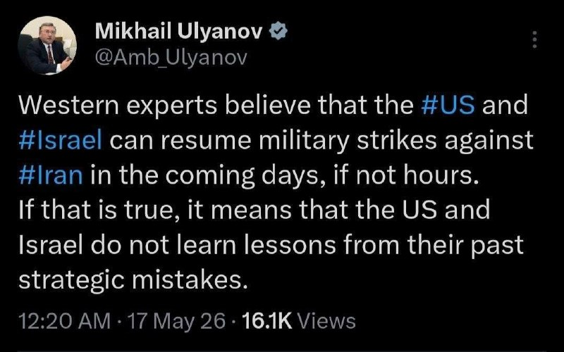

🔴اولیانوف نماینده دائم روسیه در سازمان‌های بین‌المللی:

به نظر کارشناسان غربی،آمریکا و اسرائیل ممکن است در روزهای آینده، اگه نگوییم ساعت‌های آینده، دوباره حمله نظامی به ایران رو از سر بگیرند. اگه این حرف درسته، یعنی این آمریکا و اسرائیل هنوز از اشتباهات استراتژیک قبلی خود درس نگرفته‌اند.
https://t.me/kianmeli1

## kianmeli1 — post 87441

  <a href="telegram/content/kianmeli1_87441_1779015329.mp4" target="_blank">🎬 Download video</a>

🔴حاجی بابایی، نائب رئیس مجلس

اگر به تاسیسات نفتی ایران حمله شود به تمام تاسیسات نفتی کشورهای دوست و دشمن در منطقه حمله می کنیم.
https://t.me/kianmeli1

## IranIntlTV — post 337604

  <a href="telegram/content/IranIntlTV_337604_1779015331.mp4" target="_blank">🎬 Download video</a>

اقتصادنیوز گزارش داد اینترنت پرو برای بسیاری از کاربران کارآمد نبوده است. بر اساس این گزارش، کاربران با پرداخت حدود دو میلیون تومان تنها ۵۰ گیگابایت اینترنت دریافت می‌کنند.

گفت‌وگو با سحر تحویلی، پژوهشگر در حوزه فناوری اطلاعات و هوش مصنوعی
@iranintltv

## IranIntlTV — post 337603

  <a href="telegram/content/IranIntlTV_337603_1779015332.mp4" target="_blank">🎬 Download video</a>

سرخط خبرهای یکشنبه ۲۷ اردیبهشت
@iranintltv

## IranIntlTV — post 337601

  

دفتر رسانه‌ای ابوظبی اعلام کرد که در پی حمله پهپادی به محوطه نیروگاه هسته‌ای براکه در الظفره، ژنراتور برق در خارج از محوطه داخلی نیروگاه دچار آتش‌سوزی شده است. این نهاد افزود که این حادثه آسیب جانی نداشته است.
https://iranintl.com/202605173331

## IranIntlTV — post 337600

  

دفتر رسانه‌ای ابوظبی اعلام کرد که در پی حمله پهپادی به محوطه نیروگاه هسته‌ای براکه در الظفره، ژنراتور برق در خارج از محوطه داخلی نیروگاه دچار آتش‌سوزی شده است. این نهاد افزود که این حادثه آسیب جانی نداشته است.
https://iranintl.com/202605173331

## IranIntlTV — post 337599

  <a href="telegram/content/IranIntlTV_337599_1779015335.mp4" target="_blank">🎬 Download video</a>

امیر قلعه‌نویی، سرمربی تیم فوتبال ایران، فهرست ۳۰ نفره اعزامی به جام جهانی ۲۰۲۶ آمریکا را اعلام کرد. در این فهرست نام سردار آزمون دیده نمی‌شود. اگرچه قلعه‌نویی تاکید کرده سردار آزمون به دلایل فنی از لیست کنار گذاشته شده است، اما پیش‌تر او به‌دلیل انتشار عکسی با حاکم دبی، از اردوهای تیم ملی کنار گذاشته شده و گزارش‌هایی از مصادره اموالش منتشر شده بود.
گفت‌وگو با کوروش بازیار، مربی فوتبال
@iranintltv

## IranIntlTV — post 337598

  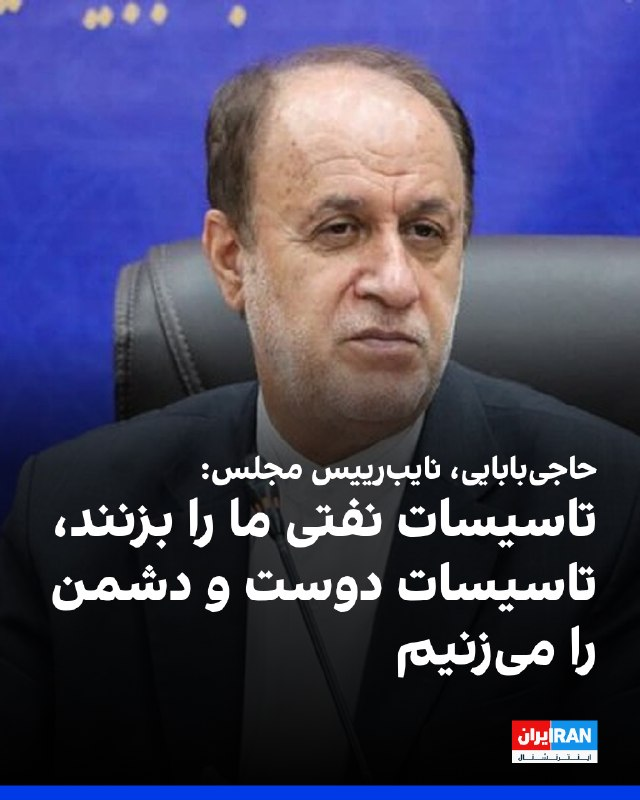

حمیدرضا حاجی‌بابایی، نایب‌رییس مجلس، گفت: «اگر قرار شد نفت ما را بزنند، باید نفت منطقه را بزنیم. چه آن‌که ادعای دوستی می‌کند، چه آن‌که دشمنی می‌کند.»

او گفت: «به نفت ما آسیب برسد، کاری می‌کنیم که آمریکا و تمام جهان تا مدت قابل توجهی از این منطقه نفت به دست نیاورد. اگر انرژی ما را بزنند، باید انرژی منطقه را بزنیم.»
https://iranintl.com/202605170342

## IranIntlTV — post 337597

  <a href="telegram/content/IranIntlTV_337597_1779015337.mp4" target="_blank">🎬 Download video</a>

تصاویر ارسالی به ایران‌اینترنشنال، از کمبود بنزین و اعمال محدودیت در برخی جایگاه‌های سوخت با هدف «مقابله با قاچاق» خبر می‌دهد. یک شهروند از بندرعباس می‌گوید بیش از چهار ساعت در صف بنزین منتظر بوده است.
جزییات بیشتر با مهدی تاجیک، عضو تحریریه ایران‌اینترنشنال
@iranintltv

## IranIntlTV — post 337596

  <a href="telegram/content/IranIntlTV_337596_1779015339.mp4" target="_blank">🎬 Download video</a>

یک شهروند با ارسال پیام به ایران‌اینترنشنال می‌گوید: «نان سنگک ساده شده ۱۷ هزار تومان، کنجدی هم شده ۲۵ هزار تومان. نانوایی‌ها ترفندی زده‌اند؛ نان بزرگ‌تری را با کنجد زیاد درست کرده و ۸۰ هزار تومان می‌فروشند. کسانی که حوصله صف ندارند، مجبورند همان نان گران را بخرند.»
پیام این شهروند با هوش مصنوعی بازخوانی شده است.

## Shin_Persian — post 6045

مكتب أبوظبي الإعلامي @ADMediaOffice
Sun, 17 May 2026 10:08:11 UTC

Authorities in Abu Dhabi responded to a fire incident that broke out in an electrical generator outside the inner perimeter of the Barakah Nuclear Power Plant in the Al Dhafra Region, caused by a drone strike. No injuries were reported, and there was no impact on radiological safety levels.

All precautionary measures have been taken, and further updates will be provided as they become available.

The Federal Authority for Nuclear Regulation (FANR) confirmed that the fire did not affect the safety of the power plant or the readiness of its essential systems, and that all units are operating as normal.

The public is reminded to obtain information from official sources only, and to avoid spreading rumours or unverified information.

فارسی

مقامات در ابوظبی به حادثه آتش‌سوزی در یک ژنراتور برق در خارج از محیط داخلی نیروگاه هسته‌ای برکه در منطقه الظفره که در پی یک حمله پهپادی رخ داد، رسیدگی کردند. هیچ گزارشی مبنی بر مصدومیت منتشر نشده است و این حادثه هیچ تأثیری بر سطح ایمنی رادیولوژیک نداشته است.

تمامی اقدامات پیشگیرانه اتخاذ شده است و به‌روزرسانی‌های تکمیلی به محض دردسترس بودن ارائه خواهد شد.

سازمان فدرال نظارت هسته‌ای (FANR) تأیید کرد که این آتش‌سوزی تأثیری بر ایمنی نیروگاه یا آمادگی سیستم‌های حیاتی آن نداشته و تمامی واحدها به صورت عادی در حال فعالیت هستند.

به عموم مردم یادآوری می‌شود که اطلاعات را تنها از منابع رسمی دریافت کرده و از انتشار شایعات یا اطلاعات تأیید نشده خودداری کنند.

𝕏 · @shin_persian

## ManotoTV — post 105551

  <a href="telegram/content/ManotoTV_105551_1779015341.mp4" target="_blank">🎬 Download video</a>

اعتراض به سانسور، قطعی اینترنت، سرکوب و حبس معترضان در تجمع ایرانیان قبرس جنوبی، شنبه ۲۶ اردیبهشت

## FarsiVOA — post 217956

  

شرکت اطلاعات کالا، کپلر، از عبور غیرمعمول یک سوپر نفتکش ایرانی با دو میلیون بشکه محموله نفتی از تنگه لومبوک برای رسیدن به چین خبر داده است.

این گزارش می‌افزاید نفتکش «هیوج» شرکت ملی نفت ایران اوایل ماه جاری سیستم شناسایی خودکار را خاموش کرده بود و اکنون ظاهراً برای دور زدن خطرات فزاینده ناشی از تشدید نظارت و اجرای تحریم‌ها در تنگه مالاکا، از تنگه لومبوک عبور کرده و احتمالاً به هنگ‌کنگ خواهد رفت.

کپلر می‌گوید نخستین بار نیز نفتکش «دریا» اخیراً برای گریز از نظارت‌های تحریمی، به‌جای مسیر سنتی تنگه مالاکا، از تنگه لومبوک عبور کرده بود.
@FarsiVOA

## FarsiVOA — post 217955

🔺قالیباف نماینده ویژه جمهوری اسلامی در امور چین شد

▪️رسانه‌های داخلی در ایران گزارش دادند که محمدباقر قالیباف رئیس مجلس شورای اسلامی، به عنوان نماینده ویژه جمهوری اسلامی در امور چین منصوب شده است.

▪️پیشتر و از خرداد ۱۴۰۴، عبدالرضا رحمانی فضلی، سفیر کنونی جمهوری اسلامی در پکن، در حکمی که به امضای پزشکیان رسیده بود، «نماینده ویژه رئیس‌جمهور و تام‌الاختیار ایران در چین» بود.

▪️قبل از آن نیز، علی لاریجانی به عنوان «نماینده ویژه رهبر جمهوری اسلامی در امور چین» فعال بود. لاریجانی در جریان جنگ اخیر کشته شد.

▪️قالیباف که تاکنون رسماً سمت دیپلماتیکی نداشته، پیشتر به عنوان رئیس هیئت مذاکره‌کننده جمهوری اسلامی در مذاکرات با آمریکا در اسلام‌آباد شرکت کرد.

⬇️ بیشتر بخوانید:
https://ir.voanews.com/a/8150871.html

## FarsiVOA — post 217954

🔺سی‌ان‌ان: جمهوری اسلامی چشم به کابل‌های اینترنت تنگه هرمز دوخته است

▪️سی‌ان‌ان گزارش داد جمهوری اسلامی، پس از استفاده از تنگه هرمز به‌عنوان اهرم فشار در حوزه انرژی و کشتیرانی، حالا به سراغ یکی از شریان‌های پنهان اقتصاد جهانی رفته است: کابل‌های اینترنت زیردریایی که از زیر خلیج فارس و تنگه هرمز عبور می‌کنند و حجم بزرگی از ترافیک داده، ارتباطات مالی و اتصال دیجیتال میان اروپا، آسیا و کشورهای خلیج فارس را منتقل می‌کنند.

▪️بر اساس این گزارش، جمهوری اسلامی می‌خواهد از بزرگ‌ترین شرکت‌های فناوری جهان برای استفاده از کابل‌های اینترنتی زیر تنگه هرمز پول بگیرد.

▪️کابل‌های عبوری از تنگه هرمز در سال ۲۰۲۵ کمتر از یک درصد پهنای باند بین‌المللی جهان را تشکیل می‌دادند.

⬇️ بیشتر بخوانید:
https://ir.voanews.com/a/8150870.html

## FarsiVOA — post 217953

  <a href="telegram/content/FarsiVOA_217953_1779015343.mp4" target="_blank">🎬 Download video</a>

جشن بزرگ موسیقی اروپا که به آن مسابقه یوروویژن گفته می‌شود، امسال در پایتخت اتریش، وین، برگزار شد.

نوعام بیتان که نماینده اسرائیل در مسابقات آواز یوروویژن امسال بود، برنده مقام دوم شد. صفحه رسمی وزارت امور خارجه اسرائیل به فارسی در ایکس، ضمن تبریک به او، از ایرانیان حامی نوعام نیز تشکر کرد و نوشت: «سپاس از حمایت شما ایرانیان دوست‌داشتنی».

دارا، خواننده بلغار مقام اول را کسب کرد. دور بعدی این مسابقات به میزبانی بلغارستان برگزار خواهد شد.
@FarsiVOA

## DW_Farsi — post 124790

🔶 اعلام وضعیت اضطراری بین‌المللی در پی شیوع بیماری ابولا

سازمان جهانی بهداشت (WHO) به دلیل شیوع بیماری ابولا در جمهوری دموکراتیک کنگو و اوگاندا، "وضعیت اضطراری بهداشت عمومی با اهمیت بین‌المللی" اعلام کرده است. این نهاد وابسته به سازمان ملل متحد در ژنو، با این اقدام قصد دارد از جمله کشورهای همسایه را در وضعیت هشدار بالا قرار داده و حمایت‌های جامعه بین‌المللی را بسیج کند. با این حال، سازمان جهانی بهداشت تصریح کرد که این یک "هشدار همه‌گیری جهانی" (پاندمی) نیست.

گزارش شده است که تاکنون ۸ مورد تاییدشده و ۲۴۶ مورد مشکوک به این بیماری تب‌دار و خطرناک در استان "ایتوری" در شمال شرقی کنگو شناسایی شده است. علاوه بر این، یک مورد ابتلا نیز در شهر "کینشاسا"، پایتخت کنگو که فاصله زیادی با کانون بیماری دارد، تایید شده است. همچنین دو فرد مبتلا از کنگو به اوگاندا سفر کرده‌اند. سازمان جهانی بهداشت از مرگ ۸۰ فرد مشکوک به ابولا در استان ایتوری تا این لحظه خبر داده است.

@dw_farsi

## Persian_Trend_Official — post 14321

  <a href="telegram/content/Persian_Trend_Official_14321_1779015346.webm" target="_blank">🎬 Download video</a>

پزشکیان: روز جهانی ارتباطات را تبریک می‌گویم

پزشکیان در شبکه اجتماعی
ایکس نوشت:

🔹‏در روزهای جنگ، فرزندان ما در ارتباطات و فناوری اطلاعات، شبانه‌روز ایستادند تا ارتباطات و خدمات حیاتی کشور پایدار بماند. دسترسی باکیفیت و پایدار مردم به خدمات دیجیتال، بخشی از آرامش، پیشرفت و حق زندگی شایسته مردم عزیز ایران است.

🔹روز جهانی ارتباطات را تبریک می‌گویم.

🫆:Tony

📌 @persian_trend_official
پرشین ترند | متفاوت‌ترین کانال نظامی

## Persian_Trend_Official — post 14320

  

🔴انفجار در امارات 💢منابع عربی اعلام کردند که انفجارهایی خیابان فاطمه بنت مبارک در ابوظبی را لرزاند. 🫆:Tony 📌 @persian_trend_official پرشین ترند | متفاوت‌ترین کانال نظامی

## Persian_Trend_Official — post 14319

  <a href="telegram/content/Persian_Trend_Official_14319_1779015347.webm" target="_blank">🎬 Download video</a>

🔴انفجار در امارات

💢منابع عربی اعلام کردند که انفجارهایی خیابان فاطمه بنت مبارک در ابوظبی را لرزاند.

🫆:Tony

📌 @persian_trend_official
پرشین ترند | متفاوت‌ترین کانال نظامی

## Persian_Trend_Official — post 14318

  

بقائی: آمریکا و اسرائیل خود عامل بی‌ثباتی در بازار انرژی هستند

اسماعیل بقائی، سخنگوی وزارت خارجه، ادعاهای آمریکا و اسرائیل درباره «حفظ ثبات بازار جهانی انرژی» را رد کرد و آن را «دروغی بزرگ» توصیف کرد.

بقائی گفت:

▪️ جنگی که آمریکا و اسرائیل آغاز کردند، روند دیپلماسی را نابود کرد
▪️ حمله نظامی به ایران باعث ناامنی در مسیرهای حیاتی انرژی شد
▪️ سپس ایران را به بی‌ثبات‌سازی متهم کردند

او با اشاره به آنچه «تاکتیک تبلیغاتی گوبلز» خواند، افزود:

▪️ «دیگران را به همان کاری متهم می‌کنند که خودشان انجام می‌دهند»

سخنگوی وزارت خارجه همچنین تأکید کرد:

▪️ آمریکا و اسرائیل ابتدا بحران و جنگ ایجاد می‌کنند
▪️ سپس با شعار «بازگرداندن ثبات» و «دفاع از صلح» به تشدید درگیری‌ها ادامه می‌دهند

بقائی در پایان گفت:

▪️ «آن‌ها ویرانی ایجاد می‌کنند و نامش را صلح می‌گذارند»

🫆:Tony

📌 @persian_trend_official
پرشین ترند | متفاوت‌ترین کانال نظامی

## Persian_Trend_Official — post 14317

  

📌انتشار چاپ پنجم کتاب «قدرت مذاکره» همراه با فصل جدید «دیپلماسی زیر آتش» 🔹کتاب قدرت مذاکره به قلم دکتر سید عباس عراقچی حاصل بیش از سی سال تجربه کاری نویسنده در وزارت امور خارجه است. 🔹در این کتاب تلاش میشود ضمن تبیین و تحلیل ماهیت مذاکره و مذاکره سیاسی،…

## Persian_Trend_Official — post 14316

🔴 رسانه‌های ایرانی جزئیات پاسخ واشینگتن به پیشنهاد توافق را منتشر کردند

رسانه‌های ایرانی مدعی شدند پاسخ آمریکا به پیشنهاد توافق با ایران شامل ۵ شرط اصلی بوده است:

▪️ آمریکا هیچ‌گونه غرامت یا خسارتی پرداخت نخواهد کرد

▪️ ۴۰۰ کیلوگرم اورانیوم از ایران خارج و به آمریکا تحویل داده شود

▪️ فقط یک مجموعه از تأسیسات هسته‌ای ایران فعال باقی بماند

▪️ حتی ۲۵ درصد از دارایی‌های بلوکه‌شده ایران نیز آزاد نخواهد شد
▪️ آتش‌بس در همه جبهه‌ها به روند مذاکرات گره بخورد

در این گزارش آمده است:

▪️ حتی در صورت پذیرش این شروط از سوی ایران، خطر حمله آمریکا و اسرائیل همچنان باقی خواهد ماند
▪️ برخی تحلیلگران ایرانی معتقدند واشینگتن به‌دنبال تحقق اهدافی است که در جنگ به آن نرسیده است

در مقابل، گزارش‌ها می‌گویند ایران نیز ۵ پیش‌شرط برای آغاز مذاکرات مطرح کرده است:

▪️ پایان جنگ در تمامی جبهه‌ها، به‌ویژه لبنان

▪️ رفع تحریم‌های ایران

▪️ آزادسازی دارایی‌های بلوکه‌شده ایران

▪️ پرداخت غرامت خسارات جنگ

▪️ به‌رسمیت شناختن حاکمیت ایران بر تنگه هرمز

تاکنون هیچ‌یک از این جزئیات به‌صورت رسمی از سوی تهران یا واشینگتن تأیید نشده‌اند.

🫆:Tony

📌 @persian_trend_official
پرشین ترند | متفاوت‌ترین کانال نظامی

## RadioFarda — post 157285

  

🔸رسانه‌های حکومتی در ایران روز یک‌شنبه ۲۷ اردیبهشت از برگزاری دادگاه صادق ساعدی‌نیا، مدیرعامل شرکت صنعت غذایی و مدیر کافه‌های زنجیره‌ای ساعدی‌نیا خبر دادند.

🔸آقای ساعدی‌نیا در پی اعتراضات دی‌ماه سال گذشته که در روزهای ۱۸ و ۱۹ دی به کشتار گسترده معترضان ختم شد بازداشت و به تحریک مردم برای شرکت در این اعتراضات متهم شد.

🔸نماینده دادستان در این دادگاه ساعدی‌نیا را به «فعالیت تبلیغی یا رسانه‌ای برخلاف امنیت کشور، اقدام عملیاتی برای گروه‌های معاند نظام و در راستای فراخوان‌های منتشر شده توسط این گروه‌ها، جهت برهم زدن امنیت و برخلاف امنیت کشور و فعالیت تبلیغی علیه نظام» متهم کرد.

🔸او در دفاع از خود گفته است:‌ «من هیچ یک از کارکنانم را برای شرکت در اغتشاشات ترغیب نکردم، از کرده خود پشیمانم و از دادگاه می‌خواهم به من فرصتی برای جبران بدهد.»

@RadioFarda

## IranianMinds — post 20274

🔴 دوباره به امارات حمله ی پهپادی کردن @IranianMinds

## IranianMinds — post 20273

  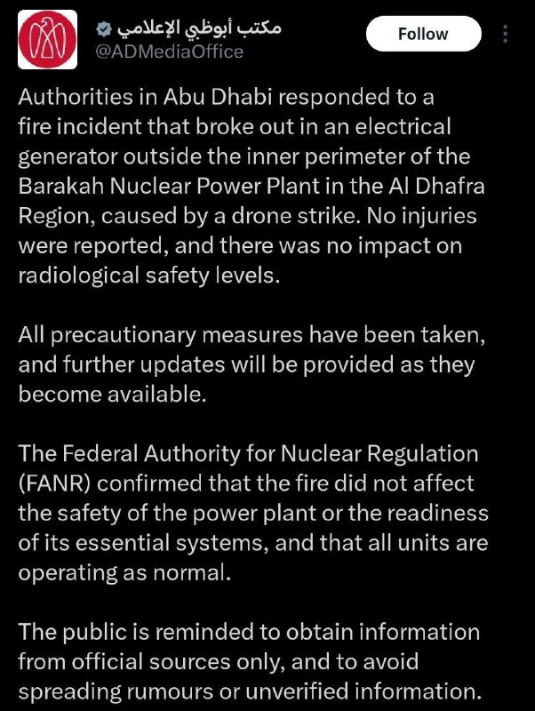

🔴 دوباره به امارات حمله ی پهپادی کردن

@IranianMinds

## IranianMinds — post 20272

  

🔴 ونزوئلا :

الکس صائب از نزدیکان رئیس جمهور سابق نیکولاس مادورو و رابط حزب الله و سپاه پاسداران جمهوری اسلامی رو دستگیر کردیم و به ایالات متحده تحویل دادیم !

@IranianMinds

## BBCPersian — post 281293

🔻سازمان مدیریت بحران تهران: ۵۱ هزار واحد در جریان جنگ در پایتخت آسیب دیدند

🔻رئیس سازمان پیشگیری و مدیریت بحران تهران اعلام کرد در جریان جنگ «۵۱ هزار واحد» آسیب‌دیده در پایتخت شناسایی شده است.

علی نصیری گفت که از این تعداد، «۶۹۱ واحد نیاز به مقاوم‌سازی دارند و ۱۷۹۱ واحد نیز باید به‌طور کامل تخریب و نوسازی شوند.»

او افزود ارزیابی میزان خسارت‌ها توسط کارشناسان رسمی دادگستری انجام می‌شود و در مواردی که خسارت تا سقف ۵۰۰ میلیون تومان باشد، کارت‌های الکترونیکی از سوی بانک شهر به مالکان پرداخت خواهد شد.

به گفته آقای نصیری، در خسارت‌های بالاتر از این رقم نیز شهرداری‌های مناطق موظف‌ هستند از طریق پیمانکار، عملیات بازسازی را به‌صورت مستقیم اجرا کنند.

او همچنین اعلام کرد بیش از «۱۲ هزار خودرو و موتورسیکلت» هم در جریان جنگ دچار آسیب شده‌اند.

https://bbc.in/43egGtC
@BBCPersian

## BBCPersian — post 281292

🔻امارات از حمله پهپادی و آتش‌سوزی در بیرون نیروگاه هسته‌ایش خبر داد

🔻مقام‌های ابوظبی می‌گویند آتش‌سوزی ناشی از حمله یک پهپاد به یک ژنراتور برق در بیرون محدوده نیروگاه هسته‌ای براکه کنترل شده است.

دفتر رسانه‌ای ابوظبی گفت در این حادثه کسی آسیب ندیده است و سطح ایمنی پرتوهای رادیواکتور نیز تغییری نکرده است.

سازمان تنظیم مقررات هسته‌ای امارات هم با تایید این خبر اعلام کرد که نیروگاه به کار عادی خود ادامه می‌دهد.

نیروگاه هسته‌ای براکه در منطقه ظفره امارات اولین نیروگاه هسته‌ای در جهان عرب است و از چهار رآکتور تشکیل شده است.

ایران امارات را در حملات آمریکا و اسرائیل شریک فعال می‌داند.

https://bbc.in/4wBwOTv
@BBCPersian

## BBCPersian — post 281291

  

🔻سخنگوی نیروی‌های مسلح ایران درباره ازسرگیری حملات آمریکا گفت که پاسخ ایران این بار «هجومی‌تر» و «غافلگیرکننده» خواهد بود.
ابوالفضل شکارچی گفت: «تکرار هرگونه حماقت برای جبران بی‌آبرویی آمریکا در جنگ تحمیلی سوم علیه ایران، پیامدی جز دریافت ضربات کوبنده‌تر و شدیدتر برای آن کشور به‌دنبال نخواهد داشت.»
او تهدید کرد که «در صورت عملی شدن تهدیدها»، پاسخ ایران «هجومی، غافلگیرکننده و طوفانی» خواهد بود.
ساعاتی پیش دونالد ترامپ در شبکه اجتماعی تروث سوشال تصویر گرافیکی از خود در کنار یک فرمانده نظامی آمریکا منتشر کرد و نوشت: «آرامش پیش از طوفان»
در دو روز گذشته برخی رسانه‌های آمریکا و اسرائیل از قریب‌الوقوع بودن حملات به ایران خبر داده‌اند.

📸Erfan Kouchari/Tasnim
https://bbc.in/4dw4TMb
@BBCPersian

## BBCPersian — post 281290

🔻گزارش‌هایی از رد و بدل پیام و شروط ایران و آمریکا برای از سرگیری مذاکرات

🔻خبرگزاری فارس می‌گوید که آمریکا در پاسخ به پیشنهاد ایران پنج شرط تعیین کرده است. به گزارش این خبرگزاری که به نهادهای نظامی و امنیتی نزدیک است این پنج شرط عبارتند از:

-نپرداختن غرامت جنگی به ایران
-تحویل اورانیوم غنی‌شده
-حفظ تنها یک مرکز هسته‌ای
-نپراختن حتی ۲۵ درصد از دارایی‌های بلوکه شده ایران
-توقف جنگ در همه جبهه‌ها مشروط به مذاکرات خواهد بود

فارس نوشت «حتی در صورت تحقق این شرایط از سوی ایران، تهدید» حمله آمریکا و اسرائیل «همچنان پابرجا خواهد بود.»

فارس همچنین شروط پنج گانه ایران را چنین عنوان کرد:

-پایان جنگ در همه جبهه‌ها به‌ویژه لبنان
-رفع تحریم‌ها
-آزادسازی پول‌های بلوکه‌شده ایران
-جبران خسارات جنگ
-پذیرش حق حاکمیت ایران بر تنگه هرمز

در همین حال برخی رسانه‌های ایران گزارش دادند که تهران «بعد از دریافت مجموعه‌ای از پیشنهادهای طرف آمریکایی از سوی میانجی پاکستانی، شب گذشته دیدگاه‌های خود را به طرف پاکستانی منعکس کرده است.»

این گزارش‌های یک روز پس از سفر محسن نقوی، وزیر کشور پاکستان، به تهران منتشر می‌شود. گفته شد سفر او به تهران برای انتقال پیام بوده است.

https://bbc.in/4ukgfKi
@BBCPersian

## BBCPersian — post 281289

🔻سخنگوی نیروی‌های مسلح: پاسخ ایران به حمله آمریکا غافلگیرانه و هجومی‌تر خواهد بود

🔻سخنگوی نیروی‌های مسلح ایران درباره ازسرگیری حملات آمریکا گفت که پاسخ ایران این بار «هجومی‌تر» و «غافلگیرکننده» خواهد بود.

ابوالفضل شکارچی گفت: «تکرار هرگونه حماقت برای جبران بی‌آبرویی آمریکا در جنگ تحمیلی سوم علیه ایران، پیامدی جز دریافت ضربات کوبنده‌تر و شدیدتر برای آن کشور به‌دنبال نخواهد داشت.»

او تهدید کرد که «در صورت عملی شدن تهدیدها»، پاسخ ایران «هجومی، غافلگیرکننده و طوفانی» خواهد بود.

ساعاتی پیش دونالد ترامپ در شبکه اجتماعی تروث سوشال تصویر گرافیکی از خود در کنار یک فرمانده نظامی آمریکا منتشر کرد و نوشت: «آرامش پیش از طوفان»

در دو روز گذشته برخی رسانه‌های آمریکا و اسرائیل از قریب‌الوقوع بودن حملات به ایران خبر داده‌اند.

https://bbc.in/4drWKIr
@BBCPersian

## BBCPersian — post 281288

  

🔻خبرگزاری تسنیم می‌گوید که محمد باقر قالیباف با پیشنهاد رئیس‌جمهور و تایید رهبر جمهوری اسلامی «نماینده ویژه ایران در امور چین» شده است.

این خبرگزاری که به نهادهای نظامی و امنیتی نزدیک است نوشت رئیس مجلس «هماهنگ‌کننده بخش‌های مختلف این کشور در ارتباط با چین» خواهد بود و سطح اختیارات آقای قالیباف با نمایندگان قبلی در امور چین «متفاوت» است.

بنابر این گزارش‌، پیش از این علی لاریجانی به عنوان نماینده ویژه رهبر ایران و عبدالرضا رحمانی فضلی به عنوان نماینده رئیس‌جمهور در امور‌ چین فعالیت می‌کردند.

آقای لاریجانی از طرف آیت‌الله علی خامنه‌ای نقش ویژه‌ای «در مدیریت قرارداد راهبری» ایران و چین به عهده داشت.

سال گذشته مسعود پزشکیان حسن رحمانی فضلی، سفیر ایران در پکن را همزمان به‌عنوان نماینده ویژه رئیس جمهور و تام‌الاختیار جمهوری اسلامی در چین منصوب کرد.

علی لاریجانی، دبیر شورای عالی امنیت ملی، در ۱۷ مارس (۲۶ اسفند) در حملات آمریکا و اسرائیل به ایران کشته شد.

📸Morteza Nikoubazl/NurPhoto via Getty Images
https://bbc.in/3PHjWut
@BBCPersian

## Dirty_Kids — post 389603

  <a href="telegram/content/Dirty_Kids_389603_1779015351.mp4" target="_blank">🎬 Download video</a>

یه مشت پیرزن پیرمرد چروک گوزو و بچه‌ چاقال مسجدی جمع کردن توی مساجد،یکی یه آرپی‌جی و کلاش دادن دستشون که یعنی آموزش ببینند،واسه چی؟مثلآ جنگ با آمریکا و اسرائیل، آخه احمقا با این سیرک شماها جنگجو شدید؟خیر
رژیم روزای آخر بد به دریوزگی افتاده

@Dirty_Kids 👻

## Dirty_Kids — post 389602

  <a href="telegram/content/Dirty_Kids_389602_1779015353.mp4" target="_blank">🎬 Download video</a>

جان تراولتای هفتاد و دو ساله یا اکسیر جوونی رو پیدا کرده یا کار دکترش خیلی درسته، ولی چیزی که خیلی جالبه اکت و تیز بودنشه، حرکاتش یه جوریه انگار چهل سالشه.

@Dirty_Kids 👻

## Dirty_Kids — post 389601

  

🌪وقتی اینترنت طوفانیه... کافیه بادبان ها رو بکشی تا

⚫️با بالاترین کیفیت ممکن
⚡️ 

⚫️100 هزار تومان شارژ هدیه 
🎁

⚫️پایین ترین قیمت گیگی 250
🌐 

⚫️و ارائه پورسانت %10 در ازای هر معرفی
💼

بتونی یه اتصال پایدار با پشتیبانی 24 ساعته داشته باشی
🚀

بادبان راهتو باز می‌کنه
⛵️

R27

🛡@BadBan_VPN | کانال 

🤖@BadBan_VPNBot | ربات 

📞@BadBan_VPNSupport | پشتیبانی

## Hranews — post 112985

واژگونی اتوبوس حامل کارگران مجتمع گاز پارس جنوبی به مرگ ۸ کارگر انجامید

❗️
❗️
❗️
❗️
❗️ – در اثر حادثه واژگونی یک دستگاه اتوبوس حامل کارکنان مجتمع گاز پارس جنوبی، در جاده عسلویه به سیراف، هشت #کارگر جان خود را از دست دادند.

ادامه مطلب

↘️
@hranews_bot تماس ✉️ -  @Hranews  کانال هرانا 🆑

## Hranews — post 112984

امروز یکشنبه ۲۷ اردیبهشت‌ماه، شماری از بازنشستگان تامین اجتماعی در مقابل ساختمان این سازمان در شوش دست به #تجمع اعتراضی زدند.

این تجمع در اعتراض به تاخیر بیش از دو ماهه در افزایش حقوق سالانه موضوع ماده ۹۶، بی‌تفاوتی نسبت به تعیین و ابلاغ حق مسکن و همچنین عدم اجرای قانون الزام در بخش درمان صورت گرفته است.

↘️
@hranews_bot تماس ✉️ -  @Hranews  کانال هرانا 🆑

## Hranews — post 112983

  

رئیس دانشکده علوم اجتماعی، ارتباطات و رسانه، نسبت به پیامدهای اجرای طرح «#اینترنت_پرو» هشدار داد و آن را عاملی در جهت تشدید #شکاف_اجتماعی دانست. وی در گفت‌وگو با ایسنا، با انتقاد از نحوه اجرای این طرح، اعلام کرد که شکل فعلی آن بدون شفاف‌سازی، به نمادی از تبعیض، رانت و بی‌عدالتی تبدیل شده و می‌تواند اعتماد عمومی و سرمایه اجتماعی را تضعیف کند.

اکبر نصراللهی اعلام کرد که تداوم محدودیت‌های اینترنتی در حالی که دسترسی مشابه در قبال پرداخت هزینه برای برخی افراد فراهم است، نوعی تناقض در سیاست‌گذاری محسوب می‌شود که در صورت عدم تبیین، می‌تواند به افزایش نارضایتی عمومی و تضعیف انسجام اجتماعی منجر شود. وی همچنین تاکید کرد که اینترنت به عنوان بخشی از زیرساخت حیاتی کشور، نقش مهمی در حوزه‌هایی چون آموزش، سلامت و اقتصاد دارد و تداوم محدودیت‌ها آثار گسترده‌ای بر زندگی روزمره شهروندان خواهد داشت.

↘️
@hranews_bot تماس ✉️ -  @Hranews  کانال هرانا 🆑

## Hranews — post 112982

اردبیل؛ یک محیط‌بان در پی درگیری با متخلف محیط زیستی مجروح شد

❗️
❗️
❗️
❗️
❗️ – یک #محیط_بان در منطقه حفاظت شده نئور استان اردبیل در جریان درگیری با یک صیاد متخلف زخمی شد.

ادامه مطلب

↘️
@hranews_bot تماس ✉️ -  @Hranews  کانال هرانا 🆑

## Hranews — post 112981

اعتراضات ۱۴۰۴؛ جلسه دادگاه رسیدگی به اتهامات صادق ساعدی‌نیا برگزار شد

❗️
❗️
❗️
❗️
❗️ – مرکز رسانه قوه قضاییه از برگزاری جلسه دادگاه رسیدگی به اتهامات صادق ساعدی‌نیا، یکی از بازداشت شدگان مرتبط با اعتراضات سراسری ۱۴۰۴، در دادگاه انقلاب قم خبر داد.

ادامه مطلب

#صادق_ساعدی‌نیا

↘️
@hranews_bot تماس ✉️ -  @Hranews  کانال هرانا 🆑

## manototv — post 105551

  <a href="telegram/content/manototv_105551_1779015355.mp4" target="_blank">🎬 Download video</a>

اعتراض به سانسور، قطعی اینترنت، سرکوب و حبس معترضان در تجمع ایرانیان قبرس جنوبی، شنبه ۲۶ اردیبهشت

## alonews — post 120576

  <a href="telegram/content/alonews_120576_1779015356.webm" target="_blank">🎬 Download video</a>

👈عارف معاون پزشکیان: ما تا حد امکان قیمت کالاها را مهار می‌کنیم و بقیه آن به مسائل بین‌المللی بازمی‌گردد!

✅ @AloNews خبر جنگ

## alonews — post 120575

  <a href="telegram/content/alonews_120575_1779015357.webm" target="_blank">🎬 Download video</a>

👈روزنامه Dawn پاکستان به نقل از منابع دیپلماتیک در اسلام‌آباد: سفر اعلام‌نشده وزیر کشور پاکستان به تهران در چارچوب دیپلماسی مستمر اسلام‌آباد برای احیای روند متوقف‌شده صلح میان آمریکا و ایران انجام می‌شود.

🔴این سفر برنامه‌ریزی‌نشده با هدف جلوگیری از فروپاشی کامل مذاکرات صورت گرفته؛ به‌ویژه پس از آنکه شتاب حاصل از دورهای پیشین گفت‌وگوها در پایتخت پاکستان به‌شدت کاهش یافته است.

🔴انتظار می‌رود وزیر کشور پاکستان، در جریان این سفر با مقام‌های ارشد ایرانی دیدار و گفت‌وگو کند.

✅ @AloNews خبر جنگ

## alonews — post 120574

  <a href="telegram/content/alonews_120574_1779015357.webm" target="_blank">🎬 Download video</a>

👈رئیس‌جمهور در شبکه اجتماعی ایکس نوشت: ‏در روزهای جنگ، فرزندان ما در ارتباطات و فناوری اطلاعات، شبانه‌روز ایستادند تا ارتباطات و خدمات حیاتی کشور پایدار بماند. دسترسی باکیفیت و پایدار مردم به خدمات دیجیتال، بخشی از آرامش، پیشرفت و حق زندگی شایسته مردم عزیز ایران است.

🔴روز جهانی ارتباطات را تبریک می‌گویم.

✅ @AloNews خبر جنگ

## alonews — post 120573

  <a href="telegram/content/alonews_120573_1779015357.webm" target="_blank">🎬 Download video</a>

👈اقتصاد اسرائیل در سه ماهه اول سال ۲۰۲۶ به دلیل جنگ با ایران ۳.۳٪ کوچک شد، طبق گزارش کانال ۱۲ اسرائیل

✅ @AloNews خبر جنگ

## alonews — post 120572

  <a href="telegram/content/alonews_120572_1779015357.webm" target="_blank">🎬 Download video</a>

👈گزارش سی ان ان از کابل هایی که زیر تنگه هرمز خوابیده!

🔴 مدیر تحقیقات شرکت تحقیقاتی TeleGeography، گفت که دو مورد از این کابل‌ها، فالکون و گلف بریج اینترنشنال (GBI)، از آب‌های سرزمینی ایران عبور می‌کنند. این شرکت اعلام کرده:کابل‌هایی که از تنگه هرمز عبور می‌کنند، تا سال 2025 کمتر از 1 درصد از پهنای باند بین‌المللی جهانی را تشکیل می‌دهند."

✅ @AloNews خبر جنگ

## alonews — post 120571

  <a href="telegram/content/alonews_120571_1779015357.webm" target="_blank">🎬 Download video</a>

👈دفتر رسانه ای ابوظبی : یه پهپاد نیروگاه هسته ای برکه تو منطقه الظفره رو هدف قرار داد 
✅ @AloNews خبر جنگ

## alonews — post 120570

  <a href="telegram/content/alonews_120570_1779015358.webm" target="_blank">🎬 Download video</a>

👈امارات اعلام کرد: آتش‌سوزی ناشی از حمله پهپادی به یک ژنراتور برق در نزدیکی تاسیسات هسته‌ای براکه

✅ @AloNews خبر جنگ

## alonews — post 120569

  <a href="telegram/content/alonews_120569_1779015358.webm" target="_blank">🎬 Download video</a>

🔴جلیلی سوم!

🔴پس از سعید جلیلی در سیاست خارجی و تحریم و قطعنامه؛ پس از وحید جلیلی در صداوسیما و سقوط مخاطب و مرجعیت؛ یک جلیلی دیگر هم چند سالی است بر زندگی شهروندان سایه انداخته.

🔴رسول جلیلی، عضو شورای عالی فضای مجازی و مدافع فیلترینگ؛ کسی که اینستاگرام و تلگرام را اف-۳۵ و اف-۱۵ می‌بیند.

✅@AloNews

## alonews — post 120568

  <a href="telegram/content/alonews_120568_1779015358.webm" target="_blank">🎬 Download video</a>

👈دفتر رسانه ای ابوظبی : یه پهپاد نیروگاه هسته ای برکه تو منطقه الظفره رو هدف قرار داد

✅ @AloNews خبر جنگ

## alonews — post 120567

  <a href="telegram/content/alonews_120567_1779015358.webm" target="_blank">🎬 Download video</a>

👈پزشکیان: نباید با آمار غیرواقعی جامعه را ناامید یا شرایط را عادی جلوه داد؛ اگر اینگونه القا شود که دولت عامدانه در مسیر افزایش قیمت‌ها حرکت می‌کند، ناجوانمردانه است

✅ @AloNews خبر جنگ

## alonews — post 120566

  <a href="telegram/content/alonews_120566_1779015359.webm" target="_blank">🎬 Download video</a>

👈برخی منابع خبری از انفجارهای مهیب در پایتخت امارات خبر دادند ولی علت انفجارها مشخص نیست

✅ @AloNews خبر جنگ

## alonews — post 120565

  <a href="telegram/content/alonews_120565_1779015359.webm" target="_blank">🎬 Download video</a>

👈نروژ مرفه ترین کشور جهان تو سال ۲۰۲۶ شد نروژ این جایگاه رو بخاطر درآمد عالی،وضعیت خوب مردم،آموزش،ثبات اقتصادی و اعتماد عمومی بدست آورد.

✅ @AloNews خبر جنگ

## alonews — post 120564

  <a href="telegram/content/alonews_120564_1779015359.webm" target="_blank">🎬 Download video</a>

👈حدود ۳۰ هزار نفر در فورتزهایم آلمان پس از کشف یک بمب ۱.۸ تنی منفجر نشده مربوط به جنگ جهانی دوم توسط کارگران در حین کار ساختمانی، تخلیه شده‌اند.

🔴مقامات یک منطقه ممنوعه ۱.۵ کیلومتری ایجاد کردند زیرا تیم‌های خنثی‌سازی بمب آماده خنثی‌سازی بمبی بودند که طبق گزارش‌ها حاوی حدود ۱.۳۵ تن مواد منفجره است.

✅ @AloNews خبر جنگ

## alonews — post 120563

  <a href="telegram/content/alonews_120563_1779015359.webm" target="_blank">🎬 Download video</a>

👈نتانیاهو قراره ساعت ۶ عصر به وقت محلی یه جلسه امنیتی محدود برگزار کنه

✅ @AloNews خبر جنگ

## alonews — post 120562

  <a href="telegram/content/alonews_120562_1779015359.webm" target="_blank">🎬 Download video</a>

🔴این حاج خانوم که تو خرابه های غزه داره قدم میزنه اينترنت پر سرعت داره ولی من ایرانی نه

✅@AloNews

## alonews — post 120561

  <a href="telegram/content/alonews_120561_1779015360.webm" target="_blank">🎬 Download video</a>

👈وزارت کره جنوبی : کره جنوبی و ایران به گفت‌وگوها برای تضمین امنیت تنگه هرمز ادامه میدن

✅ @AloNews خبر جنگ

## alonews — post 120560

  <a href="telegram/content/alonews_120560_1779015360.mp4" target="_blank">🎬 Download video</a>

👈حاجی بابایی، نائب رئیس مجلس: اگر قرار باشد به نفت ما آسیبی برسد، کاری می‌کنیم که آمریکا و دنیا تا مدت قابل توجهی، از این منطقه نفتی گیرشان نیاید

✅ @AloNews خبر جنگ

## alonews — post 120559

  <a href="telegram/content/alonews_120559_1779015362.mp4" target="_blank">🎬 Download video</a>

👈پارسا تاجیک، مهندس شرکت «ایکس ای‌آی»، درباره روند تغییر پرچم جمهوری اسلامی به شیروخورشید در شبکه اجتماعی ایکس، توییتر سابق، توضیح داد.

✅@AloNews

## alonews — post 120558

  <a href="telegram/content/alonews_120558_1779015364.webm" target="_blank">🎬 Download video</a>

👈وزارت نیرو: تغییر ساعت رسمی بیش از هزار مگاوات صرفه‌جویی در مصرف برق به همراه دارد

✅ @AloNews خبر جنگ

---
📅 بروزرسانی: 1405/02/27 12:53
---

## VahidOOnLine — post 240599

♦️ویدیوهای منتشرشده در شبکه‌های اجتماعی که گفته می‌شود مربوط به جزیره مارو (شیدور) و مناطق اطراف جزیره لاوان است، آلودگی گسترده نفتی در آب‌ها و سواحل خلیج فارس را در روز جمعه ۲۵ اردیبهشت نشان می‌دهد. در این تصاویر، لکه‌های وسیع نفتی، تغییر رنگ آب دریا و آلودگی شدید نوار ساحلی قابل مشاهده است.
خبرگزاری رویترز نیز با استناد به تصاویر ماهواره‌ای ثبت‌شده از وقوع یک نشت نفتی گسترده در نزدیکی جزیره خارگ، مهم‌ترین پایانه صادرات نفت ایران، خبر داده است. بر اساس این گزارش، لکه نفتی مشاهده‌شده در تصاویر ماهواره‌های کوپرنیک، منطقه‌ای حدود ۴۵ تا ۹۵ کیلومتر مربع را در غرب جزیره خارگ پوشش داده است.
فعالان محیط زیست و کاربران شبکه‌های اجتماعی، وضعیت جزیره مارو (شیدور) معروف به «مالدیو ایران» را «فاجعه‌بار» توصیف کرده‌اند. برخی گزارش‌ها علت این آلودگی را حملات انجام‌شده به تاسیسات نفتی جزیره لاوان در فروردین‌ماه عنوان می‌کنند.
در برخی ویدیوهای منتشرشده، علاوه بر آب‌های آلوده، تصاویری از دود و انفجار در جزیره نیز دیده می‌شود. گفته می‌شود این حملات توسط امارات متحده عربی انجام شده است.
‌🇸🇦 Indypersian

🤖 @VahidOOnLine

## VahidOOnLine — post 240598

  

♦️علاءالدین بروجردی، عضو کمیسیون امنیت ملی مجلس روز یکشنبه درباره مذاکرات با آمریکا گفت:  جمهوری اسلامی ایران از حقوق خود در تنگه هرمز و همچنین مسائل هسته‌ای کوتاه نمی‌آید.

بروجردی  با بیان اینکه مذاکره بدون پذیرش شروط ایران بی‌معناست، گفت: «طرف مقابل باید بپذیرد که جمهوری اسلامی حاکم بر تنگه هرمز است. بدانند که موضوع هسته‌ای هیچ ارتباطی با آمریکا ندارد و به هیچ‌وجه حاضر نیستیم از آن کوتاه بیاییم.»

این عضو کمیسیون امنیت ملی مجلس درباره شروط جمهوری اسلامی برای حضور در مذاکرات، گفت: «آنها باید بپذیرند که هرگونه توافق در مذاکرات احتمالی آینده، توافق با کل جبهه مقاومت اعم از لبنان، عراق و یمن خواهد بود. اگر این قواعد را قبول نداشته باشند، ورود به مذاکره بی‌فایده خواهد بود.»

علاءالدین بروجردی همچنین تاکید کرد که «آنها باید بپذیرند اموال بلوکه‌شده آزاد شود و تحریم‌ها برداشته شوند. پذیرش این شروط الزامی است.»

این اظهارات در حالی مطرح شده است که دونالد ترامپ، روز شنبه ۲۶ اردیبهشت به جمهوری اسلامی هشدار داد که اگر به‌زودی بر سر یک توافق صلح موافقت نکند، «دوران بسیار سختی» را پیش رو خواهد داشت.
‌🇸🇦 Indypersian

🤖 @VahidOOnLine

## VahidOOnLine — post 240597

  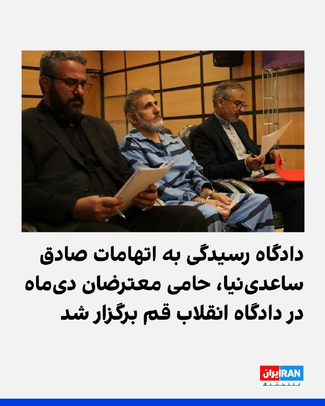

خبرگزاری میزان، رسانه قوه قضاییه جمهوری اسلامی، از برگزاری نخستین جلسه دادگاه رسیدگی به اتهامات صادق ساعدی‌نیا، مدیرعامل مجموعه «املاک و صنایع ساعدی‌نیا» و از حامیان اعتصاب‌ها و اعتراضات دی‌ماه، در دادگاه انقلاب قم خبر داد.
طبق این گزارش، ساعدی‌نیا با اتهاماتی از جمله «فعالیت تبلیغی یا رسانه‌ای برخلاف امنیت کشور»، «اقدام عملیاتی در راستای فراخوان‌های گروه‌های معاند برای برهم زدن امنیت کشور» و «فعالیت تبلیغی علیه نظام» روبه‌رو است.
انتشار استوری، فعالیت در فضای مجازی، حضور در تجمعات اعتراضی، تعطیل کردن کافه‌ها و مغازه‌های متعلق به خود و تشویق برخی کارکنانش به حضور در اعتراضات از مصادیق اتهامات مطرح‌شده علیه او عنوان شده است.
نماینده دادستان، مواردی مانند فعالیت‌های ساعدی‌نیا در فضای مجازی، تهیه کلیپی از یکی از کارکنانش با نوشته «جاوید شاه» روی دست، ایجاد و مدیریت گروه واتساپی کارکنان کافه‌ها، انتشار پیام صوتی درباره خاموش کردن گوشی برای جلوگیری از ردیابی، حضور برخی کارکنان در اعتراضات و برنامه‌ریزی برای تعطیلی کافه‌ها و کارخانه‌ها همزمان با فراخوان‌های اعتراضی را از مصادیق اتهامات مطرح‌شده علیه او عنوان کرد.
‌🏁 🇬🇧 IranintlTV

🤖 @VahidOOnLine

## VahidOOnLine — post 240596

  

ابوالفضل شکارچی، سخنگوی ارشد نیروهای مسلح جمهوری اسلامی، گفت که دونالد ترامپ باید بداند در صورت عملی شدن تهدیدها و حمله مجدد به جمهوری اسلامی، دارایی‌ها و ارتش آمریکا با «سناریوهای جدید، هجومی، غافلگیرکننده و طوفانی» روبه‌رو خواهند شد و در «باتلاق خودساخته‌» فرو خواهند رفت.
‌🏁 🇬🇧 IranintlTV

🤖 @VahidOOnLine

## VahidOOnLine — post 240595

  <a href="telegram/content/VahidOOnLine_240595_1779009839.mp4" target="_blank">🎬 Download video</a>

‌🏁 🇬🇧 ManotoTV

🤖 @VahidOOnLine

## VahidOOnLine — post 240594

🗣روایت شما از زندگی در آتش‌بس- یکشنبه۲۷ اردیبهشت ۱۴۰۵

🔹چیزی به اسم ساعت مرگ شنیدین؟ ساعتی که همه‌چیز، از جمله انگیزه از بین میره. برای من، اون روزی بود که مجبور شدم به خاطر شرایط تحمیل‌شده، ۶ نفر از ۱۴ نفر از نیروهام رو تعدیل کنم.

🔹هنوز نتونستم میوه این فصل رو به دلیل قیمت‌های وحشتناک گرون برای خانواده بخرم؛ توت‌فرنگی، گوجه‌سبز و زردآلو.

🔹قبل از جنگ می‌خواستم یه هارد بخرم، ۵۰ میلیون تومان بود و الان شده ۱۶۰ میلیون تومان.

🔹نان سنگک ساده شده ۱۷ هزار تومان، کنجدی هم شده ۲۵ هزار تومان. نانوایی‌ها یه ترفند زدن؛ یک نون بزرگ‌تر با کنجد زیاد درست کردن به قیمت ۸۰ هزار تومان می‌فروشن. کسانی که حوصله صف ندارن، مجبورن همون نون گرون رو بخرن.

🔹من خانم هستم و آتلیه عروسی داشتم. شغل ما همیشه زیر سایه تهدید شدید اماکن بوده و اجازه گذاشتن نمونه‌ کار نداشتیم. الان با این گرونی و قطعی اینترنت کلا نابود شدیم، چون هیچ عروسی برگزار نمی‌شه.

🔹من تریدرم و از وقتی اینترنت قطع شده، درآمد ندارم. چند سال زحمت کشیدم اما تریدینگ‌ویو، ابزار کارم باز نمی‌شه. برای ترید نیاز به اینترنت پایدار و آرامش دارم که هیچ‌کدوم نیست.

🔹در بلوچستان هر ۲۰ لیتر بنزین آزاد، بین یک میلیون و ۳۰۰ هزار تومان تا یک میلیون و ۵۰۰ هزار تومان هست؛ یعنی حدودا لیتری ۶۰ تا ۷۰ هزار تومان.

🔹دارم خونه می‌سازم و هر لحظه قیمت‌ها بیشتر می‌شه. کل هزینه ساختن تا قبل از عید یک میلیارد و نیم بود اما الان کابینت جنس معمولی شده یک میلیارد تومان.
‌🏁 🇬🇧 IranintlTV

🤖 @VahidOOnLine

## VahidOOnLine — post 240593

  

♦️کمیته آزادی آکادمیک وابسته به انجمن ایران‌پژوهی (AIS) با انتشار بیانیه‌ای رسمی خطاب به مقام‌های ارشد سازمان ملل، اتحادیه اروپا و ایالات متحده، نسبت به آنچه «هدف قرار گرفتن سیستماتیک دانشگاه‌ها، مدارس و مراکز پژوهشی ایران» در جریان جنگ اخیر خوانده، هشدار داد.
در این بیانیه که برای مقام‌هایی از جمله ولکر تورک، کمیسر عالی حقوق بشر سازمان ملل، آدری آزولای، مدیرکل یونسکو و مارکو روبیو، وزیر خارجه آمریکا ارسال شده، آمده است که مراکز آموزشی و پژوهشی ایران به «خط مقدم جنگ» تبدیل شده‌اند و حمله به آن‌ها نقض آشکار قوانین بشردوستانه بین‌المللی و کنوانسیون ژنو محسوب می‌شود.
بر اساس آمار ارائه‌شده در این گزارش، تنها در فاصله اسفند ۱۴۰۴ تا فروردین ۱۴۰۵، بیش از ۲۱ دانشگاه در ایران هدف حملات قرار گرفته‌اند و ۱۵۴ ساختمان و مرکز دانشگاهی آسیب دیده یا تخریب شده‌اند.
‌🇸🇦 Indypersian

🤖 @VahidOOnLine

## VahidOOnLine — post 240592

  

علاءالدین بروجردی، عضو کمیسیون امنیت ملی مجلس، درباره مذاکرات با آمریکا، گفت: «طرف مقابل باید بپذیرد که جمهوری اسلامی حاکم بر تنگه هرمز است. بدانند که موضوع هسته‌ای هیچ ارتباطی با آمریکا ندارد و به هیچ‌وجه حاضر نیستیم از آن کوتاه بیاییم.»

بروجردی درباره شروط جمهوری اسلامی برای حضور در مذاکرات، گفت: «آنها باید بپذیرند که هرگونه توافق در مذاکرات احتمالی آینده، توافق با کل جبهه مقاومت اعم از لبنان، عراق و یمن خواهد بود. اگر این قواعد را قبول نداشته باشند، ورود به مذاکره بی‌فایده خواهد بود.»

عضو کمیسیون امنیت ملی گفت: «آنها باید بپذیرند که اموال بلوکه‌شده آزاد شود. همچنین باید تحریم‌ها برداشته شوند. پذیرش این شروط الزامی است.»
‌🏁 🇬🇧 IranintlTV

🤖 @VahidOOnLine

## VahidOOnLine — post 240591

  

علاءالدین بروجردی، عضو کمیسیون امنیت ملی مجلس، درباره مذاکرات با آمریکا، گفت: «طرف مقابل باید بپذیرد که جمهوری اسلامی حاکم بر تنگه هرمز است. بدانند که موضوع هسته‌ای هیچ ارتباطی با آمریکا ندارد و به هیچ‌وجه حاضر نیستیم از آن کوتاه بیاییم.»

بروجردی درباره شروط جمهوری اسلامی برای حضور در مذاکرات، گفت: «آنها باید بپذیرند که هرگونه توافق در مذاکرات احتمالی آینده، توافق با کل جبهه مقاومت اعم از لبنان، عراق و یمن خواهد بود. اگر این قواعد را قبول نداشته باشند، ورود به مذاکره بی‌فایده خواهد بود.»

عضو کمیسیون امنیت ملی گفت: «آنها باید بپذیرند که اموال بلوکه‌شده آزاد شود. همچنین باید تحریم‌ها برداشته شوند. پذیرش این شروط الزامی است.»
‌🏁 🇬🇧 IranintlTV

🤖 @VahidOOnLine

## VahidOOnLine — post 240590

♦️از کوچه‌باغ‌های کاشان تا دامنه‌های میمند فارس، عطر دل‌انگیز گل محمدی در هوا می‌پیچد و روح آدم را تازه می‌کند. فصل اردیبهشت و خرداد، فصل عاشقی طبیعت با انسان است، فصلی که سنت هزارساله گلاب‌گیری دوباره جان می‌گیرد و دیگ‌های مسی، روایتگر یکی از اصیل‌ترین آیین‌های ایرانی می‌شوند.
باستان‌شناسان معتقدند ایرانیان از حدود هفت هزار سال پیش گل سرخ یا همان گل محمدی را پرورش می‌دادند و بیش از هزار سال است که هنر گلاب‌گیری در ایران جریان دارد.
امروز شهرهایی مانند کاشان، نیاسر، قمصر، میمند فارس، لاله‌زار کرمان، سمنان و مناطق مختلف دیگر، میزبان جشنواره‌های گل و گلاب هستند.
صبح زود، پیش از طلوع کامل خورشید، گل‌چین‌ها با دستانی پر از عطر، گل‌های تازه را جمع می‌کنند تا عطر و کیفیت گل‌ها حفظ شود. سپس گل‌ها داخل دیگ‌های بزرگ مسی ریخته می‌شوند و با حرارت آرام، بخار خوشبوی گل محمدی تبدیل به گلاب ناب ایرانی می‌شود.
در تقویم ملی ایران نیز روز ۲۰ اردیبهشت به نام «روز گل محمدی و گلاب» ثبت شده است، روزی برای پاسداشت عطری که قرن‌هاست در حافظه ایران مانده است.
‌🇸🇦 Indypersian

🤖 @VahidOOnLine

## VahidOOnLine — post 240589

  

فارس، خبرگزاری وابسته به سپاه پاسداران، گزارش داد که محمدباقر قالیباف، رییس مجلس شورای اسلامی، نماینده ویژه جمهوری اسلامی در امور چین شد. پیش‌تر علی لاریجانی با حکم علی خامنه‌ای و پس از آن عبدالرضا رحمانی‌فضلی با حکم مسعود پزشکیان این سمت را در اختیار داشتند.
‌🏁 🇬🇧 IranintlTV

🤖 @VahidOOnLine

## VahidOOnLine — post 240588

  <a href="telegram/content/VahidOOnLine_240588_1779009842.mp4" target="_blank">🎬 Download video</a>

گردهمایی ایرانیان ملبورن استرالیا، یکشنبه ۲۷ اردیبهشت
‌🏁 🇬🇧 ManotoTV

🤖 @VahidOOnLine

## VahidOOnLine — post 240587

  <a href="telegram/content/VahidOOnLine_240587_1779009844.mp4" target="_blank">🎬 Download video</a>

تجمع ایرانیان ساکن اورلاندو فلوریدا، آمریکا
۲۶ اردیبهشت
‌🏁 🇬🇧 ManotoTV

🤖 @VahidOOnLine

## VahidOOnLine — post 240586

  <a href="telegram/content/VahidOOnLine_240586_1779009845.mp4" target="_blank">🎬 Download video</a>

ویدیوهای رسیده به ایران‌اینترنشنال نشان می‌دهند ایرانیان مقیم فرانسه و ایتالیا روز شنبه ۲۶ اردیبهشت علیه جمهوری اسلامی و قطع اینترنت ایران در شهرهای بوردو و تورین تجمع کردند.
‌🏁 🇬🇧 IranintlTV

🤖 @VahidOOnLine

## VahidOOnLine — post 240585

  

♦️بری روزن، گروگان پیشین آمریکایی در ایران، روز یکشنبه ۲۷ اردیبهشت نسبت به افزایش «سریع و نگران‌کننده» اعدام‌ها در ایران هشدار داد.

او در شبکه اجتماعی ایکس نوشت: «همزمان با آتش‌بس ایالات متحده و ایران، افزایش سریع و نگران‌کننده اعدام‌ها توسط ایران، نشان‌دهنده یک استراتژی حساب‌شده برای سرکوب هرگونه مخالفت است.»

بری روزن با اشاره به گزارش‌ها درباره افزایش اعدام‌ها در ایران نوشت: «گروه‌های حقوق بشری تأکید می‌کنند که این افزایش در اعدام‌ها در مقطعی حساس رخ می‌دهد؛ زمانی که ممکن است توجه بین‌المللی در خلال آتش‌بس رو به کاهش باشد.»

او اضافه کرد: «مرکز حقوق بشر در ایران تأکید می‌کند که این سرکوب وحشیانه، به‌ویژه در زندان‌ها و دادگاه‌ها، در حال تشدید است.»

گروگان پیشین آمریکایی در ایران به نقل از نیویورک تایمز نوشت «به نظر می‌رسد سرعت صدور احکام و اعدام‌ها در دو ماه گذشته افزایش یافته است و مقامات در تلاشند تا ایرانیان را از بازگشت به خیابان‌ها بترسانند.»

جمهوری اسلامی در هفته‌های اخیر و همزمان با قطعی سراسری اینترنت، روند سرکوب‌ها و به ویژه اعدام‌ها را سرعت داده است.
‌🇸🇦 Indypersian

🤖 @VahidOOnLine

## VahidOOnLine — post 240584

  

بر اساس گزارش نت‌بلاکس، نهاد پایش وضعیت اینترنت در جهان، قطع سراسری اینترنت در ایران وارد هفتادونهمین روز خود در دوازدهمین هفته شده است: «این اقدام گسترده سانسور، ماهیت مشارکت مدنی را دگرگون کرده و کنترل اطلاعات به ابزاری برای تقلیل شهروندان عادی به ناظران تحولات تبدیل شده است.»
‌🏁 🇬🇧 IranintlTV

🤖 @VahidOOnLine

## VahidOOnLine — post 240583

  <a href="telegram/content/VahidOOnLine_240583_1779009848.mp4" target="_blank">🎬 Download video</a>

بر اساس ویدیوهای ارسال‌شده‌ به ایران‌اینترنشنال، ایرانیان مقیم کانادا شنبه ۲۶ اردیبهشت علیه جمهوری اسلامی و قطع اینترنت ایران در مونترال تجمع کردند و شعار «مرگ بر جمهوری اسلامی» سردادند.
‌🏁 🇬🇧 IranintlTV

🤖 @VahidOOnLine

## VahidOOnLine — post 240582

  

فرمانده پلیس راه سیراف عسلویه اعلام کرد که در پی واژگونی اتوبوس در محور عسلویه به کنگان، هشت نفر در محل حادثه جان خود را از دست دادند. کارشناسان پلیس راه علت این واژگونی را نقص فنی در سیستم ترمز تشخیص داده‌اند.
‌🏁 🇬🇧 IranintlTV

🤖 @VahidOOnLine

## WithYashar — post 11467

## WithYashar — post 11466

داداش شما رئیس سواک میشی شک نکن

## WithYashar — post 11465

فک کنم ساواک روزی که برگرده باید اول به من بگه دادچ آرشیوتو بیار 🤣

## WithYashar — post 11464

  <a href="telegram/content/WithYashar_11464_1779009850.mp4" target="_blank">🎬 Download video</a>

الان بحث داغه دیدن این ویدیو شاهین نجفی هم که در اوایل شروع ‌به کارش برام فرستاد خالی از‌ لطف نیست ، من امید وارم همه با هم متحد باشن و مشکلات تموم بشه
@withyashar

## WithYashar — post 11463

  <a href="telegram/content/WithYashar_11463_1779009852.mp4" target="_blank">🎬 Download video</a>

اینا همش به تاریخ پیوست…
@withyashar

## WithYashar — post 11462

تو اين مدت هر وقت كه ولنجك رد ميشم ياد شما ميافتم، هميشه و هميشه و هميشه اين ويديو رو براى شما گرفتم و صميم قلبم آرزو كردم به زودى خود شمارو تو ايران ببينيم🌸

## WithYashar — post 11461

عباس عراقچی، اعلام کرد که کتاب «قدرت مذاکره» او به چاپ پنجم رسیده و در چاپ جدید این کتاب، بخش جدیدی با عنوان «دیپلماسی زیر آتش» درباره روند «مذاکرات غیرمستقیم با آمریکا در جنگ ۱۲ روزه» به آن افزوده شده است.
@withyashar

## WithYashar — post 11460

تو اين مدت هر وقت كه ولنجك رد ميشم ياد شما ميافتم، هميشه و هميشه و هميشه اين ويديو رو براى شما گرفتم و صميم قلبم آرزو كردم به زودى خود شمارو تو ايران ببينيم🌸

## WithYashar — post 11459

تو اين مدت هر وقت كه ولنجك رد ميشم ياد شما ميافتم، هميشه و هميشه و هميشه
اين ويديو رو براى شما گرفتم و صميم قلبم آرزو كردم به زودى خود شمارو تو ايران ببينيم🌸

## WithYashar — post 11458

## mwarmonitor — post 9186

🔴دیوان کیفری بین‌المللی در لاهه به‌طور محرمانه احکام بازداشت علیه سه سیاستمدار اسرائیلی و دو افسر نظامی صادر کرده است.(هاآرتص)

@mwarmonitor

## mwarmonitor — post 9185

🇮🇷🇨🇳 انتصاب محمدباقر قالیباف به‌عنوان نماینده ویژه ایران نزد چین.

@mwarmonitor

## pm_afshaa — post 90887

🔴سی‌ان‌ان: ایران به کابل‌های اینترنتی تنگه هرمز چشم دوخته

💧 Rainbet.com the #1 Non-KYC Crypto Casino & Sportsbook @rainbetcom

😁 @Pm_Afshaa

## pm_afshaa — post 90886

قالیباف نمایندۀ ویژۀ ایران در امور چین شد

💧 Rainbet.com the #1 Non-KYC Crypto Casino & Sportsbook @rainbetcom

😁 @Pm_Afshaa

## mamlekate — post 103545

  <a href="telegram/content/mamlekate_103545_1779009853.mp4" target="_blank">🎬 Download video</a>

بر اساس گزارش‌ها در پی بارش‌های اخیر وضعیت دریاچه ارومیه در مقایسه زمان‌های مشابه سال‌های گذشته بهتر شده است. در یکی از آخرین ویدئوها از دریاچه ارومیه به تاریخ ۲۵ اردیبهشت رنگین‌کمانی بزرگ پس از بارش بهاری بر فراز این دریاچه نقش بسته است.

insta
@mamlekate

## mamlekate — post 103544

  

📝 وضعیت نامعلوم سپاهی‌های بازداشتی در آب‌های کویت

🎖 جلوی مردم بی‌سلاح ایران گودزیلان، جلو نیروهای مسلح دیگه موش آب‌کشیده [عکسی که پخش شده ممکنه تصویرسازی خبر باشه]

@mamlekate

## mamlekate — post 103543

📝 بزرگترین ناو هواپیمابر جهان پس از مشارکت در عملیات نظامی علیه جمهوری اسلامی و دستگیری مادورو به ویرجینیا بازگشت

ناو هواپیمابر یو‌اس‌اس جرالد آر. فورد، بزرگترین ناو هواپیمابر جهان، روز شنبه پس از ۱۱ ماه استقرار، طولانی‌ترین مدت از زمان جنگ ویتنام، به خانه خود در ایالت ویرجینیا بازگشت.

این ناو عظیم هواپیمابر در ماموریت‌هایی از جمله پشتیبانی از عملیات مشترک نظامی آمریکا و اسرائيل علیه جمهوری اسلامی که به کشته شدن علی خامنه‌ای انجامید و دستگیری نیکلاس مادورو در زمان ریاست او بر ونزوئلا شرکت داشت.

آسوشیتدپرس در گزارشی نوشت که پیشرفته‌ترین ناو جنگی ایالات متحده و دو ناوشکن همراه آن در ایستگاه دریایی نورفولک پهلو گرفتند و حدود ۵۰۰۰ ملوان برای اولین بار از ماه ژوئن منتظر دیدار خانواده‌های خود بودند.

پیت هگست، وزیر جنگ آمریکا، برای استقبال از بازگشت کشتی‌های جنگی حضور داشت. هگست از ملوانان آمریکایی به خاطر «کار خوب انجام شده» تقدیر کرد.

استار اند استرایپز نیز به نقل از وزیر جنگ نوشت گفت: «گروه ضربت ناو هواپیمابر فورد کار فوق‌العاده‌ای انجام داد. تنها داستانی که امروز می‌توانیم بگوییم، قهرمانی، مهارت و حرفه‌ای‌گری این ملوانان است که سه بار به دور دنیا رفتند تا از آن پرچم در همانجا دفاع کنند.»

+ تعمیر و نگهداری هواپیمای سوخت‌رسان آمریکایی در منطقه سنتکام

+ ترامپ: این آرامش پیش از طوفان است

@mamlekate

## mamlekate — post 103542

📝 کاخ کرملین: پوتین روز سه‌شنبه به چین سفر می‌کند

پس از سفر دونالد ترامپ به پکن، کرملین اعلام کرد ولادیمیر پوتین هفته آینده به چین می‌رود؛ سفری که در میانه جنگ اوکراین، بحران ایران و رقابت قدرت‌های جهانی اهمیت ویژه‌ای پیدا کرده است.

@mamlekate

## mamlekate — post 103541

📝 سازمان بهداشت جهانی در پی شیوع اِبولا در کنگو وضعیت اضطراری بین‌المللی اعلام کرد

در پی شیوع دوباره بیماری اِبولا در جمهوری دموکراتیک کنگو در آفریقا و مرگ ده‌ها تن، سازمان بهداشت جهانی روز یک‌شنبه، ۲۷ اردیبهشت، «وضعیت اضطراری بین‌المللی» اعلام کرد.

@mamlekate

## IranIntlTV — post 337595

  

خبرگزاری میزان، رسانه قوه قضاییه جمهوری اسلامی، از برگزاری نخستین جلسه دادگاه رسیدگی به اتهامات صادق ساعدی‌نیا، مدیرعامل مجموعه «املاک و صنایع ساعدی‌نیا» و از حامیان اعتصاب‌ها و اعتراضات دی‌ماه، در دادگاه انقلاب قم خبر داد.
طبق این گزارش، ساعدی‌نیا با اتهاماتی از جمله «فعالیت تبلیغی یا رسانه‌ای برخلاف امنیت کشور»، «اقدام عملیاتی در راستای فراخوان‌های گروه‌های معاند برای برهم زدن امنیت کشور» و «فعالیت تبلیغی علیه نظام» روبه‌رو است.
انتشار استوری، فعالیت در فضای مجازی، حضور در تجمعات اعتراضی، تعطیل کردن کافه‌ها و مغازه‌های متعلق به خود و تشویق برخی کارکنانش به حضور در اعتراضات از مصادیق اتهامات مطرح‌شده علیه او عنوان شده است.
نماینده دادستان، مواردی مانند فعالیت‌های ساعدی‌نیا در فضای مجازی، تهیه کلیپی از یکی از کارکنانش با نوشته «جاوید شاه» روی دست، ایجاد و مدیریت گروه واتساپی کارکنان کافه‌ها، انتشار پیام صوتی درباره خاموش کردن گوشی برای جلوگیری از ردیابی، حضور برخی کارکنان در اعتراضات و برنامه‌ریزی برای تعطیلی کافه‌ها و کارخانه‌ها همزمان با فراخوان‌های اعتراضی را از مصادیق اتهامات مطرح‌شده علیه او عنوان کرد.

## IranIntlTV — post 337594

  

ابوالفضل شکارچی، سخنگوی ارشد نیروهای مسلح جمهوری اسلامی، گفت که دونالد ترامپ باید بداند در صورت عملی شدن تهدیدها و حمله مجدد به جمهوری اسلامی، دارایی‌ها و ارتش آمریکا با «سناریوهای جدید، هجومی، غافلگیرکننده و طوفانی» روبه‌رو خواهند شد و در «باتلاق خودساخته‌» فرو خواهند رفت.
https://iranintl.com/202605170463

## IranIntlTV — post 337593

  <a href="telegram/content/IranIntlTV_337593_1779009856.mp4" target="_blank">🎬 Download video</a>

روزنامه اسرائیلی معاریو به نقل از ارزیابی نهادهای اطلاعاتی اسرائیل گزارش داد جمهوری اسلامی همچنان بیش از هزار موشک بالستیک دوربرد و ۲۰۰ پرتابگر در اختیار دارد که قادر به هدف قرار دادن خاک اسرائیل هستند.
جزییات بیشتر با اشکان صفائی، خبرنگار ایران‌اینترنشنال
@iranintltv

## IranIntlTV — post 337592

🗣روایت شما از زندگی در آتش‌بس- یکشنبه۲۷ اردیبهشت ۱۴۰۵

🔹چیزی به اسم ساعت مرگ شنیدین؟ ساعتی که همه‌چیز، از جمله انگیزه از بین میره. برای من، اون روزی بود که مجبور شدم به خاطر شرایط تحمیل‌شده، ۶ نفر از ۱۴ نفر از نیروهام رو تعدیل کنم.

🔹هنوز نتونستم میوه این فصل رو به دلیل قیمت‌های وحشتناک گرون برای خانواده بخرم؛ توت‌فرنگی، گوجه‌سبز و زردآلو.

🔹قبل از جنگ می‌خواستم یه هارد بخرم، ۵۰ میلیون تومان بود و الان شده ۱۶۰ میلیون تومان.

🔹نان سنگک ساده شده ۱۷ هزار تومان، کنجدی هم شده ۲۵ هزار تومان. نانوایی‌ها یه ترفند زدن؛ یک نون بزرگ‌تر با کنجد زیاد درست کردن به قیمت ۸۰ هزار تومان می‌فروشن. کسانی که حوصله صف ندارن، مجبورن همون نون گرون رو بخرن.

🔹من خانم هستم و آتلیه عروسی داشتم. شغل ما همیشه زیر سایه تهدید شدید اماکن بوده و اجازه گذاشتن نمونه‌ کار نداشتیم. الان با این گرونی و قطعی اینترنت کلا نابود شدیم، چون هیچ عروسی برگزار نمی‌شه.

🔹من تریدرم و از وقتی اینترنت قطع شده، درآمد ندارم. چند سال زحمت کشیدم اما تریدینگ‌ویو، ابزار کارم باز نمی‌شه. برای ترید نیاز به اینترنت پایدار و آرامش دارم که هیچ‌کدوم نیست.

🔹در بلوچستان هر ۲۰ لیتر بنزین آزاد، بین یک میلیون و ۳۰۰ هزار تومان تا یک میلیون و ۵۰۰ هزار تومان هست؛ یعنی حدودا لیتری ۶۰ تا ۷۰ هزار تومان.

🔹دارم خونه می‌سازم و هر لحظه قیمت‌ها بیشتر می‌شه. کل هزینه ساختن تا قبل از عید یک میلیارد و نیم بود اما الان کابینت جنس معمولی شده یک میلیارد تومان.

## IranIntlTV — post 337591

  <a href="telegram/content/IranIntlTV_337591_1779009858.mp4" target="_blank">🎬 Download video</a>

همزمان با انتشار گزارش‌ها از احتمال ازسرگیری حملات آمریکا و اسرائیل علیه جمهوری اسلامی، دونالد ترامپ، رییس‌جمهوری ایالات متحده، گفت اگر جمهوری اسلامی توافق نکند، روزگار بسیار بدی خواهد داشت.

گفت‌وگو با علی شیرازی، عضو تحریریه ایران‌اینترنشنال
@iranintltv

## IranIntlTV — post 337590

یک شهروند از بندرعباس با ارسال ویدیویی به ایران‌اینترنشنال، صف طولانی خودروها مقابل پمپ‌بنزین را نشان می‌دهد و می‌گوید: «به عنوان مقابله با قاچاق، کارت‌های سوخت جایگاه‌ها را برداشته و به هر جایگاه فقط یک کارت داده‌اند.»

## IranIntlTV — post 337588

  

علاءالدین بروجردی، عضو کمیسیون امنیت ملی مجلس، درباره مذاکرات با آمریکا، گفت: «طرف مقابل باید بپذیرد که جمهوری اسلامی حاکم بر تنگه هرمز است. بدانند که موضوع هسته‌ای هیچ ارتباطی با آمریکا ندارد و به هیچ‌وجه حاضر نیستیم از آن کوتاه بیاییم.»

بروجردی درباره شروط جمهوری اسلامی برای حضور در مذاکرات، گفت: «آنها باید بپذیرند که هرگونه توافق در مذاکرات احتمالی آینده، توافق با کل جبهه مقاومت اعم از لبنان، عراق و یمن خواهد بود. اگر این قواعد را قبول نداشته باشند، ورود به مذاکره بی‌فایده خواهد بود.»

عضو کمیسیون امنیت ملی گفت: «آنها باید بپذیرند که اموال بلوکه‌شده آزاد شود. همچنین باید تحریم‌ها برداشته شوند. پذیرش این شروط الزامی است.»
https://iranintl.com/202605174982

## IranIntlTV — post 337587

  

🔻مهدی تاج، رییس فدراسیون فوتبال پس از جلسه با دبیرکل فیفا گفت: «جلسه خیلی خوبی بود؛ ۱۰ موردی که گفته بودیم را شنیدند و برای هر کدام راه حل‌هایی ارائه کردند. امیدوارم که تیم ملی به جام جهانی برود و نتایج خوبی بگیرد.» این درحالی است که ماتیاس گرافستروم از اظهارنظر دراین‌باره خودداری کرد.

🔹ماتیاس گرافستروم، دبیرکل فیفا پس از جلسه با مهدی تاج، در پاسخ به سوالی درباره تضمین‌های مورد نظر فدراسیون فوتبال ایران برای ویزا و ورود تیم ملی به آمریکا و کانادا گفت: «ما درباره تمام مسائل مرتبط گفت‌وگو کردیم.»

🔹او گفت: «فکر می‌کنم اینجا جای مطرح کردن جزئیات نیست. اما در مجموع نشست بسیار مثبتی بود و مشتاق ادامه گفت‌وگوها هستیم. درست مانند گفت‌وگوهایی که با همه فدراسیون‌های عضو داریم و مشتاق برگزاری جام جهانی هیجان‌انگیزی در آمریکا، کانادا و مکزیک هستیم. متشکرم.»

🔹گرافستروم گفت: «فرصت داشتیم درباره برخی مسائل اجرایی صحبت کنیم؛ همان‌طور که با تمام فدراسیون‌های عضو این کار را انجام می‌دهیم.»

@iranintltvsport

## IranIntlTV — post 337586

  <a href="telegram/content/IranIntlTV_337586_1779009860.mp4" target="_blank">🎬 Download video</a>

یک شهروند با ارسال ویدیویی از اصفهان به ایران‌اینترنشنال، تجمع حامیان حکومت را در شامگاه جمعه ۲۵ اردیبهشت نشان می‌دهد و از آزار و اذیت خیابانی آنها می‌گوید: «راه را بند آورده‌اند و ترافیک ایجاد کرده‌اند. اینها شریک جناینکاران هستند و برخلاف مردم، آزادی کامل دارند.»

## IranIntlTV — post 337585

  <a href="telegram/content/IranIntlTV_337585_1779009863.mp4" target="_blank">🎬 Download video</a>

امیر قلعه‌نویی فهرست ۳۰ نفره‌ تیم فوتبال ایران برای جام جهانی ۲۰۲۶ را اعلام کرد. جنجالی‌ترین نکته این فهرست، غیبت سردار آزمون، رکورددار بیشترین گل ملی ایران پس از علی دایی است.

گفت‌وگو با آیدین مقیمی، عضو تحریریه ایران‌اینترنشنال
@iranintltv

## IranIntlTV — post 337584

  <a href="telegram/content/IranIntlTV_337584_1779009864.mp4" target="_blank">🎬 Download video</a>

علی باقری، معاون دبیر شورای عالی امنیت ملی جمهوری اسلامی، در سفر به ترکیه با هاکان فیدان، وزیر خارجه این کشور، دیدار و گفت‌وگو کرد. منابع دیپلماتیک اعلام کردند دو طرف درباره تحولات سیاسی و امنیتی منطقه و همچنین همکاری‌های دوجانبه رایزنی کردند.
جزییات بیشتر با نرگس هورخش، خبرنگار ایران‌اینترنشنال
@iranintltv

## IranIntlTV — post 337583

  

فارس، خبرگزاری وابسته به سپاه پاسداران، گزارش داد که محمدباقر قالیباف، رییس مجلس شورای اسلامی، نماینده ویژه جمهوری اسلامی در امور چین شد. پیش‌تر علی لاریجانی با حکم علی خامنه‌ای و پس از آن عبدالرضا رحمانی‌فضلی با حکم مسعود پزشکیان این سمت را در اختیار داشتند.
https://iranintl.com/202605178453

## IranIntlTV — post 337582

  <a href="telegram/content/IranIntlTV_337582_1779009866.mp4" target="_blank">🎬 Download video</a>

ویدیوهای رسیده به ایران‌اینترنشنال نشان می‌دهند ایرانیان مقیم فرانسه و ایتالیا روز شنبه ۲۶ اردیبهشت علیه جمهوری اسلامی و قطع اینترنت ایران در شهرهای بوردو و تورین تجمع کردند.

## IranIntlTV — post 337581

  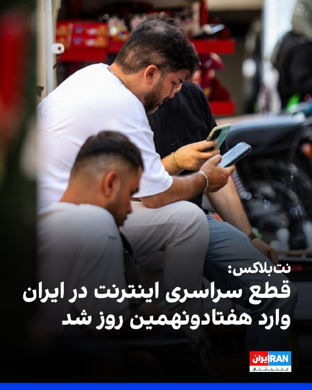

بر اساس گزارش نت‌بلاکس، نهاد پایش وضعیت اینترنت در جهان، قطع سراسری اینترنت در ایران وارد هفتادونهمین روز خود در دوازدهمین هفته شده است: «این اقدام گسترده سانسور، ماهیت مشارکت مدنی را دگرگون کرده و کنترل اطلاعات به ابزاری برای تقلیل شهروندان عادی به ناظران تحولات تبدیل شده است.»
https://iranintl.com/202605174006

## IranIntlTV — post 337580

  <a href="telegram/content/IranIntlTV_337580_1779009869.mp4" target="_blank">🎬 Download video</a>

بر اساس ویدیوهای ارسال‌شده‌ به ایران‌اینترنشنال، ایرانیان مقیم کانادا شنبه ۲۶ اردیبهشت علیه جمهوری اسلامی و قطع اینترنت ایران در مونترال تجمع کردند و شعار «مرگ بر جمهوری اسلامی» سردادند.

## IranIntlTV — post 337579

  

فرمانده پلیس راه سیراف عسلویه اعلام کرد که در پی واژگونی اتوبوس در محور عسلویه به کنگان، هشت نفر در محل حادثه جان خود را از دست دادند. کارشناسان پلیس راه علت این واژگونی را نقص فنی در سیستم ترمز تشخیص داده‌اند.
https://iranintl.com/202605172998

## ManotoTV — post 105550

  <a href="telegram/content/ManotoTV_105550_1779009871.mp4" target="_blank">🎬 Download video</a>

🎬 Video

## ManotoTV — post 105549

  <a href="telegram/content/ManotoTV_105549_1779009872.mp4" target="_blank">🎬 Download video</a>

گردهمایی ایرانیان ملبورن استرالیا، یکشنبه ۲۷ اردیبهشت

## ManotoTV — post 105548

  <a href="telegram/content/ManotoTV_105548_1779009874.mp4" target="_blank">🎬 Download video</a>

تجمع ایرانیان ساکن اورلاندو فلوریدا، آمریکا
۲۶ اردیبهشت

## FarsiVOA — post 217952

🔺خاموشی اینترنت وارد روز ۷۹ شد؛ نت‌بلاکس: مردم ایران به ناظر تبدیل شده‌اند

▪️داده‌های شبکه نشان می‌دهد خاموشی اینترنت در ایران همچنان ادامه دارد و وارد روز هفتادونهم، در هفته دوازدهم، شده است.

▪️به این ترتیب، شهروندان عادی در ایران بیش از ۱۸۷۰ ساعت است که از دسترسی عادی به اینترنت جهانی محروم مانده‌اند؛ وضعیتی که منتقدان آن را نوعی حصر دیجیتال می‌دانند.

▪️به گفته نت‌بلاکس، این اقدام گسترده سانسور دیجیتال، ماهیت مشارکت مدنی در ایران را تغییر داده است. این نهاد می‌گوید کنترل اطلاعات باعث شده افکار عمومی، به جای مشارکت فعال در تحولات کشور، به «ناظرانی» محدود در سرنوشت خود تبدیل شوند.

▪️این هشدار فقط درباره قطع اتصال نیست؛ درباره تغییر جایگاه شهروند در فضای عمومی است.

⬇️ بیشتر بخوانید:
https://ir.voanews.com/a/8150869.html

## FarsiVOA — post 217951

🔺اعتراض انجمن داروسازان ایران: بدهی سازمان‌های بیمه چهار برابر شده است

▪️یک عضو هیئت مدیره و مدیر روابط عمومی انجمن داروسازان ایران به پرداخت نشدن و انباشت مطالبات داروخانه‌ها از سوی سازمان‌های بیمه اعتراض کرد و خبر داد این مطالبات در ماه‌های گذشته «۴ برابر» شده است.

▪️او می‌گوید: «تأمین اجتماعی هر ماه ۳ هزار میلیارد تومان (همت) بدهکاری به داروخانه‌های بخش خصوصی دارد و با پرداخت آذر ماه، این سازمان هنوز ۱۵ همت به داروخانه ها بدهکار است.»

▪️در شرایطی که بیمه‌ها از پس تامین هزینه‌ها برنمی‌آیند و قیمت‌ها همچنان در حال افزایش است، بسیاری از بیماران با چالش جدی در تأمین داروهای مورد نیاز خود مواجه‌اند.

▪️همچنین در هفته‌های اخیر گزارش‌هایی از کمبود برخی داروها منتشر شده است.

⬇️ بیشتر بخوانید:
https://ir.voanews.com/a/8150868.html

## FarsiVOA — post 217950

  

دادستان استان کرمان از تشکیل ۳۵ پرونده قضایی برای ایرانیان خارج از کشور خبر داد و آنان را به «همکاری با دشمن» متهم کرد. مهدی بخشی گفت که این پرونده‌ها «با هدف پیگیری قضایی و مصادره اموال تشکیل شده است.»

رئیس کل دادگستری استان آذربایجان غربی نیز روز شنبه ۲۶ اردیبهشت از صدور دستور توقیف اموال ۱۲۹ نفر از مخالفان جمهوری اسلامی در این استان خبر داد.

همزمان در روز شنبه، مقامات قضائی استان یزد نیز از توقیف اموال ۵۱ تن از اهالی این استان خبر دادند و آنها را به «جاسوسی و همکاری با کشور‌های متخاصم و گروه‌های معاند» متهم کردند.

همچنین رسانه‌های ایران گزارش داده بودند که از ابتدای جنگ اخیر تا روز جمعه، در پرونده‌های سیاسی دست‌کم «۲۶۲ فقره ملک در سراسر کشور توقیف شده است.»

اموال توقیف شده «شامل وجوه نقد بانکی، اموال منقول و غیرمنقول، سهام شرکت‌ها و حتی اموال وکالتی» مردم است. این اقدامات جمهوری اسلامی از سوی ناظران، نقض حقوق شهروندی توصیف شده است.

جمهوری اسلامی در هفته‌های اخیر و همزمان با قطعی سراسری اینترنت، روند سرکوب‌ها و به ویژه اعدام‌ها را سرعت داده است.
@FarsiVOA

## FarsiVOA — post 217949

  

خبرگزاری رسمی قطر، قنا، گزارش داد محمد بن عبدالرحمن آل ثانی، نخست‌وزیر و وزیر خارجه قطر، با فیصل بن فرحان، وزیر خارجه عربستان سعودی، تلفنی گفت‌وگو کرد.

دو طرف در این تماس روابط دوجانبه و راه‌های تقویت آن را بررسی کردند و درباره تحولات منطقه، به‌ویژه موضوعات مرتبط با آتش‌بس میان آمریکا و جمهوری اسلامی و تلاش‌ها برای کاهش تنش گفت‌وگو کردند.

قنا همچنین نوشت وزیر خارجه قطر بر اهمیت پاسخ مثبت همه طرف‌ها به تلاش‌های میانجی‌گرانه تأکید کرده است؛ تلاش‌هایی که به گفته او می‌تواند راه را برای رسیدگی به ریشه‌های بحران از طریق گفت‌وگو و راه‌های مسالمت‌آمیز باز کند و به توافقی پایدار برای جلوگیری از بازگشت تنش منجر شود.

قطر و عربستان در هفته‌های گذشته از آتش‌بس میان آمریکا و جمهوری اسلامی حمایت کرده و خواستار کاهش تنش و حل بحران از مسیر گفت‌وگو شده‌اند.

قطر، که در تماس‌های میانجی‌گرانه با تهران نقش داشته، هم حمله سپاه پاسداران به پایگاه العدید را محکوم کرده و هم بر مخالفت خود با گسترش جنگ تأکید کرده است.
@FarsiVOA

## FarsiVOA — post 217948

🔺شلیک راکت و پهپادهای حزب‌الله به نیروهای اسرائیلی در جنوب لبنان

▪️ارتش اسرائیل اعلام کرد حزب‌الله از شب گذشته تا صبح یکشنبه چند راکت و پهپاد انفجاری را به سوی نیروهای اسرائیلی مستقر در جنوب لبنان شلیک کرده است.

▪️یکی از پهپادها همچنین باعث فعال شدن آژیر هشدار در شهرک مرزی میسگاو عام در شمال اسرائیل شد.

▪️در سمت مقابل، حملات اسرائیل به جنوب لبنان نیز ادامه داشته است.

⬇️ بیشتر بخوانید:
https://ir.voanews.com/a/8150867.html

## DW_Farsi — post 124789

🔶 تأمین‌کننده مالی نسل‌کشی رواندا در زندان درگذشت

به گفته یک دادگاه سازمان ملل متحد، فلیسین کابوگا، از متهمان اصلی طراحی نسل‌کشی رواندا در جریان دوران بازداشت خود در بیمارستانی در لاهه هلند درگذشت.

فلیسین کابوگا متهم بود یکی از مسئولان اصلی نشل‌کشی و خونریزی‌هایی بوده که در سال ۱۹۹۴ به کشته شدن دست‌کم ۸۰۰ هزار نفر انجامید.

سازوکار دادگاه‌های بین‌المللی جنایی سازمان ملل (IRMCT)، در بیانیه‌ای اعلام کرد که مسئول پزشکی بازداشتگاه سازمان ملل بلافاصله در جریان قرار گرفته است. همچنین تحقیقاتی درباره شرایط و جزئیات مرگ کابوگا آغاز شده است.

این تاجر رواندایی که ثروتی چند میلیون دلاری داشته، به نسل‌کشی در کشورش و همچنین مشارکت و تحریک به آن در موارد متعدد متهم شده بود.

@dw_farsi

## DW_Farsi — post 124788

  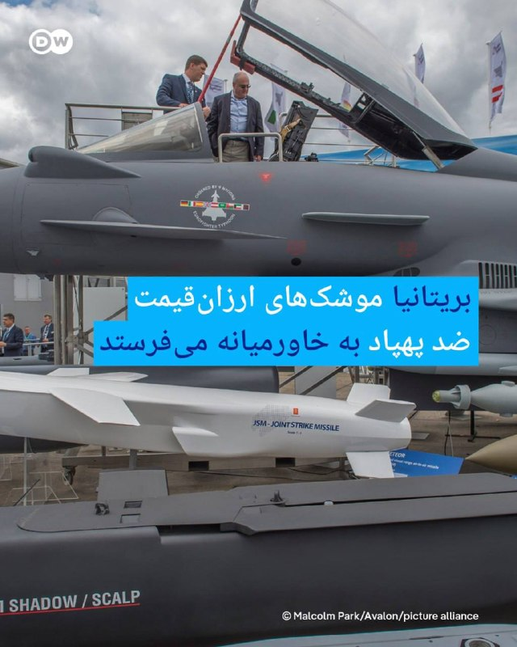

🔶 بریتانیا موشک‌های ارزان‌قیمت ضد پهپاد به خاورمیانه می‌فرستد

وزارت دفاع بریتانیا اعلام کرد که جنگنده‌های "تایفون" این کشور در خاورمیانه، به موشک‌های جدید و مقرون‌به‌صرفه‌ای مجهز می‌شوند که به طور ویژه برای مقابله با پهپادها طراحی شده‌اند.

با این موشک‌ها، انهدام دقیق اهداف ممکن می‌شود، آن هم با هزینه‌ای که تنها بخشی از هزینه موشک‌های مورد استفاده فعلی است.

در ادامه این بیانیه آمده است که این سامانه تسلیحاتی ظرف چند ماه از اولین آزمایش‌ها به مرحله تحویل و ارسال به خاورمیانه رسیده است.

لوک پولارد، وزیر دفاع بریتانیا در این باره گفت که این اقدام به نیروی هوایی کمک خواهد کرد تا پهپادهای بسیار بیشتری را با هزینه‌ای بسیار کمتر سرنگون کند.

@dw_farsi

## DW_Farsi — post 124787

🔶 ونزوئلا متحد نزدیک مادورو را به آمریکا تحویل داد

اداره مهاجرت ونزوئلا اعلام کرد که الکس صعب، تاجر ونزوئلایی و متحد نزدیک نیکلاس مادورو، رئیس جمهور برکنارشده این کشور، را به آمریکا تحویل داده است.
الکس صعب در ماه فوریه گذشته در کاراکاس، پایتخت ونزوئلا، طی عملیاتی مشترک میان نهادهای آمریکایی و ونزوئلایی، بازداشت شده بود.

بازداشت و استرداد او نشانه سطح تازه‌ای از همکاری میان نهادهای مجری قانون آمریکا و ونزوئلا تحت ریاست جمهوری دلسی رودریگز به شمار می‌رود.

به گفته منابع آگاه از موضوع، صعب می‌تواند اطلاعاتی را در اختیار مقام‌های آمریکایی قرار دهد که اتهامات آنها علیه مادورو را تقویت کند.

مادورو و همسرش، سیلیا فلورس، در ماه ژانویه گذشته در جریان عملیات نظامی آمریکا در کاراکاس بازداشت و به نیویورک منتقل شدند.

@dw_farsi

## DW_Farsi — post 124786

🔶 مذاکرات فیفا با ایران در استانبول؛ حمایت از حضور ایران در جام جهانی

فدراسیون جهانی فوتبال نسبت به حضور تیم ملی ایران در جام جهانی فوتبال ۲۰۲۶ در آمریکا ابراز اطمینان کرد.

فیفا اعلام کرد که در جریان دیداری در استانبول، به فدراسیون فوتبال ایران حمایت لازم برای حضور در مسابقات وعده داده شده است.

ماتیاس گرافستروم، دبیرکل فیفا تاکید کرد که همکاری نزدیکی میان دو طرف وجود دارد.

او افزود که فدراسیون جهانی فوتبال مشتاق است از ایران در جام جهانی استقبال کند.

جمهوری اسلامی شامگاه چهارشنبه ۲۳ اردیبهشت با حضور هزاران هوادار در میدان انقلاب تهران، مراسم بدرقه تیم ملی فوتبال برای جام جهانی را برگزار کرد.

انتشار تصاویر شعارهایی مانند "مرگ بر آمریکا" در این مراسم بازتاب گسترده‌ای در رسانه‌ها و شبکه‌های اجتماعی داشت.

بازیکنان قرار است هفته آینده تمرینات خود را در اردوی آماده‌سازی در ترکیه آغاز کنند.
مهدی تاج، رئیس فدراسیون فوتبال ایران پیش از این به دلیل ارتباط با سپاه پاسداران انقلاب اسلامی، اجازه ورود به کانادا برای شرکت در کنگره فیفا را دریافت نکرد.

@dw_farsi

## DW_Farsi — post 124785

  

🔶 کرملین از گفت‌وگوی پوتین با رئیس دولت امارات متحده عربی خبر داد

کرملین روز شنبه در بیانیه‌ای اعلام کرد که ولادیمیر پوتین، رئیس‌جمهور روسیه، با رئیس امارات متحده عربی، محمد بن زاید آل نهیان، درباره مناقشه ایران گفتگو کرده است.

در بیانیه کرملین آمده است: «دو طرف بر اهمیت ادامه روند سیاسی و دیپلماتیک با هدف دستیابی به توافق‌های صلح تاکید کردند.»

امارات متحده عربی هدف اصلی حملات موشکی و پهپادی ایران در طول جنگ منطقه‌ای بود؛ جنگی که ۲۸ فوریه با حملات ایالات متحده و اسرائیل شعله‌ور شد.

این مناقشه بخش عمده‌ای از صادرات نفت امارات را قطع کرده و به تصویر آن به‌عنوان پناهگاهی امن، جایگاهی که به تبدیل شدنش به قطب مالی منطقه کمک کرده بود، آسیب رسانده است.

@dw_farsi

## Persian_Trend_Official — post 14314

⭕️ دوستان، این حساب رسمی نیست. این اکانت صرفاً با پرداخت حدود ۱۰۰۰ دلار در ماه، تیک زرد (تأیید اشتراکی) دریافت کرده است. حساب‌های رسمی دولتی و سازمانی معمولاً تیک خاکستری دارند و اطلاعات هویتی و سازمانی آن‌ها به‌صورت شفاف در بخش Bio یا مشخصات حساب ثبت شده…

## Persian_Trend_Official — post 14313

  

💢توییت اتاق جنگ اسرائیل 🫆:Tony 📌 @persian_trend_official پرشین ترند | متفاوت‌ترین کانال نظامی

## Persian_Trend_Official — post 14312

خبرگزاری میزان

💢دادگاه رسیدگی به اتهامات صادق ساعدی‌نیا برگزار شد

🔹جلسه رسیدگی به اتهامات صادق ساعدی‌نیا، مدیرعامل شرکت صنعت غذایی و مدیر کافه‌های زنجیره‌ای ساعدی‌نیا از متهمان کودتای آمریکایی صهیونیستی دی ۱۴۰۴ در دادگاه انقلاب قم با حضور رئیس و مستشاران دادگاه، نماینده دادستان، متهم صادق ساعدی‌نیا و وکلای متهم برگزار شد.

🫆:Tony

📌 @persian_trend_official
پرشین ترند | متفاوت‌ترین کانال نظامی

## Persian_Trend_Official — post 14311

  <a href="telegram/content/Persian_Trend_Official_14311_1779009877.webm" target="_blank">🎬 Download video</a>

🔴 نشان ویژه برای خدمه ناو هواپیمابر «جرالد آر. فورد» و ناو گروه آن پس از جنگ ایران

💢سرپرست وزارت نیروی دریایی آمریکا اعلام کرد گروه ضربت ناو هواپیمابر «جرالد آر. فورد» و نیروهای گروه ضربت ناو هواپیمابر ۱۲ به‌دلیل عملکردشان در خاورمیانه طی جنگ اخیر ایران، نشان «واحد ریاست جمهوری» دریافت کرده‌اند.

💢بر اساس این بیانیه:

▪️ این گروه رزمی در عملیات‌های گسترده علیه اهداف ایرانی مشارکت داشته است
▪️ ادعا شده ۱۲۵ شناور جنگی ایرانی هدف قرار گرفته‌اند
▪️ همچنین ۲۰۷ موشک کروز «تاماهاوک» به اهدافی در ایران شلیک شده است

🔻در ادامه آمده:

💢 هواگردهای مستقر بر ناو «جرالد آر. فورد» بیش از ۱۷۰۰ سورتی پرواز رزمی از مدیترانه و دریای سرخ انجام داده‌اند

🫆:Tony

📌 @persian_trend_official
پرشین ترند | متفاوت‌ترین کانال نظامی

## Persian_Trend_Official — post 14310

  <a href="telegram/content/Persian_Trend_Official_14310_1779009878.webm" target="_blank">🎬 Download video</a>

⭕️ سی‌ان‌ان: ایران به کابل‌های اینترنتی تنگه هرمز چشم دوخته است!

📝 Nick

📌 @persian_trend_official
پرشین ترند | متفاوت‌ترین کانال نظامی

## Persian_Trend_Official — post 14309

  

💢توییت اتاق جنگ اسرائیل

🫆:Tony

📌 @persian_trend_official
پرشین ترند | متفاوت‌ترین کانال نظامی

## Persian_Trend_Official — post 14308

  

❌️ این عکس را چندین بار در گوگل لنز جست‌وجو کردیم، اما هیچ منبع معتبر یا رسانه قابل‌اعتمادی برای آن پیدا نشد.

به همین دلیل، به‌نظر می‌رسد این تصویر با هوش مصنوعی ساخته شده و واقعی نیست.

📝 Nick

📌 @persian_trend_official
پرشین ترند | متفاوت‌ترین کانال نظامی

## Persian_Trend_Official — post 14307

  <a href="telegram/content/Persian_Trend_Official_14307_1779009879.webm" target="_blank">🎬 Download video</a>

💢محمدباقر قالیباف، نمایندۀ ویژۀ ایران در امور چین شد

🔹پیش‌تر « علی لاریجانی» و «عبدالرضا رحمانی فضلی» چنین مسئولیتی را برعهده داشتند.

🫆:Tony

📌 @persian_trend_official
پرشین ترند | متفاوت‌ترین کانال نظامی

## Persian_Trend_Official — post 14306

  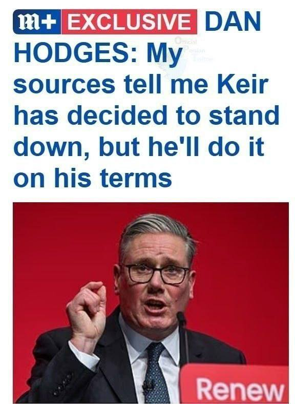

🔴دیلی میل: نخست وزیر انگلیس استعفا می‌دهد

💢دیلی میل گزارش داد استارمر نخست وزیر انگلیس در بحبوحه شورش فزاینده در حزبش، به نزدیکانش اطلاع داده است که قصد استعفا دارد.

💢بیش از ۹۰ نماینده مجلس از حزب کارگر در روزهای اخیر خواستار استعفای او شده‌اند.

🫆:Tony

📌 @persian_trend_official
پرشین ترند | متفاوت‌ترین کانال نظامی

## RadioFarda — post 157282

  

🔸خبرگزاری فارس، نزدیک به سپاه پاسداران، روز یک‌شنبه ۲۷ اردیبهشت نوشت که محمدباقر قالیباف، رئیس مجلس شورای اسلامی و عضو سابق سپاه، به عنوان نماینده ویژه ایران در امور چین تعیین شده است.

🔸این خبرگزاری امنیتی بدون هیچ توضیح دیگری تنها نوشته است:‌ «پیشتر علی لاریجانی و عبدالرضا رحمانی‌ فضلی چنین مسئولیتی را برعهده داشتند.»

🔸در این خبر نه توضیح داده شده که چه کسی یا چه نهادی قالیباف را به این سمت منصوب کرده است و نه برهه کنونی چه اهمیتی دارد که حکومت تصور کرده است به این نماینده ویژه نیاز دارد.

🔸اعلام تعیین قالیباف به عنوان نماینده ویژه در امور چین دو روز پس از دیدار رسمی رئیس جمهور آمریکا از کشور چین رخ می‌دهد که در آن یکی از موضوعات گفت‌وگو ایران و تنگه هرمز بود.

🔸کاخ سفید روز پنجشنبه ۲۴ اردیبهشت اعلام کرد دونالد ترامپ، رئیس‌جمهور آمریکا، و شی جین‌پینگ، رئیس‌جمهور چین، در دیدار خود درباره گسترش همکاری‌های اقتصادی، باز ماندن تنگه هرمز و جلوگیری از دستیابی ایران به سلاح هسته‌ای گفت‌وگو و توافق کردند.

@RadioFarda

## RadioFarda — post 157281

  

🔸دبیرکل فیفا، روز شنبه ۲۶ اردیبهشت پس از دیدار با رئیس فدراسیون فوتبال ایران، ابراز امیدواری کرد که تیم فوتبال این کشور بدون مشکل در جام جهانی حضور یابد.

🔸 ماتیاس گرافستروم درباره دیدارش با مهدی تاج به ‌جزئیاتی درباره صدور ویزای آمریکا و شرایط ورود بازیکنان ایرانی به‌ این کشور اشاره نکرد.

🔸رئیس فدراسیون فوتبال ایران هم پس از دیدار با دبیرکل فیفا در استانبول این ملاقات را «مثبت» ارزیابی و ابراز خوشحالی کرد که مقامات فیفا به تمام ۱۰ نکته‌ مورد نظر ایران گوش و برای هر یک از آنها راه‌حل ارائه کردند.

🔸مهدی تاج درباره جزئیات نکات مورد نظر ایران و راه‌حل‌های فیفا توضیح نداد.

🔸بر اساس برنامه رقابت‌های جام جهانی، تیم فوتبال ایران قرار است هر سه دیدار مرحله گروهی خود را در ایالات متحده برگزار کند.

🔸پیش‌تر فدراسیون فوتبال جمهوری اسلامی درخواست کرده بود مسابقاتش به مکزیک منتقل شود، اما جیانی اینفانتینو، رئیس فیفا، با این درخواست مخالفت کرد.

@RadioFarda

## RadioFarda — post 157280

  <a href="telegram/content/RadioFarda_157280_1779009881.mp4" target="_blank">🎬 Download video</a>

🔸پلیس نیویورک صدها موتورسیکلت‌ و اسکوتر متخلف را با استفاده از بولدوزر منهدم کرد.

🔸پلیس نیویورک گزارش داده که از ابتدای سال جاری میلادی (نزدیک به شش ماه) بیش از پنج‌هزار و ۷۰۰ دستگاه از این وسایل نقلیه «خطرناک» و «متخلف» را توقیف کرده است.

🔸نیویورک یکی شلوغ‌ترین و پرترافیک‌ترین شهرهای جهان است.

@RadioFarda

## IranianMinds — post 20271

  

🔴 خبرگزاری فارس :

قالیباف نماینده ویژه جمهوری اسلامی در امور چین شد

قبل از قالیباف علی لاریجانی این سمت رو داشت که ترور شد.

@IranianMinds

## IranianMinds — post 20270

  <a href="telegram/content/IranianMinds_20270_1779009883.webm" target="_blank">🎬 Download video</a>

🎉 ۵۰۰٬۰۰۰ تومان رایگان-بونوس ویژه ثبت‌نام

🔥 با هر ثبت نام 
🅰️
🅰️
🅰️ هزار تومن جایزه بگیرید

⬅️ شرط‌بندی کنید و بونوس را به موجودی واقعی تبدیل کنید

🔥 وقتشه بازی رو یه جور دیگه ببینی
⚽️  پوشش کامل مسابقات ورزشی 

📊  پیش‌بینی با بهترین ضرایب 

⚡️  تجربه سریع و حرفه‌ای

😀 پرداخت مستقیم و سریع بدون واسطه، بدون دردسر، واریز و برداشت در سریع‌ترین زمان ممکن 

😀 کانال تلگرام: 

🔴 @winro_io  

😀 هدیه خود را با ثبت نام در سایت دریافت کنید: 

🔴 Winro.io
R27
سایت اصلی در روزهای آینده بازگشایی خواهد شد 
✅

## IranianMinds — post 20269

  

🔴 نت بلاکس :

قطعی اینترنت در ایران وارد ۷۹ امین روز خودش شد.

@IranianMinds

## BBCPersian — post 281287

  

🔻رئیس‌کل دادگستری استان قم از مصادره سه آپارتمان مهدی نصیری و «وابستگانش» خبر داد.

بنابر اعلام دادگستری قم این آپارتمان‌ها «در حوزه ثبتی استان قم» بوده است.

کاظم موسوی گفت این اموال با گزارش اطلاعات سپاه و پیگیری دادسرای مرکز استان قم توقیف شده است.

قوه قضائیه ایران حدود دو هفته پیش گفته بود که «با دستور مقام قضائی»،اموال آقای نصیری و ۲۱ نفر دیگر که «علیه امنیت و ثبات کشور» اقدام کرده بودند در استان سمنان، مصادره شده است.

مهدی نصیری که مدتی مدیر مسئول روزنامه کیهان بود در سال‌های اخیر مخالف حکومت و از ایران خارج شد.

قوه قضائیه پس از جنگ اخیر برای کسانی که«هم‌صدا» یا «همراه» دشمن می‌خواند، پرونده تشکیل می‌دهد و با استناد به قانون «تشدید مجازات جاسوسی»، مجازات‌هایی مثل ممنوعیت فعالیت و توقیف اموال در نظر می‌گیرد.

قوه قضائیه فهرستی هم از افرادی منتشر کرده که برای «حمایت از جنگ»، اموالشان توقیف یا مصادره شده است.

با تشدید ضبط اموال طیف وسیعی از اقشار جامعه از خبرنگار تا بازیگر و فعال سیاسی و هنرمند و ورزشکار، قوه قضائیه جلوگیری از انتقال اموال را آغاز کرده است.

📸TABNAK
https://bbc.in/4dOlJHf
@BBCPersian

## BBCPersian — post 281286

  

🔻مهدی تاج دیدار و مداکره با دبیر کل فیفا «مثبت» خواند.
رئیس فدراسیون فوتبال ایران در استانبول با ماتیاس گرافستروم، دبیر کل فیفا، دیدار و گفت‌گو کرد.
آقای تاج گفت که در این دیدار مقامات فیفا به «۱۰ نکته‌ای که ایران مطرح کرد، گوش دادند و برای هر یک از آنها راه‌حل ارائه کردند.»
او ابراز امیدواری کرد که تیم ملی فوتبال ایران بتواند بدون هیچ مشکلی به جام جهانی برود.
ماتیاس گرافستروم هم گفت: «نشست بسیار خوب و سازنده‌ای با فدراسیون فوتبال ایران داشتیم. ما همکاری نزدیکی داریم و مشتاقانه منتظر استقبال از آنها در جام جهانی فیفا هستیم.»
تیم ملی فوتبال ایران قرار است فردا تهران را به مقصد ترکیه ترک کند. اردوی آماده سازی تیم ملی در ترکیه برگزار می‌شود.

📸Reuters
https://bbc.in/4uTejZc
@BBCPersian

## Dirty_Kids — post 389600

  

دوران اوباما
Vs
دوران ترامپ

اینو برای عمو ترامپ درست کردن میخوام براش بفرستیم تو بزاره تو صفحه تروث‌مدیاش

@Dirty_Kids 👻

## Dirty_Kids — post 389599

  <a href="telegram/content/Dirty_Kids_389599_1779009886.mp4" target="_blank">🎬 Download video</a>

اتفاقا نه تنها بی‌ناموس بلکه بقیه موارد مرتبط با قضیه ناموس رو هم هستی «دکتر» قلابی!

@Dirty_Kids 👻

## Dirty_Kids — post 389598

‏از جمهوری اسلامی فقط؛

۴۰۰ کیلو اورانیوم مونده با یه مشت گشنه‌ی کلاشینکف به دست.

@Dirty_Kids 👻

## Dirty_Kids — post 389596

سپاهیا در برابر مردم بی دفاع
&
سپاهیا در برابر ارتش دیگر کشورها

@Dirty_Kids 👻

## Hranews — post 112980

عباس ماموسی بازداشت و به زندان ایلام منتقل شد

❗️
❗️
❗️
❗️
❗️ – عباس ماموسی، اهل شهرستان دهلران روز پنجشنبه ۲۴ اردیبهشت ماه، توسط نیروهای امنیتی #بازداشت و به زندان ایلام منتقل شد.

ادامه مطلب

#عباس_ماموسی

↘️
@hranews_bot تماس ✉️ -  @Hranews  کانال هرانا 🆑

## Hranews — post 112979

مشهد؛ نوزاد ۴۰ روزه با ضربات پیاپی و خفگی توسط پدرش به قتل رسید

❗️
❗️
❗️
❗️
❗️ – یک نوزاد ۴۰ روزه در مشهد، توسط پدرش به قتل رسید. این مرد ۳۸ ساله متهم است که ابتدا با ماهیتابه و کف دست ضربات متعددی به سر فرزند خود وارد کرده و در نهایت با وارد کردن مدفوع نوزاد به دهان او و انسداد مسیر تنفسی‌اش، فرزند پسر خود را به قتل رسانده است.

#قتل_کودک

ادامه مطلب

↘️
@hranews_bot تماس ✉️ -  @Hranews  کانال هرانا 🆑

## Hranews — post 112978

  

بر اساس آخرین داده‌های نت‌ بلاکس، خاموشی دیجیتال در ایران وارد هفتادونهمین روز خود شده و اکنون دوازدهمین هفته اختلال گسترده در دسترسی به #اینترنت جهانی را پشت سر می‌گذارد. این نهاد ناظر بر وضعیت دسترسی به اینترنت در جهان اعلام کرد که تداوم این محدودیت‌ها، شکل مشارکت مدنی در ایران را دگرگون کرده و کنترل جریان اطلاعات، عموم شهروندان را به «تماشاگرانی در کشور خود» تبدیل کرده است.

↘️
@hranews_bot تماس ✉️ -  @Hranews  کانال هرانا 🆑

## Hranews — post 112977

  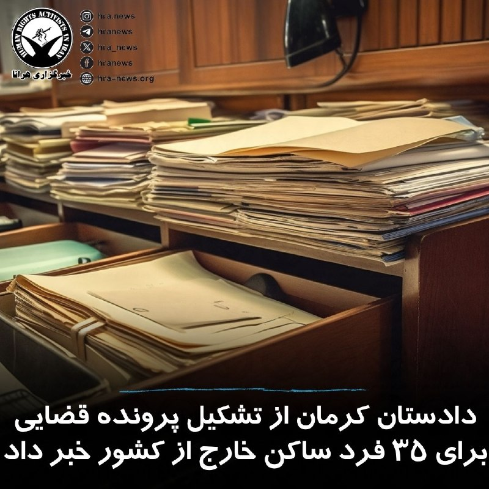

دادستان عمومی و انقلاب استان کرمان از تشکیل ۳۵ پرونده قضایی برای افرادی که در خارج از کشور اقامت دارند، به دلیل آنچه «همکاری با دشمن» عنوان کرده، خبر داد. مهدی بخشی در ادامه اعلام کرد که این پرونده‌ها با هدف پیگیری قضایی و #مصادره_اموال تشکیل شده است.

↘️
@hranews_bot تماس ✉️ -  @Hranews  کانال هرانا 🆑

## manototv — post 105550

  <a href="telegram/content/manototv_105550_1779009888.mp4" target="_blank">🎬 Download video</a>

🎬 Video

## manototv — post 105549

  <a href="telegram/content/manototv_105549_1779009888.mp4" target="_blank">🎬 Download video</a>

گردهمایی ایرانیان ملبورن استرالیا، یکشنبه ۲۷ اردیبهشت

## manototv — post 105548

  <a href="telegram/content/manototv_105548_1779009890.mp4" target="_blank">🎬 Download video</a>

تجمع ایرانیان ساکن اورلاندو فلوریدا، آمریکا
۲۶ اردیبهشت

## alonews — post 120557

  <a href="telegram/content/alonews_120557_1779009891.mp4" target="_blank">🎬 Download video</a>

👈 حمله‌های شدید ارتش اسرائیل به جنوب لبنان

✅ @AloNews خبر جنگ

## alonews — post 120556

  <a href="telegram/content/alonews_120556_1779009892.webm" target="_blank">🎬 Download video</a>

👈سوپر اپلیکیشن بله مجدداً از دقایقی پیش با اختلال روبرو شده است

✅ @AloNews خبر جنگ

## alonews — post 120555

  <a href="telegram/content/alonews_120555_1779009892.webm" target="_blank">🎬 Download video</a>

👈قلهکی: یکی از کشورهای منطقه هشدار شروع جنگ را برای دورماندن از تیررسِ ایران، به تهران منتقل کرده است!

✅ @AloNews خبر جنگ

## alonews — post 120554

  <a href="telegram/content/alonews_120554_1779009892.webm" target="_blank">🎬 Download video</a>

👈جزئیاتی از درخواست‌های آمریکا از ایران در مذاکرات

🔴براساس شنیده‌های فارس از پاسخ آمریکا به پیشنهادهای ایران، ۵ شرط اصلی واشنگتن به این شرح اعلام شده است:

🔴عدم پرداخت هرگونه غرامت و خسارت از سوی آمریکا

🔴خروج و تحویل ۴۰۰ کیلوگرم اورانیوم از ایران به آمریکا

🔴فعال ماندن تنها یک مجموعه از تأسیسات هسته‌ای ایران

🔴عدم پرداخت حتی ۲۵ درصد از دارایی‌های بلوکه‌شدهٔ ایران

🔴منوط‌شدن توقف جنگ در همه ساحتها به انجام مذاکره

🔴این گزارش تأکید می‌کند که حتی در صورت تحقق این شرایط از سوی ایران، تهدید حمله آمریکا و اسرائیل همچنان پابرجا خواهد بود.

🔴کارشناسان معتقدند طرح پیشنهادی آمریکا به جای حل مشکل، در پی دستیابی به اهدافی است که این کشور نتوانسته در طول جنگ آن را محقق کند.

🔴در مقابل، ایران انجام هرگونه مذاکره را منوط به تحقق ۵ پیش‌شرط اعتمادساز دانسته است که عبارتند از:

🔴پایان جنگ در همهٔ جبهه‌ها به‌ویژه لبنان

🔴رفع تحریم‌ها

🔴آزادسازی پول‌های بلوکه‌شده ایران

🔴جبران خسارات ناشی از جنگ

🔴پذیرش حق حاکمیت ایران بر تنگه هرمز


✅ @AloNews خبر جنگ

## alonews — post 120553

  <a href="telegram/content/alonews_120553_1779009893.webm" target="_blank">🎬 Download video</a>

👈پست ترامپ تو ثروث سوشال : یه شب بزرگ تو سیاست؛ از همه متشکرم!

✅ @AloNews خبر جنگ

## alonews — post 120552

  <a href="telegram/content/alonews_120552_1779009893.webm" target="_blank">🎬 Download video</a>

👈گویا تو اصفهان برای خانم‌های بی حجاب ابلاغیه دادگاه ارسال میشه

✅ @AloNews خبر جنگ

## alonews — post 120551

  <a href="telegram/content/alonews_120551_1779009893.webm" target="_blank">🎬 Download video</a>

👈وزارت کشور عربستان: برافراشتن پرچم‌های سیاسی یا مذهبی و سر دادن هرگونه شعار در مکه، مدینه و اماکن مقدسه از جمله مسجدالحرام، مسجدالنبی، صحن‌های آنها و مسیرهای منتهی به آن ممنوع است

✅ @AloNews خبر جنگ

## alonews — post 120550

  

🔥
💥اینترنت آزاد و رایگان

🌐
🚫تنها جایی که کانفیگ رایگان میزاره

⬇️
⬇️
@NetAazaadBot
@NetAazaadBot

⚠️هر ساعت 100گیگ شارژ میشه، رباتو داشته باشید تا مطلع بشید

## alonews — post 120549

  <a href="telegram/content/alonews_120549_1779009894.webm" target="_blank">🎬 Download video</a>

👈میزان: دادگاه «صادق ساعدنیا» برگزار شد

✅ @AloNews خبر جنگ

## alonews — post 120546

  <a href="telegram/content/alonews_120546_1779009894.webm" target="_blank">🎬 Download video</a>

👈تصویری از نصب مسلسل ۱۲.۷ میلیمتری گاتلینگ چهار اول نصب شده در دماغه برخی نسخه های بالگرد میل۲۴ با یک سامانه دید حرارتی در روسیه برای مقابله با پهپادها ..این سیستم بیش از ۲۰۰۰ گلوله بر دقیقه آتش می‌کند

✅ @AloNews خبر جنگ

## alonews — post 120545

  <a href="telegram/content/alonews_120545_1779009894.webm" target="_blank">🎬 Download video</a>

👈از چند ساعت گذشته بیش از دوازده فروند هواپیمای ترابری راهبردی C-17A گلوبمستر III نیروی هوایی آمریکا در حال ترک خاورمیانه و حرکت به سمت اروپا هستند.

✅ @AloNews خبر جنگ

## alonews — post 120544

  <a href="telegram/content/alonews_120544_1779009894.webm" target="_blank">🎬 Download video</a>

👈فارس: محمدباقر قالیباف، نمایندۀ ویژۀ ایران در امور چین شد

✅ @AloNews خبر جنگ

## alonews — post 120543

  <a href="telegram/content/alonews_120543_1779009894.webm" target="_blank">🎬 Download video</a>

👈معاون شرکت مخابرات ایران: دسترسی به اینترنت باید برای همه مردم فراهم باشد

✅ @AloNews خبر جنگ

## alonews — post 120542

  

تصویری لو رفته از گلشیفته و مکرون

[@AloTweet]

## alonews — post 120541

  <a href="telegram/content/alonews_120541_1779009895.webm" target="_blank">🎬 Download video</a>

👈سفر ترامپ به پکن نمادی از کاهش قدرت آمریکا بود، به طوری که چین تنها رئیس‌جمهور را سرگرم کرد بدون اینکه هیچ امتیاز واقعی ارائه دهد، طبق گزارش آتلانتیک.

🔴 فرانکلین فور می‌نویسد که با وجود پروتکل‌ها و مراسم پرزرق و برق، دیدار شی و ترامپ هیچ دستاورد سیاسی یا اقتصادی قابل توجهی برای واشنگتن نداشت.

🔴 مقاله بیان می‌کند: «وقتی آمریکا دستش را دراز می‌کند، دیگر هیچ‌کس برای گرفتن آن عجله نمی‌کند، و وقتی تهدید می‌کند، دیگر هیچ‌کس ترسی احساس نمی‌کند.»

🔴شی نه تنها از ارائه طرح مشخصی برای پایان جنگ ایران خودداری کرد، بلکه از امضای توافقنامه بزرگ تجاری یا ارائه تضمین‌هایی درباره دسترسی آمریکا به مواد معدنی کمیاب نیز امتناع ورزید.

✅ @AloNews خبر جنگ

## alonews — post 120540

  <a href="telegram/content/alonews_120540_1779009895.webm" target="_blank">🎬 Download video</a>

👈قطر و عربستان وضعیت منطقه و آتش‌بس را بررسی کردند

✅ @AloNews خبر جنگ

---
📅 بروزرسانی: 1405/02/27 11:01
---

## VahidOOnLine — post 240581

  

♦️فیلم «تمرین‌هایی برای یک انقلاب» ساخته پگاه آهنگرانی، در بخش «نمایش‌های ویژه» هفتادونهمین دوره جشنواره کن به نمایش درآمد و با استقبال تماشاگران روبه‌رو شد.
پگاه آهنگرانی، بازیگر و مستندساز ایرانی، روز شنبه ۲۶ اردیبهشت در مراسم نمایش فیلم تازه‌اش، این اثر را به مادرانی تقدیم کرد که فرزندان خود را در راه مبارزه برای آزادی از دست داده‌اند.
او پس از حضور روی صحنه همراه با عوامل فیلم، از روزهای بسیار دشوار مردم ایران سخن گفت؛ روزهایی که به گفته او «بدون اینترنت، با خبرهای روزانه اعدام‌ها در جمهوری اسلامی و زیر سایه سنگین جنگ» سپری می‌شود.

فیلم «تمرین‌هایی برای یک انقلاب» روایتی شخصی از زندگی و تجربه‌های پگاه آهنگرانی است؛ روایتی که از خلال پنج پرتره از بستگان و استادان او، مفهوم مقاومت را به تصویر می‌کشد.

در این مستند از آرشیوهای شخصی، ویدئوهای خانگی، تصاویر اعتراضات خیابانی، روزنامه‌ها و صداهای ضبط‌شده استفاده شده تا بیش از ۴۰ سال از تاریخ معاصر ایران بازخوانی شود.
‌🇸🇦 Indypersian

🤖 @VahidOOnLine

## VahidOOnLine — post 240580

  <a href="telegram/content/VahidOOnLine_240580_1779003111.mp4" target="_blank">🎬 Download video</a>

ویدیوهای رسیده به ایران‌اینترنشنال نشان می‌دهند ایرانیان مقیم مجارستان و دانمارک روز شنبه ۲۶ اردیبهشت علیه جمهوری اسلامی و قطع اینترنت در ایران در شهرهای بوداپست و آرهوس تجمع کردند.
‌🏁 🇬🇧 IranintlTV

🤖 @VahidOOnLine

## VahidOOnLine — post 240579

  <a href="telegram/content/VahidOOnLine_240579_1779003112.mp4" target="_blank">🎬 Download video</a>

تجمع ایرانیان ایسلند، ۲۶ اردیبهشت
ایسلند از کم‌جمعیت‌ترین کشورهای اروپاست و جامعه ایرانی کوچکی دارد.
‌🏁 🇬🇧 ManotoTV

🤖 @VahidOOnLine

## VahidOOnLine — post 240578

  

♦️دولت بریتانیا روز یکشنبه در اقدام جدید خود علیه شبکه‌های مالی وابسته به جمهوری اسلامی، اعضای یک خانواده پنج‌نفره و دو صرافی مرتبط با آن‌ها را به اتهام تسهیل فعالیت‌های مخفی مالی و پول‌شویی میلیاردها دلار برای تهران، هدف تحریم‌های سخت‌گیرانه قرار داد.
وزارت امور خارجه بریتانیا اعلام کرد که پنج تن از اعضای خانواده «زرین‌قلم» به نام‌های منصور، ناصر، فضل‌الله، پوریا و فرهاد زرین‌قلم را به همراه دو شرکت خدمات ارزی «صرافی برلیان» و «صرافی جی‌سی‌ام» (GCM) به فهرست تحریم‌های خود اضافه کرده است.
بر اساس بیانیه مقامات لندن، این افراد و نهادها متهم هستند که از طریق ایجاد یک شبکه گسترده از «شرکت‌های پوششی» در امارات متحده عربی و هنگ‌کنگ، به عنوان بازوی شبکه پنهان یا «بانکداری سایه‌ای» جمهوری اسلامی عمل کرده و از این طریق اقدامات بی‌ثبات‌کننده و تروریستی پناه گرفته تحت حمایت تهران را تامین مالی کرده‌اند. پیش از این، دولت ایالات متحده نیز سه تن از اعضای این خانواده را به اتهام پول‌شویی میلیاردها دلار برای ایران تحریم کرده بود.
‌🇸🇦 Indypersian

🤖 @VahidOOnLine

## VahidOOnLine — post 240577

  

ابراهیم رضایی، نماینده مجلس و سخنگوی کمیسیون امنیت ملی، در شبکه اجتماعی ایکس نوشت: «ممکن است بازگشت به جنگ آسیب‌هایی داشته باشد اما حتما دشمن بیشتر متضرر می‌شود، خیلی بیشتر.»
‌🏁 🇬🇧 IranintlTV

🤖 @VahidOOnLine

## VahidOOnLine — post 240576

  <a href="telegram/content/VahidOOnLine_240576_1779003116.mp4" target="_blank">🎬 Download video</a>

ویدیوهای رسیده به ایران‌اینترنشنال نشان می‌دهند ایرانیان مقیم کانادا روز شنبه ۲۶ اردیبهشت علیه جمهوری اسلامی در اتاوا تجمع کردند و شعار «جاوید شاه» سردادند.
‌🏁 🇬🇧 IranintlTV

🤖 @VahidOOnLine

## VahidOOnLine — post 240575

  

♦️مهدی تاج،‌ رئیس فدراسیون فوتبال جمهوری اسلامی روز یکشنبه ۲۷ اردیبهشت پس از دیدار با مقامات فیفا در استانبول مذاکرات را «مثبت» دانست و گفت: «خوشحالم که آنها به تمام ۱۰ نکته‌ای که ایران مطرح کرده بود گوش دادند و برای هر یک از آنها راه‌حل ارائه کردند.»
تاج ابراز امیدواری کرد که تیم ملی ایران بتواند بدون هیچ مشکلی به جام جهانی برود و «نتایج بسیار خوبی کسب کند.»
پیشتر ماتیاس گرافستروم، دبیرکل فیفا درباره نشست با مهدی تاج گفته بود «نشست بسیار خوبی با فدراسیون فوتبال ایران داشتیم. فکر می‌کنم بسیار نزدیک با یکدیگر همکاری می‌کنیم و مشتاقانه منتظر استقبال از آن‌ها در جام جهانی ۲۰۲۶ در آمریکا، کانادا و مکزیک هستیم.»
دبیرکل فیفا در عین حال از ارائه جزئیات در مورد وضعیت ویزا برای بازیکنان تیم ملی ایران خودداری کرد.
مهدی تاج، رئیس فدراسیون فوتبال روز پنجشنبه اعلام کرد که هنوز هیچ ویزایی برای حضور تیم ملی در رقابت‌های جام جهانی در ایالات متحده صادر نشده است.
‌🇸🇦 Indypersian

🤖 @VahidOOnLine

## VahidOOnLine — post 240574

  <a href="telegram/content/VahidOOnLine_240574_1779003118.mp4" target="_blank">🎬 Download video</a>

بریتانیا پنج عضو خانواده زرین‌قلم را به اتهام ارتباط با شبکه مالی پنهان جمهوری اسلامی تحریم کرده است. فرهاد زرین‌قلم، مهندس بریتانیایی ایرانی‌تبار، همراه با فضل‌الله، منصور، ناصر و پوریا زرین‌قلم در فهرست تازه تحریم‌های لندن قرار گرفته‌اند.

بر اساس اعلام وزارت خارجه بریتانیا، این افراد و دو صرافی مرتبط با آنان، «صرافی برلیان» و «جی‌سی‌ام اکسچنج»، به ارائه خدمات مالی برای افرادی و نهادهایی متهم شده‌اند که فعالیت‌هایشان با بی‌ثبات‌سازی بریتانیا یا دیگر کشورها ارتباط داشته است. لندن این افراد را با ممنوعیت سفر، توقیف دارایی و ممنوعیت مدیریت شرکت‌ها روبه‌رو کرده است.

آسوشیتدپرس نیز نوشت مقام‌های بریتانیا این تحریم‌ها را بخشی از مقابله با «فعالیت‌های خصمانه مرتبط با ایران» دانسته‌اند و گفته‌اند شبکه‌های مالی پنهان برای دور زدن تحریم‌ها و انتقال میلیاردها دلار به سود بخش‌های نفتی و نظامی جمهوری اسلامی به‌کار رفته‌اند.
‌🏁 🇬🇧 ManotoTV

🤖 @VahidOOnLine

## VahidOOnLine — post 240573

  <a href="telegram/content/VahidOOnLine_240573_1779003119.mp4" target="_blank">🎬 Download video</a>

راهپیمایی ایرانیان سان‌فرانسیسکو، ۲۶ اردیبهشت
‌🏁 🇬🇧 ManotoTV

🤖 @VahidOOnLine

## VahidOOnLine — post 240572

  <a href="telegram/content/VahidOOnLine_240572_1779003120.mp4" target="_blank">🎬 Download video</a>

راهپیمایی ایرانیان ساکن ونکوور کانادا، ۲۶ اردیبهشت
‌🏁 🇬🇧 ManotoTV

🤖 @VahidOOnLine

## VahidOOnLine — post 240571

  <a href="telegram/content/VahidOOnLine_240571_1779003122.mp4" target="_blank">🎬 Download video</a>

بلغارستان برای نخستین بار برنده مسابقه آواز یوروویژن شد. دارا، خواننده بلغاری، با ترانه «بنگارنگا» در فینال هفتادمین دوره این مسابقه در وین اتریش، ۵۱۶ امتیاز گرفت و مقام نخست را به دست آورد.

بر اساس اعلام وب‌سایت رسمی یوروویژن، بلغارستان هم در رای هیات‌های داوری و هم در رای مردمی اول شد. اسرائیل در جایگاه دوم و رومانی در جایگاه سوم قرار گرفتند.
‌🏁 🇬🇧 ManotoTV

🤖 @VahidOOnLine

## VahidOOnLine — post 240570

  <a href="telegram/content/VahidOOnLine_240570_1779003123.mp4" target="_blank">🎬 Download video</a>

دولت بریتانیا اعلام کرد سامانه‌ای تازه و کم‌هزینه برای مقابله با پهپادها را روی جنگنده‌های تایفون نیروی هوایی سلطنتی در خاورمیانه مستقر کرده است.

این سامانه که «سلاح کشتار دقیق پیشرفته» نام دارد، راکت‌های غیرهدایتی را با کیت هدایت لیزری به مهمات دقیق تبدیل می‌کند و به گفته وزارت دفاع بریتانیا، امکان انهدام اهداف را با هزینه‌ای بسیار کمتر از موشک‌های رایج فراهم می‌سازد.

وزارت دفاع بریتانیا اعلام کرد این سامانه با همکاری شرکت‌های بی‌ای‌ئی سیستمز و کینتیک، در کمتر از دو ماه از مرحله آزمایش به استقرار عملیاتی رسیده است. رسانه‌های دفاعی نیز گزارش داده‌اند جنگنده‌های تایفون بریتانیا در خاورمیانه اکنون برای ماموریت‌های مقابله با پهپاد به این سامانه مجهز شده‌اند.
‌🏁 🇬🇧 ManotoTV

🤖 @VahidOOnLine

## VahidOOnLine — post 240569

  

محمدصالح جوکار، رییس کمیسیون امور داخلی مجلس، با اشاره به حاضر نشدن جمهوری اسلامی در دور دوم مذاکره با آمریکا در پاکستان، گفت: «در این مدت پیشنهاداتی از سوی آمریکا مطرح شده اما جمهوری اسلامی همچنان بر همان بندهای اولیه تاکید دارد. شروط ده‌گانه خامنه‌ای خط قرمز هر مذاکره‌ای است.»

جوکار درباره جزئیات این شرط‌ها، گفت: «این ۱۰ شرط شامل عبور کنترل شده از تنگه هرمز با هماهنگی نیروهای مسلح جمهوری اسلامی، پایان جنگ علیه همه اجزای محور مقاومت، بیرون رفتن نیروهای رزمی آمریکا از تمامی پایگاه‌های منطقه، پرداخت کامل خسارت، رفع همه تحریم‌ها، پذیرش حق غنی‌سازی و آزاد شدن کلیه اموال و دارایی‌های بلوکه شده در خارج از کشور است.»
‌🏁 🇬🇧 IranintlTV

🤖 @VahidOOnLine

## VahidOOnLine — post 240568

  

عباس عراقچی، وزیر امور خارجه جمهوری اسلامی، در کانال تلگرامی خود اعلام کرد که کتاب «قدرت مذاکره» او به چاپ پنجم رسیده و در چاپ جدید این کتاب، بخش جدیدی با عنوان «دیپلماسی زیر آتش» درباره روند «مذاکرات غیرمستقیم با آمریکا در جنگ ۱۲ روزه» به آن افزوده شده است.
‌🏁 🇬🇧 IranintlTV

🤖 @VahidOOnLine

## VahidOOnLine — post 240567

  

‌♦️بلومبرگ روز یکشنبه ۲۷ اردیبهشت گزارش داد که یک نفت‌کش غول‌پیکر حامل دو میلیون بشکه نفت خام عراق که پس از متوقف شدن توسط نیروهای نظامی ایالات متحده، برای روزها در دریای عمان سرگردان و متوقف بود، حرکت خود را به سمت مقصد نهایی یعنی کشور ویتنام از سر گرفت.
این نفت‌کش بزرگ پس از چند روز بلاتکلیفی و پهلو گرفتن اجباری در آب‌های دریای عمان، سرانجام اجازه یافت تا مسیر دریایی خود را به سمت شرق آسیا ادامه دهد. هنوز جزئیات بیشتری درباره دلایل توقف چندروزه این شناور توسط نیروهای آمریکایی و شرایط رفع توقف آن منتشر نشده است.
عراق یکی از بزرگ‌ترین صادرکنندگان نفت در سازمان اوپک است و بخش عمده‌ای از محموله‌های نفتی این کشور از طریق آب‌های خلیج فارس و دریای عمان به بازارهای آسیایی ارسال می‌شود.
نفتکش«آگیوس فانوریوس ۱» (Agios Fanourios I) که تحت پرچم کشور مالت حرکت می‌کند، پس از بارگیری نفت خام بصره در عراق، از تنگه هرمز عبور کرد اما به دلیل نزدیک شدن به خطوط تحت کنترل نیروهای آمریکایی، توسط فرماندهی مرکزی آمریکا متوقف و مجبور به چرخش به سمت دریای عمان شده بود.
‌🇸🇦 Indypersian

🤖 @VahidOOnLine

## VahidOOnLine — post 240566

  

عبدالغفور امان‌زاده، عضو کمیسیون کشاورزی مجلس، با اعلام افزایش ۲۰ هزار تومانی قیمت گندم، گفت: «نگرانی اصلی کشاورزان بابت پرداخت مطالبات و پول گندم است. از آغاز فصل برداشت تا امروز حدود ۴۵ روز می‌گذرد اما متاسفانه دیناری بابت این مسئله به کشاورزان پرداخت نشده است.»
‌🏁 🇬🇧 IranintlTV

🤖 @VahidOOnLine

## VahidOOnLine — post 240565

  <a href="telegram/content/VahidOOnLine_240565_1779003126.mp4" target="_blank">🎬 Download video</a>

⭕️ صدو‌سی‌امین سال ترور قبله عالم، ناصرالدین شاه قاجار و تاثیر آن بر وقایع سیاسی ایران

♦️دوازدهم اردیبهشت‌ماه ۱۲۷۵ خورشیدی، هنگامی که ناصرالدین‌شاه قاجار به مناسبت پنجاهمین سال سلطنتش راهی حرم عبدالعظیم در شهر ری شد و برخلاف روال همیشگی، از ملازمان خود خواست اجازه دهند مردم برای دیدار به او نزدیک شوند، شاید هرگز تصور نمی‌کرد که این سفر، واپسین سفر زندگی‌اش باشد و همان روز و در همان مکان، به دست میرزا رضای کرمانی کشته شود.
اکنون ۱۳۰ سال از ترور ناصرالدین‌شاه می‌گذرد؛ رویدادی که تاریخ معاصر ایران را، از منظر حذف فیزیکی عالی‌ترین مقام حکومت، به پیش و پس از خود تقسیم کرد.
میرزا رضای کرمانی که از مریدان سید جمال‌الدین اسدآبادی بود و سال‌هایی از عمر خود را در زندان گذرانده بود، در آن روز در میان زائران کمین کرد. هنگامی که شاه از کالسکه پیاده شد و به سوی صحن حرم گام برداشت، خود را به او رساند و از فاصله‌ای نزدیک گلوله‌ای به سینه او شلیک کرد.
ناصرالدین‌شاه در همان لحظه نقش بر زمین شد. ندیمان و محافظان شاهی که غافلگیر شده بودند، بلافاصله میرزا رضا را دستگیر کردند.

📌لینک پخش پادکست
‌🇸🇦 Indypersian

🤖 @VahidOOnLine

## VahidOOnLine — post 240564

  

فرماندهی مرزبانی استان بوشهر اعلام کرد یکشنبه عملیات انفجار و حریق کنترل‌شده برای امحای مواد و ضایعات بمب در محدوده باشی، بین شهرستان‌های تنگستان و دشتی، انجام می‌شود. این عملیات از ساعت ۸ تا ۱۷ برگزار می‌شود.
‌🏁 🇬🇧 IranintlTV

🤖 @VahidOOnLine

## VahidOOnLine — post 240563

  

‌♦️وزارت دفاع بریتانیا از استقرار یک سلاح کم‌هزینه ضدپهپاد جدید در خاورمیانه برای رهگیری پهپادهای ایرانی خبر داد. بنا بر اعلام این وزارتخانه جت‌های تایفون نیروی هوایی سلطنتی بریتانیا به سیستم سلاح پیشرفته کشتار دقیق «ای‌پی‌کی‌دابلیو‌اس» مجهز می‌شوند که با استفاده از هدف‌گیری لیزری، موشک‌های غیرهدایتی را به سلاح‌های دقیق و کم‌هزینه تبدیل می‌کند که قادر به سرنگونی پهپادها و دیگر تهدیدها هستند.
وزارت دفاع بریتانیا گفت این سامانه را در همکاری سریع با صنایع نظامی ظرف چند ماه از مرحله آزمایش به مرحله استقرار رسانده است و با این اقدام شهروندان بریتانیایی و شرکای منطقه‌ای از حفاظت بیشتری در برابر حملات پهپادی برخوردار خواهند شد.
‌🇸🇦 Indypersian

🤖 @VahidOOnLine

## WithYashar — post 11457

## WithYashar — post 11456

## WithYashar — post 11455

## WithYashar — post 11454

## WithYashar — post 11453

  

📷 Photo

## WithYashar — post 11452

## WithYashar — post 11451

## WithYashar — post 11450

## WithYashar — post 11449

عجب جمله ای: اهدافت رو از ملی به مالی تغییر میده. رحمت به شیری که تو خوردی یاشار 🙏💪💚🤍❤️

## WithYashar — post 11448

این لحنم نبود🤣🤣🤣🤣بد گذاشتی ک

## WithYashar — post 11447

ولت براچی گذاشتی تو

## WithYashar — post 11446

ولت براچی گذاشتی تو

## WithYashar — post 11445

## WithYashar — post 11444

پدرم در اومد رسیدم تلگرام چرا روبیکا خبر نمیزاری یاشار

## WithYashar — post 11443

پدرم در اومد رسیدم تلگرام چرا روبیکا خبر نمیزاری یاشار

## WithYashar — post 11442

معاون وزیر خارجه روسیه دقایقی پیش از قریب‌الوقوع بودن حمله آمریکا و اسرائیل به ایران خبر داد.
@withyashar

## WithYashar — post 11441

تاج: فیفا برای هر ۱۰ شرط ما برای حضور در جام جهانی راه‌حل ارائه داده
@withyashar

## WithYashar — post 11440

## WithYashar — post 11439

نظرت راجب فرستاده پاکستان چیه؟ بنظرت احتمالش هست بتونه کانکت کنه و جنگ مجدد درصدش کم بشه ؟

## WithYashar — post 11438

## mwarmonitor — post 9184

🔴گزارش شده فعالیت هواپیماهای سوخت‌رسان آمریکایی در آسمان استان الانبار در غرب عراق؛ این پروازها از فرودگاه بن‌گوریون به‌سمت خاک عراق به پرواز درآمده‌اند. حضور چنین نوعی از هواپیماها نشان‌دهنده وجود پروازهای جنگی و جاسوسی در آسمان عراق است که به عملیات پشتیبانی و لجستیکی نیاز دارند…»

@mwarmonitor

## mwarmonitor — post 9183

📝 خدا نشسته اون بالا، تخمه می‌شکنه و با لذت به این شاهکار نگاه می‌کنه؛ کمدی سیاهی که در آن ابولا و هانتا ویروس مأمور پذیرایی هستند و جنگ‌ها نقش موسیقی متن را بازی می‌کنند. آدم با دیدن این حجم از خلاقیت در شکنجه و متدِ «عذاب بده و بگو مصلحت است»، به شک می‌افتد که نکند خدای کائنات هم یک آخوند شیعه رافضی است که این‌طور از زجر دادن خلق‌ لذت می‌برد! در این تراژدی تمام‌عیار، بشر حتی باید برای یک شهاب‌سنگ شیک هم التماس کند؛ اما کارگردان اون بالا ترجیح می‌دهد با زجرکش کردنِ ما لذت داستان را کش بدهد، چون یک انقراض فوری و بی‌دردسر، کل جذابیت این بازی کثیف را خراب می‌کند.

@mwarmonitor

## pm_afshaa — post 90880

  <a href="telegram/content/pm_afshaa_90880_1779003130.mp4" target="_blank">🎬 Download video</a>

بزرگ‌ترین راهپیمایی ملی‌گرایانه در لندن طی سال‌های اخیر

تامِی رابینسون ده‌ها هزار نفر را به خیابان‌ها آورد و تجمع کنندگان خواستار پایان دادن به مهاجرت غیرقانونی و حفاظت از ارزش‌های سنتی مسیحی شدن

💧 Rainbet.com the #1 Non-KYC Crypto Casino & Sportsbook @rainbetcom

😁 @Pm_Afshaa

## pm_afshaa — post 90879

  

توییت جدید اتاق جنگ اسرائیل:

⌛

💧 Rainbet.com the #1 Non-KYC Crypto Casino & Sportsbook @rainbetcom

😁 @Pm_Afshaa

## IranIntlTV — post 337578

ایرانیان مقیم ملبورن استرالیا در یکی دیگر از آخر هفته‌های اعتراضی ایرانیان خارج از کشور، با حضور در مرکز این شهر و در حمایت و همبستگی با مردم ایران، سرود «ای‌ایران» را هم‌خوانی کردند.
گزارش علیرضا محبی، خبرنگار ایران‌اینترنشنال
@iranintltv

## IranIntlTV — post 337577

  <a href="telegram/content/IranIntlTV_337577_1779003131.mp4" target="_blank">🎬 Download video</a>

ویدیوهای رسیده به ایران‌اینترنشنال نشان می‌دهند ایرانیان مقیم مجارستان و دانمارک روز شنبه ۲۶ اردیبهشت علیه جمهوری اسلامی و قطع اینترنت در ایران در شهرهای بوداپست و آرهوس تجمع کردند.

## IranIntlTV — post 337576

یک شرکت‌کننده در تجمع ملبورن به علیرضا محبی، خبرنگار ایران‌اینترنشنال، گفت پایداری در برابر ظلم و ستم به نتیجه خواهد رسید و ما مدیون صبر و استقامت مردم ایران هستیم.
@iranintltv

## IranIntlTV — post 337575

  

ابراهیم رضایی، نماینده مجلس و سخنگوی کمیسیون امنیت ملی، در شبکه اجتماعی ایکس نوشت: «ممکن است بازگشت به جنگ آسیب‌هایی داشته باشد اما حتما دشمن بیشتر متضرر می‌شود، خیلی بیشتر.»
https://iranintl.com/202605175096

## IranIntlTV — post 337574

  <a href="telegram/content/IranIntlTV_337574_1779003133.mp4" target="_blank">🎬 Download video</a>

وب‌سایت اسرائیلی وای‌نت به نقل از مقام‌های این کشور گزارش داد احتمال از سرگیری جنگ در روزهای آینده «۵۰-۵۰» است و اوضاع به تصمیم «یک شخص» بستگی دارد. پیش‌تر نیویورک‌تایمز نوشته بود اسرائیل و آمریکا در حال تدارکات فشرده برای احتمال ازسرگیری جنگ هستند.
گفت‌وگو با روح‌الله رحیم‌پور، روزنامه‌نگار و تحلیل‌گر سیاسی
@iranintltv

## IranIntlTV — post 337573

  <a href="telegram/content/IranIntlTV_337573_1779003135.mp4" target="_blank">🎬 Download video</a>

ویدیوهای رسیده به ایران‌اینترنشنال نشان می‌دهند ایرانیان مقیم کانادا روز شنبه ۲۶ اردیبهشت علیه جمهوری اسلامی در اتاوا تجمع کردند و شعار «جاوید شاه» سردادند.

## IranIntlTV — post 337572

  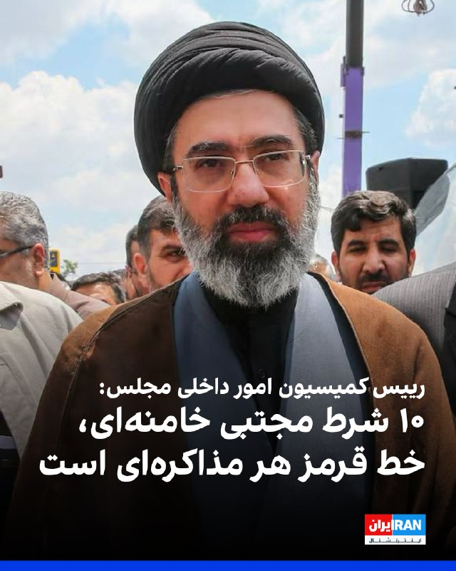

محمدصالح جوکار، رییس کمیسیون امور داخلی مجلس، با اشاره به حاضر نشدن جمهوری اسلامی در دور دوم مذاکره با آمریکا در پاکستان، گفت: «در این مدت پیشنهاداتی از سوی آمریکا مطرح شده اما جمهوری اسلامی همچنان بر همان بندهای اولیه تاکید دارد. شروط ده‌گانه خامنه‌ای خط قرمز هر مذاکره‌ای است.»

جوکار درباره جزئیات این شرط‌ها، گفت: «این ۱۰ شرط شامل عبور کنترل شده از تنگه هرمز با هماهنگی نیروهای مسلح جمهوری اسلامی، پایان جنگ علیه همه اجزای محور مقاومت، بیرون رفتن نیروهای رزمی آمریکا از تمامی پایگاه‌های منطقه، پرداخت کامل خسارت، رفع همه تحریم‌ها، پذیرش حق غنی‌سازی و آزاد شدن کلیه اموال و دارایی‌های بلوکه شده در خارج از کشور است.»
https://iranintl.com/202605174825

## IranIntlTV — post 337571

  <a href="telegram/content/IranIntlTV_337571_1779003138.mp4" target="_blank">🎬 Download video</a>

ایرانیان مقیم ملبورن استرالیا در یکی دیگر از آخر هفته‌های اعتراضی ایرانیان خارج از کشور، با حضور در مرکز این شهر، یاد قربانیان جنایات جمهوری اسلامی را گرامی داشتند. این تجمع در حمایت از زندانیان سیاسی، مخالفت با اعدام‌ها و برای رساندن صدای مردم ایران به افکار عمومی جهان برگزار شد.
علیرضا محبی، خبرنگار ایران‌اینترنشنال، گزارش می‌دهد
@iranintltv

## IranIntlTV — post 337570

  

عباس عراقچی، وزیر امور خارجه جمهوری اسلامی، در کانال تلگرامی خود اعلام کرد که کتاب «قدرت مذاکره» او به چاپ پنجم رسیده و در چاپ جدید این کتاب، بخش جدیدی با عنوان «دیپلماسی زیر آتش» درباره روند «مذاکرات غیرمستقیم با آمریکا در جنگ ۱۲ روزه» به آن افزوده شده است.
https://iranintl.com/202605171856

## IranIntlTV — post 337569

  <a href="telegram/content/IranIntlTV_337569_1779003140.mp4" target="_blank">🎬 Download video</a>

روزنامه تهران‌تایمز، وابسته به سازمان تبلیغات اسلامی، نوشت محاصره دریایی ایران از سوی آمریکا باعث تغییر استراتژیک در لجستیک و ترانزیت منطقه‌ای شده است.
جزییات بیشتر با احمد علوی، استاد دانشگاه و اقتصاددان
@iranintltv

## IranIntlTV — post 337568

  <a href="telegram/content/IranIntlTV_337568_1779003142.mp4" target="_blank">🎬 Download video</a>

شهباز شریف، نخست‌وزیر پاکستان، در گفت‌وگو با روزنامه تایمز بریتانیا گفت اسلام‌آباد نسبت به دستیابی صلح پایدار میان آمریکا و جمهوری اسلامی خوش‌بین است و برای تضمین این صلح، تمام تلاش خود را به کار می‌گیرد.
جزییات بیشتر در گفت‌وگو با علیرضا نامور حقیقی، تحلیل‌گر سیاسی
@iranintltv

## IranIntlTV — post 337567

  

عبدالغفور امان‌زاده، عضو کمیسیون کشاورزی مجلس، با اعلام افزایش ۲۰ هزار تومانی قیمت گندم، گفت: «نگرانی اصلی کشاورزان بابت پرداخت مطالبات و پول گندم است. از آغاز فصل برداشت تا امروز حدود ۴۵ روز می‌گذرد اما متاسفانه دیناری بابت این مسئله به کشاورزان پرداخت نشده است.»
https://iranintl.com/202605174138

## IranIntlTV — post 337566

  <a href="telegram/content/IranIntlTV_337566_1779003144.mp4" target="_blank">🎬 Download video</a>

سندیکای کارگران نیشکر هفت‌تپه در بیانیه‌ای خواستار تعیین دستمزد ۷۰ میلیون تومانی برای کارگران در سال جاری شد. این تشکل مستقل کارگری هشدار داد ادامه شکاف میان دستمزدها و تورم، فاصله طبقاتی را عمیق‌تر خواهد کرد.
جزییات بیشتر با روزبه بوالهری، عضو تحریریه ایران‌اینترنشنال
@iranintltv

## IranIntlTV — post 337565

  <a href="telegram/content/IranIntlTV_337565_1779003146.mp4" target="_blank">🎬 Download video</a>

سازمان حقوق بشر ایران در بیانیه‌ای نسبت به نقش برخی وکلای تسخیری در تسریع روند صدور و اجرای احکام اعدام معترضان هشدار داد. پیش‌تر نیز جمعی از وکلای حقوق بشری در ایران، وکلای تسخیری را همدستان نهادهای امنیتی در «محاکمات نمایشی» توصیف کرده بودند.
گفت‌وگو با محمد اولیایی‌فرد، وکیل دادگستری و عضو اتحادیه بین‌المللی وکلا
@iranintltv

## IranIntlTV — post 337564

  <a href="telegram/content/IranIntlTV_337564_1779003148.mp4" target="_blank">🎬 Download video</a>

شهباز شریف، نخست‌وزیر پاکستان، در گفت‌وگو با روزنامه تایمز بریتانیا گفت اسلام‌آباد نسبت به دستیابی صلح پایدار میان آمریکا و جمهوری اسلامی خوش‌بین است و برای تضمین این صلح، تمام تلاش خود را به کار می‌گیرد.
جزییات بیشتر در گفت‌وگو با علیرضا نامور حقیقی، تحلیل‌گر سیاسی
@iranintltv

## IranIntlTV — post 337563

  <a href="telegram/content/IranIntlTV_337563_1779003150.mp4" target="_blank">🎬 Download video</a>

دونالد ترامپ در گفت‌وگوی تلفنی با شبکه «ب‌اف‌ام» فرانسه هشدار داد اگر مقام‌های جمهوری اسلامی توافق نکنند، با «وضعیت بسیار بدی» روبه‌رو خواهند شد.
گفت‌وگو با امیر گیتی، عضو تحریریه ایران‌اینترنشنال
@iranintltv

## IranIntlTV — post 337562

🔻سازمان جهانی بهداشت وضعیت اضطراری برای شیوع ابولا اعلام کرد

سازمان جهانی بهداشت اعلام کرده شیوع ابولا در کنگو و اوگاندا به سطح «وضعیت اضطراری بهداشت عمومی با نگرانی بین‌المللی» رسیده است؛ هرچند این نهاد تاکید دارد که شرایط کنونی معیارهای یک همه‌گیری جهانی را ندارد.

به گفته این سازمان، نبود واکسن یا درمان تایید شده برای گونه «بوندیبوگیو»، این شیوع را به وضعیتی «غیرعادی» تبدیل کرده است.

به گزارش رویترز، سازمان جهانی بهداشت یکشنبه ۲۷ اردیبهشت هشدار داد شیوع ابولا که ناشی از ویروس بوندیبوگیو است، می‌تواند فراتر از مرزهای جمهوری دموکراتیک کنگو و اوگاندا گسترش پیدا کند و کشورهای همسایه کنگو در معرض خطر بالای انتقال بیماری قرار دارند.

بر اساس اعلام این نهاد وابسته به سازمان ملل، تا روز شنبه در استان ایتوری در شرق جمهوری دموکراتیک کنگو، دست‌کم ۸۰ مورد مرگ مشکوک، هشت مورد تایید شده آزمایشگاهی و ۲۴۶ مورد مشکوک ابتلا در سه منطقه بهداشتی شامل بونیا، روامپارا و مونگبالو ثبت شده است.

وزارت بهداشت جمهوری دموکراتیک کنگو پیش‌تر نیز از مرگ ۸۰ نفر در پی شیوع جدید بیماری خبر داده بود.

سازمان جهانی بهداشت هشدار داده با توجه به نرخ بالای مثبت بودن نمونه‌های اولیه و افزایش موارد مشکوک، ابعاد واقعی شیوع ممکن است بسیار گسترده‌تر از موارد شناسایی‌شده باشد.
ثبت موارد انتقال فرامرزی
به گفته سازمان جهانی بهداشت، مواردی از انتقال بین‌المللی بیماری تاکنون ثبت شده است. در اوگاندا، دو مورد تایید شده ابتلا - از جمله یک مورد مرگ - در کامپالا، پایتخت این کشور، گزارش شده که مربوط به افرادی بوده که از جمهوری دموکراتیک کنگو سفر کرده بودند.

همچنین یک مورد تایید شده ابتلا در کینشاسا، پایتخت جمهوری دموکراتیک کنگو، در فردی که از استان ایتوری بازگشته بود، شناسایی شده است.

این نهاد از کشورها خواسته سازوکارهای ملی مدیریت بحران را فعال کنند، غربالگری در مرزها و مسیرهای اصلی را افزایش دهند و موارد تایید شده را فوراً قرنطینه کنند.

بر اساس توصیه سازمان جهانی بهداشت، افراد مبتلا یا کسانی که با موارد بیماری تماس داشته‌اند، نباید تا ۲۱ روز پس از مواجهه با ویروس سفر بین‌المللی انجام دهند، مگر در شرایط تخلیه پزشکی.

توصیه به باز نگه داشتن مرزها
با وجود هشدار درباره خطر گسترش بیماری، سازمان جهانی بهداشت از کشورها خواسته از بستن مرزها یا اعمال محدودیت بر سفر و تجارت خودداری کنند.

به گفته این سازمان، محدودیت‌های شدید ممکن است موجب افزایش عبورهای غیررسمی از مرزها شود؛ مسیری که کنترل و پایش بیماری را دشوارتر خواهد کرد.

اعلام وضعیت اضطراری بین‌المللی از سوی سازمان جهانی بهداشت معمولاً برای جلب توجه جهانی، تسریع هماهنگی میان کشورها و تقویت پاسخ به بحران‌های بهداشتی صادر می‌شود؛ اما این نهاد تاکید کرده که شیوع کنونی ابولا هنوز به سطح یک همه‌گیری جهانی نرسیده است.
🔗وب‌سایت ایران‌اینترنشنال
@iranintltv

## IranIntlTV — post 337561

🔻ترامپ با انتشار پیام «آرامش پیش از طوفان»، گمانه‌زنی‌ها درباره ازسرگیری حملات را تشدید کرد

دونالد ترامپ، رییس‌جمهوری آمریکا، با انتشار پیامی مبهم درباره ایران در شبکه اجتماعی تروث سوشال، هم‌زمان با گزارش‌ها درباره احتمال ازسرگیری حملات آمریکا و اسرائیل علیه جمهوری اسلامی، به گمانه‌زنی‌ها درباره اغاز دوباره درگیری‌ها دامن زده است.

ترامپ شنبه ۲۶ اردیبهشت تصویری تولیدشده با هوش مصنوعی را در حساب کاربری خود منتشر کرد که او را در کنار یک دریادار نیروی دریایی آمریکا و در برابر دریایی طوفانی با چند کشتی نشان می‌دهد؛ از جمله کشتی‌ای با پرچم جمهوری اسلامی ایران.

روی این تصویر جمله «این آرامش پیش از طوفان بود» درج شده بود؛ پیامی که در شرایط افزایش تنش‌ها میان واشینگتن و تهران، توجه‌ها را به خود جلب کرده است.
انتشار این پست در حالی صورت گرفته که گزارش‌ها از آمادگی نظامی گسترده آمریکا و اسرائیل برای احتمال ازسرگیری حملات به ایران حکایت دارد. نیویورک تایمز شنبه گزارش داد که دو کشور در حال انجام آماده‌سازی‌های فشرده برای حملات احتمالی جدید علیه حکومت ایران، احتمالاً از اوایل هفته آینده، هستند.

به نوشته این روزنامه، این گسترده‌ترین آرایش نظامی از زمان برقراری آتش‌بس به شمار می‌رود.

ترامپ: برای توافق، تضمین واقعی از ایران می‌خواهم
ترامپ روز جمعه در اظهاراتی اعلام کرد ممکن است با تعلیق ۲۰ ساله برنامه هسته‌ای ایران موافقت کند، اما تاکید کرد که چنین توافقی تنها در صورتی قابل قبول خواهد بود که جمهوری اسلامی «تضمینی واقعی» ارائه دهد.

او هنگام بازگشت از سفر به چین و در گفت‌وگو با خبرنگاران در هواپیمای اختصاصی ریاست‌جمهوری آمریکا در پاسخ به این پرسش که آیا آخرین پیشنهاد ایران را رد کرده است، گفت: «آن را بررسی کردم و اگر جمله اول را دوست نداشته باشم، کل پیشنهاد را کنار می‌گذارم.»
ترامپ توضیح داد نخستین بخش پیشنهاد [حکومت] ایران برای او «غیرقابل قبول» بوده، زیرا از نظر او تهران با کنار گذاشتن کامل فعالیت‌های هسته‌ای موافقت نکرده است.

او افزود: «اگر آن‌ها هر نوع فعالیت هسته‌ای داشته باشند، دیگر ادامه نامه را نمی‌خوانم.»

رییس‌جمهوری آمریکا همچنین در پاسخ به پرسشی درباره کافی بودن تعلیق ۲۰ ساله برنامه هسته‌ای ایران گفت: «۲۰ سال کافی است، اما سطح تضمینی که از آن‌ها دریافت می‌کنیم کافی نیست. باید واقعاً ۲۰ سال باشد، نه یک ۲۰ سال ساختگی.»

هشدار درباره پایان صبر آمریکا
ترامپ پنج‌شنبه نیز در گفت‌وگویی با شان هنیتی، مجری شبکه فاکس نیوز، هشدار داده بود که صبر او در قبال [حکومت] ایران رو به پایان است.

او در این مصاحبه گفت: «دیگر خیلی صبر نخواهم کرد. آن‌ها باید توافق کنند. هر فرد عاقلی توافق می‌کند، اما شاید آن‌ها دیوانه باشند.»

این مصاحبه تنها چند ساعت پس از آن منتشر شد که ترامپ در پیامی دیگر در تروث سوشال تلویحاً اشاره کرده بود جنگ علیه [حکومت] ایران هنوز پایان نیافته و عملیات نظامی علیه جمهوری اسلامی ممکن است ادامه پیدا کند.

اظهارات اخیر ترامپ و انتشار پیام «آرامش پیش از طوفان» در حالی مطرح می‌شود که آینده مذاکرات میان واشینگتن و تهران نامشخص باقی مانده و هم‌زمان گزارش‌ها از افزایش آمادگی‌های نظامی آمریکا و اسرائیل، نگرانی‌ها درباره احتمال ازسرگیری درگیری را افزایش داده است.
🔗وب‌سایت ایران‌اینترنشنال
@iranintltv

## IranIntlTV — post 337560

  <a href="telegram/content/IranIntlTV_337560_1779003151.mp4" target="_blank">🎬 Download video</a>

سرخط خبرهای یکشنبه ۲۷ اردیبهشت
@iranintltv

## IranIntlTV — post 337559

  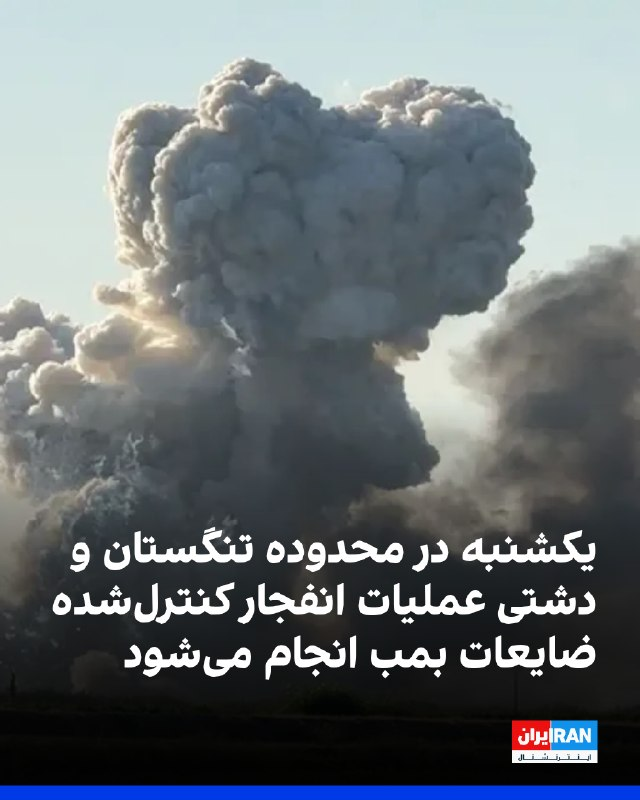

فرماندهی مرزبانی استان بوشهر اعلام کرد یکشنبه عملیات انفجار و حریق کنترل‌شده برای امحای مواد و ضایعات بمب در محدوده باشی، بین شهرستان‌های تنگستان و دشتی، انجام می‌شود. این عملیات از ساعت ۸ تا ۱۷ برگزار می‌شود.
https://iranintl.com/202605174227

## ManotoTV — post 105547

  <a href="telegram/content/ManotoTV_105547_1779003153.mp4" target="_blank">🎬 Download video</a>

تجمع ایرانیان ایسلند، ۲۶ اردیبهشت
ایسلند از کم‌جمعیت‌ترین کشورهای اروپاست و جامعه ایرانی کوچکی دارد.

## ManotoTV — post 105546

  <a href="telegram/content/ManotoTV_105546_1779003154.mp4" target="_blank">🎬 Download video</a>

بریتانیا پنج عضو خانواده زرین‌قلم را به اتهام ارتباط با شبکه مالی پنهان جمهوری اسلامی تحریم کرده است. فرهاد زرین‌قلم، مهندس بریتانیایی ایرانی‌تبار، همراه با فضل‌الله، منصور، ناصر و پوریا زرین‌قلم در فهرست تازه تحریم‌های لندن قرار گرفته‌اند.

بر اساس اعلام وزارت خارجه بریتانیا، این افراد و دو صرافی مرتبط با آنان، «صرافی برلیان» و «جی‌سی‌ام اکسچنج»، به ارائه خدمات مالی برای افرادی و نهادهایی متهم شده‌اند که فعالیت‌هایشان با بی‌ثبات‌سازی بریتانیا یا دیگر کشورها ارتباط داشته است. لندن این افراد را با ممنوعیت سفر، توقیف دارایی و ممنوعیت مدیریت شرکت‌ها روبه‌رو کرده است.

آسوشیتدپرس نیز نوشت مقام‌های بریتانیا این تحریم‌ها را بخشی از مقابله با «فعالیت‌های خصمانه مرتبط با ایران» دانسته‌اند و گفته‌اند شبکه‌های مالی پنهان برای دور زدن تحریم‌ها و انتقال میلیاردها دلار به سود بخش‌های نفتی و نظامی جمهوری اسلامی به‌کار رفته‌اند.

## ManotoTV — post 105545

  <a href="telegram/content/ManotoTV_105545_1779003155.mp4" target="_blank">🎬 Download video</a>

راهپیمایی ایرانیان سان‌فرانسیسکو، ۲۶ اردیبهشت

## ManotoTV — post 105544

  <a href="telegram/content/ManotoTV_105544_1779003156.mp4" target="_blank">🎬 Download video</a>

راهپیمایی ایرانیان ساکن ونکوور کانادا، ۲۶ اردیبهشت

## ManotoTV — post 105543

  <a href="telegram/content/ManotoTV_105543_1779003158.mp4" target="_blank">🎬 Download video</a>

بلغارستان برای نخستین بار برنده مسابقه آواز یوروویژن شد. دارا، خواننده بلغاری، با ترانه «بنگارنگا» در فینال هفتادمین دوره این مسابقه در وین اتریش، ۵۱۶ امتیاز گرفت و مقام نخست را به دست آورد.

بر اساس اعلام وب‌سایت رسمی یوروویژن، بلغارستان هم در رای هیات‌های داوری و هم در رای مردمی اول شد. اسرائیل در جایگاه دوم و رومانی در جایگاه سوم قرار گرفتند.

## ManotoTV — post 105542

  <a href="telegram/content/ManotoTV_105542_1779003158.mp4" target="_blank">🎬 Download video</a>

دولت بریتانیا اعلام کرد سامانه‌ای تازه و کم‌هزینه برای مقابله با پهپادها را روی جنگنده‌های تایفون نیروی هوایی سلطنتی در خاورمیانه مستقر کرده است.

این سامانه که «سلاح کشتار دقیق پیشرفته» نام دارد، راکت‌های غیرهدایتی را با کیت هدایت لیزری به مهمات دقیق تبدیل می‌کند و به گفته وزارت دفاع بریتانیا، امکان انهدام اهداف را با هزینه‌ای بسیار کمتر از موشک‌های رایج فراهم می‌سازد.

وزارت دفاع بریتانیا اعلام کرد این سامانه با همکاری شرکت‌های بی‌ای‌ئی سیستمز و کینتیک، در کمتر از دو ماه از مرحله آزمایش به استقرار عملیاتی رسیده است. رسانه‌های دفاعی نیز گزارش داده‌اند جنگنده‌های تایفون بریتانیا در خاورمیانه اکنون برای ماموریت‌های مقابله با پهپاد به این سامانه مجهز شده‌اند.

## FarsiVOA — post 217947

  

بری روزن، گروگان پیشین آمریکایی در ایران، نسبت به «افزایش سریع و نگران‌کننده اعدام‌ها در ایران» هشدار داد و آن را «نشان‌دهنده راهبردی حساب‌شده برای سرکوب هرگونه مخالفت» دانست.

آقای روزن در شبکه اجتماعی ایکس با اشاره به گزارش نهادهای حقوق بشر و رسانه‌ها درباره افزایش اعدام‌ها در ایران افزود: «گروه‌های حقوق بشری تأکید می‌کنند که این افزایش در اعدام‌ها در مقطعی حساس رخ می‌دهد؛ زمانی که ممکن است توجه بین‌المللی در خلال آتش‌بس رو به کاهش باشد.»

او به گزارش مرکز حقوق بشر در ایران اشاره و تأکید کرد: «این سرکوب بی‌رحمانه، به‌ویژه در زندان‌ها و دادگاه‌ها، در حال تشدید شدن است.»

جمهوری اسلامی در هفته‌های اخیر و همزمان با قطعی سراسری اینترنت، روند سرکوب‌ها و به ویژه اعدام‌ها را سرعت داده است. از آغاز جنگ با آمریکا و اسرائیل، دستگاه قضایی دستکم ۳۳ تن را به بهانه حضور در اعتراضات، عضویت در گروه‌های مخالف یا «همکاری با دشمن»، اعدام کرده است.
@FarsiVOA

## FarsiVOA — post 217946

🔺پگاه آهنگرانی در کن: روزهای سخت می‌گذرد و مردم آزادی را جشن می‌گیرند

▪️پگاه آهنگرانی، بازیگر و فیلمساز ایرانی، روز شنبه ۲۶ اردیبهشت برای نمایش فیلم تازه خود «تمرین‌هایی برای یک انقلاب» در جشنواره کن حاضر شد.

▪️او پیش از آغاز نمایش، این فیلم را به مادرانی تقدیم کرد که فرزندانشان را در مسیر مبارزه برای آزادی از دست داده‌اند.

▪️او همراه با عوامل فیلم روی صحنه رفت و گفت خوشحال است که از راه این اثر توانسته بخشی از مبارزه مردم برای آزادی و دموکراسی را به تصویر بکشد.

⬇️ بیشتر بخوانید:
https://ir.voanews.com/a/8150866.html

## FarsiVOA — post 217945

  

جواد علیکردی، شهروند اهل سبزوار و برادر خسرو علیکردی، وکیل دادگستری جان‌باخته، توسط دستگاه قضایی به ۱۰ سال حبس تعزیری محکوم شد.

جواد علیکردی اخیراً توسط یکی از شعب دادگاه انقلاب مشهد محاکمه و به تحمل ۱۰ سال حبس تعزیری محکوم شده است. این حکم در حالی صادر شده که وی همچنان در زندان وکیل‌آباد مشهد محبوس است و تاکنون اطلاع دقیقی از عناوین اتهامی مندرج در حکم صادر شده در دسترس نیست.

جواد علیکردی شامگاه ۲۱ آذرماه ۱۴۰۴، پس از انتشار ویدیویی در اعتراض به بازداشت گسترده سوگواران در مراسم هفتم برادرش بازداشت شد.

او در آن ویدئو اعلام کرده بود که اسناد محرمانه‌ای در این باره مرگ مشکوک برادرش در اختیار دارد.

خسرو علیکردی، در تاریخ ۱۴ آذر ۱۴۰۴ به طرز مشکوکی در دفتر کار خود جان باخت. نهادهای حکومتی علت مرگ را «ایست قلبی» اعلام کردند، اما خانواده علیکردی با اشاره به شواهدی چون خونریزی غیرعادی، این روایت را رد کرده و خواهان شفاف‌سازی شدند؛ امری که منجر به برخورد امنیتی با اعضای این خانواده و بازداشت جواد علیکردی شد.
@FarsiVOA

## FarsiVOA — post 217944

🔺بریتانیا یک سامانه جدید و کم‌هزینه ضدپهپاد در خاورمیانه مستقر کرد

▪️بریتانیا اعلام کرد که یک سامانه پدافند موشکی جدید و کم‌هزینه ضدپهپاد را برای دفاع از شهروندان و شرکای خود در برابر حملات پهپادی در خاورمیانه مستقر کرده است.

▪️این سامانه که با نام «سامانه پیشرفته سلاح کشتار دقیق» (ای‌پی‌کی‌دبلیواس) معرفی شده، بر روی این جنگنده‌های نیروی هوایی سلطنتی بریتانیا نصب خواهد شد تا آنها بتوانند اهداف را با دقت بالا و با کسری از هزینه موشک‌هایی که تاکنون استفاده می‌شد، منهدم کنند.

▪️این استقرار پس از آن صورت می‌گیرد که دونالد ترامپ، رییس‌جمهور آمریکا بارها از کشورهای عضو ناتو از جمله بریتانیا در ارتباط با جنگ علیه جمهوری اسلامی انتقاد کرده است.

⬇️ بیشتر بخوانید:
https://ir.voanews.com/a/8150865.html

## FarsiVOA — post 217943

  

رویترز گزارش داد دولت ترامپ روز شنبه معافیت تحریمی مربوط به خرید نفت دریابرد روسیه را تمدید نکرد؛ معافیتی که پیش‌تر به کشورهایی از جمله هند اجازه می‌داد در شرایط کمبود عرضه جهانی، نفت روسیه را خریداری کنند.

این معافیت پس از تمدید یک‌ماهه‌ای منقضی شد که هدف آن کاهش فشار بر بازار نفت، پس از بسته‌شدن تنگه هرمز از سوی ایران، اعلام شده بود.

وزارت خزانه‌داری آمریکا پیش‌تر گفته بود مجوز عمومی خرید نفت روسیه ذخیره‌شده در نفتکش‌ها تمدید نخواهد شد.

دو سناتور دموکرات نیز از دولت خواسته بودند این معافیت را ادامه ندهد و گفته بودند چنین اقدامی به درآمد روسیه برای جنگ با اوکراین کمک می‌کند.

رویترز نوشته قیمت بنزین در آمریکا به حدود ۴ دلار و ۵۰ سنت در هر گالن رسیده و نفت از زمان آغاز جنگ ایران، نزدیک یا بالاتر از ۱۰۰ دلار در هر بشکه مانده است. هند بزرگ‌ترین خریدار نفت دریابرد روسیه است.
@FarsiVOA

## FarsiVOA — post 217942

  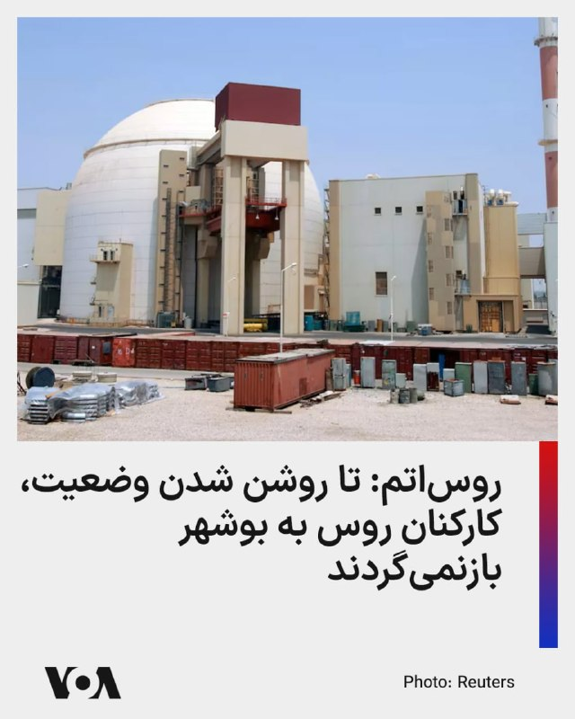

الکسی لیخاچف، رئیس شرکت روس‌اتم، اعلام کرد این شرکت تا روشن شدن وضعیت امنیتی پیرامون ایران، نمی‌تواند اعلام کند کارکنان روس را به طور کامل به نیروگاه اتمی بوشهرگرداند.

او گفت روس‌اتم برنامه‌ریزی برای افزایش تعداد افراد روسی در بوشهر را آغاز کرد، اما هم‌زمان ناچار است «وضعیت نظامی» را در نظر بگیرید.

لیخاچف به گزارش رسانه‌ها درباره احتمال ازسرگیری جنگ اشاره کرد و گفت تا روشن شدن اوضاع، بازگشت کامل نیروها ممکن نیست.

با آغاز عملیات آمریکا و اسرائیل علیه جمهوری اسلامی در اسفند سال گذشته، روس‌اتم حضور نیروهای روس در بوشهر را مرحله‌به‌مرحله کاهش داده است. ابتدا ۹۴ نفر، سپس ۱۵۰ نفر، بعد ۱۶۳ نفر، در مرحله بعد ۱۹۸ نفر، و در نهایت ۱۰۸ نفر دیگر از سایت خارج شدند؛ تا جایی که در اواخر فروردین‌ماه تنها ۲۰ نیروی روس برای حفظ ایمنی تجهیزات و اداره حداقلی در نیروگاه باقی ماندند.
@FarsiVOA

## FarsiVOA — post 217941

  

نماینده هند در سازمان ملل اعلام کرد هدف قرار دادن کشتی‌های تجاری، به خطر انداختن خدمه غیرنظامی و ایجاد اختلال در آزادی کشتیرانی در تنگه هرمز غیرقابل قبول است.

پارواتاننی هریش در اجلاس ویژه شورای اجتماعی و اقتصادی سازمان ملل متحد درباره بحران انرژی و کودهای کشاورزی گفته است قوانین بین‌المللی در رابطه با تنگه هرمز باید به‌ طور کامل رعایت شوند.

او تصریح کرد برای مقابله با این بحران، ترکیبی از اقدامات کوتاه‌مدت و ساختاری، در کنار همکاری‌های بین‌المللی، ضروری است.

تنگه هرمز محل عبور ۲۰ درصد از نفت مصرفی و ۳۵ درصد از تجارت کودهای کشاورزی جهان است که از ۹ اسفند به خاطر انسداد تنگه هرمز توسط جمهوری اسلامی و حمله به دهها کشتی، مختل شده است.
@FarsiVOA

## DW_Farsi — post 124784

  

📸 عکس روز: بلغارستان بر قله مسابقات یوروویژن

بلغارستان با پیروزی در مسابقات آواز یوروویژن امسال در وین، عنوان قهرمانی را به دست آورد. "دارا" خواننده بلغاری، با ترانه "بانگارانگا" موفق به کسب مقام اول شد.
دارا" هم در رأی داوران و هم در رأی‌گیری تماشاگران پیروز شد و با ترانه شاد و رقصی هیجان‌انگیز‌ با اختلاف قابل‌توجهی بالاتر از ۲۴ کشور شرکت‌کننده دیگر قرار گرفت. خواننده اسرائیلی دوم شد و آلمان مقام ۲۳ را کسب کرد.

@dw_farsi

## DW_Farsi — post 124783

  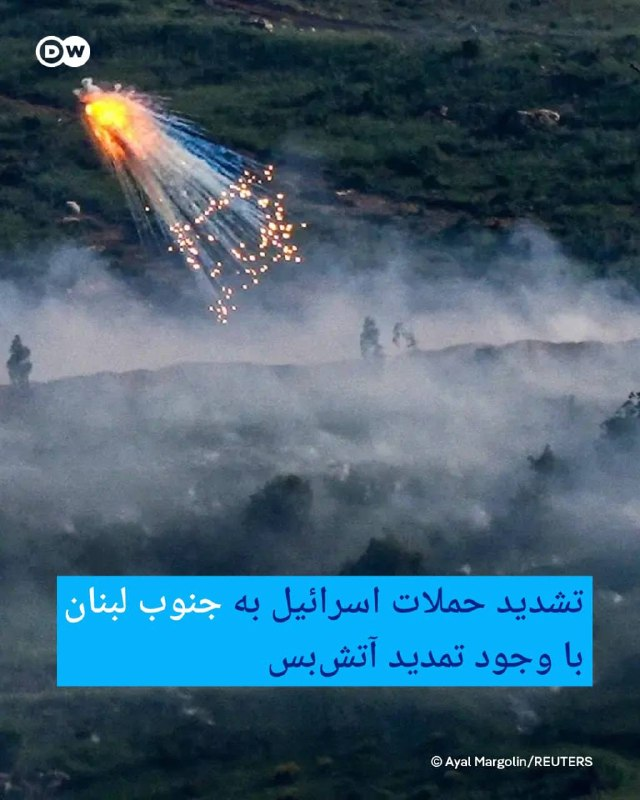

🔶 تشدید حملات اسرائیل به جنوب لبنان با وجود تمدید آتش‌بس

اسرائیل روز شنبه ۱۶ ماه مه (۲۶ اردیبهشت)، با وجود تمدید آتش‌بس با لبنان، موج گسترده‌ای از حملات هوایی را در جنوب این کشور آغاز کرد.

این حملات پس از صدور هشدار تخلیه برای ۹ روستا صورت گرفت.

خبرگزاری رسمی لبنان (NNA) روز شنبه از حمله به بیش از ۲۰ روستا خبر داد. این خبرگزاری همچنین از موج جدیدی از کوچ ساکنان لبنان به سمت شهرهای صیدا و بیروت خبر داد.

حزب‌الله لبنان نیز در اواخر روز شنبه اعلام کرد که به یک هدف نظامی در شمال اسرائیل حمله کرده است است.

دو کشور روز جمعه با تمدید ۴۵ روزه آتش‌بسی موافقت کردند که از ۱۷ آوریل آغاز شده اما با نقض‌های متعددی همراه بوده است. آنتونیو گوترش، دبیرکل سازمان ملل متحد، روز شنبه اعلام کرد که از این تمدید استقبال می‌کند و از هر دو کشور می‌خواهد به توقف درگیری‌ها به طور کامل احترام بگذارند.

@dw_farsi

## DW_Farsi — post 124782

🔶 جام‌های ۱۹۶۲ و ۱۹۶۶؛ یاشین، عنکبوت سیاه و دروازه‌بان قرن

زمانی یک مفسر فوتبال درباره‌ یاشین دروازه‌بان سابق تیم ملی فوتبال شوروی گفته بود: «توپی که از کنار یاشین عبور کند، از کنار دروازه عبور خواهد کرد.» این سخن به بهترین نحوی تسخیرناپذیری این اسطوره‌ فوتبال را بیان می‌کند.

اوزه بیو ستاره‌ی فوتبال پرتغال در دهه‌ی ۶۰ نیز گفته بود: «یاشین بهترین دروازه‌بانی است که تاریخ فوتبال جهان به خود دیده است.»

روسیه که میزبانی مسابقات جام جهانی ۲۰۱۸ را بر عهده داشت، در آن دوره از بازی‌ها یاد دروازه‌بان اسطوره‌ای خود را گرامی داشته بود و بر پوستر رسمی جام ۲۰۱۸ تصویر یاشین می‌درخشید.

لئو ایوانویچ یاشین در ۲۲ اکتبر سال ۱۹۲۹ در بوگورودسکویه واقع در نزدیکی مسکو به دنیا آمد. در نوجوانی تا مدت‌ها می‌خواست قهرمان شطرنج شود و بر جایگاه آن زمان میخائیل بوتوینیک، قهرمان روسی شطرنج جهان تکیه زند.

بعدها این فکر را کنار گذاشت و به رشته‌های ورزشی دیگر مانند شمشیربازی، بسکتبال و تنیس روی آورد. سپس توانایی‌های خود را در رشته هاکی روی یخ نیز آزمود و به این ورزش دل بست. او دروازه‌بان هاکی روی یخ بود و فکر نمی‌کرد روزی بزرگ‌ترین دروازه‌بان تاریخ فوتبال شود.

@dw_farsi

## DW_Farsi — post 124781

  

🔶 "مشارکت پنهانی عربستان سعودی و امارات در حملات علیه ایران"

دیپلمات‌های غربی و محافل امنیتی عربی در گفت‌وگو با خبرگزاری آلمان (dpa) تایید کردند که عربستان سعودی و امارات متحده عربی "به طور مخفیانه و فعال" در حملات علیه ایران مشارکت داشته‌اند.

وال‌استریت ژورنال و نیویورک تایمز نیز گزارش داده‌اند که این کشورها دست به حمله نظامی علیه ایران زده‌اند.

دولت‌های این کشورها هنوز به طور رسمی این اقدامات را تایید نکرده‌اند و همچنان صرفا بر "حق دفاع از خود" تاکید می‌کنند.

وزارت امور خارجه امارات متحده عربی روز شنبه ۲۶ اردیبهشت (۱۶ مه) در بیانیه‌ای اقدامات نظامی علیه ایران را به‌عنوان "تدابیری کاملا دفاعی برای حفظ حاکمیت خود" توصیف و اعلام کرده بود که همه اقدامات انجام‌شده با هدف "حفاظت از غیرنظامیان و زیرساخت‌های حیاتی" صورت گرفته است.

جمهوری اسلامی ایران در میان کشورهای حوزه خلیج فارس، بیشترین حملات را علیه امارات انجام داده است.

@dw_farsi

## DW_Farsi — post 124780

  

🔶 ایالات متحده معافیت تحریمی نفت روسیه را منقضی کرد

دولت آمریکا معافیتی را که موجب کاهش تحریم‌ها علیه نفت روسیه شده بود را تمدید نکرد. دلیل این اقدام، افزایش قیمت انرژی در پی جنگ ایران است.

ایالات متحده با این اقدام تلاش کرده تا بازارهای جهانی را آرام کند. پیش از این، فروش و تحویل نفت روسیه که تا زمان مشخصی بارگیری شده بود، از تحریم‌ها معاف بود.

اخیرا از جمله از سوی حزب دموکرات در آمریکا، درخواست‌هایی مبنی بر عدم تمدید این معافیت مطرح شده بود.

برخی سناتورهای این حزب با اعلام این که وزارت خزانه‌داری آمریکا باید بالاخره به این سیاست نسنجیده خود پایان دهد، تاکید کرده بودند که نباید به روسیه کمک شود تا از "جنگ بی‌ملاحظه ترامپ در ایران" سود بیشتری به دست آورد.

@dw_farsi

## DW_Farsi — post 124779

  

🔶 بازگشت ناوهواپیمابر "یواس‌اس جرالد آر. فورد" به آمریکا

ناوهواپیمابر آمریکایی "یواس‌اس جرالد آر. فورد" پس از یک ماموریت ۳۲۶ روزه در آب‌های بین‌المللی، دوباره به ایالات متحده بازگشت.

بر اساس اعلام ارتش آمریکا در شبکه اجتماعی ایکس، پیت هگست، وزیر دفاع این کشور در بندر اصلی این ناو در نورفولکِ ایالت ویرجینیا، از بزرگ‌ترین ناوهواپیمابر جهان استقبال کرد.

این کشتی حدود دو هفته پیش، پس از مشارکت در عملیات‌های نظامی علیه ایران، منطقه خلیج فارس را ترک کرده بود. ناوهواپیمابر "یواس‌اس جرالد آر. فورد" بیش از ده ماه را در آب‌های بین‌المللی سپری کرد.

به گفته موسسه نیروی دریایی ایالات متحده، این طولانی‌ترین ماموریت یک ناوهواپیمابر آمریکایی از زمان پایان جنگ سرد به شمار می‌رود.

@dw_farsi

## DW_Farsi — post 124778

🔶 هشدار ترامپ به ایران: این آرامش پیش از طوفان است

در حالی که گزارش‌هایی درباره احتمال ازسرگیری حملات آمریکا علیه ایران منتشر شده، دونالد ترامپ، رئیس‌جمهور ایالات متحده، روز شنبه ۱۶ ماه مه (۲۶ اردیبهشت) با انتشار تصویری هشدارآمیز، وضعیت کنونی خاورمیانه را "آرامش پیش از طوفان" توصیف کرد.

در تصویری که با هوش مصنوعی تولید شده و ترامپ آن را در شبکه اجتماعی خود، "تروث سوشال" منتشر کرده، او با کلاه معروف "عظمت را به آمریکا بازگردانیم" در کنار یک دریاسالار نیروی دریایی آمریکا دیده می‌شود. این تصویر، آن دو را در میان آب‌های متلاطم و صاعقه‌ها، بر عرشه یک ناو آمریکایی نشان می‌دهد؛ در حالی که در پس‌زمینه، چند شناور ایرانی با پرچم جمهوری اسلامی نیز دیده می‌شوند.

بر فراز این تصویر جمله "این آرامش پیش از طوفان بود" نوشته شده؛ پیامی که می‌تواند به‌عنوان هشداری خطاب به ایران تعبیر شود.

روزنامه نیویورک تایمز پیشتر گزارش داده بود که ترامپ در آستانه اتخاذ تصمیمی مهم درباره ایران قرار دارد و مشاوران ارشد او در صورت شکسته‌شدن بن‌بست دیپلماتیک، در حال بررسی سناریوهای ازسرگیری حملات هوایی هستند.

ترامپ روز شنبه در گفت‌وگو با شبکه فرانسوی ‌‌"BFMTV" نیز با اشاره به این که هنوز مشخص نیست مذاکرات درباره برنامه هسته‌ای ایران و تنش‌های اخیر به توافق منجر شود یا نه، هشدار داد: «اگر توافق نکنند، دوران بسیار سختی خواهند داشت.»

@dw_farsi

## Persian_Trend_Official — post 14305

  <a href="telegram/content/Persian_Trend_Official_14305_1779003165.webm" target="_blank">🎬 Download video</a>

⭕️ حماس: هشدار می‌دهیم که همه گزینه‌ها بر روی میز است. 📝 Nick 📌 @persian_trend_official پرشین ترند | متفاوت‌ترین کانال نظامی

## Persian_Trend_Official — post 14301

  <a href="telegram/content/Persian_Trend_Official_14301_1779003165.mp4" target="_blank">🎬 Download video</a>

⭕️ صبح امروز طی حمله پهپاد‌ی گسترده ارتش اوکراین چندین منطقه در مسکو مورد اصابت قرار گرفتند!

به گزارش منابع روسی بیش از 10 نقطه در مسکو هدف قرار گرفتند. وزارت دفاع روسیه مدعی سرنگونی 148 پهپاد اوکراینی است. در ویدیو‌ها لحظه و نتیجه اصابت چند پهپاد و همچنین رهگیری یک پهپاد توسط سامانه پانتیسر روسی مشخص است.

📝 Nick

📌 @persian_trend_official
پرشین ترند | متفاوت‌ترین کانال نظامی

## Persian_Trend_Official — post 14300

  

⭕️ 6 هواپیمای ترابری C-17 در حال ورود به پایگاه‌های ارتش آمریکا در منطقه هستند.

📝 Nick

📌 @persian_trend_official
پرشین ترند | متفاوت‌ترین کانال نظامی

## Persian_Trend_Official — post 14299

⭕️ حماس: هشدار می‌دهیم که همه گزینه‌ها بر روی میز است.

📝 Nick

📌 @persian_trend_official
پرشین ترند | متفاوت‌ترین کانال نظامی

## Persian_Trend_Official — post 14298

  <a href="telegram/content/Persian_Trend_Official_14298_1779003168.mp4" target="_blank">🎬 Download video</a>

⭕️ رئیس کانون عالی بازنشستگان تأمین اجتماعی:

تاکنون ۲۲۳ هزار نفر درخواست بیمه بیکاری داده‌اند.

📝 Nick

📌 @persian_trend_official
پرشین ترند | متفاوت‌ترین کانال نظامی

## Persian_Trend_Official — post 14297

  

کابل زیردریایی «Asia Link»؛ گام تازه چین برای استقلال دیجیتال در آسیا

چین از راه‌اندازی یک کابل زیردریایی جدید با نام «Asia Link» خبر داده؛ پروژه‌ای با طول حدود ۶۲۰۰ کیلومتر و ظرفیت انتقال بیش از ۳۲۵ ترابیت بر ثانیه که چند کشور کلیدی شرق و جنوب‌شرق آسیا را به هم متصل می‌کند.

این کابل چین را به سنگاپور، ویتنام، مالزی، برونئی و فیلیپین وصل می‌کند و برای نخستین‌بار، یکی از نقاط اتصال خارجی این شبکه خارج از سرزمین اصلی چین و در هنگ‌کنگ قرار گرفته است.

اهمیت این پروژه فقط در بُعد فنی نیست. در حال حاضر بخش عمده مسیرهای اصلی اینترنت جهانی و کابل‌های زیردریایی در اختیار شرکت‌ها و زیرساخت‌های غربی قرار دارد. چین با توسعه چنین پروژه‌هایی به‌دنبال ایجاد مسیرهای جایگزین و کاهش وابستگی به این شبکه‌هاست.

پ.ن : این کابل بخشی از یک روند بزرگ‌تر است؛ شکل‌گیری یک «اینترنت موازی آسیایی» که در صورت تشدید رقابت‌های ژئوپلیتیکی، می‌تواند به تفکیک زیرساخت‌های ارتباطی شرق و غرب منجر شود.

📌 @persian_trend_official
پرشین ترند | متفاوت‌ترین کانال نظامی

## Persian_Trend_Official — post 14296

تیتر مهم‌ترین اخبار ۲۴ ساعت گذشته 👇

تشدید تحرکات نظامی آمریکا در خلیج فارس و دریای عمان

افزایش سطح آماده‌باش نیروهای مسلح ایران در جنوب کشور

ادامه مذاکرات غیررسمی تهران–واشنگتن با محور تنگه هرمز

ورود تجهیزات و نیروهای جدید آمریکایی به پایگاه‌های منطقه

هشدار ایران به هرگونه مداخله نظامی خارجی در هرمز

بررسی طرح ائتلاف دریایی برای اسکورت نفتکش‌ها

افزایش قیمت نفت در واکنش به ریسک امنیت انرژی

اختلال محدود در مسیر برخی کشتی‌های تجاری در منطقه

تشدید پرواز پهپادهای شناسایی آمریکا نزدیک مرزهای ایران

استقرار بیشتر جنگنده‌ها و بمب‌افکن‌ها در خاورمیانه

افزایش سطح هشدار امنیتی در امارات و بحرین

نشست اضطراری کشورهای غربی درباره امنیت کشتیرانی

تأکید رسانه‌های غربی بر حفظ توان بازدارندگی ایران

افزایش حملات و فعالیت‌های سایبری در زیرساخت‌های حساس

گسترش عملیات‌های اطلاعاتی در کشورهای اطراف ایران

تشدید جنگ رسانه‌ای میان ایران و آمریکا

آماده‌باش نیروهای دریایی در منطقه خلیج فارس

بررسی گزینه‌های نظامی محدود در پنتاگون

هشدار شرکت‌های بیمه به کشتی‌ها درباره عبور از هرمز

افزایش تردد نظامی در اطراف تنگه هرمز

📌 @persian_trend_official
پرشین ترند | متفاوت‌ترین کانال نظامی

## Persian_Trend_Official — post 14295

  

⭕️ دولت ونزوئلا اعلام کرد «الکس صائب» از متحدان نزدیک نیکولاس مادورو را به ایالات متحده تحویل داده است.

صائب پیش‌تر از سوی آمریکا به پول‌شویی، فساد مالی و دور زدن تحریم‌ها متهم شده بود. برخی رسانه‌ها و گزارش‌های امنیتی نیز در سال‌های گذشته از ارتباط او با شبکه‌های نزدیک به حزب‌الله و جمهوری اسلامی صحبت کرده بودند، اما این ادعاها به‌صورت رسمی و قطعی اثبات نشده‌اند.

Reuters

📝 Nick

📌 @persian_trend_official
پرشین ترند | متفاوت‌ترین کانال نظامی

## Persian_Trend_Official — post 14290

⭕️ «16 می در مودِنا، ایتالیا، یک خودرو وارد پیاده‌رو شد و دست‌کم ۸ عابر پیاده را زخمی کرد. ۴ نفر از مصدومان در وضعیت وخیم هستند و راننده نیز بازداشت شده است. مقام‌های ایتالیایی می‌گویند هنوز انگیزه حادثه روشن نیست و بررسی‌ها ادامه دارد.»

Reuters

📝 Nick

📌 @persian_trend_official
پرشین ترند | متفاوت‌ترین کانال نظامی

## Persian_Trend_Official — post 14289

  <a href="telegram/content/Persian_Trend_Official_14289_1779003170.webm" target="_blank">🎬 Download video</a>

رسوایی پزشکی در دانشگاه‌های آمریکا؛ فروش اجساد اهدایی برای آموزش ارتش اسرائیل 
🔹رسانه‌های آمریکا گزارش داده‌اند دو دانشگاه مطرح این کشور، اجسادی را که شهروندان برای تحقیقات پزشکی و علمی اهدا کرده بودند را در اختیار ارتش اسرائیل قرار داده‌اند. 
🔹این افشاگری…

## Persian_Trend_Official — post 14288

  <a href="telegram/content/Persian_Trend_Official_14288_1779003171.mp4" target="_blank">🎬 Download video</a>

ویو هوایی از ترافیک قفل شده تنگه هرمز

📌 @persian_trend_official
پرشین ترند | متفاوت‌ترین کانال نظامی

## Persian_Trend_Official — post 14285

  <a href="telegram/content/Persian_Trend_Official_14285_1779003174.webm" target="_blank">🎬 Download video</a>

فعالیت رزمی ناو گروه ضربت هواپیمابر آبراهام لینکلن در ۲۵۰ کیلومتری جنوب بندر چابهار.

📝 Nick

📌 @persian_trend_official
پرشین ترند | متفاوت‌ترین کانال نظامی

## RadioFarda — post 157279

🔸بر اساس گزارش‌ها در پی بارش‌های اخیر وضعیت دریاچه ارومیه در مقایسه زمان‌های مشابه سال‌های گذشته بهتر شده است.

🔸کاوه مدنی، مدیر مؤسسه آب، محیط‌زیست و سلامت دانشگاه سازمان ملل، در هفته‌های گذشته با انتشار یک گزارش تصویری از وضعیت دریاچه ارومیه طی یک دهه گذشته گفته بود: «وضعیت دریاچه در فروردین امسال بهتر از چند سال اخیر است اما در صورت عدم تداوم بارندگی‌ها، با شروع فصل گرما، آب دریاچه دوباره تبخیر و دریاچه دوباره خشک خواهد شد.»

🔸در یکی از آخرین ویدئوها از دریاچه ارومیه به تاریخ ۲۵ اردیبهشت رنگین‌کمانی بزرگ پس از بارش بهاری بر فراز این دریاچه نقش بسته است.

@RadioFarda

## RadioFarda — post 157278

  

🔸دارا، خواننده زن بلغارستانی، با ترانه شاد «بانگارانگا» روز شنبه، ۲۶ اردیبهشت، به عنوان برنده در هفتادمین دوره از مسابقه یوروویژن انتخاب شد.

🔸در این دوره از مسابقه یوروویژن، اسرائیل که با حضورش سایه جنگ غزه را بر سر رقابت‌ها انداخته و باعث جنجال بسیار شده بود در مراسم یک‌شنبه شب به مقام دوم رسید.

🔸رومانی هم به مقام سوم رسید.

🔸این مسابقه که معمولاً جشنی شاد و پر زرق‌ و برق برای موسیقی پاپ و تنوع فرهنگی اروپا محسوب می‌شود، به‌دلیل جنگ غزه با تنش و نوعی بحران مواجه شد، و در نهایت شبکه‌های ملی پخش پنج کشور اسپانیا، ایرلند، هلند، ایسلند و اسلوونی در اعتراض به حضور اسرائیل، از رقابت‌های امسال کناره‌گیری کردند.

🔸این موضوع باعث شد که تعداد شرکت‌کنندگان این دوره به ۳۵ کشور برسد و یوروویژن امسال کوچک‌ترین دوره از سال ۲۰۰۳ تاکنون باشد.

@RadioFarda

## RadioFarda — post 157277

🔸پگاه آهنگرانی، بازیگر و فیلمساز ایرانی، اکران فیلم «تمرین‌هایی برای یک انقلاب» در جشنواره کن را به مادرانی تقدیم کرد که فرزندان خود را در راه آزادی دست‌ داده‌اند.

🔸خانم آهنگرانی در این مراسم ضمن اشاره به دوران سختی که مردم ایران در حال سپری کردن هستند ابراز امیدواری کرد که «این روزها خواهد گذشت، چون به شجاعت‌ و مبارزه مداوم آن‌ها برای آزادی ایمان دارم.»

🔸فیلم «تمرین‌هایی برای یک انقلاب»، در بخش ویژه هفتادونهمین دوره جشنواره کن به نمایش درآمد و با استقبال تماشاگران روبه‌رو شد.

🔸در این فیلم با استفاده از آرشیوهای شخصی، ویدئوهای خانگی، تصاویر اعتراضات خیابانی، روزنامه‌ها و صداهای ضبط ‌شده، بیش از ۴۰ سال از تاریخ ایران را بازخوانی شده است.

@RadioFarda

## RadioFarda — post 157276

  

🔸دونالد ترامپ، رئیس‌جمهور آمریکا، شامگاه شنبه ۲۶ اردیبهشت پست جدیدی درباره ایران در شبکه اجتماعی تروث سوشال با این عنوان منتشر کرد: «آرامش پیش از طوفان»

🔸در این طرح گرافیکی او در کنار یک فرمانده نظامی آمریکا بر روی عرشه یک ناو جنگی در فضایی طوفانی در حالی دیده می‌شود که دو شناور با پرچم ایران در پشت سر آن‌ها قرار دارند.

🔸آقای ترامپ هم‌زمان یک انیمیشن چند ثانیه‌ای هم در تروث سوشال منتشر کرده که در آن به یک ناو آمریکایی دستور شلیک به یک جنگنده با پرچم جمهوری اسلامی ایران را می‌دهد.

🔸این دو پست آقای ترامپ پس از آن منتشر شد که روزنامه نیویورک تایمز به نقل از دو مقام در خاورمیانه گزارش داد که آمریکا و اسرائیل در حال آماده شدن برای احتمال از سرگیری حملات علیه ایران هستند.

🔸مقام‌های جمهوری اسلامی در مورد هرگونه حمله به ایران هشدار داده‌اند، ازجمله مشاور راهبردی رئیس مجلس روز شنبه یک استوری با این متن منتشر کرده بود: «ای لشکر صاحب زمان آماده‌ باش...»

🔸این پیام در ادبیات جمهوری اسلامی به معنای آمادگی برای جنگ است.

@RadioFarda

## RadioFarda — post 157275

  <a href="https://t.me/radiofarda/157275" target="_blank">📎 Download file</a>

📻بشنوید: سرخط خبرها با رادیوفردا، ۲۷ اردیبهشت ۱۴۰۵‌

@RadioFarda

## IranianMinds — post 20268

  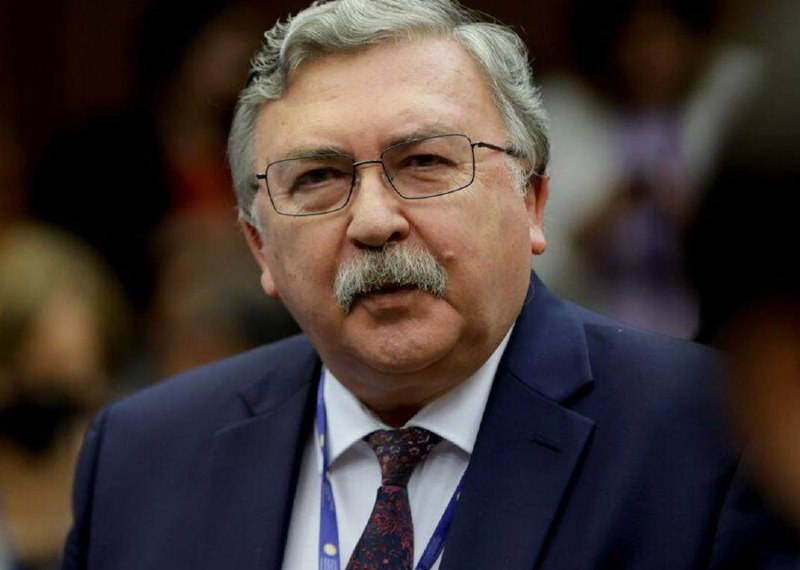

🔴 میخائیل اولیانوف، نماینده روسیه در سازمان انرژی اتمی:

کارشناسان غربی معتقدند که آمریکا
و اسرائیل ممکن است در روزهای آینده، اگر نه در ساعت‌های آینده، حملات نظامی علیه جمهوری اسلامی را از سر بگیرند. اگر این موضوع درست باشد، به این معناست که آمریکا و اسرائیل از اشتباهات راهبردی گذشته خود درس نمی‌گیرند.

@IranianMinds

## IranianMinds — post 20267

🔴 حماس: هشدار میدیم بهتون که دست از پا خطا کنید نابودتون میکنیم بمولا

+ یعنی اینارو‌ همشونو‌ از بین ببری یه چص ازشون بمونه همونم شروع میکنه گنده گوزی 😂

@IranianMinds

## IranianMinds — post 20266

  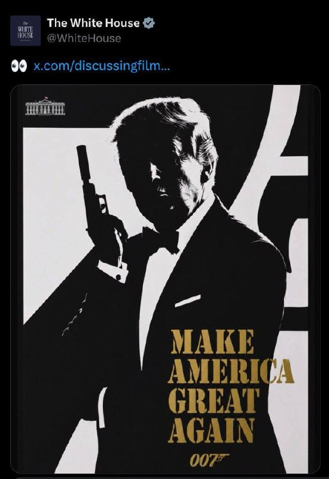

🔴 توییت جدید اکانت کاخ سفید :

@IranianMinds

## IranianMinds — post 20265

  

🔴توئیت صفحه رسمی اتاق جنگ اسرائیل : «تیک تاک⏳»‏ @IranianMinds

## BBCPersian — post 281279

🔻بخش مانیتورینگ بی‌بی‌سی

پارلمان عراق بار دیگر بحث بازگرداندن خدمت سربازی اجباری را از سر گرفته است. خدمت اجباری از سال ۱۹۳۵ تا ۲۰۰۳ یکی از ارکان اصلی ساختار حکومت عراق به شمار می‌رفت، اما پس از حمله آمریکا به عراق، انحلال ارتش و جایگزینی آن با نظام داوطلبانه، لغو شد.

حامیان این طرح می‌گویند بازگرداندن خدمت اجباری می‌تواند به تقویت هویت ملی، افزایش آمادگی نظامی و ایجاد فرصت برای جوانان بیکار کمک کند.

در مقابل، مخالفان معتقدند این طرح بار مالی سنگینی بر دوش دولت خواهد گذاشت و با ماهیت جنگ‌های مدرن که بیش از نیروهای انبوه بر فناوری‌های پیشرفته تکیه دارند، هم‌خوانی ندارد. این بحث هم‌زمان با مناقشه گسترده‌تر درباره نقش و ساختار نهادهای امنیتی عراق مطرح شده است؛ از جمله گروه‌های مسلح هم‌سو با ایران که در جنگ اخیر آمریکا و اسرائیل با ایران نقش داشتند.

ادامه مطلب را از لینک زیر بخوانید.

https://bbc.in/4tBMlQn
📸GettyImages/ Reuters/ Anadolu via Getty Images/ AFP via Getty Images
@BBCPersian

## BBCPersian — post 281278

  

🔻‌سازمان بهداشت جهانی شیوع بیماری ابولا در استان ایتوری در شرق جمهوری دموکراتیک کنگو را «وضعیت اضطراری بهداشت عمومی با نگرانی بین‌المللی» اعلام کرده است.

این سازمان گفته است که با وجود حدود ۲۴۶ مورد مشکوک و ۸۰ مورد مرگ گزارش‌شده، این شیوع هنوز شرایط لازم برای این که به‌عنوان وضعیت اضطراری همه‌گیری (پاندمی) اعلام شود را ندارد.

تدروس آدهانوم گبریسوس، مدیرکل سازمان بهداشت جهانی، هشدار داد که در حال حاضر «ابهام‌های قابل‌توجهی درباره تعداد واقعی مبتلایان و گستره جغرافیایی شیوع» وجود دارد.

به گفته این سازمان، سویه فعلی ابولا ناشی از ویروس «بوندیبوگیو» است که برای آن هنوز هیچ دارو یا واکسن تاییدشده‌ای وجود ندارد.

این سازمان اعلام کرد تاکنون هشت مورد تایید آزمایشگاهی ثبت شده و موارد مشکوک و مرگ‌ومیرهایی هم در سه منطقه، از جمله شهر بونیا (مرکز استان ایتوری) و شهرهای مونگوالو و راموارا گزارش شده است.

سازمان بهداشت جهانی همچنین گفته است که  این ویروس از مرزهای این کشور فراتر رفته و دو مورد تاییدشده نیز در کشور همسایه، اوگاندا، گزارش شده است.

📸ISSOUF SANOGO/AFP via Getty Images
https://bbc.in/4uTN14Q
@BBCPersian

## BBCPersian — post 281270

🖊️نسرین حاطوم،
خبرنگار بی‌بی‌سی عربی در امور خلیج فارس

🔻کمتر از دو ساعت پس از تایید رسمی دفتر نخست‌وزیر اسرائیل مبنی بر سفر او به امارات متحده عربی و دیدار با محمد بن زاید، رئیس این کشور در جریان جنگ ایران، وزارت امور خارجه امارات این سفر را تکذیب و استقبال از هرگونه هیئت نظامی اسرائیلی در خاک خود را رد کرد.

در این بیانیه آمده است: «بر این اساس، هرگونه ادعا درباره دیدارها یا ترتیبات اعلام‌نشده، تا زمانی که از سوی نهادهای رسمی ذی‌صلاح در امارات صادر نشده باشد، هیچ پایه و اساسی ندارد.»

وزارت امور خارجه امارات از رسانه‌ها خواست که «دقیق باشند و اطلاعات غیرمستند را منتشر نکنند یا از آن برای ایجاد برداشت‌های سیاسی استفاده نکنند.»

بیانیه امارات پس از آن منتشر شد که دفتر نخست‌وزیر اسرائیل در شبکه ایکس نوشت بنیامین نتانیاهو در جریان جنگ آمریکا و اسرائیل با ایران - عملیاتی که اسرائیل آن را «غرش شیر» نامید- سفری محرمانه به امارات داشته است.

ادامه این مطلب را از لینک زیر بخوانید.

https://bbc.in/3Pkg5U1
📸Getty/ Reuters
@BBCPersian

## BBCPersian — post 281269

  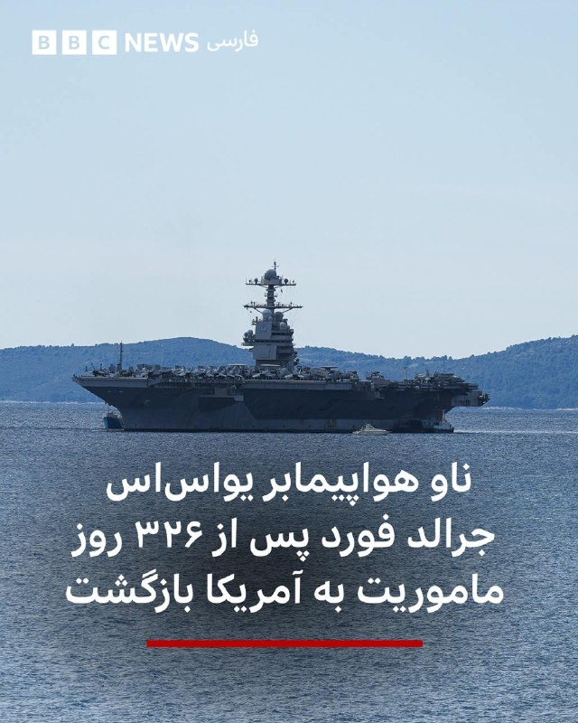

🔻وزارت دفاع آمریکا تایید کرده است که ناو هواپیمابر یواس‌اس جرالد فورد که پیش از آغاز جنگ با ایران به خاورمیانه اعزام شده بود، پس از ۳۲۶ روز مأموریت،شنبه به ایالات متحده بازگشته است.

این طولانی‌ترین مأموریت یک گروه رزمی ناو هواپیمابر آمریکا از زمان جنگ ویتنام تاکنون بوده است.

پیت هگست، وزیر دفاع آمریکا، در نورفک در ایالت ویرجینیا برای استقبال از بزرگ‌ترین ناو هواپیمابر جهان حضور داشت.

به گفته ارتش آمریکا، این ناو در جریان ماموریت خود در عملیات‌های آمریکا در منطقه کارائیب مشارکت داشت؛ جایی که نیروهای آمریکایی به قایق‌های مظنون به قاچاق مواد مخدر حمله کرده، نفتکش‌های تحریم‌شده را توقیف و نیکلاس مادورو، رهبر ونزوئلا، را بازداشت کردند.

در طول این ماموریت طولانی، در ۱۲ مارس یک آتش‌سوزی در بخش رخت‌شویی ناوایجاد شد که دو ملوان را زخمی کرد و به حدود ۱۰۰ تخت خواب آسیب جدی رساند. گزارش‌هایی نیز از مشکلات گسترده سیستم فاضلاب و سرویس‌های بهداشتی این ناو در زمان حضور در دریا منتشر شده بود.

📸Anadolu via Getty Images
https://bbc.in/4eSjrrK
@BBCPersian

## BBCPersian — post 281268

  

‌🔻کمیسیونی که از سوی سازمان جهانی بهداشت تشکیل شده، خواستار آن است که تغییرات اقلیمی به‌عنوان یک وضعیت اضطراری بین‌المللی در حوزه سلامت عمومی اعلام شود.

این بالاترین سطح هشدار بهداشتی است.

این هیئت مشورتی مستقل می‌گوید که چنین اقدامی می‌تواند به بسیج یک واکنش بین‌المللی در مقیاسی که لازم است کمک کند.

این هیئت تأکید می‌کند که تغییرات اقلیمی تهدیدی مربوط به آینده نیست، بلکه بحرانی فوری و رو‌به‌رشد است.

این کمیسیون تاکید کرده است که یارانه‌های سوخت‌های فسیلی باید به‌تدریج حذف شوند و از سازمان جهانی بهداشت می‌خواهد که فوراً اقدام کند.
📷NurPhoto via Getty
@BBCPersian

## Dirty_Kids — post 389595

«حالا یه بار کافه نری که نمیمیری»، «چندتا آهنگ نتونی تو اسپاتیفای گوش ندی که نمیمیری»
اتفاقاً کم‌کم میمیریم. زندگی فقط زنده بودن نیست؛ همین خوشی‌های کوچیکه: قهوه، موسیقی، دورهمی، شب‌گردی، خریدای الکی. وقتی یکی‌یکی ازت گرفته بشن، فقط نفس میکشی

@Dirty_Kids 👻

## Dirty_Kids — post 389594

  <a href="telegram/content/Dirty_Kids_389594_1779003180.mp4" target="_blank">🎬 Download video</a>

همینطور که در فیلم محمد رسول الله هم میبینید در جنگ بدر؛ محمد به
سپاهیانش دستور میده که چاههای آب رو با سنگ پرکنن و آب رو به روی دشمنانش میبنده

چرا وقتی محمد این کار رو میکنه اسمش میشه تاکتیک جنگی ،اما حدود ۵۹ سال بعد وقتی همین کاررو سپاه یزید انجام میده اسمش ظلم و ستم هست؟🖕🖕

@Dirty_Kids 👻

## Hranews — post 112976

بوکان؛ حکم اعدام یک زندانی اجرا شد

❗️
❗️
❗️
❗️
❗️ – رئیس ‌کل دادگستری آذربایجان غربی از اجرای حکم #اعدام یک زندانی به اتهام قتل در بوکان خبر داد.

ادامه مطلب

↘️
@hranews_bot تماس ✉️ -  @Hranews  کانال هرانا 🆑

## manototv — post 105547

  <a href="telegram/content/manototv_105547_1779003181.mp4" target="_blank">🎬 Download video</a>

تجمع ایرانیان ایسلند، ۲۶ اردیبهشت
ایسلند از کم‌جمعیت‌ترین کشورهای اروپاست و جامعه ایرانی کوچکی دارد.

## manototv — post 105546

  <a href="telegram/content/manototv_105546_1779003182.mp4" target="_blank">🎬 Download video</a>

بریتانیا پنج عضو خانواده زرین‌قلم را به اتهام ارتباط با شبکه مالی پنهان جمهوری اسلامی تحریم کرده است. فرهاد زرین‌قلم، مهندس بریتانیایی ایرانی‌تبار، همراه با فضل‌الله، منصور، ناصر و پوریا زرین‌قلم در فهرست تازه تحریم‌های لندن قرار گرفته‌اند.

بر اساس اعلام وزارت خارجه بریتانیا، این افراد و دو صرافی مرتبط با آنان، «صرافی برلیان» و «جی‌سی‌ام اکسچنج»، به ارائه خدمات مالی برای افرادی و نهادهایی متهم شده‌اند که فعالیت‌هایشان با بی‌ثبات‌سازی بریتانیا یا دیگر کشورها ارتباط داشته است. لندن این افراد را با ممنوعیت سفر، توقیف دارایی و ممنوعیت مدیریت شرکت‌ها روبه‌رو کرده است.

آسوشیتدپرس نیز نوشت مقام‌های بریتانیا این تحریم‌ها را بخشی از مقابله با «فعالیت‌های خصمانه مرتبط با ایران» دانسته‌اند و گفته‌اند شبکه‌های مالی پنهان برای دور زدن تحریم‌ها و انتقال میلیاردها دلار به سود بخش‌های نفتی و نظامی جمهوری اسلامی به‌کار رفته‌اند.

## manototv — post 105545

  <a href="telegram/content/manototv_105545_1779003183.mp4" target="_blank">🎬 Download video</a>

راهپیمایی ایرانیان سان‌فرانسیسکو، ۲۶ اردیبهشت

## manototv — post 105544

  <a href="telegram/content/manototv_105544_1779003184.mp4" target="_blank">🎬 Download video</a>

راهپیمایی ایرانیان ساکن ونکوور کانادا، ۲۶ اردیبهشت

## manototv — post 105543

  <a href="telegram/content/manototv_105543_1779003185.mp4" target="_blank">🎬 Download video</a>

بلغارستان برای نخستین بار برنده مسابقه آواز یوروویژن شد. دارا، خواننده بلغاری، با ترانه «بنگارنگا» در فینال هفتادمین دوره این مسابقه در وین اتریش، ۵۱۶ امتیاز گرفت و مقام نخست را به دست آورد.

بر اساس اعلام وب‌سایت رسمی یوروویژن، بلغارستان هم در رای هیات‌های داوری و هم در رای مردمی اول شد. اسرائیل در جایگاه دوم و رومانی در جایگاه سوم قرار گرفتند.

## manototv — post 105542

  <a href="telegram/content/manototv_105542_1779003186.mp4" target="_blank">🎬 Download video</a>

دولت بریتانیا اعلام کرد سامانه‌ای تازه و کم‌هزینه برای مقابله با پهپادها را روی جنگنده‌های تایفون نیروی هوایی سلطنتی در خاورمیانه مستقر کرده است.

این سامانه که «سلاح کشتار دقیق پیشرفته» نام دارد، راکت‌های غیرهدایتی را با کیت هدایت لیزری به مهمات دقیق تبدیل می‌کند و به گفته وزارت دفاع بریتانیا، امکان انهدام اهداف را با هزینه‌ای بسیار کمتر از موشک‌های رایج فراهم می‌سازد.

وزارت دفاع بریتانیا اعلام کرد این سامانه با همکاری شرکت‌های بی‌ای‌ئی سیستمز و کینتیک، در کمتر از دو ماه از مرحله آزمایش به استقرار عملیاتی رسیده است. رسانه‌های دفاعی نیز گزارش داده‌اند جنگنده‌های تایفون بریتانیا در خاورمیانه اکنون برای ماموریت‌های مقابله با پهپاد به این سامانه مجهز شده‌اند.

## alonews — post 120539

  <a href="telegram/content/alonews_120539_1779003187.webm" target="_blank">🎬 Download video</a>

👈سی‌ان‌ان: ایران به کابل‌های اینترنتی تنگه هرمز چشم دوخته است!

✅ @AloNews خبر جنگ

## alonews — post 120538

  <a href="telegram/content/alonews_120538_1779003187.webm" target="_blank">🎬 Download video</a>

👈خارگ همچنان ظرفیت ذخیره سازی دارد

🔴تانکر ترکرز: در جزیره خارگ، ظرفیت مخازن ذخیره‌سازی نفت هنوز تکمیل نشده است. چرا که در این صورت نفتکش‌های مستقر در منطقه را تا آخرین ظرفیت پر می‌کردند که تا کنون چنین اتفاقی رخ نداده است.

🔴علاوه بر این؛ ایران همچنان نفتکش‌های متعددی در اختیار دارد که می‌تواند نفت خود را با آن‌ها بارگیری کند.

✅ @AloNews خبر جنگ

## alonews — post 120537

  <a href="telegram/content/alonews_120537_1779003187.webm" target="_blank">🎬 Download video</a>

👈بر اثر واژگونی اتوبوس در محور عسلویه به کنگان ۸ نفر از شهروندان جان باختند.

✅ @AloNews خبر جنگ

## alonews — post 120536

  <a href="telegram/content/alonews_120536_1779003187.webm" target="_blank">🎬 Download video</a>

👈احتمال شنیده شدن صدای انفجارهای کنترل‌شده در محدوده جنوب اصفهان

✅ @AloNews خبر جنگ

## alonews — post 120535

  <a href="telegram/content/alonews_120535_1779003187.webm" target="_blank">🎬 Download video</a>

👈توییت 6 ساعت پیش اتاق جنگ اسرائیل

✅ @AloNews خبر جنگ

## alonews — post 120534

  <a href="telegram/content/alonews_120534_1779003188.webm" target="_blank">🎬 Download video</a>

👈تایمز: انگلیس برای جنگ آماده می‌شود 
🔴 یک رسانه انگلیسی از افزایش بودجه دفاعی انگلیس خبر داد و هدف از آن را آماده شدن برای جنگ های آینده اعلام کرد 
✅ @AloNews خبر جنگ

## alonews — post 120533

  <a href="telegram/content/alonews_120533_1779003188.webm" target="_blank">🎬 Download video</a>

👈تایمز: انگلیس برای جنگ آماده می‌شود

🔴 یک رسانه انگلیسی از افزایش بودجه دفاعی انگلیس خبر داد و هدف از آن را آماده شدن برای جنگ های آینده اعلام کرد

✅ @AloNews خبر جنگ

## alonews — post 120532

  <a href="telegram/content/alonews_120532_1779003188.mp4" target="_blank">🎬 Download video</a>

👈فعالیت غیرمعمول امروز هواپیماهای باری برای سوخت رسانی به جنگنده‌ها در منطقه خاورمیانه!

✅ @AloNews خبر جنگ

## alonews — post 120531

  <a href="telegram/content/alonews_120531_1779003190.webm" target="_blank">🎬 Download video</a>

👈ادغام کنکور سراسری و آزمون پذیرش دانشجو معلمان منتفی شد/ آزمون‌ها با شرایط سال قبل برگزار می‌شود.

✅ @AloNews خبر جنگ

## alonews — post 120530

  <a href="telegram/content/alonews_120530_1779003190.webm" target="_blank">🎬 Download video</a>

👈الجزیره: پاکسازی ۲۴ ژنرال آمریکایی در میانه جنگ با ایران

🔴پیت هگست، وزیر جنگ ایالات متحده، در سه ماه گذشته بیش از ۲۴ ژنرال و دریاسالار را بدون ارائه دلایل روشن برکنار کرده است. این اقدام شامل روسای ستاد ارتش و نیروی دریایی و دیگر مقامات ارشد است و شائبه‌های سیاسی را تقویت می‌کند.

🔴با ادامه بن‌بست مذاکرات با ایران، تصمیم‌گیری درباره عملیات نظامی یا محاصره دریایی پیچیده‌تر شده و پیام‌های واشنگتن به متحدان منطقه‌ای گیج‌کننده است. همزمان، وزارت جنگ درخواست افزایش بودجه‌ای نزدیک به ۵۰۰ میلیارد دلار کرده اما توضیح قانع‌کننده‌ای ارائه نکرده است.

🔴 کارشناسان هشدار می‌دهند ادامه این وضعیت احتمال دستیابی به توافق سیاسی و موفقیت نظامی آمریکا را در منطقه کاهش می‌دهد.

✅ @AloNews خبر جنگ

## alonews — post 120529

  <a href="telegram/content/alonews_120529_1779003190.webm" target="_blank">🎬 Download video</a>

👈قتل هولناک نوزاد ۴۰ روزه در مشهد!

🔴مادر نوزاد می گوید: از خوزستان به مشهد آمدیم و سوئیتی را در خیابان نوغان اجاره کردیم.

🔴دو روز قبل همسرم که مواد مخدر صنعتی مصرف می‌کند دچار توهم و بدبینی شد.

🔴او ناگهان تصور کرد نوزاد متعلق به فرد دیگری است.

🔴ماهی‌تابه حاوی تخم‌مرغ را برداشت و با آن ضربات هولناکی به سر نوزاد زد.

🔴سپس با کف دستش چند ضربه دیگر به سر او کوبید.

🔴بعد هم نوزاد را به شدت به زمین کوبید و باعث مرگش شد.

🔴پس از این ماجرا جسد کودک را داخل یخچال مسافرخانه گذاشت.

🔴او مرا تهدید کرد چیزی به کسی نگویم تا اینکه دو روز بعد موضوع را به صاحب سوئیت اطلاع دادم

✅ @AloNews خبر جنگ

## alonews — post 120528

  <a href="telegram/content/alonews_120528_1779003190.webm" target="_blank">🎬 Download video</a>

👈دولت ترامپ اجازه دارد معافیت تحریم‌ها بر نفت دریایی روسیه که در روز شنبه منقضی شود و مجوز موقت برای کشورهایی مانند هند برای ادامه خرید نفت خام روسیه را به پایان برساند.

✅ @AloNews خبر جنگ

## alonews — post 120527

  <a href="telegram/content/alonews_120527_1779003190.webm" target="_blank">🎬 Download video</a>

👈آب و فاضلاب عسلویه : با توجه به تعمیرات ضروری در خط انتقال آب کوثر، آب شهرستان عسلویه از ساعت ۶ صبح روز دوشنبه، ۲۸ اردیبهشت‌ماه به مدت ۴۸ ساعت قطع خواهد شد

✅ @AloNews خبر جنگ

## alonews — post 120526

  <a href="telegram/content/alonews_120526_1779003191.webm" target="_blank">🎬 Download video</a>

👈سی‌ان‌ان: کوبایی‌ها خود را برای «تهاجم آمریکا» آماده می‌کنند

✅ @AloNews خبر جنگ

## alonews — post 120525

  <a href="telegram/content/alonews_120525_1779003191.webm" target="_blank">🎬 Download video</a>

👈 کوثری، نماینده مجلس: ترامپ در جنگ با ایران درمانده شده است

✅ @AloNews خبر جنگ

## alonews — post 120523

  <a href="telegram/content/alonews_120523_1779003191.mp4" target="_blank">🎬 Download video</a>

👈یک پهپاد اوکراینی به ساختمانی در زلنگراد، منطقه مسکو روسیه برخورد کرد

✅ @AloNews خبر جنگ

## alonews — post 120522

  <a href="telegram/content/alonews_120522_1779003193.webm" target="_blank">🎬 Download video</a>

👈حملات پهپادی اوکراینی فرودگاه بین‌المللی شرمتیه‌وو در منطقه مسکو روسیه را هدف قرار دادند.

🔴 شرمتیه‌وو شلوغ‌ترین فرودگاه روسیه است

✅ @AloNews خبر جنگ

## alonews — post 120521

  <a href="telegram/content/alonews_120521_1779003193.webm" target="_blank">🎬 Download video</a>

👈بلومبرگ:یک نفتکش غول‌پیکر پس از توقف چند روزه در خلیج عمان به دلیل توقیف توسط نیروهای آمریکایی، سفر خود را از سر گرفت.

🔴این نفتکش غول‌پیکر به ویتنام در حال حرکت است و دو میلیون بشکه نفت خام عراق را حمل می‌کند.

✅ @AloNews خبر جنگ

## alonews — post 120520

  <a href="telegram/content/alonews_120520_1779003193.mp4" target="_blank">🎬 Download video</a>

👈هم‌اکنون : کشتی‌هایی که پشت دروازه‌ «تنگه هرمز» ایستاده‌اند

✅ @AloNews خبر جنگ

---
📅 بروزرسانی: 1405/02/27 08:07
---

## VahidOOnLine — post 240562

  

ریک اسکات، سناتور جمهوری‌خواه آمریکایی، به فاکس‌نیوز گفت جمهوری اسلامی با وجود جنگ اخیر همچنان به دنبال کشتن آمریکایی‌ها، بازسازی تسلیحات خود و نابودی اسرائیل است.
او همچنین گفت تهران همچنان از حماس، حزب‌الله و حوثی‌ها حمایت می‌کند و در عین حال از رویکرد ترامپ در قبال ایران در تنگه هرمز تمجید کرد.

‌🏁 🇬🇧 IranintlTV

🤖 @VahidOOnLine

## VahidOOnLine — post 240561

  

♦️به گزارش خبرگزاری رویترز، دولت دونالد ترامپ روز شنبه با تمدید نکردن معافیت‌های تحریمی خرید نفت دریاپایه روسیه، اجازه داد این مجوز قانونی منقضی شود. این معافیت یک‌ماهه پیش از این با هدف جبران کمبود عرضه نفت و کنترل قیمت‌های جهانی پس از انسداد تنگه هرمز توسط جمهوری اسلامی، به کشورهایی مانند هند اعطا شده بود. اسکات بسنت، وزیر خزانه‌داری آمریکا، پیش‌تر اعلام کرده بود که این مجوز عمومی را برای خرید نفت ذخیره‌شده روسیه در نفت‌کش‌ها تمدید نخواهد کرد.
لغو این معافیت در حالی صورت می‌گیرد که فشارها بر کاخ سفید افزایش یافته است؛ به طوری که دو سناتور دموکرات، جین شاهین و الیزابت وارن، روز جمعه از دولت ترامپ خواسته بودند به دلیل تامین مالی جنگ روسیه در اوکراین و عدم تاثیر آن بر کاهش هزینه‌های سوخت شهروندان آمریکایی، این معافیت را ملغی کند. هند که بزرگترین خریدار نفت دریاپایه روسیه است، در پی معافیت‌های قبلی، خریدهای خود را در ماه‌های آوریل و مه به اوج رسانده بود.
‌🇸🇦 Indypersian

🤖 @VahidOOnLine

## VahidOOnLine — post 240560

  

بری روزن، گروگان پیشین سفارت آمریکا در ایران، در ایکس نوشت جمهوری‌اسلامی در جریان درگیری با ایالات‌متحده، برای سرکوب مخالفت‌ها بر شمار اعدام‌ها افزوده است و مقام‌های ایرانی از اعدام‌ها و احکام قضایی برای ارعاب معترضان احتمالی استفاده می‌کنند.
‌🏁 🇬🇧 IranintlTV

🤖 @VahidOOnLine

## VahidOOnLine — post 240559

  <a href="telegram/content/VahidOOnLine_240559_1778992656.mp4" target="_blank">🎬 Download video</a>

♦️ویدیوهای رسیده به ایندیپندنت فارسی نشان می‌دهد ایرانیان واشنگتن‌دی‌سی روز شنبه ۲۶ اردیبهشت، هم‌زمان با ایرانیان در دیگر کشورهای جهان، با تشکیل زنجیره انسانی روی «پل کلید» تجمع اعتراضی برگزار کردند.
شرکت‌کنندگان در این تجمع با اهتزاز پرچم‌های شیر‌‌و‌خورشید و حمل پلاکاردهایی خواستار آزادی زندانیان سیاسی، توقف احکام اعدام و پایان محدودیت‌ها و قطعی اینترنت در ایران شدند.
‌🇸🇦 Indypersian

🤖 @VahidOOnLine

## VahidOOnLine — post 240558

♦️دونالد ترامپ با انتشار تصاویری در صفحه اینستاگرام خود از سفرش به چین، به پیشینه روابط دیرینه میان دو کشور اشاره کرد و گفت: «رابطه میان مردم آمریکا و چین به زمان تاسیس آمریکا بازمی‌گردد و شهروندان ما از همان ابتدا احترام متقابل عمیقی برای یکدیگر قائل بوده‌اند.» او این پیوند تجاری و احترام‌آمیز ۲۵۰ ساله را پایه‌ای برای آینده‌ای دانست که به نفع هر دو ملت خواهد بود.
او در ادامه این ویدیو با اشاره به ویژگی‌های فرهنگی و انسانی مشترک میان دو جامعه افزود: «مردم آمریکا و چین اشتراکات زیادی دارند؛ ما برای کار سخت، شجاعت و موفقیت ارزش قائلیم و به خانواده‌ها و کشورهای خود عشق می‌ورزیم.»
‌🇸🇦 Indypersian

🤖 @VahidOOnLine

## VahidOOnLine — post 240557

  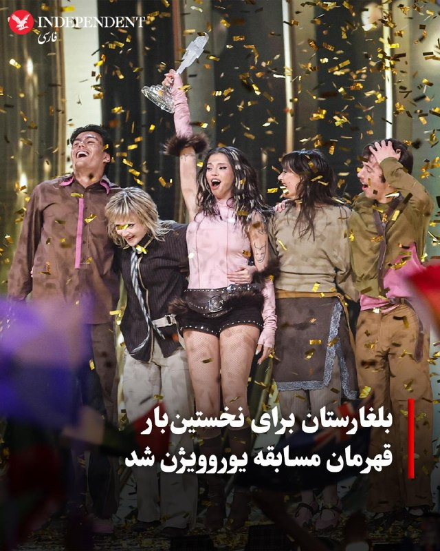

♦️به گزارش خبرگزاری رویترز، شنبه شب ۲۶ اردیبهشت در جریان فینال مسابقات آوازی یوروویژن ۲۰۲۶ که در سالن «وینر اشتادهاله» شهر وین، پایتخت اتریش برگزار شد، کشور بلغارستان برای اولین‌بار در تاریخ این مسابقات، به مقام قهرمانی دست یافت.
«دارینا نیکولایوا یوتووا» معروف به «دارا»، نماینده بلغارستان، با اجرای ترانه «بنگارنگا» (Bangaranga) موفق شد پس از شمارش و تایید مجموع آرای داوران ملی و سبد رای تماشاگران، بالاتر از نماینده اسرائیل که به مقام دوم رسید، جام قهرمانی یوروویژن را بالای سر ببرد.
‌🇸🇦 Indypersian

🤖 @VahidOOnLine

## VahidOOnLine — post 240556

  

دولت بریتانیا از استقرار یک سلاح کم‌هزینه ضدپهپاد جدید در خاورمیانه خبر داد. سامانه ای‌پی‌کی‌دابلیو‌اس که روی جنگنده‌های تایفون نصب می‌شود، با استفاده از هدف‌گیری لیزری، موشک‌های غیرهدایتی را به سلاح‌های دقیق و کم‌هزینه تبدیل می‌کند که قادر به سرنگونی پهپادها و دیگر تهدیدها هستند.
وزارت دفاع بریتانیا گفت این سامانه را در همکاری سریع با صنایع نظامی ظرف چند ماه از مرحله آزمایش به مرحله استقرار رسانده است و با این اقدام شهروندان بریتانیایی و شرکای منطقه‌ای از حفاظت بیشتری در برابر حملات پهپادی برخوردار خواهند شد.

‌🏁 🇬🇧 IranintlTV

🤖 @VahidOOnLine

## VahidOOnLine — post 240555

♦️گلشیفته فراهانی و امانوئل مکرون، رییس جمهوری فرانسه، در روزهای اخیر به سوژه تازه طنزپردازان ایرانی در شبکه‌های اجتماعی تبدیل شده‌اند؛ ماجرایی که پس از انتشار اظهارات فلوریان تردیف، خبرنگار روزنامه پاری‌مچ و نویسنده کتاب «یک زوج "تقریبا" کامل» دوباره مورد توجه قرار گرفت.
فلوریان تردیف روز چهارشنبه در مصاحبه با رادیو RTL فرانسه، در پاسخ به پرسشی درباره تنش معروف میان این زوج در جریان سفر سال گذشته به شرق آسیا (در پرواز پاریس-سنگاپور)، تایید کرد که بریجیت یکی از پیام‌های گلشیفته فراهانی را در تلفن همراه امانوئل دیده بود. او در پاسخ به اصرار خبرنگار برای تایید نام این بازیگر گفت: «همان موقع هم شرایط در پاریس پیچیده بود؛ آقای رییس جمهوری چند ماهی رابطه افلاطونی با گلشیفته فراهانی، هنرپیشه ۴۲ ساله، داشت.»
این اتفاق در هواپیما منجر به جدال لفظی شدید و صحنه‌ای دراماتیک شد که در نهایت با سیلی خوردن مکرون از بریجیت همراه بود.
هم‌زمان کاربران ایرانی در فضای مجازی که به مهارت بالا در طنزپردازی مشهورند، این بار مکرون، بریجیت و گلشیفته فراهانی را مایه شوخی قرار داده‌اند.
‌🇸🇦 Indypersian

🤖 @VahidOOnLine

## mwarmonitor — post 9182

🦠«یک شیوع جدید از ویروس بسیار مسری ابولا در استان اییتوری در شرق کنگو تأیید شده است، به گفته نهاد اصلی بهداشت عمومی آفریقا. تاکنون ۲۴۶ مورد مشکوک و ۶۵ مرگ ثبت شده است.» @mwarmonitor

## mwarmonitor — post 9181

  

✈️از چند ساعت گذشته بیش از دوازده فروند هواپیمای ترابری راهبردی C-17A گلوبمستر III نیروی هوایی آمریکا در حال ترک خاورمیانه و حرکت به سمت اروپا هستند. @mwarmonitor

## mwarmonitor — post 9180

  <a href="telegram/content/mwarmonitor_9180_1778992662.mp4" target="_blank">🎬 Download video</a>

✈️🇷🇺«یک پرواز تخلیه نیروی هوایی روسیه چند ساعت پیش از امارات متحده عربی به سمت روسیه حرکت کرد؛ همان‌طور که پیش‌بینی می‌شد، پس از آن‌که دیروز از موگادیشو فرود آمده بود تا افراد مهم یا محموله‌ای را سوار کرده و تخلیه کند.
🔸دقیقاً همین پرواز در تاریخ ۲۴ فوریه نیز انجام شده بود؛ درست پیش از آن‌که حملات آمریکا علیه ایران رخ دهد.»

@mwarmonitor

## mwarmonitor — post 9179

  

🚨✈️ به نظر می‌رسد آسمان‌ها در حال حاضر به‌طور نگران‌کننده‌ای آرام هستند. حتی هیچ پرواز باری ورودی قابل مشاهده‌ای وجود ندارد، به‌جز یک فروند C-17 که همین حالا در اردن فرود آمده است. ✈️آخرین پروازهای باری نظامی در حال خارج شدن از خاورمیانه هستند. @mwarmonitor

## FoxNewsTwitter — post 341828

  

Fox News (Twitter/X)

BREAKING: Senator Bill Cassidy has been defeated.

More than five years after voting to convict President Trump in his impeachment trial, the Louisiana Republican senator has lost in his GOP primary.

In a Truth Social post, Trump reacted, saying “his disloyalty to the man who got him elected is now a part of legend, and it’s nice to see that his political career is OVER!”

Trump-backed Rep. Julia Letlow and Louisiana Treasurer John Fleming finished ahead of Cassidy, according to the AP, and will now face off in next month’s runoff.

## IranIntlTV — post 337558

  

ریک اسکات، سناتور جمهوری‌خواه آمریکایی، به فاکس‌نیوز گفت جمهوری اسلامی با وجود جنگ اخیر همچنان به دنبال کشتن آمریکایی‌ها، بازسازی تسلیحات خود و نابودی اسرائیل است.
او همچنین گفت تهران همچنان از حماس، حزب‌الله و حوثی‌ها حمایت می‌کند و در عین حال از رویکرد ترامپ در قبال ایران در تنگه هرمز تمجید کرد.

https://iranintl.com/202605178960

## IranIntlTV — post 337557

  

بری روزن، گروگان پیشین سفارت آمریکا در ایران، در ایکس نوشت جمهوری‌اسلامی در جریان درگیری با ایالات‌متحده، برای سرکوب مخالفت‌ها بر شمار اعدام‌ها افزوده است و مقام‌های ایرانی از اعدام‌ها و احکام قضایی برای ارعاب معترضان احتمالی استفاده می‌کنند.
https://iranintl.com/202605177046

## IranIntlTV — post 337556

  

دولت بریتانیا از استقرار یک سلاح کم‌هزینه ضدپهپاد جدید در خاورمیانه خبر داد. سامانه ای‌پی‌کی‌دابلیو‌اس که روی جنگنده‌های تایفون نصب می‌شود، با استفاده از هدف‌گیری لیزری، موشک‌های غیرهدایتی را به سلاح‌های دقیق و کم‌هزینه تبدیل می‌کند که قادر به سرنگونی پهپادها و دیگر تهدیدها هستند.
وزارت دفاع بریتانیا گفت این سامانه را در همکاری سریع با صنایع نظامی ظرف چند ماه از مرحله آزمایش به مرحله استقرار رسانده است و با این اقدام شهروندان بریتانیایی و شرکای منطقه‌ای از حفاظت بیشتری در برابر حملات پهپادی برخوردار خواهند شد.

https://iranintl.com/202605175043

## FarsiVOA — post 217940

  

⚡️مارک لوین، از مفسران مشهور رادیویی آمریکایی و از حامیان برجسته دونالد ترامپ، رئیس‌جمهوری آمریکا، روز شنبه ۲۶ اردیبهشت در شبکه اجتماعی ایکس نوشت: «باید به آزادی مردم ایران کمک کنیم، و ما قادریم که این کار را انجام دهیم.» او گفت: «می‌توانیم این کار را بدون اعزام زمینی نیروهایمان انجام دهیم. بدون یک جنگ ابدی. می‌توانیم این کار را انجام دهیم.»

آقای لوین در این راستا توضیح داد که می‌توان مردم ایران را آموزش داد و آن‌ها را مسلح کرد. او نوشت: «آن‌ها را آموزش دهیم. مسلح کنیم. از آنها حمایت کنیم. و دیگر هرگز نگران سلاح‌های هسته‌ای رژیم ایران نخواهیم بود. نه تنها این، بلکه خاورمیانه نیز به گونه‌ای که حتی نمی‌توانیم تصور کنیم، به سمت بهتر شدن تغییر خواهد کرد. این رژیم (جمهوری اسلامی) باید نابود شود. اکنون وقتش است.»
@FarsiVOA

## FarsiVOA — post 217939

🔺یوروویژن ۲۰۲۶؛ بلغارستان اول شد اسرائيل دوم

▪️بلغارستان شامگاه شنبه ۲۶ اردیبهشت در مسابقه آواز یوروویژن در وین به پیروزی رسید.

⬇️ بیشتر بخوانید:
https://ir.voanews.com/a/8150864.html
@FarsiVOA

## Persian_Trend_Official — post 14282

  <a href="telegram/content/Persian_Trend_Official_14282_1778992670.mp4" target="_blank">🎬 Download video</a>

صبحتون بخیر ☕️🔥

📝 Nick
📌 @persian_trend_official
پرشین ترند | متفاوت‌ترین کانال نظامی

## BBCPersian — post 281267

🔻حملات گسترده اسرائیل به جنوب لبنان به‌رغم تمدید آتش‌بس

اسرائیل با وجود تمدید آتش‌بس با لبنان، موج گسترده‌ای از حملات هوایی را علیه جنوب آن کشور آغاز کرد.

اسرائیل می‌گوید که اهداف مرتبط با حزب‌الله را هدف قرار می‌دهد، اما پیش از حملات هشدار تخلیه‌ای برای ساکنان ۹ روستا صادر شده بود.

ادامه بمباران‌ها تردیدها درباره دوام آتش‌بس را در میان ده‌ها هزار لبنانی افزایش داده است که از خانه‌های خود در جنوب گریخته‌اند.

خبرگزاری رسمی لبنان، گزارش داد که روز شنبه بیش از دهها روستا هدف حمله قرار گرفتند؛ از جمله منطقه‌ای در بیش از ۵۰ کیلومتری مرز.

این خبرگزاری همچنین از موج تازه خروج ساکنان به سمت شهر جنوبی صیدا و پایتخت، بیروت، خبر داد.
@BBCPersian

## BBCPersian — post 281266

🔻فیفا: گفت‌وگوهای با فدراسیون فوتبال ایران مثبت و سازنده بود

ماتیاس گرافستروم، دبیرکل فیفا، به خبرگزاری رویترز گفت که دیدار «سازنده و مثبتی» با مهدی تاج، رئیس فدراسیون فوتبال ایران داشت و نسبت به حضور ایران در جام جهانی امسال ابراز اطمینان کرده است.

ایران قرار است هر سه مسابقه مرحله گروهی خود را در آمریکا برگزار کند، اما پس از حملات آمریکا و اسرائیل به ایران در اواخر فوریه، ابهام‌هایی درباره حضور تیم ملی ایران در رقابت‌های ۱۱ ژوئن تا ۱۹ ژوئیه به وجود آمده بود.

گرافستروم در جریان سفرش به استانبول گفت: «نشست بسیار خوب و سازنده‌ای با فدراسیون فوتبال ایران داشتیم. ما از نزدیک با هم همکاری می‌کنیم و مشتاقانه منتظر استقبال از آن‌ها در جام جهانی فیفا هستیم.»

او از ارائه جزئیات درباره وضعیت ویزای بازیکنان ایران خودداری کرد، اما گفت که آنها فرصت داشتند درباره برخی مسائل اجرایی گفت‌وگو کنند و تبادل‌نظر مثبتی داشته باشند.

پس از آن‌که مهدی تاج اوایل این ماه به دلیل ارتباط با سپاه پاسداران اجازه ورود به کانادا برای شرکت در کنگره فیفا در ونکوور را نیافت، پرسش‌های بیشتری درباره وضعیت ایران مطرح شد.

آمریکا و کانادا، که همراه با مکزیک میزبان مشترک جام جهانی هستند، سپاه پاسداران را «سازمانی تروریستی» می‌دانند و می‌گویند که افراد مرتبط با این نهاد را نخواهند پذیرفت.
@BBCPersian

## BBCPersian — post 281265

🔻وزیر پیشین ونزوئلا و متحد مادورو به آمریکا مسترد شد

الکس ساب، وزیر پیشین صنایع ونزوئلا، به آمریکا مسترد شده است.

ساب، بازرگان ثروتمند متولد کلمبیا، از نزدیکان نیکلاس مادورو، رئیس‌جمهور برکنار‌شده ونزوئلا بود.

او در ماه فوریه در کاراکاس و در جریان عملیاتی مشترک میان مقام‌های آمریکایی و ونزوئلایی بازداشت شد.

هنوز مشخص نیست که الکس ساب با چه اتهام‌هایی روبه‌روست.

او پیشتر نیز در سال ۲۰۲۰ در جمهوری «کیپ ورد»، مجمع‌الجزایری در غرب آفریقا، بازداشت و برای مواجهه با اتهام پول‌شویی به آمریکا مسترد شده بود اما سه سال بعد در چارچوب تبادل زندانیان عفو شد.
@BBCPersian

## BBCPersian — post 281264

🔻حامیان شورای ملی مقاومت ایران در واشنگتن خواهان حمایت از تغییر حکومت شدند

ایرانیان آمریکایی و حامیان شورای ملی مقاومت ایران روز شنبه در واشنگتن تجمع و راهپیمایی کردند و خواهان پایان اعدام‌ها در ایران و حمایت بین‌المللی از «تغییر دموکراتیک» شدند.

به گزارش رویترز، شرکت‌کنندگان که پرچم شیروخورشید در دست داشتند، همچنین در کنار تصاویر افرادی گردآمدند که به گفته برگزارکنندگان حکومت ایران آنها را اعدام کرده است.

علیرضا جعفرزاده، معاون دفتر واشنگتن شورای ملی مقاومت ایران گفت که معترضان سه خواسته اصلی دارند؛ توقف اعدام‌ها، به رسمیت شناختن جایگزینی برای حکومت فعلی و حمایت از «مقاومت سازمان‌یافته» در داخل ایران.

کارلا سندز، سفیر پیشین آمریکا در دانمارک، با ایده مداخله نظامی آمریکا مخالفت کرد و گفت تغییر حکومت از طریق بمباران به دست نخواهد آمد.

او گفت: «این مردم ایران هستند که باید این حکومت را سرنگون کنند، نه نیروهای نظامی آمریکا.»

پاتریک جی. کندی، نماینده پیشین کنگره آمریکا نیز این مقطع را «تاریخی» توصیف کرد و حکومت ایران را «بزرگ‌ترین اعدام‌کننده مردم خود در جهان» و «بزرگ‌ترین حامی دولتی تروریسم» خواند.

سونا سامسامی، نماینده شورای ملی مقاومت ایران در آمریکا، هم تاکید کرد که «شبکه مقاومت سازمان‌یافته در داخل ایران همچنان پایه اصلی تغییر است.»
@BBCPersian

## BBCPersian — post 281263

  

‌🔻با هجوم مردم برای خرید یک ساعت جدید و تولید محدود، شرکت سواچ ناچار شد فروشگاه‌هایش را در سراسر بریتانیا تعطیل کند.

صدها نفر مشتاق خرید یک ساعت جدید با تولید محدود، بیرون شعب فروشگاه سواچ صف کشیده بودند.

این شرکت سوئیسی اعلام کرد که «به دلیل ملاحظات ایمنی برای مشتریان و کارکنان خود» فروشگاه‌های خود را در لندن باز نخواهد کرد.

شعب این فروشگاه‌ در شهرهای بیرمنگام، کاردیف، گلاسکو، لیورپول، منچستر و شفیلد نیز همچنان بسته خواهند ماند.

این شرکت قرار بود ساعت جیبی جدید «رویال پاپ» خود را با همکاری شرکت اودمر پیگه در هشت مدل با قیمت تقریبی ۴۵۰ دلار عرضه کند.

اودمر پیگه، شرکتی است که به ساخت ساعت و جواهرات قیمتی شهرت دارد.

با بسته شدن فروشگاه‌ها، سواچ در حال حاضر این ساعت را به صورت آنلاین و با قیمت بیش از ۲۱ هزار دلار برای فروش گذاشته است.
ادامه از:
https://bbc.in/3Rgv5Tp
📷Swatch
@BBCPersian

## BBCPersian — post 281262

  

‌🔻دونالد ترامپ، رئیس‌جمهور آمریکا در شبکه اجتماعی تروث سوشال، تصویر گرافیکی خود را در کنار یک فرمانده نظامی کشورش منتشر کرده و روی آن نوشته شده است: «آرامش پیش از طوفان».

این تصویر آقای ترامپ را روی عرشه یک ناو جنگی نشان می‌دهد که در فضایی طوفانی و در میان شناورهایی با پرچم جمهوری اسلامی قرار دارد.

آقای ترامپ همچنین یک انیمیشن در این شبکه اجتماعی منتشر کرده است که به ناو آمریکایی دستور شلیک به هدفی با پرچم جمهوری اسلامی را می‌دهد.

این دو پست آقای ترامپ بعد از آن است که روزنامه نیویورک تایمز به نقل از دو مقام در خاورمیانه بدون ذکر نام، گزارش داد که آمریکا و اسرائیل در حال آماده شدن برای احتمال از سرگیری حملات علیه ایران هستند؛ حملاتی که به طور بالقوه حتی در هفته پیش رو می‌تواند شروع شود.

مقام‌های جمهوری اسلامی ایران در مورد هرگونه حمله به آن کشور هشدار داده‌اند و می‌گویند که با شدت بیشتر به این حملات احتمالی پاسخ خواهند داد.
📷RealDonaldTrump
@BBCPersian

## BBCPersian — post 281261

🔻واکنش وزارت خارجه ایران به کشته‌شدن عزالدین حداد

وزارت امور خارجه ایران کشته‌شدن عزالدین حداد، فرمانده کل گردان‌های قسام، همسر و فرزندش را «به‌شدت» محکوم کرد.

در بیانیه این وزارتخانه آمده است: «این اقدام تروریستی و ترورهای مشابه بخشی از طرح جنایتکارانه اسرائیل برای محو استعماری فلسطین است.»

وزارت امور خارجه ایران می‌گوید که «بدون تردید حذف جسمانی فرماندهان مقاومت و نخبگان فلسطینی، نه تنها خللی به مکتب و مسیر مقاومت وارد نخواهد کرد، بلکه الهام‌بخش رهروان و مجاهدان راه عزت و آزادی فلسطین خواهد شد.»

بنیامین نتانیاهو، نخست‌وزیر و اسرائیل کاتس، وزیر دفاع اسرائیل در بیانیه‌ای مشترک گفتند که عزالدین حداد «مسئول قتل، ربایش و زخمی شدن هزاران غیرنظامی اسرائیلی و نیروهای ارتش اسرائیل» بوده است.

مراسم تشییع عزالدین حداد روز شنبه در شهر غزه برگزار شد.

اگرچه از ماه اکتبر آتش‌بس در این منطقه برقرار بوده، اما دولت اسرائیل می‌گوید که همچنان اختیار هدف قرار دادن اعضای حماس را دارد.
@BBCPersian

## BBCPersian — post 281260

🔻حزب‌الله:‌ با پهپاد یک پادگان نظامی را در شمال اسرائیل هدف قرار دادیم

حزب‌الله اعلام کرد که یک هدف نظامی را در شمال اسرائیل هدف قرار داده است. این در حالی است که آتش‌بس شکننده میان لبنان و اسرائیل نتوانسته به درگیری‌ها در جنگی که از دوم مارس آغاز شد پایان دهد.

این گروه مورد حمایت ایران در بیانیه‌ای گفت که نیروهایش «پادگان یعارا» را با «گروهی از پهپادهای تهاجمی» هدف قرار داده‌اند.

حزب‌الله پیش‌تر نیز از چند عملیات علیه نیروهای اسرائیلی در جنوب لبنان خبر داده بود؛ جایی که به گفته این گروه، اسرائیل همچنان مناطقی در نزدیکی مرز دو کشور را در اشغال دارد.
@BBCPersian

## BBCPersian — post 281255

‌🔻نارندا مودی، نخست‌وزیر هند چند روز پیش اعلام کرد: «برای منافع کشور ما تصمیم گرفتیم به مدت یک سال حتی اگر مناسبت‌ها و مراسمی در پیش داشته باشیم جواهرات طلا نخریم».

او در ادامه گفت: «وطن‌دوستی فقط آمادگی برای فدا کردن جان در مرزهای کشور نیست. در این دوران به معنای زندگی مسئولانه و انجام وظایف نسبت به وطن در زندگی هر روزه است».

سه روز بعد عوارض واردات طلا از ۶٪ به ۱۵٪ افزایش پیدا کرد.

این تصمیم دشواری برای دومین بازار بزرگ طلا در جهان از نظر جواهر و سرمایه‌گذاری بود. در سال مالی گذشته، ارزش واردات این فلز گرانبها در این کشور ۷۲ میلیارد دلار بود.

در هند طلا نقش فرهنگی مهمی دارد چون اغلب در مراسم عروسی هدیه داده می‌شود و همچنین به عنوان میراث به وارثان می‌رسد.

مودی می‌گوید خرید طلا مستلزم صرف رقم بالایی ارز خارجی در زمانی است که هند که با افزایش قیمت نفت رو‌به‌رو است. این کشور آسیای جنوبی بیش از ۸۵٪ از نفت مورد نیاز خود را وارد می‌کند.

قیمت نفت در اوج و پس از شروع جنگ آمریکا و اسرائیل با ایران و بسته شدن تنگه هرمز افزایش پیدا کرد.
ادامه از:
https://bbc.in/3PbhZq2
📸GettyI / LightRocket
@BBCPersian

## BBCPersian — post 281254

  

‌🔻آمریکا معافیت تحریم‌هایی را که به کشورهایی از جمله هند اجازه می‌داد نفت روسیه را با هدف جبران کمبود عرضه نفت و قیمت‌های بالای ناشی از بسته شدن تنگه هرمز خریداری کنند، تمدید نکرد.

معافیت از این تحریم‌ها پیش از این برای یک ماه تمدید شده بود.

اسکات بسنت، وزیر دارایی ایالات متحده، پیش از این گفته بود که مجوز عمومی خرید نفت روسیه که در نفتکش‌ها ذخیره شده بود را تمدید نخواهد کرد.

تا اوایل بعد از ظهر شنبه ۲۶ اردیبهشت به وقت واشنگتن، هیچ اطلاعیه تمدیدی در وب‌سایت وزارت دارایی آمریکا منتشر نشده بود.

جین شاهین و الیزابت وارن، دو سناتور ارشد دموکرات آمریکایی، روز جمعه با استدلال اینکه معافیت تحریم نفتی روسیه به نفع جنگ علیه اوکراین، درآمد ایجاد می‌کند، از دولت ترامپ خواستند که این معافیت را تمدید نکند.

تمدید قبلی این معافیت از تحریم‌ها، بخشی از تلاش دولت ترامپ برای کنترل قیمت‌های جهانی انرژی بود که در طول جنگ ایران افزایش یافت.

📷Getty
@BBCPersian

## alonews — post 120505

  <a href="telegram/content/alonews_120505_1778992674.webm" target="_blank">🎬 Download video</a>

👈عوستاد خوش چشم: باید آماده نبرد آخر بشیم

✅ @AloNews خبر جنگ

## alonews — post 120504

  <a href="telegram/content/alonews_120504_1778992674.webm" target="_blank">🎬 Download video</a>

👈طی ۲۴ساعت گذشته تعداد زیادی ترابری آمریکا وارد منطقه شده است

✅ @AloNews خبر جنگ

## alonews — post 120503

  <a href="telegram/content/alonews_120503_1778992675.webm" target="_blank">🎬 Download video</a>

👈بابک تقوایی میلیتاریست معروف:
انفجار در کارخانه «تومر» در بیت شمش، اسرائیل، کنترل نشده بود. این حادثه ناشی از یک حادثه بود. انباری که پرکلرات سدیم مورد نیاز برای تولید موتورهای موشک‌های زمین به هوا در آن قرار داشت، به دلایل نامعلومی منفجر شد.

🔴به گفته منابع نظامی اسرائیلی من، این انفجار به دلیل حمله پهپاد یا موشک کروز نیروهای دشمن رخ نداده است.

✅ @AloNews خبر جنگ

---
📅 بروزرسانی: 1405/02/27 03:34
---

## VahidOOnLine — post 240546

ایران، فقط خیابان‌هایی نیست که در آن گلوله شلیک شد؛
خانه‌هایی هم هست که هنوز صدای آخرین خداحافظی را فراموش نکرده‌اند. جوانانی که هرکدام شغلی، رویا، خانواده و آینده‌ای داشتند، در روزهایی کشته شدند که خواستن آزادی هزینه جان داشت.<
جاویدنامان انقلاب ملی ایرانیان:
علیرضا باقری منجیلی، سمانه عبدی، سجاد صمدی نوقابی، فرهاد امانی، محمدرضا منصوری، علیرضا صحت‌بخش پیله‌رودی، محمدمعین چابک (خسروی) و صدرا سلطانی
نام‌هایی که از حافظه این سرزمین پاک نمی‌شوند؛ چون پشت هر نام، زندگی ناتمامی مانده که می‌توانست ادامه پیدا کند.<
#جاویدنامان_انقلاب_ملی_ایرانیان
‌🏁 🇬🇧 IranintlTV

🤖 @VahidOOnLine

## VahidOOnLine — post 240545

  

بلغارستان روز شنبه برای نخستین بار برنده مسابقه آواز یوروویژن شد. ترانه «بانگارنگا» با اجرای دارا، پس از شمارش امتیازهای رای مردمی و هیات‌های داوری ملی در رتبه اول قرار گرفت و اسرائیل نیز دوم شد.
پنج کشور فینال یوروویژن را در اعتراض به جنگ غزه تحریم کرده بودند.

‌🏁 🇬🇧 IranintlTV

🤖 @VahidOOnLine

## VahidOOnLine — post 240544

  <a href="telegram/content/VahidOOnLine_240544_1778976254.mp4" target="_blank">🎬 Download video</a>

♦️به گزارش روزنامه اسرائیل هیوم، شنبه ۲۶ اردیبهشت صدای انفجاری مهیب در نزدیکی شهر بیت‌شمش اسرائیل همزمان با تنش‌ها با جمهوری اسلامی ایران شنیده شد و باعث نگرانی ساکنان منطقه شد.
بر اساس این گزارش، شرکت دولتی «تومر» که در زمینه تولید موتورهای موشکی فعالیت می‌کند، مسئول این انفجار بوده و اعلام کرده است این عملیات از قبل برنامه‌ریزی و با هماهنگی مقام‌ها انجام شده بود.
شهرداری بیت‌شمش اعلام کرد هیچ اطلاع قبلی درباره این انفجار از سوی شرکت یا نهادهای امنیتی دریافت نکرده بود. با این حال، سازمان آتش‌نشانی اسرائیل تأیید کرده که تنها به مرکز فرماندهی آن‌ها اطلاع داده شده بود.
‌🇸🇦 Indypersian

🤖 @VahidOOnLine

## WithYashar — post 11433

  <a href="telegram/content/WithYashar_11433_1778976257.mp4" target="_blank">🎬 Download video</a>

چنته هرکسی که توخالی باشد بالاخره معلوم میشود
@withyashar

## FoxNewsTwitter — post 341827

Fox News (Twitter/X)

BREAKING: Napoleon Solo wins 151st Preakness Stakes

## FoxNewsTwitter — post 341826

  <a href="telegram/content/FoxNewsTwitter_341826_1778976259.mp4" target="_blank">🎬 Download video</a>

Fox News (Twitter/X)

Cheers erupted in Norfolk as sailors aboard the USS Gerald R. Ford finally reunited with their families after 326 days at sea.

The carrier returned home after a record-setting deployment, marking the longest U.S. aircraft carrier deployment since the Vietnam War era.

Defense Secretary Pete Hegseth was there to welcome the sailors home: “You made history, answered the call with strength and resolve, and made our nation proud.”

## pm_afshaa — post 90877

  <a href="telegram/content/pm_afshaa_90877_1778976262.webm" target="_blank">🎬 Download video</a>

🔴17 فروند هواپیمای ترابری C-17A GLOBEMASTER نیروی هوایی آمریکا در حال خروج از خاورمیانه هستن، مثل الگوی قبل جنگ.

💧 Rainbet.com the #1 Non-KYC Crypto Casino & Sportsbook @rainbetcom

😁 @Pm_Afshaa

## kianmeli1 — post 87440

‏🔴خبرگزاری فارس، وابسته به سپاه ، از راه‌اندازی سامانه بیمه محموله‌های دریایی عبوری از تنگه هرمز با نام «هرمز سیف» خبر داد.
‏
این خبرگزاری نوشت: تسویه پرداخت‌ها از طریق ارز دیجیتال بیت‌کوین انجام خواهد شد
https://t.me/kianmeli1

## kianmeli1 — post 87439

  <a href="telegram/content/kianmeli1_87439_1778976262.mp4" target="_blank">🎬 Download video</a>

🔴انفجار در کارخانه «تومر» در بیت شمش، اسرائیل

انباری که پرکلرات سدیم مورد نیاز برای تولید موتورهای موشک‌های زمین به هوا در آن قرار داشت، به دلایل نامعلومی منفجر شد.
https://t.me/kianmeli1

## IranIntlTV — post 337547

ایران، فقط خیابان‌هایی نیست که در آن گلوله شلیک شد؛
خانه‌هایی هم هست که هنوز صدای آخرین خداحافظی را فراموش نکرده‌اند. جوانانی که هرکدام شغلی، رویا، خانواده و آینده‌ای داشتند، در روزهایی کشته شدند که خواستن آزادی هزینه جان داشت.
جاویدنامان انقلاب ملی ایرانیان:
علیرضا باقری منجیلی، سمانه عبدی، سجاد صمدی نوقابی، فرهاد امانی، محمدرضا منصوری، علیرضا صحت‌بخش پیله‌رودی، محمدمعین چابک (خسروی) و صدرا سلطانی
نام‌هایی که از حافظه این سرزمین پاک نمی‌شوند؛ چون پشت هر نام، زندگی ناتمامی مانده که می‌توانست ادامه پیدا کند.
#جاویدنامان_انقلاب_ملی_ایرانیان

## IranIntlTV — post 337546

  <a href="telegram/content/IranIntlTV_337546_1778976264.mp4" target="_blank">🎬 Download video</a>

روز شنبه ۲۶ اردیبهشت، برخورد یک قطار باری با اتوبوسی در بانکوک به حادثه‌ای مرگبار انجامید.

بر اساس گزارش‌های منتشرشده، در پی این برخورد و ایجاد شکاف در مخزن گاز طبیعی فشرده، انفجار و آتش‌سوزی بزرگی رخ داد. در این سانحه، دست‌کم هشت نفر کشته و بیش از ۲۵ نفر دیگر زخمی شدند.
@iranintltv

## IranIntlTV — post 337545

  

بلغارستان روز شنبه برای نخستین بار برنده مسابقه آواز یوروویژن شد. ترانه «بانگارنگا» با اجرای دارا، پس از شمارش امتیازهای رای مردمی و هیات‌های داوری ملی در رتبه اول قرار گرفت و اسرائیل نیز دوم شد.
پنج کشور فینال یوروویژن را در اعتراض به جنگ غزه تحریم کرده بودند.

https://iranintl.com/202605163001

## Shin_Persian — post 6044

Shin ✓ @hey_itsmyturn
Sat, 16 May 2026 23:39:11 UTC

Jet activity over Erbil, KRI, #Iraq 🇮🇶

فارسی

فعالیت جت‌ها بر فراز اربیل، اقلیم کردستان عراق، #Iraq 🇮🇶

𝕏 · @shin_persian

## FarsiVOA — post 217938

⚡️مواضع قانون‌گذاران کنگره درباره شرایط خاورمیانه و قطع دسترسی مردم به اینترنت از سوی جمهوری اسلامی
@FarsiVOA

## FarsiVOA — post 217937

🔺دولت ونزوئلا متحد سابق نیکلاس مادورو را برای رسیدگی به پرونده‌های قضائی به آمریکا تحویل داد

▪️دولت ونزوئلا روز شنبه ۲۶ اردیبهشت اعلام کرد که الکس ساب از نزدیکان نیکلاس مادورو، را برای رسیدگی به پرونده‌های کیفری به ایالات متحده مسترد کرده است.

⬇️ بیشتر بخوانید:
https://ir.voanews.com/a/8150731.html
@FarsiVOA

## FarsiVOA — post 217936

⚡️روز جهانی همزیستی مسالمت‌آمیز؛ اروپا در هنگامه آزمونی تاریخی
@FarsiVOA

## FarsiVOA — post 217935

⚡️از «به جان اموال مردم افتادن» تا حکومتِ سرکوب در نقش مربی اسلحه در صداوسیما
@FarsiVOA

## FarsiVOA — post 217934

🔺ترامپ با اشاره به «اعتراف به اشتباه» سازمان ملل از ادعاهای «اکتیویستی اقلیمی دموکرات‌ها» انتقاد کرد

▪️دونالد ترامپ، رئيس جمهوری آمریکا روز شنبه در پیامی تازه از دموکرات‌ها و سیاست‌های اقلیمی آن‌ها انتقاد کرد.

⬇️ بیشتر بخوانید:
https://ir.voanews.com/a/8150728.html
@FarsiVOA

## FarsiVOA — post 217933

  

⚡️ارتش اسرائیل عصر شنبه اعلام کرد که یک سرباز ۲۴ ساله اسرائیلی روز جمعه در حمله پهپادی گروه حزب‌الله در جنوب لبنان کشته شد. تایمز اسرائيل نوشت که علیرغم آتش‌بسی که به‌تازگی تمدید شده است درگیری‌های محدود با این گروه تروریستی تحت حمایت جمهوری اسلامی ادامه دارد. بنیامین نتانیاهو، نخست وزیر اسرائيل روز شنبه گفت «تمام مردم اسرائیل» در سوگ این سرباز هستند و به یادش سر تعظیم فرود می‌آورند.
@FarsiVOA

## Persian_Trend_Official — post 14281

## BBCPersian — post 281253

  

‌🔻بلغارستان با اجرای ترانه «بانگارانگا» برنده مسابقه امسال یوروویژن شد.

دارینا نیکولایوا یوتووا، خواننده بلغارستانی که با نام هنری دارا فعالیت می‌کند نماینده کشورش در یوروویژن امسال بود.

رقابت‌های امسال، زیر سایه اعتراض به حضور اسرائیل، در شرایط امنیتی شدید برگزار شد و حواشی زیادی داشت.

حضور اسرائیل که مقام دوم این مسابقات را کسب کرد، جنجال‌برانگیز شده بود و چند کشور شرکت در این مسابقه و پخش تلویزیونی آن را به دلیل حضور اسرائيل تحریم کرده بودند.

با این حال، اجرای نماینده اسرائیل بدون حادثه برگزار شد؛ هرچند هنگام اعلام امتیاز اسرائیل، در داخل سالن صدای هو کردن و اعتراض شنیده شد.
📷Reuters
@BBCPersian

## BBCPersian — post 281245

‌🔻شی جین‌پینگ، رئیس‌جمهور چین، در دیدار با دونالد ترامپ، رئیس‌جمهور آمریکا، به مفهومی تاریخی اشاره کرد که بیانگر نگرانی‌ها درباره احتمال درگیری میان دو قدرت بزرگ جهان است.

این مفهوم «تله توسیدید» نام دارد.

رئیس‌جمهور چین این اصطلاح را در جریان دیدارش با دونالد ترامپ در پکن مطرح کرد که هم‌زمان با اختلاف‌های تجاری، رقابت‌های فناوری و تنش فزاینده بر سر تایوان برگزار شد.

شی جین‌پینگ پرسشی را مطرح کرد که سال‌هاست ذهن کارشناسان روابط بین‌الملل را به خود مشغول کرده است: آیا آمریکا و چین خواهند توانست از جنگی جلوگیری کنند که در طول تاریخ بارها زمانی رخ داده که یک قدرت نوظهور، قدرت مسلط را به چالش کشیده است؟

هرچند رئیس‌جمهور چین پیش‌تر نیز از این مفهوم استفاده کرده بود، اما مطرح کردن دوباره آن به‌طور علنی در برابر همتای آمریکایی‌اش، در مقطعی بسیار حساس برای روابط دو کشور صورت می‌گیرد.

دو قدرت و متحدانشان اکنون در منطقه آسیا-اقیانوسیه با اصطکاک‌های نظامی رو‌زافزون روبه‌رو هستند و رقابتی آشکارتر از گذشته برای نفوذ جهانی دارند.
ادامه از:
https://bbc.in/494pvcS
📷Getty
@BBCPersian

---
📅 بروزرسانی: 1405/02/27 02:29
---

## VahidOOnLine — post 240543

  <a href="telegram/content/VahidOOnLine_240543_1778972397.mp4" target="_blank">🎬 Download video</a>

ویدیوهای دریافتی نشان می‌دهد جمعی از ایرانیان ساکن نیویورک، شنبه ۲۶ اردیبهشت، در حمایت از مردم ایران و شاهزاده رضا پهلوی در منهتن تجمع و راهپیمایی برگزار کردند. آن‌ها با فریاد «اینترنت برای ایران» و اجرای پرفورمنسی علیه اعدام‌های جمهوری اسلامی، توجه جامعه جهانی را به وضعیت ایران جلب کردند.
‌🏁 🇬🇧 IranintlTV

🤖 @VahidOOnLine

## VahidOOnLine — post 240542

  <a href="telegram/content/VahidOOnLine_240542_1778972399.mp4" target="_blank">🎬 Download video</a>

‌
دونالد ترامپ، رئیس‌جمهوری آمریکا، تصویری تولیدشده با هوش مصنوعی را در شبکه اجتماعی تروث‌سوشال منتشر کرد که روی آن نوشته شده بود: «این آرامش پیش از طوفان بود.»

در این تصویر، ترامپ در میان ناوهای جنگی و هوایی طوفانی دیده می‌شود؛ پستی که در بحبوحه افزایش تنش‌ها با جمهوری اسلامی و گمانه‌زنی‌ها درباره احتمال ازسرگیری حملات آمریکا و اسرائیل به ایران منتشر شده است.
‌🏁 🇬🇧 ManotoTV

🤖 @VahidOOnLine

## VahidOOnLine — post 240541

  <a href="telegram/content/VahidOOnLine_240541_1778972399.mp4" target="_blank">🎬 Download video</a>

هند و امارات متحده عربی در جریان سفر نارندرا مودی، نخست‌وزیر هند، به ابوظبی، چند توافق‌نامه در حوزه‌های دفاعی، انرژی و حمل‌ونقل دریایی امضا کردند.

بر اساس این توافق‌ها، دو کشور همکاری در زمینه امنیت دریایی، دفاع سایبری، فناوری‌های پیشرفته، تبادل اطلاعات و صنایع دفاعی را گسترش خواهند داد.

در بخش انرژی نیز توافقی درباره ذخایر راهبردی نفت و ذخیره‌سازی نفت خام هند در فجیره امضا شده است.

این دیدار در حالی انجام شد که امارات پیش‌تر جمهوری اسلامی را به حمله پهپادی و موشکی به فجیره متهم کرده بود؛ حمله‌ای که به آتش‌سوزی در یک پالایشگاه و زخمی شدن سه کارگر هندی منجر شد.

نارندرا مودی در دیدار با محمد بن زاید، رئیس امارات، حملات به امارات را محکوم کرد و دو طرف بر گسترش روابط اقتصادی و امنیتی تاکید کردند.
‌🏁 🇬🇧 ManotoTV

🤖 @VahidOOnLine

## WithYashar — post 11432

  <a href="telegram/content/WithYashar_11432_1778972400.mp4" target="_blank">🎬 Download video</a>

مجری : خواهش می‌کنم سلام من رو به مجتبی خامنه‌ای برسونید.

حدادعادل: والا منم به دامادم دسترسی ندارم، از همین‌جا بهش سلام می‌رسونم.
@withyashar

## WithYashar — post 11431

ایران به عبری ی توییت زد ک پیام روشن بود لفاظی نکنید... המסר היה ברור: אל תהיו רטוריים... یعنی کار ایران بوده؟ مث ک کلاهک اتمی اسراییل اونجا نگهداری میشده

## WithYashar — post 11430

ایران به عبری ی توییت زد ک

پیام روشن بود لفاظی نکنید...
המסר היה ברור: אל תהיו רטוריים...
یعنی کار ایران بوده؟
مث ک کلاهک اتمی اسراییل اونجا نگهداری میشده

## WithYashar — post 11429

  <a href="telegram/content/WithYashar_11429_1778972401.mp4" target="_blank">🎬 Download video</a>

ناو هواپیمابر جرالد فورد به خانه بازگشت
@withyashar

## pm_afshaa — post 90876

🔴میخائیل اولیانوف، نماینده روسیه :
کارشناسا میگن آمریکا و اسرائیل ممکنه به‌زودی دوباره به ایران حمله کنن

💧 Rainbet.com the #1 Non-KYC Crypto Casino & Sportsbook @rainbetcom

😁 @Pm_Afshaa

## IranIntlTV — post 337544

  <a href="telegram/content/IranIntlTV_337544_1778972402.mp4" target="_blank">🎬 Download video</a>

ویدیوهای دریافتی نشان می‌دهد جمعی از ایرانیان ساکن نیویورک، شنبه ۲۶ اردیبهشت، در حمایت از مردم ایران و شاهزاده رضا پهلوی در منهتن تجمع و راهپیمایی برگزار کردند. آن‌ها با فریاد «اینترنت برای ایران» و اجرای پرفورمنسی علیه اعدام‌های جمهوری اسلامی، توجه جامعه جهانی را به وضعیت ایران جلب کردند.

## IranIntlTV — post 337543

  <a href="telegram/content/IranIntlTV_337543_1778972404.mp4" target="_blank">🎬 Download video</a>

شاهزاده رضا پهلوی در نشست «آینده تکنولوژی در ایران» گفت با فروپاشی جمهوری اسلامی و بازگشت کارآفرینان ایرانی خارج از کشور، می‌توان در مناطق محروم ایران از جمله سیستان و بلوچستان نیز مراکز بزرگ فناوری و تکنولوژی تاسیس کرد.

او همچنین بر نقش دیاسپورای ایرانی در رساندن صدای مردم ایران و سرنگونی جمهوری اسلامی به جهان تاکید کرد.

گفت‌وگو با نجات بهرامی، تحلیل‌گر سیاسی
@iranintltv

## IranIntlTV — post 337542

  <a href="telegram/content/IranIntlTV_337542_1778972405.mp4" target="_blank">🎬 Download video</a>

پارسا تاجیک، مهندس شرکت «ایکس ای‌آی»، در گفت‌وگو با نیلوفر منصوری، خبرنگار ایران‌اینترنشنال، درباره روند تغییر پرچم ایران به شیروخورشید در شبکه اجتماعی ایکس، توییتر سابق، توضیح داد.
@iranintltv

## IranIntlTV — post 337541

  <a href="https://t.me/IranintlTV/337541" target="_blank">📎 Download file</a>

🎧نسخه صوتی سیاست با مراد ویسی: آرامش قبل از طوفان
@iranintlTV

## IranIntlTV — post 337540

  <a href="telegram/content/IranIntlTV_337540_1778972407.mp4" target="_blank">🎬 Download video</a>

یکی از شرکت‌کنندگان در تجمع اعتراضی ایرانیان در سان‌فرانسیسکو به نیلوفر منصوری، خبرنگار ایران‌اینترنشنال، گفت: «همه ایرانیان قهرمانان زندگی ما هستند و می‌خواهیم بگوییم از اینجا پشت شما هستیم.»

او افزود: «هیچ‌وقت متوقف نمی‌شویم تا زمانی که جمهوری اسلامی سرنگون شود و همه زندانیان سیاسی آزاد شوند. میلیون‌ها نفر در سراسر دنیا در کنار شما و در کنار شاهزاده‌مان ایستاده‌اند.»
@iranintltv

## IranIntlTV — post 337539

  <a href="telegram/content/IranIntlTV_337539_1778972408.mp4" target="_blank">🎬 Download video</a>

ایرانیان ساکن سان‌فرانسیسکو تجمعی اعتراضی در حمایت از انقلاب ملی ایرانیان و شاهزاده رضا پهلوی و درخواست برای همراهی دولت آمریکا با مردم ایران برگزار کردند.

گزارش نیلوفر منصوری، خبرنگار ایران‌اینترنشنال و گفت‌وگو با یکی از شرکت‌کنندگان
@iranintltv

## ManotoTV — post 105541

  <a href="telegram/content/ManotoTV_105541_1778972410.mp4" target="_blank">🎬 Download video</a>

‌
دونالد ترامپ، رئیس‌جمهوری آمریکا، تصویری تولیدشده با هوش مصنوعی را در شبکه اجتماعی تروث‌سوشال منتشر کرد که روی آن نوشته شده بود: «این آرامش پیش از طوفان بود.»

در این تصویر، ترامپ در میان ناوهای جنگی و هوایی طوفانی دیده می‌شود؛ پستی که در بحبوحه افزایش تنش‌ها با جمهوری اسلامی و گمانه‌زنی‌ها درباره احتمال ازسرگیری حملات آمریکا و اسرائیل به ایران منتشر شده است.

## ManotoTV — post 105540

  <a href="telegram/content/ManotoTV_105540_1778972410.mp4" target="_blank">🎬 Download video</a>

هند و امارات متحده عربی در جریان سفر نارندرا مودی، نخست‌وزیر هند، به ابوظبی، چند توافق‌نامه در حوزه‌های دفاعی، انرژی و حمل‌ونقل دریایی امضا کردند.

بر اساس این توافق‌ها، دو کشور همکاری در زمینه امنیت دریایی، دفاع سایبری، فناوری‌های پیشرفته، تبادل اطلاعات و صنایع دفاعی را گسترش خواهند داد.

در بخش انرژی نیز توافقی درباره ذخایر راهبردی نفت و ذخیره‌سازی نفت خام هند در فجیره امضا شده است.

این دیدار در حالی انجام شد که امارات پیش‌تر جمهوری اسلامی را به حمله پهپادی و موشکی به فجیره متهم کرده بود؛ حمله‌ای که به آتش‌سوزی در یک پالایشگاه و زخمی شدن سه کارگر هندی منجر شد.

نارندرا مودی در دیدار با محمد بن زاید، رئیس امارات، حملات به امارات را محکوم کرد و دو طرف بر گسترش روابط اقتصادی و امنیتی تاکید کردند.

## Persian_Trend_Official — post 14280

  <a href="telegram/content/Persian_Trend_Official_14280_1778972411.mp4" target="_blank">🎬 Download video</a>

شبتون بخیر ❤️🌙✨️

📝 Nick
📌 @persian_trend_official
پرشین ترند | متفاوت‌ترین کانال نظامی

## IranianMinds — post 20263

  

🔴 سال 1374، کل پاساژ علاءالدین: 500 میلیون

سال 1405، آیفون 17 پرومکس: 500 میلیون ( با ریجستر 600 میلیون )

@IranianMinds

## IranianMinds — post 20262

  <a href="telegram/content/IranianMinds_20262_1778972412.webm" target="_blank">🎬 Download video</a>

🎉 ۵۰۰٬۰۰۰ تومان رایگان-بونوس ویژه ثبت‌نام

🔥 با هر ثبت نام ۵۰۰ هزار تومن جایزه بگیرید

⬅️ شرط‌بندی کنید و بونوس را به موجودی واقعی تبدیل کنید

🔥 وقتشه بازی رو یه جور دیگه ببینی
⚽️  پوشش کامل مسابقات ورزشی 

📊  پیش‌بینی با بهترین ضرایب 

⚡️  تجربه سریع و حرفه‌ای

😀 پرداخت مستقیم و سریع بدون واسطه، بدون دردسر، واریز و برداشت در سریع‌ترین زمان ممکن 

😀 کانال تلگرام: 

🔴 @winro_io  

😀 هدیه خود را با ثبت نام در سایت دریافت کنید: 

🔴 Winro.io
A26
سایت اصلی در روزهای آینده بازگشایی خواهد شد 
✅

## BBCPersian — post 281244

فیلم «تمرین‌هایی برای یک انقلاب»، ساخته پگاه آهنگرانی در بخش ویژه هفتادونهمین دوره جشنواره کن به نمایش درآمد و با استقبال تماشاگران روبرو شد.

پس از نمایش این فیلم خانم آهنگرانی، اثر خود را به مادرانی تقدیم کرد که فرزندانشان را در راه مبارزه برای آزادی از دست داده‌اند.

در مراسم ویژه نمایش این فیلم، خانم آهنگرانی در کنار همسرش علی عظیمی، خواننده و آهنگساز و مادرش منیژه حکمت، تهیه‌کننده و کارگردان ایرانی حضور داشت و در سخنانی به «روزهای بسیار دشوار مردم ایران» اشاره کرد که به گفته او «بدون اینترنت، با خبرهای روزانه اعدام‌ها در جمهوری اسلامی و سایه سنگین جنگ» سپری می‌شود.

پگاه آهنگرانی می‌گوید که از میان پنج پرتره از خویشاوندان و استادانش و پنج شکل از مقاومت، در این فیلم داستان زندگی خودش را روایت کرده است.

به گفته خانم آهنگرانی او با استفاده از آرشیوهای شخصی، ویدئوهای خانگی، تصاویر اعتراضات خیابانی، روزنامه‌ها و صداهای ضبط‌شده، بیش از ۴۰ سال از تاریخ ایران را بازخوانی ‌کرده است.
@BBCPersian

## BBCPersian — post 281243

🔻لبنان: بیش از ۲۹۰۰ نفر از آغاز جنگ در حملات اسرائیل کشته شده‌اند

مقام‌های لبنانی می‌گویند که حملات اسرائیل از زمان آغاز جنگ تاکنون بیش از ۲۹۰۰ کشته در لبنان بر جای گذاشته است؛ از جمله بیش از ۴۰۰ نفر از زمان اجرایی شدن آتش‌بس جان خود را از دست داده‌اند.

اسرائیل هم اعلام کرده است که از زمان آغاز درگیری‌ها با حزب‌الله، ۱۹ سربازش در جنوب لبنان کشته شده‌اند.

حملات اخیر پس از آن انجام شد که نمایندگان اسرائیل و لبنان در واشنگتن مذاکراتی برگزار کردند. دو کشور روابط دیپلماتیک رسمی ندارند اما توافق کردند که آتش‌بس تمدید شود.

حزب‌الله مورد حمایت ایران با این مذاکرات مخالف است و امروز مسئولیت حمله‌ علیه نیروهای اسرائیلی را بر عهده گرفت.

این گروه اسرائیل را متهم کرد که آتش‌بس را نقض می کند.

حزب‌الله در بیانیه امروز اعلام کرد که ایجاد مسیر امنیتی با میانجی‌گری آمریکا، افزوده‌ای جدیدی «به سلسله امتیازهای رایگانی» است که دولت لبنان «به دشمن ارائه می‌کند.»

در این بیانیه آمده است: «بسیاری از لبنانی‌ها تمدید آتش‌بس از طریق این مسیر را ادامه کشتار جاری و پوششی برای تجاوز علیه خود و سرزمینشان می‌دانند.»

ساکنان آواره‌شده جنوب لبنان هم می‌گویند که آتش‌بس در عمل اجرا نمی‌شود.
@BBCPersian

## BBCPersian — post 281242

  

‌🔻مقام‌های کانادا می‌گویند که آزمایش یک شهروند این کشور که با کشتی هوندیوس سفر می‌کرد، برای ابتلا به ویروس هانتا مثبت شده است.

شیوع ویروس هانتا در این کشتی در ماه گذشته تا کنون باعث مرگ سه مسافر آن شده است.

این فرد کانادایی، یکی از چهار نفری است که پس از ترک کشتی در جزیره ونکوور قرنطینه شده بود و حال، علائم خفیفی از این بیماری در او دیده ‌می‌شود.

بانی هنری، مقام ارشد بهداشت استان بریتیش کلمبیا، گفت که این چهار نفر از زمان ورود به کانادا هیچ تماسی با مردم نداشته‌اند.

با ابتلای این فرد، تعداد کل مبتلایان به ویروس هانتا به ۱۱ نفر می‌رسد که همگی از مسافران کشتی هوندیوس هستند.

خانم هنری گفت که یک آزمایشگاه ملی میکروبیولوژی باید جواب آزمایش این فرد را تایید کند.

به گزارش خبرگزاری سی‌بی‌سی، خانم هنری گفت: «هانتا، ویروسی «بسیار متفاوت از سایر ویروس‌های تنفسی است که با آنها سر و کار داشته‌ایم اما آن را دارای پتانسیل همه‌گیری نمی‌دانیم.»

از شش کانادایی که مسافر این کشتی هلندی بودند، دو نفر در خانه خود در استان آنتاریو در قرنطینه هستند.
📷Getty
@BBCPersian

## Dirty_Kids — post 389593

  <a href="telegram/content/Dirty_Kids_389593_1778972413.webm" target="_blank">🎬 Download video</a>

☢️خفن ترین و‌ قدیمی ترین  انالیزور  ایران ینی دکتر بت 
👍 
🔴هیچ سایت بتی دوست نداره شما کانال دکتر بت رو پیدا کنین چون خیلی سود میکنید🤷‍♂ رایگان بهترین شرط هارو براتون میذاره حتی هزار تومن هم دریافت نمیکنه روزانه میتونی از پیش بینی فوتبال باهاش پول در بیاری…

## Dirty_Kids — post 389592

  <a href="telegram/content/Dirty_Kids_389592_1778972414.webm" target="_blank">🎬 Download video</a>

☢️خفن ترین و‌ قدیمی ترین  انالیزور  ایران ینی دکتر بت 
👍

🔴هیچ سایت بتی دوست نداره شما کانال دکتر بت رو پیدا کنین چون خیلی سود میکنید🤷‍♂

رایگان بهترین شرط هارو براتون میذاره
حتی هزار تومن هم دریافت نمیکنه
روزانه میتونی از پیش بینی فوتبال باهاش پول در بیاری 👌
A26
اگ اهل پیش بینی فوتبالی این کانال اصلا از دست ندین👇

✅https://t.me/+4_ADqwB9e-QwYjlk

✅https://t.me/+4_ADqwB9e-QwYjlk

## Dirty_Kids — post 389591

  

#بخوابیم

@Dirty_Kids 👻

## Dirty_Kids — post 389590

  <a href="telegram/content/Dirty_Kids_389590_1778972414.mp4" target="_blank">🎬 Download video</a>

اعتراف کارشناس صداوسیما:
نتانیاهو خسته نشده، این یعنی مَرد

@Dirty_Kids 👻

## Dirty_Kids — post 389589

  <a href="telegram/content/Dirty_Kids_389589_1778972415.mp4" target="_blank">🎬 Download video</a>

وقتی میبینم رفیقم به «بله» عادت کرده و پروفایل و استوری میزاره و همش برخطه :

@Dirty_Kids 👻

## Dirty_Kids — post 389588

  <a href="telegram/content/Dirty_Kids_389588_1778972416.mp4" target="_blank">🎬 Download video</a>

مجری: خواهش می‌کنم سلام من رو به مجتبی خامنه‌ای برسونید.

حدادعادل: والا منم به دامادم دسترسی ندارم، از همین‌جا بهش سلام می‌رسونم.

@Dirty_Kids 👻

## Dirty_Kids — post 389587

  

مادر مسئولیت پذیر

@Dirty_Kids 👻

## Dirty_Kids — post 389586

  <a href="telegram/content/Dirty_Kids_389586_1778972417.mp4" target="_blank">🎬 Download video</a>

گویا انفجار شدید در تأسیسات شرکت «تومر» در منطقه بیت‌شمش اسرائیل.
این شرکت مرکز اصلی طراحی و تولید موتور پیشران انواع موشک‌های راهبردی است.

خریت بچه شیعه یا حادثه؟

@Dirty_Kids 👻

## manototv — post 105541

  <a href="telegram/content/manototv_105541_1778972418.mp4" target="_blank">🎬 Download video</a>

‌
دونالد ترامپ، رئیس‌جمهوری آمریکا، تصویری تولیدشده با هوش مصنوعی را در شبکه اجتماعی تروث‌سوشال منتشر کرد که روی آن نوشته شده بود: «این آرامش پیش از طوفان بود.»

در این تصویر، ترامپ در میان ناوهای جنگی و هوایی طوفانی دیده می‌شود؛ پستی که در بحبوحه افزایش تنش‌ها با جمهوری اسلامی و گمانه‌زنی‌ها درباره احتمال ازسرگیری حملات آمریکا و اسرائیل به ایران منتشر شده است.

## manototv — post 105540

  <a href="telegram/content/manototv_105540_1778972418.mp4" target="_blank">🎬 Download video</a>

هند و امارات متحده عربی در جریان سفر نارندرا مودی، نخست‌وزیر هند، به ابوظبی، چند توافق‌نامه در حوزه‌های دفاعی، انرژی و حمل‌ونقل دریایی امضا کردند.

بر اساس این توافق‌ها، دو کشور همکاری در زمینه امنیت دریایی، دفاع سایبری، فناوری‌های پیشرفته، تبادل اطلاعات و صنایع دفاعی را گسترش خواهند داد.

در بخش انرژی نیز توافقی درباره ذخایر راهبردی نفت و ذخیره‌سازی نفت خام هند در فجیره امضا شده است.

این دیدار در حالی انجام شد که امارات پیش‌تر جمهوری اسلامی را به حمله پهپادی و موشکی به فجیره متهم کرده بود؛ حمله‌ای که به آتش‌سوزی در یک پالایشگاه و زخمی شدن سه کارگر هندی منجر شد.

نارندرا مودی در دیدار با محمد بن زاید، رئیس امارات، حملات به امارات را محکوم کرد و دو طرف بر گسترش روابط اقتصادی و امنیتی تاکید کردند.

## alonews — post 120502

  

🔥
💥اینترنت آزاد و رایگان

🌐
🚫تنها جایی که کانفیگ رایگان میزاره

⬇️
⬇️
@NetAazaadBot
@NetAazaadBot

⚠️هر ساعت 100گیگ شارژ میشه، رباتو داشته باشید تا مطلع بشید

## alonews — post 120500

  <a href="telegram/content/alonews_120500_1778972419.webm" target="_blank">🎬 Download video</a>

👈میخائیل اولیانوف، نماینده روسیه :
کارشناسا میگن آمریکا و اسرائیل ممکنه به‌زودی دوباره به ایران حمله کنن

✅ @AloNews خبر جنگ

---
📅 بروزرسانی: 1405/02/27 01:30
---

## VahidOOnLine — post 240540

  <a href="telegram/content/VahidOOnLine_240540_1778968835.mp4" target="_blank">🎬 Download video</a>

دونالد ترامپ، رییس‌جمهوری آمریکا، روز شنبه ۲۶ اردیبهشت، در شبکه اجتماعی تروث سوشال انیمیشنی منتشر کرد که در آن به یک ناو جنگی آمریکا دستور می‌دهد به هواپیمایی با پرچم جمهوری اسلامی شلیک کند و می‌گوید: «بسیار خب، آن را در دیدرس داریم. آتش!»
‌🏁 🇬🇧 IranintlTV

🤖 @VahidOOnLine

## VahidOOnLine — post 240539

  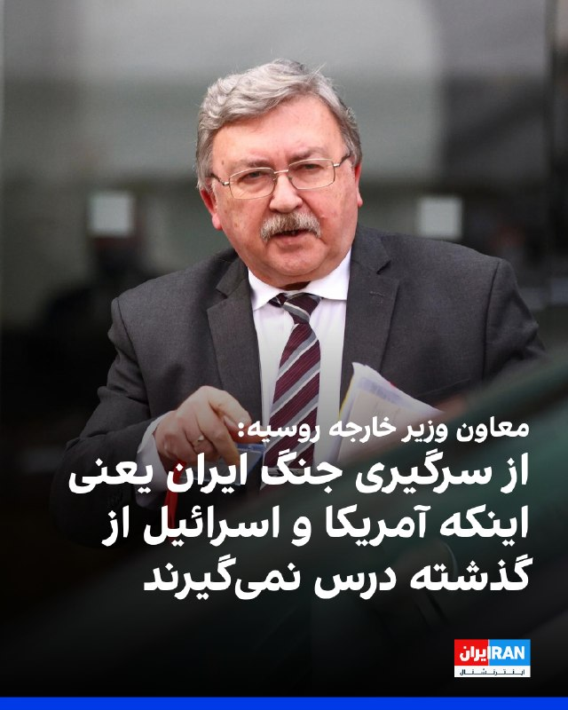

میخائیل اولیانوف، نماینده روسیه در سازمان‌های بین‌المللی با اشاره به قریب‌الوقوع بودن ازسرگیری احتمالی حملات علیه جمهوری اسلامی در ایکس نوشت: «اگر این موضوع درست باشد، به این معناست که آمریکا و اسرائیل از اشتباهات راهبردی گذشته خود درس نمی‌گیرند.»
‌🏁 🇬🇧 IranintlTV

🤖 @VahidOOnLine

## VahidOOnLine — post 240538

  

♦️دونالد ترامپ، رئیس‌جمهوری آمریکا، با انتشار یک طرح گرافیکی در حساب کاربری خود در شبکه اجتماعی تروث سوشال نوشت: «این آرامش پیش از طوفان بود.»
در این تصویر گرافیکی، ترامپ به همراه یک فرمانده نظامی آمریکایی بر روی عرشه یک ناو جنگی در میان دریایی مواج ایستاده است؛ در حالی که یک شناور دیگر در محاصره ناوهای جنگی ایالات متحده قرار دارد.
‌🇸🇦 Indypersian

🤖 @VahidOOnLine

## VahidOOnLine — post 240537

  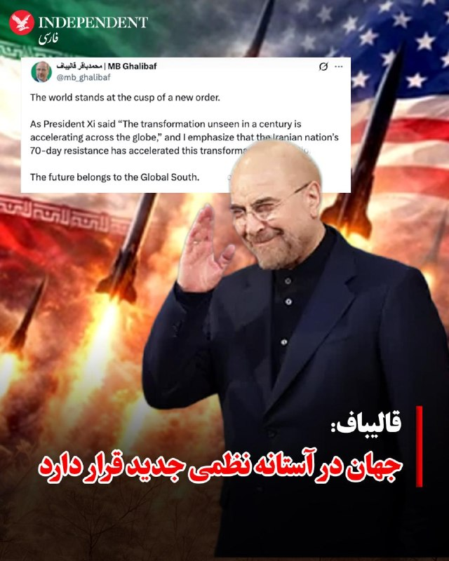

♦️محمدباقر قالیباف، رئیس مجلس شورای اسلامی،با انتشار پیامی در شبکه اجتماعی اکس نوشت که جهان در آستانه نظمی جدید قرار دارد
قالیباف با استناد به سخنان شی جین‌پینگ، رئیس‌جمهوری چین، مبنی بر این‌که «تحولات بی‌سابقه در یک قرن گذشته در حال شتاب گرفتن است»، تاکید کرد که مقاومت ۷۰ روزه ملت ایران این روند تحول را سرعت بخشیده است. رئیس مجلس شورای اسلامی در پایان پیام خود خاطرنشان کرد که آینده جهان به «جنوب جهانی» تعلق دارد.
‌🇸🇦 Indypersian

🤖 @VahidOOnLine

## WithYashar — post 11428

  <a href="telegram/content/WithYashar_11428_1778968840.mp4" target="_blank">🎬 Download video</a>

انفجار سنگین در بیت شمس و دیده شدن ابر قارچی گزارش شده که در کارخانه شرکت تومر رخ داد. این شرکت موتورهای موشک سنگین و سبک، از جمله موتورهای پیشران موشک‌های ارو ۲ و ارو ۳، موتور موشک هدف سیلور انکر، موتورهای ماهواره هورایزن و موتورهای موشک باراک ۸ و باراک ام‌ایکس را توسعه و تولید می‌کند.
@withyashar

## WithYashar — post 11427

## WithYashar — post 11426

  <a href="telegram/content/WithYashar_11426_1778968842.mp4" target="_blank">🎬 Download video</a>

امشب بیداریم !
@withyashar

## WithYashar — post 11424

‏ جیمی دیمون، مدیرعامل جی‌پی‌مورگان چیس، درباره ایران:

‏آنها ۴۷ سال است که تجاوز، قتل و کشتار می‌کنند. دنیای غرب اجازه جنگ‌های نیابتی را داد.
‏ما درس عبرت گرفتیم - باید سال‌ها پیش به سراغ سر مار می‌رفتیم.
@withyashar

## WithYashar — post 11423

  

محمد امین صابرکار، دانش‌آموز ۱۷ ساله بسیجی بوشهری،‌ حین انجام تمرینات تیراندازی اشتباها با آتش خودی(فرندلی فایر😬) کشته شد
@withyashar

## pm_afshaa — post 90875

بیرانوند : با صدای بلند و رسا کف آمریکا سرود ملی رو می‌خونم. مخالفا هم نمی‌تونن کاری بکنن

💧 Rainbet.com the #1 Non-KYC Crypto Casino & Sportsbook @rainbetcom

😁 @Pm_Afshaa

## IranIntlTV — post 337538

  <a href="telegram/content/IranIntlTV_337538_1778968844.mp4" target="_blank">🎬 Download video</a>

نیویورک‌تایمز گزارش داد دستیاران دونالد ترامپ در حال آماده‌سازی طرح‌هایی برای از سرگیری حملات نظامی علیه جمهوری اسلامی هستند.

دو مقام خاورمیانه‌ای نیز به این روزنامه گفته‌اند احتمال دارد این حملات از اوایل هفته آینده آغاز شود.

گفت‌وگو با امیر گیتی، عضو تحریریه ایران‌اینترنشنال
@iranintltv

## IranIntlTV — post 337537

  <a href="telegram/content/IranIntlTV_337537_1778968845.mp4" target="_blank">🎬 Download video</a>

دونالد ترامپ، رییس‌جمهوری آمریکا، روز شنبه ۲۶ اردیبهشت، در شبکه اجتماعی تروث سوشال انیمیشنی منتشر کرد که در آن به یک ناو جنگی آمریکا دستور می‌دهد به هواپیمایی با پرچم جمهوری اسلامی شلیک کند و می‌گوید: «بسیار خب، آن را در دیدرس داریم. آتش!»

## IranIntlTV — post 337536

  <a href="telegram/content/IranIntlTV_337536_1778968848.mp4" target="_blank">🎬 Download video</a>

مراد ویسی، تحلیل‌گر ارشد سیاسی، گفت: «ترامپ پس از سفر چین گزینه‌های مختلفی در برابر جمهوری اسلامی دارد. از تشدید فشار محاصره به امید توافق تا عملیات محدود در تنگه هرمز و خلیج فارس و در نهایت حملات گسترده و هدف قراردادن لایه دیگری از مقامات و فرماندهان ارشد سپاه پاسداران.»
@iranintltv

## IranIntlTV — post 337535

  

میخائیل اولیانوف، نماینده روسیه در سازمان‌های بین‌المللی با اشاره به قریب‌الوقوع بودن ازسرگیری احتمالی حملات علیه جمهوری اسلامی در ایکس نوشت: «اگر این موضوع درست باشد، به این معناست که آمریکا و اسرائیل از اشتباهات راهبردی گذشته خود درس نمی‌گیرند.»
https://iranintl.com/202605163047

## IranIntlTV — post 337534

  <a href="telegram/content/IranIntlTV_337534_1778968850.mp4" target="_blank">🎬 Download video</a>

مراد ویسی، تحلیل‌گر ارشد ایران‌اینترنشنال، گفت: «شاهزاده رضا پهلوی روز شنبه در نشستی درباره آینده تکنولوژی در ایران، بر غیرقابل‌اصلاح بودن جمهوری اسلامی و وجود اتفاق‌نظر ملی برای سرنگونی آن تاکید کرد و گفت سیاست مماشات با حکومت نتیجه‌ای نخواهد داشت.»
@iranintltv

## IranIntlTV — post 337533

  <a href="telegram/content/IranIntlTV_337533_1778968852.mp4" target="_blank">🎬 Download video</a>

مراد ویسی، تحلیل‌گر ارشد ایران‌اینترنشنال، گفت: «اکثریت مردم در صورت شروع جنگ جدید امیدوارند که این جنگ به سرنگونی جمهوری اسلامی منتج شود. اکثریت مردم از حمله به ساختارهای سرکوب و هدف قرار گرفتن مقامات و فرماندهان سرکوبگر حمایت می‌کنند.»
@iranintltv

## IranIntlTV — post 337532

  <a href="telegram/content/IranIntlTV_337532_1778968854.mp4" target="_blank">🎬 Download video</a>

بلومبرگ گزارش داد توقف صادرات نفت ایران از خارک به احتمال زیاد ناشی از لکه نفتی ایجادشده اطراف این جزیره است.

بنابر این گزارش، تولید نفت ایران نسبت به پیش از جنگ روزانه نیم‌میلیون بشکه کاهش یافته است.

گفت‌وگو با مهدی مصلحی، کارشناس بازار نفت
@iranintltv

## IranIntlTV — post 337531

  <a href="telegram/content/IranIntlTV_337531_1778968856.mp4" target="_blank">🎬 Download video</a>

🔻ماتیاس گرافستروم، دبیرکل فیفا پس از جلسه با مهدی تاج، رییس فدراسیون فوتبال ایران درباره گفت: «نشست بسیار خوبی با فدراسیون فوتبال ایران داشتیم. فکر می‌کنم بسیار نزدیک با یکدیگر همکاری می‌کنیم و مشتاقانه منتظر استقبال از آن‌ها در جام جهانی ۲۰۲۶ در آمریکا، کانادا و مکزیک هستیم.»

🔹او گفت: «همچنین فرصت داشتیم درباره برخی مسائل اجرایی صحبت کنیم؛ همان‌طور که با تمام فدراسیون‌های عضو این کار را انجام می‌دهیم.»

🔹دبیرکل فیفا در پاسخ به سوالی درباره تضمین‌های مورد نظر فدراسیون فوتبال ایران برای ویزا و ورود تیم ملی به آمریکا و کانادا گفت: «فکر می‌کنم اینجا جای مطرح کردن جزئیات نیست. مشتاق ادامه گفت‌وگوها هستیم. درست مانند گفت‌وگوهایی که با همه فدراسیون‌های عضو داریم.»

🔹همچنین تاج درباره این جلسه گفت: «جلسه خیلی خوبی بود؛ ۱۰ موردی که گفته بودیم را شنیدند و برای هر کدام راه حل‌هایی ارائه کردند. امیدوارم که تیم ملی به جام جهانی برود و نتایج خوبی بگیرد.»

🔹تاج پیش‌تر گفته بود اگر فیفا به فدراسیون فوتبال ضمانت‌های لازم را ندهد، تیم ملی در جام جهانی حاضر نخواهد شد.

🔹جزییات بیشتر را در سایت بخوانید

@iranintltvsport

## IranIntlTV — post 337530

  <a href="telegram/content/IranIntlTV_337530_1778968858.mp4" target="_blank">🎬 Download video</a>

کانال ۱۲ اسرائیل به نقل از یک مقام این کشور گزارش داد دونالد ترامپ ظرف ۲۴ ساعت آینده درباره حمله دوباره به ایران تصمیم خواهد گرفت.

این مقام همچنین گفته جنگ دوباره با جمهوری اسلامی نزدیک است.

گفت‌وگو با بن سبطی، پژوهشگر ایران و اسرائیل
@iranintltv

## Shin_Persian — post 6043

  

🔁 Quoting above tweet:
Shin ✓ @hey_itsmyturn
Sat, 16 May 2026 21:25:20 UTC

President Trump @POTUS:
"https://x.com/lauraloomer/status/2055609922935496847?s=42"

فارسی

رئیس‌جمهور ترامپ @POTUS:
"https://x.com/lauraloomer/status/2055609922935496847?s=42"

𝕏 · @shin_persian

## Shin_Persian — post 6042

  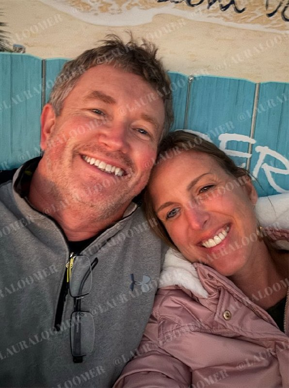

↩️ Quoted tweet: Laura Loomer ✓ @LauraLoomer Sat, 16 May 2026 11:22:51 UTC EXCLUSIVE: 🚨 Congressman Randy Fine @RepFine tells me he was approached by Cynthia West @Cyntaxed007 (Thomas Massie’s accuser) last year in Florida about Thomas Massie’s @RepThomasMassie…

## Shin_Persian — post 6041

↩️ Quoted tweet:
Laura Loomer ✓ @LauraLoomer
Sat, 16 May 2026 11:22:51 UTC

EXCLUSIVE:

🚨 Congressman Randy Fine @RepFine tells me he was approached by Cynthia West @Cyntaxed007 (Thomas Massie’s accuser) last year in Florida about Thomas Massie’s @RepThomasMassie alleged financial ties to Iran. 🚨

Rep. Randy Fine revealed to me that he met Thomas

↩️ توییت نقل‌قول شده — برای پاسخ، پست زیر را ببینید.

فارسی

اختصاصی:

🚨 رندی فاین @RepFine، عضو کنگره، به من گفت که سال گذشته در فلوریدا، سینتیا وست @Cyntaxed007 (متهم‌کننده توماس ماسی) در مورد پیوندهای مالی ادعایی توماس ماسی @RepThomasMassie با ایران به او مراجعه کرده است. 🚨

نماینده رندی فاین برای من فاش کرد که با توماس ملاقات کرده است...

𝕏 · @shin_persian

## ManotoTV — post 105539

  <a href="telegram/content/ManotoTV_105539_1778968861.mp4" target="_blank">🎬 Download video</a>

‌
شاهزاده رضا پهلوی در «نشست آینده تکنولوژی در ایران» گفت اقتصاد آینده ایران نباید بر پایه نفت، بلکه بر مبنای سرمایه‌گذاری داخلی و خارجی و نقش پررنگ بخش خصوصی شکل بگیرد.

او با تاکید بر اهمیت سرمایه‌گذاری در فناوری، هوش مصنوعی، انرژی‌های تجدیدپذیر و گردشگری گفت ایران ظرفیت آن را دارد که از صنعت گردشگری حتی بیش از نفت و گاز درآمد داشته باشد.

شاهزاده رضا پهلوی افزود توسعه زیرساخت‌هایی مانند فرودگاه‌ها، جاده‌ها، هتل‌ها و رسیدگی به مسائل زیست‌محیطی می‌تواند ایران را به مقصدی جذاب برای گردشگران تبدیل کند.

او همچنین با اشاره به محرومیت مناطقی مانند سیستان‌ و بلوچستان و بخش‌هایی از کردستان گفت این مناطق به دلیل تبعیض مذهبی جمهوری اسلامی مورد بی‌توجهی قرار گرفته‌اند، اما با جذب سرمایه‌گذاری می‌توانند به‌سرعت متحول شوند.

شاهزاده رضا پهلوی تاکید کرد ارائه چشم‌اندازی روشن برای بازسازی ایران پس از آزادی سیاسی، یکی از مهم‌ترین چالش‌ها و پروژه‌های پیش‌روی مخالفان جمهوری اسلامی است.

## FarsiVOA — post 217932

🔺مهدی تاج با دبیرکل فیفا «در ترکیه» درباره حضور در «جام جهانی» گفت‌وگو کرد

▪️بر اساس گزارش‌ها، مهدی تاج رئیس فدراسیون فوتبال جمهوری اسلامی با دبیرکل فیفا ماتیاس گرافستروم، در زمینه بررسی شرایط حضور تیم فوتبال ایران در جام‌جهانی در ترکیه گفت‌وگو کرد.

⬇️ بیشتر بخوانید:
https://ir.voanews.com/a/8150726.html
@FarsiVOA

## Persian_Trend_Official — post 14279

🔴انفجار بزرگ در بیت‌شمش 💢رسانه‌های عبری از وقوع انفجاری بسیار بزرگ در بیت‌شمش در اسرائیل خبر می‌دهند. 💢این رسانه‌ها با بیان اینکه ارتش مانع از ورود خودروهای امدادی به محل حادثه می‌شود، تصریح کردند این انفجار احتمالاً در تأسیساتی حساس رخ داده است. 🫆:Tony…

## IranianMinds — post 20261

  <a href="telegram/content/IranianMinds_20261_1778968863.mp4" target="_blank">🎬 Download video</a>

🔴 علیرضا بیرانوند :

سرود جمهوری اسلامی رو با صدای بلند میخونم و مخالفا هم هیچ کاری نمیتونن بکنن

@IranianMinds

## IranianMinds — post 20260

  

🔴 کاخ سفید :

هیچ بازی ای در کار نیست ، اگر به آمریکایی ها آسیبی برسانید یا برنامه ای برای این کار داشته باشید ما شمارو پیدا میکنیم و میکشیم !

@IranianMinds

## Dirty_Kids — post 389585

‏شاباش های دهه هفتاد هشتاد اینطوری بود که طرف میگفت حالا که دارم هزینه میکنم بذارم دهنش.

@Dirty_Kids 👻

## Dirty_Kids — post 389581

  <a href="telegram/content/Dirty_Kids_389581_1778968866.mp4" target="_blank">🎬 Download video</a>

🔴 تصاویر وایرال شده از یه خانم اهل انگلیس که خواستارِ اخراج مهاجرین از این کشوره.

+ ارزش دانلود: 195 از 100

@Dirty_Kids 👻

## manototv — post 105539

  <a href="telegram/content/manototv_105539_1778968866.mp4" target="_blank">🎬 Download video</a>

‌
شاهزاده رضا پهلوی در «نشست آینده تکنولوژی در ایران» گفت اقتصاد آینده ایران نباید بر پایه نفت، بلکه بر مبنای سرمایه‌گذاری داخلی و خارجی و نقش پررنگ بخش خصوصی شکل بگیرد.

او با تاکید بر اهمیت سرمایه‌گذاری در فناوری، هوش مصنوعی، انرژی‌های تجدیدپذیر و گردشگری گفت ایران ظرفیت آن را دارد که از صنعت گردشگری حتی بیش از نفت و گاز درآمد داشته باشد.

شاهزاده رضا پهلوی افزود توسعه زیرساخت‌هایی مانند فرودگاه‌ها، جاده‌ها، هتل‌ها و رسیدگی به مسائل زیست‌محیطی می‌تواند ایران را به مقصدی جذاب برای گردشگران تبدیل کند.

او همچنین با اشاره به محرومیت مناطقی مانند سیستان‌ و بلوچستان و بخش‌هایی از کردستان گفت این مناطق به دلیل تبعیض مذهبی جمهوری اسلامی مورد بی‌توجهی قرار گرفته‌اند، اما با جذب سرمایه‌گذاری می‌توانند به‌سرعت متحول شوند.

شاهزاده رضا پهلوی تاکید کرد ارائه چشم‌اندازی روشن برای بازسازی ایران پس از آزادی سیاسی، یکی از مهم‌ترین چالش‌ها و پروژه‌های پیش‌روی مخالفان جمهوری اسلامی است.

## alonews — post 120499

  <a href="telegram/content/alonews_120499_1778968868.mp4" target="_blank">🎬 Download video</a>

👈یادی کنیم از حضور غرور انگیز بیرانوند در دایرکت یک مدل معروف

✅ @AloNews خبر جنگ

## alonews — post 120498

  <a href="telegram/content/alonews_120498_1778968871.webm" target="_blank">🎬 Download video</a>

👈بیرانوند : با صدای بلند و رسا کف آمریکا سرود جمهوری اسلامی ایران رو می‌خونم. مخالفا هم نمی‌تونن کاری بکنن

✅ @AloNews خبر جنگ

## alonews — post 120497

  <a href="telegram/content/alonews_120497_1778968871.webm" target="_blank">🎬 Download video</a>

👈علم الهدی: تو آمریکا 9میلیون آمریکایی پرچم ایران رو دستشون گرفتن

✅ @AloNews خبر جنگ

## alonews — post 120496

  <a href="telegram/content/alonews_120496_1778968871.webm" target="_blank">🎬 Download video</a>

👈شبکه GB News ادعا می‌کند که نخست‌وزیر کیر در حال آماده‌سازی جدول زمانی استعفا است

✅ @AloNews خبر جنگ

## alonews — post 120495

  <a href="telegram/content/alonews_120495_1778968871.webm" target="_blank">🎬 Download video</a>

👈کاربران فضای‌مجازی گفته‌اند که این انفجار بدون هیچ هشدار قبلی به ساکنان مناطق اطراف صورت گرفته است.

🔴کاربران فضای‌مجازی گفته‌اند که سوال‌های بی‌پاسخ زیادی دربارۀ این حادثه وجود دارد

✅ @AloNews خبر جنگ

## alonews — post 120494

  <a href="telegram/content/alonews_120494_1778968872.webm" target="_blank">🎬 Download video</a>

👈مجری صدا وسیما : خواهش می‌کنم سلام من رو به مجتبی خامنه‌ای برسونید.

🔴حدادعادل: والا منم به دامادم دسترسی ندارم، از همین‌جا بهش سلام می‌رسونم.

✅ @AloNews خبر جنگ

---
📅 بروزرسانی: 1405/02/27 00:29
---

## VahidOOnLine — post 240536

  

♦️کانال تلگرامی وابسته به سپاه از راه‌اندازی سامانه بیمه ایرانی «هرمز سیف» برای محموله‌های دریایی تنگه هرمز خبر داد
سپاه پاسداران با انتشار مطلبی اعلام کرد تارنمای «هرمز سیف» (Hormuz Safe) فعالیت خود را برای ارائه بیمه به محموله‌های دریایی عبوری از تنگه هرمز آغاز کرده است.
بر اساس توضیحات منتشرشده،، این سامانه بیمه‌نامه‌هایی سریع و با قابلیت تایید رمزنگاری‌شده برای محموله‌هایی که از خلیج فارس، تنگه هرمز و آبراه‌های اطراف آن عبور می‌کنند صادر می‌کند. همچنین طبق اطلاعات منتشرشده، تسویه و پرداخت هزینه‌های این بیمه با استفاده از ارز دیجیتال انجام خواهد شد.
پیش از این نیز مجلس طرح‌هایی را برای دریافت عوارض از کشتی‌های عبوری مطرح کرده بود؛ موضوعی که با اعتراض گسترده جامعه جهانی و بحث‌های حقوقی فراوان همراه شد. اما اکنون با ایجاد پیگیری طرح غیرنظامی مانند «بیمه هرمز»، به دنبال جایگزینی برای اخذ عوارض است.
‌🇸🇦 Indypersian

🤖 @VahidOOnLine

## VahidOOnLine — post 240535

  <a href="telegram/content/VahidOOnLine_240535_1778965194.mp4" target="_blank">🎬 Download video</a>

‌
دولت دونالد ترامپ معافیت تحریمی خرید نفت دریایی روسیه را که پس از جنگ آمریکا و اسرائیل با جمهوری اسلامی و بسته شدن تنگه هرمز صادر شده بود، تمدید نکرد.

این معافیت به کشورهایی از جمله هند اجازه می‌داد به خرید نفت روسیه ادامه دهند و برای یک ماه تمدید شده بود، اما روز شنبه به پایان رسید.

اسکات بسنت، وزیر خزانه‌داری آمریکا، پیش‌تر گفته بود این مجوز تمدید نخواهد شد. تا عصر شنبه نیز هیچ تمدیدی در وب‌سایت وزارت خزانه‌داری آمریکا منتشر نشد.
‌🏁 🇬🇧 ManotoTV

🤖 @VahidOOnLine

## VahidOOnLine — post 240534

  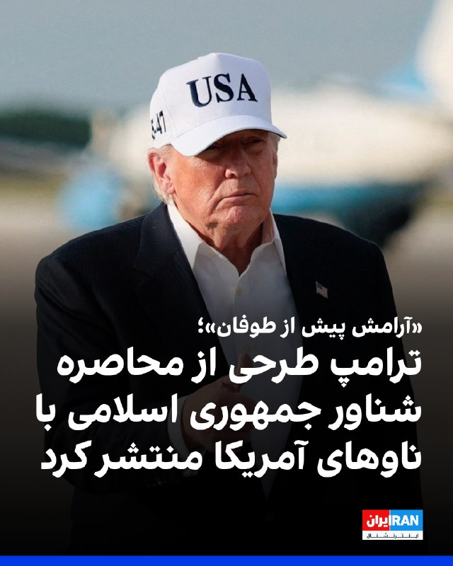

دونالد ترامپ، رییس‌جمهوری آمریکا، طرحی گرافیکی در تروث سوشال منتشر کرد که در آن روی یک ناو در دریایی مواج ایستاده و شناوری با پرچم جمهوری اسلامی در محاصره ناوهای آمریکایی قرار دارد و در آن نوشته شده است: «این آرامش پیش از طوفان بود.»
‌🏁 🇬🇧 IranintlTV

🤖 @VahidOOnLine

## VahidOOnLine — post 240533

  

شاهزاده رضا پهلوی در نشست آینده تکنولوژی در ایران گفت که مردم ایران به چیزی جز تغییر کامل نظام رضایت نخواهند داد: «آن‌ها ۴۰ هزار کشته نداده‌اند که در نهایت به توافق اتمی برسند.»

شاهزاده رضا پهلوی افزود: «اتکای مخالفان نظام نباید به نیروی خارجی باشد و باید فرض را بر این گذاشت که کمکی دریافت نمی‌شود اما در صورت دریافت حمایت خارجی روند دستیابی به اهداف آسان‌تر خواهد شد.»
‌🏁 🇬🇧 IranintlTV

🤖 @VahidOOnLine

## WithYashar — post 11422

@withyashar فرهنگ ما همیشه غالب میشه

## WithYashar — post 11421

  <a href="telegram/content/WithYashar_11421_1778965196.mp4" target="_blank">🎬 Download video</a>

گوش جان میسپریم به فریدون عزیز تا من موتورم رو گرم کنم ویس بزارم
@withyashar

## WithYashar — post 11420

  

ترامپ در تروث : آرامش فبل از طوفان

قایق تندرو با پرچم جمهوری اسلامی دیده میشود …
@withyashar

## mwarmonitor — post 9178

🔴ساکنان نزدیک منطقه بیت‌شمش در اسرائیل از یک انفجار شدید و آتش‌سوزی بزرگی خبر دادند که از فاصله دور قابل مشاهده بود. 🔸شبکه Kan News اسرائیل بعداً اعلام کرد که این حادثه یک انفجار کنترل‌شده بوده که داخل یک کارخانه غیرنظامی انجام شده است. هیچ آسیب یا مجروحیتی…

## mwarmonitor — post 9177

  <a href="telegram/content/mwarmonitor_9177_1778965199.mp4" target="_blank">🎬 Download video</a>

🔴ساکنان نزدیک منطقه بیت‌شمش در اسرائیل از یک انفجار شدید و آتش‌سوزی بزرگی خبر دادند که از فاصله دور قابل مشاهده بود.

🔸شبکه Kan News اسرائیل بعداً اعلام کرد که این حادثه یک انفجار کنترل‌شده بوده که داخل یک کارخانه غیرنظامی انجام شده است. هیچ آسیب یا مجروحیتی گزارش نشده است.

@mwarmonitor

## mwarmonitor — post 9176

  

ترامپ در سوشال تروث

«این آرامشِ پیش از طوفان بود»

@mwarmonitor

## mwarmonitor — post 9175

  <a href="telegram/content/mwarmonitor_9175_1778965201.mp4" target="_blank">🎬 Download video</a>

📝 این جرثومه‌های فساد و دوزیستانِ بدنامِ سیاسی، دقیقاً مانند هم‌نوعانِ لجن‌زیستِ خود، تا بوی واریزِ جیره و مواجب به مشامشان می‌رسد، از سوراخ‌های خود بیرون می‌خزند تا با چند کلمه وقاحتِ محض، بقایِ ذلت‌بارشان را تمدید کنند. تویی که امروز پشت این میکروفونِ اجاره‌ای ژستِ مقتدرانه گرفته‌ای و از موضعِ قدرت سخن از «اجازه دادن» می‌گویی، خودت مگر بدون اذن، فرمان‌برداری و دست‌بوسیِ سردارانت تواناییِ یک دم و بازدمِ ساده را داری؟

🔸​تو نیز تن‌فروشِ فکریِ دیگری در بازارِ مکارهٔ این رژیم هستی؛ یک جیره‌خوارِ حقیر که تاریخ مصرفت به تار مویی بند است. اگر فردا روزی ورق برگردد، دست‌پرورده‌های همان سیستمی که امروز برایشان دم می‌جنبانی، مانند آن ماله کشِ اعظم، عراقچی، چنان شلنگِ تخلیهٔ رسوایی، نکبت و فاضلابِ جنایاتشان را روی سر و صورتت باز می‌کنند که حتی نامت هم در تاریخِ این سرزمین مایهٔ تهوع باشد. این پانتومیمِ وقاحت و این نقاب‌های مضحک دیگر هیچ چشمی را نمی‌فریبد؛ سهم تو و امثال تو از این نمایش، تلی از خاکستر و سقوط به همان سیاه‌چالی است که از آن برخاسته‌اید.

@mwarmonitor

## pm_afshaa — post 90874

🔴دیلی میل بریتانیا: کیر استارمر به نزدیکانش گفته است که قصد دارد از سمت نخست‌وزیری کناره‌گیری کند و جدول زمانی منظمی برای ترک این سمت تعیین کند

💧 Rainbet.com the #1 Non-KYC Crypto Casino & Sportsbook @rainbetcom

😁 @Pm_Afshaa

## pm_afshaa — post 90873

🔴نیویورک تایمز به نقل از مقامات نظامی آمریکا: اگر جزیره خارک تصرف شود، نیروهای زمینی برای حفظ آن لازم خواهند بود

💧 Rainbet.com the #1 Non-KYC Crypto Casino & Sportsbook @rainbetcom

😁 @Pm_Afshaa

## pm_afshaa — post 90872

  <a href="telegram/content/pm_afshaa_90872_1778965202.webm" target="_blank">🎬 Download video</a>

سرور اختصاصی NPV / V2RayNG 
📶 
✅مناسب: یوتیوب | اینستاگرام | تلگرام | گیم | وب‌گردی 
✅ اتصال سریع روی همه اپراتورها 
✅بدون افت سرعت حتی در ساعات شلوغ 
➕ ویژگی‌ها: 
⚡️ بدون ضریب 
⚡️ ساب لینک اختصاصی 
⚡️بدون قطعی واقعی 
⚡️ آیپی ثابت (ترکیه 
🇹🇷 | آلمان
🇩🇪…

## pm_afshaa — post 90871

  <a href="telegram/content/pm_afshaa_90871_1778965203.webm" target="_blank">🎬 Download video</a>

سرور اختصاصی NPV / V2RayNG 
📶

✅مناسب: یوتیوب | اینستاگرام | تلگرام | گیم | وب‌گردی

✅ اتصال سریع روی همه اپراتورها

✅بدون افت سرعت حتی در ساعات شلوغ

➕ ویژگی‌ها:

⚡️ بدون ضریب

⚡️ ساب لینک اختصاصی

⚡️بدون قطعی واقعی

⚡️ آیپی ثابت (ترکیه 
🇹🇷 | آلمان
🇩🇪 | آمریکا
🇺🇸 | هلند
🇳🇱 | انگلستان
🏴)

⚡️تست رایگان قبل خرید

✔️ تضمین کیفیت + پشتیبانی 24 ساعته

💰 تک لوکیشن: 160 تومان / هر گیگ (با کد تخفیف)

🌍 مولتی لوکیشن: 200 تومان / هر گیگ (با کد تخفیف)

🎁 کد تخفیف :

conquestback

👇 همین الان بخر / تست بگیر:
@ConQuestVPN_bot

## pm_afshaa — post 90870

  

کاخ سفید پیامی تهدیدآمیز از ترامپ با عنوان «شوخی نداریم» همراه با تصویری از حضور او در اتاق جنگ منتشر کرد

💧 Rainbet.com the #1 Non-KYC Crypto Casino & Sportsbook @rainbetcom

😁 @Pm_Afshaa

## pm_afshaa — post 90868

  

پست جدید ترامپ ارامش قبل از طوفان

💧 Rainbet.com the #1 Non-KYC Crypto Casino & Sportsbook @rainbetcom

😁 @Pm_Afshaa

## VahidOnline — post 75507

  

دونالد ترامپ، رئیس‌جمهور آمریکا، روز شنبه تصویری گرافیکی از خود در کنار یک فرمانده نظامی بر عرشه یک ناو جنگی، در فضایی طوفانی و در میان شناورهایی با پرچم جمهوری اسلامی، در شبکه اجتماعی تروث‌سوشال منتشر کرد که روی آن نوشته است: «این آرامش پیش از طوفان بود.»
@VahidOOnLine

📡 @VahidOnline

## kianmeli1 — post 87438

  <a href="telegram/content/kianmeli1_87438_1778965205.mp4" target="_blank">🎬 Download video</a>

🔴ناصر رفیعی، سخنران مذهبی دفتر علی خامنه‌ای، رهبر کشته‌شده جمهوری اسلامی، به نقل از غلامعلی حداد عادل، پدرزن مجتبی خامنه‌ای، گفت اعضای خانواده علی خامنه‌ای پیش از عملیات مرگبار نهم اسفند در مجتمع رهبری باقی ماندند، زیرا مقامات «اطمینان داده بودند» که با نزدیک شدن توافق در مذاکرات، هیچ اقدام نظامی صورت نخواهد گرفت.
رفیعی در این فایل صوتی به نقل از حداد عادل می‌گوید که این اتفاق به‌ این دلیل افتاد که شرایط عادی در بیت بود و «خامنه‌ای خود را در معرض قرار داده بود.»
https://t.me/kianmeli1

## kianmeli1 — post 87437

  

🔴خبرنگار فاکس نیوز: ترامپ درحال آماده‌شدن برای دور جدیدی از حملات نظامی به ایران است
https://t.me/kianmeli1

## kianmeli1 — post 87436

  

🔴ترامپ در سوشال تروث

«این آرامشِ پیش از طوفان بود»
https://t.me/kianmeli1

## IranIntlTV — post 337529

  

دونالد ترامپ، رییس‌جمهوری آمریکا، طرحی گرافیکی در تروث سوشال منتشر کرد که در آن روی یک ناو در دریایی مواج ایستاده و شناوری با پرچم جمهوری اسلامی در محاصره ناوهای آمریکایی قرار دارد و در آن نوشته شده است: «این آرامش پیش از طوفان بود.»
https://iranintl.com/202605167228

## IranIntlTV — post 337528

  <a href="telegram/content/IranIntlTV_337528_1778965208.mp4" target="_blank">🎬 Download video</a>

شاهزاده رضا پهلوی در نشست «آینده تکنولوژی در ایران» با رد مشروعیت ساختار سیاسی جمهوری اسلامی و چهره‌هایی چون محمدباقر قالیباف گفت مردم ایران این همه کشته و هزینه نداده‌اند که بار دیگر تن به «ماموریت‌های مهره‌های این حکومت» بدهند.

او تاکید کرد: «ما باید به دنیا ثابت کنیم که ملت ایران، شریک بهتری برای جامعه جهانی است تا بقایای این حکومت.»
@iranintltv

## IranIntlTV — post 337527

  <a href="telegram/content/IranIntlTV_337527_1778965210.mp4" target="_blank">🎬 Download video</a>

شاهزاده رضا پهلوی در نشست «آینده تکنولوژی در ایران» گفت حتی اگر دوران گذار با موفقیت طی شود و مردم نظام آینده را انتخاب کنند، بدون احزاب و زیرساخت سیاسی آماده، اداره کشور ممکن نخواهد بود.

او افزود: «اگر بخواهیم سیاسی فکر کنیم، اولویت نخست یک هدف ملی است؛ هدفی فراتر از چپ و راست، جمهوری‌خواه و پادشاهی‌خواه یا هر گرایش دیگر. اما وقتی وارد مرحله سیاست عملی می‌شویم، باید زیرساخت سیاسی کشور را هم فراهم کنیم. پایه‌های تحزب در ایران باید تقویت شود.»
@iranintltv

## IranIntlTV — post 337526

  <a href="telegram/content/IranIntlTV_337526_1778965212.mp4" target="_blank">🎬 Download video</a>

شاهزاده رضا پهلوی در نشست «آینده تکنولوژی در ایران» با تشریح وظایف دولت انتقالی پس از فروپاشی جمهوری اسلامی، تاکید کرد که هدف اصلی، فراهم کردن زمینه روند دموکراتیک برای تعیین شکل نهایی حکومت است. او گفت به نفع هیچ جریانی به جز «دموکراسی» موضع نخواهد گرفت.

@iranintltv

## IranIntlTV — post 337525

  

شاهزاده رضا پهلوی در نشست آینده تکنولوژی در ایران گفت که مردم ایران به چیزی جز تغییر کامل نظام رضایت نخواهند داد: «آن‌ها ۴۰ هزار کشته نداده‌اند که در نهایت به توافق اتمی برسند.»

شاهزاده رضا پهلوی افزود: «اتکای مخالفان نظام نباید به نیروی خارجی باشد و باید فرض را بر این گذاشت که کمکی دریافت نمی‌شود اما در صورت دریافت حمایت خارجی روند دستیابی به اهداف آسان‌تر خواهد شد.»
https://iranintl.com/202605161817

## Shin_Persian — post 6040

  

Shin ✓ @hey_itsmyturn
Sat, 16 May 2026 20:23:35 UTC

POTUS on his Truth:

فارسی

رئیس‌جمهور ایالات متحده (POTUS) در حساب تروث سوشال خود:

𝕏 · @shin_persian

## Shin_Persian — post 6039

  

🔁 Quoting above tweet: DefenceGeek 🇬🇧 ✓ @DefenceGeek Sat, 16 May 2026 20:14:02 UTC Along with the 2x RAF P-8A "Poseidon" maritime patrol aircraft noted by @ArmchairAdml, the US Navy has had 3x P-8A operating in the North Atlantic today I first noted 2…

## Shin_Persian — post 6038

🔁 Quoting above tweet:
DefenceGeek 🇬🇧 ✓ @DefenceGeek
Sat, 16 May 2026 20:14:02 UTC

Along with the 2x RAF P-8A "Poseidon" maritime patrol aircraft noted by @ArmchairAdml, the US Navy has had 3x P-8A operating in the North Atlantic today

I first noted 2 depart Lajes earlier, then with a friend departed Iceland in the last 2hrs!

They've found a submarine...

فارسی

در کنار ۲ فروند هواپیمای گشت دریایی P-8A "Poseidon" متعلق به نیروی هوایی سلطنتی بریتانیا (RAF) که توسط @ArmchairAdml به آن‌ها اشاره شد، نیروی دریایی ایالات متحده نیز امروز ۳ فروند P-8A در شمال اقیانوس اطلس در حال عملیات داشته است.

من ابتدا خروج ۲ فروند را پیش‌تر از «لاژس» ثبت کردم و پس از آن، یک فروند دیگر در ۲ ساعت گذشته از ایسلند خارج شد!

آن‌ها یک زیردریایی پیدا کرده‌اند...

𝕏 · @shin_persian

## Shin_Persian — post 6036

  <a href="telegram/content/Shin_Persian_6036_1778965215.mp4" target="_blank">🎬 Download video</a>

↩️ Quoted tweet: Armchair Admiral 🇬🇧 ✓ @ArmchairAdml Sat, 16 May 2026 19:59:34 UTC #RAF Royal Air Force Boeing Poseidon MRA.1 2x #43C91E ZP807 - RAFAIR 7046 #43C91A ZP803 - RAFAIR 7042 RAFAIR 7046 departed RAF Lossiemouth this evening for a North Atlantic…

## Shin_Persian — post 6035

↩️ Quoted tweet:
Armchair Admiral 🇬🇧 ✓ @ArmchairAdml
Sat, 16 May 2026 19:59:34 UTC

#RAF Royal Air Force

Boeing Poseidon MRA.1 2x
#43C91E ZP807 - RAFAIR 7046
#43C91A ZP803 - RAFAIR 7042

RAFAIR 7046 departed RAF Lossiemouth this evening for a North Atlantic patrol. RAFAIR 7042 is already on station and operating over the Atlantic.

@MATA_osint @flightradar24

↩️ توییت نقل‌قول شده — برای پاسخ، پست زیر را ببینید.

فارسی

#RAF نیروی هوایی سلطنتی بریتانیا

بوئینگ پوزایدون MRA.1 ۲ فروند
#43C91E ZP807 - RAFAIR 7046
#43C91A ZP803 - RAFAIR 7042

پرواز RAFAIR 7046 عصر امروز پایگاه هوایی لوسی‌موث (RAF Lossiemouth) را برای گشت‌زنی در شمال اقیانوس اطلس ترک کرد. پرواز RAFAIR 7042 از قبل در منطقه مستقر شده و بر فراز اقیانوس اطلس در حال عملیات است.

@MATA_osint @flightradar24_

𝕏 · @shin_persian

## ManotoTV — post 105538

  <a href="telegram/content/ManotoTV_105538_1778965217.mp4" target="_blank">🎬 Download video</a>

‌
دولت دونالد ترامپ معافیت تحریمی خرید نفت دریایی روسیه را که پس از جنگ آمریکا و اسرائیل با جمهوری اسلامی و بسته شدن تنگه هرمز صادر شده بود، تمدید نکرد.

این معافیت به کشورهایی از جمله هند اجازه می‌داد به خرید نفت روسیه ادامه دهند و برای یک ماه تمدید شده بود، اما روز شنبه به پایان رسید.

اسکات بسنت، وزیر خزانه‌داری آمریکا، پیش‌تر گفته بود این مجوز تمدید نخواهد شد. تا عصر شنبه نیز هیچ تمدیدی در وب‌سایت وزارت خزانه‌داری آمریکا منتشر نشد.

## ManotoTV — post 105537

  <a href="telegram/content/ManotoTV_105537_1778965217.mp4" target="_blank">🎬 Download video</a>

شاهزاده رضا پهلوی در پاسخ به پرسشی درباره زمان بازگشت ایرانیان خارج از کشور، در «نشست آینده تکنولوژی در ایران» گفت سرعت تغییرات در ایران به عملکرد مردم و میزان حمایت و فشار کشورهای تاثیرگذار بستگی دارد.

او با تاکید بر اینکه مردم ایران نباید به نیروی خارجی متکی باشند، گفت هرگونه حمایت بین‌المللی می‌تواند روند تغییر را کوتاه‌تر و آسان‌تر کند، اما ایرانیان خود باید عامل اصلی این تحول باشند.

شاهزاده رضا پهلوی افزود مردم ایران «چهل هزار کشته ندادند» که نتیجه آن تنها یک توافق هسته‌ای یا ادامه جمهوری اسلامی با چهره‌هایی مانند محمدباقر قالیباف باشد و تاکید کرد ایرانیان «کمتر از تغییر کامل نظام» را نخواهند پذیرفت.

شاهزاده رضا پهلوی با اشاره به دولت دونالد ترامپ گفت مخالفان جمهوری اسلامی باید دولت‌های تاثیرگذار، به‌ویژه آمریکا، را قانع کنند که به‌جای توافق دوباره با جمهوری اسلامی، روی مردم ایران سرمایه‌گذاری کنند.

او تاکید کرد راه‌حل‌های اقتصادی، علمی و تکنولوژیک برای آینده ایران وجود دارد و آنچه اکنون اهمیت دارد، «اراده سیاسی و تصمیم‌گیری» دولت‌های تاثیرگذار برای حمایت از آزادی ایران است.

## FarsiVOA — post 217931

  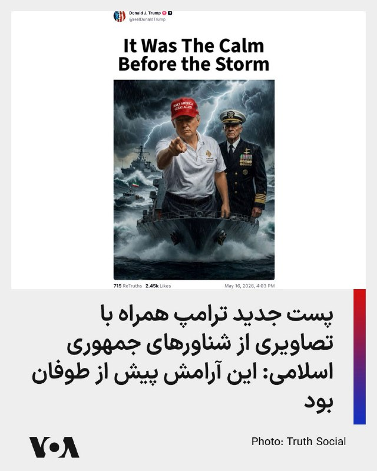

⚡️دونالد ترامپ، رئیس‌جمهوری آمریکا، روز شنبه تصویری گرافیکی از خود در کنار یک فرمانده نظامی بر عرشه یک ناو جنگی، در فضایی طوفانی و در میان شناورهایی با پرچم جمهوری اسلامی، در شبکه اجتماعی تروت‌سوشال منتشر کرد که روی آن نوشته است: «این آرامش پیش از طوفان بود.»
@FarsiVOA

## FarsiVOA — post 217930

🔺بزرگترین ناو هواپیمابر جهان پس از مشارکت در عملیات نظامی علیه جمهوری اسلامی و دستگیری مادورو به ویرجینیا بازگشت

▪️ناو هواپیمابر یو‌اس‌اس جرالد آر. فورد، بزرگترین ناو هواپیمابر جهان، روز شنبه پس از ۱۱ ماه استقرار، طولانی‌ترین مدت از زمان جنگ ویتنام، به خانه خود در ایالت ویرجینیا بازگشت.

⬇️ بیشتر بخوانید:
https://ir.voanews.com/a/8150723.html
@FarsiVOA

## Persian_Trend_Official — post 14278

  <a href="telegram/content/Persian_Trend_Official_14278_1778965219.mp4" target="_blank">🎬 Download video</a>

🔴 رسانه‌های اسرائیلی از انفجار در کارخانه صنایع موشکی «تومر» خبر دادند 💢رسانه‌های اسرائیلی گزارش دادند انفجاری در کارخانه شرکت «تومر» رخ داده است؛ شرکتی که در حوزه توسعه و تولید موتورهای موشکی و سامانه‌های پیشران فعالیت می‌کند. ▪️بر اساس گزارش‌ها، این شرکت…

## Persian_Trend_Official — post 14277

🔴انفجار بزرگ در بیت‌شمش 💢رسانه‌های عبری از وقوع انفجاری بسیار بزرگ در بیت‌شمش در اسرائیل خبر می‌دهند. 💢این رسانه‌ها با بیان اینکه ارتش مانع از ورود خودروهای امدادی به محل حادثه می‌شود، تصریح کردند این انفجار احتمالاً در تأسیساتی حساس رخ داده است. 🫆:Tony…

## Persian_Trend_Official — post 14276

  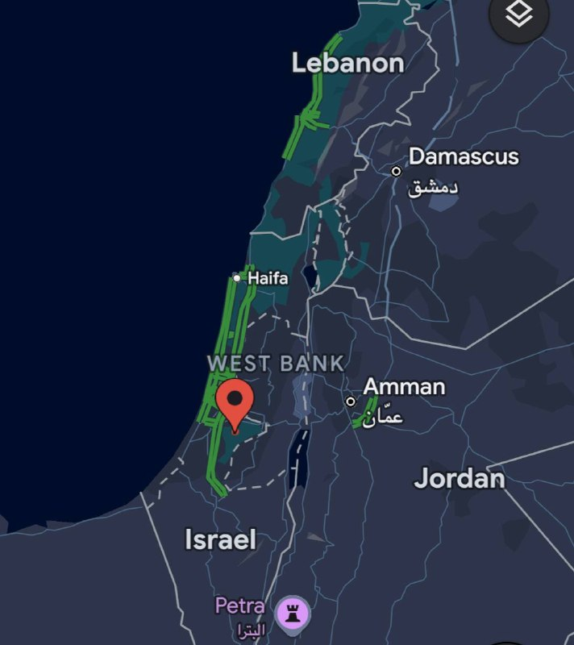

🔴انفجار بزرگ در بیت‌شمش 💢رسانه‌های عبری از وقوع انفجاری بسیار بزرگ در بیت‌شمش در اسرائیل خبر می‌دهند. 💢این رسانه‌ها با بیان اینکه ارتش مانع از ورود خودروهای امدادی به محل حادثه می‌شود، تصریح کردند این انفجار احتمالاً در تأسیساتی حساس رخ داده است. 🫆:Tony…

## Persian_Trend_Official — post 14275

  <a href="telegram/content/Persian_Trend_Official_14275_1778965221.mp4" target="_blank">🎬 Download video</a>

🔴انفجار بزرگ در بیت‌شمش

💢رسانه‌های عبری از وقوع انفجاری بسیار بزرگ در بیت‌شمش در اسرائیل خبر می‌دهند.

💢این رسانه‌ها با بیان اینکه ارتش مانع از ورود خودروهای امدادی به محل حادثه می‌شود، تصریح کردند این انفجار احتمالاً در تأسیساتی حساس رخ داده است.

🫆:Tony

📌 @persian_trend_official
پرشین ترند | متفاوت‌ترین کانال نظامی

## Persian_Trend_Official — post 14274

https://youtube.com/live/Lj3xWW7IbLA?feature=share

## Persian_Trend_Official — post 14273

  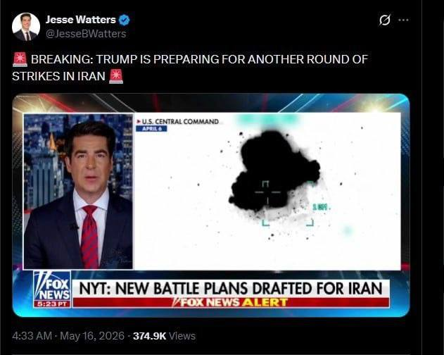

🔴خبرنگار فاکس نیوز

💢ترامپ درحال آماده‌شدن برای دور جدیدی از حملات نظامی به ایران است

🫆:Tony

📌 @persian_trend_official
پرشین ترند | متفاوت‌ترین کانال نظامی

## Persian_Trend_Official — post 14272

  

💢پست ترامپ

این آرامش قبل از طوفانه

🫆:Tony

📌 @persian_trend_official
پرشین ترند | متفاوت‌ترین کانال نظام

## Persian_Trend_Official — post 14271

  

💢تکرار تهدید کاخ سفید با انتشار تصویری از ترامپ در اتاق جنگ

💢کاخ سفید پیامی تهدیدآمیز از رئیس جمهوری آمریکا با عنوان «شوخی نداریم» همراه با تصویری از حضور او در اتاق جنگ منتشر کرد.

💢در پیام کاخ سفید آمده است: «اگر به آمریکایی‌ها آسیب بزنید، یا برای آسیب‌زدن به آمریکایی‌ها توطئه و طرح‌ریزی کنید، ما شما را خواهیم یافت.»

🫆:Tony

📌 @persian_trend_official
پرشین ترند | متفاوت‌ترین کانال نظامی

## Persian_Trend_Official — post 14270

  <a href="telegram/content/Persian_Trend_Official_14270_1778965224.webm" target="_blank">🎬 Download video</a>

نسخه صوتی لایو امشب در پلتفرم کست باکس : https://castbox.fm/vi/945937615

## Persian_Trend_Official — post 14269

نسخه صوتی لایو امشب در پلتفرم کست باکس :
https://castbox.fm/vi/945937615

## RadioFarda — post 157274

🔸دولت ترامپ روز شنبه ۲۶ اردیبهشت معافیت تحریم نفت روی دریای روسیه را که پیش‌تر به کشورهایی از جمله هند امکان می‌داد آن را خریداری کنند، تمدید نکرد و اجازه داد که منقضی شود. 🔸این معافیت پس از یک تمدید یک‌ماهه با هدف کاهش کمبود عرضه نفت و مهار افزایش قیمت‌ها…

## RadioFarda — post 157273

  

🔸دولت ترامپ روز شنبه ۲۶ اردیبهشت معافیت تحریم نفت روی دریای روسیه را که پیش‌تر به کشورهایی از جمله هند امکان می‌داد آن را خریداری کنند، تمدید نکرد و اجازه داد که منقضی شود.

🔸این معافیت پس از یک تمدید یک‌ماهه با هدف کاهش کمبود عرضه نفت و مهار افزایش قیمت‌ها در پی جنگ با ایران و بسته شدن تنگه هرمز، برقرار مانده بود.

🔸اسکات بسنت، وزیر خزانه‌داری آمریکا، پیش‌تر گفته بود که مجوز عمومی مربوط به خرید نفت روسیه ذخیره‌شده در نفتکش‌ها را تمدید نخواهد کرد.

🔸به گزارش خبرگزاری رویترز، تا بعدازظهر شنبه به وقت واشینگتن، هیچ اطلاعیه‌ای دربارهٔ تمدید این معافیت در وب‌سایت وزارت خزانه‌داری منتشر نشده بود. سخنگوی این وزارتخانه نیز از ارائه توضیح بیشتر خودداری کرد.

@RadioFarda

## IranianMinds — post 20259

  

🔴پست ترامپ در تروث‌سوشال:

این آرامش قبل از طوفان بود.

@IranianMinds

## IranianMinds — post 20258

  <a href="telegram/content/IranianMinds_20258_1778965226.mp4" target="_blank">🎬 Download video</a>

🔴دونالد ترامپ در تروث‌سوشال یک انیمیشنی را منتشر کرد که در آن به ناو آمریکایی دستور شلیک به هدفی که پرچم جمهوری اسلامی را دارد داده و می‌گوید در فهرست اهدافمان، آتش.

@IranianMinds

## BBCPersian — post 281241

  

‌🔻مردی در شهر مودنا در شمال ایتالیا با خودرو خود با چندین عابر پیاده برخورد و هشت نفر را زخمی کرد. حال چهار نفر از آنها وخیم گزارش شده است.

یکی از مجروحان زنی است که گفته می‌شود هر دو پایش خرد شده است.

عابران پس از تعقیب راننده خودرو، یک «مرد سی و چند ساله» را دستگیر و به پلیس تحویل دادند.

جورجیا ملونی، نخست‌وزیر ایتالیا، این واقعه را «بسیار جدی» توصیف کرد. همچنین ماسیمو مزتی، شهردار مودنا، در ادامه واکنش خانم ملونی گفت اگر مشخص شود که این یک حمله از پیش برنامه‌ریزی شده بوده، «حتی جدی‌تر» خواهد بود.

این حادثه بعد از ظهر شنبه ۱۶ مه اتفاق افتاد. یک شاهد عینی گفت: «ما دیدیم که خودرو نزدیک می‌شود، به سمت جدول می‌رفت اما ناگهان سرعت گرفت و هنگام برخورد با عابران حداقل ۱۰۰ کیلومتر در ساعت سرعت داشت و ما دیدیم که مردم در حال پرواز هستند.»

شهردار مودنا گفت به نظر می‌رسد که راننده «عمدا به پیاده‌رو رفته، به چند نفر زده و به ویترین یک مغازه کوبیده است».
به گفته شهردار مودنا، فرد بازداشت‌شده یک تبعه ایتالیایی متولد برگامو، اما «اصالتا مغربی» است.

ادامه از:
https://bbc.in/4nxF8zv
📷Reuters
@BBCPersian

## BBCPersian — post 281240

  <a href="https://t.me/bbcpersian/281240" target="_blank">📎 Download file</a>

پادکست برنامه شصت دقیقه روز شنبه ۲۶ اردیبهشت ۱۴۰۵ است
این نسخه رادیویی برنامه شصت دقیقه تلویزیون فارسی بی‌بی‌سی است که هرشب بعد از پخش، با حجم کم از اپلیکیشن‌های پادگیر و صفحه تلگرام بی‌بی‌سی فارسی در دسترس است.
با هشتگ BBCPersianRadio# با ما در ارتباط باشید.
@BBCPersian

## Dirty_Kids — post 389580

  <a href="telegram/content/Dirty_Kids_389580_1778965228.mp4" target="_blank">🎬 Download video</a>

بیرانوند گفته: سرود حکومت را با صدای بلند میخونم… مردم مخالف جمهوری اسلامی در ورزشگاه هم هیچ کاری نمیتونن بکنن!

داداشام و خواهرام در امریکا
مدیونید بزارید آب‌خوش از گلوشون پایین بره... از دم فرودگاه تا هتل، شب قبل بازی جلوی هتل و داخل استادیوم، همه بلیطا هم بخرید تا صادراتیاشون نخرن، دیگه هرکاری در توانتون بکنید خارشونو بگایید

#فوتبالیست_سپاهی

@Dirty_Kids 👻

## Dirty_Kids — post 389579

  

پست جدید ترامپ تو تروث سوشال کنار یه فرمانده نظامی و خطاب به ایران :

این تازه آرامش قبلِ طوفان بود.

مجموع گزارش‌ها، اخبار رسمی، نقل‌وانتقالات نظامی و مصاحبه‌های ترامپ و نتانیاهو در هفته گذشته، نشان می‌دهد هر لحظه باید منتظر آغاز دور جدید حملات به جمهوری اسلامی بود؛ حملاتی که می‌تواند این‌بار با پیاده کردن سربازان آمریکایی در خاک ایران نیز همراه باشد.

@Dirty_Kids 👻

## manototv — post 105538

  <a href="telegram/content/manototv_105538_1778965229.mp4" target="_blank">🎬 Download video</a>

‌
دولت دونالد ترامپ معافیت تحریمی خرید نفت دریایی روسیه را که پس از جنگ آمریکا و اسرائیل با جمهوری اسلامی و بسته شدن تنگه هرمز صادر شده بود، تمدید نکرد.

این معافیت به کشورهایی از جمله هند اجازه می‌داد به خرید نفت روسیه ادامه دهند و برای یک ماه تمدید شده بود، اما روز شنبه به پایان رسید.

اسکات بسنت، وزیر خزانه‌داری آمریکا، پیش‌تر گفته بود این مجوز تمدید نخواهد شد. تا عصر شنبه نیز هیچ تمدیدی در وب‌سایت وزارت خزانه‌داری آمریکا منتشر نشد.

## manototv — post 105537

  <a href="telegram/content/manototv_105537_1778965230.mp4" target="_blank">🎬 Download video</a>

شاهزاده رضا پهلوی در پاسخ به پرسشی درباره زمان بازگشت ایرانیان خارج از کشور، در «نشست آینده تکنولوژی در ایران» گفت سرعت تغییرات در ایران به عملکرد مردم و میزان حمایت و فشار کشورهای تاثیرگذار بستگی دارد.

او با تاکید بر اینکه مردم ایران نباید به نیروی خارجی متکی باشند، گفت هرگونه حمایت بین‌المللی می‌تواند روند تغییر را کوتاه‌تر و آسان‌تر کند، اما ایرانیان خود باید عامل اصلی این تحول باشند.

شاهزاده رضا پهلوی افزود مردم ایران «چهل هزار کشته ندادند» که نتیجه آن تنها یک توافق هسته‌ای یا ادامه جمهوری اسلامی با چهره‌هایی مانند محمدباقر قالیباف باشد و تاکید کرد ایرانیان «کمتر از تغییر کامل نظام» را نخواهند پذیرفت.

شاهزاده رضا پهلوی با اشاره به دولت دونالد ترامپ گفت مخالفان جمهوری اسلامی باید دولت‌های تاثیرگذار، به‌ویژه آمریکا، را قانع کنند که به‌جای توافق دوباره با جمهوری اسلامی، روی مردم ایران سرمایه‌گذاری کنند.

او تاکید کرد راه‌حل‌های اقتصادی، علمی و تکنولوژیک برای آینده ایران وجود دارد و آنچه اکنون اهمیت دارد، «اراده سیاسی و تصمیم‌گیری» دولت‌های تاثیرگذار برای حمایت از آزادی ایران است.

## alonews — post 120492

  <a href="telegram/content/alonews_120492_1778965232.webm" target="_blank">🎬 Download video</a>

👈رسانه‌های اسرائیلی از جمله Channel 12 گزارش داده‌اند انفجار بزرگی که در منطقه بیت شِمش دیده و شنیده شد، مربوط به فعالیت شرکت دولتی دفاعی Tomer بوده است.

🔴این شرکت سامانه‌های پیشران موشکی تولید می‌کند؛ از جمله موتور و سیستم‌های مربوط به موشک‌های رهگیر Arrow 2 و Arrow 3 که برای مقابله با موشک‌های بالستیک استفاده می‌شوند.

اما هنوز مشخص نیست چرا این انفجار ساعت ۱۱ شب شنبه انجام شده؛ مخصوصاً بعد از گزارش‌هایی که آخر هفته درباره آماده‌سازی برای حمله احتمالی به ایران منتشر شده بود.

✅ @AloNews خبر جنگ

## alonews — post 120490

  <a href="telegram/content/alonews_120490_1778965232.mp4" target="_blank">🎬 Download video</a>

👈کان نیوز: حادثه بیت شمس اسرائیل یک انفجار کنترل‌شده داخل یک کارخانه غیرنظامی بوده است.

✅ @AloNews خبر جنگ

## alonews — post 120489

  <a href="telegram/content/alonews_120489_1778965233.webm" target="_blank">🎬 Download video</a>

👈رسانه بریتانیایی امواج: این ۱۴ بند شامل خروج نظامی آمریکا از مجاورت ایران، پایان محاصره دریایی، لغو محدودیتهای فروش نفت ظرف ۳۰ روز پس از هر توافق اولیه و یک ترتیبات حاکمیتی جدید برای تنگه هرمز است. 
✅ @AloNews خبر جنگ

## alonews — post 120488

  <a href="telegram/content/alonews_120488_1778965233.webm" target="_blank">🎬 Download video</a>

👈رسانه بریتانیایی امواج: در هفته منتهی به سفر ترامپ به چین، ایران یک چارچوب ۱۴ ماده‌ای برای پایان جنگ، به واشنگتن ارائه کرد. 
🔴یک منبع ارشد سیاسی در تهران که به شرط فاش نشدن نامش صحبت میکرد، به رسانه «امواج مدیا» توضیح داد که این سند شامل ۱۱ ماده‌ای است که…

## alonews — post 120487

  <a href="telegram/content/alonews_120487_1778965233.webm" target="_blank">🎬 Download video</a>

👈رسانه بریتانیایی امواج:
در هفته منتهی به سفر ترامپ به چین، ایران یک چارچوب ۱۴ ماده‌ای برای پایان جنگ، به واشنگتن ارائه کرد.

🔴یک منبع ارشد سیاسی در تهران که به شرط فاش نشدن نامش صحبت میکرد، به رسانه «امواج مدیا» توضیح داد که این سند شامل ۱۱ ماده‌ای است که در ابتدا توسط دولت آمریکا ارائه شده بود، به اضافه سه ماده‌ای که ایران به آن افزوده است.

🔴این پیشنهاد که تا حدودی به دلیل تشدید محاصره دریایی آمریکا علیه ایران – و ظاهراً با ناراحتی ترامپ – به تأخیر افتاد، حاصل دستورات صریح به مذاکره کنندگان بود.

🔴به گفته یک منبع مطلع، پاسخ واشنگتن که از طریق میانجیگران ارسال شده، کل این چارچوب را رد کرده است. گفته می‌شود که آمریکا بار دیگر بر مواضع از پیش تعیین شده خود در مورد پرونده هسته‌ای تأکید کرده و از پذیرش این پیش‌شرط‌ها به عنوان پیش‌نیاز هرگونه مذاکره خودداری نموده است.

🔴با این حال، یک منبع سیاسی دیگر که از جزییات امور مطلع است، چنین توصیفی از وقایع را رد کرد.

✅ @AloNews خبر جنگ

## alonews — post 120485

  <a href="telegram/content/alonews_120485_1778965233.webm" target="_blank">🎬 Download video</a>

👈گزارش‌ها از انفجار و نور بسیار شدید در بیت شِمِش در اسرائیل 
✅ @AloNews خبر جنگ

## alonews — post 120484

  <a href="telegram/content/alonews_120484_1778965233.webm" target="_blank">🎬 Download video</a>

👈 رئیس‌جمهور ترامپ عکسی از خودش و شی جین‌پینگ را در Truth Social منتشر کرد.

✅ @AloNews خبر جنگ

## alonews — post 120483

  <a href="telegram/content/alonews_120483_1778965234.mp4" target="_blank">🎬 Download video</a>

👈گزارش‌ها از انفجار و نور بسیار شدید در بیت شِمِش در اسرائیل

✅ @AloNews خبر جنگ

## alonews — post 120482

  <a href="telegram/content/alonews_120482_1778965234.webm" target="_blank">🎬 Download video</a>

👈ترامپ: این آرامش قبل طوفان بود!

✅ @AloNews خبر جنگ

## alonews — post 120481

  <a href="telegram/content/alonews_120481_1778965234.webm" target="_blank">🎬 Download video</a>

👈کاخ سفید پیامی تهدیدآمیز از ترامپ با عنوان «شوخی نداریم» همراه با تصویری از حضور او در اتاق جنگ منتشر کرد.

🔴در پیام کاخ سفید آمده است: «اگر به آمریکایی‌ها آسیب بزنید، یا برای آسیب‌زدن به آمریکایی‌ها توطئه و طرح‌ریزی کنید، ما شما را خواهیم یافت.»

✅ @AloNews خبر جنگ

## alonews — post 120480

  

سال 1374، کل پاساژ علاءالدین: 500 میلیون

سال 1405، آیفون 17 پرومکس: 500 میلیون

[@AloTweet]

## alonews — post 120479

🔥 FLASH NET VPN 
🔥 
⚠️ شرایط جنگی؟ نت ملی؟ فیلترینگ سنگین؟ 
💪 ما هنوز پایدار و بدون قطعی کنار شماییم! 
🚀 پینگ خفن 
🌐 سرعت فوق‌العاده پایدار 
😍 رضایت فراوان کاربران 
🤖 ربات کاملاً خودکار 
💸 نرخ‌ها پایین‌تر از همه جا 🇧🇬 تک لوکیشن بلغارستان ♾ بدون ضریب 
🔗 دارای لینک…

## alonews — post 120478

  <a href="telegram/content/alonews_120478_1778965234.webm" target="_blank">🎬 Download video</a>

👈العربیه به نقل از پاکستان: حضور وزیر کشور پاکستان در ایران یک روز دیگر ادامه خواهد یافت تا در مورد چشم‌انداز ازسرگیری مذاکرات گفت‌وگو شود 
✅ @AloNews خبر جنگ

## alonews — post 120477

  <a href="telegram/content/alonews_120477_1778965235.webm" target="_blank">🎬 Download video</a>

👈العربیه به نقل از پاکستان: حضور وزیر کشور پاکستان در ایران یک روز دیگر ادامه خواهد یافت تا در مورد چشم‌انداز ازسرگیری مذاکرات گفت‌وگو شود

✅ @AloNews خبر جنگ

## alonews — post 120476

  <a href="telegram/content/alonews_120476_1778965235.webm" target="_blank">🎬 Download video</a>

👈سی ان ان: ترامپ بدون پیشرفت در موضوع ایران از چین بازگشت و نسبت به مذاکرات متوقف شده بی‌صبرتر می‌شود،هم اکنون ترامپ در حال بررسی گزینه های نظامی بر علیه ایران است

✅ @AloNews خبر جنگ

<!-- MSG END -->

<!-- NAV START -->

<a href="https://github.com/gitpod-test3753/aio-downloader/blob/main/telegram/content/archive_1.md" style="display:inline-block; padding:6px 12px; margin:0 4px; background-color:#2ea44f; color:white; text-decoration:none; border-radius:4px; font-weight:bold;">صفحه بعد</a>

<!-- NAV END -->
